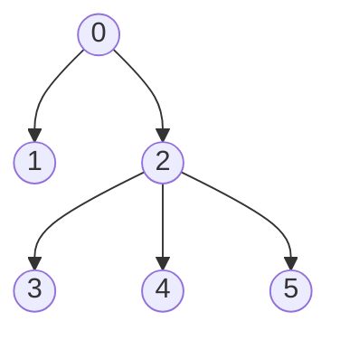

# Dynamic Programming

## [5. Longest Palindromic Substring](https://leetcode.com/problems/longest-palindromic-substring/)

- [Official](https://leetcode.com/problems/longest-palindromic-substring/editorial/)
- [Official](https://leetcode.cn/problems/longest-palindromic-substring/solutions/255195/zui-chang-hui-wen-zi-chuan-by-leetcode-solution/)

<details><summary>Description</summary>

```text
Given a string s, return the longest palindromic substring in s.

Example 1:
Input: s = "babad"
Output: "bab"
Explanation: "aba" is also a valid answer.

Example 2:
Input: s = "cbbd"
Output: "bb"

Constraints:
1 <= s.length <= 1000
s consist of only digits and English letters.
```

<details><summary>Hint</summary>

```text
1. How can we reuse a previously computed palindrome to compute a larger palindrome?
2. If “aba” is a palindrome, is “xabax” a palindrome? Similarly is “xabay” a palindrome?
3. Complexity based hint:
   If we use brute-force and check whether for every start and end position
   a substring is a palindrome we have O(n^2) start - end pairs and O(n) palindromic checks.
   Can we reduce the time for palindromic checks to O(1) by reusing some previous computation.
```

</details>

</details>

<details><summary>C</summary>

```c
#if (1)  // Dynamic Programming
char* longestPalindrome(char* s) {
    char* pRetVal = NULL;

    int returnStartIdx = 0;
    int returnSize = 0;

    /* Example: Input: s = "babad"
     *      0 1 2 3 4 |     0 1 2 3 4 |     0 1 2 3 4
     *      b a b a d |     b a b a d |     b a b a d
     *  0 b T         | 0 b T F       | 0 b T F T F F
     *  1 a   T       | 1 a   T F     | 1 a   T F T F
     *  2 b     T     | 2 b     T F   | 2 b     T F F
     *  3 a       T   | 3 a       T F | 3 a       T F
     *  4 d         T | 4 d         T | 4 d         T
     *
     * Example: Input: s = "cbbd"
     *      0 1 2 3 |     0 1 2 3 |     0 1 2 3
     *      c b b d |     c b b d |     c b b d
     *  0 c T       | 0 c T F     | 0 c T F F F
     *  1 b   T     | 1 b   T T   | 1 b   T T F
     *  2 b     T   | 2 b     T F | 2 b     T F
     *  3 d       T | 3 d       T | 3 d       T
     */
    int sSize = strlen(s);
    int dpSize = sSize;
    int dp[dpSize][dpSize];
    memset(dp, 0, sizeof(dp));
    int i, j;
    //
    for (i = 0; i < dpSize; ++i) {
        dp[i][i] = 1;
        returnStartIdx = i;
        returnSize = i - i + 1;
    }
    //
    for (i = 0; i < sSize - 1; ++i) {
        if (s[i] == s[i + 1]) {
            dp[i][i + 1] = 1;
            returnStartIdx = i;
            returnSize = (i + 1) - i + 1;
        }
    }
    //
    int diff;
    for (diff = 2; diff < sSize; ++diff) {
        for (i = 0; i < sSize - diff; ++i) {
            j = i + diff;
            if ((s[i] == s[j]) && (dp[i + 1][j - 1] == 1)) {
                dp[i][j] = 1;
                returnStartIdx = i;
                returnSize = j - i + 1;
            }
        }
    }
    //
    s[returnStartIdx + returnSize] = '\0';
    pRetVal = s + returnStartIdx;

    return pRetVal;
}
#else
char* longestPalindrome(char* s) {
    char* pRetVal = NULL;

    int len = strlen(s);
    int start = 0;
    int subLen = 0;
    int left, right;
    int i;

    // odd
    for (i = 0; i < len; ++i) {
        left = i - 1;
        right = i + 1;
        while ((left >= 0) && (right < len) && (s[left] == s[right])) {
            --left;
            ++right;
        }

        if (right - left - 1 > subLen) {
            start = left + 1;
            subLen = right - left - 1;
        }
    }

    // even
    for (int i = 0; i < len; i++) {
        left = i;
        right = i + 1;
        while ((left >= 0) && (right < len) && (s[left] == s[right])) {
            --left;
            ++right;
        }

        if (right - left - 1 > subLen) {
            start = left + 1;
            subLen = right - left - 1;
        }
    }

    s[start + subLen] = '\0';
    pRetVal = s + start;

    return pRetVal;
}
#endif
```

</details>

<details><summary>C++</summary>

```c++
class Solution {
   public:
    string longestPalindrome(string s) {
        string retVal;

        /* Example: Input: s = "babad"
         *      0 1 2 3 4 |     0 1 2 3 4 |     0 1 2 3 4
         *      b a b a d |     b a b a d |     b a b a d
         *  0 b T         | 0 b T F       | 0 b T F T F F
         *  1 a   T       | 1 a   T F     | 1 a   T F T F
         *  2 b     T     | 2 b     T F   | 2 b     T F F
         *  3 a       T   | 3 a       T F | 3 a       T F
         *  4 d         T | 4 d         T | 4 d         T
         *
         * Example: Input: s = "cbbd"
         *      0 1 2 3 |     0 1 2 3 |     0 1 2 3
         *      c b b d |     c b b d |     c b b d
         *  0 c T       | 0 c T F     | 0 c T F F F
         *  1 b   T     | 1 b   T T   | 1 b   T T F
         *  2 b     T   | 2 b     T F | 2 b     T F
         *  3 d       T | 3 d       T | 3 d       T
         */
        int sSize = s.size();
        int dpSize = sSize;
        vector<vector<int>> dp(dpSize, vector<int>(dpSize, false));
        //
        for (int i = 0; i < dpSize; ++i) {
            dp[i][i] = true;
            retVal = s.substr(i, i - i + 1);
        }
        //
        for (int i = 0; i < sSize - 1; ++i) {
            if (s[i] == s[i + 1]) {
                dp[i][i + 1] = true;
                retVal = s.substr(i, (i + 1) - i + 1);
            }
        }
        //
        for (int diff = 2; diff < sSize; ++diff) {
            for (int i = 0; i < sSize - diff; ++i) {
                int j = i + diff;
                if ((s[i] == s[j]) && (dp[i + 1][j - 1] == true)) {
                    dp[i][j] = true;
                    retVal = s.substr(i, j - i + 1);
                }
            }
        }

        return retVal;
    }
};
```

</details>

<details><summary>Python3</summary>

```python
class Solution:
    def longestPalindrome(self, s: str) -> str:
        retVal = ""

        # /* Example: Input: s = "babad"
        #  *      0 1 2 3 4 |     0 1 2 3 4 |     0 1 2 3 4
        #  *      b a b a d |     b a b a d |     b a b a d
        #  *  0 b T         | 0 b T F       | 0 b T F T F F
        #  *  1 a   T       | 1 a   T F     | 1 a   T F T F
        #  *  2 b     T     | 2 b     T F   | 2 b     T F F
        #  *  3 a       T   | 3 a       T F | 3 a       T F
        #  *  4 d         T | 4 d         T | 4 d         T
        #  *
        #  * Example: Input: s = "cbbd"
        #  *      0 1 2 3 |     0 1 2 3 |     0 1 2 3
        #  *      c b b d |     c b b d |     c b b d
        #  *  0 c T       | 0 c T F     | 0 c T F F F
        #  *  1 b   T     | 1 b   T T   | 1 b   T T F
        #  *  2 b     T   | 2 b     T F | 2 b     T F
        #  *  3 d       T | 3 d       T | 3 d       T
        #  */
        sSize = len(s)
        dp = [[False] * sSize for _ in range(sSize)]
        #
        for i in range(sSize):
            dp[i][i] = True
            retVal = s[i:i+1]
        #
        for i in range(sSize - 1):
            if s[i] == s[i + 1]:
                dp[i][i + 1] = True
                retVal = s[i:(i+1)+1]
        #
        for diff in range(2, sSize):
            for i in range(sSize - diff):
                j = i + diff
                if s[i] == s[j] and dp[i + 1][j - 1]:
                    dp[i][j] = True
                    retVal = s[i:j+1]

        return retVal
```

</details>

## [42. Trapping Rain Water](https://leetcode.com/problems/trapping-rain-water/)

- [Official](https://leetcode.com/problems/trapping-rain-water/solutions/127551/trapping-rain-water/)
- [Official](https://leetcode.cn/problems/trapping-rain-water/solutions/692342/jie-yu-shui-by-leetcode-solution-tuvc/)

<details><summary>Description</summary>

```text
Given n non-negative integers representing an elevation map where the width of each bar is 1,
compute how much water it can trap after raining.

Example 1:
Input: height = [0,1,0,2,1,0,1,3,2,1,2,1]
Output: 6
Explanation: The above elevation map (black section) is represented by array [0,1,0,2,1,0,1,3,2,1,2,1].
In this case, 6 units of rain water (blue section) are being trapped.

Example 2:
Input: height = [4,2,0,3,2,5]
Output: 9

Constraints:
n == height.length
1 <= n <= 2 * 10^4
0 <= height[i] <= 10^5
```

</details>

<details><summary>C</summary>

```c
#define DYNAMIC_PROGRAMMING (1)
#define MONOTONIC_STACK (1)
#define TWO_POINTERS (1)
int trap(int* height, int heightSize) {
    int retVal = 0;

    if (heightSize == 0) {
        return retVal;
    }

#if (DYNAMIC_PROGRAMMING)
    printf("DYNAMIC_PROGRAMMING\n");

    int i;

    int leftMax[heightSize];
    memset(leftMax, 0, sizeof(leftMax));
    leftMax[0] = height[0];
    for (i = 1; i < heightSize; ++i) {
        leftMax[i] = fmax(leftMax[i - 1], height[i]);
    }

    int rightMax[heightSize];
    memset(rightMax, 0, sizeof(rightMax));
    rightMax[heightSize - 1] = height[heightSize - 1];
    for (i = heightSize - 2; i >= 0; --i) {
        rightMax[i] = fmax(rightMax[i + 1], height[i]);
    }

    for (i = 0; i < heightSize; ++i) {
        retVal += fmin(leftMax[i], rightMax[i]) - height[i];
    }
#elif (MONOTONIC_STACK)
    printf("MONOTONIC_STACK\n");

    int monotonicStack[heightSize];
    memset(monotonicStack, 0, sizeof(monotonicStack));
    int top = 0;

    int popValue;
    int left, currWidth, currHeight;
    int i;
    for (i = 0; i < heightSize; ++i) {
        while ((top != 0) && (height[i] > height[monotonicStack[top - 1]])) {
            popValue = monotonicStack[--top];
            if (top == 0) {
                break;
            }
            left = monotonicStack[top - 1];
            currWidth = i - left - 1;
            currHeight = fmin(height[left], height[i]) - height[popValue];

            retVal += (currWidth * currHeight);
        }

        monotonicStack[top++] = i;
    }
#elif (TWO_POINTERS)
    printf("TWO_POINTERS\n");

    int leftMax = 0;
    int rightMax = 0;
    int left = 0;
    int right = heightSize - 1;
    while (left < right) {
        leftMax = fmax(leftMax, height[left]);
        rightMax = fmax(rightMax, height[right]);

        if (height[left] < height[right]) {
            retVal += leftMax - height[left];
            ++left;
        } else {
            retVal += rightMax - height[right];
            --right;
        }
    }
#endif

    return retVal;
}
```

</details>

## [53. Maximum Subarray](https://leetcode.com/problems/maximum-subarray/)

- [Official](https://leetcode.cn/problems/maximum-subarray/solutions/228009/zui-da-zi-xu-he-by-leetcode-solution/)

<details><summary>Description</summary>

```text
Given an integer array nums, find the contiguous subarray (containing at least one number)
which has the largest sum and return its sum.

A subarray is a contiguous part of an array.

Example 1:
Input: nums = [-2,1,-3,4,-1,2,1,-5,4]
Output: 6
Explanation: [4,-1,2,1] has the largest sum = 6.

Example 2:
Input: nums = [1]
Output: 1

Example 3:
Input: nums = [5,4,-1,7,8]
Output: 23

Constraints:
1 <= nums.length <= 10^5
-10^4 <= nums[i] <= 10^4

Follow up:
If you have figured out the O(n) solution,
try coding another solution using the divide and conquer approach, which is more subtle.
```

</details>

<details><summary>C</summary>

```c
int maxSubArray(int* nums, int numsSize) {
    int retVal = INT_MIN;

    // Kadane’s Algorithm: https://en.wikipedia.org/wiki/Maximum_subarray_problem
    int sum = 0;
    int i;
    for (i = 0; i < numsSize; ++i) {
        sum = fmax(nums[i], (sum + nums[i]));
        retVal = fmax(retVal, sum);
    }

    return retVal;
}
```

</details>

<details><summary>C++</summary>

```c++
class Solution {
   public:
    int maxSubArray(vector<int>& nums) {
        int retVal = numeric_limits<int>::min();

        // Kadane’s Algorithm: https://en.wikipedia.org/wiki/Maximum_subarray_problem
        int numsSize = nums.size();
        int sum = 0;
        for (int i = 0; i < numsSize; ++i) {
            sum = max(nums[i], (sum + nums[i]));
            retVal = max(retVal, sum);
        }

        return retVal;
    }
};
```

</details>

<details><summary>Python3</summary>

```python
class Solution:
    def maxSubArray(self, nums: List[int]) -> int:
        retVal = float('-inf')

        # Kadane’s Algorithm: https://en.wikipedia.org/wiki/Maximum_subarray_problem
        sum = 0
        for num in nums:
            sum = max(num, sum+num)
            retVal = max(retVal, sum)

        return retVal
```

</details>

## [62. Unique Paths](https://leetcode.com/problems/unique-paths/)

- [Official](https://leetcode.cn/problems/unique-paths/solutions/514311/bu-tong-lu-jing-by-leetcode-solution-hzjf/)

<details><summary>Description</summary>

```text
There is a robot on an m x n grid. The robot is initially located at the top-left corner (i.e., grid[0][0]).
The robot tries to move to the bottom-right corner (i.e., grid[m - 1][n - 1]).
The robot can only move either down or right at any point in time.

Given the two integers m and n,
return the number of possible unique paths that the robot can take to reach the bottom-right corner.

The test cases are generated so that the answer will be less than or equal to 2 * 10^9.

Example 1:
Input: m = 3, n = 7
Output: 28

Example 2:
Input: m = 3, n = 2
Output: 3
Explanation: From the top-left corner, there are a total of 3 ways to reach the bottom-right corner:
1. Right -> Down -> Down
2. Down -> Down -> Right
3. Down -> Right -> Down

Constraints:
1 <= m, n <= 100
```

</details>

<details><summary>C</summary>

```c
#define DYNAMIC_PROGRAMMING (1)
#define FORMULA (1)
int uniquePaths(int m, int n) {
    int retVal = 0;

#if (DYNAMIC_PROGRAMMING)
    /* Example: 3x7
     *     |  0  1  2  3  4  5  6
     *  ---+----------------------
     *  0  |  1  1  1  1  1  1  1
     *  1  |  1  2  3  4  5  6  7
     *  2  |  1  3  6 10 15 21 28
     */
    printf("DYNAMIC_PROGRAMMING\n");

    int path[m][n];

    int i, j;
    for (i = 0; i < m; ++i) {
        path[i][0] = 1;
    }
    for (i = 0; i < n; ++i) {
        path[0][i] = 1;
    }

    for (i = 1; i < m; ++i) {
        for (j = 1; j < n; ++j) {
            path[i][j] = path[i - 1][j] + path[i][j - 1];
        }
    }
    retVal = path[m - 1][n - 1];
#elif (FORMULA)
    /* Example: 3x7
     *    ((3-1) + (7-1))!      (2 + 6)!        8!        8 x 7
     *  ------------------- = ----------- = ----------- = ----- = 28
     *  ((3-1)!) x ((7-1)!)   (2!) x (6!)   (2!) x (6!)   2 x 1
     */
    printf("FORMULA\n");

    int max = ((m > n) ? m : n);
    int min = ((m < n) ? m : n);

    unsigned long answer = 1;
    int i;
    for (i = 1; i <= (min - 1); ++i) {
        answer = answer * (max - 1 + i) / i;
    }
    retVal = answer;
#endif

    return retVal;
}
```

</details>

<details><summary>C++</summary>

```c++
class Solution {
   public:
    int uniquePaths(int m, int n) {
        int retVal = 0;

        /* Example: 3x7
         *     |  0  1  2  3  4  5  6
         *  ---+----------------------
         *  0  |  1  1  1  1  1  1  1
         *  1  |  1  2  3  4  5  6  7
         *  2  |  1  3  6 10 15 21 28
         */
        vector<vector<int>> dp(m, vector<int>(n, 0));
        for (int i = 0; i < m; ++i) {
            dp[i][0] = 1;
        }
        for (int i = 0; i < n; ++i) {
            dp[0][i] = 1;
        }

        for (int i = 1; i < m; ++i) {
            for (int j = 1; j < n; ++j) {
                dp[i][j] = dp[i - 1][j] + dp[i][j - 1];
            }
        }
        retVal = dp[m - 1][n - 1];

        return retVal;
    }
};
```

</details>

<details><summary>Python3</summary>

```python
class Solution:
    def uniquePaths(self, m: int, n: int) -> int:
        retVal = 0

        # /* Example: 3x7
        #  *     |  0  1  2  3  4  5  6
        #  *  ---+----------------------
        #  *  0  |  1  1  1  1  1  1  1
        #  *  1  |  1  2  3  4  5  6  7
        #  *  2  |  1  3  6 10 15 21 28
        #  */
        dp = [[1 for j in range(n)] for _ in range(m)]
        for i in range(1, m):
            dp[i][0] = 1
        for i in range(1, n):
            dp[0][i] = 1

        for i in range(1, m):
            for j in range(1, n):
                dp[i][j] = dp[i-1][j] + dp[i][j-1]
        retVal = dp[m-1][n-1]

        return retVal
```

</details>

## [63. Unique Paths II](https://leetcode.com/problems/unique-paths-ii/)

- [Official](https://leetcode.cn/problems/unique-paths-ii/solutions/316968/bu-tong-lu-jing-ii-by-leetcode-solution-2/)

<details><summary>Description</summary>

```text
You are given an m x n integer array grid.
There is a robot initially located at the top-left corner (i.e., grid[0][0]).
The robot tries to move to the bottom-right corner (i.e., grid[m - 1][n - 1]).
The robot can only move either down or right at any point in time.

An obstacle and space are marked as 1 or 0 respectively in grid.
A path that the robot takes cannot include any square that is an obstacle.

Return the number of possible unique paths that the robot can take to reach the bottom-right corner.

The testcases are generated so that the answer will be less than or equal to 2 * 10^9.

Example 1:
+-------+
| 0 0 0 |
| 0 1 0 |
| 0 0 0 |
+-------+
Input: obstacleGrid = [[0,0,0],[0,1,0],[0,0,0]]
Output: 2
Explanation: There is one obstacle in the middle of the 3x3 grid above.
There are two ways to reach the bottom-right corner:
1. Right -> Right -> Down -> Down
2. Down -> Down -> Right -> Right

Example 2:
+-----+
| 0 1 |
| 0 0 |
+-----+
Input: obstacleGrid = [[0,1],[0,0]]
Output: 1

Constraints:
m == obstacleGrid.length
n == obstacleGrid[i].length
1 <= m, n <= 100
obstacleGrid[i][j] is 0 or 1.
```

<details><summary>Hint</summary>

```text
1. Use dynamic programming since, from each cell, you can move to the right or down.
2. assume dp[i][j] is the number of unique paths to reach (i, j). dp[i][j] = dp[i][j -1] + dp[i - 1][j].
   Be careful when you encounter an obstacle. set its value in dp to 0.
```

</details>

</details>

<details><summary>C</summary>

```c
int uniquePathsWithObstacles(int** obstacleGrid, int obstacleGridSize, int* obstacleGridColSize) {
    int retVal = 0;

    if (obstacleGrid[0][0] == 1) {
        return retVal;
    }

    int i, j;
    int row = obstacleGridSize;
    int col = obstacleGridColSize[0];

    /* Example
     *    | 0 1 2 | 0 1 2
     *  --+-------+-------
     *  0 | 0 0 0 | 1 1 1
     *  1 | 0 1 0 | 1 0 1
     *  2 | 0 0 0 | 1 1 2
     */
    obstacleGrid[0][0] = 1;
    for (i = 1; i < row; ++i) {
        obstacleGrid[i][0] = (((obstacleGrid[i][0] == 0) && (obstacleGrid[i - 1][0] == 1)) ? (1) : (0));
    }
    for (i = 1; i < col; ++i) {
        obstacleGrid[0][i] = (((obstacleGrid[0][i] == 0) && (obstacleGrid[0][i - 1] == 1)) ? (1) : (0));
    }

    for (i = 1; i < row; ++i) {
        for (j = 1; j < col; ++j) {
            obstacleGrid[i][j] = ((obstacleGrid[i][j] == 0) ? (obstacleGrid[i - 1][j] + obstacleGrid[i][j - 1]) : (0));
        }
    }
    retVal = obstacleGrid[row - 1][col - 1];

    return retVal;
}
```

</details>

<details><summary>C++</summary>

```c++
class Solution {
   public:
    int uniquePathsWithObstacles(vector<vector<int>>& obstacleGrid) {
        int retVal = 0;

        if (obstacleGrid[0][0] == 1) {
            return retVal;
        }

        int row = obstacleGrid.size();
        int col = obstacleGrid[0].size();

        /* Example
         *    | 0 1 2 | 0 1 2
         *  --+-------+-------
         *  0 | 0 0 0 | 1 1 1
         *  1 | 0 1 0 | 1 0 1
         *  2 | 0 0 0 | 1 1 2
         */
        obstacleGrid[0][0] = 1;
        for (int i = 1; i < row; ++i) {
            obstacleGrid[i][0] = (((obstacleGrid[i][0] == 0) && (obstacleGrid[i - 1][0] == 1)) ? (1) : (0));
        }
        for (int i = 1; i < col; ++i) {
            obstacleGrid[0][i] = (((obstacleGrid[0][i] == 0) && (obstacleGrid[0][i - 1] == 1)) ? (1) : (0));
        }

        for (int i = 1; i < row; ++i) {
            for (int j = 1; j < col; ++j) {
                obstacleGrid[i][j] =
                    ((obstacleGrid[i][j] == 0) ? (obstacleGrid[i - 1][j] + obstacleGrid[i][j - 1]) : (0));
            }
        }
        retVal = obstacleGrid[row - 1][col - 1];

        return retVal;
    }
};
```

</details>

<details><summary>Python3</summary>

```python
class Solution:
    def uniquePathsWithObstacles(self, obstacleGrid: List[List[int]]) -> int:
        retVal = 0

        if obstacleGrid[0][0] == 1:
            return retVal

        row = len(obstacleGrid)
        col = len(obstacleGrid[0])

        # /* Example
        #  *    | 0 1 2 | 0 1 2
        #  *  --+-------+-------
        #  *  0 | 0 0 0 | 1 1 1
        #  *  1 | 0 1 0 | 1 0 1
        #  *  2 | 0 0 0 | 1 1 2
        #  */
        obstacleGrid[0][0] = 1
        for i in range(1, row):
            obstacleGrid[i][0] = 1 if ((obstacleGrid[i-1][0] == 1) and (obstacleGrid[i][0] == 0)) else 0
        for i in range(1, col):
            obstacleGrid[0][i] = 1 if ((obstacleGrid[0][i-1] == 1) and (obstacleGrid[0][i] == 0)) else 0

        for i in range(1, row):
            for j in range(1, col):
                obstacleGrid[i][j] = (obstacleGrid[i-1][j] + obstacleGrid[i][j-1]) if (obstacleGrid[i][j] == 0) else 0
        retVal = obstacleGrid[row-1][col-1]

        return retVal
```

</details>

## [64. Minimum Path Sum](https://leetcode.com/problems/minimum-path-sum/)

- [Official](https://leetcode.cn/problems/minimum-path-sum/solutions/342122/zui-xiao-lu-jing-he-by-leetcode-solution/)

<details><summary>Description</summary>

```text
Given a m x n grid filled with non-negative numbers, find a path from top left to bottom right,
which minimizes the sum of all numbers along its path.

Note: You can only move either down or right at any point in time.

Example 1:
Input: grid = [[1,3,1],[1,5,1],[4,2,1]]
Output: 7
Explanation: Because the path 1 → 3 → 1 → 1 → 1 minimizes the sum.

Example 2:
Input: grid = [[1,2,3],[4,5,6]]
Output: 12

Constraints:
m == grid.length
n == grid[i].length
1 <= m, n <= 200
0 <= grid[i][j] <= 100
```

</details>

<details><summary>C</summary>

```c
int minPathSum(int** grid, int gridSize, int* gridColSize) {
    int retVal = 0;

    int i, j;

    // m == grid.length, n == grid[i].length, 1 <= m, n <= 200
    int row = gridSize;
    int col = gridColSize[0];
    int minPathSum[row][col];

    /* Example
     *    | 0 1 2 |  0     1     2
     *  --+-------+------------------
     *  0 | 1 3 1 |   (1) 1+(3) 4+(1)
     *  1 | 1 5 1 | 1+(1) 2+(5) 5+(1)
     *  2 | 4 2 1 | 2+(4) 6+(2) 6+(1)
     */
    minPathSum[0][0] = grid[0][0];
    for (i = 1; i < row; ++i) {
        minPathSum[i][0] = minPathSum[i - 1][0] + grid[i][0];
    }
    for (i = 1; i < col; ++i) {
        minPathSum[0][i] = minPathSum[0][i - 1] + grid[0][i];
    }

    int rowTmp;
    int colTmp;
    for (i = 1; i < row; ++i) {
        for (j = 1; j < col; ++j) {
            rowTmp = minPathSum[i - 1][j] + grid[i][j];
            colTmp = minPathSum[i][j - 1] + grid[i][j];
            minPathSum[i][j] = fmin(rowTmp, colTmp);
        }
    }
    retVal = minPathSum[row - 1][col - 1];

    return retVal;
}
```

</details>

<details><summary>C++</summary>

```c++
class Solution {
   public:
    int minPathSum(vector<vector<int>>& grid) {
        int retVal = 0;

        // m == grid.length, n == grid[i].length, 1 <= m, n <= 200
        int row = grid.size();
        int col = grid[0].size();
        vector<vector<int>> dp(row, vector<int>(col, 0));

        /* Example
         *    | 0 1 2 |  0     1     2
         *  --+-------+------------------
         *  0 | 1 3 1 |   (1) 1+(3) 4+(1)
         *  1 | 1 5 1 | 1+(1) 2+(5) 5+(1)
         *  2 | 4 2 1 | 2+(4) 6+(2) 6+(1)
         */
        dp[0][0] = grid[0][0];
        for (int i = 1; i < col; ++i) {
            dp[0][i] = dp[0][i - 1] + grid[0][i];
        }
        for (int i = 1; i < row; ++i) {
            dp[i][0] = dp[i - 1][0] + grid[i][0];
        }

        for (int i = 1; i < row; ++i) {
            for (int j = 1; j < col; ++j) {
                dp[i][j] = min(dp[i - 1][j], dp[i][j - 1]) + grid[i][j];
            }
        }
        retVal = dp[row - 1][col - 1];

        return retVal;
    }
};
```

</details>

<details><summary>Python3</summary>

```python
class Solution:
    def minPathSum(self, grid: List[List[int]]) -> int:
        retVal = 0

        # m == grid.length, n == grid[i].length, 1 <= m, n <= 200
        row = len(grid)
        col = len(grid[0])
        dp = [[0 for j in range(col)] for _ in range(row)]

        # /* Example
        #  *    | 0 1 2 |  0     1     2
        #  *  --+-------+------------------
        #  *  0 | 1 3 1 |   (1) 1+(3) 4+(1)
        #  *  1 | 1 5 1 | 1+(1) 2+(5) 5+(1)
        #  *  2 | 4 2 1 | 2+(4) 6+(2) 6+(1)
        #  */
        dp[0][0] = grid[0][0]
        for i in range(1, row):
            dp[i][0] = dp[i-1][0] + grid[i][0]
        for i in range(1, col):
            dp[0][i] = dp[0][i-1] + grid[0][i]

        for i in range(1, row):
            for j in range(1, col):
                dp[i][j] = min(dp[i-1][j], dp[i][j-1]) + grid[i][j]
        retVal = dp[row-1][col-1]

        return retVal
```

</details>

## [70. Climbing Stairs](https://leetcode.com/problems/climbing-stairs/)

- [Official](https://leetcode.cn/problems/climbing-stairs/solutions/286022/pa-lou-ti-by-leetcode-solution/)

<details><summary>Description</summary>

```text
You are climbing a staircase. It takes n steps to reach the top.

Each time you can either climb 1 or 2 steps. In how many distinct ways can you climb to the top?

Example 1:
Input: n = 2
Output: 2
Explanation: There are two ways to climb to the top.
1. 1 step + 1 step
2. 2 steps

Example 2:
Input: n = 3
Output: 3
Explanation: There are three ways to climb to the top.
1. 1 step + 1 step + 1 step
2. 1 step + 2 steps
3. 2 steps + 1 step

Constraints:
1 <= n <= 45
```

<details><summary>Hint</summary>

```text
1. To reach nth step, what could have been your previous steps? (Think about the step sizes)
```

</details>

</details>

<details><summary>C</summary>

```c
int climbStairs(int n) {
    int retVal = 0;

    /* Climbing Stairs
     *  C[1] = 1; 1
     *  C[2] = 2; 1+1, 2
     *  C[n] = F[n-1] + F[n-2], n>=3.
     */
#define CLIMBSTAIRS_1 (1)
#define CLIMBSTAIRS_2 (2)
#define CLIMBSTAIRS (3)
    int dp[CLIMBSTAIRS] = {0, CLIMBSTAIRS_1, CLIMBSTAIRS_2};

    retVal = dp[n % CLIMBSTAIRS];
    int i;
    for (i = CLIMBSTAIRS; i <= n; ++i) {
        dp[i % CLIMBSTAIRS] = dp[(i - 1) % CLIMBSTAIRS] + dp[(i - 2) % CLIMBSTAIRS];
        retVal = dp[i % CLIMBSTAIRS];
    }

    return retVal;
}
```

</details>

<details><summary>C++</summary>

```c++
class Solution {
   public:
    int climbStairs(int n) {
        int retVal = 0;

        /* Climbing Stairs
         *  C[1] = 1; 1
         *  C[2] = 2; 1+1, 2
         *  C[n] = F[n-1] + F[n-2], n>=3.
         */
#define CLIMBSTAIRS_1 (1)
#define CLIMBSTAIRS_2 (2)
#define CLIMBSTAIRS (3)
        vector<int> dp(CLIMBSTAIRS);
        dp[0] = 0;
        dp[1] = CLIMBSTAIRS_1;
        dp[2] = CLIMBSTAIRS_2;

        retVal = dp[n % CLIMBSTAIRS];
        for (int i = CLIMBSTAIRS; i <= n; ++i) {
            dp[i % CLIMBSTAIRS] = dp[(i - 1) % CLIMBSTAIRS] + dp[(i - 2) % CLIMBSTAIRS];
            retVal = dp[i % CLIMBSTAIRS];
        }

        return retVal;
    }
};
```

</details>

<details><summary>Python3</summary>

```python
class Solution:
    def climbStairs(self, n: int) -> int:
        retVal = 0

        # /* Climbing Stairs
        #  *  C[1] = 1; 1
        #  *  C[2] = 2; 1+1, 2
        #  *  C[n] = F[n-1] + F[n-2], n>=3.
        #  */
        CLIMBSTAIRS_1 = 1
        CLIMBSTAIRS_2 = 2
        CLIMBSTAIRS = 3
        dp = [0, CLIMBSTAIRS_1, CLIMBSTAIRS_2]

        retVal = dp[n % CLIMBSTAIRS]
        for i in range(CLIMBSTAIRS, n+1):
            dp[i % CLIMBSTAIRS] = dp[(i - 1) % CLIMBSTAIRS] + dp[(i - 2) % CLIMBSTAIRS]
            retVal = dp[i % CLIMBSTAIRS]

        return retVal
```

</details>

## [72. Edit Distance](https://leetcode.com/problems/edit-distance/)

- [Official](https://leetcode.cn/problems/edit-distance/solutions/188223/bian-ji-ju-chi-by-leetcode-solution/)

<details><summary>Description</summary>

```text
Given two strings word1 and word2, return the minimum number of operations required to convert word1 to word2.

You have the following three operations permitted on a word:
- Insert a character
- Delete a character
- Replace a character

Example 1:
Input: word1 = "horse", word2 = "ros"
Output: 3
Explanation:
horse -> rorse (replace 'h' with 'r')
rorse -> rose (remove 'r')
rose -> ros (remove 'e')

Example 2:
Input: word1 = "intention", word2 = "execution"
Output: 5
Explanation:
intention -> inention (remove 't')
inention -> enention (replace 'i' with 'e')
enention -> exention (replace 'n' with 'x')
exention -> exection (replace 'n' with 'c')
exection -> execution (insert 'u')

Constraints:
0 <= word1.length, word2.length <= 500
word1 and word2 consist of lowercase English letters.
```

</details>

<details><summary>C</summary>

```c
int minDistance(char* word1, char* word2) {
    int retVal = 0;

    int word1Size = strlen(word1);
    int word2Size = strlen(word2);
    int dp[word1Size + 1][word2Size + 1];
    memset(dp, 0, sizeof(dp));

    /* Example: Input: word1 = "horse", word2 = "ros"
     *      r o s
     *    0 1 2 3
     *  h 1 1 2 3
     *  o 2 2 1 2
     *  r 3 2 2 2
     *  s 4 3 3 2
     *  e 5 4 4 3
     */
    int idx1 = 0;
    for (idx1 = 0; idx1 <= word1Size; ++idx1) {
        dp[idx1][0] = idx1;
    }
    int idx2 = 0;
    for (idx2 = 0; idx2 <= word2Size; ++idx2) {
        dp[0][idx2] = idx2;
    }
    int insertOperations;
    int deleteOperations;
    int replaceOperations;
    for (idx1 = 1; idx1 <= word1Size; ++idx1) {
        for (idx2 = 1; idx2 <= word2Size; ++idx2) {
            insertOperations = dp[idx1][idx2 - 1];
            deleteOperations = dp[idx1 - 1][idx2];
            replaceOperations = dp[idx1 - 1][idx2 - 1];
            if (word1[idx1 - 1] == word2[idx2 - 1]) {
                dp[idx1][idx2] = replaceOperations;
            } else {
                dp[idx1][idx2] = 1 + fmin(fmin(insertOperations, deleteOperations), replaceOperations);
            }
        }
    }
    retVal = dp[word1Size][word2Size];

    return retVal;
}
```

</details>

<details><summary>C++</summary>

```c++
class Solution {
   public:
    int minDistance(string word1, string word2) {
        int retVal = 0;

        int word1Size = word1.size();
        int word2Size = word2.size();
        vector<vector<int>> dp(word1Size + 1, vector<int>(word2Size + 1));

        /* Example: Input: word1 = "horse", word2 = "ros"
         *      r o s
         *    0 1 2 3
         *  h 1 1 2 3
         *  o 2 2 1 2
         *  r 3 2 2 2
         *  s 4 3 3 2
         *  e 5 4 4 3
         */
        for (int idx1 = 0; idx1 <= word1Size; ++idx1) {
            dp[idx1][0] = idx1;
        }
        for (int idx2 = 0; idx2 <= word2Size; ++idx2) {
            dp[0][idx2] = idx2;
        }
        for (int idx1 = 1; idx1 <= word1Size; ++idx1) {
            for (int idx2 = 1; idx2 <= word2Size; ++idx2) {
                int insertOperations = dp[idx1][idx2 - 1];
                int deleteOperations = dp[idx1 - 1][idx2];
                int replaceOperations = dp[idx1 - 1][idx2 - 1];
                if (word1[idx1 - 1] == word2[idx2 - 1]) {
                    dp[idx1][idx2] = replaceOperations;
                } else {
                    dp[idx1][idx2] = 1 + min(min(insertOperations, deleteOperations), replaceOperations);
                }
            }
        }
        retVal = dp[word1Size][word2Size];

        return retVal;
    }
};
```

</details>

<details><summary>Python3</summary>

```python
class Solution:
    def minDistance(self, word1: str, word2: str) -> int:
        retVal = 0

        word1Size = len(word1)
        word2Size = len(word2)
        dp = [[0 for _ in range(word2Size+1)] for _ in range(word1Size+1)]

        # /* Example: Input: word1 = "horse", word2 = "ros"
        #  *      r o s
        #  *    0 1 2 3
        #  *  h 1 1 2 3
        #  *  o 2 2 1 2
        #  *  r 3 2 2 2
        #  *  s 4 3 3 2
        #  *  e 5 4 4 3
        #  */
        for idx1 in range(word1Size+1):
            dp[idx1][0] = idx1
        for idx2 in range(word2Size+1):
            dp[0][idx2] = idx2
        for idx1 in range(1, word1Size+1):
            for idx2 in range(1, word2Size+1):
                insert = dp[idx1][idx2 - 1]
                delete = dp[idx1 - 1][idx2]
                replace = dp[idx1 - 1][idx2 - 1]
                if word1[idx1 - 1] == word2[idx2 - 1]:
                    dp[idx1][idx2] = replace
                else:
                    dp[idx1][idx2] = 1 + min(insert, delete, replace)
        retVal = dp[word1Size][word2Size]

        return retVal
```

</details>

## [87. Scramble String](https://leetcode.com/problems/scramble-string/)

- [Official](https://leetcode.cn/problems/scramble-string/solutions/724718/rao-luan-zi-fu-chuan-by-leetcode-solutio-8r9t/)

<details><summary>Description</summary>

```text
We can scramble a string s to get a string t using the following algorithm:

If the length of the string is 1, stop.
If the length of the string is > 1, do the following:
- Split the string into two non-empty substrings at a random index,
  i.e., if the string is s, divide it to x and y where s = x + y.
- Randomly decide to swap the two substrings or to keep them in the same order.
  i.e., after this step, s may become s = x + y or s = y + x.
- Apply step 1 recursively on each of the two substrings x and y.
Given two strings s1 and s2 of the same length, return true if s2 is a scrambled string of s1, otherwise, return false.

Example 1:
Input: s1 = "great", s2 = "rgeat"
Output: true
Explanation: One possible scenario applied on s1 is:
"great"
--> "gr/eat" // divide at random index.
"gr/eat"
--> "gr/eat" // random decision is not to swap the two substrings and keep them in order.
"gr/eat"
--> "g/r / e/at" // apply the same algorithm recursively on both substrings. divide at random index each of them.
"g/r / e/at"
--> "r/g / e/at" // random decision was to swap the first substring and to keep the second substring in the same order.
"r/g / e/at"
--> "r/g / e/ a/t" // again apply the algorithm recursively, divide "at" to "a/t".
"r/g / e/ a/t"
--> "r/g / e/ a/t" // random decision is to keep both substrings in the same order.
The algorithm stops now, and the result string is "rgeat" which is s2.
As one possible scenario led s1 to be scrambled to s2, we return true.

Example 2:
Input: s1 = "abcde", s2 = "caebd"
Output: false

Example 3:
Input: s1 = "a", s2 = "a"
Output: true

Constraints:
s1.length == s2.length
1 <= s1.length <= 30
s1 and s2 consist of lowercase English letters.
```

</details>

<details><summary>C</summary>

```c
// https://leetcode.cn/problems/scramble-string/solutions/203284/chun-cdi-gui-fa-chao-shi-dong-tai-gui-hua-suan-fa-/
bool isScramble(char *s1, char *s2) {
    bool retVal = false;

    int iLenS1 = strlen(s1);
    int iLenS2 = strlen(s2);
    if ((NULL == s1) || (NULL == s2) || (iLenS1 != iLenS2)) {
        return retVal;
    }

    int i, j, l, k;

    //
    bool dp[iLenS1][iLenS2][iLenS1 + 1];
    memset(dp, 0x00, sizeof(bool) * iLenS1 * iLenS2 * (iLenS1 + 1));
    for (i = 0; i < iLenS1; ++i) {
        for (j = 0; j < iLenS2; ++j) {
            if (s1[i] == s2[j]) {
                dp[i][j][1] = true;
            }
        }
    }

    //
    for (l = 2; l <= iLenS1; ++l) {
        for (i = 0; i <= iLenS1 - l; ++i) {
            for (j = 0; j <= iLenS2 - l; ++j) {
                for (k = 1; k < l; ++k) {
                    if ((dp[i][j][k]) && (dp[i + k][j + k][l - k])) {
                        dp[i][j][l] = true;
                        break;
                    }

                    if ((dp[i][j + l - k][k]) && (dp[i + k][j][l - k])) {
                        dp[i][j][l] = true;
                        break;
                    }
                }
            }
        }
    }
    retVal = dp[0][0][iLenS1];

    return retVal;
}
```

</details>

<details><summary>C++</summary>

```c++
class Solution {
   private:
    unordered_map<string, bool> mem;

   public:
    // https://leetcode.com/problems/scramble-string/solutions/1923664/92faster-recursive-Solution-unordered_map-Optimization/
    bool isScramble(string s1, string s2) {
        bool retVal = false;

        if (s1.size() <= 1) {
            retVal = (s1[0] == s2[0]);
            return retVal;
        }

        if (mem.find(s1 + s2) != mem.end()) {
            retVal = mem[s1 + s2];
            return retVal;
        }

        string t1 = s1;
        string t2 = s2;
        sort(t1.begin(), t1.end());
        sort(t2.begin(), t2.end());
        if (t1 != t2) {
            mem[s1 + s2] = retVal;
            return retVal;
        }

        int s1Size = s1.size();
        for (int i = 1; i < s1Size; ++i) {
            string x = s1.substr(0, i);
            string y = s1.substr(i, s1.size() - i);
            if (((isScramble(s2.substr(0, x.size()), x)) && (isScramble(s2.substr(x.size(), y.size()), y))) ||
                ((isScramble(s2.substr(0, y.size()), y)) && (isScramble(s2.substr(y.size(), x.size()), x)))) {
                retVal = true;
                mem[s1 + s2] = retVal;
                return retVal;
            }
        }
        mem[s1 + s2] = retVal;

        return retVal;
    }
};
```

</details>

<details><summary>Python3</summary>

```python
class Solution:
    # https://leetcode.com/problems/scramble-string/solutions/1570555/python-DFS-+-MEMO-and-elegant-negative-index/
    @cache  # Time Limit Exceeded
    def isScramble(self, s1: str, s2: str) -> bool:
        retVal = False

        if s1 == s2:
            retVal = True
            return retVal

        if Counter(s1) != Counter(s2):
            return retVal

        n = len(s1)
        for i in range(1, n):
            if self.isScramble(s1[:i], s2[:i]) and self.isScramble(s1[i:], s2[i:]):
                retVal = True
                return retVal
            if self.isScramble(s1[:i], s2[-i:]) and self.isScramble(s1[i:], s2[:-i]):
                retVal = True
                return retVal

        return retVal
```

</details>

## [91. Decode Ways](https://leetcode.com/problems/decode-ways/)

- [Official](https://leetcode.cn/problems/decode-ways/solutions/734344/jie-ma-fang-fa-by-leetcode-solution-p8np/)

<details><summary>Description</summary>

```text
A message containing letters from A-Z can be encoded into numbers using the following mapping:
'A' -> "1"
'B' -> "2"
...
'Z' -> "26"

To decode an encoded message, all the digits must be grouped then mapped back into letters
using the reverse of the mapping above (there may be multiple ways).
For example, "11106" can be mapped into:
- "AAJF" with the grouping (1 1 10 6)
- "KJF" with the grouping (11 10 6)

Note that the grouping (1 11 06) is invalid because "06" cannot be mapped into 'F' since "6" is different from "06".

Given a string s containing only digits, return the number of ways to decode it.

The test cases are generated so that the answer fits in a 32-bit integer.

Example 1:
Input: s = "12"
Output: 2
Explanation: "12" could be decoded as "AB" (1 2) or "L" (12).

Example 2:
Input: s = "226"
Output: 3
Explanation: "226" could be decoded as "BZ" (2 26), "VF" (22 6), or "BBF" (2 2 6).

Example 3:
Input: s = "06"
Output: 0
Explanation: "06" cannot be mapped to "F" because of the leading zero ("6" is different from "06").

Constraints:
1 <= s.length <= 100
s contains only digits and may contain leading zero(s).
```

</details>

<details><summary>C</summary>

```c
int numDecodings(char* s) {
    int retVal = 0;

    int sSize = strlen(s);

    /* dp(i): s[1:i]
     *  dp(i) = dp(i-1), s[i-1] != 0
     *  dp(i) = dp(i-2), s[i-2] != 0, 10*s[i-2] + s[i-1] <= 26.
     *  dp(0) = 1
     *
     *  f1 = dp[i-2], f2 = dp[i-1], f3 = dp[i]
     */
    int f1 = 0;
    int f2 = 1;
    int f3 = 0;
    int i;
    for (i = 1; i <= sSize; ++i) {
        f3 = 0;
        if (s[i - 1] != '0') {
            f3 += f2;
        }
        if ((i > 1) && (s[i - 2] != '0') && (10 * (s[i - 2] - '0') + (s[i - 1] - '0') <= 26)) {
            f3 += f1;
        }
        f1 = f2;
        f2 = f3;
    }
    retVal = f3;

    return retVal;
}
```

</details>

<details><summary>C++</summary>

```c++
class Solution {
   public:
    int numDecodings(string s) {
        int retVal = 0;

        int sSize = s.size();

        /* dp(i): s[1:i]
         *  dp(i) = dp(i-1), s[i-1] != 0
         *  dp(i) = dp(i-2), s[i-2] != 0, 10*s[i-2] + s[i-1] <= 26.
         *  dp(0) = 1
         *
         *  f1 = dp[i], f2 = dp[i-1], f3 = dp[i-2]
         */
        int f1 = 0;
        int f2 = 1;
        int f3 = 0;
        for (int i = 1; i <= sSize; ++i) {
            f3 = 0;
            if (s[i - 1] != '0') {
                f3 += f2;
            }
            if ((i > 1) && (s[i - 2] != '0') && (10 * (s[i - 2] - '0') + (s[i - 1] - '0') <= 26)) {
                f3 += f1;
            }
            f1 = f2;
            f2 = f3;
        }
        retVal = f3;

        return retVal;
    }
};
```

</details>

<details><summary>Python3</summary>

```python
class Solution:
    def numDecodings(self, s: str) -> int:
        retVal = 0

        sSize = len(s)

        # dp(i): s[1:i]
        #   dp(i) = dp(i-1), s[i-1] != 0
        #   dp(i) = dp(i-2), s[i-2] != 0, 10*s[i-2] + s[i-1] <= 26.
        #   dp(0) = 1
        dp = [1] + [0] * sSize
        for i in range(1, sSize + 1):
            if s[i - 1] != '0':
                dp[i] += dp[i - 1]
            if i > 1 and s[i - 2] != '0' and int(s[i-2:i]) <= 26:
                dp[i] += dp[i - 2]
        retVal = dp[sSize]

        return retVal
```

</details>

## [97. Interleaving String](https://leetcode.com/problems/interleaving-string/)

- [Official](https://leetcode.cn/problems/interleaving-string/solutions/335373/jiao-cuo-zi-fu-chuan-by-leetcode-solution/)

<details><summary>Description</summary>

```text
Given strings s1, s2, and s3, find whether s3 is formed by an interleaving of s1 and s2.

An interleaving of two strings s and t is a configuration where s and t are divided into n and m
substrings respectively, such that:
- s = s1 + s2 + ... + sn
- t = t1 + t2 + ... + tm
- |n - m| <= 1
- The interleaving is s1 + t1 + s2 + t2 + s3 + t3 + ... or t1 + s1 + t2 + s2 + t3 + s3 + ...

Note: a + b is the concatenation of strings a and b.

Example 1:
Input: s1 = "aabcc", s2 = "dbbca", s3 = "aadbbcbcac"
Output: true
Explanation: One way to obtain s3 is:
Split s1 into s1 = "aa" + "bc" + "c", and s2 into s2 = "dbbc" + "a".
Interleaving the two splits, we get "aa" + "dbbc" + "bc" + "a" + "c" = "aadbbcbcac".
Since s3 can be obtained by interleaving s1 and s2, we return true.

Example 2:
Input: s1 = "aabcc", s2 = "dbbca", s3 = "aadbbbaccc"
Output: false
Explanation: Notice how it is impossible to interleave s2 with any other string to obtain s3.

Example 3:
Input: s1 = "", s2 = "", s3 = ""
Output: true

Constraints:
0 <= s1.length, s2.length <= 100
0 <= s3.length <= 200
s1, s2, and s3 consist of lowercase English letters.

Follow up: Could you solve it using only O(s2.length) additional memory space?
```

</details>

<details><summary>C</summary>

```c
bool isInterleave(char *s1, char *s2, char *s3) {
    bool retVal = false;

    int s1Size = strlen(s1);
    int s2Size = strlen(s2);
    int s3Size = strlen(s3);
    if (s1Size + s2Size != s3Size) {
        return retVal;
    }

    /* dp[i,j]: s1[0:i] + s2[0:j] = s3[0:(i+j)]
     * dp[i,j] = (dp[i-1,j] and s1[0:i-1] = s3[0:i+j-1]) or (dp[i,j-1] and s2[0:j-1] = s3[0:i+j-1]), dp[0,0] = true.
     */
    bool dp[s1Size + 1][s2Size + 1];
    memset(dp, false, sizeof(dp));
    dp[0][0] = true;
    int s1Idx, s2Idx, s3Idx;
    for (s1Idx = 0; s1Idx <= s1Size; ++s1Idx) {
        for (s2Idx = 0; s2Idx <= s2Size; ++s2Idx) {
            s3Idx = s1Idx + s2Idx - 1;
            if (s1Idx > 0) {
                dp[s1Idx][s2Idx] |= (dp[s1Idx - 1][s2Idx] && s1[s1Idx - 1] == s3[s3Idx]);
            }
            if (s2Idx > 0) {
                dp[s1Idx][s2Idx] |= (dp[s1Idx][s2Idx - 1] && s2[s2Idx - 1] == s3[s3Idx]);
            }
        }
    }
    retVal = dp[s1Size][s2Size];

    return retVal;
}
```

</details>

<details><summary>C++</summary>

```c++
class Solution {
   public:
    bool isInterleave(string s1, string s2, string s3) {
        bool retVal = false;

        int s1Size = s1.size();
        int s2Size = s2.size();
        int s3Size = s3.size();
        if (s1Size + s2Size != s3Size) {
            return retVal;
        }

        /* dp[i,j]: s1[0:i] + s2[0:j] = s3[0:(i+j)]
         * dp[i,j] = (dp[i-1,j] and s1[0:i-1] = s3[0:i+j-1]) or (dp[i,j-1] and s2[0:j-1] = s3[0:i+j-1]), dp[0,0] = true.
         */
        vector<vector<int>> dp(s1Size + 1, vector<int>(s2Size + 1, false));
        dp[0][0] = true;
        for (int s1Idx = 0; s1Idx <= s1Size; ++s1Idx) {
            for (int s2Idx = 0; s2Idx <= s2Size; ++s2Idx) {
                int s3Idx = s1Idx + s2Idx - 1;
                if (s1Idx > 0) {
                    dp[s1Idx][s2Idx] |= (dp[s1Idx - 1][s2Idx] && s1[s1Idx - 1] == s3[s3Idx]);
                }
                if (s2Idx > 0) {
                    dp[s1Idx][s2Idx] |= (dp[s1Idx][s2Idx - 1] && s2[s2Idx - 1] == s3[s3Idx]);
                }
            }
        }
        retVal = dp[s1Size][s2Size];

        return retVal;
    }
};
```

</details>

<details><summary>Python3</summary>

```python
class Solution:
    def isInterleave(self, s1: str, s2: str, s3: str) -> bool:
        retVal = False

        s1Size = len(s1)
        s2Size = len(s2)
        s3Size = len(s3)
        if s1Size + s2Size != s3Size:
            return retVal

        # /* dp[i,j]: s1[0:i] + s2[0:j] = s3[0:(i+j)]
        #  * dp[i,j] = (dp[i-1,j] and s1[0:i-1] = s3[0:i+j-1]) or (dp[i,j-1] and s2[0:j-1] = s3[0:i+j-1]), dp[0,0] = true.
        #  */
        dp = [[False for _ in range(s2Size + 1)] for _ in range(s1Size + 1)]
        dp[0][0] = True
        for s1Idx in range(s1Size + 1):
            for s2Idx in range(s2Size + 1):
                s3Idx = s1Idx + s2Idx - 1
                if s1Idx > 0:
                    dp[s1Idx][s2Idx] |= (dp[s1Idx - 1][s2Idx] and s1[s1Idx - 1] == s3[s3Idx])
                if s2Idx > 0:
                    dp[s1Idx][s2Idx] |= (dp[s1Idx][s2Idx - 1] and s2[s2Idx - 1] == s3[s3Idx])
        retVal = dp[s1Size][s2Size]

        return retVal
```

</details>

## [118. Pascal's Triangle](https://leetcode.com/problems/pascals-triangle/)

- [Official](https://leetcode.cn/problems/pascals-triangle/solutions/510638/yang-hui-san-jiao-by-leetcode-solution-lew9/)

<details><summary>Description</summary>

```text
Given an integer numRows, return the first numRows of Pascal's triangle.

In Pascal's triangle, each number is the sum of the two numbers directly above it as shown:
    1
   1 1
  1 2 1
 1 3 3 1
1 4 6 4 1

Example 1:
Input: numRows = 5
Output: [[1],[1,1],[1,2,1],[1,3,3,1],[1,4,6,4,1]]

Example 2:
Input: numRows = 1
Output: [[1]]

Constraints:
1 <= numRows <= 30
```

</details>

<details><summary>C</summary>

```c
/**
 * Return an array of arrays of size *returnSize.
 * The sizes of the arrays are returned as *returnColumnSizes array.
 * Note: Both returned array and *columnSizes array must be malloced, assume caller calls free().
 */
int** generate(int numRows, int* returnSize, int** returnColumnSizes) {
    int** pRetVal = NULL;

    (*returnSize) = 0;

    (*returnColumnSizes) = (int*)malloc(numRows * sizeof(int));
    if ((*returnColumnSizes) == NULL) {
        perror("malloc");
        return pRetVal;
    }
    memset((*returnColumnSizes), 0, (numRows * sizeof(int)));

    pRetVal = (int**)malloc(numRows * sizeof(int*));
    if (pRetVal == NULL) {
        perror("malloc");
        free((*returnColumnSizes));
        (*returnColumnSizes) = NULL;
        return pRetVal;
    }

    int i;
    int row, col;
    for (row = 0; row < numRows; ++row) {
        (*returnColumnSizes)[row] = row + 1;
        pRetVal[row] = (int*)malloc((*returnColumnSizes)[row] * sizeof(int));
        if (pRetVal[row] == NULL) {
            perror("malloc");
            for (i = 0; i < row; ++i) {
                free(pRetVal[i]);
                pRetVal[i] = NULL;
            }
            free(pRetVal);
            pRetVal = NULL;
            free((*returnColumnSizes));
            (*returnColumnSizes) = NULL;
            return pRetVal;
        }
        memset(pRetVal[row], 0, ((*returnColumnSizes)[row] * sizeof(int)));

        for (col = 0; col <= row; ++col) {
            if ((col == 0) || (col == row)) {
                pRetVal[row][col] = 1;
            } else {
                pRetVal[row][col] = pRetVal[row - 1][col - 1] + pRetVal[row - 1][col];
            }
        }
    }
    (*returnSize) = numRows;

    return pRetVal;
}
```

</details>

<details><summary>C++</summary>

```c++
class Solution {
   public:
    vector<vector<int>> generate(int numRows) {
        vector<vector<int>> retVal(numRows);

        for (int row = 0; row < numRows; ++row) {
            for (int col = 0; col <= row; ++col) {
                if ((col == 0) || (col == row)) {
                    retVal[row].push_back(1);
                } else {
                    retVal[row].push_back(retVal[row - 1][col - 1] + retVal[row - 1][col]);
                }
            }
        }

        return retVal;
    }
};
```

</details>

<details><summary>Python3</summary>

```python
class Solution:
    def generate(self, numRows: int) -> List[List[int]]:
        retVal = [[] for _ in range(numRows)]

        for row in range(numRows):
            for col in range(row+1):
                if (col == 0) or (col == row):
                    retVal[row].append(1)
                else:
                    retVal[row].append(retVal[row - 1][col - 1] + retVal[row - 1][col])

        return retVal
```

</details>

## [119. Pascal's Triangle II](https://leetcode.com/problems/pascals-triangle-ii/)

- [Official](https://leetcode.cn/problems/pascals-triangle-ii/solutions/601082/yang-hui-san-jiao-ii-by-leetcode-solutio-shuk/)

<details><summary>Description</summary>

```text
Given an integer rowIndex, return the rowIndexth (0-indexed) row of the Pascal's triangle.

In Pascal's triangle, each number is the sum of the two numbers directly above it as shown:
    1
   1 1
  1 2 1
 1 3 3 1
1 4 6 4 1

Example 1:
Input: rowIndex = 3
Output: [1,3,3,1]

Example 2:
Input: rowIndex = 0
Output: [1]

Example 3:
Input: rowIndex = 1
Output: [1,1]

Constraints:
0 <= rowIndex <= 33
```

</details>

<details><summary>C</summary>

```c
/**
 * Note: The returned array must be malloced, assume caller calls free().
 */
int* getRow(int rowIndex, int* returnSize) {
    int* pRetVal = NULL;

    (*returnSize) = 0;

    pRetVal = (int*)malloc((rowIndex + 1) * sizeof(int));
    if (pRetVal == NULL) {
        perror("malloc");
        return pRetVal;
    }
    memset(pRetVal, 0, ((rowIndex + 1) * sizeof(int)));

    int row, col;
    for (row = 0; row < rowIndex; ++row) {
        pRetVal[row] = 1;
        for (col = row; col > 0; --col) {
            pRetVal[col] += pRetVal[col - 1];
        }
    }
    pRetVal[rowIndex] = 1;
    (*returnSize) = rowIndex + 1;

    return pRetVal;
}
```

</details>

<details><summary>C++</summary>

```c++
class Solution {
   public:
    vector<int> getRow(int rowIndex) {
        vector<int> retVal(rowIndex + 1, 1);

        for (int row = 0; row < rowIndex; ++row) {
            for (int col = row; col > 0; --col) {
                retVal[col] += retVal[col - 1];
            }
        }

        return retVal;
    }
};
```

</details>

<details><summary>Python3</summary>

```python
class Solution:
    def getRow(self, rowIndex: int) -> List[int]:
        retVal = [1] * (rowIndex + 1)

        for row in range(rowIndex):
            for col in range(row, 0, -1):
                retVal[col] += retVal[col - 1]

        return retVal
```

</details>

## [120. Triangle](https://leetcode.com/problems/triangle/)

- [Official](https://leetcode.cn/problems/triangle/solutions/329143/san-jiao-xing-zui-xiao-lu-jing-he-by-leetcode-solu/)

<details><summary>Description</summary>

```text
Given a triangle array, return the minimum path sum from top to bottom.

For each step, you may move to an adjacent number of the row below.
More formally, if you are on index i on the current row, you may move to either index i or index i + 1 on the next row.

Example 1:
Input: triangle = [[2],[3,4],[6,5,7],[4,1,8,3]]
Output: 11
Explanation: The triangle looks like:
   2
  3 4
 6 5 7
4 1 8 3
The minimum path sum from top to bottom is 2 + 3 + 5 + 1 = 11 (underlined above).

Example 2:
Input: triangle = [[-10]]
Output: -10

Constraints:
1 <= triangle.length <= 200
triangle[0].length == 1
triangle[i].length == triangle[i - 1].length + 1
-10^4 <= triangle[i][j] <= 10^4
```

</details>

<details><summary>C</summary>

```c
int minimumTotal(int** triangle, int triangleSize, int* triangleColSize) {
    int retVal = 0;

    int dp[triangleSize][triangleSize];
    memset(dp, 0, sizeof(dp));
    dp[0][0] = triangle[0][0];
    int i, j;
    for (i = 1; i < triangleSize; ++i) {
        dp[i][0] = dp[i - 1][0] + triangle[i][0];
        for (j = 1; j < i; ++j) {
            dp[i][j] = fmin(dp[i - 1][j - 1], dp[i - 1][j]) + triangle[i][j];
        }
        dp[i][i] = dp[i - 1][i - 1] + triangle[i][i];
    }

    retVal = dp[triangleSize - 1][0];
    for (i = 1; i < triangleSize; i++) {
        retVal = fmin(retVal, dp[triangleSize - 1][i]);
    }

    return retVal;
}
```

</details>

## [121. Best Time to Buy and Sell Stock](https://leetcode.com/problems/best-time-to-buy-and-sell-stock/)

- [Official](https://leetcode.cn/problems/best-time-to-buy-and-sell-stock/solutions/136684/121-mai-mai-gu-piao-de-zui-jia-shi-ji-by-leetcode-/)

<details><summary>Description</summary>

```text
You are given an array prices where prices[i] is the price of a given stock on the ith day.
You want to maximize your profit by choosing a single day to buy one stock
and choosing a different day in the future to sell that stock.
Return the maximum profit you can achieve from this transaction. If you cannot achieve any profit, return 0.

Example 1:
Input: prices = [7,1,5,3,6,4]
Output: 5
Explanation: Buy on day 2 (price = 1) and sell on day 5 (price = 6), profit = 6-1 = 5.
Note that buying on day 2 and selling on day 1 is not allowed because you must buy before you sell.

Example 2:
Input: prices = [7,6,4,3,1]
Output: 0
Explanation: In this case, no transactions are done and the max profit = 0.

Constraints:
1 <= prices.length <= 10^5
0 <= prices[i] <= 10^4
```

</details>

<details><summary>C</summary>

```c
int maxProfit(int* prices, int pricesSize) {
    int retVal = 0;

    int buy = prices[0];
    int sell = prices[0];
    int i;
    for (i = 1; i < pricesSize; ++i) {
        if (buy > prices[i]) {
            buy = prices[i];
            sell = prices[i];
            continue;
        }

        if (sell < prices[i]) {
            sell = prices[i];
        }

        retVal = fmax(retVal, sell - buy);
    }

    return retVal;
}
```

</details>

<details><summary>C++</summary>

```c++
class Solution {
   public:
    int maxProfit(vector<int>& prices) {
        int retVal = 0;

        int buy = prices[0];
        int sell = prices[0];
        for (auto price : prices) {
            if (buy > price) {
                buy = price;
                sell = price;
                continue;
            }

            if (sell < price) {
                sell = price;
            }

            retVal = max(retVal, sell - buy);
        }

        return retVal;
    }
};
```

</details>

<details><summary>Python3</summary>

```python
class Solution:
    def maxProfit(self, prices: List[int]) -> int:
        retVal = 0

        buy = prices[0]
        sell = prices[0]
        for price in prices:
            if buy > price:
                buy = price
                sell = price
                continue

            if sell < price:
                sell = price

            retVal = max(retVal, sell - buy)

        return retVal
```

</details>

## [122. Best Time to Buy and Sell Stock II](https://leetcode.com/problems/best-time-to-buy-and-sell-stock-ii/)

- [Official](https://leetcode.cn/problems/best-time-to-buy-and-sell-stock-ii/solutions/476791/mai-mai-gu-piao-de-zui-jia-shi-ji-ii-by-leetcode-s/)

<details><summary>Description</summary>

```text
You are given an integer array prices where prices[i] is the price of a given stock on the ith day.

On each day, you may decide to buy and/or sell the stock. You can only hold at most one share of the stock at any time.
However, you can buy it then immediately sell it on the same day.

Find and return the maximum profit you can achieve.

Example 1:
Input: prices = [7,1,5,3,6,4]
Output: 7
Explanation: Buy on day 2 (price = 1) and sell on day 3 (price = 5), profit = 5-1 = 4.
Then buy on day 4 (price = 3) and sell on day 5 (price = 6), profit = 6-3 = 3.
Total profit is 4 + 3 = 7.

Example 2:
Input: prices = [1,2,3,4,5]
Output: 4
Explanation: Buy on day 1 (price = 1) and sell on day 5 (price = 5), profit = 5-1 = 4.
Total profit is 4.

Example 3:
Input: prices = [7,6,4,3,1]
Output: 0
Explanation: There is no way to make a positive profit, so we never buy the stock to achieve the maximum profit of 0.

Constraints:
1 <= prices.length <= 3 * 10^4
0 <= prices[i] <= 10^4
```

</details>

<details><summary>C</summary>

```c
int maxProfit(int* prices, int pricesSize) {
    int retVal = 0;

    int buy = -(prices[0]);
    int sell = 0;
    int dpBuy, dpSell;
    int i;
    for (i = 1; i < pricesSize; ++i) {
        dpSell = fmax(sell, (buy + prices[i]));
        dpBuy = fmax(buy, (sell - prices[i]));

        sell = dpSell;
        buy = dpBuy;
    }
    retVal = sell;

    return retVal;
}
```

</details>

<details><summary>C++</summary>

```c++
class Solution {
   public:
    int maxProfit(vector<int>& prices) {
        int retVal = 0;

        int pricesSize = prices.size();
        int buy = -(prices[0]);
        int sell = 0;
        for (int i = 1; i < pricesSize; ++i) {
            int dpBuy = max(buy, sell - prices[i]);
            int dpSell = max(sell, buy + prices[i]);

            buy = dpBuy;
            sell = dpSell;
        }
        retVal = sell;

        return retVal;
    }
};
```

</details>

<details><summary>Python3</summary>

```python
class Solution:
    def maxProfit(self, prices: List[int]) -> int:
        retVal = 0

        pricesSize = len(prices)
        buy = -(prices[0])
        sell = 0
        for i in range(1, pricesSize):
            dpBuy = max(buy, sell - prices[i])
            dpSell = max(sell, buy + prices[i])

            buy = dpBuy
            sell = dpSell

        retVal = sell

        return retVal
```

</details>

## [123. Best Time to Buy and Sell Stock III](https://leetcode.com/problems/best-time-to-buy-and-sell-stock-iii/)

- [Official](https://leetcode.cn/problems/best-time-to-buy-and-sell-stock-iii/solutions/552695/mai-mai-gu-piao-de-zui-jia-shi-ji-iii-by-wrnt/)

<details><summary>Description</summary>

```text
You are given an array prices where prices[i] is the price of a given stock on the ith day.

Find the maximum profit you can achieve. You may complete at most two transactions.

Note: You may not engage in multiple transactions simultaneously (i.e., you must sell the stock before you buy again).

Example 1:
Input: prices = [3,3,5,0,0,3,1,4]
Output: 6
Explanation: Buy on day 4 (price = 0) and sell on day 6 (price = 3), profit = 3-0 = 3.
Then buy on day 7 (price = 1) and sell on day 8 (price = 4), profit = 4-1 = 3.

Example 2:
Input: prices = [1,2,3,4,5]
Output: 4
Explanation: Buy on day 1 (price = 1) and sell on day 5 (price = 5), profit = 5-1 = 4.
Note that you cannot buy on day 1, buy on day 2 and sell them later,
as you are engaging multiple transactions at the same time.
You must sell before buying again.

Example 3:
Input: prices = [7,6,4,3,1]
Output: 0
Explanation: In this case, no transaction is done, i.e. max profit = 0.

Constraints:
1 <= prices.length <= 10^5
0 <= prices[i] <= 10^5
```

</details>

<details><summary>C</summary>

```c
int maxProfit(int* prices, int pricesSize) {
    int retVal = 0;

    int buy1 = -(prices[0]);
    int sell1 = 0;
    int buy2 = -(prices[0]);
    int sell2 = 0;
    int i;
    for (i = 1; i < pricesSize; ++i) {
        int dpBuy1 = fmax(buy1, -(prices[i]));
        int dpSell1 = fmax(sell1, buy1 + prices[i]);
        int dpBuy2 = fmax(buy2, sell1 - prices[i]);
        int dpSell2 = fmax(sell2, buy2 + prices[i]);

        buy1 = dpBuy1;
        sell1 = dpSell1;
        buy2 = dpBuy2;
        sell2 = dpSell2;
    }
    retVal = sell2;

    return retVal;
}
```

</details>

<details><summary>C++</summary>

```c++
class Solution {
   public:
    int maxProfit(vector<int>& prices) {
        int retVal = 0;

        int pricesSize = prices.size();
        int buy1 = -(prices[0]);
        int sell1 = 0;
        int buy2 = -(prices[0]);
        int sell2 = 0;
        for (int i = 1; i < pricesSize; ++i) {
            int dpBuy1 = max(buy1, -(prices[i]));
            int dpSell1 = max(sell1, buy1 + prices[i]);
            int dpBuy2 = max(buy2, sell1 - prices[i]);
            int dpSell2 = max(sell2, buy2 + prices[i]);

            buy1 = dpBuy1;
            sell1 = dpSell1;
            buy2 = dpBuy2;
            sell2 = dpSell2;
        }
        retVal = sell2;

        return retVal;
    }
};
```

</details>

<details><summary>Python3</summary>

```python
class Solution:
    def maxProfit(self, prices: List[int]) -> int:
        retVal = 0

        pricesSize = len(prices)
        buy1 = -(prices[0])
        sell1 = 0
        buy2 = -(prices[0])
        sell2 = 0
        for i in range(1, pricesSize):
            dpBuy1 = max(buy1, -(prices[i]))
            dpSell1 = max(sell1, buy1 + prices[i])
            dpBuy2 = max(buy2, sell1 - prices[i])
            dpSell2 = max(sell2, buy2 + prices[i])

            buy1 = dpBuy1
            sell1 = dpSell1
            buy2 = dpBuy2
            sell2 = dpSell2

        retVal = sell2

        return retVal
```

</details>

## [139. Word Break](https://leetcode.com/problems/word-break/)

- [Official](https://leetcode.com/problems/word-break/editorial/)
- [Official](https://leetcode.cn/problems/word-break/solutions/302471/dan-ci-chai-fen-by-leetcode-solution/)

<details><summary>Description</summary>

```text
Given a string s and a dictionary of strings wordDict,
return true if s can be segmented into a space-separated sequence of one or more dictionary words.

Note that the same word in the dictionary may be reused multiple times in the segmentation.

Example 1:
Input: s = "leetcode", wordDict = ["leet","code"]
Output: true
Explanation: Return true because "leetcode" can be segmented as "leet code".

Example 2:
Input: s = "applepenapple", wordDict = ["apple","pen"]
Output: true
Explanation: Return true because "applepenapple" can be segmented as "apple pen apple".
Note that you are allowed to reuse a dictionary word.

Example 3:
Input: s = "catsandog", wordDict = ["cats","dog","sand","and","cat"]
Output: false

Constraints:
1 <= s.length <= 300
1 <= wordDict.length <= 1000
1 <= wordDict[i].length <= 20
s and wordDict[i] consist of only lowercase English letters.
All the strings of wordDict are unique.
```

</details>

<details><summary>C</summary>

```c
bool wordBreak(char* s, char** wordDict, int wordDictSize) {
    bool retVal = false;

    int sSize = strlen(s);

    bool dp[sSize + 1];
    memset(dp, false, sizeof(dp));
    dp[0] = true;
    char sub[sSize + 1];
    int i, j, k;
    for (i = 1; i <= sSize; i++) {
        for (j = 0; j < i; j++) {
            if (dp[j] == false) {
                continue;
            }

            memset(sub, 0, sizeof(sub));
            strncpy(sub, s + j, i - j);
            for (k = 0; k < wordDictSize; ++k) {
                if (strcmp(sub, wordDict[k]) == 0) {
                    dp[i] = true;
                    j = i;
                    break;
                }
            }
        }
    }
    retVal = dp[sSize];

    return retVal;
}
```

</details>

<details><summary>C++</summary>

```c++
class Solution {
   public:
    bool wordBreak(string s, vector<string>& wordDict) {
        bool retVal = false;

        int sSize = s.size();

        vector<bool> dp(sSize + 1, false);
        dp[0] = true;
        for (int i = 1; i <= sSize; i++) {
            for (int j = 0; j < i; j++) {
                if (dp[j] == false) {
                    continue;
                }
                for (auto word : wordDict) {
                    if (s.substr(j, i - j) == word) {
                        dp[i] = true;
                        j = i;
                        break;
                    }
                }
            }
        }
        retVal = dp[sSize];

        return retVal;
    }
};
```

</details>

<details><summary>Python3</summary>

```python
class Solution:
    def wordBreak(self, s: str, wordDict: List[str]) -> bool:
        retVal = False

        sSize = len(s)

        dp = [False] * (sSize+1)
        dp[0] = True
        for i in range(sSize+1):
            for j in range(i):
                if dp[j] == False:
                    continue
                for word in wordDict:
                    if s[j:i] == word:
                        dp[i] = True
                        j = i
                        break
        retVal = dp[sSize]

        return retVal
```

</details>

## [152. Maximum Product Subarray](https://leetcode.com/problems/maximum-product-subarray/)

<details><summary>Description</summary>

```text
Given an integer array nums, find a subarray that has the largest product, and return the product.

The test cases are generated so that the answer will fit in a 32-bit integer.

Example 1:
Input: nums = [2,3,-2,4]
Output: 6
Explanation: [2,3] has the largest product 6.

Example 2:
Input: nums = [-2,0,-1]
Output: 0
Explanation: The result cannot be 2, because [-2,-1] is not a subarray.

Constraints:
1 <= nums.length <= 2 * 10^4
-10 <= nums[i] <= 10
The product of any prefix or suffix of nums is guaranteed to fit in a 32-bit integer.
```

</details>

<details><summary>C</summary>

```c
#define MAX(a, b) (((a) > (b)) ? (a) : (b))
#define MIN(a, b) (((a) < (b)) ? (a) : (b))
int maxProduct(int* nums, int numsSize) {
    int retVal = INT_MIN;

    int max = 1;
    int min = 1;
    int tmp;
    int i;
    for (i = 0; i < numsSize; ++i) {
        /* Dynamic Programming
         *  keep max = MAX(max, nums[i])
         *  keep min = MAX(min, nums[i]) because -10 <= nums[i] <= 10
         *  swap max and min if nums[i] < 0
         *
         *  Example
         *   nums[] = {2, 3, -2, 4}
         *   nums[0]=2: keep max=2, min=2; retVal=2.
         *   nums[1]=3: keep max=6, min=3; retVal=6.
         *   nums[2]=-2: swap max=3, min=6; keep max=-2, min=-12; retVal=6.
         *   nums[3]=4: keep max=4, min=-48; retVal=6.
         */
        if (nums[i] < 0) {
            tmp = max;
            max = min;
            min = tmp;
        }
        max = MAX(nums[i], (max * nums[i]));
        min = MIN(nums[i], (min * nums[i]));
        retVal = MAX(retVal, max);
        // printf("%d: %d; %d, %d; %d\n", i, nums[i], max, min, retVal);
    }

    return retVal;
}
```

</details>

## [188. Best Time to Buy and Sell Stock IV](https://leetcode.com/problems/best-time-to-buy-and-sell-stock-iv/)

- [Official](https://leetcode.cn/problems/best-time-to-buy-and-sell-stock-iv/solutions/537731/mai-mai-gu-piao-de-zui-jia-shi-ji-iv-by-8xtkp/)

<details><summary>Description</summary>

```text
You are given an integer array prices where prices[i] is the price of a given stock on the ith day, and an integer k.

Find the maximum profit you can achieve. You may complete at most k transactions.

Note: You may not engage in multiple transactions simultaneously (i.e., you must sell the stock before you buy again).

Example 1:
Input: k = 2, prices = [2,4,1]
Output: 2
Explanation: Buy on day 1 (price = 2) and sell on day 2 (price = 4), profit = 4-2 = 2.

Example 2:
Input: k = 2, prices = [3,2,6,5,0,3]
Output: 7
Explanation: Buy on day 2 (price = 2) and sell on day 3 (price = 6), profit = 6-2 = 4.
Then buy on day 5 (price = 0) and sell on day 6 (price = 3), profit = 3-0 = 3.

Constraints:
1 <= k <= 100
1 <= prices.length <= 1000
0 <= prices[i] <= 1000
```

</details>

<details><summary>C</summary>

```c
int maxProfit(int k, int* prices, int pricesSize) {
    int retVal = 0;

    int i, j;

    int buy[k + 1];
    int sell[k + 1];
    for (i = 0; i <= k; ++i) {
        buy[i] = -(prices[0]);
        sell[i] = 0;
    }

    int dpBuy[k + 1];
    int dpSell[k + 1];
    for (i = 1; i < pricesSize; ++i) {
        memset(dpBuy, 0, sizeof(dpBuy));
        memset(dpSell, 0, sizeof(dpSell));
        for (j = 1; j <= k; ++j) {
            dpBuy[j] = fmax(buy[j], sell[j - 1] - prices[i]);
            dpSell[j] = fmax(sell[j], buy[j] + prices[i]);
        }

        for (j = 0; j <= k; ++j) {
            buy[j] = dpBuy[j];
            sell[j] = dpSell[j];
        }
    }
    retVal = sell[k];

    return retVal;
}
```

</details>

<details><summary>C++</summary>

```c++
class Solution {
   public:
    int maxProfit(int k, vector<int>& prices) {
        int retVal = 0;

        vector<int> buy(k + 1);
        vector<int> sell(k + 1);
        for (int i = 0; i <= k; ++i) {
            buy[i] = -(prices[0]);
            sell[i] = 0;
        }

        int pricesSize = prices.size();
        for (int i = 1; i < pricesSize; ++i) {
            vector<int> dpBuy(k + 1);
            vector<int> dpSell(k + 1);
            for (int j = 1; j <= k; ++j) {
                dpBuy[j] = max(buy[j], sell[j - 1] - prices[i]);
                dpSell[j] = max(sell[j], buy[j] + prices[i]);
            }

            for (int j = 0; j <= k; ++j) {
                buy[j] = dpBuy[j];
                sell[j] = dpSell[j];
            }
        }
        retVal = sell[k];

        return retVal;
    }
};
```

</details>

<details><summary>Python3</summary>

```python
class Solution:
    def maxProfit(self, k: int, prices: List[int]) -> int:
        retVal = 0

        buy = [-(prices[0])] * (k+1)
        sell = [0] * (k+1)

        pricesSize = len(prices)
        for i in range(1, pricesSize):
            dpBuy = [0] * (k+1)
            dpSell = [0] * (k+1)
            for j in range(1, k+1):
                dpBuy[j] = max(buy[j], sell[j - 1] - prices[i])
                dpSell[j] = max(sell[j], buy[j] + prices[i])

            for j in range(1, k+1):
                buy[j] = dpBuy[j]
                sell[j] = dpSell[j]
        retVal = sell[k]

        return retVal
```

</details>

## [198. House Robber](https://leetcode.com/problems/house-robber/)

<details><summary>Description</summary>

```text
You are a professional robber planning to rob houses along a street.
Each house has a certain amount of money stashed,
the only constraint stopping you from robbing each of them is that adjacent houses have security systems connected
and it will automatically contact the police if two adjacent houses were broken into on the same night.

Given an integer array nums representing the amount of money of each house,
return the maximum amount of money you can rob tonight without alerting the police.

Example 1:
Input: nums = [1,2,3,1]
Output: 4
Explanation: Rob house 1 (money = 1) and then rob house 3 (money = 3).
Total amount you can rob = 1 + 3 = 4.

Example 2:
Input: nums = [2,7,9,3,1]
Output: 12
Explanation: Rob house 1 (money = 2), rob house 3 (money = 9) and rob house 5 (money = 1).
Total amount you can rob = 2 + 9 + 1 = 12.

Constraints:
1 <= nums.length <= 100
0 <= nums[i] <= 400
```

</details>

<details><summary>C</summary>

```c
int rob(int* nums, int numsSize) {
    int retVal = 0;

    if (numsSize == 0) {
        return retVal;
    } else if (numsSize == 1) {
        retVal = nums[0];
        return retVal;
    }

    int first = nums[0];
    int second = fmax(nums[0], nums[1]);
    int temp;
    int i;
    for (i = 2; i < numsSize; ++i) {
        temp = second;
        second = fmax(first + nums[i], second);
        first = temp;
    }
    retVal = second;

    return retVal;
}
```

</details>

<details><summary>C++</summary>

```c++
class Solution {
   public:
    int rob(vector<int>& nums) {
        int retVal = 0;

        int numsSize = nums.size();
        if (numsSize == 0) {
            return retVal;
        } else if (numsSize == 1) {
            retVal = nums[0];
            return retVal;
        }

        int first = nums[0];
        int second = max(nums[0], nums[1]);
        for (int i = 2; i < numsSize; ++i) {
            int temp = second;
            second = max(first + nums[i], second);
            first = temp;
        }
        retVal = second;

        return retVal;
    }
};
```

</details>

<details><summary>Python3</summary>

```python
class Solution:
    def rob(self, nums: List[int]) -> int:
        retVal = 0

        numsSize = len(nums)
        if numsSize == 0:
            return retVal
        elif numsSize == 1:
            retVal = nums[0]
            return retVal

        first = nums[0]
        second = max(nums[0], nums[1])
        for i in range(2, numsSize):
            temp = second
            second = max(first + nums[i], second)
            first = temp
        retVal = second

        return retVal
```

</details>

## [213. House Robber II](https://leetcode.com/problems/house-robber-ii/)

<details><summary>Description</summary>

```text
You are a professional robber planning to rob houses along a street.
Each house has a certain amount of money stashed.
All houses at this place are arranged in a circle.
That means the first house is the neighbor of the last one.
Meanwhile, adjacent houses have a security system connected,
and it will automatically contact the police if two adjacent houses were broken into on the same night.

Given an integer array nums representing the amount of money of each house,
return the maximum amount of money you can rob tonight without alerting the police.

Example 1:
Input: nums = [2,3,2]
Output: 3
Explanation: You cannot rob house 1 (money = 2) and then rob house 3 (money = 2), because they are adjacent houses.

Example 2:
Input: nums = [1,2,3,1]
Output: 4
Explanation: Rob house 1 (money = 1) and then rob house 3 (money = 3).
Total amount you can rob = 1 + 3 = 4.

Example 3:
Input: nums = [1,2,3]
Output: 3

Constraints:
1 <= nums.length <= 100
0 <= nums[i] <= 1000
```

</details>

<details><summary>C</summary>

```c
#define MAX(a, b) (((a) > (b)) ? (a) : (b))
int robHouse(int* nums, int start, int end) {
    int retVal = 0;

    int first = nums[start];
    int second = MAX(nums[start], nums[start + 1]);
    int temp;
    int i;
    for (i = start + 2; i < end; ++i) {
        temp = second;
        second = MAX(first + nums[i], second);
        first = temp;
    }
    retVal = second;

    return retVal;
}
int rob(int* nums, int numsSize) {
    int retVal = 0;

    if (numsSize == 1) {
        retVal = nums[0];
        return retVal;
    } else if (numsSize == 2) {
        retVal = MAX(nums[0], nums[1]);
        return retVal;
    }

    int robStartFirst = robHouse(nums, 0, numsSize - 1);
    int robStartSecond = robHouse(nums, 1, numsSize);
    retVal = MAX(robStartFirst, robStartSecond);

    return retVal;
}
```

</details>

## [221. Maximal Square](https://leetcode.com/problems/maximal-square/)

- [Official](https://leetcode.com/problems/maximal-square/solutions/127442/maximal-square/)
- [Official](https://leetcode.cn/problems/maximal-square/solutions/234964/zui-da-zheng-fang-xing-by-leetcode-solution/)

<details><summary>Description</summary>

```text
Given an m x n binary matrix filled with 0's and 1's, find the largest square containing only 1's and return its area.

Example 1:
+-------------------+
| 1 | 0 | 1 | 0 | 0 |
| 1 | 0 | 1 | 1 | 1 |
| 1 | 1 | 1 | 1 | 1 |
| 1 | 0 | 0 | 1 | 0 |
+-------------------+
Input: matrix = [["1","0","1","0","0"],["1","0","1","1","1"],["1","1","1","1","1"],["1","0","0","1","0"]]
Output: 4

Example 2:
Input: matrix = [["0","1"],["1","0"]]
Output: 1

Example 3:
Input: matrix = [["0"]]
Output: 0

Constraints:
m == matrix.length
n == matrix[i].length
1 <= m, n <= 300
matrix[i][j] is '0' or '1'.
```

</details>

<details><summary>C</summary>

```c
int maximalSquare(char** matrix, int matrixSize, int* matrixColSize) {
    int retVal = 0;

    if (matrixSize == 0) {
        return retVal;
    }

    int dp[matrixSize][matrixColSize[0]];
    memset(dp, 0, sizeof(dp));

    int maxSide = 0;
    int i, j;
    for (i = 0; i < matrixSize; ++i) {
        for (j = 0; j < matrixColSize[0]; ++j) {
            if (matrix[i][j] != '1') {
                continue;
            }

            if (i == 0 || j == 0) {
                dp[i][j] = 1;
            } else {
                dp[i][j] = fmin(fmin(dp[i - 1][j], dp[i][j - 1]), dp[i - 1][j - 1]) + 1;
            }
            maxSide = fmax(maxSide, dp[i][j]);
        }
    }
    retVal = maxSide * maxSide;

    return retVal;
}
```

</details>

## [264. Ugly Number II](https://leetcode.com/problems/ugly-number-ii/)

<details><summary>Description</summary>

```text
An ugly number is a positive integer whose prime factors are limited to 2, 3, and 5.

Given an integer n, return the nth ugly number.

Example 1:
Input: n = 10
Output: 12
Explanation: [1, 2, 3, 4, 5, 6, 8, 9, 10, 12] is the sequence of the first 10 ugly numbers.

Example 2:
Input: n = 1
Output: 1
Explanation: 1 has no prime factors, therefore all of its prime factors are limited to 2, 3, and 5.

Constraints:
1 <= n <= 1690
```

</details>

<details><summary>C</summary>

```c
#define DYNAMIC_PROGRAMMING (1)  // Assume you have kth ugly number. Then (k+1)th must be Min(L1*2, L2*3, L3*5).
#define DEFINTION (1)            // Time Limit Exceeded
#if (DYNAMIC_PROGRAMMING)
#define MIN(a, b) (((a) < (b)) ? (a) : (b))
#elif (DEFINTION)
bool isUgly(int n) {
    bool retVal = false;

    if (n <= 0) {
        return retVal;
    }

    int factors[] = {2, 3, 5};
    int factorsSize = sizeof(factors) / sizeof(factors[0]);

    int i;
    for (i = 0; i < factorsSize; ++i) {
        while (n % factors[i] == 0) {
            n /= factors[i];
        }
    }

    if (n == 1) {
        retVal = true;
    }

    return retVal;
}
#endif
int nthUglyNumber(int n) {
    int retVal = 1;

    if (n == 1) {
        return retVal;
    }

#if (DYNAMIC_PROGRAMMING)
    unsigned int UglyNumberList[n];
    unsigned int next = 1;
    unsigned int idx2 = 0;
    unsigned int next2 = 2;
    unsigned int idx3 = 0;
    unsigned int next3 = 3;
    unsigned int idx5 = 0;
    unsigned int next5 = 5;

    UglyNumberList[0] = next;
    int i;
    for (i = 1; i < n; ++i) {
        next = MIN(next2, MIN(next3, next5));
        UglyNumberList[i] = next;

        if (next == next2) {
            ++idx2;
            next2 = UglyNumberList[idx2] * 2;
        }
        if (next == next3) {
            ++idx3;
            next3 = UglyNumberList[idx3] * 3;
        }
        if (next == next5) {
            ++idx5;
            next5 = UglyNumberList[idx5] * 5;
        }
    }
    retVal = UglyNumberList[n - 1];
#elif (DEFINTION)
    int count = 1;
    while (count < n) {
        ++retVal;
        if (isUgly(retVal) == true) {
            ++count;
        }
    }
#endif

    return retVal;
}
```

</details>

<details><summary>Dynamic Programming</summary>

```text
Here is a time efficient solution with O(n) extra space.
The ugly-number sequence is 1, 2, 3, 4, 5, 6, 8, 9, 10, 12, 15, …
because every number can only be divided by 2, 3, 5,
one way to look at the sequence is to split the sequence to three groups as below:
 1. 1×2, 2×2, 3×2, 4×2, 5×2, ...
 2. 1×3, 2×3, 3×3, 4×3, 5×3, ...
 3. 1×5, 2×5, 3×5, 4×5, 5×5, ...
We can find that every subsequence is the ugly-sequence itself (1, 2, 3, 4, 5, …) multiply 2, 3, 5.
Then we use similar merge method as merge sort, to get every ugly number from the three subsequences.
Every step we choose the smallest one, and move one step after.

Example:
Let us see how it works
  initialize
    ugly[] =  | 1 |
    i2 =  i3 = i5 = 0;
  First iteration
    ugly[1] = Min(ugly[i2]*2, ugly[i3]*3, ugly[i5]*5) = Min(2, 3, 5) = 2
    ugly[] =  | 1 | 2 |
    i2 = 1,  i3 = i5 = 0  (i2 got incremented )
  Second iteration
    ugly[2] = Min(ugly[i2]*2, ugly[i3]*3, ugly[i5]*5) = Min(4, 3, 5) = 3
    ugly[] =  | 1 | 2 | 3 |
    i2 = 1,  i3 =  1, i5 = 0  (i3 got incremented )
  Third iteration
    ugly[3] = Min(ugly[i2]*2, ugly[i3]*3, ugly[i5]*5) = Min(4, 6, 5) = 4
    ugly[] =  | 1 | 2 | 3 |  4 |
    i2 = 2,  i3 =  1, i5 = 0  (i2 got incremented )
  Fourth iteration
    ugly[4] = Min(ugly[i2]*2, ugly[i3]*3, ugly[i5]*5) = Min(6, 6, 5) = 5
    ugly[] =  | 1 | 2 | 3 |  4 | 5 |
    i2 = 2,  i3 =  1, i5 = 1  (i5 got incremented )
  Fifth iteration
    ugly[4] = Min(ugly[i2]*2, ugly[i3]*3, ugly[i5]*5) = Min(6, 6, 10) = 6
    ugly[] =  | 1 | 2 | 3 |  4 | 5 | 6 |
    i2 = 3,  i3 =  2, i5 = 1  (i2 and i3 got incremented )
Will continue same way till input n
```

</details>

## [279. Perfect Squares](https://leetcode.com/problems/perfect-squares/)

- [Official](https://leetcode.cn/problems/perfect-squares/solutions/822940/wan-quan-ping-fang-shu-by-leetcode-solut-t99c/)

<details><summary>Description</summary>

```text
Given an integer n, return the least number of perfect square numbers that sum to n.

A perfect square is an integer that is the square of an integer;
in other words, it is the product of some integer with itself.
For example, 1, 4, 9, and 16 are perfect squares while 3 and 11 are not.

Example 1:
Input: n = 12
Output: 3
Explanation: 12 = 4 + 4 + 4.

Example 2:
Input: n = 13
Output: 2
Explanation: 13 = 4 + 9.

Constraints:
1 <= n <= 10^4
```

</details>

<details><summary>C</summary>

```c
#define DYNAMIC_PROGRAMMING (1)
#define MATH (1)
int numSquares(int n) {
    int retVal = 0;

    if (n <= 0) {
        return retVal;
    }

#if (DYNAMIC_PROGRAMMING)
    printf("DYNAMIC_PROGRAMMING\n");

    unsigned int DP[n + 1];
    memset(DP, INT_MAX, sizeof(DP));
    DP[0] = 0;

    int i, j;
    for (i = 1; i <= n; ++i) {
        for (j = 1; j * j <= i; ++j) {
            DP[i] = fmin(DP[i], (DP[i - j * j] + 1));
        }
    }
    retVal = DP[n];
#elif (MATH)
    printf("MATH\n");

    /* Lagrange's four-square theorem: https://en.wikipedia.org/wiki/Lagrange%27s_four-square_theorem
     *  Lagrange's four-square theorem, also known as Bachet's conjecture, states that
     *  every natural number can be represented as the sum of four integer squares.
     *  That is, the squares form an additive basis of order four.
     *  p = a0^2 + a1^2 + a2^2 + a3^2 where the four numbers a0, a1, a2, a3 are integers.
     */

    int squareRoot = sqrt(n);
    if (squareRoot * squareRoot == n) {
        retVal = 1;
        return retVal;
    }

    /* Legendre's three-square theorem: https://en.wikipedia.org/wiki/Legendre%27s_three-square_theorem
     *  In mathematics, Legendre's three-square theorem states that
     *  a natural number can be represented as the sum of three squares of integers
     *  n = x^2 + y^2 + z^2 if and only if n is not of the form n = (4^a)*(8b + 7) for nonnegative integers a and b.
     */
    while (n % 4 == 0) {
        n /= 4;
    }
    if (n % 8 == 7) {
        retVal = 4;
        return retVal;
    }

    /* Fermat's theorem on sums of two squares: https://en.wikipedia.org/wiki/Fermat%27s_theorem_on_sums_of_two_squares
     *  In additive number theory, Fermat's theorem on sums of two squares states that
     *  an odd prime p can be expressed as
     *  p = x^2 + y^2 with x and y integers, if and only if p = 1 (mod 4)
     */
    squareRoot = sqrt(n);
    int num, numSquare;
    int i;
    for (i = 1; i <= squareRoot; ++i) {
        num = n - (i * i);
        numSquare = sqrt(num);
        if (numSquare * numSquare == num) {
            retVal = 2;
            return retVal;
        }
    }

    retVal = 3;
#endif

    return retVal;
}
```

</details>

## [309. Best Time to Buy and Sell Stock with Cooldown](https://leetcode.com/problems/best-time-to-buy-and-sell-stock-with-cooldown/)

- [Official](https://leetcode.cn/problems/best-time-to-buy-and-sell-stock-with-cooldown/solutions/323509/zui-jia-mai-mai-gu-piao-shi-ji-han-leng-dong-qi-4/)

<details><summary>Description</summary>

```text
You are given an array prices where prices[i] is the price of a given stock on the ith day.

Find the maximum profit you can achieve. You may complete as many transactions as you like
(i.e., buy one and sell one share of the stock multiple times) with the following restrictions:
- After you sell your stock, you cannot buy stock on the next day (i.e., cooldown one day).

Note: You may not engage in multiple transactions simultaneously (i.e., you must sell the stock before you buy again).

Example 1:
Input: prices = [1,2,3,0,2]
Output: 3
Explanation: transactions = [buy, sell, cooldown, buy, sell]

Example 2:
Input: prices = [1]
Output: 0

Constraints:
1 <= prices.length <= 5000
0 <= prices[i] <= 1000
```

</details>

<details><summary>C</summary>

```c
int maxProfit(int* prices, int pricesSize) {
    int retVal = 0;

    if (pricesSize == 0) {
        return retVal;
    }

    int dpBuy = -(prices[0]);
    int dpCooldown = 0;
    int dpSell = 0;
    int tmpBuy, tmpCooldown, tmpSell;
    int i;
    for (i = 1; i < pricesSize; ++i) {
        tmpBuy = fmax(dpBuy, dpSell - prices[i]);
        tmpCooldown = dpBuy + prices[i];
        tmpSell = fmax(dpCooldown, dpSell);

        dpBuy = tmpBuy;
        dpCooldown = tmpCooldown;
        dpSell = tmpSell;
    }
    retVal = fmax(dpCooldown, dpSell);

    return retVal;
}
```

</details>

<details><summary>C++</summary>

```c++
class Solution {
   public:
    int maxProfit(vector<int>& prices) {
        int retVal = 0;

        int buy = -(prices[0]);
        int cooldown = 0;
        int sell = 0;
        for (unsigned int i = 1; i < prices.size(); ++i) {
            int dpBuy = max(buy, sell - prices[i]);
            int dpCooldown = buy + prices[i];
            int dpSell = max(cooldown, sell);

            buy = dpBuy;
            cooldown = dpCooldown;
            sell = dpSell;
        }
        retVal = max(cooldown, sell);

        return retVal;
    }
};
```

</details>

## [322. Coin Change](https://leetcode.com/problems/coin-change/)

- [Official](https://leetcode.cn/problems/coin-change/solutions/132979/322-ling-qian-dui-huan-by-leetcode-solution/)

<details><summary>Description</summary>

```text
You are given an integer array coins representing coins of different denominations
and an integer amount representing a total amount of money.

Return the fewest number of coins that you need to make up that amount.
If that amount of money cannot be made up by any combination of the coins, return -1.

You may assume that you have an infinite number of each kind of coin.

Example 1:
Input: coins = [1,2,5], amount = 11
Output: 3
Explanation: 11 = 5 + 5 + 1

Example 2:
Input: coins = [2], amount = 3
Output: -1

Example 3:
Input: coins = [1], amount = 0
Output: 0

Constraints:
1 <= coins.length <= 12
1 <= coins[i] <= 2^31 - 1
0 <= amount <= 10^4
```

</details>

<details><summary>C</summary>

```c
int coinChange(int* coins, int coinsSize, int amount) {
    int retVal = -1;

    int dp[amount + 1];
    memset(dp, 0, sizeof(dp));

    int i, j;
    for (i = 1; i <= amount; ++i) {
        dp[i] = amount + 1;

        for (j = 0; j < coinsSize; ++j) {
            if (coins[j] <= i) {
                dp[i] = fmin(dp[i], dp[i - coins[j]] + 1);
            }
        }
    }
    if (dp[amount] <= amount) {
        retVal = dp[amount];
    }

    return retVal;
}
```

</details>

<details><summary>C++</summary>

```c++
class Solution {
   public:
    int coinChange(vector<int>& coins, int amount) {
        int retVal = -1;

        vector<int> dp(amount + 1, amount + 1);
        dp[0] = 0;

        int coinsSize = coins.size();
        for (int i = 1; i <= amount; ++i) {
            for (int j = 0; j < coinsSize; ++j) {
                if (coins[j] <= i) {
                    dp[i] = min(dp[i], dp[i - coins[j]] + 1);
                }
            }
        }
        if (dp[amount] <= amount) {
            retVal = dp[amount];
        }

        return retVal;
    }
};
```

</details>

<details><summary>Python3</summary>

```python
class Solution:
    def coinChange(self, coins: List[int], amount: int) -> int:
        retVal = -1

        dp = [0] + [amount + 1] * amount

        coinsSize = len(coins)
        for i in range(1, amount+1):
            for j in range(coinsSize):
                if coins[j] <= i:
                    dp[i] = min(dp[i], dp[i - coins[j]] + 1)

        if dp[amount] <= amount:
            retVal = dp[amount]

        return retVal
```

</details>

## [329. Longest Increasing Path in a Matrix](https://leetcode.com/problems/longest-increasing-path-in-a-matrix/)

- [Official](https://leetcode.cn/problems/longest-increasing-path-in-a-matrix/solutions/346614/ju-zhen-zhong-de-zui-chang-di-zeng-lu-jing-by-le-2/)

<details><summary>Description</summary>

```text
Given an m x n integers matrix, return the length of the longest increasing path in matrix.

From each cell, you can either move in four directions: left, right, up, or down.
You may not move diagonally or move outside the boundary (i.e., wrap-around is not allowed).

Example 1:
Input: matrix = [[9,9,4],[6,6,8],[2,1,1]]
Output: 4
Explanation: The longest increasing path is [1, 2, 6, 9].

Example 2:
Input: matrix = [[3,4,5],[3,2,6],[2,2,1]]
Output: 4
Explanation: The longest increasing path is [3, 4, 5, 6]. Moving diagonally is not allowed.

Example 3:
Input: matrix = [[1]]
Output: 1

Constraints:
m == matrix.length
n == matrix[i].length
1 <= m, n <= 200
0 <= matrix[i][j] <= 2^31 - 1
```

</details>

<details><summary>C</summary>

```c
int dfs(int** matrix, int matrixSize, int matrixColSize, int row, int column, int** dp) {
    int retVal = 0;

    if (dp[row][column] != 0) {
        retVal = dp[row][column];
        return retVal;
    }

    const int directions[4][2] = {{0, 1}, {0, -1}, {1, 0}, {-1, 0}};
    ++dp[row][column];
    int x, y;
    int dir;
    for (dir = 0; dir < 4; ++dir) {
        x = row + directions[dir][0];
        y = column + directions[dir][1];

        if ((x < 0) || (x >= matrixSize)) {
            continue;
        } else if ((y < 0) || (y >= matrixColSize)) {
            continue;
        } else if (matrix[x][y] <= matrix[row][column]) {
            continue;
        }
        dp[row][column] = fmax(dp[row][column], dfs(matrix, matrixSize, matrixColSize, x, y, dp) + 1);
    }
    retVal = dp[row][column];

    return retVal;
}
int longestIncreasingPath(int** matrix, int matrixSize, int* matrixColSize) {
    int retVal = 0;

    if ((matrixSize == 0) || (matrixColSize == 0)) {
        return retVal;
    }

    //
    int i, j;
    int** dp = (int**)malloc(matrixSize * sizeof(int*));
    if (dp == NULL) {
        perror("malloc");
        return retVal;
    }
    for (i = 0; i < matrixSize; ++i) {
        dp[i] = (int*)malloc(matrixColSize[i] * sizeof(int));
        if (dp[i] == NULL) {
            perror("malloc");
            for (j = 0; j < i; ++j) {
                free(dp[j]);
                dp[j] = NULL;
            }
            free(dp);
            dp = NULL;
            return retVal;
        }
        memset(dp[i], 0, (matrixColSize[i] * sizeof(int)));
    }

    //
    int x, y;
    for (x = 0; x < matrixSize; ++x) {
        for (y = 0; y < matrixColSize[x]; ++y) {
            retVal = fmax(retVal, dfs(matrix, matrixSize, matrixColSize[0], x, y, dp));
        }
    }

    //
    for (i = 0; i < matrixSize; ++i) {
        free(dp[i]);
        dp[i] = NULL;
    }
    free(dp);
    dp = NULL;

    return retVal;
}
```

</details>

<details><summary>C++</summary>

```c++
class Solution {
   public:
    const int directions[4][2] = {{0, 1}, {0, -1}, {1, 0}, {-1, 0}};
    int dfs(vector<vector<int>>& matrix, int row, int column, vector<vector<int>>& dp) {
        int retVal = 0;

        if (dp[row][column] != 0) {
            retVal = dp[row][column];
            return retVal;
        }

        int matrixSize = matrix.size();
        int matrixColSize = matrix[0].size();  // 1 <= m, n <= 200
        ++dp[row][column];
        for (auto& direction : directions) {
            int x = row + direction[0];
            int y = column + direction[1];

            if ((x < 0) || (x >= matrixSize)) {
                continue;
            } else if ((y < 0) || (y >= matrixColSize)) {
                continue;
            } else if (matrix[x][y] <= matrix[row][column]) {
                continue;
            }
            dp[row][column] = max(dp[row][column], dfs(matrix, x, y, dp) + 1);
        }
        retVal = dp[row][column];

        return retVal;
    }
    int longestIncreasingPath(vector<vector<int>>& matrix) {
        int retVal = 0;

        int matrixSize = matrix.size();
        int matrixColSize = matrix[0].size();  // 1 <= m, n <= 200
        if ((matrixSize == 0) || (matrixColSize == 0)) {
            return retVal;
        }

        auto dp = vector<vector<int>>(matrixSize, vector<int>(matrixColSize));
        for (int x = 0; x < matrixSize; ++x) {
            for (int y = 0; y < matrixColSize; ++y) {
                retVal = max(retVal, dfs(matrix, x, y, dp));
            }
        }

        return retVal;
    }
};
```

</details>

<details><summary>Python3</summary>

```python
class Solution:
    def __init__(self):
        self.directions = [[0, 1], [0, -1], [1, 0], [-1, 0]]

    def longestIncreasingPath(self, matrix: List[List[int]]) -> int:
        retVal = 0

        if matrix == None:
            return retVal

        matrixSize = len(matrix)
        matrixColSize = len(matrix[0])  # 1 <= m, n <= 200

        @lru_cache(None)
        def dfs(x: int, y: int) -> int:
            ret = 1
            for i, j in self.directions:
                row = x + i
                col = y + j
                if (0 <= row < matrixSize) and (0 <= col < matrixColSize) and matrix[row][col] > matrix[x][y]:
                    ret = max(ret, dfs(row, col) + 1)

            return ret

        for x in range(matrixSize):
            for y in range(matrixColSize):
                retVal = max(retVal, dfs(x, y))

        return retVal
```

</details>

## [343. Integer Break](https://leetcode.com/problems/integer-break/)

- [Official](https://leetcode.com/problems/integer-break/editorial/)
- [Official](https://leetcode.cn/problems/integer-break/solutions/352875/zheng-shu-chai-fen-by-leetcode-solution/)

<details><summary>Description</summary>

```text
Given an integer n, break it into the sum of k positive integers, where k >= 2, and maximize the product of those integers.

Return the maximum product you can get.

Example 1:
Input: n = 2
Output: 1
Explanation: 2 = 1 + 1, 1 × 1 = 1.

Example 2:
Input: n = 10
Output: 36
Explanation: 10 = 3 + 3 + 4, 3 × 3 × 4 = 36.

Constraints:
2 <= n <= 58
```

<details><summary>Hint</summary>

```text
1. There is a simple O(n) solution to this problem.
2. You may check the breaking results of n ranging from 7 to 10 to discover the regularities.
```

</details>

</details>

<details><summary>C</summary>

```c
int integerBreak(int n) {
    int retVal = 1;

    if (n <= 3) {
        retVal = n - 1;
        return retVal;
    }

    int dp[n + 1];
    memset(dp, 0, sizeof(dp));

    int maximizeProduct, product1, product2;
    int i, j;
    for (i = 2; i <= n; ++i) {
        maximizeProduct = 0;
        for (j = 1; j < i; ++j) {
            product1 = j * (i - j);
            product2 = j * dp[i - j];
            maximizeProduct = fmax(maximizeProduct, fmax(product1, product2));
        }
        dp[i] = maximizeProduct;
    }
    retVal = dp[n];

#if (0)  // Mathematics
    int quotient = n / 3;
    int remainder = n % 3;
    if (remainder == 0) {
        retVal = pow(3, quotient);
    } else if (remainder == 1) {
        retVal = pow(3, (quotient - 1)) * 4;
    } else {
        retVal = pow(3, quotient) * 2;
    }
#endif

    return retVal;
}
```

</details>

<details><summary>C++</summary>

```c++
class Solution {
   public:
    int integerBreak(int n) {
        int retVal = 0;

        if (n <= 3) {
            retVal = n - 1;
            return retVal;
        }

        vector<int> dp(n + 1, 0);
        for (int i = 2; i <= n; ++i) {
            int maximizeProduct = 0;
            for (int j = 1; j < i; ++j) {
                int product1 = j * (i - j);
                int product2 = j * dp[i - j];
                maximizeProduct = max(maximizeProduct, max(product1, product2));
            }
            dp[i] = maximizeProduct;
        }
        retVal = dp[n];

        return retVal;
    }
};
```

</details>

<details><summary>Python3</summary>

```python
class Solution:
    def integerBreak(self, n: int) -> int:
        retVal = 0

        if n <= 3:
            retVal = n - 1
            return retVal

        dp = [0] * (n+1)
        for i in range(2, n+1):
            maximizeProduct = 0
            for j in range(1, i):
                product1 = j * (i-j)
                product2 = j * dp[i-j]
                maximizeProduct = max(maximizeProduct, max(product1, product2))
            dp[i] = maximizeProduct
        retVal = dp[n]

        return retVal
```

</details>

## [376. Wiggle Subsequence](https://leetcode.com/problems/wiggle-subsequence/)

- [Official](https://leetcode.cn/problems/wiggle-subsequence/solutions/518296/bai-dong-xu-lie-by-leetcode-solution-yh2m/)

<details><summary>Description</summary>

```text
A wiggle sequence is a sequence where the differences
between successive numbers strictly alternate between positive and negative.
The first difference (if one exists) may be either positive or negative.
A sequence with one element and a sequence with two non-equal elements are trivially wiggle sequences.
- For example, [1, 7, 4, 9, 2, 5] is a wiggle sequence
  because the differences (6, -3, 5, -7, 3) alternate between positive and negative.
- In contrast, [1, 4, 7, 2, 5] and [1, 7, 4, 5, 5] are not wiggle sequences.
  The first is not because its first two differences are positive,
  and the second is not because its last difference is zero.
A subsequence is obtained by deleting some elements (possibly zero) from the original sequence,
leaving the remaining elements in their original order.

Given an integer array nums, return the length of the longest wiggle subsequence of nums.

Example 1:
Input: nums = [1,7,4,9,2,5]
Output: 6
Explanation: The entire sequence is a wiggle sequence with differences (6, -3, 5, -7, 3).

Example 2:
Input: nums = [1,17,5,10,13,15,10,5,16,8]
Output: 7
Explanation: There are several subsequences that achieve this length.
One is [1, 17, 10, 13, 10, 16, 8] with differences (16, -7, 3, -3, 6, -8).

Example 3:
Input: nums = [1,2,3,4,5,6,7,8,9]
Output: 2

Constraints:
1 <= nums.length <= 1000
0 <= nums[i] <= 1000
```

</details>

<details><summary>C</summary>

```c
#define DYNAMIC_PROGRAMMING (1)
#define GREEDY (1)
int wiggleMaxLength(int* nums, int numsSize) {
    int retVal = 0;

    if (numsSize < 2) {
        retVal = numsSize;
        return retVal;
    }

#if (DYNAMIC_PROGRAMMING)
    printf("DYNAMIC_PROGRAMMING\n");

    int up = 1;
    int down = 1;
    int i;
    for (i = 1; i < numsSize; ++i) {
        if (nums[i] > nums[i - 1]) {
            up = fmax(up, down + 1);
        } else if (nums[i] < nums[i - 1]) {
            down = fmax(up + 1, down);
        }
    }
    retVal = fmax(up, down);
#elif (GREEDY)
    printf("GREEDY\n");

    int preDiff = nums[1] - nums[0];
    retVal = (preDiff == 0 ? 1 : 2);
    int curDiff;
    int i;
    for (i = 2; i < numsSize; ++i) {
        curDiff = nums[i] - nums[i - 1];
        if ((curDiff > 0 && preDiff <= 0) || (curDiff < 0 && preDiff >= 0)) {
            ++retVal;
            preDiff = curDiff;
        }
    }
#endif

    return retVal;
}
```

</details>

## [377. Combination Sum IV](https://leetcode.com/problems/combination-sum-iv/)

- [Official](https://leetcode.cn/problems/combination-sum-iv/solutions/740581/zu-he-zong-he-iv-by-leetcode-solution-q8zv/)

<details><summary>Description</summary>

```text
Given an array of distinct integers nums and a target integer target,
return the number of possible combinations that add up to target.

The test cases are generated so that the answer can fit in a 32-bit integer.

Example 1:
Input: nums = [1,2,3], target = 4
Output: 7
Explanation:
The possible combination ways are:
(1, 1, 1, 1)
(1, 1, 2)
(1, 2, 1)
(1, 3)
(2, 1, 1)
(2, 2)
(3, 1)
Note that different sequences are counted as different combinations.

Example 2:
Input: nums = [9], target = 3
Output: 0

Constraints:
1 <= nums.length <= 200
1 <= nums[i] <= 1000
All the elements of nums are unique.
1 <= target <= 1000

Follow up:
What if negative numbers are allowed in the given array? How does it change the problem?
What limitation we need to add to the question to allow negative numbers?
```

</details>

<details><summary>C</summary>

```c
int combinationSum4(int* nums, int numsSize, int target) {
    int retVal = 0;

    unsigned long dp[target + 1];
    memset(dp, 0, sizeof(dp));
    dp[0] = 1;

    int i, j;
    for (i = 1; i <= target; ++i) {
        for (j = 0; j < numsSize; ++j) {
            if (i >= nums[j]) {
                dp[i] += dp[i - nums[j]];
            }
        }
    }
    retVal = dp[target];

    return retVal;
}
```

</details>

<details><summary>C++</summary>

```c++
class Solution {
   public:
    int combinationSum4(vector<int>& nums, int target) {
        int retVal = 0;

        vector<unsigned long> dp(target + 1, 0);
        dp[0] = 1;
        for (int i = 0; i <= target; ++i) {
            for (auto num : nums) {
                if (i >= num) {
                    dp[i] += dp[i - num];
                }
            }
        }
        retVal = dp[target];

        return retVal;
    }
};
```

</details>

<details><summary>Python3</summary>

```python
class Solution:
    def combinationSum4(self, nums: List[int], target: int) -> int:
        retVal = 0

        dp = [1] + [0] * target
        for i in range(target + 1):
            for num in nums:
                if i >= num:
                    dp[i] += dp[i - num]
        retVal = dp[target]

        return retVal
```

</details>

## [403. Frog Jump](https://leetcode.com/problems/frog-jump/)

- [Official](https://leetcode.com/problems/frog-jump/editorial/)
- [Official](https://leetcode.cn/problems/frog-jump/solutions/746996/qing-wa-guo-he-by-leetcode-solution-mbuo/)

<details><summary>Description</summary>

```text
A frog is crossing a river.
The river is divided into some number of units, and at each unit, there may or may not exist a stone.
The frog can jump on a stone, but it must not jump into the water.

Given a list of stones' positions (in units) in sorted ascending order,
determine if the frog can cross the river by landing on the last stone.
Initially, the frog is on the first stone and assumes the first jump must be 1 unit.

If the frog's last jump was k units, its next jump must be either k - 1, k, or k + 1 units.
The frog can only jump in the forward direction.

Example 1:
Input: stones = [0,1,3,5,6,8,12,17]
Output: true
Explanation: The frog can jump to the last stone by jumping 1 unit to the 2nd stone, then 2 units to the 3rd stone,
then 2 units to the 4th stone, then 3 units to the 6th stone, 4 units to the 7th stone, and 5 units to the 8th stone.

Example 2:
Input: stones = [0,1,2,3,4,8,9,11]
Output: false
Explanation: There is no way to jump to the last stone as the gap between the 5th and 6th stone is too large.

Constraints:
2 <= stones.length <= 2000
0 <= stones[i] <= 2^31 - 1
stones[0] == 0
stones is sorted in a strictly increasing order.
```

</details>

<details><summary>C</summary>

```c
bool canCross(int* stones, int stonesSize) {
    bool retVal = false;

    bool dp[stonesSize][stonesSize];
    memset(dp, false, sizeof(dp));
    dp[0][0] = true;

    int i, j, k;

    for (i = 1; i < stonesSize; ++i) {
        if (stones[i] - stones[i - 1] > i) {
            return retVal;
        }
    }

    for (i = 1; i < stonesSize; ++i) {
        for (j = i - 1; j >= 0; --j) {
            k = stones[i] - stones[j];
            if (k > j + 1) {
                break;
            }

            dp[i][k] = dp[j][k - 1] || dp[j][k] || dp[j][k + 1];
            if ((i == stonesSize - 1) && (dp[i][k] != 0)) {
                retVal = true;
                return retVal;
            }
        }
    }

    return retVal;
}
```

</details>

<details><summary>C++</summary>

```c++
class Solution {
   public:
    bool canCross(vector<int>& stones) {
        bool retVal = false;

        int stonesSize = stones.size();

        vector<vector<bool>> dp(stonesSize, vector<bool>(stonesSize));
        dp[0][0] = true;

        for (int i = 1; i < stonesSize; ++i) {
            if (stones[i] - stones[i - 1] > i) {
                return retVal;
            }
        }

        for (int i = 1; i < stonesSize; ++i) {
            for (int j = i - 1; j >= 0; --j) {
                int k = stones[i] - stones[j];
                if (k > j + 1) {
                    break;
                }

                dp[i][k] = dp[j][k - 1] || dp[j][k] || dp[j][k + 1];
                if ((i == stonesSize - 1) && (dp[i][k] != false)) {
                    retVal = true;
                    return retVal;
                }
            }
        }

        return retVal;
    }
};
```

</details>

<details><summary>Python3</summary>

```python
class Solution:
    def canCross(self, stones: List[int]) -> bool:
        retVal = False

        stonesSize = len(stones)

        dp = [[False for _ in range(stonesSize)] for _ in range(stonesSize)]
        dp[0][0] = True

        for i in range(1, stonesSize):
            if stones[i] - stones[i - 1] > i:
                return retVal

        for i in range(1, stonesSize):
            for j in range(i-1, -1, -1):
                k = stones[i] - stones[j]
                if k > j+1:
                    break

                dp[i][k] = dp[j][k - 1] or dp[j][k] or dp[j][k + 1]
                if (i == stonesSize - 1) and (dp[i][k] != False):
                    retVal = True
                    return retVal

        return retVal
```

</details>

## [413. Arithmetic Slices](https://leetcode.com/problems/arithmetic-slices/)

- [Official](https://leetcode.cn/problems/arithmetic-slices/solutions/925973/deng-chai-shu-lie-hua-fen-by-leetcode-so-g7os/)

<details><summary>Description</summary>

```text
An integer array is called arithmetic if it consists of at least three elements
and if the difference between any two consecutive elements is the same.

For example, [1,3,5,7,9], [7,7,7,7], and [3,-1,-5,-9] are arithmetic sequences.
Given an integer array nums, return the number of arithmetic subarrays of nums.

A subarray is a contiguous subsequence of the array.

Example 1:
Input: nums = [1,2,3,4]
Output: 3
Explanation: We have 3 arithmetic slices in nums: [1, 2, 3], [2, 3, 4] and [1,2,3,4] itself.

Example 2:
Input: nums = [1]
Output: 0

Constraints:
1 <= nums.length <= 5000
-1000 <= nums[i] <= 1000
```

</details>

<details><summary>C</summary>

```c
int numberOfArithmeticSlices(int* nums, int numsSize) {
    int retVal = 0;

    if (numsSize <= 1) {
        return retVal;
    }

    int diff = nums[1] - nums[0];
    int count = 0;
    int i;
    for (i = 2; i < numsSize; ++i) {
        if (nums[i] - nums[i - 1] == diff) {
            ++count;
        } else {
            diff = nums[i] - nums[i - 1];
            count = 0;
        }

        retVal += count;
    }

    return retVal;
}
```

</details>

## [416. Partition Equal Subset Sum](https://leetcode.com/problems/partition-equal-subset-sum/)

<details><summary>Description</summary>

```text
Given a non-empty array nums containing only positive integers,
find if the array can be partitioned into two subsets such that the sum of elements in both subsets is equal.

Example 1:
Input: nums = [1,5,11,5]
Output: true
Explanation: The array can be partitioned as [1, 5, 5] and [11].

Example 2:
Input: nums = [1,2,3,5]
Output: false
Explanation: The array cannot be partitioned into equal sum subsets.

Constraints:
1 <= nums.length <= 200
1 <= nums[i] <= 100
```

</details>

<details><summary>C</summary>

```c
bool canPartition(int* nums, int numsSize) {
    bool retVal = false;

    int i, j;

    int sum = 0;
    for (i=0; i<numsSize; ++i) {
        sum += nums[i];
    }

    if (sum %2 != 0) {
        return retVal;
    }
    sum /= 2;

    bool dp[sum+1];
    memset(dp, false, sizeof(dp));
    dp[0] = true;
    for (i = 0; i < numsSize; ++i) {
        for (j = sum; j >= nums[i]; --j) {
            dp[j] = dp[j] | dp[j - nums[i]];
        }
    }
    retVal = dp[sum];

    return retVal;
}
```

</details>

## [446. Arithmetic Slices II - Subsequence](https://leetcode.com/problems/arithmetic-slices-ii-subsequence/)

- [Official](https://leetcode.cn/problems/arithmetic-slices-ii-subsequence/solutions/928378/deng-chai-shu-lie-hua-fen-ii-zi-xu-lie-b-77pl/)

<details><summary>Description</summary>

```text
Given an integer array nums, return the number of all the arithmetic subsequences of nums.

A sequence of numbers is called arithmetic
if it consists of at least three elements and if the difference between any two consecutive elements is the same.

For example, [1, 3, 5, 7, 9], [7, 7, 7, 7], and [3, -1, -5, -9] are arithmetic sequences.
For example, [1, 1, 2, 5, 7] is not an arithmetic sequence.
A subsequence of an array is a sequence that can be formed by removing some elements (possibly none) of the array.

For example, [2,5,10] is a subsequence of [1,2,1,2,4,1,5,10].
The test cases are generated so that the answer fits in 32-bit integer.

Example 1:
Input: nums = [2,4,6,8,10]
Output: 7
Explanation: All arithmetic subsequence slices are:
[2,4,6]
[4,6,8]
[6,8,10]
[2,4,6,8]
[4,6,8,10]
[2,4,6,8,10]
[2,6,10]

Example 2:
Input: nums = [7,7,7,7,7]
Output: 16
Explanation: Any subsequence of this array is arithmetic.

Constraints:
1  <= nums.length <= 1000
-2^31 <= nums[i] <= 2^31 - 1
```

</details>

<details><summary>C</summary>

```c
#define HASH_FIND_LONG(head, findint, out) HASH_FIND(hh, head, findint, sizeof(long), out)
#define HASH_ADD_LONG(head, intfield, add) HASH_ADD(hh, head, intfield, sizeof(long), add)
struct HashTable {
    long key;
    int val;
    UT_hash_handle hh;
};
void freeAll(struct HashTable* pFree) {
    struct HashTable* current;
    struct HashTable* tmp;
    HASH_ITER(hh, pFree, current, tmp) {
        // printf("%d: %d\n", pFree->key, pFree->val);
        HASH_DEL(pFree, current);
        free(current);
    }
}
int numberOfArithmeticSlices(int* nums, int numsSize) {
    int retVal = 0;

    struct HashTable* dp[numsSize];
    memset(dp, 0, sizeof(dp));

    long long diff;
    struct HashTable* pTmp;
    int count;
    int i, j;
    for (i = 0; i < numsSize; ++i) {
        for (j = 0; j < i; ++j) {
            diff = (long long)nums[i] - (long long)nums[j];

            pTmp = NULL;
            HASH_FIND_LONG(dp[j], &diff, pTmp);
            count = ((pTmp == NULL) ? 0 : pTmp->val);
            retVal += count;

            pTmp = NULL;
            HASH_FIND_LONG(dp[i], &diff, pTmp);
            if (pTmp == NULL) {
                pTmp = (struct HashTable*)malloc(sizeof(struct HashTable));
                if (pTmp == NULL) {
                    perror("malloc");
                    for (i = 0; i < numsSize; ++i) {
                        freeAll(dp[i]);
                        dp[i] = NULL;
                    }
                    return retVal;
                }
                pTmp->key = diff;
                pTmp->val = count + 1;
                HASH_ADD_LONG(dp[i], key, pTmp);
            } else {
                pTmp->val += (count + 1);
            }
        }
    }
    for (i = 0; i < numsSize; ++i) {
        freeAll(dp[i]);
        dp[i] = NULL;
    }

    return retVal;
}
```

</details>

<details><summary>C++</summary>

```c++
class Solution {
   public:
    int numberOfArithmeticSlices(vector<int>& nums) {
        int retVal = 0;

        int numsSize = nums.size();

        vector<unordered_map<long long, int>> dp(numsSize);
        for (int i = 0; i < numsSize; ++i) {
            for (int j = 0; j < i; ++j) {
                long long diff = (long long)nums[i] - (long long)nums[j];

                int count = 0;
                auto iterator = dp[j].find(diff);
                if (iterator != dp[j].end()) {
                    count = iterator->second;
                }
                retVal += count;

                dp[i][diff] += (count + 1);
            }
        }

        return retVal;
    }
};
```

</details>

<details><summary>Python3</summary>

```python
class Solution:
    def numberOfArithmeticSlices(self, nums: List[int]) -> int:
        retVal = 0

        numsSize = len(nums)

        dp = [defaultdict(int) for _ in range(numsSize)]
        for i in range(numsSize):
            for j in range(i):
                diff = nums[i] - nums[j]
                count = dp[j][diff]
                retVal += count
                dp[i][diff] += count + 1

        return retVal
```

</details>

## [464. Can I Win](https://leetcode.com/problems/can-i-win/)

- [Official](https://leetcode.cn/problems/can-i-win/solutions/1506106/wo-neng-ying-ma-by-leetcode-solution-ef5v/)

<details><summary>Description</summary>

```text
In the "100 game" two players take turns adding, to a running total, any integer from 1 to 10.
The player who first causes the running total to reach or exceed 100 wins.

What if we change the game so that players cannot re-use integers?

For example, two players might take turns drawing from a common pool of numbers from 1 to 15
without replacement until they reach a total >= 100.

Given two integers maxChoosableInteger and desiredTotal, return true if the first player to move can force a win,
otherwise, return false. Assume both players play optimally.

Example 1:
Input: maxChoosableInteger = 10, desiredTotal = 11
Output: false
Explanation:
No matter which integer the first player choose, the first player will lose.
The first player can choose an integer from 1 up to 10.
If the first player choose 1, the second player can only choose integers from 2 up to 10.
The second player will win by choosing 10 and get a total = 11, which is >= desiredTotal.
Same with other integers chosen by the first player, the second player will always win.

Example 2:
Input: maxChoosableInteger = 10, desiredTotal = 0
Output: true

Example 3:
Input: maxChoosableInteger = 10, desiredTotal = 1
Output: true

Constraints:
1 <= maxChoosableInteger <= 20
0 <= desiredTotal <= 300
```

</details>

<details><summary>C</summary>

```c
typedef struct HashItem {
    int key;
    bool value;
    UT_hash_handle hh;
} HashItem;
void freeAll(struct HashItem *pFree) {
    struct HashItem *pCurrent;
    struct HashItem *pTmp;
    HASH_ITER(hh, pFree, pCurrent, pTmp) {
        // printf("%d: %d\n", pFree->key, pFree->value);
        HASH_DEL(pFree, pCurrent);
        free(pCurrent);
    }
}
bool dfs(int maxChoosableInteger, int usedNumbers, int desiredTotal, int currentTotal, HashItem **pMemo) {
    bool retVal = false;

    HashItem *pEntry = NULL;
    HASH_FIND_INT(*pMemo, &usedNumbers, pEntry);
    if (NULL != pEntry) {
        retVal = pEntry->value;
        return retVal;
    }

    int i;
    for (i = 0; i < maxChoosableInteger; i++) {
        if (((usedNumbers >> i) & 1) != 0) {
            continue;
        }

        if (i + 1 + currentTotal >= desiredTotal) {
            retVal = true;
            break;
        }

        if (dfs(maxChoosableInteger, usedNumbers | (1 << i), desiredTotal, currentTotal + i + 1, pMemo) == false) {
            retVal = true;
            break;
        }
    }
    pEntry = (HashItem *)malloc(sizeof(HashItem));
    if (pEntry == NULL) {
        perror("malloc");
        return retVal;
    }
    pEntry->key = usedNumbers;
    pEntry->value = retVal;
    HASH_ADD_INT(*pMemo, key, pEntry);

    return retVal;
}
bool canIWin(int maxChoosableInteger, int desiredTotal) {
    bool retVal = false;

    if ((1 + maxChoosableInteger) * (maxChoosableInteger) / 2 < desiredTotal) {
        return retVal;
    }

    HashItem *pMemo = NULL;
    retVal = dfs(maxChoosableInteger, 0, desiredTotal, 0, &pMemo);
    freeAll(pMemo);

    return retVal;
}
```

</details>

<details><summary>C++</summary>

```c++
class Solution {
   public:
    bool dfs(int maxChoosableInteger, int usedNumbers, int desiredTotal, int currentTotal,
             unordered_map<int, bool>& memo) {
        bool retVal = false;

        if (memo.count(usedNumbers)) {
            retVal = memo[usedNumbers];
            return retVal;
        }

        for (int i = 0; i < maxChoosableInteger; i++) {
            if (((usedNumbers >> i) & 1) != 0) {
                continue;
            }

            if (i + 1 + currentTotal >= desiredTotal) {
                retVal = true;
                break;
            }

            if (dfs(maxChoosableInteger, usedNumbers | (1 << i), desiredTotal, currentTotal + i + 1, memo) == false) {
                retVal = true;
                break;
            }
        }
        memo[usedNumbers] = retVal;

        return retVal;
    }
    bool canIWin(int maxChoosableInteger, int desiredTotal) {
        bool retVal = false;

        if ((1 + maxChoosableInteger) * (maxChoosableInteger) / 2 < desiredTotal) {
            return retVal;
        }

        unordered_map<int, bool> memo;
        retVal = dfs(maxChoosableInteger, 0, desiredTotal, 0, memo);

        return retVal;
    }
};
```

</details>

<details><summary>Python3</summary>

```python
class Solution:
    @cache
    def dfs(self, maxChoosableInteger: int, desiredTotal: int, usedNumbers: int, currentTotal: int) -> bool:
        retVal = False

        for i in range(maxChoosableInteger):
            if (usedNumbers >> i) & 1 != 0:
                continue

            if currentTotal + i + 1 >= desiredTotal:
                retVal = True
                break

            if self.dfs(maxChoosableInteger, desiredTotal, usedNumbers | (1 << i), currentTotal + i + 1) == False:
                retVal = True
                break

        return retVal

    def canIWin(self, maxChoosableInteger: int, desiredTotal: int) -> bool:
        retVal = False

        if ((1+maxChoosableInteger)*maxChoosableInteger) // 2 < desiredTotal:
            return retVal

        retVal = self.dfs(maxChoosableInteger, desiredTotal, 0, 0)

        return retVal
```

</details>

## [473. Matchsticks to Square](https://leetcode.com/problems/matchsticks-to-square/)

- [Official](https://leetcode.com/problems/matchsticks-to-square/editorial/)
- [Official](https://leetcode.cn/problems/matchsticks-to-square/solutions/1528435/huo-chai-pin-zheng-fang-xing-by-leetcode-szdp/)

<details><summary>Description</summary>

```text
You are given an integer array matchsticks where matchsticks[i] is the length of the ith matchstick.
You want to use all the matchsticks to make one square.
You should not break any stick, but you can link them up, and each matchstick must be used exactly one time.

Return true if you can make this square and false otherwise.

Example 1:
Input: matchsticks = [1,1,2,2,2]
Output: true
Explanation: You can form a square with length 2, one side of the square came two sticks with length 1.

Example 2:
Input: matchsticks = [3,3,3,3,4]
Output: false
Explanation: You cannot find a way to form a square with all the matchsticks.

Constraints:
1 <= matchsticks.length <= 15
1 <= matchsticks[i] <= 10^8
```

<details><summary>Hint</summary>

```text
1. Treat the matchsticks as an array. Can we split the array into 4 equal parts?
2. Every matchstick can belong to either of the 4 sides. We don't know which one. Maybe try out all options!
3. For every matchstick, we have to try out each of the 4 options i.e. which side it can belong to.
   We can make use of recursion for this.
4. We don't really need to keep track of which matchsticks belong to a particular side during recursion.
   We just need to keep track of the length of each of the 4 sides.
5. When all matchsticks have been used we simply need to see the length of all 4 sides.
   If they're equal, we have a square on our hands!
```

</details>

</details>

<details><summary>C</summary>

```c
bool makesquare(int* matchsticks, int matchsticksSize) {
    bool retVal = false;

    int i;

    int sumOfMatchsticks = 0;
    for (i = 0; i < matchsticksSize; ++i) {
        sumOfMatchsticks += matchsticks[i];
    }
    if (sumOfMatchsticks % 4 != 0) {
        return retVal;
    }
    int squareSide = sumOfMatchsticks / 4;

    int dpSize = (1 << matchsticksSize);
    int dp[dpSize];
    memset(dp, -1, sizeof(dp));
    dp[0] = 0;
    int key, value;
    int j;
    for (i = 1; i < dpSize; ++i) {
        for (key = 0; key < matchsticksSize; ++key) {
            value = matchsticks[key];
            if ((i & (1 << key)) == 0) {
                continue;
            }
            j = i & ~(1 << key);

            if ((dp[j] >= 0) && (dp[j] + value <= squareSide)) {
                dp[i] = (dp[j] + value) % squareSide;
                break;
            }
        }
    }
    retVal = (dp[dpSize - 1] == 0);

    return retVal;
}
```

</details>

<details><summary>C++</summary>

```c++
class Solution {
   public:
    bool makesquare(vector<int>& matchsticks) {
        bool retVal = false;

        int sumOfMatchsticks = accumulate(matchsticks.begin(), matchsticks.end(), 0);
        if (sumOfMatchsticks % 4 != 0) {
            return retVal;
        }
        int squareSide = sumOfMatchsticks / 4;

        int matchsticksSize = matchsticks.size();
        int dpSize = (1 << matchsticksSize);
        vector<int> dp(dpSize, -1);
        dp[0] = 0;
        for (int i = 1; i < dpSize; ++i) {
            for (int key = 0; key < matchsticksSize; ++key) {
                int value = matchsticks[key];
                if ((i & (1 << key)) == 0) {
                    continue;
                }
                int j = i & ~(1 << key);

                if ((dp[j] >= 0) && (dp[j] + value <= squareSide)) {
                    dp[i] = (dp[j] + value) % squareSide;
                    break;
                }
            }
        }
        retVal = (dp[dpSize - 1] == 0);

        return retVal;
    }
};
```

</details>

<details><summary>Python3</summary>

```python
class Solution:
    def makesquare(self, matchsticks: List[int]) -> bool:
        retVal = False

        sumOfMatchsticks = sum(matchsticks)
        if sumOfMatchsticks % 4:
            return retVal
        squareSide = sumOfMatchsticks // 4

        matchsticksSize = len(matchsticks)
        dpSize = (1 << matchsticksSize)
        dp = [-1] * dpSize
        dp[0] = 0
        for i in range(1, dpSize):
            for key, value in enumerate(matchsticks):
                if i & (1 << key) == 0:
                    continue
                j = i & ~(1 << key)

                if (dp[j] >= 0) and (dp[j] + value <= squareSide):
                    dp[i] = (dp[j] + value) % squareSide
                    break
        retVal = (dp[-1] == 0)

        return retVal
```

</details>

## [474. Ones and Zeroes](https://leetcode.com/problems/ones-and-zeroes/)

<details><summary>Description</summary>

```text
You are given an array of binary strings strs and two integers m and n.

Return the size of the largest subset of strs such that there are at most m 0's and n 1's in the subset.

A set x is a subset of a set y if all elements of x are also elements of y.

Example 1:
Input: strs = ["10","0001","111001","1","0"], m = 5, n = 3
Output: 4
Explanation: The largest subset with at most 5 0's and 3 1's is {"10", "0001", "1", "0"}, so the answer is 4.
Other valid but smaller subsets include {"0001", "1"} and {"10", "1", "0"}.
{"111001"} is an invalid subset because it contains 4 1's, greater than the maximum of 3.

Example 2:
Input: strs = ["10","0","1"], m = 1, n = 1
Output: 2
Explanation: The largest subset is {"0", "1"}, so the answer is 2.

Constraints:
1 <= strs.length <= 600
1 <= strs[i].length <= 100
strs[i] consists only of digits '0' and '1'.
1 <= m, n <= 100
```

</details>

<details><summary>C</summary>

```c
#define MAX(a, b) (((a) > (b)) ? (a) : (b))
int findMaxForm(char** strs, int strsSize, int m, int n) {
    int retVal = 0;

    int i, j, k;

    int bitsCount[strsSize][2];
    memset(bitsCount, 0, sizeof(bitsCount));
    int len;
    for (i = 0; i < strsSize; ++i) {
        len = strlen(strs[i]);
        for (j = 0; j < len; ++j) {
            ++bitsCount[i][(int)(strs[i][j] - '0')];
        }
    }

    int dp[m + 1][n + 1];
    memset(dp, 0, sizeof(dp));
    for (i = 0; i < strsSize; ++i) {
        for (j = m; j >= bitsCount[i][0]; --j) {
            for (k = n; k >= bitsCount[i][1]; --k) {
                dp[j][k] = MAX(dp[j][k], (dp[j - bitsCount[i][0]][k - bitsCount[i][1]] + 1));
            }
        }
    }
    retVal = dp[m][n];

    return retVal;
}
```

</details>

## [486. Predict the Winner](https://leetcode.com/problems/predict-the-winner/)

- [Official](https://leetcode.com/problems/predict-the-winner/editorial/)
- [Official](https://leetcode.cn/problems/predict-the-winner/solutions/395940/yu-ce-ying-jia-by-leetcode-solution/)

<details><summary>Description</summary>

```text
You are given an integer array nums. Two players are playing a game with this array: player 1 and player 2.

Player 1 and player 2 take turns, with player 1 starting first. Both players start the game with a score of 0.
At each turn, the player takes one of the numbers from either end of the array
(i.e., nums[0] or nums[nums.length - 1]) which reduces the size of the array by 1.
The player adds the chosen number to their score. The game ends when there are no more elements in the array.

Return true if Player 1 can win the game.
If the scores of both players are equal, then player 1 is still the winner, and you should also return true.
You may assume that both players are playing optimally.

Example 1:
Input: nums = [1,5,2]
Output: false
Explanation: Initially, player 1 can choose between 1 and 2.
If he chooses 2 (or 1), then player 2 can choose from 1 (or 2) and 5.
If player 2 chooses 5, then player 1 will be left with 1 (or 2).
So, final score of player 1 is 1 + 2 = 3, and player 2 is 5.
Hence, player 1 will never be the winner and you need to return false.

Example 2:
Input: nums = [1,5,233,7]
Output: true
Explanation: Player 1 first chooses 1. Then player 2 has to choose between 5 and 7.
No matter which number player 2 choose, player 1 can choose 233.
Finally, player 1 has more score (234) than player 2 (12), so you need to return True representing player1 can win.

Constraints:
1 <= nums.length <= 20
0 <= nums[i] <= 10^7
```

</details>

<details><summary>C</summary>

```c
bool PredictTheWinner(int* nums, int numsSize) {
    int retVal = false;

    /* https://leetcode.cn/problems/predict-the-winner/solutions/396343/shou-hua-tu-jie-san-chong-xie-fa-di-gui-ji-yi-hua-/
     *  i = j: dp[i][j] = nums[i]
     *  i < j: dp[i][j] = max(nums[i] - dp[i + 1][j], nums[j] - dp[i][j - 1]
     *
     *  Example: nums = [1,5,2]
     *    | 1 5 2 | 1 5 2 | 1 5 2 | 1 5  2
     *  --+-------+-------+-------+--------
     *  1 | 1     | 1     | 1 4   | 1 4 -2
     *  5 | 0 5   | 0 5 3 | 0 5 3 | 0 5  3
     *  2 | 0 0 2 | 0 0 2 | 0 0 2 | 0 0  2
     *
     *  Example: nums = [1,5,233,7]
     *      | 1 5 233 7 | 1  5 233  7  | 1 5 233   7  | 1 5 233   7
     *  ----+-----------+--------------+--------------+-------------
     *   1  | 1         | 1            | 1            | 1 4 229  222
     *   5  | 0 5       | 0  5         | 0 5 228 -221 | 0 5 229 -221
     *  233 | 0 0 233   | 0  0 233 226 | 0 0 233  226 | 0 0 233  226
     *   7  | 0 0  0  7 | 0  0  0   7  | 0 0  0    7  | 0 0  0    7
     */

    int dp[numsSize][numsSize];
    memset(dp, 0, sizeof(dp));

    int i, j;

    for (i = 0; i < numsSize; ++i) {
        dp[i][i] = nums[i];
    }

    for (i = numsSize - 2; i >= 0; --i) {
        for (j = i + 1; j < numsSize; ++j) {
            dp[i][j] = fmax(nums[i] - dp[i + 1][j], nums[j] - dp[i][j - 1]);
        }
    }

    if (dp[0][numsSize - 1] >= 0) {
        retVal = true;
    }

    return retVal;
}
```

</details>

<details><summary>C++</summary>

```c++
class Solution {
   public:
    bool PredictTheWinner(vector<int>& nums) {
        bool retVal = false;

        /* https://leetcode.cn/problems/predict-the-winner/solutions/396343/shou-hua-tu-jie-san-chong-xie-fa-di-gui-ji-yi-hua-/
         *  i = j: dp[i][j] = nums[i]
         *  i < j: dp[i][j] = max(nums[i] - dp[i + 1][j], nums[j] - dp[i][j - 1]
         *
         *  Example: nums = [1,5,2]
         *    | 1 5 2 | 1 5 2 | 1 5 2 | 1 5  2
         *  --+-------+-------+-------+--------
         *  1 | 1     | 1     | 1 4   | 1 4 -2
         *  5 | 0 5   | 0 5 3 | 0 5 3 | 0 5  3
         *  2 | 0 0 2 | 0 0 2 | 0 0 2 | 0 0  2
         *
         *  Example: nums = [1,5,233,7]
         *      | 1 5 233 7 | 1  5 233  7  | 1 5 233   7  | 1 5 233   7
         *  ----+-----------+--------------+--------------+-------------
         *   1  | 1         | 1            | 1            | 1 4 229  222
         *   5  | 0 5       | 0  5         | 0 5 228 -221 | 0 5 229 -221
         *  233 | 0 0 233   | 0  0 233 226 | 0 0 233  226 | 0 0 233  226
         *   7  | 0 0  0  7 | 0  0  0   7  | 0 0  0    7  | 0 0  0    7
         */

        int numsSize = nums.size();
        vector<vector<int>> dp(numsSize, vector<int>(numsSize, 0));

        for (int i = 0; i < numsSize; ++i) {
            dp[i][i] = nums[i];
        }

        for (int i = numsSize - 2; i >= 0; --i) {
            for (int j = i + 1; j < numsSize; ++j) {
                dp[i][j] = max(nums[i] - dp[i + 1][j], nums[j] - dp[i][j - 1]);
            }
        }

        if (dp[0][numsSize - 1] >= 0) {
            retVal = true;
        }

        return retVal;
    }
};
```

</details>

<details><summary>Python3</summary>

```python
class Solution:
    def PredictTheWinner(self, nums: List[int]) -> bool:
        retVal = False

        # /* https://leetcode.cn/problems/predict-the-winner/solutions/396343/shou-hua-tu-jie-san-chong-xie-fa-di-gui-ji-yi-hua-/
        #  *  i = j: dp[i][j] = nums[i]
        #  *  i < j: dp[i][j] = max(nums[i] - dp[i + 1][j], nums[j] - dp[i][j - 1]
        #  *
        #  *  Example: nums = [1,5,2]
        #  *    | 1 5 2 | 1 5 2 | 1 5 2 | 1 5  2
        #  *  --+-------+-------+-------+--------
        #  *  1 | 1     | 1     | 1 4   | 1 4 -2
        #  *  5 | 0 5   | 0 5 3 | 0 5 3 | 0 5  3
        #  *  2 | 0 0 2 | 0 0 2 | 0 0 2 | 0 0  2
        #  *
        #  *  Example: nums = [1,5,233,7]
        #  *      | 1 5 233 7 | 1  5 233  7  | 1 5 233   7  | 1 5 233   7
        #  *  ----+-----------+--------------+--------------+-------------
        #  *   1  | 1         | 1            | 1            | 1 4 229  222
        #  *   5  | 0 5       | 0  5         | 0 5 228 -221 | 0 5 229 -221
        #  *  233 | 0 0 233   | 0  0 233 226 | 0 0 233  226 | 0 0 233  226
        #  *   7  | 0 0  0  7 | 0  0  0   7  | 0 0  0    7  | 0 0  0    7
        #  */
        numsSize = len(nums)
        dp = [[0] * numsSize for _ in range(numsSize)]

        for i in range(numsSize):
            dp[i][i] = nums[i]

        for i in range(numsSize - 2, -1, -1):
            for j in range(i + 1, numsSize):
                dp[i][j] = max(nums[i] - dp[i + 1][j], nums[j] - dp[i][j - 1])

        if dp[0][numsSize - 1] >= 0:
            retVal = True

        return retVal
```

</details>

## [509. Fibonacci Number](https://leetcode.com/problems/fibonacci-number/)

- [Official](https://leetcode.cn/problems/fibonacci-number/solutions/545049/fei-bo-na-qi-shu-by-leetcode-solution-o4ze/)

<details><summary>Description</summary>

```text
The Fibonacci numbers, commonly denoted F(n) form a sequence, called the Fibonacci sequence,
such that each number is the sum of the two preceding ones, starting from 0 and 1.
That is,
- F(0) = 0, F(1) = 1
- F(n) = F(n - 1) + F(n - 2), for n > 1.
Given n, calculate F(n).

Example 1:
Input: n = 2
Output: 1
Explanation: F(2) = F(1) + F(0) = 1 + 0 = 1.

Example 2:
Input: n = 3
Output: 2
Explanation: F(3) = F(2) + F(1) = 1 + 1 = 2.

Example 3:
Input: n = 4
Output: 3
Explanation: F(4) = F(3) + F(2) = 2 + 1 = 3.

Constraints:
0 <= n <= 30
```

</details>

<details><summary>C</summary>

```c
int fib(int n) {
    int retVal = n;

    if ((n == 0) || (n == 1)) {
        return retVal;
    }

#define FIBONACCI_0 0
#define FIBONACCI_1 1
    int FIBONACCI[3] = {FIBONACCI_0, FIBONACCI_1, 0};
    int i;
    for (i = 2; i <= n; ++i) {
        FIBONACCI[i % 3] = FIBONACCI[(i - 1) % 3] + FIBONACCI[(i - 2) % 3];
        retVal = FIBONACCI[i % 3];
    }

    return retVal;
}
```

</details>

<details><summary>C++</summary>

```c++
class Solution {
   public:
    int fib(int n) {
        int retVal = 0;

        // F(0) = 0, F(1) = 1 and F(n) = F(n - 1) + F(n - 2), for n> 1.
        vector<int> dp;
        dp.emplace_back(0);
        dp.emplace_back(1);
        for (int i = 2; i <= n; ++i) {
            dp.emplace_back(dp[i - 1] + dp[i - 2]);
        }
        retVal = dp[n];

        return retVal;
    }
};
```

</details>

<details><summary>Python3</summary>

```python
class Solution:
    def fib(self, n: int) -> int:
        retVal = 0

        # F(0) = 0, F(1) = 1 and F(n) = F(n - 1) + F(n - 2), for n > 1.
        dp = []
        dp.append(0)
        dp.append(1)
        for i in range(2, n+1):
            dp.append(dp[i-1] + dp[i-2])
        retVal = dp[n]

        return retVal
```

</details>

## [516. Longest Palindromic Subsequence](https://leetcode.com/problems/longest-palindromic-subsequence/)

- [Official](https://leetcode.cn/problems/longest-palindromic-subsequence/solutions/930442/zui-chang-hui-wen-zi-xu-lie-by-leetcode-hcjqp/)

<details><summary>Description</summary>

```text
Given a string s, find the longest palindromic subsequence's length in s.

A subsequence is a sequence that can be derived from another sequence
by deleting some or no elements without changing the order of the remaining elements.

Example 1:
Input: s = "bbbab"
Output: 4
Explanation: One possible longest palindromic subsequence is "bbbb".

Example 2:
Input: s = "cbbd"
Output: 2
Explanation: One possible longest palindromic subsequence is "bb".

Constraints:
1 <= s.length <= 1000
s consists only of lowercase English letters.
```

</details>

<details><summary>C</summary>

```c
int longestPalindromeSubseq(char* s) {
    int retVal = 0;

    /* dp[i][j]: the longest palindromic subsequence's length of substring(i, j)
     *  +-----------------------+   +-------------------+
     *  |   | b | b | b | a | b |   |   | c | b | b | d |
     *  |---+---+---+---+---+---|   |---+---+---+---+---|
     *  | b | 1 | 2 | 3 | 3 |[4]|   | c | 1 | 1 | 2 |[2]|
     *  |---+---+---+---+---+---|   |---+---+---+---+---|
     *  | b | 0 | 1 | 2 | 2 | 3 |   | b | 0 | 1 | 2 | 2 |
     *  |---+---+---+---+---+---|   |---+---+---+---+---|
     *  | b | 0 | 0 | 1 | 1 | 3 |   | b | 0 | 0 | 1 | 1 |
     *  |---+---+---+---+---+---|   |---+---+---+---+---|
     *  | a | 0 | 0 | 0 | 1 | 1 |   | d | 0 | 0 | 0 | 1 |
     *  |---+---+---+---+---+---|   +-------------------+
     *  | b | 0 | 0 | 0 | 0 | 1 |
     *  +-----------------------+
     */
    int sSize = strlen(s);
    int dp[sSize][sSize];
    memset(dp, 0, sizeof(dp));
    int i, j;
    for (i = sSize - 1; i >= 0; i--) {
        dp[i][i] = 1;
        for (j = i + 1; j < sSize; j++) {
            if (s[i] == s[j]) {
                dp[i][j] = dp[i + 1][j - 1] + 2;
            } else {
                dp[i][j] = fmax(dp[i + 1][j], dp[i][j - 1]);
            }
        }
    }
    retVal = dp[0][sSize - 1];

    return retVal;
}
```

</details>

<details><summary>C++</summary>

```c++
class Solution {
   public:
    int longestPalindromeSubseq(string s) {
        int retVal = 0;

        /* dp[i][j]: the longest palindromic subsequence's length of substring(i, j)
         *  +-----------------------+   +-------------------+
         *  |   | b | b | b | a | b |   |   | c | b | b | d |
         *  |---+---+---+---+---+---|   |---+---+---+---+---|
         *  | b | 1 | 2 | 3 | 3 |[4]|   | c | 1 | 1 | 2 |[2]|
         *  |---+---+---+---+---+---|   |---+---+---+---+---|
         *  | b | 0 | 1 | 2 | 2 | 3 |   | b | 0 | 1 | 2 | 2 |
         *  |---+---+---+---+---+---|   |---+---+---+---+---|
         *  | b | 0 | 0 | 1 | 1 | 3 |   | b | 0 | 0 | 1 | 1 |
         *  |---+---+---+---+---+---|   |---+---+---+---+---|
         *  | a | 0 | 0 | 0 | 1 | 1 |   | d | 0 | 0 | 0 | 1 |
         *  |---+---+---+---+---+---|   +-------------------+
         *  | b | 0 | 0 | 0 | 0 | 1 |
         *  +-----------------------+
         */
        int sSize = s.size();
        vector<vector<int>> dp(sSize, vector<int>(sSize));
        for (int i = sSize - 1; i >= 0; --i) {
            dp[i][i] = 1;
            for (int j = i + 1; j < sSize; ++j) {
                if (s[i] == s[j]) {
                    dp[i][j] = dp[i + 1][j - 1] + 2;
                } else {
                    dp[i][j] = max(dp[i + 1][j], dp[i][j - 1]);
                }
            }
        }
        retVal = dp[0][sSize - 1];

        return retVal;
    }
};
```

</details>

<details><summary>Python3</summary>

```python
class Solution:
    def longestPalindromeSubseq(self, s: str) -> int:
        retVal = 0

        # /* dp[i][j]: the longest palindromic subsequence's length of substring(i, j)
        #  *  +-----------------------+   +-------------------+
        #  *  |   | b | b | b | a | b |   |   | c | b | b | d |
        #  *  |---+---+---+---+---+---|   |---+---+---+---+---|
        #  *  | b | 1 | 2 | 3 | 3 |[4]|   | c | 1 | 1 | 2 |[2]|
        #  *  |---+---+---+---+---+---|   |---+---+---+---+---|
        #  *  | b | 0 | 1 | 2 | 2 | 3 |   | b | 0 | 1 | 2 | 2 |
        #  *  |---+---+---+---+---+---|   |---+---+---+---+---|
        #  *  | b | 0 | 0 | 1 | 1 | 3 |   | b | 0 | 0 | 1 | 1 |
        #  *  |---+---+---+---+---+---|   |---+---+---+---+---|
        #  *  | a | 0 | 0 | 0 | 1 | 1 |   | d | 0 | 0 | 0 | 1 |
        #  *  |---+---+---+---+---+---|   +-------------------+
        #  *  | b | 0 | 0 | 0 | 0 | 1 |
        #  *  +-----------------------+
        #  */
        sSize = len(s)
        dp = [[0] * sSize for _ in range(sSize)]
        for i in range(sSize-1, -1, -1):
            dp[i][i] = 1
            for j in range(i+1, sSize):
                if s[i] == s[j]:
                    dp[i][j] = dp[i+1][j-1] + 2
                else:
                    dp[i][j] = max(dp[i+1][j], dp[i][j-1])
        retVal = dp[0][sSize-1]

        return retVal
```

</details>

## [518. Coin Change II](https://leetcode.com/problems/coin-change-ii/)

- [Official](https://leetcode.com/problems/coin-change-ii/editorial/)
- [Official](https://leetcode.cn/problems/coin-change-ii/solutions/821278/ling-qian-dui-huan-ii-by-leetcode-soluti-f7uh/)

<details><summary>Description</summary>

```text
You are given an integer array coins representing coins of different denominations
and an integer amount representing a total amount of money.

Return the number of combinations that make up that amount.
If that amount of money cannot be made up by any combination of the coins, return 0.

You may assume that you have an infinite number of each kind of coin.

The answer is guaranteed to fit into a signed 32-bit integer.

Example 1:
Input: amount = 5, coins = [1,2,5]
Output: 4
Explanation: there are four ways to make up the amount:
5=5
5=2+2+1
5=2+1+1+1
5=1+1+1+1+1

Example 2:
Input: amount = 3, coins = [2]
Output: 0
Explanation: the amount of 3 cannot be made up just with coins of 2.

Example 3:
Input: amount = 10, coins = [10]
Output: 1

Constraints:
1 <= coins.length <= 300
1 <= coins[i] <= 5000
All the values of coins are unique.
0 <= amount <= 5000
```

</details>

<details><summary>C</summary>

```c
int change(int amount, int* coins, int coinsSize) {
    int retVal = 0;

    int dp[amount + 1];
    memset(dp, 0, sizeof(dp));
    dp[0] = 1;

    int i, j;
    for (i = 0; i < coinsSize; ++i) {
        for (j = coins[i]; j <= amount; ++j) {
            dp[j] += dp[j - coins[i]];
        }
    }
    retVal = dp[amount];

    return retVal;
}
```

</details>

<details><summary>C++</summary>

```c++
class Solution {
   public:
    int change(int amount, vector<int>& coins) {
        int retVal = 0;

        vector<int> dp(amount + 1, 0);
        dp[0] = 1;
        int coinsSize = coins.size();
        for (int i = 0; i < coinsSize; ++i) {
            for (int j = coins[i]; j <= amount; ++j) {
                dp[j] += dp[j - coins[i]];
            }
        }
        retVal = dp[amount];

        return retVal;
    }
};
```

</details>

<details><summary>Python3</summary>

```python
class Solution:
    def change(self, amount: int, coins: List[int]) -> int:
        retVal = 0

        dp = [0] * (amount+1)
        dp[0] = 1
        coinsSize = len(coins)
        for i in range(coinsSize):
            for j in range(coins[i], amount+1):
                dp[j] += dp[j - coins[i]]
        retVal = dp[amount]

        return retVal
```

</details>

## [542. 01 Matrix](https://leetcode.com/problems/01-matrix/)

- [Official](https://leetcode.cn/problems/01-matrix/solutions/202012/01ju-zhen-by-leetcode-solution/)

<details><summary>Description</summary>

```text
Given an m x n binary matrix mat, return the distance of the nearest 0 for each cell.

The distance between two adjacent cells is 1.

Example 1:
Input: mat = [[0,0,0],[0,1,0],[0,0,0]]
Output: [[0,0,0],[0,1,0],[0,0,0]]

Example 2:
Input: mat = [[0,0,0],[0,1,0],[1,1,1]]
Output: [[0,0,0],[0,1,0],[1,2,1]]

Constraints:
m == mat.length
n == mat[i].length
1 <= m, n <= 10^4
1 <= m * n <= 10^4
mat[i][j] is either 0 or 1.
There is at least one 0 in mat.
```

</details>

<details><summary>C</summary>

```c
#define DP (1)   // Dynamic Programming
#define BFS (1)  // Breadth-First Search
#if (DP)
#elif (BFS)
typedef struct {
    int x;
    int y;
    int level;
} Queue;
#endif
/**
 * Return an array of arrays of size *returnSize.
 * The sizes of the arrays are returned as *returnColumnSizes array.
 * Note: Both returned array and *columnSizes array must be malloced, assume caller calls free().
 */
int** updateMatrix(int** mat, int matSize, int* matColSize, int* returnSize, int** returnColumnSizes) {
    int** pRetVal = NULL;

    int i, j;

    // returnSize
    (*returnSize) = 0;
    // malloc return columnSizes
    (*returnColumnSizes) = (int*)malloc(matSize * sizeof(int));
    if ((*returnColumnSizes) == NULL) {
        perror("malloc");
        goto exitRetVal;
    }
    memset((*returnColumnSizes), 0, (matSize * sizeof(int)));
    memcpy((*returnColumnSizes), matColSize, (matSize * sizeof(int)));
    // malloc return array
    pRetVal = (int**)malloc(matSize * sizeof(int*));
    if (pRetVal == NULL) {
        perror("malloc");
        goto exitColumnSizes;
    }
    for (i = 0; i < matSize; ++i) {
        pRetVal[i] = (int*)malloc(((*returnColumnSizes)[i]) * sizeof(int));
        if (pRetVal[i] == NULL) {
            perror("malloc");
            goto exitSize;
        }
        memset(pRetVal[i], 0, ((*returnColumnSizes)[i]) * sizeof(int));
    }

    //
    (*returnSize) = matSize;
#if (DP)
    printf("Dynamic Programming\n");

    // 1 <= m, n <= 10^4, 1 <= m * n <= 10^4
    int maxValue = 1e5;

    for (i = 0; i < (*returnSize); ++i) {
        for (j = 0; j < ((*returnColumnSizes)[i]); ++j) {
            if (mat[i][j] != 0) {
                pRetVal[i][j] = maxValue;
            }
        }
    }

    for (i = 0; i < (*returnSize); ++i) {
        for (j = 0; j < ((*returnColumnSizes)[i]); ++j) {
            if (i - 1 >= 0) {
                pRetVal[i][j] = fmin(pRetVal[i][j], pRetVal[i - 1][j] + 1);
            }
            if (j - 1 >= 0) {
                pRetVal[i][j] = fmin(pRetVal[i][j], pRetVal[i][j - 1] + 1);
            }
        }
    }

    for (i = (*returnSize) - 1; i >= 0; --i) {
        for (j = ((*returnColumnSizes)[i]) - 1; j >= 0; --j) {
            if (i + 1 < matSize) {
                pRetVal[i][j] = fmin(pRetVal[i][j], pRetVal[i + 1][j] + 1);
            }
            if (j + 1 < ((*returnColumnSizes)[i])) {
                pRetVal[i][j] = fmin(pRetVal[i][j], pRetVal[i][j + 1] + 1);
            }
        }
    }
#elif (BFS)
    printf("Breadth-First Search\n");

    //
    Queue* pQueue = (Queue*)malloc(matSize * ((*returnColumnSizes)[0]) * sizeof(Queue));
    if (pQueue == NULL) {
        perror("malloc");
        (*returnSize) = 0;
        i = matSize;
        goto exitSize;
    }
    //
    int front = 0;
    int tail = 0;
    for (i = 0; i < (*returnSize); ++i) {
        for (j = 0; j < ((*returnColumnSizes)[i]); ++j) {
            if (mat[i][j] == 0) {
                pQueue[tail].x = i;
                pQueue[tail].y = j;
                pQueue[tail++].level = 0;
                pRetVal[i][j] = 0;
            }
        }
    }
    //
    int shiftX, shiftY;
    int x, y, level;
    while (front != tail) {
        x = pQueue[front].x;
        y = pQueue[front].y;
        level = pQueue[front++].level;

        // left
        shiftX = x - 1;
        shiftY = y;
        if ((shiftX >= 0) && (shiftX < (*returnSize)) && (shiftY >= 0) && (shiftY < ((*returnColumnSizes)[0])) &&
            (mat[shiftX][shiftY] == 1)) {
            mat[shiftX][shiftY] = 2;
            pQueue[tail].x = shiftX;
            pQueue[tail].y = shiftY;
            pQueue[tail++].level = level + 1;
            pRetVal[shiftX][shiftY] = level + 1;
        }
        // right
        shiftX = x + 1;
        shiftY = y;
        if ((shiftX >= 0) && (shiftX < (*returnSize)) && (shiftY >= 0) && (shiftY < ((*returnColumnSizes)[0])) &&
            (mat[shiftX][shiftY] == 1)) {
            mat[shiftX][shiftY] = 2;
            pQueue[tail].x = shiftX;
            pQueue[tail].y = shiftY;
            pQueue[tail++].level = level + 1;
            pRetVal[shiftX][shiftY] = level + 1;
        }
        // down
        shiftX = x;
        shiftY = y - 1;
        if ((shiftX >= 0) && (shiftX < (*returnSize)) && (shiftY >= 0) && (shiftY < ((*returnColumnSizes)[0])) &&
            (mat[shiftX][shiftY] == 1)) {
            mat[shiftX][shiftY] = 2;
            pQueue[tail].x = shiftX;
            pQueue[tail].y = shiftY;
            pQueue[tail++].level = level + 1;
            pRetVal[shiftX][shiftY] = level + 1;
        }
        // up
        shiftX = x;
        shiftY = y + 1;
        if ((shiftX >= 0) && (shiftX < (*returnSize)) && (shiftY >= 0) && (shiftY < ((*returnColumnSizes)[0])) &&
            (mat[shiftX][shiftY] == 1)) {
            mat[shiftX][shiftY] = 2;
            pQueue[tail].x = shiftX;
            pQueue[tail].y = shiftY;
            pQueue[tail++].level = level + 1;
            pRetVal[shiftX][shiftY] = level + 1;
        }
    }
    //
    free(pQueue);
    pQueue = NULL;
#endif

    goto exitRetVal;

exitSize:
    for (j = 0; j < i; ++j) {
        free(pRetVal[j]);
        pRetVal[j] = NULL;
    }
    free(pRetVal);
    pRetVal = NULL;

exitColumnSizes:
    free((*returnColumnSizes));
    (*returnColumnSizes) = NULL;

exitRetVal:
    return pRetVal;
}
```

</details>

<details><summary>C++</summary>

```c++
class Solution {
   public:
    vector<vector<int>> updateMatrix(vector<vector<int>>& mat) {
        vector<vector<int>> retVal;

        int matSize = mat.size();
        int matColSize = mat[0].size();

        // 1 <= m, n <= 10^4, 1 <= m * n <= 10^4
        int maxValue = 1e5;
        vector<vector<int>> dp(matSize, vector<int>(matColSize, maxValue));

        for (int i = 0; i < matSize; ++i) {
            for (int j = 0; j < matColSize; ++j) {
                if (mat[i][j] == 0) {
                    dp[i][j] = 0;
                }
            }
        }

        for (int i = 0; i < matSize; ++i) {
            for (int j = 0; j < matColSize; ++j) {
                if (i - 1 >= 0) {
                    dp[i][j] = min(dp[i][j], dp[i - 1][j] + 1);
                }
                if (j - 1 >= 0) {
                    dp[i][j] = min(dp[i][j], dp[i][j - 1] + 1);
                }
            }
        }

        for (int i = matSize - 1; i >= 0; --i) {
            for (int j = matColSize - 1; j >= 0; --j) {
                if (i + 1 < matSize) {
                    dp[i][j] = min(dp[i][j], dp[i + 1][j] + 1);
                }
                if (j + 1 < matColSize) {
                    dp[i][j] = min(dp[i][j], dp[i][j + 1] + 1);
                }
            }
        }
        retVal = dp;

        return retVal;
    }
};
```

</details>

<details><summary>Python3</summary>

```python
class Solution:
    def updateMatrix(self, mat: List[List[int]]) -> List[List[int]]:
        retVal = []

        matSize = len(mat)
        matColSize = len(mat[0])

        # 1 <= m, n <= 10^4, 1 <= m * n <= 10^4
        maxValue = 10**5
        dp = [[maxValue] * matColSize for _ in range(matSize)]

        for i in range(matSize):
            for j in range(matColSize):
                if mat[i][j] == 0:
                    dp[i][j] = 0

        for i in range(matSize):
            for j in range(matColSize):
                if i - 1 >= 0:
                    dp[i][j] = min(dp[i][j], dp[i - 1][j] + 1)
                if j - 1 >= 0:
                    dp[i][j] = min(dp[i][j], dp[i][j - 1] + 1)

        for i in range(matSize - 1, -1, -1):
            for j in range(matColSize - 1, -1, -1):
                if i + 1 < matSize:
                    dp[i][j] = min(dp[i][j], dp[i + 1][j] + 1)
                if j + 1 < matColSize:
                    dp[i][j] = min(dp[i][j], dp[i][j + 1] + 1)

        retVal = dp

        return retVal
```

</details>

## [583. Delete Operation for Two Strings](https://leetcode.com/problems/delete-operation-for-two-strings/)

- [Official](https://leetcode.cn/problems/delete-operation-for-two-strings/solutions/1015796/liang-ge-zi-fu-chuan-de-shan-chu-cao-zuo-14uw/)

<details><summary>Description</summary>

```text
Given two strings word1 and word2, return the minimum number of steps required to make word1 and word2 the same.

In one step, you can delete exactly one character in either string.

Example 1:
Input: word1 = "sea", word2 = "eat"
Output: 2
Explanation: You need one step to make "sea" to "ea" and another step to make "eat" to "ea".

Example 2:
Input: word1 = "leetcode", word2 = "etco"
Output: 4

Constraints:
1 <= word1.length, word2.length <= 500
word1 and word2 consist of only lowercase English letters.
```

</details>

<details><summary>C</summary>

```c
int minDistance(char* word1, char* word2) {
    // 72. Edit Distance: https://leetcode.com/problems/edit-distance/
    int retVal = 0;

    int len1 = strlen(word1);
    int len2 = strlen(word2);
    int dp[len1 + 1][len2 + 1];
    memset(dp, 0, sizeof(dp));

    /* Example: Input: word1 = "sea", word2 = "eat"
     *      e a t
     *    0 1 2 3
     *  s 1 2 3 4
     *  e 2 1 2 3
     *  a 3 2 1 2
     */
    int idx1 = 0;
    for (idx1 = 0; idx1 <= len1; ++idx1) {
        dp[idx1][0] = idx1;
    }
    int idx2 = 0;
    for (idx2 = 0; idx2 <= len2; ++idx2) {
        dp[0][idx2] = idx2;
    }
    for (idx1 = 1; idx1 <= len1; ++idx1) {
        for (idx2 = 1; idx2 <= len2; ++idx2) {
            if (word1[idx1 - 1] == word2[idx2 - 1]) {
                dp[idx1][idx2] = dp[idx1 - 1][idx2 - 1];
            } else {
                dp[idx1][idx2] = 1 + fmin(dp[idx1][idx2 - 1], dp[idx1 - 1][idx2]);
            }
        }
    }
    retVal = dp[len1][len2];

    return retVal;
}
```

</details>

<details><summary>C++</summary>

```c++
class Solution {
   public:
    int minDistance(string word1, string word2) {
        // 72. Edit Distance: https://leetcode.com/problems/edit-distance/
        int retVal = 0;

        int len1 = word1.length();
        int len2 = word2.length();
        vector<vector<int>> dp(len1 + 1, vector<int>(len2 + 1));

        /* Example: Input: word1 = "sea", word2 = "eat"
         *      e a t
         *    0 1 2 3
         *  s 1 2 3 4
         *  e 2 1 2 3
         *  a 3 2 1 2
         */
        for (int idx1 = 0; idx1 <= len1; ++idx1) {
            dp[idx1][0] = idx1;
        }
        for (int idx2 = 0; idx2 <= len2; ++idx2) {
            dp[0][idx2] = idx2;
        }
        for (int idx1 = 1; idx1 <= len1; ++idx1) {
            for (int idx2 = 1; idx2 <= len2; ++idx2) {
                if (word1[idx1 - 1] == word2[idx2 - 1]) {
                    dp[idx1][idx2] = dp[idx1 - 1][idx2 - 1];
                } else {
                    dp[idx1][idx2] = 1 + min(dp[idx1][idx2 - 1], dp[idx1 - 1][idx2]);
                }
            }
        }
        retVal = dp[len1][len2];

        return retVal;
    }
};
```

</details>

## [664. Strange Printer](https://leetcode.com/problems/strange-printer/)

- [Official](https://leetcode.com/problems/strange-printer/editorial/)
- [Official](https://leetcode.cn/problems/strange-printer/solutions/792236/qi-guai-de-da-yin-ji-by-leetcode-solutio-ogbu/)

<details><summary>Description</summary>

```text
There is a strange printer with the following two special properties:
- The printer can only print a sequence of the same character each time.
- At each turn, the printer can print new characters starting from and ending at any place
  and will cover the original existing characters.

Given a string s, return the minimum number of turns the printer needed to print it.

Example 1:
Input: s = "aaabbb"
Output: 2
Explanation: Print "aaa" first and then print "bbb".

Example 2:
Input: s = "aba"
Output: 2
Explanation: Print "aaa" first and then print "b" from the second place of the string,
which will cover the existing character 'a'.

Constraints:
1 <= s.length <= 100
s consists of lowercase English letters.
```

</details>

<details><summary>C</summary>

```c
int strangePrinter(char *s) {
    int retVal = 0;

    /* https://leetcode.cn/problems/strange-printer/solutions/792309/xin-shou-pian-cong-xiao-wen-ti-zai-dao-q-qifh/
     *  s[i] == s[i]: dp[i][j] = dp[i][j-1]
     *  s[i] != s[j]: dp[i][j] = min(dp[i][i] + dp[i+1][j], dp[i][i+1] + dp[i+1][j], ..., dp[i][j-1] + dp[j-1][j])
     *
     *  Example: Input: s = "abab", Output: 3.
     *      0 1 2 3 |   0 1 2 3 |   0 1 2 3 |   0 1 2 3 |   0 1 2 3
     *      a b a b |   a b a b |   a b a b |   a b a b |   a b a b    dp[0][0] + dp[1][3] = 1 + 2 = 3
     *  0 a 0 0 0 0 | a 1 0 0 0 | a 1 2 0 0 | a 1 2 2 0 | a 1 2 2 3 -> dp[0][1] + dp[2][3] = 2 + 2 = 4
     *  1 b 0 0 0 0 | b 0 1 0 0 | b 0 1 2 0 | b 0 1 2 2 | b 0 1 2 2    dp[0][2] + dp[3][3] = 2 + 1 = 3
     *  2 a 0 0 0 0 | a 0 0 1 0 | a 0 0 1 2 | a 0 0 1 2 | a 0 0 1 2
     *  3 b 0 0 0 0 | b 0 0 0 1 | b 0 0 0 1 | b 0 0 0 1 | b 0 0 0 1
     */
    int sSize = strlen(s);
    int dp[sSize][sSize];
    memset(dp, 0, sizeof(dp));

    int minValue;
    int i, j, k;
    for (i = sSize - 1; i >= 0; --i) {
        dp[i][i] = 1;
        for (j = i + 1; j < sSize; ++j) {
            if (s[i] == s[j]) {
                dp[i][j] = dp[i][j - 1];
            } else {
                minValue = INT_MAX;
                for (k = i; k < j; ++k) {
                    minValue = fmin(minValue, dp[i][k] + dp[k + 1][j]);
                }
                dp[i][j] = minValue;
            }
        }
    }
#if (0)
    for (i = 0; i < sSize; ++i) {
        for (j = 0; j < sSize; ++j) {
            printf("%2d", dp[i][j]);
        }
        printf("\n");
    }
#endif
    retVal = dp[0][sSize - 1];

    return retVal;
}
```

</details>

<details><summary>C++</summary>

```c++
class Solution {
   public:
    int strangePrinter(string s) {
        int retVal = 0;

        /* https://leetcode.cn/problems/strange-printer/solutions/792309/xin-shou-pian-cong-xiao-wen-ti-zai-dao-q-qifh/
         *  s[i] == s[i]: dp[i][j] = dp[i][j-1]
         *  s[i] != s[j]: dp[i][j] = min(dp[i][i] + dp[i+1][j], dp[i][i+1] + dp[i+1][j], ..., dp[i][j-1] + dp[j-1][j])
         *
         *  Example: Input: s = "abab", Output: 3.
         *      0 1 2 3 |   0 1 2 3 |   0 1 2 3 |   0 1 2 3 |   0 1 2 3
         *      a b a b |   a b a b |   a b a b |   a b a b |   a b a b    dp[0][0] + dp[1][3] = 1 + 2 = 3
         *  0 a 0 0 0 0 | a 1 0 0 0 | a 1 2 0 0 | a 1 2 2 0 | a 1 2 2 3 -> dp[0][1] + dp[2][3] = 2 + 2 = 4
         *  1 b 0 0 0 0 | b 0 1 0 0 | b 0 1 2 0 | b 0 1 2 2 | b 0 1 2 2    dp[0][2] + dp[3][3] = 2 + 1 = 3
         *  2 a 0 0 0 0 | a 0 0 1 0 | a 0 0 1 2 | a 0 0 1 2 | a 0 0 1 2
         *  3 b 0 0 0 0 | b 0 0 0 1 | b 0 0 0 1 | b 0 0 0 1 | b 0 0 0 1
         */
        int sSize = s.size();
        vector<vector<int>> dp(sSize, vector<int>(sSize, 0));

        for (int i = sSize - 1; i >= 0; --i) {
            dp[i][i] = 1;
            for (int j = i + 1; j < sSize; ++j) {
                if (s[i] == s[j]) {
                    dp[i][j] = dp[i][j - 1];
                } else {
                    int minValue = numeric_limits<int>::max();
                    for (int k = i; k < j; ++k) {
                        minValue = min(minValue, dp[i][k] + dp[k + 1][j]);
                    }
                    dp[i][j] = minValue;
                }
            }
        }
#if (0)
        for (int i = 0; i < sSize; ++i) {
            for (int j = 0; j < sSize; ++j) {
                cout << dp[i][j] << " ";
            }
            cout << "\n";
        }
#endif
        retVal = dp[0][sSize - 1];

        return retVal;
    }
};
```

</details>

<details><summary>Python3</summary>

```python
class Solution:
    def strangePrinter(self, s: str) -> int:
        retVal = 0

        # /* https://leetcode.cn/problems/strange-printer/solutions/792309/xin-shou-pian-cong-xiao-wen-ti-zai-dao-q-qifh/
        #  *  s[i] == s[i]: dp[i][j] = dp[i][j-1]
        #  *  s[i] != s[j]: dp[i][j] = min(dp[i][i] + dp[i+1][j], dp[i][i+1] + dp[i+1][j], ..., dp[i][j-1] + dp[j-1][j])
        #  *
        #  *  Example: Input: s = "abab", Output: 3.
        #  *      0 1 2 3 |   0 1 2 3 |   0 1 2 3 |   0 1 2 3 |   0 1 2 3
        #  *      a b a b |   a b a b |   a b a b |   a b a b |   a b a b    dp[0][0] + dp[1][3] = 1 + 2 = 3
        #  *  0 a 0 0 0 0 | a 1 0 0 0 | a 1 2 0 0 | a 1 2 2 0 | a 1 2 2 3 -> dp[0][1] + dp[2][3] = 2 + 2 = 4
        #  *  1 b 0 0 0 0 | b 0 1 0 0 | b 0 1 2 0 | b 0 1 2 2 | b 0 1 2 2    dp[0][2] + dp[3][3] = 2 + 1 = 3
        #  *  2 a 0 0 0 0 | a 0 0 1 0 | a 0 0 1 2 | a 0 0 1 2 | a 0 0 1 2
        #  *  3 b 0 0 0 0 | b 0 0 0 1 | b 0 0 0 1 | b 0 0 0 1 | b 0 0 0 1
        #  */
        sSize = len(s)
        dp = [[0 for i in range(sSize)] for _ in range(sSize)]

        for i in range(sSize-1, -1, -1):
            dp[i][i] = 1
            for j in range(i+1, sSize):
                if s[i] == s[j]:
                    dp[i][j] = dp[i][j-1]
                else:
                    minValue = 2**31 - 1
                    for k in range(i, j):
                        minValue = min(minValue, dp[i][k]+dp[k+1][j])
                    dp[i][j] = minValue
        # for i in dp:
        #     print(' '.join(map(str, i)))
        retVal = dp[0][sSize-1]

        return retVal
```

</details>

## [673. Number of Longest Increasing Subsequence](https://leetcode.com/problems/number-of-longest-increasing-subsequence/)

- [Official](https://leetcode.com/problems/number-of-longest-increasing-subsequence/editorial/)
- [Official](https://leetcode.cn/problems/number-of-longest-increasing-subsequence/solutions/1007075/zui-chang-di-zeng-zi-xu-lie-de-ge-shu-by-w12f/)

<details><summary>Description</summary>

```text
Given an integer array nums, return the number of longest increasing subsequences.

Notice that the sequence has to be strictly increasing.

Example 1:
Input: nums = [1,3,5,4,7]
Output: 2
Explanation: The two longest increasing subsequences are [1, 3, 4, 7] and [1, 3, 5, 7].

Example 2:
Input: nums = [2,2,2,2,2]
Output: 5
Explanation: The length of the longest increasing subsequence is 1,
and there are 5 increasing subsequences of length 1, so output 5.

Constraints:
1 <= nums.length <= 2000
-10^6 <= nums[i] <= 10^6
```

</details>

<details><summary>C</summary>

```c
int findNumberOfLIS(int* nums, int numsSize) {
    int retVal = 0;

    int dpLength[numsSize];
    memset(dpLength, 0, sizeof(dpLength));
    int dpCount[numsSize];
    memset(dpCount, 0, sizeof(dpCount));
    int longestLength = 1;
    int i, j;
    for (i = 0; i < numsSize; ++i) {
        dpLength[i] = 1;
        dpCount[i] = 1;

        for (j = 0; j < i; ++j) {
            if (nums[j] >= nums[i]) {
                continue;
            }

            if (dpLength[j] + 1 > dpLength[i]) {
                dpLength[i] = dpLength[j] + 1;
                dpCount[i] = 0;
            }
            if (dpLength[j] + 1 == dpLength[i]) {
                dpCount[i] += dpCount[j];
            }
        }

        longestLength = fmax(longestLength, dpLength[i]);
    }

    for (i = 0; i < numsSize; ++i) {
        if (dpLength[i] == longestLength) {
            retVal += dpCount[i];
        }
    }

    return retVal;
}
```

</details>

<details><summary>C++</summary>

```c++
class Solution {
   public:
    int findNumberOfLIS(vector<int>& nums) {
        int retVal = 0;

        int numsSize = nums.size();

        vector<int> dpLength(numsSize, 1);
        vector<int> dpCount(numsSize, 1);
        for (int i = 0; i < numsSize; ++i) {
            for (int j = 0; j < i; ++j) {
                if (nums[j] >= nums[i]) {
                    continue;
                }

                if (dpLength[j] + 1 > dpLength[i]) {
                    dpLength[i] = dpLength[j] + 1;
                    dpCount[i] = 0;
                }
                if (dpLength[j] + 1 == dpLength[i]) {
                    dpCount[i] += dpCount[j];
                }
            }
        }

        int longestLength = *max_element(dpLength.begin(), dpLength.end());
        for (int i = 0; i < numsSize; ++i) {
            if (dpLength[i] == longestLength) {
                retVal += dpCount[i];
            }
        }

        return retVal;
    }
};
```

</details>

<details><summary>Python3</summary>

```python
class Solution:
    def findNumberOfLIS(self, nums: List[int]) -> int:
        retVal = 0

        numsSize = len(nums)

        dpLength = [1] * numsSize
        dpCount = [1] * numsSize
        for i in range(numsSize):
            for j in range(i):
                if nums[j] >= nums[i]:
                    continue

                if dpLength[j] + 1 > dpLength[i]:
                    dpLength[i] = dpLength[j] + 1
                    dpCount[i] = 0
                if dpLength[j] + 1 == dpLength[i]:
                    dpCount[i] += dpCount[j]

        longestLength = max(dpLength)
        for i in range(numsSize):
            if dpLength[i] == longestLength:
                retVal += dpCount[i]

        return retVal
```

</details>

## [688. Knight Probability in Chessboard](https://leetcode.com/problems/knight-probability-in-chessboard/)

- [Official](https://leetcode.com/problems/knight-probability-in-chessboard/editorial/)
- [Official](https://leetcode.cn/problems/knight-probability-in-chessboard/solutions/1264717/qi-shi-zai-qi-pan-shang-de-gai-lu-by-lee-2qhk/)

<details><summary>Description</summary>

```text
On an n x n chessboard, a knight starts at the cell (row, column) and attempts to make exactly k moves.
The rows and columns are 0-indexed, so the top-left cell is (0, 0), and the bottom-right cell is (n - 1, n - 1).

A chess knight has eight possible moves it can make, as illustrated below.
Each move is two cells in a cardinal direction, then one cell in an orthogonal direction.


Each time the knight is to move, it chooses one of eight possible moves uniformly at random
(even if the piece would go off the chessboard) and moves there.

The knight continues moving until it has made exactly k moves or has moved off the chessboard.

Return the probability that the knight remains on the board after it has stopped moving.

Example 1:
Input: n = 3, k = 2, row = 0, column = 0
Output: 0.06250
Explanation: There are two moves (to (1,2), (2,1)) that will keep the knight on the board.
From each of those positions, there are also two moves that will keep the knight on the board.
The total probability the knight stays on the board is 0.0625.

Example 2:
Input: n = 1, k = 0, row = 0, column = 0
Output: 1.00000

Constraints:
1 <= n <= 25
0 <= k <= 100
0 <= row, column <= n - 1
```

</details>

<details><summary>C</summary>

```c
double knightProbability(int n, int k, int row, int column) {
    double retVal = 0;

    static int directions[8][2] = {{-2, -1}, {-2, 1}, {2, -1}, {2, 1}, {-1, -2}, {-1, 2}, {1, -2}, {1, 2}};

    double dp[k + 1][n][n];
    memset(dp, 0, sizeof(dp));
    int nextRow, nextCol;
    int idx;
    int step, i, j;
    for (step = 0; step <= k; step++) {
        for (i = 0; i < n; i++) {
            for (j = 0; j < n; j++) {
                if (step == 0) {
                    dp[step][i][j] = 1.0;
                    continue;
                }

                for (idx = 0; idx < 8; idx++) {
                    nextRow = i + directions[idx][0];
                    nextCol = j + directions[idx][1];
                    if (((nextRow >= 0) && (nextRow < n)) && ((nextCol >= 0) && (nextCol < n))) {
                        dp[step][i][j] += dp[step - 1][nextRow][nextCol] / 8;
                    }
                }
            }
        }
    }
    retVal = dp[k][row][column];

    return retVal;
}
```

</details>

<details><summary>C++</summary>

```c++
class Solution {
   public:
    double knightProbability(int n, int k, int row, int column) {
        double retVal = 0;

        vector<vector<int>> directions = {{-2, -1}, {-2, 1}, {2, -1}, {2, 1}, {-1, -2}, {-1, 2}, {1, -2}, {1, 2}};

        vector<vector<vector<double>>> dp(k + 1, vector<vector<double>>(n, vector<double>(n)));
        for (int step = 0; step <= k; step++) {
            for (int i = 0; i < n; i++) {
                for (int j = 0; j < n; j++) {
                    if (step == 0) {
                        dp[step][i][j] = 1;
                        continue;
                    }

                    for (auto& direction : directions) {
                        int nextRow = i + direction[0];
                        int nextCol = j + direction[1];
                        if (((nextRow >= 0) && (nextRow < n)) && ((nextCol >= 0) && (nextCol < n))) {
                            dp[step][i][j] += dp[step - 1][nextRow][nextCol] / 8;
                        }
                    }
                }
            }
        }
        retVal = dp[k][row][column];

        return retVal;
    }
};
```

</details>

<details><summary>Python3</summary>

```python
class Solution:
    def knightProbability(self, n: int, k: int, row: int, column: int) -> float:
        retVal = 0

        directions = [(1, 2), (1, -2), (-1, 2), (-1, -2), (2, 1), (2, -1), (-2, 1), (-2, -1)]

        dp = [[[0] * n for _ in range(n)] for _ in range(k + 1)]
        for step in range(k + 1):
            for i in range(n):
                for j in range(n):
                    if step == 0:
                        dp[step][i][j] = 1
                        continue

                    for diffRow, diffCol in directions:
                        nextRow = i + diffRow
                        nextCol = j + diffCol
                        if (0 <= nextRow < n) and (0 <= nextCol < n):
                            dp[step][i][j] += dp[step - 1][nextRow][nextCol] / 8
        retVal = dp[k][row][column]

        return retVal
```

</details>

## [698. Partition to K Equal Sum Subsets](https://leetcode.com/problems/partition-to-k-equal-sum-subsets/)

- [Official](https://leetcode.cn/problems/partition-to-k-equal-sum-subsets/solutions/1833777/hua-fen-wei-kge-xiang-deng-de-zi-ji-by-l-v66o/)

<details><summary>Description</summary>

```text
Given an integer array nums and an integer k,
return true if it is possible to divide this array into k non-empty subsets whose sums are all equal.

Example 1:
Input: nums = [4,3,2,3,5,2,1], k = 4
Output: true
Explanation: It is possible to divide it into 4 subsets (5), (1, 4), (2,3), (2,3) with equal sums.

Example 2:
Input: nums = [1,2,3,4], k = 3
Output: false

Constraints:
1 <= k <= nums.length <= 16
1 <= nums[i] <= 10^4
The frequency of each element is in the range [1, 4].
```

<details><summary>Hint</summary>

```text
1. We can figure out what target each subset must sum to.
   Then, let's recursively search, where at each call to our function,
   we choose which of k subsets the next value will join.
```

</details>

</details>

<details><summary>C</summary>

```c
bool canPartitionKSubsets(int* nums, int numsSize, int k) {
    bool retVal = false;

    int i;

    int sumOfNums = 0;
    for (i = 0; i < numsSize; ++i) {
        sumOfNums += nums[i];
    }
    if (sumOfNums % k != 0) {
        return retVal;
    }
    int average = sumOfNums / k;

    int dpSize = (1 << numsSize);
    int dp[dpSize];
    memset(dp, -1, sizeof(dp));
    dp[0] = 0;
    int key, value;
    int j;
    for (i = 1; i < dpSize; ++i) {
        for (key = 0; key < numsSize; ++key) {
            value = nums[key];
            if ((i & (1 << key)) == 0) {
                continue;
            }
            j = i & ~(1 << key);

            if ((dp[j] >= 0) && (dp[j] + value <= average)) {
                dp[i] = (dp[j] + value) % average;
                break;
            }
        }
    }
    retVal = (dp[dpSize - 1] == 0);

    return retVal;
}
```

</details>

<details><summary>C++</summary>

```c++
class Solution {
   public:
    bool canPartitionKSubsets(vector<int>& nums, int k) {
        bool retVal = false;

        int sumOfNums = accumulate(nums.begin(), nums.end(), 0);
        if (sumOfNums % k != 0) {
            return retVal;
        }
        int average = sumOfNums / k;

        int numsSize = nums.size();
        int dpSize = (1 << numsSize);
        vector<int> dp(dpSize, -1);
        dp[0] = 0;
        for (int i = 1; i < dpSize; ++i) {
            for (int key = 0; key < numsSize; ++key) {
                int value = nums[key];
                if ((i & (1 << key)) == 0) {
                    continue;
                }
                int j = i & ~(1 << key);

                if ((dp[j] >= 0) && (dp[j] + value <= average)) {
                    dp[i] = (dp[j] + value) % average;
                    break;
                }
            }
        }
        retVal = (dp[dpSize - 1] == 0);

        return retVal;
    }
};
```

</details>

<details><summary>Python3</summary>

```python
class Solution:
    def canPartitionKSubsets(self, nums: List[int], k: int) -> bool:
        retVal = False

        sumOfNums = sum(nums)
        if sumOfNums % k:
            return retVal
        average = sumOfNums // k

        numsSize = len(nums)
        dpSize = (1 << numsSize)
        dp = [-1] * dpSize
        dp[0] = 0
        for i in range(1, dpSize):
            for key, value in enumerate(nums):
                if i & (1 << key) == 0:
                    continue
                j = i & ~(1 << key)

                if (dp[j] >= 0) and (dp[j] + value <= average):
                    dp[i] = (dp[j] + value) % average
                    break
        retVal = (dp[-1] == 0)

        return retVal
```

</details>

## [712. Minimum ASCII Delete Sum for Two Strings](https://leetcode.com/problems/minimum-ascii-delete-sum-for-two-strings/)

<details><summary>Description</summary>

```text
Given two strings s1 and s2, return the lowest ASCII sum of deleted characters to make two strings equal.

Example 1:
Input: s1 = "sea", s2 = "eat"
Output: 231
Explanation: Deleting "s" from "sea" adds the ASCII value of "s" (115) to the sum.
Deleting "t" from "eat" adds 116 to the sum.
At the end, both strings are equal, and 115 + 116 = 231 is the minimum sum possible to achieve this.

Example 2:
Input: s1 = "delete", s2 = "leet"
Output: 403
Explanation: Deleting "dee" from "delete" to turn the string into "let",
adds 100[d] + 101[e] + 101[e] to the sum.
Deleting "e" from "leet" adds 101[e] to the sum.
At the end, both strings are equal to "let", and the answer is 100+101+101+101 = 403.
If instead we turned both strings into "lee" or "eet", we would get answers of 433 or 417, which are higher.

Constraints:
1 <= s1.length, s2.length <= 1000
s1 and s2 consist of lowercase English letters.
```

<details><summary>Hint</summary>

```text
1. Let dp(i, j) be the answer for inputs s1[i:] and s2[j:].
```

</details>

</details>

<details><summary>C</summary>

```c
int minimumDeleteSum(char* s1, char* s2) {
    int retVal = 0;

    // 1143. Longest Common Subsequence: https://leetcode.com/problems/longest-common-subsequence/
    int s1Size = strlen(s1);
    int s2Size = strlen(s2);
    int idx1, idx2;

    int sum = 0;
    for (idx1 = 0; idx1 < s1Size; ++idx1) {
        sum += s1[idx1];
    }
    for (idx2 = 0; idx2 < s2Size; ++idx2) {
        sum += s2[idx2];
    }

    int dp[s1Size + 1][s2Size + 1];
    memset(dp, 0, sizeof(dp));
    for (idx1 = 1; idx1 <= s1Size; ++idx1) {
        for (idx2 = 1; idx2 <= s2Size; ++idx2) {
            if (s1[idx1 - 1] == s2[idx2 - 1]) {
                dp[idx1][idx2] = dp[idx1 - 1][idx2 - 1] + s1[idx1 - 1];
            } else {
                dp[idx1][idx2] = fmax(dp[idx1 - 1][idx2], dp[idx1][idx2 - 1]);
            }
        }
    }
    retVal = sum - (2 * dp[s1Size][s2Size]);

    return retVal;
}
```

</details>

<details><summary>C++</summary>

```c++
class Solution {
   public:
    int minimumDeleteSum(string s1, string s2) {
        int retVal = 0;

        // 1143. Longest Common Subsequence: https://leetcode.com/problems/longest-common-subsequence/
        int s1Size = s1.length();
        int s2Size = s2.length();
        int idx1, idx2;

        int sum = 0;
        for (idx1 = 0; idx1 < s1Size; ++idx1) {
            sum += s1[idx1];
        }
        for (idx2 = 0; idx2 < s2Size; ++idx2) {
            sum += s2[idx2];
        }

        vector<vector<int>> dp(s1Size + 1, vector<int>(s2Size + 1));
        for (idx1 = 1; idx1 <= s1Size; ++idx1) {
            for (idx2 = 1; idx2 <= s2Size; ++idx2) {
                if (s1[idx1 - 1] == s2[idx2 - 1]) {
                    dp[idx1][idx2] = dp[idx1 - 1][idx2 - 1] + s1[idx1 - 1];
                } else {
                    dp[idx1][idx2] = max(dp[idx1 - 1][idx2], dp[idx1][idx2 - 1]);
                }
            }
        }
        retVal = sum - (2 * dp[s1Size][s2Size]);

        return retVal;
    }
};
```

</details>

<details><summary>Python3</summary>

```python
class Solution:
    def minimumDeleteSum(self, s1: str, s2: str) -> int:
        retVal = 0

        # // 1143. Longest Common Subsequence: https://leetcode.com/problems/longest-common-subsequence/
        s1Size = len(s1)
        s2Size = len(s2)

        sum = 0
        for c in s1:
            sum += ord(c)
        for c in s2:
            sum += ord(c)

        dp = [[0 for i in range(s2Size+1)] for _ in range(s1Size+1)]
        for idx1 in range(1, s1Size+1):
            for idx2 in range(1, s2Size+1):
                if s1[idx1 - 1] == s2[idx2 - 1]:
                    dp[idx1][idx2] = dp[idx1 - 1][idx2 - 1] + ord(s1[idx1 - 1])
                else:
                    dp[idx1][idx2] = max(dp[idx1 - 1][idx2], dp[idx1][idx2 - 1])
        retVal = sum - (2 * dp[s1Size][s2Size])

        return retVal
```

</details>

## [714. Best Time to Buy and Sell Stock with Transaction Fee](https://leetcode.com/problems/best-time-to-buy-and-sell-stock-with-transaction-fee/)

- [Official](https://leetcode.com/problems/best-time-to-buy-and-sell-stock-with-transaction-fee/editorial/)
- [Official](https://leetcode.cn/problems/best-time-to-buy-and-sell-stock-with-transaction-fee/solutions/524669/mai-mai-gu-piao-de-zui-jia-shi-ji-han-sh-rzlz)

<details><summary>Description</summary>

```text
You are given an array prices where prices[i] is the price of a given stock on the ith day,
and an integer fee representing a transaction fee.

Find the maximum profit you can achieve.
You may complete as many transactions as you like, but you need to pay the transaction fee for each transaction.

Note: You may not engage in multiple transactions simultaneously (i.e., you must sell the stock before you buy again).

Example 1:
Input: prices = [1,3,2,8,4,9], fee = 2
Output: 8
Explanation: The maximum profit can be achieved by:
- Buying at prices[0] = 1
- Selling at prices[3] = 8
- Buying at prices[4] = 4
- Selling at prices[5] = 9
The total profit is ((8 - 1) - 2) + ((9 - 4) - 2) = 8.

Example 2:
Input: prices = [1,3,7,5,10,3], fee = 3
Output: 6

Constraints:
1 <= prices.length <= 5 * 10^4
1 <= prices[i] < 5 * 10^4
0 <= fee < 5 * 10^4
```

<details><summary>Hint</summary>

```text
1. Consider the first K stock prices.
   At the end, the only legal states are that you don't own a share of stock, or that you do.
   Calculate the most profit you could have under each of these two cases.
```

</details>

</details>

<details><summary>C</summary>

```c
int maxProfit(int* prices, int pricesSize, int fee) {
    int retVal = 0;

    int dpSell = 0;
    int dpBuy = -(prices[0]);
    int tmpSell, tmpBuy;
    int i;
    for (i = 1; i < pricesSize; ++i) {
        tmpSell = fmax(dpSell, (dpBuy + prices[i] - fee));
        tmpBuy = fmax(dpBuy, (dpSell - prices[i]));
        dpSell = tmpSell;
        dpBuy = tmpBuy;
    }
    retVal = dpSell;

    return retVal;
}
```

</details>

<details><summary>C++</summary>

```c++
class Solution {
   public:
    int maxProfit(vector<int>& prices, int fee) {
        int retVal = 0;

        int pricesSize = prices.size();
        int dpSell = 0;
        int dpBuy = -(prices[0]);
        for (int i = 1; i < pricesSize; ++i) {
            int tmpSell = max(dpSell, dpBuy + prices[i] - fee);
            int tmpBuy = max(dpBuy, dpSell - prices[i]);
            dpSell = tmpSell;
            dpBuy = tmpBuy;
        }
        retVal = dpSell;

        return retVal;
    }
};
```

</details>

<details><summary>Python3</summary>

```python
class Solution:
    def maxProfit(self, prices: List[int], fee: int) -> int:
        retVal = 0

        pricesSize = len(prices)
        dpSell = 0
        dpBuy = -(prices[0])
        for i in range(1, pricesSize):
            tmpSell = max(dpSell, dpBuy + prices[i] - fee)
            tmpBuy = max(dpBuy, dpSell - prices[i])

            dpSell = tmpSell
            dpBuy = tmpBuy
        retVal = dpSell

        return retVal
```

</details>

## [718. Maximum Length of Repeated Subarray](https://leetcode.com/problems/maximum-length-of-repeated-subarray/)

- [Official](https://leetcode.com/problems/maximum-length-of-repeated-subarray/editorial/)
- [Official](https://leetcode.cn/problems/maximum-length-of-repeated-subarray/solutions/310099/zui-chang-zhong-fu-zi-shu-zu-by-leetcode-solution/)

<details><summary>Description</summary>

```text
Given two integer arrays nums1 and nums2, return the maximum length of a subarray that appears in both arrays.

Example 1:
Input: nums1 = [1,2,3,2,1], nums2 = [3,2,1,4,7]
Output: 3
Explanation: The repeated subarray with maximum length is [3,2,1].

Example 2:
Input: nums1 = [0,0,0,0,0], nums2 = [0,0,0,0,0]
Output: 5
Explanation: The repeated subarray with maximum length is [0,0,0,0,0].

Constraints:
1 <= nums1.length, nums2.length <= 1000
0 <= nums1[i], nums2[i] <= 100
```

<details><summary>Hint</summary>

```text
1. Use dynamic programming. dp[i][j] will be the longest common prefix of A[i:] and B[j:].
2. The answer is max(dp[i][j]) over all i, j.
```

</details>

</details>

<details><summary>C</summary>

```c
int findLength(int* nums1, int nums1Size, int* nums2, int nums2Size) {
    int retVal = 0;

    int dp[nums1Size + 1][nums2Size + 1];
    memset(dp, 0, sizeof(dp));

    int idx1, idx2;
    for (idx1 = 1; idx1 <= nums1Size; ++idx1) {
        for (idx2 = 1; idx2 <= nums2Size; ++idx2) {
            if (nums1[idx1 - 1] == nums2[idx2 - 1]) {
                dp[idx1][idx2] = dp[idx1 - 1][idx2 - 1] + 1;
                retVal = fmax(retVal, dp[idx1][idx2]);
            }
        }
    }

    return retVal;
}
```

</details>

<details><summary>C++</summary>

```c++
class Solution {
   public:
    int findLength(vector<int>& nums1, vector<int>& nums2) {
        int retVal = 0;

        int len1 = nums1.size();
        int len2 = nums2.size();

        vector<vector<int>> dp(len1 + 1, vector<int>(len2 + 1));
        int idx1, idx2;
        for (idx1 = 1; idx1 <= len1; ++idx1) {
            for (idx2 = 1; idx2 <= len2; ++idx2) {
                if (nums1[idx1 - 1] == nums2[idx2 - 1]) {
                    dp[idx1][idx2] = dp[idx1 - 1][idx2 - 1] + 1;
                    retVal = max(retVal, dp[idx1][idx2]);
                }
            }
        }

        return retVal;
    }
};
```

</details>

<details><summary>Python3</summary>

```python
class Solution:
    def findLength(self, nums1: List[int], nums2: List[int]) -> int:
        retVal = 0

        #   x 1 2 3 2 1
        # x 0 0 0 0 0 0
        # 3 0 0 0 1 0 0
        # 2 0 0 1 0 2 0
        # 1 0 1 0 0 0 3
        # 4 0 0 0 0 0 0
        # 7 0 0 0 0 0 0
        nums1Size = len(nums1) + 1
        nums2Size = len(nums2) + 1
        dp = [[0 for j in range(nums2Size)] for _ in range(nums1Size)]
        for i in range(1, nums1Size):
            for j in range(1, nums2Size):
                if nums1[i-1] == nums2[j-1]:
                    dp[i][j] = dp[i-1][j-1] + 1
                    retVal = max(retVal, dp[i][j])

        return retVal
```

</details>

## [740. Delete and Earn](https://leetcode.com/problems/delete-and-earn/)

<details><summary>Description</summary>

```text
You are given an integer array nums.
You want to maximize the number of points you get by performing the following operation any number of times:
- Pick any nums[i] and delete it to earn nums[i] points.
  Afterwards, you must delete every element equal to nums[i] - 1 and every element equal to nums[i] + 1.
Return the maximum number of points you can earn by applying the above operation some number of times.

Example 1:
Input: nums = [3,4,2]
Output: 6
Explanation: You can perform the following operations:
- Delete 4 to earn 4 points. Consequently, 3 is also deleted. nums = [2].
- Delete 2 to earn 2 points. nums = [].
You earn a total of 6 points.

Example 2:
Input: nums = [2,2,3,3,3,4]
Output: 9
Explanation: You can perform the following operations:
- Delete a 3 to earn 3 points. All 2's and 4's are also deleted. nums = [3,3].
- Delete a 3 again to earn 3 points. nums = [3].
- Delete a 3 once more to earn 3 points. nums = [].
You earn a total of 9 points.

Constraints:
1 <= nums.length <= 2 * 10^4
1 <= nums[i] <= 10^4
```

</details>

<details><summary>C</summary>

```c
#define MAX(a, b) (((a) > (b)) ? (a) : (b))
int rob(int* nums, int numSize) {
    int retVal = 0;

    int first = nums[0];
    int second = MAX(nums[0], nums[1]);
    int temp;
    int i;
    for (i = 2; i < numSize; ++i) {
        temp = second;
        second = MAX(first + nums[i], second);
        first = temp;
    }
    retVal = second;

    return retVal;
}
int deleteAndEarn(int* nums, int numsSize) {
    int retVal = 0;

    if (numsSize == 1) {
        retVal = nums[0];
        return retVal;
    }

    /* transfer Input Array nums[] to House Robber Input Array
     *  For example, nums = [2,2,3,3,3,4].
     *  Transfer to House Robber Input Array: [0, 0, 4, 9, 4]
     */
    int HouseRobberSize = 0;
    int i;
    for (i = 0; i < numsSize; ++i) {
        HouseRobberSize = MAX(HouseRobberSize, nums[i]);
    }
    HouseRobberSize += 1;
    int HouseRobber[HouseRobberSize];
    memset(HouseRobber, 0, sizeof(HouseRobber));
    for (i = 0; i < numsSize; ++i) {
        HouseRobber[nums[i]] += nums[i];
    }

    /* 198. House Robber
     *  https://leetcode.com/problems/house-robber
     */
    retVal = rob(HouseRobber, HouseRobberSize);

    return retVal;
}
```

</details>

## [746. Min Cost Climbing Stairs](https://leetcode.com/problems/min-cost-climbing-stairs/)  1358

- [Official](https://leetcode.cn/problems/min-cost-climbing-stairs/solutions/528955/shi-yong-zui-xiao-hua-fei-pa-lou-ti-by-l-ncf8/)

<details><summary>Description</summary>

```text
You are given an integer array cost where cost[i] is the cost of ith step on a staircase.
Once you pay the cost, you can either climb one or two steps.

You can either start from the step with index 0, or the step with index 1.

Return the minimum cost to reach the top of the floor.

Example 1:
Input: cost = [10,15,20]
Output: 15
Explanation: You will start at index 1.
- Pay 15 and climb two steps to reach the top.
The total cost is 15.

Example 2:
Input: cost = [1,100,1,1,1,100,1,1,100,1]
Output: 6
Explanation: You will start at index 0.
- Pay 1 and climb two steps to reach index 2.
- Pay 1 and climb two steps to reach index 4.
- Pay 1 and climb two steps to reach index 6.
- Pay 1 and climb one step to reach index 7.
- Pay 1 and climb two steps to reach index 9.
- Pay 1 and climb one step to reach the top.
The total cost is 6.

Constraints:
2 <= cost.length <= 1000
0 <= cost[i] <= 999
```

<details><summary>Hint</summary>

```text
1. Build an array dp where dp[i] is the minimum cost to climb to the top starting from the ith staircase.
2. Assuming we have n staircase labeled from 0 to n - 1 and assuming the top is n,
   then dp[n] = 0, marking that if you are at the top, the cost is 0.
3. Now, looping from n - 1 to 0, the dp[i] = cost[i] + min(dp[i + 1], dp[i + 2]).
   The answer will be the minimum of dp[0] and dp[1]
```

</details>

</details>

<details><summary>C</summary>

```c
int minCostClimbingStairs(int* cost, int costSize) {
    int retVal = 0;

    int dp0 = cost[0];
    int dp1 = cost[1];
    int i;
    for (i = 2; i < costSize; ++i) {
        retVal = cost[i] + fmin(dp0, dp1);
        dp0 = dp1;
        dp1 = retVal;
    }
    retVal = fmin(dp0, dp1);

    return retVal;
}
```

</details>

<details><summary>C++</summary>

```c++
class Solution {
   public:
    int minCostClimbingStairs(vector<int>& cost) {
        int retVal = 0;

        int costSize = cost.size();
        vector<int> dp = {cost[0], cost[1]};
        for (int i = 2; i < costSize; ++i) {
            retVal = cost[i] + min(dp[0], dp[1]);
            dp[0] = dp[1];
            dp[1] = retVal;
        }
        retVal = min(dp[0], dp[1]);

        return retVal;
    }
};
```

</details>

<details><summary>Python3</summary>

```python
class Solution:
    def minCostClimbingStairs(self, cost: List[int]) -> int:
        retVal = 0

        costSize = len(cost)
        dp = [0] * costSize
        dp[0] = cost[0]
        dp[1] = cost[1]
        for i in range(2, costSize):
            dp[i] = cost[i] + min(dp[i-1], dp[i-2])
        retVal = min(dp[costSize-1], dp[costSize-2])

        return retVal
```

</details>

## [790. Domino and Tromino Tiling](https://leetcode.com/problems/domino-and-tromino-tiling/)  1830

- [Official](https://leetcode.cn/problems/domino-and-tromino-tiling/solutions/1962465/duo-mi-nuo-he-tuo-mi-nuo-ping-pu-by-leet-7n0j/)

<details><summary>Description</summary>

```text
You have two types of tiles: a 2 x 1 domino shape and a tromino shape. You may rotate these shapes.
+---------------------------+
|  +---+---+    +---+---+   |
|  | o | o |    | o | o |   |
|  +---+---+    +---+---+   |
| Domino Tile   | o |       |
|               +---+       |
|              Tromino Tile |
+---------------------------+

Given an integer n, return the number of ways to tile an 2 x n board.
Since the answer may be very large, return it modulo 109 + 7.

In a tiling, every square must be covered by a tile.
Two tilings are different if and only if there are two 4-directionally adjacent cells on the board
such that exactly one of the tilings has both squares occupied by a tile.

Example 1:
+-----------------------------------------------+
|  +---+---+---+  +---+---+---+  +---+---+---+  |
|  | 1 | 2 | 2 |  | 1 | 2 | 3 |  | 1 | 1 | 3 |  |
|  +---+---+---+  +---+---+---+  +---+---+---+  |
|  | 1 | 3 | 3 |  | 1 | 2 | 3 |  | 2 | 2 | 3 |  |
|  +---+---+---+  +---+---+---+  +---+---+---+  |
|         +---+---+---+  +---+---+---+          |
|         | 1 | 1 | 2 |  | 1 | 2 | 2 |          |
|         +---+---+---+  +---+---+---+          |
|         | 1 | 2 | 2 |  | 1 | 1 | 2 |          |
|         +---+---+---+  +---+---+---+          |
+-----------------------------------------------+
Input: n = 3
Output: 5
Explanation: The five different ways are show above.

Example 2:
Input: n = 1
Output: 1

Constraints:
1 <= n <= 1000
```

</details>

<details><summary>C</summary>

```c
#define MODULO (int)(1e9 + 7)
int numTilings(int n) {
    int retVal = 0;

    long long dp[n + 1][4];
    memset(dp, 0, sizeof(dp));
    dp[0][3] = 1;

    int i;
    for (i = 1; i <= n; ++i) {
        dp[i][0] = dp[i - 1][3];
        dp[i][1] = (dp[i - 1][0] + dp[i - 1][2]) % MODULO;
        dp[i][2] = (dp[i - 1][0] + dp[i - 1][1]) % MODULO;
        dp[i][3] = (dp[i - 1][0] + dp[i - 1][1] + dp[i - 1][2] + dp[i - 1][3]) % MODULO;
    }
    retVal = dp[n][3];

    return retVal;
}
```

</details>

<details><summary>C++</summary>

```c++
class Solution {
#define MODULO (int)(1e9 + 7)
   public:
    int numTilings(int n) {
        int retVal = 0;

        vector<vector<long long>> dp(n + 1, vector<long long>(4, 0));
        dp[0][3] = 1;

        for (int i = 1; i <= n; ++i) {
            dp[i][0] = dp[i - 1][3];
            dp[i][1] = (dp[i - 1][0] + dp[i - 1][2]) % MODULO;
            dp[i][2] = (dp[i - 1][0] + dp[i - 1][1]) % MODULO;
            dp[i][3] = (dp[i - 1][0] + dp[i - 1][1] + dp[i - 1][2] + dp[i - 1][3]) % MODULO;
        }
        retVal = dp[n][3];

        return retVal;
    }
};
```

</details>

<details><summary>Python3</summary>

```python
class Solution:
    def __init__(self):
        self.MODULO = 10 ** 9 + 7

    def numTilings(self, n: int) -> int:
        retVal = 0

        dp = [[0 for _ in range(4)] for _ in range(n+1)]
        dp[0][3] = 1

        for i in range(1, n+1):
            dp[i][0] = dp[i - 1][3]
            dp[i][1] = (dp[i - 1][0] + dp[i - 1][2]) % self.MODULO
            dp[i][2] = (dp[i - 1][0] + dp[i - 1][1]) % self.MODULO
            dp[i][3] = (dp[i - 1][0] + dp[i - 1][1] + dp[i - 1][2] + dp[i - 1][3]) % self.MODULO
        retVal = dp[n][3]

        return retVal
```

</details>

## [799. Champagne Tower](https://leetcode.com/problems/champagne-tower/)  1855

- [Official](https://leetcode.com/problems/champagne-tower/editorial/)
- [Official](https://leetcode.cn/problems/champagne-tower/solutions/1979893/xiang-bin-ta-by-leetcode-solution-y87c/)

<details><summary>Description</summary>

```text
We stack glasses in a pyramid, where the first row has 1 glass,
the second row has 2 glasses, and so on until the 100th row.
Each glass holds one cup of champagne.

Then, some champagne is poured into the first glass at the top.
When the topmost glass is full,
any excess liquid poured will fall equally to the glass immediately to the left and right of it.
When those glasses become full,
any excess champagne will fall equally to the left and right of those glasses, and so on.
(A glass at the bottom row has its excess champagne fall on the floor.)

For example, after one cup of champagne is poured, the top most glass is full.
After two cups of champagne are poured, the two glasses on the second row are half full.
After three cups of champagne are poured, those two cups become full - there are 3 full glasses total now.
After four cups of champagne are poured, the third row has the middle glass half full,
and the two outside glasses are a quarter full, as pictured below.

Now after pouring some non-negative integer cups of champagne,
return how full the jth glass in the ith row is (both i and j are 0-indexed.)

Example 1:
Input: poured = 1, query_row = 1, query_glass = 1
Output: 0.00000
Explanation: We poured 1 cup of champange to the top glass of the tower (which is indexed as (0, 0)).
There will be no excess liquid so all the glasses under the top glass will remain empty.

Example 2:
Input: poured = 2, query_row = 1, query_glass = 1
Output: 0.50000
Explanation: We poured 2 cups of champange to the top glass of the tower (which is indexed as (0, 0)).
There is one cup of excess liquid.
The glass indexed as (1, 0) and the glass indexed as (1, 1) will share the excess liquid equally,
and each will get half cup of champange.

Example 3:
Input: poured = 100000009, query_row = 33, query_glass = 17
Output: 1.00000

Constraints:
0 <= poured <= 109
0 <= query_glass <= query_row < 100
```

</details>

<details><summary>C</summary>

```c
double champagneTower(int poured, int query_row, int query_glass) {
    double retVal = 0;

    int glassSize = 0;
    double glass[query_row + 2];
    memset(glass, 0, sizeof(glass));
    glass[glassSize++] = poured;

    double nextGlass[query_row + 2];
    double volume;
    int row, col;
    for (row = 0; row < query_row; ++row) {
        memset(nextGlass, 0, sizeof(nextGlass));
        for (col = 0; col < glassSize; ++col) {
            volume = glass[col];
            if (volume <= 1) {
                continue;
            }
            nextGlass[col] += (volume - 1) / 2;
            nextGlass[col + 1] += (volume - 1) / 2;
        }
        memset(glass, 0, sizeof(glass));
        memcpy(glass, nextGlass, sizeof(glass));
        glassSize++;
    }
    retVal = fmin(1.0, glass[query_glass]);

    return retVal;
}
```

</details>

<details><summary>C++</summary>

```c++
class Solution {
   public:
    double champagneTower(int poured, int query_row, int query_glass) {
        double retVal = 0;

        vector<double> glass;
        glass.emplace_back(poured);
        for (int row = 0; row < query_row; ++row) {
            int glassSize = glass.size();
            vector<double> nextGlass(glassSize + 1, 0);
            for (int col = 0; col < glassSize; ++col) {
                double volume = glass[col];
                if (volume <= 1) {
                    continue;
                }
                nextGlass[col] += (volume - 1) / 2;
                nextGlass[col + 1] += (volume - 1) / 2;
            }
            glass = nextGlass;
        }
        retVal = min(1.0, glass[query_glass]);

        return retVal;
    }
};
```

</details>

<details><summary>Python3</summary>

```python
class Solution:
    def champagneTower(self, poured: int, query_row: int, query_glass: int) -> float:
        retVal = 0

        glass = [poured]
        for row in range(query_row):
            glassSize = len(glass)
            nextGlass = [0] * (glassSize + 1)
            for col in range(glassSize):
                volume = glass[col]
                if volume <= 1:
                    continue
                nextGlass[col] += (volume  - 1) / 2
                nextGlass[col + 1] += (volume - 1) / 2
            glass = nextGlass
        retVal = min(1, glass[query_glass])

        return retVal
```

</details>

## [808. Soup Servings](https://leetcode.com/problems/soup-servings/)  2396

- [Official](https://leetcode.com/problems/soup-servings/editorial/)
- [Official](https://leetcode.cn/problems/soup-servings/solutions/1981704/fen-tang-by-leetcode-solution-0yxs/)

<details><summary>Description</summary>

```text
There are two types of soup: type A and type B. Initially, we have n ml of each type of soup.
There are four kinds of operations:
1. Serve 100 ml of soup A and 0 ml of soup B,
2. Serve 75 ml of soup A and 25 ml of soup B,
3. Serve 50 ml of soup A and 50 ml of soup B, and
4. Serve 25 ml of soup A and 75 ml of soup B.
When we serve some soup, we give it to someone, and we no longer have it.
Each turn, we will choose from the four operations with an equal probability 0.25.
If the remaining volume of soup is not enough to complete the operation, we will serve as much as possible.
We stop once we no longer have some quantity of both types of soup.

Note that we do not have an operation where all 100 ml's of soup B are used first.

Return the probability that soup A will be empty first,
plus half the probability that A and B become empty at the same time.
Answers within 10^-5 of the actual answer will be accepted.

Example 1:
Input: n = 50
Output: 0.62500
Explanation: If we choose the first two operations, A will become empty first.
For the third operation, A and B will become empty at the same time.
For the fourth operation, B will become empty first.
So the total probability of A becoming empty first plus half the probability
that A and B become empty at the same time, is 0.25 * (1 + 1 + 0.5 + 0) = 0.625.

Example 2:
Input: n = 100
Output: 0.71875

Constraints:
0 <= n <= 10^9
```

</details>

<details><summary>C</summary>

```c
#define MAX(a, b) ((a) > (b) ? (a) : (b))
double soupServings(int n) {
    double retVal = 1;

    /* Answers within 10 ^ -5 of the actual answer will be accepted.
     *  E(A) = (4 + 3 + 2 + 1) x 0.25 = 2.5
     *  E(B) = (0 + 1 + 2 + 3) x 0.25 = 1.5
     *
     *  n = 4475, p ≈ 0.999990211307
     *  n = 4476, p ≈ 0.999990468596
     *
     *  n ≥ 179 x 25
     */
    n = ceil((double)n / 25);
    if (n >= 179) {
        return retVal;
    }

    // https://leetcode.cn/problems/soup-servings/solutions/1982919/by-joneli-ts7a/
    double dp[n + 1][n + 1];
    memset(dp, 0, sizeof(dp));
    dp[0][0] = 0.5;
    int i, j;
    for (i = 1; i <= n; i++) {
        dp[0][i] = 1.0;
    }
    double sum;
    for (i = 1; i <= n; i++) {
        for (j = 1; j <= n; j++) {
            sum = 0;
            sum += dp[MAX(0, i - 4)][j];
            sum += dp[MAX(0, i - 3)][MAX(0, j - 1)];
            sum += dp[MAX(0, i - 2)][MAX(0, j - 2)];
            sum += dp[MAX(0, i - 1)][MAX(0, j - 3)];
            dp[i][j] = sum / 4.0;
        }
    }
    retVal = dp[n][n];

    return retVal;
}
```

</details>

<details><summary>C++</summary>

```c++
class Solution {
   public:
    double soupServings(int n) {
        double retVal = 1;

        /* Answers within 10 ^ -5 of the actual answer will be accepted.
         *  E(A) = (4 + 3 + 2 + 1) x 0.25 = 2.5
         *  E(B) = (0 + 1 + 2 + 3) x 0.25 = 1.5
         *
         *  n = 4475, p ≈ 0.999990211307
         *  n = 4476, p ≈ 0.999990468596
         *
         *  n ≥ 179 x 25
         */
        n = ceil((double)n / 25);
        if (n >= 179) {
            return retVal;
        }

        // https://leetcode.cn/problems/soup-servings/solutions/1982919/by-joneli-ts7a/
        vector<vector<double>> dp(n + 1, vector<double>(n + 1));
        dp[0][0] = 0.5;
        for (int i = 1; i <= n; i++) {
            dp[0][i] = 1.0;
        }
        for (int i = 1; i <= n; i++) {
            for (int j = 1; j <= n; j++) {
                double sum = 0;
                sum += dp[max(0, i - 4)][j];
                sum += dp[max(0, i - 3)][max(0, j - 1)];
                sum += dp[max(0, i - 2)][max(0, j - 2)];
                sum += dp[max(0, i - 1)][max(0, j - 3)];
                dp[i][j] = sum / 4.0;
            }
        }
        retVal = dp[n][n];

        return retVal;
    }
};
```

</details>

<details><summary>Python3</summary>

```python
class Solution:
    def soupServings(self, n: int) -> float:
        retVal = 1

        # /* Answers within 10 ^ -5 of the actual answer will be accepted.
        #  *  E(A) = (4 + 3 + 2 + 1) x 0.25 = 2.5
        #  *  E(B) = (0 + 1 + 2 + 3) x 0.25 = 1.5
        #  *
        #  *  n = 4475, p ≈ 0.999990211307
        #  *  n = 4476, p ≈ 0.999990468596
        #  *
        #  *  n ≥ 179 x 25
        #  */
        n = (n + 24) // 25
        if n >= 179:
            return retVal

        # https://leetcode.cn/problems/soup-servings/solutions/1982919/by-joneli-ts7a/
        dp = [[0.0] * (n + 1) for _ in range(n + 1)]
        dp[0] = [0.5] + [1.0] * n
        for i in range(1, n + 1):
            for j in range(1, n + 1):
                sum = 0
                sum += dp[max(0, i - 4)][j]
                sum += dp[max(0, i - 3)][max(0, j - 1)]
                sum += dp[max(0, i - 2)][max(0, j - 2)]
                sum += dp[max(0, i - 1)][max(0, j - 3)]
                dp[i][j] = sum / 4
        retVal = dp[n][n]

        return retVal
```

</details>

## [813. Largest Sum of Averages](https://leetcode.com/problems/largest-sum-of-averages/)  1936

- [Official](https://leetcode.com/problems/largest-sum-of-averages/solutions/127512/largest-sum-of-averages/)
- [Official](https://leetcode.cn/problems/largest-sum-of-averages/solutions/1993132/zui-da-ping-jun-zhi-he-de-fen-zu-by-leet-09xt/)

<details><summary>Description</summary>

```text
You are given an integer array nums and an integer k.
You can partition the array into at most k non-empty adjacent subarrays.
The score of a partition is the sum of the averages of each subarray.

Note that the partition must use every integer in nums, and that the score is not necessarily an integer.

Return the maximum score you can achieve of all the possible partitions.
Answers within 10-6 of the actual answer will be accepted.

Example 1:
Input: nums = [9,1,2,3,9], k = 3
Output: 20.00000
Explanation:
The best choice is to partition nums into [9], [1, 2, 3], [9]. The answer is 9 + (1 + 2 + 3) / 3 + 9 = 20.
We could have also partitioned nums into [9, 1], [2], [3, 9], for example.
That partition would lead to a score of 5 + 2 + 6 = 13, which is worse.

Example 2:
Input: nums = [1,2,3,4,5,6,7], k = 4
Output: 20.50000

Constraints:
1 <= nums.length <= 100
1 <= nums[i] <= 10^4
1 <= k <= nums.length
```

</details>

<details><summary>C</summary>

```c
#define MAX(a,b)    (((a)>(b))?(a):(b))
double largestSumOfAverages(int* nums, int numsSize, int k) {
    double retVal = 0.0;

    int i, j, x;

    double prefixSum[numsSize + 1];
    prefixSum[0] = 0.0;
    for (i=0; i<numsSize; ++i) {
        prefixSum[i+1] = prefixSum[i] + nums[i];
    }

    double dp[numsSize];
    for (i=0; i<numsSize; ++i) {
        dp[i] = (prefixSum[numsSize]-prefixSum[i]) / (numsSize-i);
    }

    for (x=0; x<k-1; ++x) {
        for (i=0; i<numsSize; ++i) {
            for (j=(i+1); j<numsSize; ++j) {
                dp[i] = MAX(dp[i], (prefixSum[j]-prefixSum[i])/(j-i) + dp[j]);
            }
        }
    }
    retVal = dp[0];

    return retVal;
}
```

</details>

## [823. Binary Trees With Factors](https://leetcode.com/problems/binary-trees-with-factors/)  1899

- [Official](https://leetcode.cn/problems/binary-trees-with-factors/solutions/2414616/dai-yin-zi-de-er-cha-shu-by-leetcode-sol-0082/)

<details><summary>Description</summary>

```text
Given an array of unique integers, arr, where each integer arr[i] is strictly greater than 1.

We make a binary tree using these integers, and each number may be used for any number of times.
Each non-leaf node's value should be equal to the product of the values of its children.

Return the number of binary trees we can make. The answer may be too large so return the answer modulo 10^9 + 7.

Example 1:
Input: arr = [2,4]
Output: 3
Explanation: We can make these trees: [2], [4], [4, 2, 2]

Example 2:
Input: arr = [2,4,5,10]
Output: 7
Explanation: We can make these trees: [2], [4], [5], [10], [4, 2, 2], [10, 2, 5], [10, 5, 2].

Constraints:
1 <= arr.length <= 1000
2 <= arr[i] <= 10^9
All the values of arr are unique.
```

</details>

<details><summary>C</summary>

```c
#define MODULO (int)(1e9 + 7)
int compareInteger(const void* n1, const void* n2) {
    // ascending order
    return (*(int*)n1 > *(int*)n2);
}
int numFactoredBinaryTrees(int* arr, int arrSize) {
    int retVal = 0;

    qsort(arr, arrSize, sizeof(int), compareInteger);

    long long* dp = (long long*)malloc(arrSize * sizeof(long long));
    if (dp == NULL) {
        perror("malloc");
        return retVal;
    }
    memset(dp, 0, (arrSize * sizeof(long long)));

    int left, right;
    int i;
    for (i = 0; i < arrSize; i++) {
        dp[i] = 1;

        right = i - 1;
        for (left = 0; left <= right; left++) {
            while ((left <= right) && (((long long)arr[left] * arr[right]) > arr[i])) {
                right--;
            }

            if ((left <= right) && ((long long)arr[left] * arr[right] == arr[i])) {
                if (left == right) {
                    dp[i] = (dp[i] + dp[left] * dp[right]) % MODULO;
                } else {
                    dp[i] = (dp[i] + dp[left] * dp[right] * 2) % MODULO;
                }
            }
        }

        retVal = (retVal + dp[i]) % MODULO;
    }

    free(dp);
    dp = NULL;

    return retVal;
}
```

</details>

<details><summary>C++</summary>

```c++
class Solution {
   public:
#define MODULO (int)(1e9 + 7)
    int numFactoredBinaryTrees(vector<int>& arr) {
        int retVal = 0;

        int arrSize = arr.size();

        sort(arr.begin(), arr.end());

        unordered_map<int, long> dp;
        for (int i = 0; i < arrSize; ++i) {
            dp[arr[i]] = 1;

            for (int j = 0; j < i; ++j) {
                if (arr[i] % arr[j] != 0) {
                    continue;
                }
                dp[arr[i]] = (dp[arr[i]] + dp[arr[j]] * dp[arr[i] / arr[j]]) % MODULO;
            }

            retVal = (retVal + dp[arr[i]]) % MODULO;
        }

        return retVal;
    }
};
```

</details>

<details><summary>Python3</summary>

```python
class Solution:
    def __init__(self):
        self.MODULO = 10 ** 9 + 7

    def numFactoredBinaryTrees(self, arr: List[int]) -> int:
        retVal = 0

        arr.sort()

        dp = {}
        for index, a in enumerate(arr):
            dp[a] = 1

            for b in arr[0:index]:
                if a % b != 0:
                    continue

                key = int(a/b)
                if key in dp:
                    dp[a] += dp[b] * dp[key]

        retVal = sum(dp.values()) % (self.MODULO)

        return retVal
```

</details>

## [834. Sum of Distances in Tree](https://leetcode.com/problems/sum-of-distances-in-tree/)

- [Official](https://leetcode.com/problems/sum-of-distances-in-tree/solutions/130611/sum-of-distances-in-tree/)
- [Official](https://leetcode.cn/problems/sum-of-distances-in-tree/solutions/437205/shu-zhong-ju-chi-zhi-he-by-leetcode-solution/)

<details><summary>Description</summary>

```text
There is an undirected connected tree with n nodes labeled from 0 to n - 1 and n - 1 edges.

You are given the integer n and
the array edges where edges[i] = [ai, bi] indicates that there is an edge between nodes ai and bi in the tree.

Return an array answer of length n where answer[i] is the sum of the distances
between the ith node in the tree and all other nodes.
```

```text
Example 1:
```



```text
Input: n = 6, edges = [[0,1],[0,2],[2,3],[2,4],[2,5]]
Output: [8,12,6,10,10,10]
Explanation: The tree is shown above.
We can see that dist(0,1) + dist(0,2) + dist(0,3) + dist(0,4) + dist(0,5)
equals 1 + 1 + 2 + 2 + 2 = 8.
Hence, answer[0] = 8, and so on.
```

```text
Example 2:
Input: n = 1, edges = []
Output: [0]
```

```text
Example 3:
Input: n = 2, edges = [[1,0]]
Output: [1,1]
```

```text
Constraints:
1 <= n <= 3 * 10^4
edges.length == n - 1
edges[i].length == 2
0 <= ai, bi < n
ai != bi
The given input represents a valid tree.
```

</details>

<details><summary>C</summary>

```c
int *ans, *sz, *dp;
int *hd, *nx, *e;
void dfs(int u, int f) {
    sz[u] = 1;
    dp[u] = 0;
    for (int i = hd[u]; i; i = nx[i]) {
        int v = e[i];
        if (v == f) {
            continue;
        }
        dfs(v, u);
        dp[u] += dp[v] + sz[v];
        sz[u] += sz[v];
    }
}
void dfs2(int u, int f) {
    ans[u] = dp[u];
    for (int i = hd[u]; i; i = nx[i]) {
        int v = e[i];
        if (v == f) {
            continue;
        }
        int pu = dp[u], pv = dp[v];
        int su = sz[u], sv = sz[v];

        dp[u] -= dp[v] + sz[v];
        sz[u] -= sz[v];
        dp[v] += dp[u] + sz[u];
        sz[v] += sz[u];

        dfs2(v, u);

        dp[u] = pu, dp[v] = pv;
        sz[u] = su, sz[v] = sv;
    }
}
int* sumOfDistancesInTree(int n, int** edges, int edgesSize, int* edgesColSize, int* returnSize) {
    ans = malloc(sizeof(int) * n);
    sz = malloc(sizeof(int) * n);
    dp = malloc(sizeof(int) * n);
    hd = malloc(sizeof(int) * n);
    nx = malloc(sizeof(int) * (edgesSize * 2 + 1));
    e = malloc(sizeof(int) * (edgesSize * 2 + 1));
    for (int i = 0; i < n; i++) {
        ans[i] = sz[i] = dp[i] = hd[i] = 0;
    }
    for (int i = 0, num = 0; i < edgesSize; i++) {
        int u = edges[i][0], v = edges[i][1];
        nx[++num] = hd[u], hd[u] = num, e[num] = v;
        nx[++num] = hd[v], hd[v] = num, e[num] = u;
    }
    dfs(0, -1);
    dfs2(0, -1);
    *returnSize = n;

    free(sz);
    free(dp);
    free(hd);
    free(nx);
    free(e);

    return ans;
}
```

</details>

## [837. New 21 Game](https://leetcode.com/problems/new-21-game/)  2350

- [Official](https://leetcode.com/problems/new-21-game/editorial/)
- [Official](https://leetcode.cn/problems/new-21-game/solutions/272352/xin-21dian-by-leetcode-solution/)

<details><summary>Description</summary>

```text
Alice plays the following game, loosely based on the card game "21".

Alice starts with 0 points and draws numbers while she has less than k points.
During each draw, she gains an integer number of points randomly from the range [1, maxPts], where maxPts is an integer.
Each draw is independent and the outcomes have equal probabilities.

Alice stops drawing numbers when she gets k or more points.

Return the probability that Alice has n or fewer points.

Answers within 10-5 of the actual answer are considered accepted.

Example 1:
Input: n = 10, k = 1, maxPts = 10
Output: 1.00000
Explanation: Alice gets a single card, then stops.

Example 2:
Input: n = 6, k = 1, maxPts = 10
Output: 0.60000
Explanation: Alice gets a single card, then stops.
In 6 out of 10 possibilities, she is at or below 6 points.

Example 3:
Input: n = 21, k = 17, maxPts = 10
Output: 0.73278

Constraints:
0 <= k <= n <= 10^4
1 <= maxPts <= 10^4
```

</details>

<details><summary>C</summary>

```c
// https://leetcode.com/problems/new-21-game/solutions/132334/one-pass-dp-o-n/
double new21Game(int n, int k, int maxPts) {
    double retVal = 1;

    if ((k == 0) || (n >= k + maxPts)) {
        return retVal;
    }

    // dp[i] is the probability that we get points i at some moment.
    // 1 - dp[i]is the probability that we skip the points i.
    double dp[n + 1];
    memset(dp, 0, sizeof(dp));
    dp[0] = 1.0;

    // maxPtsSum = sum(last maxPts dp values)
    double maxPtsSum = 1.0;

    // dp[i] = sum(last W dp values) / maxPts
    retVal = 0;
    for (int i = 1; i <= n; ++i) {
        dp[i] = maxPtsSum / maxPts;
        if (i < k) {
            maxPtsSum += dp[i];
        } else {
            retVal += dp[i];
        }

        if (i - maxPts >= 0) {
            maxPtsSum -= dp[i - maxPts];
        }
    }

    return retVal;
}
```

</details>

<details><summary>C++</summary>

```c++
class Solution {
   public:
    // https://leetcode.com/problems/new-21-game/solutions/132334/one-pass-dp-o-n/
    double new21Game(int n, int k, int maxPts) {
        double retVal = 1;

        if ((k == 0) || (n >= k + maxPts)) {
            return retVal;
        }

        // dp[i] is the probability that we get points i at some moment.
        // 1 - dp[i]is the probability that we skip the points i.
        vector<double> dp(n + 1);
        dp[0] = 1.0;

        // maxPtsSum = sum(last maxPts dp values)
        double maxPtsSum = 1.0;

        // dp[i] = sum(last W dp values) / maxPts
        retVal = 0;
        for (int i = 1; i <= n; ++i) {
            dp[i] = maxPtsSum / maxPts;
            if (i < k) {
                maxPtsSum += dp[i];
            } else {
                retVal += dp[i];
            }

            if (i - maxPts >= 0) {
                maxPtsSum -= dp[i - maxPts];
            }
        }

        return retVal;
    }
};
```

</details>

<details><summary>Python3</summary>

```python
class Solution:
    # https://leetcode.com/problems/new-21-game/solutions/132334/one-pass-dp-o-n/
    def new21Game(self, n: int, k: int, maxPts: int) -> float:
        retVal = 1

        if k == 0 or n >= k + maxPts:
            return retVal

        # dp[i] is the probability that we get points i at some moment.
        # 1 - dp[i]is the probability that we skip the points i.
        dp = [1.0] + [0.0] * n

        # maxPtsSum = sum(last maxPts dp values)
        maxPtsSum = 1.0

        # dp[i] = sum(last W dp values) / maxPts
        for i in range(1, n + 1):
            dp[i] = maxPtsSum / maxPts
            if i < k:
                maxPtsSum += dp[i]
            if i - maxPts >= 0:
                maxPtsSum -= dp[i - maxPts]
        retVal = sum(dp[k:])

        return retVal
```

</details>

## [879. Profitable Schemes](https://leetcode.com/problems/profitable-schemes/)  2204

- [Official](https://leetcode.cn/problems/profitable-schemes/solutions/819654/ying-li-ji-hua-by-leetcode-solution-3t8o/)

<details><summary>Description</summary>

```text
There is a group of n members, and a list of various crimes they could commit.
The ith crime generates a profit[i] and requires group[i] members to participate in it.
If a member participates in one crime, that member can't participate in another crime.

Let's call a profitable scheme any subset of these crimes that generates at least minProfit profit,
and the total number of members participating in that subset of crimes is at most n.

Return the number of schemes that can be chosen. Since the answer may be very large, return it modulo 109 + 7.

Example 1:
Input: n = 5, minProfit = 3, group = [2,2], profit = [2,3]
Output: 2
Explanation: To make a profit of at least 3, the group could either commit crimes 0 and 1, or just crime 1.
In total, there are 2 schemes.

Example 2:
Input: n = 10, minProfit = 5, group = [2,3,5], profit = [6,7,8]
Output: 7
Explanation: To make a profit of at least 5, the group could commit any crimes, as long as they commit one.
There are 7 possible schemes: (0), (1), (2), (0,1), (0,2), (1,2), and (0,1,2).

Constraints:
1 <= n <= 100
0 <= minProfit <= 100
1 <= group.length <= 100
1 <= group[i] <= 100
profit.length == group.length
0 <= profit[i] <= 100
```

</details>

<details><summary>C</summary>

```c
#define MODULO (int)(1e9 + 7)
int profitableSchemes(int n, int minProfit, int* group, int groupSize, int* profit, int profitSize) {
    int retVal = 0;

    int i, j, k;

    int dp[n + 1][minProfit + 1];
    memset(dp, 0, sizeof(dp));
    for (i = 0; i <= n; i++) {
        dp[i][0] = 1;
    }

    int members;
    int earn;
    for (i = 1; i <= groupSize; i++) {
        members = group[i - 1];
        earn = profit[i - 1];
        for (j = n; j >= members; j--) {
            for (k = minProfit; k >= 0; k--) {
                dp[j][k] = (dp[j][k] + dp[j - members][(int)fmax(0, k - earn)]) % MODULO;
            }
        }
    }
    retVal = dp[n][minProfit];

    return retVal;
}
```

</details>

<details><summary>C++</summary>

```c++
class Solution {
#define MODULO (int)(1e9 + 7)
   public:
    int profitableSchemes(int n, int minProfit, vector<int>& group, vector<int>& profit) {
        int retVal = 0;

        vector<vector<int>> dp(n + 1, vector<int>(minProfit + 1));
        for (int i = 0; i <= n; i++) {
            dp[i][0] = 1;
        }

        int groupSize = group.size();
        for (int i = 1; i <= groupSize; i++) {
            int members = group[i - 1];
            int earn = profit[i - 1];
            for (int j = n; j >= members; j--) {
                for (int k = minProfit; k >= 0; k--) {
                    dp[j][k] = (dp[j][k] + dp[j - members][max(0, k - earn)]) % MODULO;
                }
            }
        }
        retVal = dp[n][minProfit];

        return retVal;
    }
};
```

</details>

<details><summary>Python3</summary>

```python
class Solution:
    def __init__(self):
        self.MODULO = 10 ** 9 + 7

    def profitableSchemes(self, n: int, minProfit: int, group: List[int], profit: List[int]) -> int:
        retVal = 0

        dp = [[0] * (minProfit + 1) for _ in range(n + 1)]
        for i in range(0, n + 1):
            dp[i][0] = 1

        for earn, members in zip(profit, group):
            for j in range(n, members - 1, -1):
                for k in range(minProfit, -1, -1):
                    dp[j][k] = (dp[j][k] + dp[j - members][max(0, k - earn)]) % self.MODULO
        retVal = dp[n][minProfit]

        return retVal
```

</details>

## [918. Maximum Sum Circular Subarray](https://leetcode.com/problems/maximum-sum-circular-subarray/)  1777

- [Official](https://leetcode.com/problems/maximum-sum-circular-subarray/solutions/2868539/maximum-sum-circular-subarray/)

<details><summary>Description</summary>

```text
Given a circular integer array nums of length n, return the maximum possible sum of a non-empty subarray of nums.

A circular array means the end of the array connects to the beginning of the array.
Formally, the next element of nums[i] is nums[(i + 1) % n] and the previous element of nums[i] is nums[(i - 1 + n) % n].

A subarray may only include each element of the fixed buffer nums at most once.
Formally, for a subarray nums[i], nums[i + 1], ..., nums[j], there does not exist i <= k1, k2 <= j with k1 % n == k2 % n.

Example 1:
Input: nums = [1,-2,3,-2]
Output: 3
Explanation: Subarray [3] has maximum sum 3.

Example 2:
Input: nums = [5,-3,5]
Output: 10
Explanation: Subarray [5,5] has maximum sum 5 + 5 = 10.

Example 3:
Input: nums = [-3,-2,-3]
Output: -2
Explanation: Subarray [-2] has maximum sum -2.

Constraints:
n == nums.length
1 <= n <= 3 * 10^4
-3 * 10^4 <= nums[i] <= 3 * 10^4
```

</details>

<details><summary>C</summary>

```c
int maxSubarraySumCircular(int* nums, int numsSize) {
    int retVal = 0;

    /* Kadane’s Algorithm: https://en.wikipedia.org/wiki/Maximum_subarray_problem
     *  1. Maximum Subarray is not Circular: maxSum
     *  2. Maximum Subarray is Circular: sum - minSum
     */
    int curMax = 0;
    int maxSum = nums[0];
    int curMin = 0;
    int minSum = nums[0];
    int sum = 0;
    int i;
    for (i = 0; i < numsSize; ++i) {
        curMax = fmax(curMax, 0) + nums[i];
        maxSum = fmax(maxSum, curMax);

        curMin = fmin(curMin, 0) + nums[i];
        minSum = fmin(minSum, curMin);

        sum += nums[i];
    }

    if (sum == minSum) {
        retVal = maxSum;
    } else {
        retVal = fmax(maxSum, (sum - minSum));
    }

    return retVal;
}
```

</details>

<details><summary>C++</summary>

```c++
class Solution {
   public:
    int maxSubarraySumCircular(vector<int>& nums) {
        int retVal = 0;

        /* Kadane’s Algorithm: https://en.wikipedia.org/wiki/Maximum_subarray_problem
         *  1. Maximum Subarray is not Circular: maxSum
         *  2. Maximum Subarray is Circular: sum - minSum
         */
        int curMax = 0;
        int sumMax = nums[0];
        int curMin = 0;
        int sumMin = nums[0];
        int sumTotal = 0;
        for (int num : nums) {
            curMax = max(curMax, 0) + num;
            sumMax = max(sumMax, curMax);

            curMin = min(curMin, 0) + num;
            sumMin = min(sumMin, curMin);

            sumTotal += num;
        }

        if (sumTotal == sumMin) {
            retVal = sumMax;
        } else {
            retVal = max(sumMax, sumTotal - sumMin);
        }

        return retVal;
    }
};
```

</details>

## [920. Number of Music Playlists](https://leetcode.com/problems/number-of-music-playlists/)  2399

- [Official](https://leetcode.com/problems/number-of-music-playlists/editorial/)
- [Official](https://leetcode.cn/problems/number-of-music-playlists/solutions/24767/bo-fang-lie-biao-de-shu-liang-by-leetcode/)

<details><summary>Description</summary>

```text
Your music player contains n different songs.
You want to listen to goal songs (not necessarily different) during your trip.
To avoid boredom, you will create a playlist so that:
- Every song is played at least once.
- A song can only be played again only if k other songs have been played.

Given n, goal, and k, return the number of possible playlists that you can create.
Since the answer can be very large, return it modulo 109 + 7.

Example 1:
Input: n = 3, goal = 3, k = 1
Output: 6
Explanation: There are 6 possible playlists: [1, 2, 3], [1, 3, 2], [2, 1, 3], [2, 3, 1], [3, 1, 2], and [3, 2, 1].

Example 2:
Input: n = 2, goal = 3, k = 0
Output: 6
Explanation: There are 6 possible playlists: [1, 1, 2], [1, 2, 1], [2, 1, 1], [2, 2, 1], [2, 1, 2], and [1, 2, 2].

Example 3:
Input: n = 2, goal = 3, k = 1
Output: 2
Explanation: There are 2 possible playlists: [1, 2, 1] and [2, 1, 2].

Constraints:
0 <= k < n <= goal <= 100
```

</details>

<details><summary>C</summary>

```c
#define MODULO (int)(1e9 + 7)
int numMusicPlaylists(int n, int goal, int k) {
    int retVal = 0;

    // the number of possible playlists of length goal containing exactly n unique songs
    long dp[goal + 1][n + 1];
    memset(dp, 0, sizeof(dp));
    dp[0][0] = 1;

    int uniqueSongs;
    int i, j;
    for (i = 1; i < (goal + 1); ++i) {
        uniqueSongs = (i < n) ? i : n;
        for (j = 1; j < (uniqueSongs + 1); ++j) {
            // The i-th song is a new song
            dp[i][j] = dp[i - 1][j - 1] * (n - j + 1) % MODULO;
            // The i-th song is a song we have played before
            if (j > k) {
                dp[i][j] = (dp[i][j] + dp[i - 1][j] * (j - k)) % MODULO;
            }
        }
    }

    retVal = dp[goal][n];

    return retVal;
}
```

</details>

<details><summary>C++</summary>

```c++
class Solution {
#define MODULO (int)(1e9 + 7)
   public:
    int numMusicPlaylists(int n, int goal, int k) {
        int retVal = 0;

        // the number of possible playlists of length goal containing exactly n unique songs
        vector<vector<long>> dp(goal + 1, vector<long>(n + 1, 0));
        dp[0][0] = 1;

        for (int i = 1; i < (goal + 1); ++i) {
            int uniqueSongs = min(i, n);
            for (int j = 1; j < (uniqueSongs + 1); ++j) {
                // The i-th song is a new song
                dp[i][j] = dp[i - 1][j - 1] * (n - j + 1) % MODULO;
                // The i-th song is a song we have played before
                if (j > k) {
                    dp[i][j] = (dp[i][j] + dp[i - 1][j] * (j - k)) % MODULO;
                }
            }
        }

        retVal = dp[goal][n];

        return retVal;
    }
};
```

</details>

<details><summary>Python3</summary>

```python
class Solution:
    def __init__(self):
        self.MODULO = 10 ** 9 + 7

    def numMusicPlaylists(self, n: int, goal: int, k: int) -> int:
        retVal = 0

        # the number of possible playlists of length goal containing exactly n unique songs
        dp = [[0 for _ in range(n + 1)] for _ in range(goal + 1)]
        dp[0][0] = 1

        for i in range(1, goal + 1):
            for j in range(1, min(i, n) + 1):
                # The i-th song is a new song
                dp[i][j] = dp[i - 1][j - 1] * (n - j + 1) % self.MODULO
                # The i-th song is a song we have played before
                if j > k:
                    dp[i][j] = (dp[i][j] + dp[i - 1][j] * (j - k)) % self.MODULO

        retVal = dp[goal][n]

        return retVal
```

</details>

## [926. Flip String to Monotone Increasing](https://leetcode.com/problems/flip-string-to-monotone-increasing/)  1601

- [Official](https://leetcode.com/problems/flip-string-to-monotone-increasing/solutions/2912351/flip-string-to-monotone-increasing/)
- [Official](https://leetcode.cn/problems/flip-string-to-monotone-increasing/solutions/1592230/jiang-zi-fu-chuan-fan-zhuan-dao-dan-diao-stjd/)

<details><summary>Description</summary>

```text
A binary string is monotone increasing if it consists of some number of 0's (possibly none),
followed by some number of 1's (also possibly none).

You are given a binary string s. You can flip s[i] changing it from 0 to 1 or from 1 to 0.

Return the minimum number of flips to make s monotone increasing.

Example 1:
Input: s = "00110"
Output: 1
Explanation: We flip the last digit to get 00111.

Example 2:
Input: s = "010110"
Output: 2
Explanation: We flip to get 011111, or alternatively 000111.

Example 3:
Input: s = "00011000"
Output: 2
Explanation: We flip to get 00000000.

Constraints:
1 <= s.length <= 10^5
s[i] is either '0' or '1'.
```

</details>

<details><summary>C</summary>

```c
int minFlipsMonoIncr(char* s) {
    int retVal = 0;

    int num = 0;
    int len = strlen(s);
    int i;
    for (i = 0; i < len; ++i) {
        /* Let number num be the number of character 1s in s' prefix of length i:
         *  dp[i] = dp[i - 1] if s[i - 1] = '1'
         *  dp[i] = min(num, dp[i - 1] + 1) otherwise.
         */
        if (s[i] == '0') {
            retVal = fmin((retVal + 1), num);
        } else {
            ++num;
        }
    }

    return retVal;
}
```

</details>

<details><summary>C++</summary>

```c++
class Solution {
   public:
    int minFlipsMonoIncr(string s) {
        int retVal = 0;

        int num = 0;
        for (char c : s) {
            /* Let number num be the number of character 1s in s' prefix of length i:
             *  dp[i] = dp[i - 1] if s[i - 1] = '1'
             *  dp[i] = min(num, dp[i - 1] + 1) otherwise.
             */
            if (c == '0') {
                retVal = min((retVal + 1), num);
            } else {
                ++num;
            }
        }

        return retVal;
    }
};
```

</details>

## [931. Minimum Falling Path Sum](https://leetcode.com/problems/minimum-falling-path-sum/)  1573

- [Official](https://leetcode.cn/problems/minimum-falling-path-sum/solutions/18743/xia-jiang-lu-jing-zui-xiao-he-by-leetcode/)

<details><summary>Description</summary>

```text
Given an n x n array of integers matrix, return the minimum sum of any falling path through matrix.

A falling path starts at any element in the first row and
chooses the element in the next row that is either directly below or diagonally left/right.
Specifically, the next element from position (row, col) will be (row + 1, col - 1), (row + 1, col), or (row + 1, col + 1).

Example 1:
+---+---+---+       +---+---+---+       +---+---+---+
| 2 | 1 | 3 |       |   | 1 |   |       |   | 1 |   |
+---+---+---+       +---+---+---+       +---+---+---+
| 6 | 5 | 4 |       |   | 5 |   |       |   |   | 4 |
+---+---+---+       +---+---+---+       +---+---+---+
| 7 | 8 | 9 |       | 7 |   |   |       |   | 8 |   |
+---+---+---+       +---+---+---+       +---+---+---+
Input: matrix = [[2,1,3],[6,5,4],[7,8,9]]
Output: 13
Explanation: There are two falling paths with a minimum sum as shown.

Example 2:
+-----+----+        +-----+----+
| -19 | 57 |        | -19 |    |
+-----+----+        +-----+----+
| -40 | -5 |        | -40 |    |
+-----+----+        +-----+----+
Input: matrix = [[-19,57],[-40,-5]]
Output: -59
Explanation: The falling path with a minimum sum is shown.

Constraints:
n == matrix.length == matrix[i].length
1 <= n <= 100
-100 <= matrix[i][j] <= 100
```

</details>

<details><summary>C</summary>

```c
int minFallingPathSum(int** matrix, int matrixSize, int* matrixColSize) {
    int retVal = 0;

    int left, middle, right;
    int row, col;
    for (row = 1; row < matrixSize; ++row) {
        for (col = 0; col < matrixColSize[row]; ++col) {
            left = ((col - 1 >= 0) ? matrix[row - 1][col - 1] : INT_MAX);
            middle = matrix[row - 1][col];
            right = ((col + 1 < matrixColSize[row]) ? matrix[row - 1][col + 1] : INT_MAX);

            matrix[row][col] += fmin(fmin(left, middle), right);
        }
    }

    retVal = matrix[matrixSize - 1][0];
    for (col = 1; col < matrixColSize[matrixSize - 1]; ++col) {
        retVal = fmin(retVal, matrix[matrixSize - 1][col]);
    }

    return retVal;
}
```

</details>

<details><summary>C++</summary>

```c++
class Solution {
   public:
    int minFallingPathSum(vector<vector<int>>& matrix) {
        int retVal = 0;

        // n == matrix.length == matrix[i].length, 1 <= n <= 100.
        int rowSize = matrix.size();
        int colSize = matrix[0].size();

        vector<vector<int>> dp(rowSize, vector<int>(colSize));
        copy(matrix[0].begin(), matrix[0].end(), dp[0].begin());
        for (int row = 1; row < rowSize; ++row) {
            for (int col = 0; col < colSize; ++col) {
                int middle = dp[row - 1][col];
                if (col > 0) {
                    int left = dp[row - 1][col - 1];
                    middle = min(middle, left);
                }
                if (col < colSize - 1) {
                    int right = dp[row - 1][col + 1];
                    middle = min(middle, right);
                }
                dp[row][col] = middle + matrix[row][col];
            }
        }
        retVal = *min_element(dp[rowSize - 1].begin(), dp[rowSize - 1].end());

        return retVal;
    }
};
```

</details>

<details><summary>Python3</summary>

```python
class Solution:
    def minFallingPathSum(self, matrix: List[List[int]]) -> int:
        retVal = 0

        # n == matrix.length == matrix[i].length, 1 <= n <= 100.
        rowSize = len(matrix)
        colSize = len(matrix[0])
        for row in range(1, rowSize):
            for col in range(colSize):
                left = matrix[row - 1][col - 1] if (col - 1 >= 0) else float('inf')
                middle = matrix[row - 1][col]
                right = matrix[row - 1][col + 1] if (col + 1 < colSize) else float('inf')

                matrix[row][col] += min(min(left, middle), right)

        retVal = min(matrix[rowSize - 1])

        return retVal
```

</details>

## [935. Knight Dialer](https://leetcode.com/problems/knight-dialer/)  1690

- [Official](https://leetcode.com/problems/knight-dialer/editorial/)
- [Official](https://leetcode.cn/problems/knight-dialer/solutions/18749/qi-shi-bo-hao-qi-by-leetcode/)

<details><summary>Description</summary>

```text
The chess knight has a unique movement, it may move two squares vertically and one square horizontally,
or two squares horizontally and one square vertically (with both forming the shape of an L).
The possible movements of chess knight are shown in this diagaram:

A chess knight can move as indicated in the chess diagram below:

We have a chess knight and a phone pad as shown below, the knight can only stand on a numeric cell (i.e. blue cell).

Given an integer n, return how many distinct phone numbers of length n we can dial.

You are allowed to place the knight on any numeric cell initially
and then you should perform n - 1 jumps to dial a number of length n.
All jumps should be valid knight jumps.

As the answer may be very large, return the answer modulo 10^9 + 7.

Example 1:
Input: n = 1
Output: 10
Explanation: We need to dial a number of length 1,
so placing the knight over any numeric cell of the 10 cells is sufficient.

Example 2:
Input: n = 2
Output: 20
Explanation: All the valid number we can dial are
[04, 06, 16, 18, 27, 29, 34, 38, 40, 43, 49, 60, 61, 67, 72, 76, 81, 83, 92, 94]

Example 3:
Input: n = 3131
Output: 136006598
Explanation: Please take care of the mod.

Constraints:
1 <= n <= 5000
```

</details>

<details><summary>C</summary>

```c
#define MODULO (int)(1e9 + 7)
int knightDialer(int n) {
    int retVal = 0;

    int numericCell = 10;

    struct jumpsType {
        int nextNumber[10];
        int nextNumberSize;
    } jumps[] = {{{4, 6}, 2}, {{6, 8}, 2},    {{7, 9}, 2}, {{4, 8}, 2}, {{3, 9, 0}, 3},
                 {{}, 0},     {{1, 7, 0}, 3}, {{2, 6}, 2}, {{1, 3}, 2}, {{2, 4}, 2}};

    int previousDp[numericCell];
    memset(previousDp, 0, sizeof(previousDp));
    int i;
    for (i = 0; i < numericCell; ++i) {
        previousDp[i] = 1;
    }

    int square, nextSquare, sum;
    int dp[numericCell];
    for (i = 1; i < n; ++i) {
        memset(dp, 0, sizeof(dp));

        for (square = 0; square < numericCell; ++square) {
            sum = 0;
            for (nextSquare = 0; nextSquare < jumps[square].nextNumberSize; ++nextSquare) {
                sum = (sum + previousDp[jumps[square].nextNumber[nextSquare]]) % MODULO;
            }

            dp[square] = sum;
        }

        memcpy(previousDp, dp, sizeof(previousDp));
    }

    for (square = 0; square < numericCell; ++square) {
        retVal = (retVal + previousDp[square]) % MODULO;
    }

    return retVal;
}
```

</details>

<details><summary>C++</summary>

```c++
class Solution {
#define MODULO (int)(1e9 + 7)
   public:
    int knightDialer(int n) {
        int retVal = 0;

        int numericCell = 10;

        vector<vector<int>> jumps = {{4, 6}, {6, 8}, {7, 9}, {4, 8}, {3, 9, 0}, {}, {1, 7, 0}, {2, 6}, {1, 3}, {2, 4}};

        vector<int> previousDp(numericCell, 1);
        for (int i = 1; i < n; ++i) {
            vector<int> dp(numericCell, 0);

            for (int square = 0; square < numericCell; ++square) {
                int sum = 0;
                for (int nextSquare : jumps[square]) {
                    sum = (sum + previousDp[nextSquare]) % MODULO;
                }

                dp[square] = sum;
            }

            previousDp = dp;
        }

        for (int square = 0; square < numericCell; ++square) {
            retVal = (retVal + previousDp[square]) % MODULO;
        }

        return retVal;
    }
};
```

</details>

<details><summary>Python3</summary>

```python
class Solution:
    def __init__(self):
        self.MODULO = 10 ** 9 + 7
        self.numericCell = 10

    def knightDialer(self, n: int) -> int:
        retVal = 0

        jumps = [[4, 6], [6, 8], [7, 9], [4, 8], [3, 9, 0], [], [1, 7, 0], [2, 6], [1, 3], [2, 4]]

        previousDp = [1] * self.numericCell
        for _ in range(1, n):
            dp = [0] * self.numericCell

            for square in range(self.numericCell):
                sum = 0
                for nextSquare in jumps[square]:
                    sum = (sum + previousDp[nextSquare]) % self.MODULO

                dp[square] = sum

            previousDp = dp

        for square in range(self.numericCell):
            retVal = (retVal + previousDp[square]) % self.MODULO

        return retVal
```

</details>

## [956. Tallest Billboard](https://leetcode.com/problems/tallest-billboard/)  2381

- [Official](https://leetcode.com/problems/tallest-billboard/editorial/)
- [Official](https://leetcode.cn/problems/tallest-billboard/solutions/18050/zui-gao-de-yan-gao-pai-by-leetcode/)

<details><summary>Description</summary>

```text
You are installing a billboard and want it to have the largest height.
The billboard will have two steel supports, one on each side.
Each steel support must be an equal height.

You are given a collection of rods that can be welded together.
For example, if you have rods of lengths 1, 2, and 3, you can weld them together to make a support of length 6.

Return the largest possible height of your billboard installation.
If you cannot support the billboard, return 0.

Example 1:
Input: rods = [1,2,3,6]
Output: 6
Explanation: We have two disjoint subsets {1,2,3} and {6}, which have the same sum = 6.

Example 2:
Input: rods = [1,2,3,4,5,6]
Output: 10
Explanation: We have two disjoint subsets {2,3,5} and {4,6}, which have the same sum = 10.

Example 3:
Input: rods = [1,2]
Output: 0
Explanation: The billboard cannot be supported, so we return 0.

Constraints:
1 <= rods.length <= 20
1 <= rods[i] <= 1000
sum(rods[i]) <= 5000
```

</details>

<details><summary>C</summary>

```c
// https://leetcode.cn/problems/tallest-billboard/solutions/368725/yi-quan-ji-ben-mei-shuo-ming-bai-de-zhe-pian-kan-l/
int tallestBillboard(int *rods, int rodsSize) {
    int retVal = 0;

    int i;

    // sum(rods[i]) <= 5000
    int maxSum = 0;
    for (i = 0; i < rodsSize; ++i) {
        maxSum += rods[i];
    }
    int dpShift = maxSum + 1;
    int dpSize = 2 * dpShift + 1;
    int dp[dpSize];
    memset(dp, -1, sizeof(dp));
    dp[dpShift] = 0;

    int idx;
    int tmp[dpSize];
    for (i = 0; i < rodsSize; ++i) {
        memset(tmp, 0, sizeof(tmp));
        memcpy(tmp, dp, sizeof(tmp));
        for (idx = 0; idx < dpSize; ++idx) {
            if (tmp[idx] == -1) {
                continue;
            }
            dp[idx + rods[i]] = fmax(dp[idx + rods[i]], tmp[idx] + rods[i]);
            dp[idx - rods[i]] = fmax(dp[idx - rods[i]], tmp[idx]);
        }
    }
    retVal = dp[dpShift];

    return retVal;
}
```

</details>

<details><summary>C++</summary>

```c++
class Solution {
   public:
    // https://leetcode.cn/problems/tallest-billboard/solutions/368725/yi-quan-ji-ben-mei-shuo-ming-bai-de-zhe-pian-kan-l/
    int tallestBillboard(vector<int>& rods) {
        int retVal = 0;

        unordered_map<int, int> dp;
        dp[0] = 0;
        for (auto rod : rods) {
            unordered_map<int, int> tmp(dp);
            for (auto iterator : tmp) {
                int key = iterator.first;
                int value = iterator.second;
                dp[key + rod] = max(dp[key + rod], value + rod);
                dp[key - rod] = max(dp[key - rod], value);
            }
        }
        retVal = dp[0];

        return retVal;
    }
};
```

</details>

<details><summary>Python3</summary>

```python
class Solution:
    # https://leetcode.cn/problems/tallest-billboard/solutions/368725/yi-quan-ji-ben-mei-shuo-ming-bai-de-zhe-pian-kan-l/
    def tallestBillboard(self, rods: List[int]) -> int:
        retVal = 0

        dp = defaultdict()
        dp[0] = 0
        for rod in rods:
            for key, value in list(dp.items()):
                dp[key + rod] = max(dp.get(key + rod, 0), value + rod)
                dp[key - rod] = max(dp.get(key - rod, 0), value)
        retVal = dp[0]

        return retVal
```

</details>

## [983. Minimum Cost For Tickets](https://leetcode.com/problems/minimum-cost-for-tickets/)  1786

- [Official](https://leetcode.cn/problems/minimum-cost-for-tickets/solutions/233810/zui-di-piao-jie-by-leetcode-solution/)

<details><summary>Description</summary>

```text
You have planned some train traveling one year in advance.
The days of the year in which you will travel are given as an integer array days. Each day is an integer from 1 to 365.

Train tickets are sold in three different ways:

a 1-day pass is sold for costs[0] dollars,
a 7-day pass is sold for costs[1] dollars, and
a 30-day pass is sold for costs[2] dollars.
The passes allow that many days of consecutive travel.

For example, if we get a 7-day pass on day 2, then we can travel for 7 days: 2, 3, 4, 5, 6, 7, and 8.
Return the minimum number of dollars you need to travel every day in the given list of days.

Example 1:
Input: days = [1,4,6,7,8,20], costs = [2,7,15]
Output: 11
Explanation: For example, here is one way to buy passes that lets you travel your travel plan:
On day 1, you bought a 1-day pass for costs[0] = $2, which covered day 1.
On day 3, you bought a 7-day pass for costs[1] = $7, which covered days 3, 4, ..., 9.
On day 20, you bought a 1-day pass for costs[0] = $2, which covered day 20.
In total, you spent $11 and covered all the days of your travel.

Example 2:
Input: days = [1,2,3,4,5,6,7,8,9,10,30,31], costs = [2,7,15]
Output: 17
Explanation: For example, here is one way to buy passes that lets you travel your travel plan:
On day 1, you bought a 30-day pass for costs[2] = $15 which covered days 1, 2, ..., 30.
On day 31, you bought a 1-day pass for costs[0] = $2 which covered day 31.
In total, you spent $17 and covered all the days of your travel.

Constraints:
1 <= days.length <= 365
1 <= days[i] <= 365
days is in strictly increasing order.
costs.length == 3
1 <= costs[i] <= 1000
```

</details>

<details><summary>C</summary>

```c
int mincostTickets(int* days, int daysSize, int* costs, int costsSize) {
    int retVal = 0;

    int dpSize = days[daysSize - 1] + 1;
    int dp[dpSize];
    memset(dp, 0, sizeof(dp));

    int idx = 0;
    int i;
    for (i = 1; i < dpSize; ++i) {
        if (i != days[idx]) {
            dp[i] = dp[i - 1];
            continue;
        }
        dp[i] = fmin(dp[(int)(fmax(0, i - 1))] + costs[0], dp[(int)(fmax(0, i - 7))] + costs[1]);
        dp[i] = fmin(dp[i], dp[(int)(fmax(0, i - 30))] + costs[2]);
        ++idx;
    }
    retVal = dp[dpSize - 1];

    return retVal;
}
```

</details>

<details><summary>C++</summary>

```c++
class Solution {
   public:
    int mincostTickets(vector<int>& days, vector<int>& costs) {
        int retVal = 0;

        int daysSize = days.size();
        int dpSize = days[daysSize - 1] + 1;
        vector<int> dp(dpSize, 0);

        int idx = 0;
        for (int i = 1; i < dpSize; ++i) {
            if (i != days[idx]) {
                dp[i] = dp[i - 1];
                continue;
            }
            dp[i] = min(dp[max(0, i - 1)] + costs[0], dp[max(0, i - 7)] + costs[1]);
            dp[i] = min(dp[i], dp[max(0, i - 30)] + costs[2]);
            ++idx;
        }
        retVal = dp[dpSize - 1];

        return retVal;
    }
};
```

</details>

<details><summary>Python3</summary>

```python
class Solution:
    def mincostTickets(self, days: List[int], costs: List[int]) -> int:
        retVal = 0

        dp = [0 for _ in range(days[-1] + 1)]
        idx = 0
        for i in range(1, len(dp)):
            if i != days[idx]:
                dp[i] = dp[i-1]
                continue
            dp[i] = min(dp[max(0, i - 1)] + costs[0], dp[max(0, i - 7)] + costs[1], dp[max(0, i - 30)] + costs[2])
            idx += 1
        retVal = dp[-1]

        return retVal
```

</details>
