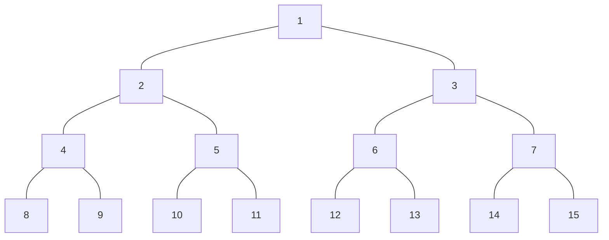
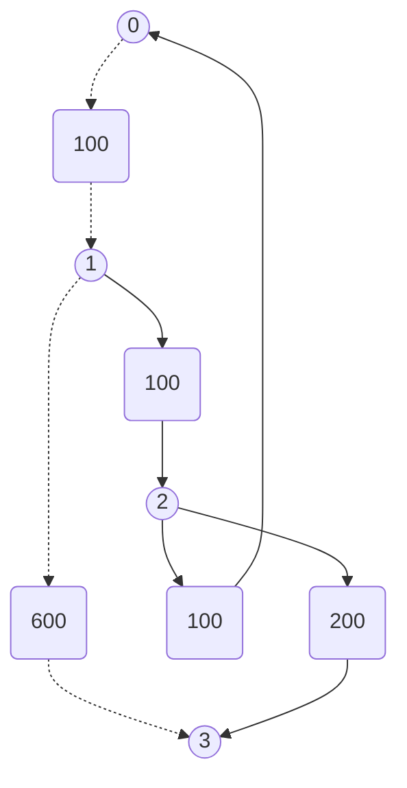
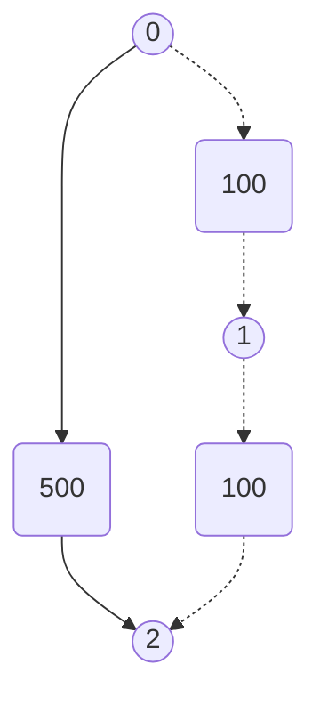
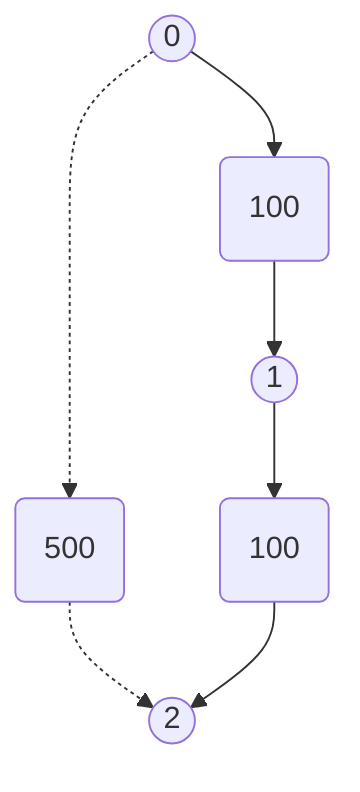

# [Graph](https://en.wikipedia.org/wiki/Graph_(discrete_mathematics))

- [Breadth-First Search](https://en.wikipedia.org/wiki/Breadth-first_search)
- [Depth-First Search](https://en.wikipedia.org/wiki/Depth-first_search)
- [Topological sorting](https://en.wikipedia.org/wiki/Topological_sorting)

## [79. Word Search](https://leetcode.com/problems/word-search/)

<details><summary>Description</summary>

```text
Given an m x n grid of characters board and a string word, return true if word exists in the grid.

The word can be constructed from letters of sequentially adjacent cells,
where adjacent cells are horizontally or vertically neighboring.
The same letter cell may not be used more than once.

Example 1:
+-----------------+
| (A) (B) (C)  E  |
|                 |
|  S   F  (C)  S  |
|                 |
|  A  (D) (E)  E  |
+-----------------+
Input: board = [["A","B","C","E"],["S","F","C","S"],["A","D","E","E"]], word = "ABCCED"
Output: true

Example 2:
+-----------------+
|  A   B   C   E  |
|                 |
|  S   F   C  (S) |
|                 |
|  A   D  (E) (E) |
+-----------------+
Input: board = [["A","B","C","E"],["S","F","C","S"],["A","D","E","E"]], word = "SEE"
Output: true

Example 3:
+-----------------+
|  A   B   C   E  |
|                 |
|  S   F   C   S  |
|                 |
|  A   D   E   E  |
+-----------------+
Input: board = [["A","B","C","E"],["S","F","C","S"],["A","D","E","E"]], word = "ABCB"
Output: false

Constraints:
m == board.length
n = board[i].length
1 <= m, n <= 6
1 <= word.length <= 15
board and word consists of only lowercase and uppercase English letters.

Follow up: Could you use search pruning to make your solution faster with a larger board?
```

</details>

<details><summary>C</summary>

```c
bool dfs(char** board, int i, int j, int boardSize, int* boardColSize, char* word, int wordIdx) {
    int retVal = false;

    if (wordIdx == strlen(word)) {
        retVal = true;
        return retVal;
    }

    if (((i < 0) || (i > boardSize-1)) || ((j < 0) || (j > boardColSize[i]-1)) || (board[i][j] != word[wordIdx])) {
        return retVal;
    }

    char tmp = board[i][j];
    board[i][j] = ' ';

    retVal = dfs(board, i-1, j, boardSize, boardColSize, word, wordIdx+1);
    retVal |= dfs(board, i+1, j, boardSize, boardColSize, word, wordIdx+1);
    retVal |= dfs(board, i, j-1, boardSize, boardColSize, word, wordIdx+1);
    retVal |= dfs(board, i, j+1, boardSize, boardColSize, word, wordIdx+1);

    board[i][j] = tmp;

    return retVal;
}

bool exist(char** board, int boardSize, int* boardColSize, char* word) {
    int retVal = false;

    if ((board == NULL) || (boardSize == 0) || (boardColSize == NULL)) {
        return retVal;
    }
    else if (word == NULL) {
        retVal  = true;
        return retVal;
    }

    int i, j;
    for (i=0; i<boardSize; ++i) {
        for (j=0; j<boardColSize[i]; ++j) {
            retVal = dfs(board, i, j, boardSize, boardColSize, word, 0);
            if (retVal == true) {
                return retVal;
            }
        }
    }

    return retVal;
}
```

</details>

## [116. Populating Next Right Pointers in Each Node](https://leetcode.com/problems/populating-next-right-pointers-in-each-node/)

- [Official](https://leetcode.cn/problems/populating-next-right-pointers-in-each-node/solutions/446938/tian-chong-mei-ge-jie-dian-de-xia-yi-ge-you-ce-2-4/)

<details><summary>Description</summary>

```text
You are given a perfect binary tree where all leaves are on the same level, and every parent has two children.
The binary tree has the following definition:

struct Node {
  int val;
  Node *left;
  Node *right;
  Node *next;
}
Populate each next pointer to point to its next right node.
If there is no next right node, the next pointer should be set to NULL.

Initially, all next pointers are set to NULL.
```

```text
Example 1:
```



```text
Input: root = [1,2,3,4,5,6,7]
Output: [1,#,2,3,#,4,5,6,7,#]
Explanation:
Given the above perfect binary tree (Figure A),
your function should populate each next pointer to point to its next right node, just like in Figure B.
The serialized output is in level order as connected by the next pointers, with '#' signifying the end of each level.
```

```text
Example 2:
Input: root = []
Output: []
```

```text
Constraints:
The number of nodes in the tree is in the range [0, 2^12 - 1].
-1000 <= Node.val <= 1000

Follow-up:
You may only use constant extra space.
The recursive approach is fine. You may assume implicit stack space does not count as extra space for this problem.
```

</details>

<details><summary>C</summary>

```c
/**
 * Definition for a Node.
 * struct Node {
 *     int val;
 *     struct Node *left;
 *     struct Node *right;
 *     struct Node *next;
 * };
 */
void dfs(struct Node* pRoot) {
    if (pRoot == NULL) {
        return;
    }

    /* Example
     *                                          (01)
     *
     *                    (02) ------------------01-----------------> (03)
     *
     *         (04) -------04------> (05) -------02------> (06) -------08------> (07)
     *
     *    (08) -06-> (09) -05-> (10) -07-> (11) -03-> (12) -10-> (13) -09-> (14) -11-> (15)
     */
    struct Node* pLeft = pRoot->left;
    struct Node* pRight = pRoot->right;
    while (pLeft != NULL) {
        pLeft->next = pRight;
        pLeft = pLeft->right;
        pRight = pRight->left;
    }
    dfs(pRoot->left);
    dfs(pRoot->right);
}
struct Node* connect(struct Node* root) {
    struct Node* pRetVal = root;

    dfs(pRetVal);

    return pRetVal;
}
```

</details>

## [133. Clone Graph](https://leetcode.com/problems/clone-graph/)

- [Official](https://leetcode.cn/problems/clone-graph/solutions/370663/ke-long-tu-by-leetcode-solution/)

<details><summary>Description</summary>

```text
Given a reference of a node in a connected undirected graph.

Return a deep copy (clone) of the graph.

Each node in the graph contains a value (int) and a list (List[Node]) of its neighbors.
class Node {
    public int val;
    public List<Node> neighbors;
}

Test case format:

For simplicity, each node's value is the same as the node's index (1-indexed).
For example, the first node with val == 1, the second node with val == 2, and so on.
The graph is represented in the test case using an adjacency list.

An adjacency list is a collection of unordered lists used to represent a finite graph.
Each list describes the set of neighbors of a node in the graph.

The given node will always be the first node with val = 1.
You must return the copy of the given node as a reference to the cloned graph.

Example 1:
Input: adjList = [[2,4],[1,3],[2,4],[1,3]]
Output: [[2,4],[1,3],[2,4],[1,3]]
Explanation: There are 4 nodes in the graph.
1st node (val = 1)'s neighbors are 2nd node (val = 2) and 4th node (val = 4).
2nd node (val = 2)'s neighbors are 1st node (val = 1) and 3rd node (val = 3).
3rd node (val = 3)'s neighbors are 2nd node (val = 2) and 4th node (val = 4).
4th node (val = 4)'s neighbors are 1st node (val = 1) and 3rd node (val = 3).

Example 2:
Input: adjList = [[]]
Output: [[]]
Explanation: Note that the input contains one empty list.
The graph consists of only one node with val = 1 and it does not have any neighbors.

Example 3:
Input: adjList = []
Output: []
Explanation: This an empty graph, it does not have any nodes.

Constraints:
The number of nodes in the graph is in the range [0, 100].
1 <= Node.val <= 100
Node.val is unique for each node.
There are no repeated edges and no self-loops in the graph.
The Graph is connected and all nodes can be visited starting from the given node.
```

</details>

<details><summary>C</summary>

```c
/**
 * Definition for a Node.
 * struct Node {
 *     int val;
 *     int numNeighbors;
 *     struct Node** neighbors;
 * };
 */

#define DFS (1)
#define BFS (1)

#define MAX_NODE_SIZE (100 + 4)  // The number of nodes in the graph is in the range [0, 100].
struct Node** visited;
#if (DFS)
struct Node* dfs(struct Node* s) {
    if (s == NULL) {
        return NULL;
    }

    if (visited[s->val]) {
        return visited[s->val];
    }

    struct Node* cloneNode = (struct Node*)malloc(sizeof(struct Node));
    cloneNode->val = s->val;
    cloneNode->numNeighbors = s->numNeighbors;

    visited[cloneNode->val] = cloneNode;
    cloneNode->neighbors = (struct Node**)malloc(sizeof(struct Node*) * cloneNode->numNeighbors);

    for (int i = 0; i < cloneNode->numNeighbors; i++) {
        cloneNode->neighbors[i] = dfs(s->neighbors[i]);
    }

    return cloneNode;
}
#elif (BFS)
int* state;

void bfs(struct Node* s) {
    if (visited[s->val] && state[s->val] == 2) {
        return;
    }

    struct Node* neighbor;
    if (visited[s->val]) {
        neighbor = visited[s->val];
        neighbor->val = s->val;
        neighbor->numNeighbors = s->numNeighbors;
        neighbor->neighbors = (struct Node**)malloc(sizeof(struct Node*) * neighbor->numNeighbors);
    } else {
        neighbor = (struct Node*)malloc(sizeof(struct Node));
        neighbor->val = s->val;
        neighbor->numNeighbors = s->numNeighbors;
        neighbor->neighbors = (struct Node**)malloc(sizeof(struct Node*) * neighbor->numNeighbors);
        visited[s->val] = neighbor;
    }

    for (int i = 0; i < neighbor->numNeighbors; i++) {
        if (visited[s->neighbors[i]->val]) {
            neighbor->neighbors[i] = visited[s->neighbors[i]->val];
        } else {
            visited[s->neighbors[i]->val] = (struct Node*)malloc(sizeof(struct Node));
            state[s->neighbors[i]->val] = 1;
            neighbor->neighbors[i] = visited[s->neighbors[i]->val];
        }
    }

    state[neighbor->val] = 2;
}
#endif
struct Node* cloneGraph(struct Node* s) {
    struct Node* pRetVal = s;

#if (DFS)
    printf("DFS");

    visited = (struct Node**)malloc(sizeof(struct Node*) * MAX_NODE_SIZE);
    memset(visited, 0, sizeof(struct Node*) * MAX_NODE_SIZE);

    pRetVal = dfs(s);
#elif (BFS)
    printf("BFS");

    if (s == NULL) {
        return NULL;
    }

    visited = (struct Node**)malloc(sizeof(struct Node*) * MAX_NODE_SIZE);
    memset(visited, 0, sizeof(struct Node*) * MAX_NODE_SIZE);

    state = (int*)malloc(sizeof(int) * MAX_NODE_SIZE);
    memset(state, 0, sizeof(int) * MAX_NODE_SIZE);

    struct Node* QUEUE[MAX_NODE_SIZE];
    int head = -1;
    int eneighbor = -1;
    QUEUE[++eneighbor] = s;

    int flag[MAX_NODE_SIZE];
    memset(flag, 0, sizeof(int) * MAX_NODE_SIZE);

    struct Node* p;
    int i;
    while (head != eneighbor) {
        p = QUEUE[++head];
        bfs(p);
        for (i = 0; i < p->numNeighbors; i++) {
            if (!flag[p->neighbors[i]->val]) {
                QUEUE[++eneighbor] = p->neighbors[i];
                flag[p->neighbors[i]->val] = 1;
            }
        }
    }

    pRetVal = visited[s->val];
#endif

    return pRetVal;
}
```

</details>

<details><summary>C++</summary>

```c++
/*
// Definition for a Node.
class Node {
public:
    int val;
    vector<Node*> neighbors;
    Node() {
        val = 0;
        neighbors = vector<Node*>();
    }
    Node(int _val) {
        val = _val;
        neighbors = vector<Node*>();
    }
    Node(int _val, vector<Node*> _neighbors) {
        val = _val;
        neighbors = _neighbors;
    }
};
*/
class Solution {
#define DFS (1)
#define BFS (1)
   public:
    Solution() {
#if (DFS)
        cout << "DFS\n";
#elif (BFS)
        cout << "BFS\n";
#endif
    }

    unordered_map<Node*, Node*> visited;

    Node* cloneGraph(Node* node) {
        Node* retVal = node;

        if (node == nullptr) {
            return retVal;
        }

#if (DFS)
        if (visited.find(node) != visited.end()) {
            retVal = visited[node];
            return retVal;
        }

        Node* cloneNode = new Node(node->val);
        visited[node] = cloneNode;
        for (auto& neighbor : node->neighbors) {
            cloneNode->neighbors.emplace_back(cloneGraph(neighbor));
        }

        retVal = cloneNode;
#elif (BFS)
        queue<Node*> bfsQueue;
        bfsQueue.push(node);

        visited[node] = new Node(node->val);

        while (bfsQueue.empty() == false) {
            auto n = bfsQueue.front();
            bfsQueue.pop();

            for (auto& neighbor : n->neighbors) {
                if (visited.find(neighbor) == visited.end()) {
                    visited[neighbor] = new Node(neighbor->val);
                    bfsQueue.push(neighbor);
                }
                visited[n]->neighbors.emplace_back(visited[neighbor]);
            }
        }

        retVal = visited[node];
#endif

        return retVal;
    }
};
```

</details>

<details><summary>Python3</summary>

```python
"""
# Definition for a Node.
class Node:
    def __init__(self, val = 0, neighbors = None):
        self.val = val
        self.neighbors = neighbors if neighbors is not None else []
"""


class Solution:
    def __init__(self):
        self.method = 1
        if self.method == 1:    # 1: Depth-First Search
            print("Depth-First Search")
        elif self.method == 2:  # 2: Breadth-First Search
            print("Breadth-First Search")
        elif self.method == 3:  # 3: https://docs.python.org/3/library/copy.html
            print("https://docs.python.org/3/library/copy.html")

        self.visited = {}

    def cloneGraph(self, node: 'Node') -> 'Node':
        retVal = node

        if not node:
            return retVal

        if self.method == 1:    # 1: Depth-First Search
            if node in self.visited:
                return self.visited[node]

            cloneNode = Node(node.val, [])
            self.visited[node] = cloneNode
            if node.neighbors:
                cloneNode.neighbors = [self.cloneGraph(neighbors) for neighbors in node.neighbors]

            retVal = cloneNode
        elif self.method == 2:  # 2: Breadth-First Search
            queue = deque([node])
            self.visited[node] = Node(node.val, [])

            while queue:
                n = queue.popleft()
                for neighbor in n.neighbors:
                    if neighbor not in self.visited:
                        self.visited[neighbor] = Node(neighbor.val, [])
                        queue.append(neighbor)
                    self.visited[n].neighbors.append(self.visited[neighbor])

            retVal = self.visited[node]
        elif self.method == 3:  # 3: https://docs.python.org/3/library/copy.html
            retVal = deepcopy(node)

        return retVal
```

</details>

## [200. Number of Islands](https://leetcode.com/problems/number-of-islands)

- [Official](https://leetcode.cn/problems/number-of-islands/solutions/13103/dao-yu-shu-liang-by-leetcode/)

<details><summary>Description</summary>

```text
Given an m x n 2D binary grid grid which represents a map of '1's (land) and '0's (water), return the number of islands.

An island is surrounded by water and is formed by connecting adjacent lands horizontally or vertically.
You may assume all four edges of the grid are all surrounded by water.

Example 1:
Input: grid = [
  ["1","1","1","1","0"],
  ["1","1","0","1","0"],
  ["1","1","0","0","0"],
  ["0","0","0","0","0"]
]
Output: 1

Example 2:
Input: grid = [
  ["1","1","0","0","0"],
  ["1","1","0","0","0"],
  ["0","0","1","0","0"],
  ["0","0","0","1","1"]
]
Output: 3

Constraints:
m == grid.length
n == grid[i].length
1 <= m, n <= 300
grid[i][j] is '0' or '1'.
```

</details>

<details><summary>C</summary>

```c
#define DEPTH_FIRST_SEARCH (1)
#define BREADTH_FIRST_SEARCH (0)
#if (DEPTH_FIRST_SEARCH)
void dfs(char** grid, int i, int j, int gridSize, int* gridColSize) {
    grid[i][j] = '0';

    if ((i != 0) && (grid[i - 1][j] == '1')) {
        dfs(grid, i - 1, j, gridSize, gridColSize);
    }

    if (((i + 1) != gridSize) && (grid[i + 1][j] == '1')) {
        dfs(grid, i + 1, j, gridSize, gridColSize);
    }

    if ((j != 0) && (grid[i][j - 1] == '1')) {
        dfs(grid, i, j - 1, gridSize, gridColSize);
    }

    if (((j + 1) != gridColSize[i]) && (grid[i][j + 1] == '1')) {
        dfs(grid, i, j + 1, gridSize, gridColSize);
    }
}
#elif (BREADTH_FIRST_SEARCH)
#endif
int numIslands(char** grid, int gridSize, int* gridColSize) {
    int retVal = 0;

#if (DEPTH_FIRST_SEARCH)
    printf("DEPTH_FIRST_SEARCH\n");

    int i, j;
    for (i = 0; i < gridSize; i++) {
        for (j = 0; j < gridColSize[i]; j++) {
            if (grid[i][j] == '1') {
                retVal++;
                dfs(grid, i, j, gridSize, gridColSize);
            }
        }
    }
#elif (BREADTH_FIRST_SEARCH)
    printf("BREADTH_FIRST_SEARCH\n");
#endif

    return retVal;
}
```

</details>

## [207. Course Schedule](https://leetcode.com/problems/course-schedule/)

- [Official](https://leetcode.com/problems/course-schedule/editorial/)
- [Official](https://leetcode.cn/problems/course-schedule/solutions/359392/ke-cheng-biao-by-leetcode-solution/)

<details><summary>Description</summary>

```text
There are a total of numCourses courses you have to take, labeled from 0 to numCourses - 1.
You are given an array prerequisites
where prerequisites[i] = [ai, bi] indicates that you must take course bi first if you want to take course ai.
- For example, the pair [0, 1], indicates that to take course 0 you have to first take course 1.

Return true if you can finish all courses. Otherwise, return false.

Example 1:
Input: numCourses = 2, prerequisites = [[1,0]]
Output: true
Explanation: There are a total of 2 courses to take.
To take course 1 you should have finished course 0. So it is possible.

Example 2:
Input: numCourses = 2, prerequisites = [[1,0],[0,1]]
Output: false
Explanation: There are a total of 2 courses to take.
To take course 1 you should have finished course 0, and to take course 0 you should also have finished course 1.
So it is impossible.

Constraints:
1 <= numCourses <= 2000
0 <= prerequisites.length <= 5000
prerequisites[i].length == 2
0 <= ai, bi < numCourses
All the pairs prerequisites[i] are unique.
```

<details><summary>Hint</summary>

```text
1. This problem is equivalent to finding if a cycle exists in a directed graph.
   If a cycle exists, no topological ordering exists and therefore it will be impossible to take all courses.
2. Topological Sort via DFS - A great video tutorial (21 minutes) on Coursera
   explaining the basic concepts of Topological Sort.
3. Topological sort could also be done via BFS.
```

</details>

</details>

<details><summary>C</summary>

```c
bool canFinish(int numCourses, int** prerequisites, int prerequisitesSize, int* prerequisitesColSize) {
    bool retVal = false;

    int i;

    int indegree[numCourses];
    memset(indegree, 0, sizeof(indegree));
    int adjacency[numCourses][numCourses];
    memset(adjacency, -1, sizeof(adjacency));  // 1 <= numCourses <= 2000; 0 <= ai, bi < numCourses;
    int adjacencyColSize[numCourses];
    memset(adjacencyColSize, 0, sizeof(adjacencyColSize));
    int idx;
    for (i = 0; i < prerequisitesSize; ++i) {
        idx = prerequisites[i][0];
        adjacency[idx][adjacencyColSize[idx]++] = prerequisites[i][1];
        indegree[prerequisites[i][1]]++;
    }
#if (0)
    printf("indegree: ");
    for (i = 0; i < numCourses; ++i) {
        printf("%d ", indegree[i]);
    }
    printf("\n");
    int j;
    for (i = 0; i < numCourses; ++i) {
        printf("adjacency[%d]: ", i);
        for (j = 0; j < numCourses; ++j) {
            printf("%2d ", adjacency[i][j]);
        }
        printf(": %d\n", adjacencyColSize[i]);
    }
#endif

#define MAX_QUEUE_SIZE ((numCourses)*2)
    int topologicalSortQueueHead = 0;
    int topologicalSortQueueTail = 0;
    int topologicalSortQueue[MAX_QUEUE_SIZE];
    for (i = 0; i < numCourses; i++) {
        if (indegree[i] == 0) {
            topologicalSortQueue[topologicalSortQueueTail++] = i;
        }
    }
#if (0)
    for (i = 0; i < (topologicalSortQueueTail - topologicalSortQueueHead); ++i) {
        printf("%d ", topologicalSortQueue[i]);
    }
    printf("\n");
#endif

    // // Topological Sort Using Kahn's Algorithm
    int numOfPrerequisite = 0;
    int prerequisite, neighbor;
    while (topologicalSortQueueHead < topologicalSortQueueTail) {
        prerequisite = topologicalSortQueue[topologicalSortQueueHead++];
        ++numOfPrerequisite;

        for (i = 0; i < adjacencyColSize[prerequisite]; ++i) {
            neighbor = adjacency[prerequisite][i];
            indegree[neighbor]--;
            if (indegree[neighbor] == 0) {
                topologicalSortQueue[topologicalSortQueueTail++] = neighbor;
            }
        }
    }
    retVal = (numOfPrerequisite == numCourses);

    return retVal;
}
```

</details>

<details><summary>C++</summary>

```c++
class Solution {
   public:
    bool canFinish(int numCourses, vector<vector<int>>& prerequisites) {
        bool retVal = false;

        int prerequisitesSize = prerequisites.size();

        vector<int> indegree(numCourses);
        vector<vector<int>> adjacency(numCourses);
        for (int i = 0; i < prerequisitesSize; i++) {
            adjacency[prerequisites[i][0]].push_back(prerequisites[i][1]);
            indegree[prerequisites[i][1]]++;
        }

        queue<int> topologicalSortQueue;
        for (int i = 0; i < numCourses; i++) {
            if (indegree[i] == 0) {
                topologicalSortQueue.push(i);
            }
        }

        // Topological Sort Using Kahn's Algorithm
        int numOfPrerequisite = 0;
        while (topologicalSortQueue.empty() == false) {
            int prerequisite = topologicalSortQueue.front();
            topologicalSortQueue.pop();
            ++numOfPrerequisite;

            for (auto& neighbor : adjacency[prerequisite]) {
                indegree[neighbor]--;
                if (indegree[neighbor] == 0) {
                    topologicalSortQueue.push(neighbor);
                }
            }
        }
        retVal = (numOfPrerequisite == numCourses);

        return retVal;
    }
};
```

</details>

<details><summary>Python3</summary>

```python
class Solution:
    def canFinish(self, numCourses: int, prerequisites: List[List[int]]) -> bool:
        retVal = False

        prerequisitesSize = len(prerequisites)

        indegree = [0] * numCourses
        adjacency = [[] for _ in range(numCourses)]
        for i in range(prerequisitesSize):
            adjacency[prerequisites[i][0]].append(prerequisites[i][1])
            indegree[prerequisites[i][1]] += 1

        topologicalSortQueue = deque()
        for i in range(numCourses):
            if indegree[i] == 0:
                topologicalSortQueue.append(i)

        # Topological Sort Using Kahn's Algorithm
        numOfPrerequisite = 0
        while topologicalSortQueue:
            prerequisite = topologicalSortQueue.popleft()
            numOfPrerequisite += 1

            for neighbor in adjacency[prerequisite]:
                indegree[neighbor] -= 1
                if indegree[neighbor] == 0:
                    topologicalSortQueue.append(neighbor)
        retVal = (numOfPrerequisite == numCourses)

        return retVal
```

</details>

## [210. Course Schedule II](https://leetcode.com/problems/course-schedule-ii/)

- [Official](https://leetcode.cn/problems/course-schedule-ii/solutions/249149/ke-cheng-biao-ii-by-leetcode-solution/)

<details><summary>Description</summary>

```text
There are a total of numCourses courses you have to take, labeled from 0 to numCourses - 1.
You are given an array prerequisites where prerequisites[i] = [ai, bi] indicates
that you must take course bi first if you want to take course ai.
- For example, the pair [0, 1], indicates that to take course 0 you have to first take course 1.

Return the ordering of courses you should take to finish all courses.
If there are many valid answers, return any of them. If it is impossible to finish all courses, return an empty array.

Example 1:
Input: numCourses = 2, prerequisites = [[1,0]]
Output: [0,1]
Explanation: There are a total of 2 courses to take. To take course 1 you should have finished course 0.
So the correct course order is [0,1].

Example 2:
Input: numCourses = 4, prerequisites = [[1,0],[2,0],[3,1],[3,2]]
Output: [0,2,1,3]
Explanation: There are a total of 4 courses to take. To take course 3 you should have finished both courses 1 and 2.
Both courses 1 and 2 should be taken after you finished course 0.
So one correct course order is [0,1,2,3]. Another correct ordering is [0,2,1,3].

Example 3:
Input: numCourses = 1, prerequisites = []
Output: [0]

Constraints:
1 <= numCourses <= 2000
0 <= prerequisites.length <= numCourses * (numCourses - 1)
prerequisites[i].length == 2
0 <= ai, bi < numCourses
ai != bi
All the pairs [ai, bi] are distinct.
```

<details><summary>Hint</summary>

```text
1. This problem is equivalent to finding the topological order in a directed graph.
   If a cycle exists, no topological ordering exists and therefore it will be impossible to take all courses.
2. Topological Sort via DFS - A great video tutorial (21 minutes) on Coursera
   explaining the basic concepts of Topological Sort.
3. Topological sort could also be done via BFS.
```

</details>

</details>

<details><summary>C</summary>

```c
/**
 * Note: The returned array must be malloced, assume caller calls free().
 */
int* findOrder(int numCourses, int** prerequisites, int prerequisitesSize, int* prerequisitesColSize, int* returnSize) {
    int* pRetVal = NULL;

    int i;

    int indegree[numCourses];
    memset(indegree, 0, sizeof(indegree));
    int adjacency[numCourses][numCourses];
    memset(adjacency, -1, sizeof(adjacency));  // 1 <= numCourses <= 2000; 0 <= ai, bi < numCourses;
    int adjacencyColSize[numCourses];
    memset(adjacencyColSize, 0, sizeof(adjacencyColSize));
    int idx;
    for (i = 0; i < prerequisitesSize; ++i) {
        idx = prerequisites[i][1];
        adjacency[idx][adjacencyColSize[idx]++] = prerequisites[i][0];
        indegree[prerequisites[i][0]]++;
    }
#if (0)
    printf("indegree: ");
    for (i = 0; i < numCourses; ++i) {
        printf("%d ", indegree[i]);
    }
    printf("\n");
    int j;
    for (i = 0; i < numCourses; ++i) {
        printf("adjacency[%d]: ", i);
        for (j = 0; j < numCourses; ++j) {
            printf("%2d ", adjacency[i][j]);
        }
        printf(": %d\n", adjacencyColSize[i]);
    }
#endif

#define MAX_QUEUE_SIZE ((numCourses)*2)
    int topologicalSortQueueHead = 0;
    int topologicalSortQueueTail = 0;
    int topologicalSortQueue[MAX_QUEUE_SIZE];
    for (i = 0; i < numCourses; i++) {
        if (indegree[i] == 0) {
            topologicalSortQueue[topologicalSortQueueTail++] = i;
        }
    }
#if (0)
    for (i = 0; i < (topologicalSortQueueTail - topologicalSortQueueHead); ++i) {
        printf("%d ", topologicalSortQueue[i]);
    }
    printf("\n");
#endif

    (*returnSize) = 0;
    pRetVal = (int*)malloc(numCourses * sizeof(int));
    if (pRetVal == NULL) {
        perror("malloc");
        return pRetVal;
    }
    memset(pRetVal, 0, (numCourses * sizeof(int)));

    // Topological Sort Using Kahn's Algorithm
    int prerequisite, neighbor;
    while (topologicalSortQueueHead < topologicalSortQueueTail) {
        prerequisite = topologicalSortQueue[topologicalSortQueueHead++];
        pRetVal[(*returnSize)++] = prerequisite;

        for (i = 0; i < adjacencyColSize[prerequisite]; ++i) {
            neighbor = adjacency[prerequisite][i];
            indegree[neighbor]--;
            if (indegree[neighbor] == 0) {
                topologicalSortQueue[topologicalSortQueueTail++] = neighbor;
            }
        }
    }

    if ((*returnSize) != numCourses) {
        (*returnSize) = 0;
    }

    return pRetVal;
}
```

</details>

<details><summary>C++</summary>

```c++
class Solution {
   public:
    vector<int> findOrder(int numCourses, vector<vector<int>>& prerequisites) {
        vector<int> retVal;

        int prerequisitesSize = prerequisites.size();

        vector<int> indegree(numCourses);
        vector<vector<int>> adjacency(numCourses);
        for (int i = 0; i < prerequisitesSize; i++) {
            adjacency[prerequisites[i][1]].push_back(prerequisites[i][0]);
            indegree[prerequisites[i][0]]++;
        }

        queue<int> topologicalSortQueue;
        for (int i = 0; i < numCourses; i++) {
            if (indegree[i] == 0) {
                topologicalSortQueue.push(i);
            }
        }

        // Topological Sort Using Kahn's Algorithm
        while (topologicalSortQueue.empty() == false) {
            int prerequisite = topologicalSortQueue.front();
            topologicalSortQueue.pop();
            retVal.emplace_back(prerequisite);

            for (auto& neighbor : adjacency[prerequisite]) {
                indegree[neighbor]--;
                if (indegree[neighbor] == 0) {
                    topologicalSortQueue.push(neighbor);
                }
            }
        }

        int returnSize = retVal.size();
        if (returnSize != numCourses) {
            retVal.clear();
        }

        return retVal;
    }
};
```

</details>

<details><summary>Python3</summary>

```python
class Solution:
    def findOrder(self, numCourses: int, prerequisites: List[List[int]]) -> List[int]:
        retVal = []

        prerequisitesSize = len(prerequisites)

        indegree = [0] * numCourses
        adjacency = [[] for _ in range(numCourses)]
        for i in range(prerequisitesSize):
            adjacency[prerequisites[i][1]].append(prerequisites[i][0])
            indegree[prerequisites[i][0]] += 1

        topologicalSortQueue = deque()
        for i in range(numCourses):
            if indegree[i] == 0:
                topologicalSortQueue.append(i)

        # Topological Sort Using Kahn's Algorithm
        while topologicalSortQueue:
            prerequisite = topologicalSortQueue.popleft()
            retVal.append(prerequisite)

            for neighbor in adjacency[prerequisite]:
                indegree[neighbor] -= 1
                if indegree[neighbor] == 0:
                    topologicalSortQueue.append(neighbor)

        if len(retVal) != numCourses:
            retVal = []

        return retVal
```

</details>

## [332. Reconstruct Itinerary](https://leetcode.com/problems/reconstruct-itinerary/)

- [Official](https://leetcode.cn/problems/reconstruct-itinerary/solutions/389885/zhong-xin-an-pai-xing-cheng-by-leetcode-solution/)

<details><summary>Description</summary>

```text
You are given a list of airline tickets
where tickets[i] = [fromi, toi] represent the departure and the arrival airports of one flight.
Reconstruct the itinerary in order and return it.

All of the tickets belong to a man who departs from "JFK", thus, the itinerary must begin with "JFK".
If there are multiple valid itineraries, you should return the itinerary
that has the smallest lexical order when read as a single string.
- For example, the itinerary ["JFK", "LGA"] has a smaller lexical order than ["JFK", "LGB"].

You may assume all tickets form at least one valid itinerary. You must use all the tickets once and only once.

Example 1:
Input: tickets = [["MUC","LHR"],["JFK","MUC"],["SFO","SJC"],["LHR","SFO"]]
Output: ["JFK","MUC","LHR","SFO","SJC"]

Example 2:
Input: tickets = [["JFK","SFO"],["JFK","ATL"],["SFO","ATL"],["ATL","JFK"],["ATL","SFO"]]
Output: ["JFK","ATL","JFK","SFO","ATL","SFO"]
Explanation: Another possible reconstruction is ["JFK","SFO","ATL","JFK","ATL","SFO"] but it is larger in lexical order.

Constraints:
1 <= tickets.length <= 300
tickets[i].length == 2
fromi.length == 3
toi.length == 3
fromi and toi consist of uppercase English letters.
fromi != toi
```

</details>

<details><summary>C</summary>

```c
#define BUF_SIZE (26)  // fromi and toi consist of uppercase English letters.
int str2id(char *a) {
    int retVal = 0;

    // fromi.length == 3, toi.length == 3, fromi and toi consist of uppercase English letters.
    int i;
    for (i = 0; i < 3; i++) {
        retVal = retVal * BUF_SIZE + a[i] - 'A';
    }

    return retVal;
}
int compareIntArray(const void *_a, const void *_b) {
    int **a = (int **)_a;
    int **b = (int **)_b;

    // descending order
    if ((*b)[0] == (*a)[0]) {
        return ((*a)[1] < (*b)[1]);
    }

    return ((*a)[0] < (*b)[0]);
}
void dfs(int departs, int **flight, int *flightSize, int *stack, int *stackSize) {
    int tmp;
    while (flightSize[departs] > 0) {
        tmp = flight[departs][--flightSize[departs]];
        dfs(tmp, flight, flightSize, stack, stackSize);
    }
    stack[(*stackSize)++] = departs;
}
/**
 * Note: The returned array must be malloced, assume caller calls free().
 */
char **findItinerary(char ***tickets, int ticketsSize, int *ticketsColSize, int *returnSize) {
    char **pRetVal = NULL;

    (*returnSize) = 0;

    int i;

    //
    char *id2str[BUF_SIZE * BUF_SIZE * BUF_SIZE];
    int *tickets_tmp[ticketsSize];
    for (int i = 0; i < ticketsSize; i++) {
        tickets_tmp[i] = (int *)malloc(sizeof(int) * 2);
        tickets_tmp[i][0] = str2id(tickets[i][0]);
        tickets_tmp[i][1] = str2id(tickets[i][1]);
        id2str[tickets_tmp[i][0]] = tickets[i][0];
        id2str[tickets_tmp[i][1]] = tickets[i][1];
    }
    qsort(tickets_tmp, ticketsSize, sizeof(int *), compareIntArray);

    //
    int **flight = (int **)malloc((BUF_SIZE * BUF_SIZE * BUF_SIZE) * sizeof(int *));
    int *flightSize = (int *)malloc((BUF_SIZE * BUF_SIZE * BUF_SIZE) * sizeof(int));
    memset(flightSize, 0, ((BUF_SIZE * BUF_SIZE * BUF_SIZE) * sizeof(int)));
    int flightFree[BUF_SIZE * BUF_SIZE * BUF_SIZE];
    memset(flightFree, 0, sizeof(flightFree));
    int flightFreeSize = 0;
    int adds, start;
    int add = 0;
    while (add < ticketsSize) {
        adds = add + 1;
        start = tickets_tmp[add][0];
        while ((adds < ticketsSize) && (start == tickets_tmp[adds][0])) {
            adds++;
        }

        flightSize[start] = adds - add;
        flight[start] = (int *)malloc(sizeof(int) * flightSize[start]);
        memset(flight[start], 0, (sizeof(int) * flightSize[start]));
        flightFree[flightFreeSize++] = start;

        for (i = add; i < adds; i++) {
            flight[start][i - add] = tickets_tmp[i][1];
        }
        add = adds;
    }

    //
    int *stack = (int *)malloc(sizeof(int) * (ticketsSize + 1));
    int stackSize = 0;
    dfs(str2id("JFK"), flight, flightSize, stack, &stackSize);

    //
    (*returnSize) = ticketsSize + 1;
    pRetVal = (char **)malloc(sizeof(char *) * (ticketsSize + 1));
    for (i = 0; i <= ticketsSize; i++) {
        pRetVal[ticketsSize - i] = id2str[stack[i]];
    }

    //
    free(stack);
    stack = NULL;
    for (i = 0; i < flightFreeSize; i++) {
        free(flight[flightFree[i]]);
        flight[i] = NULL;
    }
    free(flight);
    flight = NULL;
    free(flightSize);
    flightSize = NULL;
    for (i = 0; i < ticketsSize; i++) {
        free(tickets_tmp[i]);
        tickets_tmp[i] = NULL;
    }

    return pRetVal;
}
```

</details>

<details><summary>C++</summary>

```c++
class Solution {
   public:
    void dfs(const string& departs,
             unordered_map<string, priority_queue<string, vector<string>, std::greater<string>>>& flight,
             vector<string>& retVal) {
        while ((flight.count(departs)) && (flight[departs].size() > 0)) {
            string tmp = flight[departs].top();
            flight[departs].pop();
            dfs(move(tmp), flight, retVal);
        }
        retVal.emplace_back(departs);
    }
    vector<string> findItinerary(vector<vector<string>>& tickets) {
        vector<string> retVal;

        unordered_map<string, priority_queue<string, vector<string>, std::greater<string>>> flight;
        for (auto& iterator : tickets) {
            string departure = iterator[0];
            string arrival = iterator[1];
            flight[departure].emplace(arrival);
        }
        dfs("JFK", flight, retVal);
        reverse(retVal.begin(), retVal.end());

        return retVal;
    }
};
```

</details>

<details><summary>Python3</summary>

```python
class Solution:
    def dfs(self, departs: str, flight: defaultdict, retVal: List[str]) -> None:
        while flight[departs]:
            tmp = heappop(flight[departs])
            self.dfs(tmp, flight, retVal)
        retVal.append(departs)

    def findItinerary(self, tickets: List[List[str]]) -> List[str]:
        retVal = []

        flight = defaultdict(list)
        for departure, arrival in tickets:
            flight[departure].append(arrival)
        for key in flight:
            heapify(flight[key])

        self.dfs("JFK", flight, retVal)
        retVal = retVal[::-1]

        return retVal
```

</details>

## [399. Evaluate Division](https://leetcode.com/problems/evaluate-division/)

- [Official](https://leetcode.cn/problems/evaluate-division/solutions/548585/chu-fa-qiu-zhi-by-leetcode-solution-8nxb/)

<details><summary>Description</summary>

```text
You are given an array of variable pairs equations and an array of real numbers values,
where equations[i] = [Ai, Bi] and values[i] represent the equation Ai / Bi = values[i].
Each Ai or Bi is a string that represents a single variable.

You are also given some queries,
where queries[j] = [Cj, Dj] represents the jth query where you must find the answer for Cj / Dj = ?.

Return the answers to all queries. If a single answer cannot be determined, return -1.0.

Note: The input is always valid.
You may assume that evaluating the queries will not result in division by zero and that there is no contradiction.

Example 1:
Input: equations = [["a","b"],["b","c"]], values = [2.0,3.0],
queries = [["a","c"],["b","a"],["a","e"],["a","a"],["x","x"]]
Output: [6.00000,0.50000,-1.00000,1.00000,-1.00000]
Explanation:
Given: a / b = 2.0, b / c = 3.0
queries are: a / c = ?, b / a = ?, a / e = ?, a / a = ?, x / x = ?
return: [6.0, 0.5, -1.0, 1.0, -1.0 ]

Example 2:
Input: equations = [["a","b"],["b","c"],["bc","cd"]], values = [1.5,2.5,5.0],
queries = [["a","c"],["c","b"],["bc","cd"],["cd","bc"]]
Output: [3.75000,0.40000,5.00000,0.20000]

Example 3:
Input: equations = [["a","b"]], values = [0.5], queries = [["a","b"],["b","a"],["a","c"],["x","y"]]
Output: [0.50000,2.00000,-1.00000,-1.00000]

Constraints:
1 <= equations.length <= 20
equations[i].length == 2
1 <= Ai.length, Bi.length <= 5
values.length == equations.length
0.0 < values[i] <= 20.0
1 <= queries.length <= 20
queries[i].length == 2
1 <= Cj.length, Dj.length <= 5
Ai, Bi, Cj, Dj consist of lower case English letters and digits.
```

<details><summary>Hint</summary>

```text
1. Do you recognize this as a graph problem?
```

</details>

</details>

<details><summary>C</summary>

```c
typedef struct hashTable {
    char key[8];
    int val;
    UT_hash_handle hh;
} hashTable;
int findroot(int *p, double *w, int x) {
    if (p[x] != x) {
        int root = findroot(p, w, p[x]);
        w[x] = w[x] * w[p[x]];
        p[x] = root;
    }

    return p[x];
}
void merge(int *p, double *w, int x, int y, double val) {
    int rootx = findroot(p, w, x);
    int rooty = findroot(p, w, y);
    p[rootx] = rooty;
    w[rootx] = val * w[y] / w[x];
}
void freeAll(hashTable *pFree) {
    hashTable *current;
    hashTable *tmp;
    HASH_ITER(hh, pFree, current, tmp) {
        HASH_DEL(pFree, current);
        free(current);
    }
}
/**
 * Note: The returned array must be malloced, assume caller calls free().
 */
double *calcEquation(char ***equations, int equationsSize, int *equationsColSize, double *values, int valuesSize,
                     char ***queries, int queriesSize, int *queriesColSize, int *returnSize) {
    double *pRetVal = NULL;

    (*returnSize) = 0;
    int i;

    hashTable *pHashMap = NULL;

    //
    hashTable *pHash1, *pHash2;
    int id = 0;
    for (i = 0; i < equationsSize; i++) {
        pHash1 = NULL;
        HASH_FIND_STR(pHashMap, equations[i][0], pHash1);
        if (pHash1 == NULL) {
            pHash1 = (hashTable *)malloc(sizeof(hashTable));
            if (pHash1 == NULL) {
                perror("malloc");
                freeAll(pHashMap);
                pHashMap = NULL;
                return pRetVal;
            }
            pHash1->val = id++;
            strcpy(pHash1->key, equations[i][0]);
            HASH_ADD_STR(pHashMap, key, pHash1);
        }

        pHash2 = NULL;
        HASH_FIND_STR(pHashMap, equations[i][1], pHash2);
        if (pHash2 == NULL) {
            pHash2 = (hashTable *)malloc(sizeof(hashTable));
            if (pHash2 == NULL) {
                perror("malloc");
                freeAll(pHashMap);
                pHashMap = NULL;
                return pRetVal;
            }
            pHash2->val = id++;
            strcpy(pHash2->key, equations[i][1]);
            HASH_ADD_STR(pHashMap, key, pHash2);
        }
    }

    //
    int *p = (int *)malloc(sizeof(int) * id);
    if (p == NULL) {
        perror("malloc");
        freeAll(pHashMap);
        pHashMap = NULL;
        return pRetVal;
    }
    double *w = (double *)malloc(sizeof(double) * id);
    if (w == NULL) {
        perror("malloc");
        freeAll(pHashMap);
        pHashMap = NULL;
        free(p);
        p = NULL;
        return pRetVal;
    }
    for (i = 0; i < id; i++) {
        p[i] = i;
        w[i] = 1.0;
    }

    for (i = 0; i < equationsSize; i++) {
        pHash1 = NULL;
        HASH_FIND_STR(pHashMap, equations[i][0], pHash1);
        pHash2 = NULL;
        HASH_FIND_STR(pHashMap, equations[i][1], pHash2);
        merge(p, w, pHash1->val, pHash2->val, values[i]);
    }

    //
    pRetVal = (double *)malloc(sizeof(double) * queriesSize);
    if (pRetVal == NULL) {
        perror("malloc");
        freeAll(pHashMap);
        pHashMap = NULL;
        free(p);
        p = NULL;
        free(w);
        w = NULL;
        return pRetVal;
    }

    int v1, v2;
    double result;
    for (i = 0; i < queriesSize; i++) {
        result = -1.0;

        pHash1 = NULL;
        HASH_FIND_STR(pHashMap, queries[i][0], pHash1);
        pHash2 = NULL;
        HASH_FIND_STR(pHashMap, queries[i][1], pHash2);
        if (pHash1 && pHash2) {
            v1 = pHash1->val;
            v2 = pHash2->val;
            if (findroot(p, w, v1) == findroot(p, w, v2)) {
                result = w[v1] / w[v2];
            }
        }
        pRetVal[(*returnSize)++] = result;
    }

    //
    freeAll(pHashMap);
    pHashMap = NULL;
    free(p);
    p = NULL;
    free(w);
    w = NULL;

    return pRetVal;
}
```

</details>

<details><summary>C++</summary>

```c++
class Solution {
   public:
    unordered_map<string, vector<pair<string, double>>> graph;

    double dfs(string src, string dst, unordered_set<string>& visited) {
        double retVal = -1;

        if (graph.find(src) == graph.end()) {
            return retVal;
        }

        if (src == dst) {
            retVal = 1;
            return retVal;
        }

        for (auto node : graph[src]) {
            if (visited.count(node.first)) {
                continue;
            }

            visited.insert(node.first);
            double res = dfs(node.first, dst, visited);
            if (res != -1) {
                retVal = res * node.second;
                return retVal;
            }
        }

        return retVal;
    }
    vector<double> calcEquation(vector<vector<string>>& equations, vector<double>& values,
                                vector<vector<string>>& queries) {
        vector<double> retVal;

        int equationsSize = equations.size();
        for (int i = 0; i < equationsSize; i++) {
            string a = equations[i][0];
            string b = equations[i][1];
            double value = values[i];

            graph[a].push_back({b, value});
            graph[b].push_back({a, (double)1 / value});
        }

        for (auto query : queries) {
            unordered_set<string> visited;
            retVal.push_back(dfs(query[0], query[1], visited));
        }

        return retVal;
    }
};
```

</details>

<details><summary>Python3</summary>

```python
class Solution:
    def solver(self, x: str, y: str, graph: dict, visited: set) -> float:
        retVal = -1.0

        if x not in graph:
            return retVal

        if x == y:
            retVal = 1.0
            return retVal

        visited.add(x)
        for key, value in graph[x]:
            if key == y:
                retVal = value
                return retVal

        for key, value in graph[x]:
            if key not in visited:
                current = self.solver(key, y, graph, visited)
                if current != -1:
                    retVal = value * current
                    return retVal

        return retVal

    def calcEquation(self, equations: List[List[str]], values: List[float], queries: List[List[str]]) -> List[float]:
        retVal = []

        graph = defaultdict(set)
        for [u, v], val in zip(equations, values):
            graph[u].add((v, val))
            graph[v].add((u, 1/val))

        for x, y in queries:
            retVal.append(self.solver(x, y, graph, set()))

        return retVal
```

</details>

## [433. Minimum Genetic Mutation](https://leetcode.com/problems/minimum-genetic-mutation/)

- [Official](https://leetcode.com/problems/minimum-genetic-mutation/solutions/2631788/minimum-genetic-mutation/)
- [Official](https://leetcode.cn/problems/minimum-genetic-mutation/solutions/1470943/zui-xiao-ji-yin-bian-hua-by-leetcode-sol-lhwy/)

<details><summary>Description</summary>

```text
A gene string can be represented by an 8-character long string, with choices from 'A', 'C', 'G', and 'T'.

Suppose we need to investigate a mutation from a gene string start to a gene string end
where one mutation is defined as one single character changed in the gene string.

For example, "AACCGGTT" --> "AACCGGTA" is one mutation.
There is also a gene bank bank that records all the valid gene mutations.
A gene must be in bank to make it a valid gene string.

Given the two gene strings start and end and the gene bank bank,
return the minimum number of mutations needed to mutate from start to end.
If there is no such a mutation, return -1.

Note that the starting point is assumed to be valid, so it might not be included in the bank.

Example 1:
Input: start = "AACCGGTT", end = "AACCGGTA", bank = ["AACCGGTA"]
Output: 1

Example 2:
Input: start = "AACCGGTT", end = "AAACGGTA", bank = ["AACCGGTA","AACCGCTA","AAACGGTA"]
Output: 2

Example 3:
Input: start = "AAAAACCC", end = "AACCCCCC", bank = ["AAAACCCC","AAACCCCC","AACCCCCC"]
Output: 3

Constraints:
start.length == 8
end.length == 8
0 <= bank.length <= 10
bank[i].length == 8
start, end, and bank[i] consist of only the characters ['A', 'C', 'G', 'T'].
```

</details>

<details><summary>C</summary>

```c
typedef struct {
    char key[16];
    UT_hash_handle hh;
} HashItem;
bool hashInsert(HashItem** obj, const char* str) {
    bool retVal = false;

    HashItem* pEntry = (HashItem*)malloc(sizeof(HashItem));
    if (pEntry == NULL) {
        perror("malloc");
        return retVal;
    }
    strcpy(pEntry->key, str);
    HASH_ADD_STR(*obj, key, pEntry);
    retVal = true;

    return retVal;
}
bool hashFind(HashItem** obj, const char* str) {
    bool retVal = false;

    HashItem* pEntry = NULL;
    HASH_FIND_STR(*obj, str, pEntry);
    if (pEntry == NULL) {
        return retVal;
    }
    retVal = true;

    return retVal;
}
void hashFree(HashItem** obj) {
    HashItem* curr;
    HashItem* tmp;

    HASH_ITER(hh, *obj, curr, tmp) {
        HASH_DEL(*obj, curr);
        free(curr);
    }
}
int minMutation(char* start, char* end, char** bank, int bankSize) {
    int retVal = 0;

    int i, j, k;

    if (strcmp(start, end) == 0) {
        return retVal;
    }

    HashItem* cnt = NULL;
    for (i = 0; i < bankSize; ++i) {
        hashInsert(&cnt, bank[i]);
    }
    if (hashFind(&cnt, end) == false) {
        hashFree(&cnt);
        retVal = -1;
        return retVal;
    }

    char** queue = (char**)malloc(bankSize * sizeof(char*));
    if (queue == NULL) {
        perror("malloc");
        hashFree(&cnt);
        retVal = -1;
        return retVal;
    }

    int head = 0;
    int tail = 0;
    queue[tail] = (char*)malloc(16 * sizeof(char));
    if (queue[tail] == NULL) {
        perror("malloc");
        hashFree(&cnt);
        free(queue);
        queue = NULL;
        retVal = -1;
        return retVal;
    }
    strcpy(queue[tail], start);
    tail++;

    HashItem* visited = NULL;
    hashInsert(&visited, start);

    char keys[4] = {'A', 'C', 'G', 'T'};
    int step = 1;
    int sz;
    char* curr;
    char* next;
    while (head != tail) {
        sz = tail - head;

        for (i = 0; i < sz; ++i) {
            curr = queue[head++];

            for (j = 0; j < 8; ++j) {
                for (k = 0; k < 4; ++k) {
                    if (keys[k] == curr[j]) {
                        continue;
                    }

                    next = (char*)malloc(16 * sizeof(char));
                    if (next == NULL) {
                        perror("malloc");
                        hashFree(&cnt);
                        hashFree(&visited);
                        free(queue);
                        queue = NULL;
                        retVal = -1;
                        return retVal;
                    }
                    strcpy(next, curr);

                    next[j] = keys[k];
                    if ((hashFind(&visited, next) == false) && (hashFind(&cnt, next) == true)) {
                        if (strcmp(next, end) == 0) {
                            while (head != tail) {
                                free(queue[head++]);
                            }
                            hashFree(&cnt);
                            hashFree(&visited);
                            free(next);
                            next = NULL;

                            retVal = step;
                            return retVal;
                        }
                        queue[tail++] = next;
                        hashInsert(&visited, next);
                    } else {
                        free(next);
                    }
                }
            }
            free(curr);
        }
        step++;
    }
    hashFree(&cnt);
    hashFree(&visited);
    free(queue);

    retVal = -1;
    return retVal;
}
```

</details>

<details><summary>C++</summary>

```c++
class Solution {
public:
    int minMutation(string start, string end, vector<string>& bank) {
        int steps = 0;

        // a queue to store each gene string
        queue<string> queue;
        queue.push(start);

        // a hash table to record visited gene string
        unordered_set<string> seen;
        seen.insert(start);

        // Breadth-First Search
        int nodesInQueue;
        string node;
        string neighbor;
        while (!queue.empty()) {
            nodesInQueue = queue.size();
            for (int i=0; i<nodesInQueue; ++i) {
                node = queue.front();
                queue.pop();
                if (node == end) {
                    return steps;
                }

                for (long unsigned j=0; j<node.size(); ++j) {
                    for (int k=0; k<4; ++k) {
                        neighbor = node;
                        // replace the j-th character in neighbor with the k-th character in ACGT
                        neighbor[j] = "ACGT"[k];
                        if ((!seen.count(neighbor)) && (find(bank.begin(), bank.end(), neighbor) != bank.end())) {
                            queue.push(neighbor);
                            seen.insert(neighbor);
                        }
                    }
                }
            }

            ++steps;
        }

        // If there is no such a mutation, return -1.
        return -1;
    }
};
```

</details>

<details><summary>Python3</summary>

```python
class Solution:
    def minMutation(self, start: str, end: str, bank: List[str]) -> int:
        # a queue to store each gene string
        queue = deque([(start, 0)])

        # a hash table to record visited gene string
        seen = {start}

        # Breadth-First Search
        while queue:
            node, steps = queue.popleft()
            if node == end:
                return steps

            for c in "ACGT":
                for i in range(len(node)):
                    neighbor = node[:i] + c + node[i+1:]
                    if neighbor not in seen and neighbor in bank:
                        queue.append((neighbor, steps+1))
                        seen.add(neighbor)

        return -1
```

</details>

## [547. Number of Provinces](https://leetcode.com/problems/number-of-provinces/)

- [Official](https://leetcode.com/problems/number-of-provinces/editorial/)
- [Official](https://leetcode.cn/problems/number-of-provinces/solutions/549895/sheng-fen-shu-liang-by-leetcode-solution-eyk0/)

<details><summary>Description</summary>

```text
There are n cities. Some of them are connected, while some are not.
If city a is connected directly with city b, and city b is connected directly with city c,
then city a is connected indirectly with city c.

A province is a group of directly or indirectly connected cities and no other cities outside of the group.

You are given an n x n matrix isConnected where isConnected[i][j] = 1
if the ith city and the jth city are directly connected, and isConnected[i][j] = 0 otherwise.

Return the total number of provinces.

Example 1:
Input: isConnected = [[1,1,0],[1,1,0],[0,0,1]]
Output: 2

Example 2:
Input: isConnected = [[1,0,0],[0,1,0],[0,0,1]]
Output: 3

Constraints:
1 <= n <= 200
n == isConnected.length
n == isConnected[i].length
isConnected[i][j] is 1 or 0.
isConnected[i][i] == 1
isConnected[i][j] == isConnected[j][i]
```

</details>

<details><summary>C</summary>

```c
#define DFS (0)
#define BFS (1)
#if (DFS)
void dfs(int i, int** isConnected, int isConnectedSize, int* visited) {
    int j;
    for (j = 0; j < isConnectedSize; ++j) {
        if (isConnected[i][j] == 0) {
            continue;
        } else if (visited[j] == 1) {
            continue;
        } else {
            visited[j] = 1;
            dfs(j, isConnected, isConnectedSize, visited);
        }
    }
}
#elif (BFS)
void bfs(int i, int** isConnected, int isConnectedSize, int* visited) {
    visited[i] = 1;

    int bfsQueue[isConnectedSize * isConnectedSize];
    memset(bfsQueue, 0, sizeof(bfsQueue));
    int bfsQueueHead = 0;
    int bfsQueueTail = 0;
    bfsQueue[bfsQueueHead++] = i;

    int j;
    int idx;
    while (bfsQueueHead > bfsQueueTail) {
        idx = bfsQueue[bfsQueueTail];
        ++bfsQueueTail;
        for (j = 0; j < isConnectedSize; ++j) {
            if (isConnected[idx][j] == 0) {
                continue;
            } else if (visited[j] == 1) {
                continue;
            } else {
                visited[j] = 1;
                bfsQueue[bfsQueueHead++] = j;
            }
        }
    }
}
#endif
int findCircleNum(int** isConnected, int isConnectedSize, int* isConnectedColSize) {
    int retVal = 0;

    int visited[isConnectedSize];
    memset(visited, 0, sizeof(visited));
    int i;
    for (i = 0; i < isConnectedSize; ++i) {
        if (visited[i] == 1) {
            continue;
        }

#if (DFS)
        printf("Depth-First Search\n\n");
        dfs(i, isConnected, isConnectedSize, visited);
#elif (BFS)
        printf("Breadth-First Search\n\n");
        bfs(i, isConnected, isConnectedSize, visited);
#endif

        ++retVal;
    }

    return retVal;
}
```

</details>

<details><summary>C++</summary>

```c++
class Solution {
   public:
#define DFS (0)
#define BFS (1)
   public:
    Solution() {
#if (DFS)
        cout << "Depth-First Search\n\n";
#elif (BFS)
        cout << "Breadth-First Search\n\n";
#endif
    }
    void dfs(int i, vector<vector<int>>& isConnected, vector<int>& visited) {
        int isConnectedSize = isConnected.size();

        for (int j = 0; j < isConnectedSize; ++j) {
            if (isConnected[i][j] == 0) {
                continue;
            } else if (find(visited.begin(), visited.end(), j) != visited.end()) {
                continue;
            } else {
                visited.emplace_back(j);
                dfs(j, isConnected, visited);
            }
        }
    }
    void bfs(int i, vector<vector<int>>& isConnected, vector<int>& visited) {
        int isConnectedSize = isConnected.size();

        visited.emplace_back(i);
        queue<int> bfsQueue;
        bfsQueue.emplace(i);
        while (bfsQueue.empty() == false) {
            auto idx = bfsQueue.front();
            bfsQueue.pop();
            for (int j = 0; j < isConnectedSize; ++j) {
                if (isConnected[idx][j] == 0) {
                    continue;
                } else if (find(visited.begin(), visited.end(), j) != visited.end()) {
                    continue;
                } else {
                    visited.emplace_back(j);
                    bfsQueue.emplace(j);
                }
            }
        }
    }
    int findCircleNum(vector<vector<int>>& isConnected) {
        int retVal = 0;

        int isConnectedSize = isConnected.size();

        vector<int> visited;
        for (int i = 0; i < isConnectedSize; ++i) {
            if (find(visited.begin(), visited.end(), i) != visited.end()) {
                continue;
            }

#if (DFS)
            dfs(i, isConnected, visited);
#elif (BFS)
            bfs(i, isConnected, visited);
#endif

            ++retVal;
        }

        return retVal;
    }
};
```

</details>

<details><summary>Python3</summary>

```python
class Solution:
    def __init__(self):
        self.method = 2

        if self.method == 1:
            print("Depth-First Search")
        elif self.method == 2:
            print("Breadth-First Search")
        print()

    def dfs(self, i: int, isConnected: List[List[int]], visited: List[int]):
        isConnectedSize = len(isConnected)

        for j in range(isConnectedSize):
            if isConnected[i][j] == 0:
                continue
            if j in visited:
                continue
            visited.append(j)
            self.dfs(j, isConnected, visited)

    def bfs(self, i: int, isConnected: List[List[int]], visited: List[int]):
        isConnectedSize = len(isConnected)

        bfsQueue = deque([i])
        visited.append(i)
        while bfsQueue:
            idx = bfsQueue.popleft()
            for j in range(isConnectedSize):
                if isConnected[idx][j] == 0:
                    continue
                if j in visited:
                    continue
                bfsQueue.append(j)
                visited.append(j)

    def findCircleNum(self, isConnected: List[List[int]]) -> int:
        retVal = 0

        isConnectedSize = len(isConnected)

        visited = []
        for i in range(isConnectedSize):
            if i in visited:
                continue

            if self.method == 1:
                self.dfs(i, isConnected, visited)
            elif self.method == 2:
                self.bfs(i, isConnected, visited)

            retVal += 1

        return retVal
```

</details>

## [695. Max Area of Island](https://leetcode.com/problems/max-area-of-island/)

- [Official](https://leetcode.com/problems/max-area-of-island/solutions/127762/max-area-of-island/)
- [Official](https://leetcode.cn/problems/max-area-of-island/solutions/147677/dao-yu-de-zui-da-mian-ji-by-leetcode-solution/)

<details><summary>Description</summary>

```text
You are given an m x n binary matrix grid.
An island is a group of 1's (representing land) connected 4-directionally (horizontal or vertical.)
You may assume all four edges of the grid are surrounded by water.

The area of an island is the number of cells with a value 1 in the island.

Return the maximum area of an island in grid. If there is no island, return 0.

Example 1:
Input: grid = [
                [0,0,1,0,0,0,0,1,0,0,0,0,0],
                [0,0,0,0,0,0,0,1,1,1,0,0,0],
                [0,1,1,0,1,0,0,0,0,0,0,0,0],
                [0,1,0,0,1,1,0,0,1,0,1,0,0],
                [0,1,0,0,1,1,0,0,1,1,1,0,0],
                [0,0,0,0,0,0,0,0,0,0,1,0,0],
                [0,0,0,0,0,0,0,1,1,1,0,0,0],
                [0,0,0,0,0,0,0,1,1,0,0,0,0]
            ]
Output: 6
Explanation: The answer is not 11, because the island must be connected 4-directionally.

Example 2:
Input: grid = [[0,0,0,0,0,0,0,0]]
Output: 0

Constraints:
m == grid.length
n == grid[i].length
1 <= m, n <= 50
grid[i][j] is either 0 or 1.
```

</details>

<details><summary>C</summary>

```c
int dfs(int** grid, int x, int y, int rowSize, int colSize) {
    int retVal = 0;

    if ((x < 0) || (x >= rowSize) || (y < 0) || (y >= colSize)) {
        return retVal;
    }

    if (grid[x][y] == 0) {
        return retVal;
    }
    grid[x][y] = 0;
    retVal = 1;
    retVal += dfs(grid, x - 1, y, rowSize, colSize);
    retVal += dfs(grid, x + 1, y, rowSize, colSize);
    retVal += dfs(grid, x, y - 1, rowSize, colSize);
    retVal += dfs(grid, x, y + 1, rowSize, colSize);

    return retVal;
}
int maxAreaOfIsland(int** grid, int gridSize, int* gridColSize) {
    int retVal = 0;

    int area;
    int i, j;
    for (i = 0; i < gridSize; ++i) {
        for (j = 0; j < gridColSize[i]; ++j) {
            if (grid[i][j] == 0) {
                continue;
            }
            area = dfs(grid, i, j, gridSize, gridColSize[i]);
            retVal = fmax(retVal, area);
        }
    }

    return retVal;
}
```

</details>

## [733. Flood Fill](https://leetcode.com/problems/flood-fill/)

- [Official](https://leetcode.com/problems/flood-fill/solutions/127585/flood-fill/)
- [Official](https://leetcode.cn/problems/flood-fill/solutions/375836/tu-xiang-xuan-ran-by-leetcode-solution/)

<details><summary>Description</summary>

```text
An image is represented by an m x n integer grid image where image[i][j] represents the pixel value of the image.

You are also given three integers sr, sc, and color.
You should perform a flood fill on the image starting from the pixel image[sr][sc].

To perform a flood fill, consider the starting pixel,
plus any pixels connected 4-directionally to the starting pixel of the same color as the starting pixel,
plus any pixels connected 4-directionally to those pixels (also with the same color),
and so on. Replace the color of all of the aforementioned pixels with color.

Return the modified image after performing the flood fill.

Example 1:
Input: image = [[1,1,1],[1,1,0],[1,0,1]], sr = 1, sc = 1, color = 2
Output: [[2,2,2],[2,2,0],[2,0,1]]
Explanation: From the center of the image with position (sr, sc) = (1, 1) (i.e., the red pixel),
all pixels connected by a path of the same color as the starting pixel (i.e., the blue pixels) are colored with the new color.
Note the bottom corner is not colored 2, because it is not 4-directionally connected to the starting pixel.

Example 2:
Input: image = [[0,0,0],[0,0,0]], sr = 0, sc = 0, color = 0
Output: [[0,0,0],[0,0,0]]
Explanation: The starting pixel is already colored 0, so no changes are made to the image.

Constraints:
m == image.length
n == image[i].length
1 <= m, n <= 50
0 <= image[i][j], color < 2^16
0 <= sr < m
0 <= sc < n
```

</details>

<details><summary>C</summary>

```c
void dfs(int** pImage, int sr, int sc, int color, int oriColor, int row, int col) {
    if ((sr < 0) || (sr >= row)) {
        return;
    } else if ((sc < 0) || (sc >= col)) {
        return;
    }

    if (pImage[sr][sc] != oriColor) {
        return;
    }
    pImage[sr][sc] = color;
    dfs(pImage, sr - 1, sc, color, oriColor, row, col);
    dfs(pImage, sr + 1, sc, color, oriColor, row, col);
    dfs(pImage, sr, sc - 1, color, oriColor, row, col);
    dfs(pImage, sr, sc + 1, color, oriColor, row, col);
}
/**
 * Return an array of arrays of size *returnSize.
 * The sizes of the arrays are returned as *returnColumnSizes array.
 * Note: Both returned array and *columnSizes array must be malloced, assume caller calls free().
 */
int** floodFill(int** image, int imageSize, int* imageColSize, int sr, int sc, int color, int* returnSize,
                int** returnColumnSizes) {
    int** pRetVal = NULL;

    int i, j;

    // malloc return value
    (*returnSize) = imageSize;
    (*returnColumnSizes) = (int*)malloc((imageColSize[0]) * sizeof(int));
    if ((*returnColumnSizes) == NULL) {
        perror("malloc");
        (*returnSize) = 0;
        return pRetVal;
    }
    for (i = 0; i < (*returnSize); ++i) {
        (*returnColumnSizes)[i] = imageColSize[i];
    }
    pRetVal = (int**)malloc((*returnSize) * sizeof(int*));
    if (pRetVal == NULL) {
        perror("malloc");
        (*returnSize) = 0;
        free((*returnColumnSizes));
        (*returnColumnSizes) = NULL;
        return pRetVal;
    }
    for (i = 0; i < (*returnSize); ++i) {
        pRetVal[i] = (int*)malloc(((*returnColumnSizes)[i]) * sizeof(int));
        if (pRetVal[i] == NULL) {
            perror("malloc");
            for (j = 0; j < i; ++j) {
                free(pRetVal[j]);
                pRetVal[j] = NULL;
            }
            pRetVal = NULL;
            (*returnSize) = 0;
            free((*returnColumnSizes));
            (*returnColumnSizes) = NULL;
            return pRetVal;
        }
        memset(pRetVal[i], 0, ((*returnColumnSizes)[i]) * sizeof(int));
        memcpy(pRetVal[i], image[i], ((*returnColumnSizes)[i]) * sizeof(int));
    }

    //
    int oriColor = image[sr][sc];
    if (oriColor == color) {
        return pRetVal;
    }
    dfs(pRetVal, sr, sc, color, oriColor, (*returnSize), (*returnColumnSizes)[0]);

    return pRetVal;
}
```

</details>

## [753. Cracking the Safe](https://leetcode.com/problems/cracking-the-safe/)  2273

- [Official](https://leetcode.cn/problems/cracking-the-safe/solutions/393529/po-jie-bao-xian-xiang-by-leetcode-solution/)

<details><summary>Description</summary>

```text
There is a safe protected by a password.
The password is a sequence of n digits where each digit can be in the range [0, k - 1].

The safe has a peculiar way of checking the password.
When you enter in a sequence, it checks the most recent n digits that were entered each time you type a digit.

- For example, the correct password is "345" and you enter in "012345":
  - After typing 0, the most recent 3 digits is "0", which is incorrect.
  - After typing 1, the most recent 3 digits is "01", which is incorrect.
  - After typing 2, the most recent 3 digits is "012", which is incorrect.
  - After typing 3, the most recent 3 digits is "123", which is incorrect.
  - After typing 4, the most recent 3 digits is "234", which is incorrect.
  - After typing 5, the most recent 3 digits is "345", which is correct and the safe unlocks.

Return any string of minimum length that will unlock the safe at some point of entering it.

Example 1:
Input: n = 1, k = 2
Output: "10"
Explanation: The password is a single digit, so enter each digit. "01" would also unlock the safe.

Example 2:
Input: n = 2, k = 2
Output: "01100"
Explanation: For each possible password:
- "00" is typed in starting from the 4th digit.
- "01" is typed in starting from the 1st digit.
- "10" is typed in starting from the 3rd digit.
- "11" is typed in starting from the 2nd digit.
Thus "01100" will unlock the safe. "10011", and "11001" would also unlock the safe.

Constraints:
1 <= n <= 4
1 <= k <= 10
1 <= k^n <= 4096
```

<details><summary>Hint</summary>

```text
1. We can think of this problem as the problem of finding an Euler path
   (a path visiting every edge exactly once) on the following graph:
   there are k^(n-1) nodes with each node having k edges.
   It turns out this graph always has an Eulerian circuit (path starting where it ends.)
   We should visit each node in "post-order" so as to not get stuck in the graph prematurely.
```

</details>

</details>

<details><summary>C</summary>

```c
void dfs(int n, int k, int node, char* pVisit, char* pRetVal, int* returnSize) {
    int highest = pow(10, n - 1);

    int neighbor;
    int x;
    for (x = 0; x < k; ++x) {
        neighbor = node * 10 + x;
        if (pVisit[neighbor] == 0) {
            pVisit[neighbor] = 1;
            dfs(n, k, neighbor % highest, pVisit, pRetVal, returnSize);
            pRetVal[(*returnSize)++] = x + '0';
        }
    }
}
char* crackSafe(int n, int k) {
    char* pRetVal = NULL;

#define MAX_RETURN_SIZE (int)(1e4)

    pRetVal = (char*)malloc(MAX_RETURN_SIZE * sizeof(char));
    if (pRetVal == NULL) {
        perror("malloc");
        return pRetVal;
    }
    memset(pRetVal, 0, (MAX_RETURN_SIZE * sizeof(char)));
    int returnSize = 0;

    char* pVisit = (char*)malloc(MAX_RETURN_SIZE * sizeof(char));
    if (pVisit == NULL) {
        perror("malloc");
        free(pRetVal);
        pRetVal = NULL;
        return pRetVal;
    }
    memset(pVisit, 0, (MAX_RETURN_SIZE * sizeof(char)));
    pVisit[0] = 1;

    dfs(n, k, 0, pVisit, pRetVal, &returnSize);
    int i;
    for (i = 0; i < n; i++) {
        pRetVal[returnSize++] = '0';
    }

    free(pVisit);
    pVisit = NULL;

    return pRetVal;
}
```

</details>

<details><summary>C++</summary>

```c++
class Solution {
   public:
    void dfs(int n, int k, int node, unordered_set<int>& visit, string& answer) {
        int highest = pow(10, n - 1);

        for (int x = 0; x < k; ++x) {
            int neighbor = node * 10 + x;
            if (visit.count(neighbor) == 0) {
                visit.insert(neighbor);
                dfs(n, k, neighbor % highest, visit, answer);
                answer += (x + '0');
            }
        }
    }
    string crackSafe(int n, int k) {
        string retVal = "";

        unordered_set<int> visit;
        dfs(n, k, 0, visit, retVal);
        retVal += string(n - 1, '0');

        return retVal;
    }
};
```

</details>

<details><summary>Python3</summary>

```python
class Solution:
    def dfs(self, n: int, k: int, node: int, visit:set, answer:list)->None:
        highest = 10 ** (n - 1)
        for x in range(k):
            neighbor = node * 10 + x
            if neighbor not in visit:
                visit.add(neighbor)
                self.dfs(n,k,neighbor % highest,visit,answer)
                answer.append(str(x))

    def crackSafe(self, n: int, k: int) -> str:
        retVal = ""

        visit = set()
        answer = list()
        self.dfs(n,k,0,visit,answer)
        retVal = "".join(answer) + "0" * (n - 1)

        return retVal
```

</details>

## [785. Is Graph Bipartite?](https://leetcode.com/problems/is-graph-bipartite/)  1624

- [Official](https://leetcode.cn/problems/is-graph-bipartite/solutions/332229/pan-duan-er-fen-tu-by-leetcode-solution/)

<details><summary>Description</summary>

```text
There is an undirected graph with n nodes, where each node is numbered between 0 and n - 1.
You are given a 2D array graph, where graph[u] is an array of nodes that node u is adjacent to.
More formally, for each v in graph[u], there is an undirected edge between node u and node v.
The graph has the following properties:
- There are no self-edges (graph[u] does not contain u).
- There are no parallel edges (graph[u] does not contain duplicate values).
- If v is in graph[u], then u is in graph[v] (the graph is undirected).
- The graph may not be connected, meaning there may be two nodes u and v such that there is no path between them.

A graph is bipartite if the nodes can be partitioned into two independent sets A and B
such that every edge in the graph connects a node in set A and a node in set B.

Return true if and only if it is bipartite.

Example 1:
Input: graph = [[1,2,3],[0,2],[0,1,3],[0,2]]
Output: false
Explanation: There is no way to partition the nodes into two independent sets
such that every edge connects a node in one and a node in the other.

Example 2:
Input: graph = [[1,3],[0,2],[1,3],[0,2]]
Output: true
Explanation: We can partition the nodes into two sets: {0, 2} and {1, 3}.

Constraints:
graph.length == n
1 <= n <= 100
0 <= graph[u].length < n
0 <= graph[u][i] <= n - 1
graph[u] does not contain u.
All the values of graph[u] are unique.
If graph[u] contains v, then graph[v] contains u.
```

</details>

<details><summary>C</summary>

```c
#define DFS (1)
#define BFS (1)
#if (DFS)
#define SETS_NONE (0)
#define SETS_A (1)
#define SETS_B (-1)
bool dfs(int node, int** graph, int graphSize, int* graphColSize, int* color, int colorSize) {
    bool retVal = true;

    int neighbor;
    int i;
    for (i = 0; i < graphColSize[node]; ++i) {
        neighbor = graph[node][i];
        if (color[neighbor] != SETS_NONE) {
            if (color[neighbor] == color[node]) {
                retVal = false;
                break;
            }
        } else {
            color[neighbor] = -color[node];
            retVal = dfs(neighbor, graph, graphSize, graphColSize, color, colorSize);
            if (retVal == false) {
                break;
            }
        }
    }

    return retVal;
}
#elif (BFS)
#endif
bool isBipartite(int** graph, int graphSize, int* graphColSize) {
    bool retVal = true;

    int colorSize = graphSize;
    int color[colorSize];
    memset(color, SETS_NONE, sizeof(color));

    int node;
    for (node = 0; node < graphSize; ++node) {
        if (color[node] != SETS_NONE) {
            continue;
        }
        color[node] = SETS_A;

#if (DFS)
        printf("DFS\n");
        retVal = dfs(node, graph, graphSize, graphColSize, color, colorSize);
        if (retVal == false) {
            break;
        }
#elif (BFS)
        printf("BFS\n");
#endif
    }

    return retVal;
}
```

</details>

<details><summary>C++</summary>

```c++
class Solution {
#define DFS (1)
#define BFS (1)
   public:
    Solution() {
#if (DFS)
        cout << "DFS\n";
#elif (BFS)
        cout << "BFS\n";
#endif
    }

    bool dfs(int node, vector<vector<int>>& graph, unordered_map<int, int>& color) {
        bool retVal = true;

        for (auto neighbor : graph[node]) {
            if (color.find(neighbor) != color.end()) {
                if (color[neighbor] == color[node]) {
                    retVal = false;
                    break;
                }
            } else {
                color[neighbor] = 1 - color[node];
                retVal = dfs(neighbor, graph, color);
                if (retVal == false) {
                    break;
                }
            }
        }

        return retVal;
    }
    bool isBipartite(vector<vector<int>>& graph) {
        bool retVal = true;

#if (DFS)
#elif (BFS)
        queue<int> bfsQueue;
#endif

        unordered_map<int, int> color;
        int graphSize = graph.size();
        for (int node = 0; node < graphSize; ++node) {
            if (color.find(node) != color.end()) {
                continue;
            }
            color[node] = 0;

#if (DFS)
            retVal = dfs(node, graph, color);
            if (retVal == false) {
                break;
            }
#elif (BFS)
            bfsQueue.push(node);
            while (bfsQueue.empty() == false) {
                auto current = bfsQueue.front();
                bfsQueue.pop();

                for (auto& neighbor : graph[current]) {
                    if (color.find(neighbor) != color.end()) {
                        if (color[neighbor] == color[current]) {
                            retVal = false;
                            return retVal;
                        }
                    } else {
                        color[neighbor] = 1 - color[current];
                        bfsQueue.push(neighbor);
                    }
                }
            }
#endif
        }

        return retVal;
    }
};
```

</details>

<details><summary>Python3</summary>

```python
class Solution:
    def __init__(self):
        self.method = 1
        if self.method == 1:    # 1: Depth-First Search
            print("Depth-First Search")
        elif self.method == 2:  # 2: Breadth-First Search
            print("Breadth-First Search")
        print()

    def dfs(self, node: int, graph: List[List[int]], color: dict) -> bool:
        retVal = True

        for neighbor in graph[node]:
            if neighbor in color:
                if color[neighbor] == color[node]:
                    retVal = False
                    return retVal
            else:
                color[neighbor] = 1 - color[node]
                retVal = self.dfs(neighbor, graph, color)
                if retVal == False:
                    break

        return retVal

    def isBipartite(self, graph: List[List[int]]) -> bool:
        retVal = True

        color = {}
        graphSize = len(graph)
        for node in range(graphSize):
            if node in color:
                continue
            color[node] = 0

            if self.method == 1:    # 1: Depth-First Search
                retVal = self.dfs(node, graph, color)
                if retVal == False:
                    break
            elif self.method == 2:  # 2: Breadth-First Search
                bfsQueue = deque([node])
                while bfsQueue:
                    current = bfsQueue.popleft()
                    for neighbor in graph[current]:
                        if neighbor in color:
                            if color[neighbor] == color[current]:
                                retVal = False
                                return retVal
                        else:
                            color[neighbor] = 1 - color[current]
                            bfsQueue.append(neighbor)

        return retVal
```

</details>

## [787. Cheapest Flights Within K Stops](https://leetcode.com/problems/cheapest-flights-within-k-stops/)  1786

- [Official](https://leetcode.com/problems/cheapest-flights-within-k-stops/solutions/2825208/cheapest-flights-within-k-stops/)
- [Official](https://leetcode.cn/problems/cheapest-flights-within-k-stops/solutions/954402/k-zhan-zhong-zhuan-nei-zui-bian-yi-de-ha-abzi/)

<details><summary>Description</summary>

```text
There are n cities connected by some number of flights.
You are given an array flights where flights[i] = [fromi, toi, pricei] indicates
that there is a flight from city fromi to city toi with cost pricei.

You are also given three integers src, dst, and k, return the cheapest price from src to dst with at most k stops.
If there is no such route, return -1.
```

```text
Example 1:
```



```text
Input: n = 4, flights = [[0,1,100],[1,2,100],[2,0,100],[1,3,600],[2,3,200]], src = 0, dst = 3, k = 1
Output: 700
Explanation:
The graph is shown above.
The optimal path with at most 1 stop from city 0 to 3 is marked in red and has cost 100 + 600 = 700.
Note that the path through cities [0,1,2,3] is cheaper but is invalid because it uses 2 stops.
```

```text
Example 2:
```



```text
Input: n = 3, flights = [[0,1,100],[1,2,100],[0,2,500]], src = 0, dst = 2, k = 1
Output: 200
Explanation:
The graph is shown above.
The optimal path with at most 1 stop from city 0 to 2 is marked in red and has cost 100 + 100 = 200.
```

```text
Example 3:
```



```text
Input: n = 3, flights = [[0,1,100],[1,2,100],[0,2,500]], src = 0, dst = 2, k = 0
Output: 500
Explanation:
The graph is shown above.
The optimal path with no stops from city 0 to 2 is marked in red and has cost 500.
```

```text
Constraints:
1 <= n <= 100
0 <= flights.length <= (n * (n - 1) / 2)
flights[i].length == 3
0 <= fromi, toi < n
fromi != toi
1 <= pricei <= 10^4
There will not be any multiple flights between two cities.
0 <= src, dst, k < n
src != dst
```

</details>

<details><summary>C</summary>

```c
#define BELLMAN_FORD (1)  // https://en.wikipedia.org/wiki/Bellman%E2%80%93Ford_algorithm
int findCheapestPrice(int n, int** flights, int flightsSize, int* flightsColSize, int src, int dst, int k) {
    int retVal = -1;

#if (BELLMAN_FORD)
    int i, j;

    int distance[n];
    for (i = 0; i < n; ++i) {
        distance[i] = INT_MAX;
    }
    distance[src] = 0;

    int from, to, price;
    int temp[n];
    for (i = 0; i <= k; ++i) {
        memset(temp, 0, sizeof(temp));
        memcpy(temp, distance, sizeof(temp));
        for (j = 0; j < flightsSize; ++j) {
            from = flights[j][0];
            to = flights[j][1];
            price = flights[j][2];
            if (distance[from] != INT_MAX) {
                temp[to] = fmin(temp[to], distance[from] + price);
            }
        }
        memcpy(distance, temp, sizeof(distance));
    }

    if (distance[dst] != INT_MAX) {
        retVal = distance[dst];
    }
#endif

    return retVal;
}
```

</details>

<details><summary>C++</summary>

```c++
class Solution {
#define BELLMAN_FORD (1)  // https://en.wikipedia.org/wiki/Bellman%E2%80%93Ford_algorithm

   public:
    int findCheapestPrice(int n, vector<vector<int>>& flights, int src, int dst, int k) {
        int retVal = -1;

#if (BELLMAN_FORD)
        vector<int> distance(n, numeric_limits<int>::max());
        distance[src] = 0;

        for (int i = 0; i <= k; ++i) {
            vector<int> temp(distance);
            for (auto& flight : flights) {
                int from = flight[0];
                int to = flight[1];
                int price = flight[2];
                if (distance[from] != numeric_limits<int>::max()) {
                    temp[to] = min(temp[to], distance[from] + price);
                }
            }
            distance = temp;
        }

        if (distance[dst] != numeric_limits<int>::max()) {
            retVal = distance[dst];
        }
#endif

        return retVal;
    }
};
```

</details>

## [797. All Paths From Source to Target](https://leetcode.com/problems/all-paths-from-source-to-target/)  1382

- [Official](https://leetcode.cn/problems/all-paths-from-source-to-target/solutions/956408/suo-you-ke-neng-de-lu-jing-by-leetcode-s-iyoh/)

<details><summary>Description</summary>

```text
Given a directed acyclic graph (DAG) of n nodes labeled from 0 to n - 1,
find all possible paths from node 0 to node n - 1 and return them in any order.

The graph is given as follows: graph[i] is a list of all nodes you can visit from node i
(i.e., there is a directed edge from node i to node graph[i][j]).

Example 1:
Input: graph = [[1,2],[3],[3],[]]
Output: [[0,1,3],[0,2,3]]
Explanation: There are two paths: 0 -> 1 -> 3 and 0 -> 2 -> 3.

Example 2:
Input: graph = [[4,3,1],[3,2,4],[3],[4],[]]
Output: [[0,4],[0,3,4],[0,1,3,4],[0,1,2,3,4],[0,1,4]]

Constraints:
n == graph.length
2 <= n <= 15
0 <= graph[i][j] < n
graph[i][j] != i (i.e., there will be no self-loops).
All the elements of graph[i] are unique.
The input graph is guaranteed to be a DAG.
```

</details>

<details><summary>C</summary>

```c
void dfs(int** pAns, int* stk, int stkSize, int x, int n, int** graph, int* graphColSize, int* returnSize,
         int** returnColumnSizes) {
    if (x == n) {
        int* tmp = malloc(stkSize * sizeof(int));
        if (tmp == NULL) {
            perror("malloc");
            return;
        }
        memcpy(tmp, stk, (stkSize * sizeof(int)));
        pAns[*returnSize] = tmp;
        (*returnColumnSizes)[(*returnSize)++] = stkSize;

        return;
    }

    int y;
    int i;
    for (i = 0; i < graphColSize[x]; ++i) {
        y = graph[x][i];
        stk[stkSize++] = y;
        dfs(pAns, stk, stkSize, y, n, graph, graphColSize, returnSize, returnColumnSizes);
        stkSize--;
    }
}
/**
 * Return an array of arrays of size *returnSize.
 * The sizes of the arrays are returned as *returnColumnSizes array.
 * Note: Both returned array and *columnSizes array must be malloced, assume caller calls free().
 */
int** allPathsSourceTarget(int** graph, int graphSize, int* graphColSize, int* returnSize, int** returnColumnSizes) {
    int** pRetVal = NULL;

#define MAX_MALLOC_SIZE (16384)
    pRetVal = (int**)malloc(MAX_MALLOC_SIZE * sizeof(int*));
    if (pRetVal == NULL) {
        perror("malloc");
        return pRetVal;
    }
    (*returnSize) = 0;
    (*returnColumnSizes) = (int*)malloc(MAX_MALLOC_SIZE * sizeof(int));
    if ((*returnColumnSizes) == NULL) {
        perror("malloc");
        free(pRetVal);
        pRetVal = NULL;
        return pRetVal;
    }

    int stk[15];
    memset(stk, 0, sizeof(stk));
    int stkSize = 1;
    dfs(pRetVal, stk, stkSize, 0, graphSize - 1, graph, graphColSize, returnSize, returnColumnSizes);

    return pRetVal;
}
```

</details>

<details><summary>C++</summary>

```c++
class Solution {
   public:
    void dfs(vector<vector<int>>& graph, vector<vector<int>>& answer, vector<int>& stk, int x, int n) {
        if (x == n) {
            answer.emplace_back(stk);
            return;
        }

        for (auto& y : graph[x]) {
            stk.emplace_back(y);
            dfs(graph, answer, stk, y, n);
            stk.pop_back();
        }
    }
    vector<vector<int>> allPathsSourceTarget(vector<vector<int>>& graph) {
        vector<vector<int>> retVal;

        int graphSize = graph.size();
        vector<int> stk;
        stk.emplace_back(0);
        dfs(graph, retVal, stk, 0, graphSize - 1);

        return retVal;
    }
};
```

</details>

<details><summary>Python3</summary>

```python
class Solution:
    def dfs(self, graph: List[List[int]], answer: List[List[int]], stk: List[int], x: int, n: int) -> None:
        if x == n:
            answer.append(stk[:])
            return

        for y in graph[x]:
            stk.append(y)
            self.dfs(graph, answer, stk, y, n)
            stk.pop()

    def allPathsSourceTarget(self, graph: List[List[int]]) -> List[List[int]]:
        retVal = []

        graphSize = len(graph)
        stk = [0]
        self.dfs(graph, retVal, stk, 0, graphSize - 1)

        return retVal
```

</details>

## [802. Find Eventual Safe States](https://leetcode.com/problems/find-eventual-safe-states/)  1962

- [Official](https://leetcode.com/problems/find-eventual-safe-states/editorial/)
- [Official](https://leetcode.cn/problems/find-eventual-safe-states/solutions/916155/zhao-dao-zui-zhong-de-an-quan-zhuang-tai-yzfz/)

<details><summary>Description</summary>

```text
There is a directed graph of n nodes with each node labeled from 0 to n - 1.
The graph is represented by a 0-indexed 2D integer array graph
where graph[i] is an integer array of nodes adjacent to node i,
meaning there is an edge from node i to each node in graph[i].

A node is a terminal node if there are no outgoing edges.
A node is a safe node if every possible path starting from that node leads to a terminal node (or another safe node).

Return an array containing all the safe nodes of the graph. The answer should be sorted in ascending order.

Example 1:
Input: graph = [[1,2],[2,3],[5],[0],[5],[],[]]
Output: [2,4,5,6]
Explanation: The given graph is shown above.
Nodes 5 and 6 are terminal nodes as there are no outgoing edges from either of them.
Every path starting at nodes 2, 4, 5, and 6 all lead to either node 5 or 6.

Example 2:
Input: graph = [[1,2,3,4],[1,2],[3,4],[0,4],[]]
Output: [4]
Explanation:
Only node 4 is a terminal node, and every path starting at node 4 leads to node 4.

Constraints:
n == graph.length
1 <= n <= 10^4
0 <= graph[i].length <= n
0 <= graph[i][j] <= n - 1
graph[i] is sorted in a strictly increasing order.
The graph may contain self-loops.
The number of edges in the graph will be in the range [1, 4 * 10^4].
```

</details>

<details><summary>C</summary>

```c
/**
 * Note: The returned array must be malloced, assume caller calls free().
 */
int* eventualSafeNodes(int** graph, int graphSize, int* graphColSize, int* returnSize) {
    int* pRetVal = NULL;

    int i, j;
    int node;

    int indegree[graphSize];
    memset(indegree, 0, sizeof(indegree));
    int adjacency[graphSize][1000];            // Boundary Test: Fail; AddressSanitizer:DEADLYSIGNAL
    memset(adjacency, -1, sizeof(adjacency));  // 0 <= graph[i][j] <= n - 1
    int adjacencyColSize[graphSize];
    memset(adjacencyColSize, 0, sizeof(adjacencyColSize));
    for (i = 0; i < graphSize; ++i) {
        for (j = 0; j < graphColSize[i]; ++j) {
            node = graph[i][j];
            adjacency[node][adjacencyColSize[node]++] = i;
            indegree[i]++;
        }
    }
#if (0)
    printf("indegree: ");
    for (i = 0; i < graphSize; ++i) {
        printf("%d ", indegree[i]);
    }
    printf("\n");
    for (i = 0; i < graphSize; ++i) {
        printf("adjacency[%d]: ", i);
        for (j = 0; j < graphSize; ++j) {
            printf("%2d ", adjacency[i][j]);
        }
        printf(": %d\n", adjacencyColSize[i]);
    }
#endif

#define MAX_QUEUE_SIZE ((graphSize)*2)
    int topologicalSortQueueHead = 0;
    int topologicalSortQueueTail = 0;
    int topologicalSortQueue[MAX_QUEUE_SIZE];
    for (i = 0; i < graphSize; i++) {
        if (indegree[i] == 0) {
            topologicalSortQueue[topologicalSortQueueTail++] = i;
        }
    }
#if (0)
    for (i = 0; i < (topologicalSortQueueTail - topologicalSortQueueHead); ++i) {
        printf("%d ", topologicalSortQueue[i]);
    }
    printf("\n");
#endif

    // Topological Sort Using Kahn's Algorithm
    bool safe[graphSize];
    for (i = 0; i < graphSize; i++) {
        safe[i] = false;
    }
    int neighbor;
    (*returnSize) = 0;
    while (topologicalSortQueueHead < topologicalSortQueueTail) {
        node = topologicalSortQueue[topologicalSortQueueHead++];
        if (safe[node] == false) {
            (*returnSize) += 1;
        }
        safe[node] = true;

        for (i = 0; i < adjacencyColSize[node]; ++i) {
            neighbor = adjacency[node][i];
            indegree[neighbor]--;
            if (indegree[neighbor] == 0) {
                topologicalSortQueue[topologicalSortQueueTail++] = neighbor;
            }
        }
    }

    pRetVal = (int*)malloc((*returnSize) * sizeof(int));
    if (pRetVal == NULL) {
        perror("malloc");
        (*returnSize) = 0;
        return pRetVal;
    }
    memset(pRetVal, 0, ((*returnSize) * sizeof(int)));
    (*returnSize) = 0;
    for (i = 0; i < graphSize; i++) {
        if (safe[i] == true) {
            pRetVal[(*returnSize)] = i;
            (*returnSize)++;
        }
    }

    return pRetVal;
}
```

</details>

<details><summary>C++</summary>

```c++
class Solution {
   public:
    vector<int> eventualSafeNodes(vector<vector<int>>& graph) {
        vector<int> retVal;

        int graphSize = graph.size();

        vector<int> indegree(graphSize);
        vector<vector<int>> adjacency(graphSize);
        for (int i = 0; i < graphSize; i++) {
            for (auto node : graph[i]) {
                adjacency[node].push_back(i);
                indegree[i]++;
            }
        }

        queue<int> topologicalSortQueue;
        for (int i = 0; i < graphSize; i++) {
            if (indegree[i] == 0) {
                topologicalSortQueue.push(i);
            }
        }

        // Topological Sort Using Kahn's Algorithm
        vector<bool> safe(graphSize);
        while (topologicalSortQueue.empty() == false) {
            int node = topologicalSortQueue.front();
            topologicalSortQueue.pop();
            safe[node] = true;

            for (auto& neighbor : adjacency[node]) {
                indegree[neighbor]--;
                if (indegree[neighbor] == 0) {
                    topologicalSortQueue.push(neighbor);
                }
            }
        }

        for (int i = 0; i < graphSize; i++) {
            if (safe[i] == true) {
                retVal.push_back(i);
            }
        }

        return retVal;
    }
};
```

</details>

<details><summary>Python3</summary>

```python
class Solution:
    def eventualSafeNodes(self, graph: List[List[int]]) -> List[int]:
        retVal = []

        graphSize = len(graph)

        indegree = [0] * graphSize
        adjacency = [[] for _ in range(graphSize)]
        for i in range(graphSize):
            for node in graph[i]:
                adjacency[node].append(i)
                indegree[i] += 1

        topologicalSortQueue = deque()
        for i in range(graphSize):
            if indegree[i] == 0:
                topologicalSortQueue.append(i)

        # Topological Sort Using Kahn's Algorithm
        safe = [False] * graphSize
        while topologicalSortQueue:
            node = topologicalSortQueue.popleft()
            safe[node] = True

            for neighbor in adjacency[node]:
                indegree[neighbor] -= 1
                if indegree[neighbor] == 0:
                    topologicalSortQueue.append(neighbor)

        for i in range(graphSize):
            if safe[i] == True:
                retVal.append(i)

        return retVal
```

</details>

## [815. Bus Routes](https://leetcode.com/problems/bus-routes/)  1964

- [Official](https://leetcode.com/problems/bus-routes/editorial/)
- [Official](https://leetcode.cn/problems/bus-routes/solutions/847860/gong-jiao-lu-xian-by-leetcode-solution-yifz/)

<details><summary>Description</summary>

```text
You are given an array routes representing bus routes where routes[i] is a bus route that the ith bus repeats forever.
- For example, if routes[0] = [1, 5, 7],
this means that the 0th bus travels in the sequence 1 -> 5 -> 7 -> 1 -> 5 -> 7 -> 1 -> ... forever.

You will start at the bus stop source (You are not on any bus initially), and you want to go to the bus stop target.
You can travel between bus stops by buses only.

Return the least number of buses you must take to travel from source to target. Return -1 if it is not possible.

Example 1:
Input: routes = [[1,2,7],[3,6,7]], source = 1, target = 6
Output: 2
Explanation: The best strategy is take the first bus to the bus stop 7, then take the second bus to the bus stop 6.

Example 2:
Input: routes = [[7,12],[4,5,15],[6],[15,19],[9,12,13]], source = 15, target = 12
Output: -1

Constraints:
1 <= routes.length <= 500.
1 <= routes[i].length <= 10^5
All the values of routes[i] are unique.
sum(routes[i].length) <= 10^5
0 <= routes[i][j] < 10^6
0 <= source, target < 10^6
```

</details>

<details><summary>C</summary>

```c
struct Vector {
    int* arr;
    int capacity;
    int size;
};
void init(struct Vector* vec) {
    vec->arr = (int*)malloc(sizeof(int));
    vec->capacity = 1;
    vec->size = 0;
}
void push_back(struct Vector* vec, int val) {
    if (vec->size == vec->capacity) {
        vec->capacity <<= 1;
        vec->arr = realloc(vec->arr, sizeof(int) * vec->capacity);
    }
    vec->arr[vec->size++] = val;
}
int numBusesToDestination(int** routes, int routesSize, int* routesColSize, int source, int target) {
    int retVal = 0;

    //
    if (source == target) {
        return retVal;
    }

    //
    int i, j, k;

    //
    struct Vector rec[100001];
    for (i = 0; i < 100001; i++) {
        init(&rec[i]);
    }

    int edge[routesSize][routesSize];
    memset(edge, 0, sizeof(edge));
    int site;
    for (i = 0; i < routesSize; i++) {
        for (j = 0; j < routesColSize[i]; j++) {
            site = routes[i][j];
            for (k = 0; k < rec[site].size; k++) {
                edge[i][rec[site].arr[k]] = true;
                edge[rec[site].arr[k]][i] = true;
            }
            push_back(&rec[site], i);
        }
    }

    //
    int dis[routesSize];
    memset(dis, -1, sizeof(dis));

    int que[routesSize];
    memset(que, 0, sizeof(que));
    int left = 0;
    int right = 0;
    for (i = 0; i < rec[source].size; i++) {
        dis[rec[source].arr[i]] = 1;
        que[right++] = rec[source].arr[i];
    }

    int x, y;
    while (left < right) {
        x = que[left++];
        for (y = 0; y < routesSize; y++) {
            if (edge[x][y] && dis[y] == -1) {
                dis[y] = dis[x] + 1;
                que[right++] = y;
            }
        }
    }

    //
    retVal = INT_MAX;
    for (i = 0; i < rec[target].size; i++) {
        if (dis[rec[target].arr[i]] != -1) {
            retVal = fmin(retVal, dis[rec[target].arr[i]]);
        }
    }
    if (retVal == INT_MAX) {
        retVal = -1;
    }

    //
    for (i = 0; i < 100001; i++) {
        free(rec[i].arr);
        rec[i].arr = NULL;
    }

    return retVal;
}
```

</details>

<details><summary>C++</summary>

```c++
class Solution {
   public:
    int numBusesToDestination(vector<vector<int>>& routes, int source, int target) {
        int retVal = 0;

        if (source == target) {
            return retVal;
        }

        int routesSize = routes.size();
        vector<vector<int>> edge(routesSize, vector<int>(routesSize));
        unordered_map<int, vector<int>> rec;
        for (int i = 0; i < routesSize; i++) {
            for (int site : routes[i]) {
                for (int j : rec[site]) {
                    edge[i][j] = edge[j][i] = true;
                }
                rec[site].emplace_back(i);
            }
        }

        vector<int> dis(routesSize, -1);
        queue<int> que;
        for (int bus : rec[source]) {
            dis[bus] = 1;
            que.push(bus);
        }
        while (que.empty() == false) {
            int x = que.front();
            que.pop();
            for (int y = 0; y < routesSize; y++) {
                if (edge[x][y] && dis[y] == -1) {
                    dis[y] = dis[x] + 1;
                    que.push(y);
                }
            }
        }

        retVal = numeric_limits<int>::max();
        for (int bus : rec[target]) {
            if (dis[bus] != -1) {
                retVal = min(retVal, dis[bus]);
            }
        }
        if (retVal == numeric_limits<int>::max()) {
            retVal = -1;
        }

        return retVal;
    }
};
```

</details>

<details><summary>Python3</summary>

```python
class Solution:
    def numBusesToDestination(self, routes: List[List[int]], source: int, target: int) -> int:
        retVal = -1

        stations = defaultdict(set)
        for i, stops in enumerate(routes):
            for stop in stops:
                stations[stop].add(i)

        routes = [set(x) for x in routes]

        buses = set()
        stops = {source}
        q = deque([(source, 0)])
        while q:
            pos, cost = q.popleft()
            if pos == target:
                retVal = cost
                break

            for bus in stations[pos] - buses:
                for stop in routes[bus] - stops:
                    buses.add(bus)
                    stops.add(stop)
                    q.append((stop, cost + 1))

        return retVal
```

</details>

## [841. Keys and Rooms](https://leetcode.com/problems/keys-and-rooms/)  1412

- [Official](https://leetcode.com/problems/keys-and-rooms/editorial)
- [Official](https://leetcode.cn/problems/keys-and-rooms/solutions/393524/yao-chi-he-fang-jian-by-leetcode-solution/)

<details><summary>Description</summary>

```text
There are n rooms labeled from 0 to n - 1 and all the rooms are locked except for room 0.
Your goal is to visit all the rooms. However, you cannot enter a locked room without having its key.

When you visit a room, you may find a set of distinct keys in it.
Each key has a number on it, denoting which room it unlocks,
and you can take all of them with you to unlock the other rooms.

Given an array rooms where rooms[i] is the set of keys that you can obtain if you visited room i,
return true if you can visit all the rooms, or false otherwise.

Example 1:
Input: rooms = [[1],[2],[3],[]]
Output: true
Explanation:
We visit room 0 and pick up key 1.
We then visit room 1 and pick up key 2.
We then visit room 2 and pick up key 3.
We then visit room 3.
Since we were able to visit every room, we return true.

Example 2:
Input: rooms = [[1,3],[3,0,1],[2],[0]]
Output: false
Explanation: We can not enter room number 2 since the only key that unlocks it is in that room.

Constraints:
n == rooms.length
2 <= n <= 1000
0 <= rooms[i].length <= 1000
1 <= sum(rooms[i].length) <= 3000
0 <= rooms[i][j] < n
All the values of rooms[i] are unique.
```

</details>

<details><summary>C</summary>

```c
#define DEPTH_FIRST_SEARCH (1)
#define BREADTH_FIRST_SEARCH (1)
#if (DEPTH_FIRST_SEARCH)
void dfs(int** rooms, int roomsSize, int* roomsColSize, int enterRoomNumber, bool* visitedRoom, int* openedRoomCount) {
    visitedRoom[enterRoomNumber] = true;
    ++(*openedRoomCount);

    int romNumber;
    int i;
    for (i = 0; i < roomsColSize[enterRoomNumber]; ++i) {
        romNumber = rooms[enterRoomNumber][i];
        if (visitedRoom[romNumber] == false) {
            dfs(rooms, roomsSize, roomsColSize, romNumber, visitedRoom, openedRoomCount);
        }
    }
}
#elif (BREADTH_FIRST_SEARCH)
void bfs(int** rooms, int roomsSize, int* roomsColSize, int enterRoomNumber, bool* visitedRoom, int* openedRoomCount) {
    visitedRoom[enterRoomNumber] = true;

    int queue[roomsSize];
    memset(queue, 0, sizeof(queue));
    queue[0] = enterRoomNumber;
    int romNumber;
    int i;
    int left = 0;
    int right = 1;
    while (left < right) {
        enterRoomNumber = queue[left++];
        ++(*openedRoomCount);
        for (i = 0; i < roomsColSize[enterRoomNumber]; ++i) {
            romNumber = rooms[enterRoomNumber][i];
            if (visitedRoom[romNumber] == false) {
                visitedRoom[romNumber] = true;
                queue[right++] = romNumber;
            }
        }
    }
}
#endif
bool canVisitAllRooms(int** rooms, int roomsSize, int* roomsColSize) {
    bool retVal = false;

    bool visitedRoom[roomsSize];
    memset(visitedRoom, false, sizeof(visitedRoom));
    int openedRoomCount = 0;
#if (DEPTH_FIRST_SEARCH)
    printf("DEPTH_FIRST_SEARCH\n");

    dfs(rooms, roomsSize, roomsColSize, 0, visitedRoom, &openedRoomCount);
#elif (BREADTH_FIRST_SEARCH)
    printf("BREADTH_FIRST_SEARCH\n");

    bfs(rooms, roomsSize, roomsColSize, 0, visitedRoom, &openedRoomCount);
#endif
    if (openedRoomCount == roomsSize) {
        retVal = true;
    }

    return retVal;
}
```

</details>

<details><summary>C++</summary>

```c++
class Solution {
#define BINARY_SEARCH (0)
   public:
    int bfs(vector<vector<int>>& rooms, int enterRoomNumber) {
        int retVal = 0;

        int roomsSize = rooms.size();
        vector<bool> visitedRoom(roomsSize, false);

        queue<int> bfsQueue;
        bfsQueue.emplace(enterRoomNumber);
        visitedRoom[enterRoomNumber] = true;
        retVal += 1;
        while (bfsQueue.empty() == false) {
            auto idx = bfsQueue.front();
            bfsQueue.pop();
            for (auto key : rooms[idx]) {
                if (visitedRoom[key] == true) {
                    continue;
                }
                bfsQueue.emplace(key);
                visitedRoom[key] = true;
                retVal += 1;
            }
        }

        return retVal;
    }
    bool canVisitAllRooms(vector<vector<int>>& rooms) {
        bool retVal = false;

        int roomsSize = rooms.size();
        int openedRoomCount = bfs(rooms, 0);
        if (openedRoomCount == roomsSize) {
            retVal = true;
        }

        return retVal;
    }
};
```

</details>

<details><summary>Python3</summary>

```python
class Solution:
    def bfs(self, rooms: List[List[int]], enterRoomNumber: int) -> int:
        retVal = 0

        roomsSize = len(rooms)
        visitedRoom = [False] * roomsSize

        bfsQueue = deque([enterRoomNumber])
        visitedRoom[enterRoomNumber] = True
        retVal += 1
        while bfsQueue:
            idx = bfsQueue.popleft()
            for key in rooms[idx]:
                if visitedRoom[key] == True:
                    continue
                bfsQueue.append(key)
                visitedRoom[key] = True
                retVal += 1

        return retVal

    def canVisitAllRooms(self, rooms: List[List[int]]) -> bool:
        retVal = False

        roomsSize = len(rooms)
        openedRoomCount = self.bfs(rooms, 0)
        if openedRoomCount == roomsSize:
            retVal = True

        return retVal
```

</details>

## [847. Shortest Path Visiting All Nodes](https://leetcode.com/problems/shortest-path-visiting-all-nodes/)  2200

- [Official](https://leetcode.cn/problems/shortest-path-visiting-all-nodes/solutions/918311/fang-wen-suo-you-jie-dian-de-zui-duan-lu-mqc2/)

<details><summary>Description</summary>

```text
You have an undirected, connected graph of n nodes labeled from 0 to n - 1.
You are given an array graph where graph[i] is a list of all the nodes connected with node i by an edge.

Return the length of the shortest path that visits every node.
You may start and stop at any node, you may revisit nodes multiple times, and you may reuse edges.

Example 1:
Input: graph = [[1,2,3],[0],[0],[0]]
Output: 4
Explanation: One possible path is [1,0,2,0,3]

Example 2:
Input: graph = [[1],[0,2,4],[1,3,4],[2],[1,2]]
Output: 4
Explanation: One possible path is [0,1,4,2,3]

Constraints:
n == graph.length
1 <= n <= 12
0 <= graph[i].length < n
graph[i] does not contain i.
If graph[a] contains b, then graph[b] contains a.
The input graph is always connected.
```

</details>

<details><summary>C</summary>

```c
int shortestPathLength(int** graph, int graphSize, int* graphColSize) {
    int retVal = 0;

    //
    struct Node {
        int id;
        int mask;
        int distance;
    } bfsQueue[graphSize * (1 << graphSize)];
    int bfsQueueHead = 0;
    int bfsQueueTail = 0;

    int visited[graphSize][1 << graphSize];
    memset(visited, 0, sizeof(visited));

    int i;
    for (i = 0; i < graphSize; ++i) {
        bfsQueue[bfsQueueTail].id = i;
        bfsQueue[bfsQueueTail].mask = 1 << i;
        bfsQueue[bfsQueueTail].distance = 0;
        bfsQueueTail++;
        visited[i][1 << i] = true;
    }

    //
    int vertex, maskVertex, distance;
    int neighbor, maskNeighbor;
    while (bfsQueueHead < bfsQueueTail) {
        vertex = bfsQueue[bfsQueueHead].id;
        maskVertex = bfsQueue[bfsQueueHead].mask;
        distance = bfsQueue[bfsQueueHead].distance;
        bfsQueueHead++;
        if (maskVertex == (1 << graphSize) - 1) {
            retVal = distance;
            break;
        }

        for (i = 0; i < graphColSize[vertex]; i++) {
            neighbor = graph[vertex][i];
            maskNeighbor = maskVertex | (1 << neighbor);
            if (visited[neighbor][maskNeighbor] == false) {
                bfsQueue[bfsQueueTail].id = neighbor;
                bfsQueue[bfsQueueTail].mask = maskNeighbor;
                bfsQueue[bfsQueueTail].distance = distance + 1;
                bfsQueueTail++;
                visited[neighbor][maskNeighbor] = true;
            }
        }
    }

    return retVal;
}
```

</details>

<details><summary>C++</summary>

```c++
class Solution {
   public:
    int shortestPathLength(vector<vector<int>>& graph) {
        int retVal = 0;

        int graphSize = graph.size();

        queue<tuple<int, int, int>> bfsQueue;
        vector<vector<int>> visited(graphSize, vector<int>(1 << graphSize));
        for (int i = 0; i < graphSize; ++i) {
            bfsQueue.emplace(i, 1 << i, 0);
            visited[i][1 << i] = true;
        }

        while (bfsQueue.empty() == false) {
            auto [vertex, maskVertex, distance] = bfsQueue.front();
            bfsQueue.pop();
            if (maskVertex == (1 << graphSize) - 1) {
                retVal = distance;
                break;
            }

            for (int neighbor : graph[vertex]) {
                int maskNeighbor = maskVertex | (1 << neighbor);
                if (visited[neighbor][maskNeighbor] == false) {
                    bfsQueue.emplace(neighbor, maskNeighbor, distance + 1);
                    visited[neighbor][maskNeighbor] = true;
                }
            }
        }

        return retVal;
    }
};
```

</details>

<details><summary>Python3</summary>

```python
class Solution:
    def shortestPathLength(self, graph: List[List[int]]) -> int:
        retVal = 0

        graphSize = len(graph)

        bfsQueue = deque((i, 1 << i, 0) for i in range(graphSize))
        visited = {(i, 1 << i) for i in range(graphSize)}
        while bfsQueue:
            vertex, maskVertex, distance = bfsQueue.popleft()
            if maskVertex == (1 << graphSize) - 1:
                retVal = distance
                break

            for neighbor in graph[vertex]:
                maskNeighbor = maskVertex | (1 << neighbor)
                if (neighbor, maskNeighbor) not in visited:
                    bfsQueue.append((neighbor, maskNeighbor, distance + 1))
                    visited.add((neighbor, maskNeighbor))

        return retVal
```

</details>

## [864. Shortest Path to Get All Keys](https://leetcode.com/problems/shortest-path-to-get-all-keys/description/)  2258

- [Official](https://leetcode.com/problems/shortest-path-to-get-all-keys/editorial/)
- [Official](https://leetcode.cn/problems/shortest-path-to-get-all-keys/solutions/1959739/huo-qu-suo-you-yao-chi-de-zui-duan-lu-ji-uu5m/)

<details><summary>Description</summary>

```text
You are given an m x n grid grid where:
- '.' is an empty cell.
- '#' is a wall.
- '@' is the starting point.
- Lowercase letters represent keys.
- Uppercase letters represent locks.

You start at the starting point and one move consists of walking one space in one of the four cardinal directions.
You cannot walk outside the grid, or walk into a wall.

If you walk over a key, you can pick it up and you cannot walk over a lock unless you have its corresponding key.

For some 1 <= k <= 6,
there is exactly one lowercase and one uppercase letter of the first k letters of the English alphabet in the grid.
This means that there is exactly one key for each lock, and one lock for each key;
and also that the letters used to represent the keys and locks were chosen in the same order as the English alphabet.

Return the lowest number of moves to acquire all keys. If it is impossible, return -1.

Example 1:
Input: grid = ["@.a..","###.#","b.A.B"]
Output: 8
Explanation: Note that the goal is to obtain all the keys not to open all the locks.

Example 2:
Input: grid = ["@..aA","..B#.","....b"]
Output: 6

Example 3:
Input: grid = ["@Aa"]
Output: -1

Constraints:
m == grid.length
n == grid[i].length
1 <= m, n <= 30
grid[i][j] is either an English letter, '.', '#', or '@'.
The number of keys in the grid is in the range [1, 6].
Each key in the grid is unique.
Each key in the grid has a matching lock.
```

</details>

<details><summary>C</summary>

```c
typedef struct {
    int key;
    int val;
    UT_hash_handle hh;
} HashItem;
HashItem *hashFindItem(HashItem **obj, int key) {
    HashItem *pRetVal = NULL;

    HASH_FIND_INT(*obj, &key, pRetVal);

    return pRetVal;
}
bool hashAddItem(HashItem **obj, int key, int val) {
    bool retVal = false;

    if (hashFindItem(obj, key)) {
        return retVal;
    }

    HashItem *pEntry = (HashItem *)malloc(sizeof(HashItem));
    if (pEntry == NULL) {
        perror("malloc");
        return retVal;
    }
    pEntry->key = key;
    pEntry->val = val;
    HASH_ADD_INT(*obj, key, pEntry);
    retVal = true;

    return retVal;
}
int hashGetItem(HashItem **obj, int key, int defaultVal) {
    int retVal = defaultVal;

    HashItem *pEntry = hashFindItem(obj, key);
    if (pEntry == NULL) {
        return retVal;
    }
    retVal = pEntry->val;

    return retVal;
}
void hashFree(HashItem **obj) {
    HashItem *pCurrent = NULL;
    HashItem *pTemp = NULL;
    HASH_ITER(hh, *obj, pCurrent, pTemp) {
        HASH_DEL(*obj, pCurrent);
        free(pCurrent);
    }
}
typedef struct Tuple {
    int x;
    int y;
    int mask;
} Tuple;
Tuple *creatTuple(int x, int y, int mask) {
    Tuple *pRetVal = (Tuple *)malloc(sizeof(Tuple));
    if (pRetVal == NULL) {
        perror("malloc");
        return pRetVal;
    }

    pRetVal->x = x;
    pRetVal->y = y;
    pRetVal->mask = mask;

    return pRetVal;
}
int shortestPathAllKeys(char **grid, int gridSize) {
    int retVal = -1;

    int i, j, idx;
    int gridColSize = strlen(grid[0]);

    //
    int startX = 0;
    int startY = 0;
    HashItem *keyToIdx = NULL;
    for (i = 0; i < gridSize; ++i) {
        for (j = 0; j < gridColSize; ++j) {
            if (grid[i][j] == '@') {
                startX = i;
                startY = j;
            } else if (islower(grid[i][j])) {
                if (hashFindItem(&keyToIdx, grid[i][j]) == NULL) {
                    idx = HASH_COUNT(keyToIdx);
                    hashAddItem(&keyToIdx, grid[i][j], idx);
                }
            }
        }
    }

    //
    const int directions[4][2] = {{-1, 0}, {1, 0}, {0, -1}, {0, 1}};

    int keySize = HASH_COUNT(keyToIdx);
    int visited[gridSize][gridColSize][1 << keySize];
    memset(visited, -1, sizeof(visited));
    visited[startX][startY][0] = 0;

    Tuple *bfsQueue[gridSize * gridColSize * (1 << keySize)];
    int bfsHead = 0;
    int bfsTail = 0;
    bfsQueue[bfsTail] = creatTuple(startX, startY, 0);
    if (bfsQueue[bfsTail] == NULL) {
        hashFree(&keyToIdx);
        return retVal;
    }
    bfsTail++;

    int x, y, mask, nextX, nextY;
    while (bfsHead != bfsTail) {
        x = bfsQueue[bfsHead]->x;
        y = bfsQueue[bfsHead]->y;
        mask = bfsQueue[bfsHead]->mask;
        free(bfsQueue[bfsHead]);
        bfsHead++;

        for (i = 0; i < 4; ++i) {
            nextX = x + directions[i][0];
            nextY = y + directions[i][1];

            if ((nextX < 0) || (nextX >= gridSize)) {
                continue;
            } else if ((nextY < 0) || (nextY >= gridColSize)) {
                continue;
            } else if (grid[nextX][nextY] == '#') {
                continue;
            }

            if ((grid[nextX][nextY] == '.') || (grid[nextX][nextY] == '@')) {
                if (visited[nextX][nextY][mask] == -1) {
                    visited[nextX][nextY][mask] = visited[x][y][mask] + 1;
                    bfsQueue[bfsTail] = creatTuple(nextX, nextY, mask);
                    if (bfsQueue[bfsTail] == NULL) {
                        goto exitLabel;
                    }
                    bfsTail++;
                }
            } else if (islower(grid[nextX][nextY])) {
                idx = hashGetItem(&keyToIdx, grid[nextX][nextY], -1);
                if (visited[nextX][nextY][mask | (1 << idx)] == -1) {
                    visited[nextX][nextY][mask | (1 << idx)] = visited[x][y][mask] + 1;
                    if ((mask | (1 << idx)) == (1 << keySize) - 1) {
                        retVal = visited[nextX][nextY][mask | (1 << idx)];

                        goto exitLabel;
                    }
                    bfsQueue[bfsTail] = creatTuple(nextX, nextY, mask | (1 << idx));
                    if (bfsQueue[bfsTail] == NULL) {
                        goto exitLabel;
                    }
                    bfsTail++;
                }
            } else {
                idx = hashGetItem(&keyToIdx, tolower(grid[nextX][nextY]), -1);
                if ((mask & (1 << idx)) && visited[nextX][nextY][mask] == -1) {
                    visited[nextX][nextY][mask] = visited[x][y][mask] + 1;
                    bfsQueue[bfsTail] = creatTuple(nextX, nextY, mask);
                    if (bfsQueue[bfsTail] == NULL) {
                        goto exitLabel;
                    }
                    bfsTail++;
                }
            }
        }
    }

exitLabel:
    while (bfsHead != bfsTail) {
        free(bfsQueue[bfsHead]);
        bfsHead++;
    }

    //
    hashFree(&keyToIdx);

    return retVal;
}
```

</details>

<details><summary>C++</summary>

```c++
class Solution {
   public:
    typedef vector<vector<vector<int>>> threeIntVector;
    typedef vector<vector<int>> twoIntVector;

    int shortestPathAllKeys(vector<string>& grid) {
        int retVal = -1;

        //
        int gridSize = grid.size();
        int gridColSize = grid[0].size();

        //
        int startX = 0;
        int startY = 0;
        unordered_map<char, int> keyToIdx;
        for (int i = 0; i < gridSize; ++i) {
            for (int j = 0; j < gridColSize; ++j) {
                if (grid[i][j] == '@') {
                    startX = i;
                    startY = j;
                } else if (islower(grid[i][j])) {
                    if (keyToIdx.count(grid[i][j]) == 0) {
                        int idx = keyToIdx.size();
                        keyToIdx[grid[i][j]] = idx;
                    }
                }
            }
        }

        //
        int directions[4][2] = {{-1, 0}, {1, 0}, {0, -1}, {0, 1}};
        queue<tuple<int, int, int>> bfsQueue;
        threeIntVector visited(gridSize, twoIntVector(gridColSize, vector<int>(1 << keyToIdx.size(), -1)));
        bfsQueue.emplace(startX, startY, 0);
        visited[startX][startY][0] = 0;
        while (bfsQueue.empty() == false) {
            auto [x, y, mask] = bfsQueue.front();
            bfsQueue.pop();

            for (int i = 0; i < 4; ++i) {
                int nextX = x + directions[i][0];
                int nextY = y + directions[i][1];

                if ((nextX < 0) || (nextX >= gridSize)) {
                    continue;
                } else if ((nextY < 0) || (nextY >= gridColSize)) {
                    continue;
                } else if (grid[nextX][nextY] == '#') {
                    continue;
                }

                if ((grid[nextX][nextY] == '.') || (grid[nextX][nextY] == '@')) {
                    if (visited[nextX][nextY][mask] == -1) {
                        visited[nextX][nextY][mask] = visited[x][y][mask] + 1;
                        bfsQueue.emplace(nextX, nextY, mask);
                    }
                } else if (islower(grid[nextX][nextY])) {
                    int idx = keyToIdx[grid[nextX][nextY]];
                    if (visited[nextX][nextY][mask | (1 << idx)] == -1) {
                        visited[nextX][nextY][mask | (1 << idx)] = visited[x][y][mask] + 1;
                        if ((mask | (1 << idx)) == (1 << keyToIdx.size()) - 1) {
                            retVal = visited[nextX][nextY][mask | (1 << idx)];
                            return retVal;
                        }
                        bfsQueue.emplace(nextX, nextY, mask | (1 << idx));
                    }
                } else {
                    int idx = keyToIdx[tolower(grid[nextX][nextY])];
                    if ((mask & (1 << idx)) && visited[nextX][nextY][mask] == -1) {
                        visited[nextX][nextY][mask] = visited[x][y][mask] + 1;
                        bfsQueue.emplace(nextX, nextY, mask);
                    }
                }
            }
        }

        return retVal;
    }
};
```

</details>

<details><summary>Python3</summary>

```python
class Solution:
    def shortestPathAllKeys(self, grid: List[str]) -> int:
        retVal = -1

        #
        gridSize = len(grid)
        gridColSize = len(grid[0])

        #
        startX = 0
        startY = 0
        keyToIdx = dict()
        for i in range(gridSize):
            for j in range(gridColSize):
                if grid[i][j] == "@":
                    startX = i
                    startY = j
                elif grid[i][j].islower():
                    if grid[i][j] not in keyToIdx:
                        idx = len(keyToIdx)
                        keyToIdx[grid[i][j]] = idx

        #
        directions = [(-1, 0), (1, 0), (0, -1), (0, 1)]
        bfsQueue = deque([(startX, startY, 0)])
        visited = dict()
        visited[(startX, startY, 0)] = 0
        while bfsQueue:
            x, y, mask = bfsQueue.popleft()

            for diffX, diffY in directions:
                nextX = x + diffX
                nextY = y + diffY

                if (nextX < 0) or (nextX >= gridSize):
                    continue
                elif (nextY < 0) or (nextY >= gridColSize):
                    continue
                elif grid[nextX][nextY] == "#":
                    continue

                if grid[nextX][nextY] == "." or grid[nextX][nextY] == "@":
                    if (nextX, nextY, mask) not in visited:
                        visited[(nextX, nextY, mask)] = visited[(x, y, mask)] + 1
                        bfsQueue.append((nextX, nextY, mask))
                elif grid[nextX][nextY].islower():
                    idx = keyToIdx[grid[nextX][nextY]]
                    if (nextX, nextY, mask | (1 << idx)) not in visited:
                        visited[(nextX, nextY, mask | (1 << idx))] = visited[(x, y, mask)] + 1
                        if (mask | (1 << idx)) == (1 << len(keyToIdx)) - 1:
                            retVal = visited[(nextX, nextY, mask | (1 << idx))]
                            return retVal
                        bfsQueue.append((nextX, nextY, mask | (1 << idx)))
                else:
                    idx = keyToIdx[grid[nextX][nextY].lower()]
                    if (mask & (1 << idx)) and (nextX, nextY, mask) not in visited:
                        visited[(nextX, nextY, mask)] = visited[(x, y, mask)] + 1
                        bfsQueue.append((nextX, nextY, mask))

        return retVal
```

</details>

## [909. Snakes and Ladders](https://leetcode.com/problems/snakes-and-ladders/)  2019

- [Official](https://leetcode.com/problems/snakes-and-ladders/solutions/2912646/snakes-and-ladders/)
- [Official](https://leetcode.cn/problems/snakes-and-ladders/solutions/846328/she-ti-qi-by-leetcode-solution-w0vl/)

<details><summary>Description</summary>

```text
You are given an n x n integer matrix board where the cells are labeled from 1 to n2 in a Boustrophedon style
starting from the bottom left of the board (i.e. board[n - 1][0]) and alternating direction each row.

You start on square 1 of the board. In each move, starting from square curr, do the following:
- Choose a destination square next with a label in the range [curr + 1, min(curr + 6, n2)].
  - This choice simulates the result of a standard 6-sided die roll:
    i.e., there are always at most 6 destinations, regardless of the size of the board.
- If next has a snake or ladder, you must move to the destination of that snake or ladder. Otherwise, you move to next.
- The game ends when you reach the square n2.

A board square on row r and column c has a snake or ladder if board[r][c] != -1.
The destination of that snake or ladder is board[r][c]. Squares 1 and n2 do not have a snake or ladder.

Note that you only take a snake or ladder at most once per move.
If the destination to a snake or ladder is the start of another snake or ladder,
you do not follow the subsequent snake or ladder.
- For example, suppose the board is [[-1,4],[-1,3]], and on the first move,
  your destination square is 2. You follow the ladder to square 3, but do not follow the subsequent ladder to 4.

Return the least number of moves required to reach the square n2.
If it is not possible to reach the square, return -1.

Example 1:
+-----------------------------------+
| 36 | 35 ==+    | 34 | 33 | 32 | 31 |
| 25 | 26 | H    | 27 | 28 | 29 | 30 |
| 24 | 23 | H    | 22 | 21 | 20 | 19 |
| 13 | 14 ==+  +== 15 | 16 | 17 | 18 |
|  v |    |    H |    |    |  v |    |
|  +-----------H--------------+ |    |
|    |    |    H |    |    |    |    |
| 12 | 11 |    H | 10 |  9 |  8 |  7 |
|  1 |  2 =====+ |  3 |  4 |  5 |  6 |
+-----------------------------------+
Input: board =
[[-1,-1,-1,-1,-1,-1],[-1,-1,-1,-1,-1,-1],[-1,-1,-1,-1,-1,-1],[-1,35,-1,-1,13,-1],[-1,-1,-1,-1,-1,-1],[-1,15,-1,-1,-1,-1]]
Output: 4
Explanation:
In the beginning, you start at square 1 (at row 5, column 0).
You decide to move to square 2 and must take the ladder to square 15.
You then decide to move to square 17 and must take the snake to square 13.
You then decide to move to square 14 and must take the ladder to square 35.
You then decide to move to square 36, ending the game.
This is the lowest possible number of moves to reach the last square, so return 4.

Example 2:
Input: board = [[-1,-1],[-1,3]]
Output: 1

Constraints:
n == board.length == board[i].length
2 <= n <= 20
grid[i][j] is either -1 or in the range [1, n2].
The squares labeled 1 and n2 do not have any ladders or snakes.
```

</details>

<details><summary>C</summary>

```c
// https://leetcode.cn/problems/snakes-and-ladders/solutions/86815/cyu-yan-bfsni-zhi-de-yong-you-by-dave-19-2/
int getNextBoardValue(int** board, int boardSize, int num) {
    int retVal = -1;

    if (board == NULL) {
        return retVal;
    }

    int n = boardSize;
    int x = (num - 1) / n;
    int y = (num - 1) % n;

    if (x % 2 != 0) {
        y = (n - 1) - y;
    }
    x = (n - 1) - x;
    retVal = board[x][y];

    return retVal;
}
int snakesAndLadders(int** board, int boardSize, int* boardColSize) {
    int retVal = -1;

    if ((board == NULL) || (boardSize == 0) || (boardColSize == NULL)) {
        return retVal;
    }

    int n = boardSize;

    int queue[n * n];
    memset(queue, 0, sizeof(queue));
    int rear = 0;
    int front = 0;
    queue[rear++] = 1;

    int visited[n * n + 1];
    memset(visited, 0, sizeof(visited));

    int cur = 0;
    int next = 0;
    int minStep = 0;
    int layerNum = 0;
    int i, j;
    while (rear != front) {
        layerNum = rear - front;
        for (i = 0; i < layerNum; ++i) {
            cur = queue[front++];
            if (cur == n * n) {
                retVal = minStep;
                return retVal;
            }

            for (j = 1; j <= 6 && cur + j <= n * n; ++j) {
                next = getNextBoardValue(board, boardSize, cur + j);
                if (next == -1) {
                    next = cur + j;
                }

                if (visited[next]) {
                    continue;
                }
                visited[next] = true;
                queue[rear++] = next;
            }
        }

        minStep++;
    }

    return retVal;
}
```

</details>

<details><summary>C++</summary>

```c++
// https://leetcode.com/problems/snakes-and-ladders/solutions/794701/c-bfs-detailed-explanation-faster-than-99-31/
class Solution {
   public:
    void getCoordinate(int n, int s, int& row, int& col) {
        row = n - 1 - (s - 1) / n;
        col = (s - 1) % n;

        if (((n % 2 == 1) && (row % 2 == 1)) || ((n % 2 == 0) && (row % 2 == 0))) {
            col = n - 1 - col;
        }
    }
    int snakesAndLadders(vector<vector<int>>& board) {
        int retVal = -1;

        int n = board.size();
        vector<bool> seen(n * n + 1, false);
        seen[1] = true;

        queue<pair<int, int>> q;
        q.push({1, 0});
        while (q.empty() == false) {
            pair<int, int> p = q.front();
            q.pop();

            int s = p.first;
            int dist = p.second;
            if (s == n * n) {
                retVal = dist;
                return retVal;
            }

            int row, col;
            for (int i = 1; s + i <= n * n && i <= 6; i++) {
                getCoordinate(n, s + i, row, col);

                int sfinal = ((board[row][col] == -1) ? (s + i) : (board[row][col]));
                if (seen[sfinal] == false) {
                    seen[sfinal] = true;
                    q.push({sfinal, dist + 1});
                }
            }
        }

        return retVal;
    }
};
```

</details>

## [934. Shortest Bridge](https://leetcode.com/problems/shortest-bridge/)  1825

- [Official](https://leetcode.com/problems/shortest-bridge/editorial/)
- [Official](https://leetcode.cn/problems/shortest-bridge/solutions/1920297/zui-duan-de-qiao-by-leetcode-solution-qe44/)

<details><summary>Description</summary>

```text
You are given an n x n binary matrix grid where 1 represents land and 0 represents water.

An island is a 4-directionally connected group of 1's not connected to any other 1's.
There are exactly two islands in grid.

You may change 0's to 1's to connect the two islands to form one island.

Return the smallest number of 0's you must flip to connect the two islands.

Example 1:
Input: grid = [[0,1],[1,0]]
Output: 1

Example 2:
Input: grid = [[0,1,0],[0,0,0],[0,0,1]]
Output: 2

Example 3:
Input: grid = [[1,1,1,1,1],[1,0,0,0,1],[1,0,1,0,1],[1,0,0,0,1],[1,1,1,1,1]]
Output: 1

Constraints:
n == grid.length == grid[i].length
2 <= n <= 100
grid[i][j] is either 0 or 1.
There are exactly two islands in grid.
```

</details>

<details><summary>C</summary>

```c
int shortestBridge(int** grid, int gridSize, int* gridColSize) {
    int retVal = 0;

    int direction[4][2] = {{-1, 0}, {1, 0}, {0, 1}, {0, -1}};
    int i;
    int x, y, row, col;

    //
    int bfsQueue1[gridSize * gridSize];
    memset(bfsQueue1, 0, sizeof(bfsQueue1));
    int bfsQueue1Head = 0;
    int bfsQueue1Tail = 0;
    int bfsQueue2[gridSize * gridSize];
    memset(bfsQueue2, 0, sizeof(bfsQueue2));
    int bfsQueue2Head = 0;
    int bfsQueue2Tail = 0;
    int island1x = 0;
    int island1y = 0;
    for (x = 0; x < gridSize; ++x) {
        for (y = 0; y < gridSize; ++y) {
            if (grid[x][y] == 1) {
                island1x = x;
                island1y = y;
                break;
            }
        }
    }
    bfsQueue1[bfsQueue1Head++] = island1x * gridSize + island1y;
    bfsQueue2[bfsQueue2Head++] = island1x * gridSize + island1y;
    grid[island1x][island1y] = 2;

    //
    while (bfsQueue1Head > bfsQueue1Tail) {
        x = bfsQueue1[bfsQueue1Tail] / gridSize;
        y = bfsQueue1[bfsQueue1Tail] % gridSize;
        ++bfsQueue1Tail;

        for (i = 0; i < 4; ++i) {
            row = x + direction[i][0];
            col = y + direction[i][1];
            if ((0 <= row) && (row < gridSize) && (0 <= col) && (col < gridSize)) {
                if (grid[row][col] == 1) {
                    bfsQueue1[bfsQueue1Head++] = row * gridSize + col;
                    bfsQueue2[bfsQueue2Head++] = row * gridSize + col;
                    grid[row][col] = 2;
                }
            }
        }
    }

    //
    int times;
    int bfsQueue2Size;
    while (bfsQueue2Head > bfsQueue2Tail) {
        bfsQueue2Size = bfsQueue2Head - bfsQueue2Tail;
        for (times = 0; times < bfsQueue2Size; ++times) {
            x = bfsQueue2[bfsQueue2Tail] / gridSize;
            y = bfsQueue2[bfsQueue2Tail] % gridSize;
            ++bfsQueue2Tail;

            for (i = 0; i < 4; ++i) {
                row = x + direction[i][0];
                col = y + direction[i][1];
                if ((0 <= row) && (row < gridSize) && (0 <= col) && (col < gridSize)) {
                    if (grid[row][col] == 1) {
                        return retVal;
                    } else if (grid[row][col] == 0) {
                        bfsQueue2[bfsQueue2Head++] = row * gridSize + col;
                        grid[row][col] = -1;
                    }
                }
            }
        }
        ++retVal;
    }

    return retVal;
}
```

</details>

<details><summary>C++</summary>

```c++
class Solution {
   public:
    int shortestBridge(vector<vector<int>>& grid) {
        int retVal = 0;

        int gridSize = grid.size();
        vector<vector<int>> direction = {{-1, 0}, {1, 0}, {0, 1}, {0, -1}};

        //
        queue<pair<int, int>> bfsQueue1;
        queue<pair<int, int>> bfsQueue2;
        int island1x, island1y;
        for (int x = 0; x < gridSize; ++x) {
            for (int y = 0; y < gridSize; ++y) {
                if (grid[x][y] == 1) {
                    island1x = x;
                    island1y = y;
                    break;
                }
            }
        }
        bfsQueue1.emplace(island1x, island1y);
        bfsQueue2.emplace(island1x, island1y);
        grid[island1x][island1y] = 2;

        //
        while (bfsQueue1.empty() == false) {
            auto [x, y] = bfsQueue1.front();
            bfsQueue1.pop();

            for (int i = 0; i < 4; ++i) {
                int row = x + direction[i][0];
                int col = y + direction[i][1];
                if ((0 <= row) && (row < gridSize) && (0 <= col) && (col < gridSize)) {
                    if (grid[row][col] == 1) {
                        bfsQueue1.emplace(row, col);
                        bfsQueue2.emplace(row, col);
                        grid[row][col] = 2;
                    }
                }
            }
        }

        //
        while (bfsQueue2.empty() == false) {
            int bfsQueue2Size = bfsQueue2.size();
            for (int times = 0; times < bfsQueue2Size; ++times) {
                auto [x, y] = bfsQueue2.front();
                bfsQueue2.pop();

                for (int i = 0; i < 4; ++i) {
                    int row = x + direction[i][0];
                    int col = y + direction[i][1];
                    if ((0 <= row) && (row < gridSize) && (0 <= col) && (col < gridSize)) {
                        if (grid[row][col] == 1) {
                            return retVal;
                        } else if (grid[row][col] == 0) {
                            bfsQueue2.emplace(row, col);
                            grid[row][col] = -1;
                        }
                    }
                }
            }
            ++retVal;
        }

        return retVal;
    }
};
```

</details>

<details><summary>Python3</summary>

```python
class Solution:
    def shortestBridge(self, grid: List[List[int]]) -> int:
        retVal = 0

        gridSize = len(grid)

        #
        for x in range(gridSize):
            for y in range(gridSize):
                if grid[x][y] == 1:
                    island1x = x
                    island1y = y
                    break
        bfsQueue1 = deque([(island1x, island1y)])
        bfsQueue2 = deque([(island1x, island1y)])
        grid[island1x][island1y] = 2

        #
        while bfsQueue1:
            tmp = []
            for x, y in bfsQueue1:
                for row, col in [(x + 1, y), (x - 1, y), (x, y + 1), (x, y - 1)]:
                    if (0 <= row < gridSize) and (0 <= col < gridSize):
                        if grid[row][col] == 1:
                            tmp.append((row, col))
                            bfsQueue2.append((row, col))
                            grid[row][col] = 2
            bfsQueue1 = tmp

        #
        while bfsQueue2:
            tmp = []
            for x, y in bfsQueue2:
                for row, col in [(x + 1, y), (x - 1, y), (x, y + 1), (x, y - 1)]:
                    if (0 <= row < gridSize) and (0 <= col < gridSize):
                        if grid[row][col] == 1:
                            return retVal
                        elif grid[row][col] == 0:
                            tmp.append((row, col))
                            grid[row][col] = -1
            bfsQueue2 = tmp
            retVal += 1

        return retVal
```

</details>

## [994. Rotting Oranges](https://leetcode.com/problems/rotting-oranges/)  1432

- [Official](https://leetcode.cn/problems/rotting-oranges/solutions/124765/fu-lan-de-ju-zi-by-leetcode-solution/)

<details><summary>Description</summary>

```text
You are given an m x n grid where each cell can have one of three values:
- 0 representing an empty cell,
- 1 representing a fresh orange, or
- 2 representing a rotten orange.
Every minute, any fresh orange that is 4-directionally adjacent to a rotten orange becomes rotten.

Return the minimum number of minutes that must elapse until no cell has a fresh orange.
If this is impossible, return -1.

Example 1:
Input: grid = [[2,1,1],[1,1,0],[0,1,1]]
Output: 4

Example 2:
Input: grid = [[2,1,1],[0,1,1],[1,0,1]]
Output: -1
Explanation: The orange in the bottom left corner (row 2, column 0) is never rotten,
because rotting only happens 4-directionally.

Example 3:
Input: grid = [[0,2]]
Output: 0
Explanation: Since there are already no fresh oranges at minute 0, the answer is just 0.

Constraints:
m == grid.length
n == grid[i].length
1 <= m, n <= 10
grid[i][j] is 0, 1, or 2.
```

</details>

<details><summary>C</summary>

```c
int orangesRotting(int** grid, int gridSize, int* gridColSize) {
    int retVal = 0;

    int fresh = 0;
    int rotten = 0;

    int i, j;
    for (i = 0; i < gridSize; ++i) {
        for (j = 0; j < gridColSize[i]; ++j) {
            if (grid[i][j] == 1) {
                ++fresh;
            } else if (grid[i][j] == 2) {
                ++rotten;
            }
        }
    }
    if (fresh == 0) {
        return retVal;
    } else if (rotten == 0) {
        retVal = -1;
        return retVal;
    }

    int remain = fresh;
    while (remain) {
        ++retVal;

        for (i = 0; i < gridSize; ++i) {
            for (j = 0; j < gridColSize[i]; ++j) {
                if (grid[i][j] == 2) {
                    if ((i > 0) && (grid[i - 1][j] == 1)) {
                        grid[i - 1][j] = 3;
                        --remain;
                    }

                    if ((j > 0) && (grid[i][j - 1] == 1)) {
                        grid[i][j - 1] = 3;
                        --remain;
                    }

                    if ((i < gridSize - 1) && (grid[i + 1][j] == 1)) {
                        grid[i + 1][j] = 3;
                        --remain;
                    }

                    if ((j < gridColSize[i] - 1) && (grid[i][j + 1] == 1)) {
                        grid[i][j + 1] = 3;
                        --remain;
                    }
                }
            }
        }

        for (i = 0; i < gridSize; ++i) {
            for (j = 0; j < gridColSize[0]; ++j) {
                if (grid[i][j] == 3) {
                    grid[i][j] = 2;
                }
            }
        }

        if (remain == fresh) {
            retVal = -1;
            return retVal;
        }

        fresh = remain;
    }

    return retVal;
}
```

</details>

<details><summary>C++</summary>

```c++
class Solution {
   public:
    int orangesRotting(vector<vector<int>>& grid) {
        int retVal = 0;

        int rowSize = grid.size();
        int colSize = grid[0].size();
        vector<vector<int>> direction = {{-1, 0}, {1, 0}, {0, 1}, {0, -1}};

        queue<vector<int>> bfsQueue;
        for (int i = 0; i < rowSize; ++i) {
            for (int j = 0; j < colSize; ++j) {
                if (grid[i][j] == 2) {
                    vector<int> value(3, 0);
                    value[0] = i;
                    value[1] = j;
                    value[2] = 0;
                    bfsQueue.push(value);
                }
            }
        }

        while (bfsQueue.empty() == false) {
            auto popValue = bfsQueue.front();
            int x = popValue[0];
            int y = popValue[1];
            retVal = popValue[2];
            bfsQueue.pop();

            for (int i = 0; i < 4; ++i) {
                int row = x + direction[i][0];
                int col = y + direction[i][1];
                if ((0 <= row) && (row < rowSize) && (0 <= col) && (col < colSize)) {
                    if (grid[row][col] == 1) {
                        grid[row][col] = 2;

                        vector<int> value(3, 0);
                        value[0] = row;
                        value[1] = col;
                        value[2] = retVal + 1;
                        bfsQueue.push(value);
                    }
                }
            }
        }

        for (int i = 0; i < rowSize; ++i) {
            for (int j = 0; j < colSize; ++j) {
                if (grid[i][j] == 1) {
                    retVal = -1;
                    break;
                }
            }
        }

        return retVal;
    }
};
```

</details>

<details><summary>Python3</summary>

```python
class Solution:
    def orangesRotting(self, grid: List[List[int]]) -> int:
        retVal = 0

        rowSize = len(grid)
        colSize = len(grid[0])

        bfsQueue = deque()
        for x, rowValue in enumerate(grid):
            for y, value in enumerate(rowValue):
                if value == 2:
                    bfsQueue.append((x, y, 0))

        while bfsQueue:
            x, y, retVal = bfsQueue.popleft()
            for nextX, nextY in [(x + 1, y), (x - 1, y), (x, y + 1), (x, y - 1)]:
                if (0 <= nextX < rowSize) and (0 <= nextY < colSize):
                    if grid[nextX][nextY] == 1:
                        grid[nextX][nextY] = 2
                        bfsQueue.append((nextX, nextY, retVal + 1))

        for rowValue in grid:
            if 1 in rowValue:
                retVal = -1
                break

        return retVal
```

</details>

## [997. Find the Town Judge](https://leetcode.com/problems/find-the-town-judge/)  1201

- [Official](https://leetcode.cn/problems/find-the-town-judge/solutions/1162975/zhao-dao-xiao-zhen-de-fa-guan-by-leetcod-0dcg/)

<details><summary>Description</summary>

```text
In a town, there are n people labeled from 1 to n. There is a rumor that one of these people is secretly the town judge.

If the town judge exists, then:
- The town judge trusts nobody.
- Everybody (except for the town judge) trusts the town judge.
- There is exactly one person that satisfies properties 1 and 2.

You are given an array trust where trust[i] = [ai, bi] representing that the person labeled ai trusts the person labeled bi.

Return the label of the town judge if the town judge exists and can be identified, or return -1 otherwise.

Example 1:
Input: n = 2, trust = [[1,2]]
Output: 2

Example 2:
Input: n = 3, trust = [[1,3],[2,3]]
Output: 3

Example 3:
Input: n = 3, trust = [[1,3],[2,3],[3,1]]
Output: -1

Constraints:
1 <= n <= 1000
0 <= trust.length <= 10^4
trust[i].length == 2
All the pairs of trust are unique.
ai != bi
1 <= ai, bi <= n
```

</details>

<details><summary>C</summary>

```c
int findJudge(int n, int** trust, int trustSize, int* trustColSize) {
    int retVal = -1;

    int i;

    int Graph[n][2];
    memset(Graph, 0, sizeof(Graph));
    for (i = 0; i < trustSize; ++i) {
        // Graph[n][0]: ai; the person labeled ai trusts the person labeled bi
        ++Graph[trust[i][0] - 1][0];

        // Graph[n][1]: bi; the person labeled ai trusts the person labeled bi
        ++Graph[trust[i][1] - 1][1];
    }

    for (i = 0; i < n; ++i) {
        // The town judge trusts nobody.
        if (Graph[i][0] != 0) {
            continue;
        }

        // Everybody (except for the town judge) trusts the town judge.
        if (Graph[i][1] != n - 1) {
            continue;
        }

        // There is exactly one person that satisfies properties 1 and 2.
        retVal = i + 1;
        break;
    }

    return retVal;
}
```

</details>

<details><summary>C++</summary>

```c++
class Solution {
   public:
    int findJudge(int n, vector<vector<int>>& trust) {
        int retVal = -1;

        vector<int> Outdegree(n);
        vector<int> Indegree(n);
        for (auto& edge : trust) {
            // Outdegree: ai; the person labeled ai trusts the person labeled bi
            ++Outdegree[edge[0] - 1];

            // Indegree: bi; the person labeled ai trusts the person labeled bi
            ++Indegree[edge[1] - 1];
        }

        for (int i = 0; i < n; ++i) {
            // The town judge trusts nobody.
            if (Outdegree[i] != 0) {
                continue;
            }

            // Everybody (except for the town judge) trusts the town judge.
            if (Indegree[i] != n - 1) {
                continue;
            }

            // There is exactly one person that satisfies properties 1 and 2.
            retVal = i + 1;
            break;
        }

        return retVal;
    }
};
```

</details>
