# [Graph](https://en.wikipedia.org/wiki/Graph_(discrete_mathematics))

- [Breadth-First Search](https://en.wikipedia.org/wiki/Breadth-first_search)
- [Depth-First Search](https://en.wikipedia.org/wiki/Depth-first_search)
- [Topological sorting](https://en.wikipedia.org/wiki/Topological_sorting)

## [1020. Number of Enclaves](https://leetcode.com/problems/number-of-enclaves/)  1615

- [Official](https://leetcode.cn/problems/number-of-enclaves/solutions/1252794/fei-di-de-shu-liang-by-leetcode-solution-nzs3/)

<details><summary>Description</summary>

```text
You are given an m x n binary matrix grid, where 0 represents a sea cell and 1 represents a land cell.

A move consists of walking from one land cell to another adjacent (4-directionally) land cell
or walking off the boundary of the grid.

Return the number of land cells in grid for which we cannot walk off the boundary of the grid in any number of moves.

Example 1:
Input: grid = [[0,0,0,0],[1,0,1,0],[0,1,1,0],[0,0,0,0]]
Output: 3
Explanation: There are three 1s that are enclosed by 0s, and one 1 that is not enclosed because its on the boundary.

Example 2:
Input: grid = [[0,1,1,0],[0,0,1,0],[0,0,1,0],[0,0,0,0]]
Output: 0
Explanation: All 1s are either on the boundary or can reach the boundary.

Constraints:
m == grid.length
n == grid[i].length
1 <= m, n <= 500
grid[i][j] is either 0 or 1.
```

<details><summary>Hint</summary>

```text
1. Can you model this problem as a graph problem? Create n * m + 1 nodes
where n * m nodes represents each cell of the map and one extra node to represent the exterior of the map.
2. In the map add edges between neighbors on land cells.
And add edges between the exterior and land nodes which are in the boundary.
Return as answer the number of nodes that are not reachable from the exterior node.
```

</details>

</details>

<details><summary>C</summary>

```c
void dfs(int** grid, int gridSize, int* gridColSize, int x, int y) {
    int row = gridSize;
    int col = gridColSize[0];

    if ((x < 0) || (x >= row) || (y < 0) || (y >= col)) {
        return;
    }

    if (grid[x][y] == 0) {
        return;
    }

    grid[x][y] = 0;
    dfs(grid, gridSize, gridColSize, x - 1, y);
    dfs(grid, gridSize, gridColSize, x + 1, y);
    dfs(grid, gridSize, gridColSize, x, y - 1);
    dfs(grid, gridSize, gridColSize, x, y + 1);
}
int numEnclaves(int** grid, int gridSize, int* gridColSize) {
    int retVal = 0;

    int row = gridSize;
    int col = gridColSize[0];
    int x, y;
    for (x = 0; x < row; ++x) {
        for (y = 0; y < col; ++y) {
            if ((x != 0) && (x != row - 1) && (y != 0) && (y != col - 1)) {
                continue;
            }

            if (grid[x][y] != 1) {
                continue;
            }

            dfs(grid, gridSize, gridColSize, x, y);
        }
    }

    for (x = 0; x < row; ++x) {
        for (y = 0; y < col; ++y) {
            retVal += grid[x][y];
        }
    }

    return retVal;
}
```

</details>

<details><summary>C++</summary>

```c++
class Solution {
   public:
    void dfs(vector<vector<int>>& grid, int x, int y) {
        int row = grid.size();
        int col = grid[0].size();

        if ((x < 0) || (x >= row) || (y < 0) || (y >= col)) {
            return;
        }

        if (grid[x][y] == 0) {
            return;
        }

        grid[x][y] = 0;
        dfs(grid, x - 1, y);
        dfs(grid, x + 1, y);
        dfs(grid, x, y - 1);
        dfs(grid, x, y + 1);
    }
    int numEnclaves(vector<vector<int>>& grid) {
        int retVal = 0;

        int row = grid.size();
        int col = grid[0].size();
        for (int x = 0; x < row; ++x) {
            for (int y = 0; y < col; ++y) {
                if ((x != 0) && (x != row - 1) && (y != 0) && (y != col - 1)) {
                    continue;
                }

                if (grid[x][y] != 1) {
                    continue;
                }

                dfs(grid, x, y);
            }
        }

        for (int x = 0; x < row; ++x) {
            for (int y = 0; y < col; ++y) {
                retVal += grid[x][y];
            }
        }

        return retVal;
    }
};
```

</details>

<details><summary>Python3</summary>

```python
class Solution:
    def dfs(self, grid, x, y):
        row = len(grid)
        col = len(grid[0])
        if x < 0 or x >= row or y < 0 or y >= col:
            return

        if grid[x][y] == 0:
            return

        grid[x][y] = 0
        up = self.dfs(grid, x-1, y)
        down = self.dfs(grid, x+1, y)
        left = self.dfs(grid, x, y-1)
        right = self.dfs(grid, x, y+1)

    def numEnclaves(self, grid: List[List[int]]) -> int:
        retVal = 0

        row = len(grid)
        col = len(grid[0])
        for x in range(0, row):
            for y in range(0, col):
                if x != 0 and y != 0 and x != row-1 and y != col-1:
                    continue

                if grid[x][y] != 1:
                    continue

                self.dfs(grid, x, y)
        retVal = sum(sum(grid, []))

        return retVal
```

</details>

## [1091. Shortest Path in Binary Matrix](https://leetcode.com/problems/shortest-path-in-binary-matrix/)  1658

- [Official](https://leetcode.cn/problems/shortest-path-in-binary-matrix/solutions/2283108/er-jin-zhi-ju-zhen-zhong-de-zui-duan-lu-553kt/)

<details><summary>Description</summary>

```text
Given an n x n binary matrix grid, return the length of the shortest clear path in the matrix.
If there is no clear path, return -1.

A clear path in a binary matrix is a path from the top-left cell (i.e., (0, 0))
to the bottom-right cell (i.e., (n - 1, n - 1)) such that:

All the visited cells of the path are 0.
All the adjacent cells of the path are 8-directionally connected
(i.e., they are different and they share an edge or a corner).
The length of a clear path is the number of visited cells of this path.

Example 1:
Input: grid = [[0,1],[1,0]]
Output: 2

Example 2:
Input: grid = [[0,0,0],[1,1,0],[1,1,0]]
Output: 4

Example 3:
Input: grid = [[1,0,0],[1,1,0],[1,1,0]]
Output: -1

Constraints:
n == grid.length
n == grid[i].length
1 <= n <= 100
grid[i][j] is 0 or 1
```

<details><summary>Hint</summary>

```text
1. Do a breadth first search to find the shortest path.
```

</details>

</details>

<details><summary>C</summary>

```c
int shortestPathBinaryMatrix(int** grid, int gridSize, int* gridColSize) {
    int retVal = -1;

    if (grid[0][0] == 1) {
        return retVal;
    }

    int visitDistance[gridSize][gridSize];
    memset(visitDistance, 0, sizeof(visitDistance));
    int i, j;
    for (i = 0; i < gridSize; ++i) {
        for (j = 0; j < gridSize; ++j) {
            visitDistance[i][j] = INT_MAX;
        }
    }
    visitDistance[0][0] = 1;

    int direction[8][2] = {{-1, -1}, {-1, 0}, {-1, 1}, {0, -1}, {0, 1}, {1, -1}, {1, 0}, {1, 1}};
    int directionSize = sizeof(direction) / sizeof(direction[0]);

    int bfsQueue[gridSize * gridSize];
    memset(bfsQueue, 0, sizeof(bfsQueue));
    int bfsQueueHead = 0;
    int bfsQueueTail = 0;
    bfsQueue[bfsQueueHead++] = 0 * gridSize + 0;

    int row, col;
    int x, y;
    while (bfsQueueHead > bfsQueueTail) {
        x = bfsQueue[bfsQueueTail] / gridSize;
        y = bfsQueue[bfsQueueTail] % gridSize;
        ++bfsQueueTail;
        if ((x == gridSize - 1) && (y == gridSize - 1)) {
            retVal = visitDistance[x][y];
            break;
        }

        for (i = 0; i < directionSize; ++i) {
            row = x + direction[i][0];
            col = y + direction[i][1];
            if ((row < 0) || (row >= gridSize) || (col < 0) || (col >= gridSize)) {
                continue;
            }

            if ((grid[row][col] == 1) || (visitDistance[row][col] <= visitDistance[x][y] + 1)) {
                continue;
            }
            visitDistance[row][col] = visitDistance[x][y] + 1;
            bfsQueue[bfsQueueHead++] = row * gridSize + col;
        }
    }

    return retVal;
}
```

</details>

<details><summary>C++</summary>

```c++
class Solution {
   public:
    int shortestPathBinaryMatrix(vector<vector<int>>& grid) {
        int retVal = -1;

        if (grid[0][0] == 1) {
            return retVal;
        }

        int gridSize = grid.size();

        vector<vector<int>> visitDistance(gridSize, vector<int>(gridSize, numeric_limits<int>::max()));
        visitDistance[0][0] = 1;

        vector<vector<int>> direction = {{-1, -1}, {-1, 0}, {-1, 1}, {0, -1}, {0, 1}, {1, -1}, {1, 0}, {1, 1}};
        int directionSize = direction.size();

        queue<pair<int, int>> bfsQueue;
        bfsQueue.emplace(0, 0);
        while (bfsQueue.empty() == false) {
            auto [x, y] = bfsQueue.front();
            bfsQueue.pop();
            if ((x == gridSize - 1) && (y == gridSize - 1)) {
                retVal = visitDistance[x][y];
                break;
            }

            for (int i = 0; i < directionSize; ++i) {
                int row = x + direction[i][0];
                int col = y + direction[i][1];
                if ((row < 0) || (row >= gridSize) || (col < 0) || (col >= gridSize)) {
                    continue;
                }

                if ((grid[row][col] == 1) || (visitDistance[row][col] <= visitDistance[x][y] + 1)) {
                    continue;
                }
                visitDistance[row][col] = visitDistance[x][y] + 1;
                bfsQueue.emplace(row, col);
            }
        }

        return retVal;
    }
};
```

</details>

<details><summary>Python3</summary>

```python
class Solution:
    def shortestPathBinaryMatrix(self, grid: List[List[int]]) -> int:
        retVal = -1

        if grid[0][0] == 1:
            return retVal

        gridSize = len(grid)

        visitDistance = [[float('inf')] * gridSize for _ in range(gridSize)]
        visitDistance[0][0] = 1
        adjacent = [(-1, -1), (-1, 0), (-1, 1), (0, -1), (0, 1), (1, -1), (1, 0), (1, 1)]
        bfsQueue = deque([(0, 0)])
        while bfsQueue:
            x, y = bfsQueue.popleft()
            if (x == gridSize - 1) and (y == gridSize - 1):
                retVal = visitDistance[x][y]
                break

            for dx, dy in adjacent:
                row = x + dx
                col = y + dy
                if ((row < 0) or (row >= gridSize) or (col < 0) or (col >= gridSize)):
                    continue

                if ((grid[row][col] == 1) or (visitDistance[row][col] <= visitDistance[x][y] + 1)):
                    continue
                visitDistance[row][col] = visitDistance[x][y] + 1
                bfsQueue.append((row, col))

        return retVal
```

</details>

## [1129. Shortest Path with Alternating Colors](https://leetcode.com/problems/shortest-path-with-alternating-colors/)  1779

- [Official](https://leetcode.com/problems/shortest-path-with-alternating-colors/solutions/3049265/shortest-path-with-alternating-colors/)
- [Official](https://leetcode.cn/problems/shortest-path-with-alternating-colors/solutions/2086543/yan-se-jiao-ti-de-zui-duan-lu-jing-by-le-vnuu/)

<details><summary>Description</summary>

```text
You are given an integer n, the number of nodes in a directed graph where the nodes are labeled from 0 to n - 1.
Each edge is red or blue in this graph, and there could be self-edges and parallel edges.

You are given two arrays redEdges and blueEdges where:
- redEdges[i] = [ai, bi] indicates that there is a directed red edge from node ai to node bi in the graph, and
- blueEdges[j] = [uj, vj] indicates that there is a directed blue edge from node uj to node vj in the graph.

Return an array answer of length n, where each answer[x] is the length of the shortest path from node 0 to node x
such that the edge colors alternate along the path, or -1 if such a path does not exist.

Example 1:
Input: n = 3, redEdges = [[0,1],[1,2]], blueEdges = []
Output: [0,1,-1]

Example 2:
Input: n = 3, redEdges = [[0,1]], blueEdges = [[2,1]]
Output: [0,1,-1]

Constraints:
1 <= n <= 100
0 <= redEdges.length, blueEdges.length <= 400
redEdges[i].length == blueEdges[j].length == 2
0 <= ai, bi, uj, vj < n
```

<details><summary>Hint</summary>
1. Do a breadth-first search, where the "nodes" are actually (Node, color of last edge taken).
</details>

</details>

<details><summary>C</summary>

```c
#define BREADTH_FIRST_SEARCH (1)
struct ListNode* createAdjacentNode(int val) {
    struct ListNode* pNew = (struct ListNode*)malloc(sizeof(struct ListNode));
    if (pNew == NULL) {
        perror("malloc");
        return pNew;
    }
    pNew->val = val;
    pNew->next = NULL;

    return pNew;
}
void freeAdjacentList(struct ListNode* pHead) {
    struct ListNode* pFree = NULL;
    while (pHead != NULL) {
        pFree = pHead;
        pHead = pHead->next;
        free(pFree);
        pFree = NULL;
    }
}
/**
 * Note: The returned array must be malloced, assume caller calls free().
 */
int* shortestAlternatingPaths(int n, int** redEdges, int redEdgesSize, int* redEdgesColSize, int** blueEdges,
                              int blueEdgesSize, int* blueEdgesColSize, int* returnSize) {
    int* pRetVal = NULL;

    int i;

    // malloc return answer
    (*returnSize) = n;
    pRetVal = (int*)calloc(n, sizeof(int));
    if (pRetVal == NULL) {
        perror("calloc");
        (*returnSize) = 0;
        return pRetVal;
    }
    for (i = 0; i < (*returnSize); ++i) {
        // -1 if such a path does not exist.
        pRetVal[i] = -1;
    }

    // malloc adjacent matrix
    struct ListNode* adjacent[2][n];
    for (i = 0; i < n; ++i) {
        // redEdges: 0, blueEdges: 1.
        adjacent[0][i] = NULL;
        adjacent[1][i] = NULL;
    }
    struct ListNode* pNew = NULL;
    for (i = 0; i < redEdgesSize; ++i) {
        pNew = createAdjacentNode(redEdges[i][1]);
        if (pNew == NULL) {
            perror("malloc");
            for (i = 0; i < n; i++) {
                freeAdjacentList(adjacent[0][i]);
                freeAdjacentList(adjacent[1][i]);
            }
            return pRetVal;
        }
        pNew->next = adjacent[0][redEdges[i][0]];
        adjacent[0][redEdges[i][0]] = pNew;
    }
    for (i = 0; i < blueEdgesSize; ++i) {
        pNew = createAdjacentNode(blueEdges[i][1]);
        if (pNew == NULL) {
            perror("malloc");
            for (i = 0; i < n; i++) {
                freeAdjacentList(adjacent[0][i]);
                freeAdjacentList(adjacent[1][i]);
            }
            return pRetVal;
        }
        pNew->next = adjacent[1][blueEdges[i][0]];
        adjacent[1][blueEdges[i][0]] = pNew;
    }
    // redEdges: 0, blueEdges: 1.
    int distance[2][n];
    for (i = 0; i < n; ++i) {
        distance[0][i] = INT_MAX;
        distance[1][i] = INT_MAX;
    }
    distance[0][0] = 0;
    distance[1][0] = 0;

    // BFS Queue
    int head = 0;
    int tail = 2;
    int bfs[n * 2][2];
    memset(bfs, 0, sizeof(bfs));
    bfs[1][1] = 1;
    // BFS
    int red;
    int blue;
    struct ListNode* pCurrent = NULL;
    int dstNode;
    while (head != tail) {
        red = bfs[head][0];
        blue = bfs[head][1];
        ++head;

        for (pCurrent = adjacent[1 - blue][red]; pCurrent != NULL; pCurrent = pCurrent->next) {
            dstNode = pCurrent->val;
            if (distance[1 - blue][dstNode] != INT_MAX) {
                continue;
            }
            distance[1 - blue][dstNode] = distance[blue][red] + 1;
            bfs[tail][0] = dstNode;
            bfs[tail++][1] = 1 - blue;
        }
    }
    // update return answer
    for (i = 0; i < (*returnSize); ++i) {
        pRetVal[i] = fmin(distance[0][i], distance[1][i]);
        if (pRetVal[i] == INT_MAX) {
            pRetVal[i] = -1;
        }
    }

    // free adjacent matrix
    for (i = 0; i < n; i++) {
        freeAdjacentList(adjacent[0][i]);
        freeAdjacentList(adjacent[1][i]);
    }

    return pRetVal;
}
```

</details>

<details><summary>C++</summary>

```c++
class Solution {
#define BREADTH_FIRST_SEARCH (1)
   public:
    vector<int> shortestAlternatingPaths(int n, vector<vector<int>>& redEdges, vector<vector<int>>& blueEdges) {
        vector<int> pRetVal(n, -1);

        // redEdges: 0, blueEdges: 1.
        vector<vector<pair<int, int>>> adjacent(n);
        for (auto& redEdge : redEdges) {
            adjacent[redEdge[0]].push_back({redEdge[1], 0});
        }
        for (auto& blueEdge : blueEdges) {
            adjacent[blueEdge[0]].push_back(make_pair(blueEdge[1], 1));
        }

        vector<vector<bool>> visit(n, vector<bool>(2));

        queue<vector<int>> bfs;
        bfs.push({0, 0, -1});  // Start with node 0, with number of steps as 0 and undefined color -1.

        visit[0][0] = true;
        visit[0][1] = true;
        pRetVal[0] = 0;
        while (bfs.empty() == false) {
            auto element = bfs.front();
            int node = element[0];
            int steps = element[1];
            int prevColor = element[2];
            bfs.pop();

            for (auto& [neighbor, color] : adjacent[node]) {
                if (visit[neighbor][color] == true) {
                    continue;
                }

                if (color == prevColor) {
                    continue;
                }

                visit[neighbor][color] = true;
                bfs.push({neighbor, 1 + steps, color});
                if (pRetVal[neighbor] == -1) {
                    pRetVal[neighbor] = 1 + steps;
                }
            }
        }

        return pRetVal;
    }
};
```

</details>

## [1162. As Far from Land as Possible](https://leetcode.com/problems/as-far-from-land-as-possible/)  1666

- [Official](https://leetcode.com/problems/as-far-from-land-as-possible/solutions/360963/c-with-picture-dfs-and-bfs)
- [Official](https://leetcode.cn/problems/as-far-from-land-as-possible/solutions/147423/di-tu-fen-xi-by-leetcode-solution/)

<details><summary>Description</summary>

```text
Given an n x n grid containing only values 0 and 1, where 0 represents water and 1 represents land,
find a water cell such that its distance to the nearest land cell is maximized, and return the distance.
If no land or water exists in the grid, return -1.

The distance used in this problem is the Manhattan distance:
the distance between two cells (x0, y0) and (x1, y1) is |x0 - x1| + |y0 - y1|.

Example 1:
Input: grid = [[1,0,1],[0,0,0],[1,0,1]]
Output: 2
Explanation: The cell (1, 1) is as far as possible from all the land with distance 2.

Example 2:
Input: grid = [[1,0,0],[0,0,0],[0,0,0]]
Output: 4
Explanation: The cell (2, 2) is as far as possible from all the land with distance 4.

Constraints:
n == grid.length
n == grid[i].length
1 <= n <= 100
grid[i][j] is 0 or 1
```

</details>

<details><summary>C</summary>

```c
// https://leetcode.cn/problems/as-far-from-land-as-possible/solutions/233420/an-bfsmo-ban-lai-tao-jiu-xing-liao-by-yjgna/
struct node {
    int row;
    int col;
};
int maxDistance(int** grid, int gridSize, int* gridColSize) {
    int retVal = -1;  // If no land or water exists in the grid, return -1.

    int i, j;

    //
    int maxRow = gridSize;
    int maxCol = gridColSize[0];

    struct node bfsQueue[maxRow * maxCol];
    memset(bfsQueue, 0, sizeof(bfsQueue));
    int bfsQueueCount = 0;

#define BFS_VISIT (1)
    int bfsVisit[maxRow][maxCol];
    memset(bfsVisit, 0, sizeof(bfsVisit));

    //
    for (i = 0; i < maxRow; ++i) {
        for (j = 0; j < maxCol; ++j) {
            // 0 represents water and 1 represents land
            if (grid[i][j] != 1) {
                continue;
            }

            bfsQueue[bfsQueueCount].row = i;
            bfsQueue[bfsQueueCount].col = j;
            ++bfsQueueCount;
            bfsVisit[i][j] = BFS_VISIT;
        }
    }
    if ((bfsQueueCount == 0) || (bfsQueueCount == (maxRow * maxCol))) {
        return retVal;
    }

    // Breadth-First Search
    int tmp;
    int row, col;
    int bfsQueueRun = 0;
    while (bfsQueueRun != bfsQueueCount) {
        tmp = bfsQueueCount;
        for (i = bfsQueueRun; i < tmp; ++i) {
            row = bfsQueue[i].row;
            col = bfsQueue[i].col;

            // up
            if ((row > 0) && (bfsVisit[row - 1][col] == 0) && (grid[row - 1][col] == 0)) {
                bfsQueue[bfsQueueCount].row = row - 1;
                bfsQueue[bfsQueueCount].col = col;
                bfsQueueCount++;
                bfsVisit[row - 1][col] = BFS_VISIT;
            }

            // down
            if ((row < maxRow - 1) && (bfsVisit[row + 1][col] == 0) && (grid[row + 1][col] == 0)) {
                bfsQueue[bfsQueueCount].row = row + 1;
                bfsQueue[bfsQueueCount].col = col;
                bfsQueueCount++;
                bfsVisit[row + 1][col] = BFS_VISIT;
            }

            // left
            if ((col > 0) && (bfsVisit[row][col - 1] == 0) && (grid[row][col - 1] == 0)) {
                bfsQueue[bfsQueueCount].row = row;
                bfsQueue[bfsQueueCount].col = col - 1;
                bfsQueueCount++;
                bfsVisit[row][col - 1] = BFS_VISIT;
            }

            // right
            if ((col < maxCol - 1) && (bfsVisit[row][col + 1] == 0) && (grid[row][col + 1] == 0)) {
                bfsQueue[bfsQueueCount].row = row;
                bfsQueue[bfsQueueCount].col = col + 1;
                bfsQueueCount++;
                bfsVisit[row][col + 1] = BFS_VISIT;
            }
        }
        retVal++;

        bfsQueueRun = tmp;
    }

    return retVal;
}
```

</details>

<details><summary>C++</summary>

```c++
class Solution {
public:
    int maxDistance(vector<vector<int>>& grid) {

    }
};
```

</details>

## [1203. Sort Items by Groups Respecting Dependencies](https://leetcode.com/problems/sort-items-by-groups-respecting-dependencies/)  2418

- [Official](https://leetcode.com/problems/sort-items-by-groups-respecting-dependencies/editorial/)
- [Official](https://leetcode.cn/problems/sort-items-by-groups-respecting-dependencies/solutions/556357/xiang-mu-guan-li-by-leetcode-solution-3e7j/)

<details><summary>Description</summary>

```text
There are n items each belonging to zero or one of m groups where group[i] is the group
that the i-th item belongs to and it's equal to -1 if the i-th item belongs to no group.
The items and the groups are zero indexed. A group can have no item belonging to it.

Return a sorted list of the items such that:
- The items that belong to the same group are next to each other in the sorted list.
- There are some relations between these items where beforeItems[i] is a list containing all the items
that should come before the i-th item in the sorted array (to the left of the i-th item).

Return any solution if there is more than one solution and return an empty list if there is no solution.

Example 1:
Input: n = 8, m = 2, group = [-1,-1,1,0,0,1,0,-1], beforeItems = [[],[6],[5],[6],[3,6],[],[],[]]
Output: [6,3,4,1,5,2,0,7]

Example 2:
Input: n = 8, m = 2, group = [-1,-1,1,0,0,1,0,-1], beforeItems = [[],[6],[5],[6],[3],[],[4],[]]
Output: []
Explanation: This is the same as example 1 except that 4 needs to be before 6 in the sorted list.

Constraints:
1 <= m <= n <= 3 * 10^4
group.length == beforeItems.length == n
-1 <= group[i] <= m - 1
0 <= beforeItems[i].length <= n - 1
0 <= beforeItems[i][j] <= n - 1
i != beforeItems[i][j]
beforeItems[i] does not contain duplicates elements.
```

<details><summary>Hint</summary>

```text
1. Think of it as a graph problem.
2. We need to find a topological order on the dependency graph.
3. Build two graphs, one for the groups and another for the items.
```

</details>

</details>

<details><summary>C</summary>

```c
int* topologicalSort(int* returnSize, int* degree, int** graph, int* graphColSize, int* items, int itemsSize) {
    int* pRetVal = NULL;

    int i;

    int recordQueue[itemsSize];
    memset(recordQueue, 0, sizeof(recordQueue));
    int recordQueueHead = 0;
    int recordQueueTail = 0;
    for (i = 0; i < itemsSize; i++) {
        if (degree[items[i]] == 0) {
            recordQueue[recordQueueTail++] = items[i];
        }
    }

    (*returnSize) = 0;
    int* pVisited = (int*)malloc(itemsSize * sizeof(int));
    if (pVisited == NULL) {
        perror("malloc");
        return pRetVal;
    }
    memset(pVisited, 0, (itemsSize * sizeof(int)));
    int u, v;
    while (recordQueueHead < recordQueueTail) {
        u = recordQueue[recordQueueHead++];
        pVisited[(*returnSize)++] = u;

        for (i = 0; i < graphColSize[u]; i++) {
            v = graph[u][i];
            if (--degree[v] == 0) {
                recordQueue[recordQueueTail++] = v;
            }
        }
    }

    if ((*returnSize) == itemsSize) {
        pRetVal = pVisited;
    } else {
        free(pVisited);
        pVisited = NULL;
        (*returnSize) = 0;
    }

    return pRetVal;
}
void freeGroupItem(int** groupItem, int groupItemSize) {
    int i;
    for (i = 0; i < groupItemSize; ++i) {
        free(groupItem[i]);
        groupItem[i] = NULL;
    }
}
void freeGroupGraph(int** groupGraph, int groupGraphSize) {
    int i;
    for (i = 0; i < groupGraphSize; ++i) {
        free(groupGraph[i]);
        groupGraph[i] = NULL;
    }
}
void freeItemGraph(int** itemGraph, int itemGraphSize) {
    int i;
    for (i = 0; i < itemGraphSize; ++i) {
        free(itemGraph[i]);
        itemGraph[i] = NULL;
    }
}
/**
 * Note: The returned array must be malloced, assume caller calls free().
 */
int* sortItems(int n, int m, int* group, int groupSize, int** beforeItems, int beforeItemsSize, int* beforeItemsColSize,
               int* returnSize) {
    int* pRetVal = NULL;

    (*returnSize) = 0;
    int i, j;

    //
    int groupItemSize = n + m;
    int* groupItem[groupItemSize];
    int groupItemColSize[groupItemSize];
    int groupItemColCapacity[groupItemSize];
    for (i = 0; i < groupItemSize; i++) {
        groupItem[i] = (int*)malloc(sizeof(int));
        if (groupItem[i] == NULL) {
            perror("malloc");
            freeGroupItem(groupItem, i);
            return pRetVal;
        }
        groupItemColSize[i] = 0;
        groupItemColCapacity[i] = 0;
    }
    //
    int leftId = m;
    for (i = 0; i < n; ++i) {
        if (group[i] == -1) {
            group[i] = leftId++;
        }
        if (groupItemColSize[group[i]] == groupItemColCapacity[group[i]]) {
            int* x = &groupItemColCapacity[group[i]];
            *x = (*x) ? (*x) * 2 : 1;
            groupItem[group[i]] = (int*)realloc(groupItem[group[i]], sizeof(int) * (*x));
            if (groupItem[group[i]] == NULL) {
                perror("malloc");
                freeGroupItem(groupItem, groupItemSize);
                return pRetVal;
            }
        }
        groupItem[group[i]][groupItemColSize[group[i]]++] = i;
    }

    //
    int groupGraphSize = n + m;
    int* groupGraph[groupGraphSize];
    int groupGraphColSize[groupGraphSize];
    int groupGraphColCapacity[groupGraphSize];
    for (i = 0; i < groupGraphSize; i++) {
        groupGraph[i] = (int*)malloc(sizeof(int));
        if (groupGraph[i] == NULL) {
            perror("malloc");
            freeGroupItem(groupItem, groupItemSize);
            freeGroupGraph(groupGraph, i);
            return pRetVal;
        }
        groupGraphColSize[i] = 0;
        groupGraphColCapacity[i] = 0;
    }
    //
    int itemGraphSize = n;
    int* itemGraph[itemGraphSize];
    int itemGraphColSize[itemGraphSize];
    int itemGraphColCapacity[itemGraphSize];
    for (i = 0; i < itemGraphSize; i++) {
        itemGraph[i] = (int*)malloc(sizeof(int));
        if (itemGraph[i] == NULL) {
            perror("malloc");
            freeGroupItem(groupItem, groupItemSize);
            freeGroupGraph(groupGraph, groupGraphSize);
            freeItemGraph(itemGraph, i);
            return pRetVal;
        }
        itemGraphColSize[i] = 0;
        itemGraphColCapacity[i] = 0;
    }
    //
    int groupDegree[n + m];
    memset(groupDegree, 0, sizeof(groupDegree));
    int itemDegree[n];
    memset(itemDegree, 0, sizeof(itemDegree));
    int item, beforeGroupId;
    int groupId;
    for (i = 0; i < n; ++i) {
        groupId = group[i];
        for (j = 0; j < beforeItemsColSize[i]; j++) {
            item = beforeItems[i][j];
            beforeGroupId = group[item];
            if (beforeGroupId == groupId) {
                itemDegree[i]++;
                if (itemGraphColSize[item] == itemGraphColCapacity[item]) {
                    int* x = &itemGraphColCapacity[item];
                    (*x) = (*x) ? (*x) * 2 : 1;
                    itemGraph[item] = (int*)realloc(itemGraph[item], (*x) * sizeof(int));
                    if (itemGraph[item] == NULL) {
                        perror("malloc");
                        freeGroupItem(groupItem, groupItemSize);
                        freeGroupGraph(groupGraph, groupGraphSize);
                        freeItemGraph(itemGraph, itemGraphSize);
                        return pRetVal;
                    }
                }
                itemGraph[item][itemGraphColSize[item]++] = i;
            } else {
                groupDegree[groupId]++;
                if (groupGraphColSize[beforeGroupId] == groupGraphColCapacity[beforeGroupId]) {
                    int* x = &groupGraphColCapacity[beforeGroupId];
                    (*x) = (*x) ? (*x) * 2 : 1;
                    groupGraph[beforeGroupId] = (int*)realloc(groupGraph[beforeGroupId], (*x) * sizeof(int));
                    if (groupGraph[beforeGroupId] == NULL) {
                        perror("malloc");
                        freeGroupItem(groupItem, groupItemSize);
                        freeGroupGraph(groupGraph, groupGraphSize);
                        freeItemGraph(itemGraph, itemGraphSize);
                        return pRetVal;
                    }
                }
                groupGraph[beforeGroupId][groupGraphColSize[beforeGroupId]++] = groupId;
            }
        }
    }

    //
    int id[n + m];
    for (i = 0; i < n + m; ++i) {
        id[i] = i;
    }
    int groupTopSortSize;
    int* groupTopSort = topologicalSort(&groupTopSortSize, groupDegree, groupGraph, groupGraphColSize, id, n + m);
    if (groupTopSortSize == 0) {
        freeGroupItem(groupItem, groupItemSize);
        freeGroupGraph(groupGraph, groupGraphSize);
        freeItemGraph(itemGraph, itemGraphSize);
        return pRetVal;
    }
    //
    pRetVal = (int*)malloc(groupTopSortSize * sizeof(int));
    if (pRetVal == NULL) {
        perror("malloc");
        freeGroupItem(groupItem, groupItemSize);
        freeGroupGraph(groupGraph, groupGraphSize);
        freeItemGraph(itemGraph, itemGraphSize);
        free(groupTopSort);
        groupTopSort = NULL;
        return pRetVal;
    }
    //
    int* pRet = NULL;
    int retSize;
    int curGroupId, curGroupSize;
    for (i = 0; i < groupTopSortSize; i++) {
        curGroupId = groupTopSort[i];
        curGroupSize = groupItemColSize[curGroupId];
        if (curGroupSize == 0) {
            continue;
        }

        pRet = topologicalSort(&retSize, itemDegree, itemGraph, itemGraphColSize, groupItem[curGroupId],
                               groupItemColSize[curGroupId]);
        if (retSize == 0) {
            freeGroupItem(groupItem, groupItemSize);
            freeGroupGraph(groupGraph, groupGraphSize);
            freeItemGraph(itemGraph, itemGraphSize);
            free(groupTopSort);
            groupTopSort = NULL;
            (*returnSize) = 0;
            return pRetVal;
        }
        for (j = 0; j < retSize; j++) {
            pRetVal[(*returnSize)++] = pRet[j];
        }
        free(pRet);
        pRet = NULL;
    }

    //
    freeGroupItem(groupItem, groupItemSize);
    freeGroupGraph(groupGraph, groupGraphSize);
    freeItemGraph(itemGraph, itemGraphSize);
    free(groupTopSort);
    groupTopSort = NULL;

    return pRetVal;
}
```

</details>

<details><summary>C++</summary>

```c++
class Solution {
   public:
    vector<int> topologicalSort(vector<int>& degree, vector<vector<int>>& graph, vector<int>& items) {
        vector<int> retVal;

        queue<int> recordQueue;
        for (auto& item : items) {
            if (degree[item] == 0) {
                recordQueue.push(item);
            }
        }

        vector<int> visited;
        while (recordQueue.empty() == false) {
            int u = recordQueue.front();
            recordQueue.pop();
            visited.emplace_back(u);

            for (auto& v : graph[u]) {
                if (--degree[v] == 0) {
                    recordQueue.push(v);
                }
            }
        }
        if (visited.size() == items.size()) {
            retVal = visited;
        }

        return retVal;
    }
    vector<int> sortItems(int n, int m, vector<int>& group, vector<vector<int>>& beforeItems) {
        vector<int> retVal;

        vector<int> id;
        for (int i = 0; i < n + m; ++i) {
            id.emplace_back(i);
        }

        vector<vector<int>> groupItem(n + m);
        int leftId = m;
        for (int i = 0; i < n; ++i) {
            if (group[i] == -1) {
                group[i] = leftId;
                leftId += 1;
            }
            groupItem[group[i]].emplace_back(i);
        }

        vector<vector<int>> groupGraph(n + m);
        vector<int> groupDegree(n + m, 0);
        vector<vector<int>> itemGraph(n);
        vector<int> itemDegree(n, 0);
        for (int i = 0; i < n; ++i) {
            int curGroupId = group[i];
            for (auto& item : beforeItems[i]) {
                int beforeGroupId = group[item];
                if (beforeGroupId == curGroupId) {
                    itemDegree[i] += 1;
                    itemGraph[item].emplace_back(i);
                } else {
                    groupDegree[curGroupId] += 1;
                    groupGraph[beforeGroupId].emplace_back(curGroupId);
                }
            }
        }

        vector<int> groupTopSort = topologicalSort(groupDegree, groupGraph, id);
        if (groupTopSort.size() == 0) {
            return retVal;
        }

        for (auto& curGroupId : groupTopSort) {
            int size = groupItem[curGroupId].size();
            if (size == 0) {
                continue;
            }

            vector<int> res = topologicalSort(itemDegree, itemGraph, groupItem[curGroupId]);
            if (res.size() == 0) {
                return retVal;
            }

            for (auto& item : res) {
                retVal.emplace_back(item);
            }
        }

        return retVal;
    }
};
```

</details>

<details><summary>Python3</summary>

```python
class Solution:
    def topologicalSort(self, graph, indegree) -> List[int]:
        retVal = []

        # Tologlogical sort nodes in graph, return [] if a cycle exists.
        visited = []
        stack = [node for node in range(len(graph)) if indegree[node] == 0]
        while stack:
            cur = stack.pop()
            visited.append(cur)
            for neib in graph[cur]:
                indegree[neib] -= 1
                if indegree[neib] == 0:
                    stack.append(neib)

        if len(visited) == len(graph):
            retVal = visited

        return retVal

    def sortItems(self, n: int, m: int, group: List[int], beforeItems: List[List[int]]) -> List[int]:
        retVal = []

        # If an item belongs to zero group, assign it a unique group id.
        group_id = m
        for i in range(n):
            if group[i] == -1:
                group[i] = group_id
                group_id += 1

        # Sort all item regardless of group dependencies.
        item_graph = [[] for _ in range(n)]
        item_indegree = [0] * n

        # Sort all groups regardless of item dependencies.
        group_graph = [[] for _ in range(group_id)]
        group_indegree = [0] * group_id

        for curr in range(n):
            for prev in beforeItems[curr]:
                # Each (prev -> curr) represents an edge in the item graph.
                item_graph[prev].append(curr)
                item_indegree[curr] += 1

                # If they belong to different groups, add an edge in the group graph.
                if group[curr] != group[prev]:
                    group_graph[group[prev]].append(group[curr])
                    group_indegree[group[curr]] += 1

        item_order = self.topologicalSort(item_graph, item_indegree)
        group_order = self.topologicalSort(group_graph, group_indegree)
        if not item_order or not group_order:
            return retVal

        # Items are sorted regardless of groups, we need to differentiate them by the groups they belong to.
        ordered_groups = defaultdict(list)
        for item in item_order:
            ordered_groups[group[item]].append(item)

        # Concatenate sorted items in all sorted groups.
        # [group 1, group 2, ... ] -> [(item 1, item 2, ...), (item 1, item 2, ...), ...]
        for group_index in group_order:
            retVal += ordered_groups[group_index]

        return retVal
```

</details>

## [1254. Number of Closed Islands](https://leetcode.com/problems/number-of-closed-islands/)  1658

<details><summary>Description</summary>

```text
Given a 2D grid consists of 0s (land) and 1s (water).
An island is a maximal 4-directionally connected group of 0s
and a closed island is an island totally (all left, top, right, bottom) surrounded by 1s.

Return the number of closed islands.

Example 1:
Input: grid = [[1,1,1,1,1,1,1,0],
               [1,0,0,0,0,1,1,0],
               [1,0,1,0,1,1,1,0],
               [1,0,0,0,0,1,0,1],
               [1,1,1,1,1,1,1,0]]
Output: 2
Explanation:
Islands in gray are closed because they are completely surrounded by water (group of 1s).

Example 2:
Input: grid = [[0,0,1,0,0],
               [0,1,0,1,0],
               [0,1,1,1,0]]
Output: 1

Example 3:
Input: grid = [[1,1,1,1,1,1,1],
               [1,0,0,0,0,0,1],
               [1,0,1,1,1,0,1],
               [1,0,1,0,1,0,1],
               [1,0,1,1,1,0,1],
               [1,0,0,0,0,0,1],
               [1,1,1,1,1,1,1]]
Output: 2

Constraints:
1 <= grid.length, grid[0].length <= 100
0 <= grid[i][j] <=1
```

<details><summary>Hint</summary>

```text
1. Exclude connected group of 0s on the corners because they are not closed island.
2. Return number of connected component of 0s on the grid.
```

</details>

</details>

<details><summary>C</summary>

```c
bool dfs(int** grid, int gridSize, int* gridColSize, int x, int y) {
    bool retVal = false;

    int row = gridSize;
    int col = gridColSize[0];

    if ((x < 0) || (x >= row) || (y < 0) || (y >= col)) {
        return retVal;
    }

    if (grid[x][y] == true) {
        retVal = true;
        return retVal;
    }

    grid[x][y] = 1;

    bool up = dfs(grid, gridSize, gridColSize, x - 1, y);
    bool down = dfs(grid, gridSize, gridColSize, x + 1, y);
    bool left = dfs(grid, gridSize, gridColSize, x, y - 1);
    bool right = dfs(grid, gridSize, gridColSize, x, y + 1);
    retVal = up && down && left && right;

    return retVal;
}
int closedIsland(int** grid, int gridSize, int* gridColSize) {
    int retVal = 0;

    int row = gridSize;
    int col = gridColSize[0];

    int x, y;
    for (x = 1; x < row; ++x) {
        for (y = 1; y < col; ++y) {
            if (grid[x][y] != 0) {
                continue;
            }

            if (dfs(grid, gridSize, gridColSize, x, y) == true) {
                ++retVal;
            }
        }
    }

    return retVal;
}
```

</details>

<details><summary>C++</summary>

```c++
class Solution {
   public:
    bool dfs(vector<vector<int>>& grid, int x, int y) {
        bool retVal = false;

        int row = grid.size();
        int col = grid[0].size();

        if ((x < 0) || (x >= row) || (y < 0) || (y >= col)) {
            return retVal;
        }

        if (grid[x][y] == true) {
            retVal = true;
            return retVal;
        }

        grid[x][y] = 1;

        bool up = dfs(grid, x - 1, y);
        bool down = dfs(grid, x + 1, y);
        bool left = dfs(grid, x, y - 1);
        bool right = dfs(grid, x, y + 1);
        retVal = up && down && left && right;

        return retVal;
    }
    int closedIsland(vector<vector<int>>& grid) {
        int retVal = 0;

        int row = grid.size();
        int col = grid[0].size();

        for (int x = 1; x < row; ++x) {
            for (int y = 1; y < col; ++y) {
                if (grid[x][y] != 0) {
                    continue;
                }

                if (dfs(grid, x, y) == true) {
                    ++retVal;
                }
            }
        }

        return retVal;
    }
};
```

</details>

<details><summary>Python3</summary>

```python
class Solution:
    def dfs(self, grid, x, y) -> bool:
        retVal = False

        row = len(grid)
        col = len(grid[0])

        if x < 0 or x >= row or y < 0 or y >= col:
            return retVal

        if grid[x][y] == 1:
            retVal = True
            return retVal

        grid[x][y] = 1

        up = self.dfs(grid, x-1, y)
        down = self.dfs(grid, x+1, y)
        left = self.dfs(grid, x, y-1)
        right = self.dfs(grid, x, y+1)
        retVal = up and down and left and right

        return retVal

    def closedIsland(self, grid: List[List[int]]) -> int:
        retVal = 0

        row = len(grid)
        col = len(grid[0])

        for x in range(1, row):
            for y in range(1, col):
                if grid[x][y] != 0:
                    continue
                if self.dfs(grid, x, y) == True:
                    retVal += 1

        return retVal
```

</details>

## [1306. Jump Game III](https://leetcode.com/problems/jump-game-iii/)  1396

- [Official](https://leetcode.cn/problems/jump-game-iii/solutions/101796/tiao-yue-you-xi-iii-by-leetcode-solution/)

<details><summary>Description</summary>

```text
Given an array of non-negative integers arr, you are initially positioned at start index of the array.
When you are at index i, you can jump to i + arr[i] or i - arr[i], check if you can reach to any index with value 0.

Notice that you can not jump outside of the array at any time.

Example 1:
Input: arr = [4,2,3,0,3,1,2], start = 5
Output: true
Explanation:
All possible ways to reach at index 3 with value 0 are:
index 5 -> index 4 -> index 1 -> index 3
index 5 -> index 6 -> index 4 -> index 1 -> index 3

Example 2:
Input: arr = [4,2,3,0,3,1,2], start = 0
Output: true
Explanation:
One possible way to reach at index 3 with value 0 is:
index 0 -> index 4 -> index 1 -> index 3

Example 3:
Input: arr = [3,0,2,1,2], start = 2
Output: false
Explanation: There is no way to reach at index 1 with value 0.

Constraints:
1 <= arr.length <= 5 * 10^4
0 <= arr[i] < arr.length
0 <= start < arr.length
```

<details><summary>Hint</summary>

```text
1. Think of BFS to solve the problem.
2. When you reach a position with a value = 0 then return true.
```

</details>

</details>

<details><summary>C</summary>

```c
bool canReach(int* arr, int arrSize, int start) {
    bool retVal = false;

    // Breadth-First Search
    int bfsQueueFront = 0;
    int bfsQueueRear = 0;
    int bfsQueue[arrSize * 2];
    memset(bfsQueue, 0, sizeof(bfsQueue));
    bfsQueue[0] = start;
    ++bfsQueueRear;

    int visit[arrSize];
    memset(visit, 0, sizeof(visit));
    visit[start] = 1;

    int key;
    int value;
    while (bfsQueueFront < bfsQueueRear) {
        value = bfsQueue[bfsQueueFront];
        ++bfsQueueFront;

        if (arr[value] == 0) {
            retVal = true;
            return retVal;
        }

        key = value + arr[value];
        if ((key < arrSize) && (visit[key] == 0)) {
            visit[key] = 1;
            bfsQueue[bfsQueueRear] = key;
            ++bfsQueueRear;
        }

        key = value - arr[value];
        if ((key >= 0) && (visit[key] == 0)) {
            visit[key] = 1;
            bfsQueue[bfsQueueRear] = key;
            ++bfsQueueRear;
        }
    }

    return retVal;
}
```

</details>

<details><summary>C++</summary>

```c++
class Solution {
   public:
    bool canReach(vector<int>& arr, int start) {
        bool retVal = false;

        int len = arr.size();

        // Breadth-First Search
        queue<int> bfsQueue;
        bfsQueue.push(start);

        vector<bool> visit(len);
        visit[start] = true;

        int key;
        while (bfsQueue.empty() == false) {
            int idx = bfsQueue.front();
            bfsQueue.pop();

            if (arr[idx] == 0) {
                retVal = true;
                return retVal;
            }

            key = idx + arr[idx];
            if ((key < len) && (visit[key] == false)) {
                visit[key] = true;
                bfsQueue.push(key);
            }

            key = idx - arr[idx];
            if ((key >= 0) && (visit[key] == false)) {
                visit[key] = true;
                bfsQueue.push(key);
            }
        }

        return retVal;
    }
};
```

</details>

## [1345. Jump Game IV](https://leetcode.com/problems/jump-game-iv/)  1809

- [Official](https://leetcode.cn/problems/jump-game-iv/solutions/1220752/tiao-yue-you-xi-iv-by-leetcode-solution-zsix/)

<details><summary>Description</summary>

```text
Given an array of integers arr, you are initially positioned at the first index of the array.

In one step you can jump from index i to index:
- i + 1 where: i + 1 < arr.length.
- i - 1 where: i - 1 >= 0.
- j where: arr[i] == arr[j] and i != j.
Return the minimum number of steps to reach the last index of the array.

Notice that you can not jump outside of the array at any time.

Example 1:
Input: arr = [100,-23,-23,404,100,23,23,23,3,404]
Output: 3
Explanation: You need three jumps from index 0 --> 4 --> 3 --> 9. Note that index 9 is the last index of the array.

Example 2:
Input: arr = [7]
Output: 0
Explanation: Start index is the last index. You do not need to jump.

Example 3:
Input: arr = [7,6,9,6,9,6,9,7]
Output: 1
Explanation: You can jump directly from index 0 to index 7 which is last index of the array.

Constraints:
1 <= arr.length <= 5 * 10^4
-10^8 <= arr[i] <= 10^8
```

<details><summary>Hint</summary>

```text
1. Build a graph of n nodes where nodes are the indices of the array
   and edges for node i are nodes i+1, i-1, j where arr[i] == arr[j].
2. Start bfs from node 0 and keep distance. The answer is the distance when you reach node n-1.
```

</details>

</details>

<details><summary>C</summary>

```c
// https://leetcode.cn/problems/jump-game-iv/solutions/1220752/tiao-yue-you-xi-iv-by-leetcode-solution-zsix/
typedef struct Pair {
    int idx;
    int step;
} Pair;
typedef struct IdxHashEntry {
    int key;
    struct ListNode *bfsQueueHead;
    UT_hash_handle hh;
} IdxHashEntry;
void hashAddIdxItem(struct IdxHashEntry **obj, int key, int val) {
    struct IdxHashEntry *pEntry = NULL;
    struct ListNode *node = (struct ListNode *)malloc(sizeof(struct ListNode));
    node->val = val;
    node->next = NULL;

    HASH_FIND(hh, *obj, &key, sizeof(key), pEntry);
    if (NULL == pEntry) {
        pEntry = (struct IdxHashEntry *)malloc(sizeof(struct IdxHashEntry));
        pEntry->key = key;
        pEntry->bfsQueueHead = node;
        HASH_ADD(hh, *obj, key, sizeof(int), pEntry);
    } else {
        node->next = pEntry->bfsQueueHead;
        pEntry->bfsQueueHead = node;
    }
}
struct IdxHashEntry *hashFindIdxItem(struct IdxHashEntry **obj, int key) {
    struct IdxHashEntry *pEntry = NULL;
    HASH_FIND(hh, *obj, &key, sizeof(int), pEntry);
    return pEntry;
}
void hashFreeIdxAll(struct IdxHashEntry **obj) {
    struct IdxHashEntry *curr = NULL, *next = NULL;
    HASH_ITER(hh, *obj, curr, next) {
        HASH_DEL(*obj, curr);
        struct ListNode *pCurrent = NULL;
        while (curr->bfsQueueHead != NULL) {
            pCurrent = curr->bfsQueueHead;
            curr->bfsQueueHead = curr->bfsQueueHead->next;
            free(pCurrent);
            pCurrent = NULL;
        }
        free(curr);
    }
}
typedef struct SetHashEntry {
    int key;
    UT_hash_handle hh;
} SetHashEntry;
void hashAddSetItem(struct SetHashEntry **obj, int key) {
    struct SetHashEntry *pEntry = NULL;
    HASH_FIND(hh, *obj, &key, sizeof(key), pEntry);
    if (pEntry == NULL) {
        pEntry = malloc(sizeof(struct SetHashEntry));
        pEntry->key = key;
        HASH_ADD(hh, *obj, key, sizeof(int), pEntry);
    }
}
struct SetHashEntry *hashFindSetItem(struct SetHashEntry **obj, int key) {
    struct SetHashEntry *pEntry = NULL;
    HASH_FIND(hh, *obj, &key, sizeof(int), pEntry);
    return pEntry;
}
void hashFreeSetAll(struct SetHashEntry **obj) {
    struct SetHashEntry *curr = NULL, *next = NULL;
    HASH_ITER(hh, *obj, curr, next) {
        HASH_DEL(*obj, curr);
        free(curr);
    }
}
int minJumps(int *arr, int arrSize) {
    int retVal = -1;

    /* Input: arr = [100,-23,-23,404,100,23,23,23,3,404]
     *  100: 0, 4
     *  -23: 1, 2
     *  404: 3, 9
     *   23: 5, 6, 7
     *    3: 8
     *
     *  (100) -> (-23) -> (-23) -> (404) -> (100) -> (23) -> (23) -> (23) -> (3) -> (404)
     *    |                          |        ^        |               ^              ^
     *    |                          |        |        +---------------+              |
     *    |                          +--------|---------------------------------------+
     *    +-----------------------------------+
     */
    struct IdxHashEntry *pAdjacent = NULL;
    for (int i = 0; i < arrSize; i++) {
        hashAddIdxItem(&pAdjacent, arr[i], i);
    }

    // Breadth-First Search
    struct Pair *bfsQueue = (struct Pair *)malloc(sizeof(struct Pair) * arrSize * 2);
    int bfsQueueHead = 0;
    int bfsQueueTail = 0;
    bfsQueue[bfsQueueTail].idx = 0;
    bfsQueue[bfsQueueTail].step = 0;
    bfsQueueTail++;

    struct SetHashEntry *pVisit = NULL;
    hashAddSetItem(&pVisit, 0);

    while (bfsQueueHead != bfsQueueTail) {
        int idx = bfsQueue[bfsQueueHead].idx;
        int step = bfsQueue[bfsQueueHead].step;
        bfsQueueHead++;

        // Reached to last index
        if (idx + 1 == arrSize) {
            hashFreeIdxAll(&pAdjacent);
            hashFreeSetAll(&pVisit);
            free(bfsQueue);
            return step;
        }

        int v = arr[idx];
        step++;
        struct IdxHashEntry *pEntry = hashFindIdxItem(&pAdjacent, v);
        if (NULL != pEntry) {
            for (struct ListNode *node = pEntry->bfsQueueHead; node; node = node->next) {
                if (NULL == hashFindSetItem(&pVisit, node->val)) {
                    hashAddSetItem(&pVisit, node->val);
                    bfsQueue[bfsQueueTail].idx = node->val;
                    bfsQueue[bfsQueueTail].step = step;
                    bfsQueueTail++;
                }
            }
            HASH_DEL(pAdjacent, pEntry);
        }

        if (idx + 1 < arrSize && NULL == hashFindSetItem(&pVisit, idx + 1)) {
            hashAddSetItem(&pVisit, idx + 1);
            bfsQueue[bfsQueueTail].idx = idx + 1;
            bfsQueue[bfsQueueTail].step = step;
            bfsQueueTail++;
        }

        if (idx - 1 >= 0 && NULL == hashFindSetItem(&pVisit, idx - 1)) {
            hashAddSetItem(&pVisit, idx - 1);
            bfsQueue[bfsQueueTail].idx = idx - 1;
            bfsQueue[bfsQueueTail].step = step;
            bfsQueueTail++;
        }
    }

    hashFreeIdxAll(&pAdjacent);
    hashFreeSetAll(&pVisit);
    free(bfsQueue);

    return retVal;
}
```

</details>

<details><summary>C++</summary>

```c++
class Solution {
   public:
    int minJumps(vector<int>& arr) {
        int retVal = 0;

        int len = arr.size();

        /* Input: arr = [100,-23,-23,404,100,23,23,23,3,404]
         *  100: 0, 4
         *  -23: 1, 2
         *  404: 3, 9
         *   23: 5, 6, 7
         *    3: 8
         *
         *  (100) -> (-23) -> (-23) -> (404) -> (100) -> (23) -> (23) -> (23) -> (3) -> (404)
         *    |                          |        ^        |               ^              ^
         *    |                          |        |        +---------------+              |
         *    |                          +--------|---------------------------------------+
         *    +-----------------------------------+
         */
        unordered_map<int, vector<int>> adjacent;
        for (int i = 0; i < len; ++i) {
            adjacent[arr[i]].push_back(i);
        }

        // Breadth-First Search
        queue<int> bfsQueue;
        bfsQueue.push(0);

        vector<bool> visit(len);
        visit[0] = true;

        // https://leetcode.com/problems/jump-game-iv/solutions/502699/java-c-bfs-solution-clean-code-o-n/
        while (bfsQueue.empty() == false) {
            for (int size = bfsQueue.size(); size > 0; --size) {
                int i = bfsQueue.front();
                bfsQueue.pop();

                // Reached to last index
                if (i == len - 1) {
                    return retVal;
                }

                vector<int>& next = adjacent[arr[i]];
                next.push_back(i - 1);
                next.push_back(i + 1);
                for (int j : next) {
                    if ((j >= 0) && (j < len) && (visit[j] == false)) {
                        visit[j] = true;
                        bfsQueue.push(j);
                    }
                }
                next.clear();  // avoid later lookup adjacent arr[i]
            }

            ++retVal;
        }

        return retVal;
    }
};
```

</details>

## [1361. Validate Binary Tree Nodes](https://leetcode.com/problems/validate-binary-tree-nodes/description/)  1464

- [Official](https://leetcode.com/problems/validate-binary-tree-nodes/editorial/)
- [Official](https://leetcode.cn/problems/validate-binary-tree-nodes/solutions/108080/yan-zheng-er-cha-shu-by-leetcode-solution/)

<details><summary>Description</summary>

```text
You have n binary tree nodes numbered from 0 to n - 1 where node i has two children leftChild[i] and rightChild[i],
return true if and only if all the given nodes form exactly one valid binary tree.

If node i has no left child then leftChild[i] will equal -1, similarly for the right child.

Note that the nodes have no values and that we only use the node numbers in this problem.

Example 1:
Input: n = 4, leftChild = [1,-1,3,-1], rightChild = [2,-1,-1,-1]
Output: true

Example 2:
Input: n = 4, leftChild = [1,-1,3,-1], rightChild = [2,3,-1,-1]
Output: false

Example 3:
Input: n = 2, leftChild = [1,0], rightChild = [-1,-1]
Output: false

Constraints:
n == leftChild.length == rightChild.length
1 <= n <= 10^4
-1 <= leftChild[i], rightChild[i] <= n - 1
```

<details><summary>Hint</summary>

```text
1. Find the parent of each node.
2. A valid tree must have nodes with only one parent and exactly one node with no parent.
```

</details>

</details>

<details><summary>C</summary>

```c
bool validateBinaryTreeNodes(int n, int* leftChild, int leftChildSize, int* rightChild, int rightChildSize) {
    bool retVal = false;

    int i;

    //
    int root = -1;
    int children[n + 1];
    memset(children, 0, sizeof(children));
    for (i = 0; i < leftChildSize; ++i) {
        children[leftChild[i] + 1]++;
    }
    for (i = 0; i < rightChildSize; ++i) {
        children[rightChild[i] + 1]++;
    }
    for (i = 1; i < n + 1; ++i) {
        if (children[i] == 0) {
            root = i - 1;
            break;
        }
    }
    if (root == -1) {
        return retVal;
    }

    //
    int visited[n];
    memset(visited, 0, sizeof(visited));
    visited[root] = 1;

    int bfsQueue[n * 2];
    memset(bfsQueue, 0, sizeof(bfsQueue));
    int bfsQueueHead = 0;
    int bfsQueueTail = 0;
    bfsQueue[bfsQueueHead++] = root;

    int allChildSize = 2;
    int allChild[allChildSize];
    int node, child;
    while (bfsQueueHead > bfsQueueTail) {
        node = bfsQueue[bfsQueueTail];
        ++bfsQueueTail;

        memset(allChild, 0, sizeof(allChild));
        allChild[0] = leftChild[node];
        allChild[1] = rightChild[node];
        for (i = 0; i < allChildSize; ++i) {
            child = allChild[i];
            if (child == -1) {
                continue;
            }

            if (visited[child] != 0) {
                return retVal;
            }
            bfsQueue[bfsQueueHead++] = child;
            visited[child] = 1;
        }
    }
    for (i = 0; i < n; ++i) {
        if (visited[i] == 0) {
            return retVal;
        }
    }
    retVal = true;

    return retVal;
}
```

</details>

<details><summary>C++</summary>

```c++
class Solution {
   public:
    bool validateBinaryTreeNodes(int n, vector<int>& leftChild, vector<int>& rightChild) {
        bool retVal = false;

        int root = -1;
        unordered_set<int> children;
        children.insert(leftChild.begin(), leftChild.end());
        children.insert(rightChild.begin(), rightChild.end());
        for (int i = 0; i < n; i++) {
            if (children.find(i) == children.end()) {
                root = i;
                break;
            }
        }
        if (root == -1) {
            return retVal;
        }

        unordered_set<int> visited;
        visited.insert(root);
        queue<int> bfsQueue;
        bfsQueue.push(root);
        while (bfsQueue.empty() == false) {
            int node = bfsQueue.front();
            bfsQueue.pop();

            int allChild[] = {leftChild[node], rightChild[node]};
            for (int child : allChild) {
                if (child == -1) {
                    continue;
                }

                if (visited.find(child) != visited.end()) {
                    return retVal;
                }
                bfsQueue.push(child);
                visited.insert(child);
            }
        }
        int visitedSize = visited.size();
        if (visitedSize == n) {
            retVal = true;
        }

        return retVal;
    }
};
```

</details>

<details><summary>Python3</summary>

```python
class Solution:
    def validateBinaryTreeNodes(self, n: int, leftChild: List[int], rightChild: List[int]) -> bool:
        retVal = False

        root = -1
        children = set(leftChild) | set(rightChild)
        for i in range(n):
            if i not in children:
                root = i
                break
        if root == -1:
            return retVal

        visited = {root}
        bfsQueue = deque([root])
        while bfsQueue:
            node = bfsQueue.popleft()
            for child in [leftChild[node], rightChild[node]]:
                if child == -1:
                    continue
                if child in visited:
                    return retVal
                bfsQueue.append(child)
                visited.add(child)
        if len(visited) == n:
            retVal = True

        return retVal
```

</details>

## [1376. Time Needed to Inform All Employees](https://leetcode.com/problems/time-needed-to-inform-all-employees/)  1561

- [Official](https://leetcode.com/problems/time-needed-to-inform-all-employees/editorial/)
- [Official](https://leetcode.cn/problems/time-needed-to-inform-all-employees/solutions/2251785/tong-zhi-suo-you-yuan-gong-suo-xu-de-shi-503h/)

<details><summary>Description</summary>

```text
A company has n employees with a unique ID for each employee from 0 to n - 1.
The head of the company is the one with headID.

Each employee has one direct manager given in the manager array
where manager[i] is the direct manager of the i-th employee, manager[headID] = -1.
Also, it is guaranteed that the subordination relationships have a tree structure.

The head of the company wants to inform all the company employees of an urgent piece of news.
He will inform his direct subordinates, and they will inform their subordinates,
and so on until all employees know about the urgent news.

The i-th employee needs informTime[i] minutes to inform all of his direct subordinates
(i.e., After informTime[i] minutes, all his direct subordinates can start spreading the news).

Return the number of minutes needed to inform all the employees about the urgent news.

Example 1:
Input: n = 1, headID = 0, manager = [-1], informTime = [0]
Output: 0
Explanation: The head of the company is the only employee in the company.

Example 2:
Input: n = 6, headID = 2, manager = [2,2,-1,2,2,2], informTime = [0,0,1,0,0,0]
Output: 1
Explanation: The head of the company with id = 2 is the direct manager of all the employees in the company
and needs 1 minute to inform them all.
The tree structure of the employees in the company is shown.

Constraints:
1 <= n <= 10^5
0 <= headID < n
manager.length == n
0 <= manager[i] < n
manager[headID] == -1
informTime.length == n
0 <= informTime[i] <= 1000
informTime[i] == 0 if employee i has no subordinates.
It is guaranteed that all the employees can be informed.
```

<details><summary>Hint</summary>

```text
1. The company can be represented as a tree, headID is always the root.
2. Store for each node the time needed to be informed of the news.
3. Answer is the max time a leaf node needs to be informed.
```

</details>

</details>

<details><summary>C</summary>

```c
#define DFS (1)
#define BFS (0)
typedef struct {
    int key;
    struct ListNode *list;
    UT_hash_handle hh;
} HashItem;
struct ListNode *listNodeCreat(int val) {
    struct ListNode *pRetVal = (struct ListNode *)malloc(sizeof(struct ListNode));
    if (pRetVal == NULL) {
        perror("malloc");
        return pRetVal;
    }
    pRetVal->val = val;
    pRetVal->next = NULL;

    return pRetVal;
}
void listFree(struct ListNode *pHead) {
    struct ListNode *pFree = pHead;
    while (pHead) {
        pFree = pHead;
        pHead = pHead->next;
        free(pFree);
        pFree = NULL;
    }
}
HashItem *hashFindItem(HashItem **pObj, int key) {
    HashItem *pEntry = NULL;

    HASH_FIND_INT(*pObj, &key, pEntry);

    return pEntry;
}
void hashAddItem(HashItem **pObj, int key, int val) {
    HashItem *pEntry = hashFindItem(pObj, key);
    if (pEntry == NULL) {
        pEntry = (HashItem *)malloc(sizeof(HashItem));
        if (pEntry == NULL) {
            perror("malloc");
            return;
        }
        pEntry->key = key;
        pEntry->list = listNodeCreat(val);
        if (pEntry->list == NULL) {
            return;
        }
        HASH_ADD_INT(*pObj, key, pEntry);

        return;
    }

    struct ListNode *pListNode = listNodeCreat(val);
    if (pListNode == NULL) {
        return;
    }
    pListNode->next = pEntry->list;
    pEntry->list = pListNode;
}
struct ListNode *hashGetItem(HashItem **pObj, int key) {
    struct ListNode *pRetVal = NULL;

    HashItem *pEntry = hashFindItem(pObj, key);
    if (pEntry != NULL) {
        pRetVal = pEntry->list;
    }

    return pRetVal;
}
void hashFree(HashItem **pObj) {
    HashItem *pCurrent = NULL;
    HashItem *pTmp = NULL;
    HASH_ITER(hh, *pObj, pCurrent, pTmp) {
        HASH_DEL(*pObj, pCurrent);
        listFree(pCurrent->list);
        free(pCurrent);
        pCurrent = NULL;
    }
}
int dfs(int headID, int *informTime, HashItem **pAdjacent) {
    int retVal = 0;

    struct ListNode *pListNode = NULL;
    int neighbor;

    HashItem *pEntry = hashFindItem(pAdjacent, headID);
    if (pEntry != NULL) {
        for (pListNode = pEntry->list; pListNode; pListNode = pListNode->next) {
            neighbor = pListNode->val;
            retVal = fmax(retVal, dfs(neighbor, informTime, pAdjacent));
        }
    }
    retVal = informTime[headID] + retVal;

    return retVal;
}
int numOfMinutes(int n, int headID, int *manager, int managerSize, int *informTime, int informTimeSize) {
    int retVal = 0;

    //
    HashItem *pAdjacent = NULL;
    int employee;
    for (employee = 0; employee < n; ++employee) {
        hashAddItem(&pAdjacent, manager[employee], employee);
    }

    //
#if (DFS)
    retVal = dfs(headID, informTime, &pAdjacent);
#elif (BFS)
#endif

    //
    hashFree(&pAdjacent);

    return retVal;
}
```

</details>

<details><summary>C++</summary>

```c++
class Solution {
   public:
#define DFS (1)
#define BFS (1)
   public:
    Solution() {
#if (DFS)
        cout << "Depth-First Search\n\n";
#elif (BFS)
        cout << "Breadth-First Search\n\n";
#endif
    }
    int dfs(int headID, unordered_map<int, vector<int>>& adjacent, vector<int>& informTime) {
        int retVal = 0;

        for (auto neighbor : adjacent[headID]) {
            retVal = max(retVal, dfs(neighbor, adjacent, informTime));
        }
        retVal += informTime[headID];

        return retVal;
    }
    int bfs(int headID, unordered_map<int, vector<int>>& adjacent, vector<int>& informTime) {
        int retVal = 0;

        queue<pair<int, int>> bfsQueue;
        bfsQueue.emplace(headID, 0);

        while (bfsQueue.empty() == false) {
            auto node = bfsQueue.front();
            int id = node.first;
            int minutes = node.second;
            bfsQueue.pop();

            if (adjacent[id].size() == 0) {
                retVal = max(retVal, minutes);
                continue;
            }

            for (auto neighbor : adjacent[id]) {
                bfsQueue.emplace(neighbor, minutes + informTime[id]);
            }
        }

        return retVal;
    }
    int numOfMinutes(int n, int headID, vector<int>& manager, vector<int>& informTime) {
        int retVal = 0;

        //
        unordered_map<int, vector<int>> adjacent;
        for (int employee = 0; employee < n; ++employee) {
            adjacent[manager[employee]].emplace_back(employee);
        }
#if 0
        for (auto employee : adjacent) {
            cout << employee.first << ": ";
            for (auto neighbor : employee.second) {
                cout << neighbor << " ";
            }
            cout << "\n";
        }
#endif

        //
#if (DFS)
        retVal = dfs(headID, adjacent, informTime);
#elif (BFS)
        retVal = bfs(headID, adjacent, informTime);
#endif

        return retVal;
    }
};
```

</details>

<details><summary>Python3</summary>

```python
class Solution:
    def __init__(self):
        self.method = 1

        if self.method == 1:
            print("Depth-First Search")
        elif self.method == 2:
            print("Breadth-First Search")
        print()

    def dfs(self, headID: int, adjacent: defaultdict[List[int]], informTime: List[int]) -> int:
        retVal = 0

        for node in adjacent[headID]:
            retVal = max(retVal, self.dfs(node, adjacent, informTime))
        retVal += informTime[headID]

        return retVal

    def bfs(self, headID: int, adjacent: defaultdict[List[int]], informTime: List[int]) -> int:
        retVal = 0

        bfsQueue = deque([(headID, 0)])
        while bfsQueue:
            id, minutes = bfsQueue.popleft()
            if len(adjacent[id]) == 0:
                retVal = max(retVal, minutes)
                continue
            for neighbor in adjacent[id]:
                bfsQueue.append((neighbor, minutes+informTime[id]))

        return retVal

    def numOfMinutes(self, n: int, headID: int, manager: List[int], informTime: List[int]) -> int:
        retVal = 0

        #
        adjacent = defaultdict(list)
        for employee in range(n):
            adjacent[manager[employee]].append(employee)
        # print(adjacent)

        #
        if self.method == 1:
            retVal = self.dfs(headID, adjacent, informTime)
        elif self.method == 2:
            retVal = self.bfs(headID, adjacent, informTime)

        return retVal
```

</details>

## [1443. Minimum Time to Collect All Apples in a Tree](https://leetcode.com/problems/minimum-time-to-collect-all-apples-in-a-tree/)  1682

- [Official](https://leetcode.com/problems/minimum-time-to-collect-all-apples-in-a-tree/solutions/2864715/minimum-time-to-collect-all-apples-in-a-tree/)

<details><summary>Description</summary>

```text
Given an undirected tree consisting of n vertices numbered from 0 to n-1, which has some apples in their vertices.
You spend 1 second to walk over one edge of the tree.
Return the minimum time in seconds you have to spend to collect all apples in the tree,
starting at vertex 0 and coming back to this vertex.

The edges of the undirected tree are given in the array edges,
where edges[i] = [ai, bi] means that exists an edge connecting the vertices ai and bi.
Additionally, there is a boolean array hasApple, where hasApple[i] = true means that vertex i has an apple;
otherwise, it does not have any apple.

```

```text
Example 1:
```

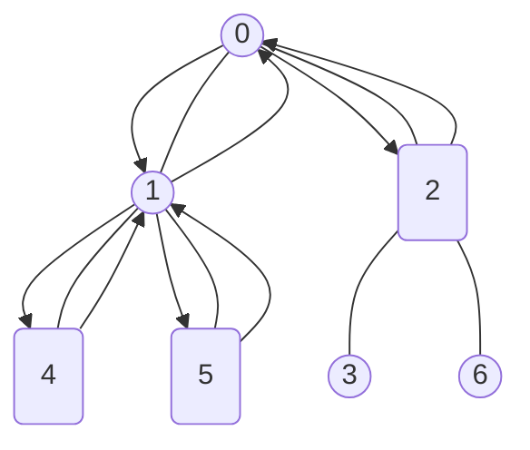

```text
Input: n = 7, edges = [[0,1],[0,2],[1,4],[1,5],[2,3],[2,6]], hasApple = [false,false,true,false,true,true,false]
Output: 8
Explanation: The figure above represents the given tree where red vertices have an apple.
One optimal path to collect all apples is shown by the green arrows.
```

```text
Example 2:
```

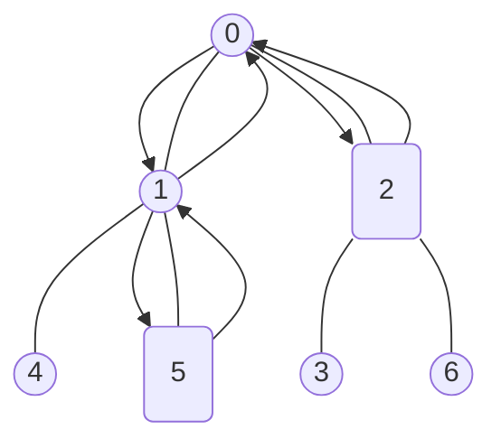

```text
Input: n = 7, edges = [[0,1],[0,2],[1,4],[1,5],[2,3],[2,6]], hasApple = [false,false,true,false,false,true,false]
Output: 6
Explanation: The figure above represents the given tree where red vertices have an apple.
One optimal path to collect all apples is shown by the green arrows.
```

```text
Example 3:
Input: n = 7, edges = [[0,1],[0,2],[1,4],[1,5],[2,3],[2,6]], hasApple = [false,false,false,false,false,false,false]
Output: 0
```

```text
Constraints:
1 <= n <= 10^5
edges.length == n - 1
edges[i].length == 2
0 <= ai < bi <= n - 1
fromi < toi
hasApple.length == n
```

</details>

<details><summary>C</summary>

```c
// https://leetcode.cn/problems/minimum-time-to-collect-all-apples-in-a-tree/solutions/746413/c-mo-ni-lin-jie-ju-zhen-by-big0range-0t8q/
bool dfs(int n, bool *hasApple, int hasAppleSize, int index, int **adjacent, int *adjacentColSize, int *retVal) {
    if (index >= n) {
        return false;
    }
    int len = adjacentColSize[index];

    adjacentColSize[index] = 0;
    bool flag = false;
    int i;
    for (i = 0; i < len; ++i) {
        if (adjacentColSize[adjacent[index][i]] == 0) {
            continue;
        }

        if (dfs(n, hasApple, hasAppleSize, adjacent[index][i], adjacent, adjacentColSize, retVal) == false) {
            continue;
        }

        (*retVal) += 2;
        flag = true;
    }

    return (hasApple[index] || flag);
}
int minTime(int n, int **edges, int edgesSize, int *edgesColSize, bool *hasApple, int hasAppleSize) {
    int retVal = 0;

    int i, j;

    int *adjacentColSize = (int *)malloc(n * sizeof(int));
    if (adjacentColSize == NULL) {
        perror("malloc");
        return retVal;
    }
    memset(adjacentColSize, 0, (n * sizeof(int)));

#define MAX_ADJACENT_LEN (20)
    int **adjacent = (int **)malloc(n * sizeof(int *));
    if (adjacent == NULL) {
        perror("malloc");
        free(adjacentColSize);
        adjacentColSize = NULL;
        return retVal;
    }
    for (i = 0; i < n; ++i) {
        adjacent[i] = (int *)malloc(MAX_ADJACENT_LEN * sizeof(int));
        if (adjacent[i] == NULL) {
            perror("malloc");
            free(adjacentColSize);
            adjacentColSize = NULL;
            for (j = 0; j < i; ++j) {
                free(adjacent[j]);
                adjacent[j] = NULL;
            }
            free(adjacent);
            adjacent = NULL;
            return retVal;
        }
        memset(adjacent[i], 0, (MAX_ADJACENT_LEN * sizeof(int)));
    }

    for (i = 0; i < edgesSize; ++i) {
        adjacent[edges[i][0]][(adjacentColSize[edges[i][0]])++] = edges[i][1];
        adjacent[edges[i][1]][(adjacentColSize[edges[i][1]])++] = edges[i][0];
    }
#if (DEBUG)
    for (i = 0; i < n; ++i) {
        printf("%d: ", i);
        for (j = 0; j < adjacentColSize[i]; ++j) {
            printf("%d ", adjacent[i][j]);
        }
        printf("\n");
    }
#endif

    dfs(n, hasApple, hasAppleSize, 0, adjacent, adjacentColSize, &retVal);
    free(adjacentColSize);
    adjacentColSize = NULL;
    for (i = 0; i < n; ++i) {
        free(adjacent[i]);
        adjacent[i] = NULL;
    }
    free(adjacent);
    adjacent = NULL;

    return retVal;
}
```

</details>

<details><summary>C++</summary>

```c++
// https://leetcode.com/problems/minimum-time-to-collect-all-apples-in-a-tree/solutions/2864715/minimum-time-to-collect-all-apples-in-a-tree/
class Solution {
   public:
    int dfs(int node, int parent, vector<vector<int>>& adj, vector<bool>& hasApple) {
        int totalTime = 0;

        int childTime = 0;
        for (auto child : adj[node]) {
            if (child == parent) {
                continue;
            }
            childTime = dfs(child, node, adj, hasApple);

            /* childTime > 0 indicates subtree of child has apples.
             * Since the root node of the subtree does not contribute to the time, even if it has an apple,
             * we have to check it independently.
             */
            if (childTime || hasApple[child]) {
                totalTime += childTime + 2;
            }
        }

        return totalTime;
    }
    int minTime(int n, vector<vector<int>>& edges, vector<bool>& hasApple) {
        int retVal = 0;

        vector<vector<int>> adjacent(n);
        for (auto& edge : edges) {
            adjacent[edge[0]].push_back(edge[1]);
            adjacent[edge[1]].push_back(edge[0]);
        }
        retVal = dfs(0, -1, adjacent, hasApple);

        return retVal;
    }
};
```

</details>

## [1466. Reorder Routes to Make All Paths Lead to the City Zero](https://leetcode.com/problems/reorder-routes-to-make-all-paths-lead-to-the-city-zero/)  1633

<details><summary>Description</summary>

```text
There are n cities numbered from 0 to n - 1 and n - 1 roads
such that there is only one way to travel between two different cities (this network form a tree).
Last year, The ministry of transport decided to orient the roads in one direction because they are too narrow.

Roads are represented by connections where connections[i] = [ai, bi] represents a road from city ai to city bi.

This year, there will be a big event in the capital (city 0), and many people want to travel to this city.

Your task consists of reorienting some roads such that each city can visit the city 0.
Return the minimum number of edges changed.

It's guaranteed that each city can reach city 0 after reorder.

Example 1:
Input: n = 6, connections = [[0,1],[1,3],[2,3],[4,0],[4,5]]
Output: 3
Explanation: Change the direction of edges show in red such that each node can reach the node 0 (capital).

Example 2:
Input: n = 5, connections = [[1,0],[1,2],[3,2],[3,4]]
Output: 2
Explanation: Change the direction of edges show in red such that each node can reach the node 0 (capital).

Example 3:
Input: n = 3, connections = [[1,0],[2,0]]
Output: 0

Constraints:
2 <= n <= 5 * 10^4
connections.length == n - 1
connections[i].length == 2
0 <= ai, bi <= n - 1
ai != bi
```

<details><summary>Hint</summary>

```text
1. Treat the graph as undirected.
   Start a dfs from the root, if you come across an edge in the forward direction, you need to reverse the edge.
```

</details>

</details>

<details><summary>C</summary>

```c
struct AdjacentNode {
    int val;
    struct AdjacentNode* next;
};
int minReorder(int n, int** connections, int connectionsSize, int* connectionsColSize) {
    int retVal = 0;

    int i, j;
    struct AdjacentNode* pCurrent = NULL;
    struct AdjacentNode* pTemp = NULL;

    // Build Adjacent Array
    struct AdjacentNode* adjacent[n];
    struct AdjacentNode* backAdjacent[n];
    for (i = 0; i < n; ++i) {
        adjacent[i] = (struct AdjacentNode*)malloc(sizeof(struct AdjacentNode));
        if (adjacent[i] == NULL) {
            perror("malloc");
            for (j = 0; j < i; ++j) {
                pCurrent = adjacent[j];
                while (pCurrent != NULL) {
                    pTemp = pCurrent;
                    pCurrent = pCurrent->next;
                    free(pTemp);
                    pTemp = NULL;
                }
                pCurrent = backAdjacent[j];
                while (pCurrent != NULL) {
                    pTemp = pCurrent;
                    pCurrent = pCurrent->next;
                    free(pTemp);
                    pTemp = NULL;
                }
            }
            return retVal;
        }
        adjacent[i]->val = 0;
        adjacent[i]->next = NULL;
        backAdjacent[i] = (struct AdjacentNode*)malloc(sizeof(struct AdjacentNode));
        if (backAdjacent[i] == NULL) {
            perror("malloc");
            for (j = 0; j < i; ++j) {
                pCurrent = adjacent[j];
                while (pCurrent != NULL) {
                    pTemp = pCurrent;
                    pCurrent = pCurrent->next;
                    free(pTemp);
                    pTemp = NULL;
                }
                pCurrent = backAdjacent[j];
                while (pCurrent != NULL) {
                    pTemp = pCurrent;
                    pCurrent = pCurrent->next;
                    free(pTemp);
                    pTemp = NULL;
                }
            }
            return retVal;
        }
        backAdjacent[i]->val = 0;
        backAdjacent[i]->next = NULL;
    }
    for (i = 0; i < connectionsSize; ++i) {
        pTemp = (struct AdjacentNode*)malloc(sizeof(struct AdjacentNode));
        if (pTemp == NULL) {
            perror("malloc");
            for (i = 0; i < n; ++i) {
                pCurrent = adjacent[i];
                while (pCurrent != NULL) {
                    pTemp = pCurrent;
                    pCurrent = pCurrent->next;
                    free(pTemp);
                    pTemp = NULL;
                }
                pCurrent = backAdjacent[i];
                while (pCurrent != NULL) {
                    pTemp = pCurrent;
                    pCurrent = pCurrent->next;
                    free(pTemp);
                    pTemp = NULL;
                }
            }
            return retVal;
        }
        pTemp->val = connections[i][1];
        pTemp->next = NULL;
        pCurrent = adjacent[connections[i][0]];
        while (pCurrent->next != NULL) {
            pCurrent = pCurrent->next;
        }
        pCurrent->next = pTemp;

        pTemp = (struct AdjacentNode*)malloc(sizeof(struct AdjacentNode));
        if (pTemp == NULL) {
            perror("malloc");
            for (i = 0; i < n; ++i) {
                pCurrent = adjacent[i];
                while (pCurrent != NULL) {
                    pTemp = pCurrent;
                    pCurrent = pCurrent->next;
                    free(pTemp);
                    pTemp = NULL;
                }
                pCurrent = backAdjacent[i];
                while (pCurrent != NULL) {
                    pTemp = pCurrent;
                    pCurrent = pCurrent->next;
                    free(pTemp);
                    pTemp = NULL;
                }
            }
            return retVal;
        }
        pTemp->val = connections[i][0];
        pTemp->next = NULL;
        pCurrent = backAdjacent[connections[i][1]];
        while (pCurrent->next != NULL) {
            pCurrent = pCurrent->next;
        }
        pCurrent->next = pTemp;
    }
    for (i = 0; i < n; ++i) {
        pCurrent = adjacent[i];
        adjacent[i] = adjacent[i]->next;
        free(pCurrent);
        pCurrent = NULL;

        pCurrent = backAdjacent[i];
        backAdjacent[i] = backAdjacent[i]->next;
        free(pCurrent);
        pCurrent = NULL;
    }

    // Breadth-First Search
    int bfsQueueFront = 0;
    int bfsQueueRear = 0;
    int bfsQueue[n * 2];
    memset(bfsQueue, 0, sizeof(bfsQueue));
    bfsQueue[bfsQueueRear] = 0;
    ++bfsQueueRear;

    bool visit[n];
    memset(visit, false, sizeof(visit));

    int src;
    while (bfsQueueFront < bfsQueueRear) {
        src = bfsQueue[bfsQueueFront];
        ++bfsQueueFront;

        visit[src] = true;

        pCurrent = adjacent[src];
        while (pCurrent != NULL) {
            if (visit[pCurrent->val] == false) {
                ++retVal;
                bfsQueue[bfsQueueRear] = pCurrent->val;
                ++bfsQueueRear;
            }

            pCurrent = pCurrent->next;
        }
        pCurrent = backAdjacent[src];
        while (pCurrent != NULL) {
            if (visit[pCurrent->val] == false) {
                bfsQueue[bfsQueueRear] = pCurrent->val;
                ++bfsQueueRear;
            }

            pCurrent = pCurrent->next;
        }
    }

    // Free Adjacent Array
    for (i = 0; i < n; ++i) {
        pCurrent = adjacent[i];
        while (pCurrent != NULL) {
            pTemp = pCurrent;
            pCurrent = pCurrent->next;
            free(pTemp);
            pTemp = NULL;
        }
        pCurrent = backAdjacent[i];
        while (pCurrent != NULL) {
            pTemp = pCurrent;
            pCurrent = pCurrent->next;
            free(pTemp);
            pTemp = NULL;
        }
    }

    return retVal;
}
```

</details>

<details><summary>C++</summary>

```c++
class Solution {
   public:
    int minReorder(int n, vector<vector<int>>& connections) {
        int retVal = 0;

        vector<vector<int>> adjacent(n);
        vector<vector<int>> backAdjacent(n);
        for (auto connection : connections) {
            adjacent[connection[0]].push_back(connection[1]);
            backAdjacent[connection[1]].push_back(connection[0]);
        }

        // Breadth-First Search
        queue<int> bfsQueue;
        bfsQueue.push(0);

        vector<bool> visit(n);

        while (bfsQueue.empty() == false) {
            int current = bfsQueue.front();
            bfsQueue.pop();

            visit[current] = true;

            for (auto iterator : adjacent[current]) {
                if (visit[iterator] == false) {
                    ++retVal;
                    bfsQueue.push(iterator);
                }
            }

            for (auto iterator : backAdjacent[current]) {
                if (visit[iterator] == false) {
                    bfsQueue.push(iterator);
                }
            }
        }

        return retVal;
    }
};
```

</details>

<details><summary>Python3</summary>

```python
class Solution:
    def minReorder(self, n: int, connections: List[List[int]]) -> int:
        retVal = 0

        adjacent = [[] for i in range(n)]
        backAdjacent = [[] for i in range(n)]
        for src, dest in connections:
            adjacent[src].append(dest)
            backAdjacent[dest].append(src)

        # Breadth-First Search
        bfsQueue = deque([0])
        visit = set()
        while bfsQueue:
            src = bfsQueue.popleft()
            visit.add(src)

            for dest in adjacent[src]:
                if dest not in visit:
                    bfsQueue.append(dest)
                    retVal += 1

            for dest in backAdjacent[src]:
                if dest not in visit:
                    bfsQueue.append(dest)

        return retVal
```

</details>

## [1489. Find Critical and Pseudo-Critical Edges in Minimum Spanning Tree](https://leetcode.com/problems/find-critical-and-pseudo-critical-edges-in-minimum-spanning-tree/)  2571

- [Official](https://leetcode.com/problems/find-critical-and-pseudo-critical-edges-in-minimum-spanning-tree/editorial/)
- [Official](https://leetcode.cn/problems/find-critical-and-pseudo-critical-edges-in-minimum-spanning-tree/solutions/569009/zhao-dao-zui-xiao-sheng-cheng-shu-li-de-gu57q/)

<details><summary>Description</summary>

```text
Given a weighted undirected connected graph with n vertices numbered from 0 to n - 1,
and an array edges where edges[i] = [ai, bi, weighti]
represents a bidirectional and weighted edge between nodes ai and bi.
A minimum spanning tree (MST) is a subset of the graph's edges
that connects all vertices without cycles and with the minimum possible total edge weight.

Find all the critical and pseudo-critical edges in the given graph's minimum spanning tree (MST).
An MST edge whose deletion from the graph would cause the MST weight to increase is called a critical edge.
On the other hand, a pseudo-critical edge is that which can appear in some MSTs but not all.

Note that you can return the indices of the edges in any order.

Example 1:
Input: n = 5, edges = [[0,1,1],[1,2,1],[2,3,2],[0,3,2],[0,4,3],[3,4,3],[1,4,6]]
Output: [[0,1],[2,3,4,5]]
Explanation: The figure above describes the graph.
The following figure shows all the possible MSTs:
Notice that the two edges 0 and 1 appear in all MSTs, therefore they are critical edges,
so we return them in the first list of the output.
The edges 2, 3, 4, and 5 are only part of some MSTs, therefore they are considered pseudo-critical edges.
We add them to the second list of the output.

Example 2:
Input: n = 4, edges = [[0,1,1],[1,2,1],[2,3,1],[0,3,1]]
Output: [[],[0,1,2,3]]
Explanation: We can observe that since all 4 edges have equal weight,
choosing any 3 edges from the given 4 will yield an MST.
Therefore all 4 edges are pseudo-critical.

Constraints:
2 <= n <= 100
1 <= edges.length <= min(200, n * (n - 1) / 2)
edges[i].length == 3
0 <= ai < bi < n
1 <= weighti <= 1000
All pairs (ai, bi) are distinct.
```

<details><summary>Hint</summary>

```text
1. Use the Kruskal algorithm to find the minimum spanning tree
   by sorting the edges and picking edges from ones with smaller weights.
2. Use a disjoint set to avoid adding redundant edges that result in a cycle.
3. To find if one edge is critical,
   delete that edge and re-run the MST algorithm and see if the weight of the new MST increases.
4. To find if one edge is non-critical (in any MST),
   include that edge to the accepted edge list and continue the MST algorithm,
   then see if the resulting MST has the same weight of the initial MST of the entire graph.
```

</details>

</details>

<details><summary>C</summary>

```c
void swap(int* a, int* b) {
    int tmp = *a;
    *a = *b;
    *b = tmp;
}
struct Edge {
    int x;
    int y;
    int w;
    int id;
};
int compareStruct(const void* a, const void* b) {
    int pa = ((struct Edge*)a)->w;
    int pb = ((struct Edge*)b)->w;

    return (pa > pb);
}
struct DisjointSetUnion {
    int* f;
    int* size;
    int n;
    int setCount;
};
void initDSU(struct DisjointSetUnion* obj, int n) {
    obj->f = (int*)malloc(n * sizeof(int));
    if (obj->f == NULL) {
        perror("malloc");
        return;
    }
    obj->size = (int*)malloc(n * sizeof(int));
    if (obj->size == NULL) {
        perror("malloc");
        return;
    }
    obj->n = n;
    obj->setCount = n;

    int i;
    for (i = 0; i < n; i++) {
        obj->f[i] = i;
        obj->size[i] = 1;
    }
}
void freeDSU(struct DisjointSetUnion* obj) {
    free(obj->f);
    free(obj->size);
    free(obj);
    obj = NULL;
}
int find(struct DisjointSetUnion* obj, int x) {
    int retVal = x;
    if (obj->f[x] == x) {
        return retVal;
    }
    obj->f[x] = find(obj, obj->f[x]);
    retVal = obj->f[x];

    return retVal;
}
bool unionSet(struct DisjointSetUnion* obj, int x, int y) {
    bool retVal = false;

    int fx = find(obj, x);
    int fy = find(obj, y);
    if (fx == fy) {
        return retVal;
    }

    if (obj->size[fx] < obj->size[fy]) {
        swap(&fx, &fy);
    }
    obj->size[fx] += obj->size[fy];
    obj->f[fy] = fx;
    obj->setCount--;
    retVal = true;

    return retVal;
}
/**
 * Return an array of arrays of size *returnSize.
 * The sizes of the arrays are returned as *returnColumnSizes array.
 * Note: Both returned array and *columnSizes array must be malloced, assume caller calls free().
 */
int** findCriticalAndPseudoCriticalEdges(int n, int** edges, int edgesSize, int* edgesColSize, int* returnSize,
                                         int** returnColumnSizes) {
    int** pRetVal = NULL;

    //
    (*returnSize) = 0;
    int i, j;

    //
    struct Edge edgesTmp[edgesSize];
    for (i = 0; i < edgesSize; i++) {
        edgesTmp[i].x = edges[i][0];
        edgesTmp[i].y = edges[i][1];
        edgesTmp[i].w = edges[i][2];
        edgesTmp[i].id = i;
    }
    qsort(edgesTmp, edgesSize, sizeof(struct Edge), compareStruct);

    struct DisjointSetUnion* ufStd = (struct DisjointSetUnion*)malloc(sizeof(struct DisjointSetUnion));
    if (ufStd == NULL) {
        perror("malloc");
        return pRetVal;
    }
    initDSU(ufStd, n);
    int value = 0;
    for (i = 0; i < edgesSize; ++i) {
        if (unionSet(ufStd, edgesTmp[i].x, edgesTmp[i].y)) {
            value += edgesTmp[i].w;
        }
    }
    freeDSU(ufStd);
    ufStd = NULL;

    //
    (*returnSize) = 2;
    pRetVal = (int**)malloc((*returnSize) * sizeof(int*));
    if (pRetVal == NULL) {
        perror("malloc");
        (*returnSize) = 0;
        return pRetVal;
    }
    for (i = 0; i < (*returnSize); i++) {
        pRetVal[i] = (int*)malloc(edgesSize * sizeof(int));
        if (pRetVal[i] == NULL) {
            perror("malloc");
            for (j = 0; j < i; ++j) {
                free(pRetVal[j]);
                pRetVal[j] = NULL;
            }
            free(pRetVal);
            pRetVal = NULL;
            (*returnSize) = 0;
            return pRetVal;
        }
    }
    (*returnColumnSizes) = (int*)malloc((*returnSize) * sizeof(int));
    if ((*returnColumnSizes) == NULL) {
        perror("malloc");
        for (j = 0; j < i; ++j) {
            free(pRetVal[j]);
            pRetVal[j] = NULL;
        }
        free(pRetVal);
        pRetVal = NULL;
        (*returnSize) = 0;
        return pRetVal;
    }
    memset((*returnColumnSizes), 0, ((*returnSize) * sizeof(int)));

    //
    struct DisjointSetUnion* uf1 = NULL;
    struct DisjointSetUnion* uf2 = NULL;
    int v;
    for (i = 0; i < edgesSize; ++i) {
        uf1 = (struct DisjointSetUnion*)malloc(sizeof(struct DisjointSetUnion));
        if (uf1 == NULL) {
            perror("malloc");
            for (j = 0; j < i; ++j) {
                free(pRetVal[j]);
                pRetVal[j] = NULL;
            }
            free(pRetVal);
            pRetVal = NULL;
            free((*returnColumnSizes));
            (*returnColumnSizes) = NULL;
            (*returnSize) = 0;
            return pRetVal;
        }
        initDSU(uf1, n);
        v = 0;
        for (j = 0; j < edgesSize; ++j) {
            if ((i != j) && (unionSet(uf1, edgesTmp[j].x, edgesTmp[j].y) == true)) {
                v += edgesTmp[j].w;
            }
        }
        if (uf1->setCount != 1 || (uf1->setCount == 1 && v > value)) {
            pRetVal[0][(*returnColumnSizes)[0]++] = edgesTmp[i].id;
            freeDSU(uf1);
            uf1 = NULL;
            continue;
        }
        freeDSU(uf1);
        uf1 = NULL;

        uf2 = (struct DisjointSetUnion*)malloc(sizeof(struct DisjointSetUnion));
        if (uf2 == NULL) {
            perror("malloc");
            for (j = 0; j < i; ++j) {
                free(pRetVal[j]);
                pRetVal[j] = NULL;
            }
            free(pRetVal);
            pRetVal = NULL;
            free((*returnColumnSizes));
            (*returnColumnSizes) = NULL;
            (*returnSize) = 0;
            return pRetVal;
        }
        initDSU(uf2, n);
        unionSet(uf2, edgesTmp[i].x, edgesTmp[i].y);
        v = edgesTmp[i].w;
        for (j = 0; j < edgesSize; ++j) {
            if ((i != j) && (unionSet(uf2, edgesTmp[j].x, edgesTmp[j].y)) == true) {
                v += edgesTmp[j].w;
            }
        }
        if (v == value) {
            pRetVal[1][(*returnColumnSizes)[1]++] = edgesTmp[i].id;
        }
        freeDSU(uf2);
        uf2 = NULL;
    }

    return pRetVal;
}
```

</details>

<details><summary>C++</summary>

```c++
class UnionFind {
   public:
    int n;
    int setCount;
    vector<int> parent;
    vector<int> size;

    UnionFind(int _n) : n(_n), setCount(_n), parent(_n), size(_n, 1) {
        //
        iota(parent.begin(), parent.end(), 0);
    }
    int findset(int x) {
        int retVal = x;

        if (parent[x] == x) {
            return retVal;
        }
        parent[x] = findset(parent[x]);
        retVal = parent[x];

        return retVal;
    }
    bool unite(int x, int y) {
        bool retVal = false;

        x = findset(x);
        y = findset(y);
        if (x == y) {
            return retVal;
        }

        if (size[x] < size[y]) {
            swap(x, y);
        }
        parent[y] = x;
        size[x] += size[y];
        --setCount;
        retVal = true;

        return retVal;
    }
    bool connected(int x, int y) {
        bool retVal = false;

        x = findset(x);
        y = findset(y);
        retVal = (x == y);

        return retVal;
    }
};

class Solution {
   public:
    vector<vector<int>> findCriticalAndPseudoCriticalEdges(int n, vector<vector<int>>& edges) {
        vector<vector<int>> retVal(2);

        int edgesSize = edges.size();
        for (int i = 0; i < edgesSize; ++i) {
            edges[i].push_back(i);
        }
        sort(edges.begin(), edges.end(), [](const auto& u, const auto& v) {
            //
            return u[2] < v[2];
        });

        UnionFind uf_std(n);
        int value = 0;
        for (int i = 0; i < edgesSize; ++i) {
            if (uf_std.unite(edges[i][0], edges[i][1]) == true) {
                value += edges[i][2];
            }
        }

        for (int i = 0; i < edgesSize; ++i) {
            UnionFind uf(n);
            int v = 0;

            for (int j = 0; j < edgesSize; ++j) {
                if ((i != j) && (uf.unite(edges[j][0], edges[j][1]) == true)) {
                    v += edges[j][2];
                }
            }

            if ((uf.setCount != 1) || ((uf.setCount == 1) && (v > value))) {
                retVal[0].push_back(edges[i][3]);
                continue;
            }

            uf = UnionFind(n);
            uf.unite(edges[i][0], edges[i][1]);
            v = edges[i][2];

            for (int j = 0; j < edgesSize; ++j) {
                if ((i != j) && (uf.unite(edges[j][0], edges[j][1]) == true)) {
                    v += edges[j][2];
                }
            }

            if (v == value) {
                retVal[1].push_back(edges[i][3]);
            }
        }

        return retVal;
    }
};
```

</details>

<details><summary>Python3</summary>

```python
class UnionFind:
    def __init__(self, n: int):
        self.parent = list(range(n))
        self.size = [1] * n
        self.n = n
        self.setCount = n

    def findset(self, x: int) -> int:
        retVal = x

        if self.parent[x] == x:
            return retVal

        self.parent[x] = self.findset(self.parent[x])
        retVal = self.parent[x]

        return retVal

    def unite(self, x: int, y: int) -> bool:
        retVal = False

        x = self.findset(x)
        y = self.findset(y)
        if x == y:
            return retVal

        if self.size[x] < self.size[y]:
            x, y = y, x
        self.parent[y] = x
        self.size[x] += self.size[y]
        self.setCount -= 1
        retVal = True

        return retVal

    def connected(self, x: int, y: int) -> bool:
        retVal = False

        x = self.findset(x)
        y = self.findset(y)
        retVal = (x == y)

        return retVal


class Solution:
    def findCriticalAndPseudoCriticalEdges(self, n: int, edges: List[List[int]]) -> List[List[int]]:
        retVal = [list(), list()]

        edgesSize = len(edges)

        for i, edge in enumerate(edges):
            edge.append(i)
        edges.sort(key=lambda x: x[2])

        uf_std = UnionFind(n)
        value = 0
        for i in range(edgesSize):
            if uf_std.unite(edges[i][0], edges[i][1]):
                value += edges[i][2]

        for i in range(edgesSize):
            uf = UnionFind(n)
            v = 0

            for j in range(edgesSize):
                if (i != j) and (uf.unite(edges[j][0], edges[j][1]) == True):
                    v += edges[j][2]

            if (uf.setCount != 1) or ((uf.setCount == 1) and (v > value)):
                retVal[0].append(edges[i][3])
                continue

            uf = UnionFind(n)
            uf.unite(edges[i][0], edges[i][1])
            v = edges[i][2]

            for j in range(edgesSize):
                if (i != j) and (uf.unite(edges[j][0], edges[j][1]) == True):
                    v += edges[j][2]

            if v == value:
                retVal[1].append(edges[i][3])

        return retVal
```

</details>

## [1514. Path with Maximum Probability](https://leetcode.com/problems/path-with-maximum-probability/)  1846

- [Official](https://leetcode.com/problems/path-with-maximum-probability/editorial/)
- [Official](https://leetcode.cn/problems/path-with-maximum-probability/solutions/371278/gai-lu-zui-da-de-lu-jing-by-leetcode-solution/)

<details><summary>Description</summary>

```text
You are given an undirected weighted graph of n nodes (0-indexed),
represented by an edge list where edges[i] = [a, b] is an undirected edge
connecting the nodes a and b with a probability of success of traversing that edge succProb[i].

Given two nodes start and end,
find the path with the maximum probability of success to go from start to end and return its success probability.

If there is no path from start to end, return 0.
Your answer will be accepted if it differs from the correct answer by at most 1e-5.

Example 1:
Input: n = 3, edges = [[0,1],[1,2],[0,2]], succProb = [0.5,0.5,0.2], start = 0, end = 2
Output: 0.25000
Explanation: There are two paths from start to end,
one having a probability of success = 0.2 and the other has 0.5 * 0.5 = 0.25.

Example 2:
Input: n = 3, edges = [[0,1],[1,2],[0,2]], succProb = [0.5,0.5,0.3], start = 0, end = 2
Output: 0.30000

Example 3:
Input: n = 3, edges = [[0,1]], succProb = [0.5], start = 0, end = 2
Output: 0.00000
Explanation: There is no path between 0 and 2.

Constraints:
2 <= n <= 10^4
0 <= start, end < n
start != end
0 <= a, b < n
a != b
0 <= succProb.length == edges.length <= 2*10^4
0 <= succProb[i] <= 1
There is at most one edge between every two nodes.
```

<details><summary>Hint</summary>

```text
1. Multiplying probabilities will result in precision errors.
2. Take log probabilities to sum up numbers instead of multiplying them.
3. Use Dijkstra's algorithm to find the minimum path between the two nodes after negating all costs.
```

</details>

</details>

<details><summary>C</summary>

```c
// https://leetcode.cn/problems/path-with-maximum-probability/solutions/543933/dijkstra-dui-you-hua-cyu-yan-by-numpy-2-ab0j/
#if (1)
#define N (10010)
#define M (1000000)

int hv;
double hp;

double heap[M][2];
int heapSize;

int h[N], to[M], ne[M], idx;
double w[M];

double dist[N];
bool st[N];

void push(int v, double p) {
    int i;
    for (i = ++heapSize; heap[i / 2][0] < p; i /= 2) {
        heap[i][0] = heap[i / 2][0];
        heap[i][1] = heap[i / 2][1];
    }
    heap[i][0] = p;
    heap[i][1] = v;
}
void pop() {
    hp = heap[1][0];
    hv = heap[1][1];

    double lastp = heap[heapSize][0];
    int lastv = heap[heapSize--][1];

    int i, child;
    for (i = 1; i * 2 <= heapSize; i = child) {
        child = i * 2;
        if (child != heapSize && heap[child + 1][0] > heap[child][0]) {
            child++;
        }

        if (lastp < heap[child][0]) {
            heap[i][0] = heap[child][0];
            heap[i][1] = heap[child][1];
        } else {
            break;
        }
    }
    heap[i][0] = lastp;
    heap[i][1] = lastv;
}
void add(int src, int dst, double pathProb) {
    to[idx] = dst;
    w[idx] = pathProb;
    ne[idx] = h[src];
    h[src] = idx++;
}
void dijkstra(int s, int n) {
    int i;

    dist[s] = 1.0;
    push(s, 1.0);
    while (heapSize > 0) {
        pop();
        if (st[hv]) {
            continue;
        }
        st[hv] = true;

        for (i = h[hv]; ~i; i = ne[i]) {
            if (!st[to[i]] && hp * w[i] > dist[to[i]]) {
                dist[to[i]] = hp * w[i];
                push(to[i], dist[to[i]]);
            }
        }
    }
}
#endif
double maxProbability(int n, int **edges, int edgesSize, int *edgesColSize, double *succProb, int succProbSize,
                      int start, int end) {
    double retVal = 0;

    int i;

    idx = 0;
    heapSize = 0;
    heap[0][0] = 1.0;
    memset(st, false, sizeof(st));
    memset(h, -1, sizeof(h));
    for (i = 0; i < n; i++) {
        dist[i] = 0.0;
    }

    int src, dst;
    double pathProb;
    for (i = 0; i < edgesSize; i++) {
        src = edges[i][0];
        dst = edges[i][1];
        pathProb = succProb[i];

        add(src, dst, pathProb);
        add(dst, src, pathProb);
    }

    dijkstra(start, n);
    if (dist[end] != 0.0) {
        retVal = dist[end];
    }

    return retVal;
}
```

</details>

<details><summary>C++</summary>

```c++
class Solution {
   public:
    typedef pair<int, double> pid;

    double maxProbability(int n, vector<vector<int>>& edges, vector<double>& succProb, int start, int end) {
        double retVal = 0;

        vector<vector<pid>> graph(n);
        int edgesSize = edges.size();
        for (int i = 0; i < edgesSize; ++i) {
            int src = edges[i][0];
            int dst = edges[i][1];
            double pathProb = succProb[i];

            graph[src].push_back(pid(dst, pathProb));
            graph[dst].push_back(pid(src, pathProb));
        }

        vector<double> maxProb(n);
        maxProb[start] = 1.0;

        // sort the queue such that the highest probability is at the top
        auto compare = [](const pid& a, const pid& b) { return a.second < b.second; };
        priority_queue<pid, vector<pid>, decltype(compare)> priorityQueue(compare);
        priorityQueue.push(pid(start, 1.0));

        while (priorityQueue.empty() == false) {
            auto [curNode, curProb] = priorityQueue.top();
            priorityQueue.pop();
            if (curNode == end) {
                retVal = curProb;
                break;
            }

            for (pid& next : graph[curNode]) {
                int nxtNode = next.first;
                double pathProb = next.second;
                double nextProb = curProb * pathProb;
                if (nextProb > maxProb[nxtNode]) {
                    maxProb[nxtNode] = nextProb;
                    priorityQueue.push(pid(nxtNode, maxProb[nxtNode]));
                }
            }
        }

        return retVal;
    }
};
```

</details>

<details><summary>Python3</summary>

```python
class Solution:
    def maxProbability(self, n: int, edges: List[List[int]], succProb: List[float], start: int, end: int) -> float:
        retVal = 0

        graph = defaultdict(list)
        for i, (u, v) in enumerate(edges):
            graph[u].append((v, succProb[i]))
            graph[v].append((u, succProb[i]))

        maxProb = [0.0] * n
        maxProb[start] = 1.0

        priorityQueue = [(-1.0, start)]
        while priorityQueue:
            curProb, curNode = heappop(priorityQueue)
            if curNode == end:
                retVal = -curProb
                break

            for nxtNode, pathProb in graph[curNode]:
                if -curProb * pathProb > maxProb[nxtNode]:
                    maxProb[nxtNode] = -curProb * pathProb
                    heappush(priorityQueue, (-maxProb[nxtNode], nxtNode))

        return retVal
```

</details>

## [1519. Number of Nodes in the Sub-Tree With the Same Label](https://leetcode.com/problems/number-of-nodes-in-the-sub-tree-with-the-same-label/)  1808

- [Official](https://leetcode.com/problems/number-of-nodes-in-the-sub-tree-with-the-same-label/solutions/2864718/number-of-nodes-in-the-sub-tree-with-the-same-label/)
- [Official](https://leetcode.cn/problems/number-of-nodes-in-the-sub-tree-with-the-same-label/solutions/339169/zi-shu-zhong-biao-qian-xiang-tong-de-jie-dian-sh-3/)

<details><summary>Description</summary>

```text
You are given a tree (i.e. a connected, undirected graph that has no cycles)
consisting of n nodes numbered from 0 to n - 1 and exactly n - 1 edges.
The root of the tree is the node 0, and each node of the tree has a label
which is a lower-case character given in the string labels (i.e. The node with the number i has the label labels[i]).

The edges array is given on the form edges[i] = [ai, bi], which means there is an edge between nodes ai and bi in the tree.

Return an array of size n where ans[i] is the number of nodes in the subtree of the ith node
which have the same label as node i.

A subtree of a tree T is the tree consisting of a node in T and all of its descendant nodes.
```

```text
Example 1:
```

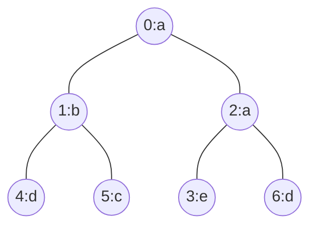

```text
Input: n = 7, edges = [[0,1],[0,2],[1,4],[1,5],[2,3],[2,6]], labels = "abaedcd"
Output: [2,1,1,1,1,1,1]
Explanation: Node 0 has label 'a' and its sub-tree has node 2 with label 'a' as well, thus the answer is 2.
Notice that any node is part of its sub-tree.
Node 1 has a label 'b'.
The sub-tree of node 1 contains nodes 1,4 and 5, as nodes 4 and 5 have different labels than node 1,
the answer is just 1 (the node itself).
```

```text
Example 2:
```

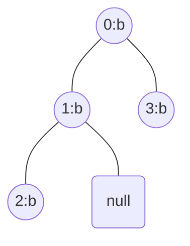

```text
Input: n = 4, edges = [[0,1],[1,2],[0,3]], labels = "bbbb"
Output: [4,2,1,1]
Explanation: The sub-tree of node 2 contains only node 2, so the answer is 1.
The sub-tree of node 3 contains only node 3, so the answer is 1.
The sub-tree of node 1 contains nodes 1 and 2, both have label 'b', thus the answer is 2.
The sub-tree of node 0 contains nodes 0, 1, 2 and 3, all with label 'b', thus the answer is 4.
```

```text
Example 3:
```

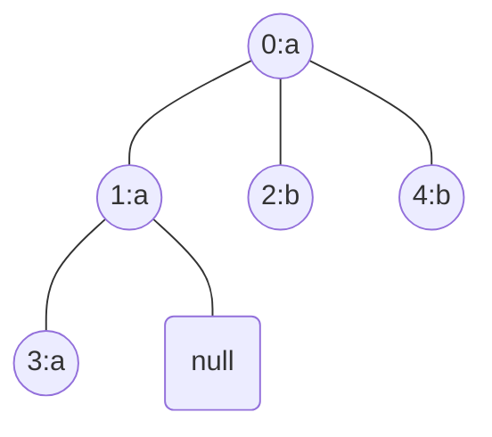

```text
Input: n = 5, edges = [[0,1],[0,2],[1,3],[0,4]], labels = "aabab"
Output: [3,2,1,1,1]
```

```text
Constraints:
1 <= n <= 10^5
edges.length == n - 1
edges[i].length == 2
0 <= ai, bi < n
ai != bi
labels.length == n
labels is consisting of only of lowercase English letters.
```

</details>

<details><summary>C</summary>

```c
// https://leetcode.cn/problems/number-of-nodes-in-the-sub-tree-with-the-same-label/solutions/918443/cyu-yan-lin-jie-ju-zhen-dfs-hashsuo-yin-4sp1p/
#define MAX_NODE (int)(1e5)
#define MAX_LABELS_CHAR (26)
#define TIME_LIMIT_EXCEEDED (0)
#if (TIME_LIMIT_EXCEEDED)
#define MAX_ADJACENT_LEN (100)  // Time Limit Exceeded
#else
#define MAX_ADJACENT_LEN (10)
#endif
void dfs(int node, char* labels, int* visited, int** arr, int** adjacent, int* count, int* pRetVal) {
    int idx = labels[node] - 'a';
    visited[node] = 1;
    arr[node][idx] = 1;

    int child;
    int i, j;
    for (i = 0; i < count[node]; ++i) {
        child = adjacent[node][i];
        if (visited[child]) {
            continue;
        }
        dfs(child, labels, visited, arr, adjacent, count, pRetVal);

        for (j = 0; j < MAX_LABELS_CHAR; ++j) {
            arr[node][j] += arr[child][j];
        }
    }

    pRetVal[node] = arr[node][idx];
}
/**
 * Note: The returned array must be malloced, assume caller calls free().
 */
int* countSubTrees(int n, int** edges, int edgesSize, int* edgesColSize, char* labels, int* returnSize) {
    int* pRetVal = NULL;

    int i, j;

    //
    (*returnSize) = n;
    pRetVal = (int*)malloc((*returnSize) * sizeof(int));
    if (pRetVal == NULL) {
        perror("malloc");
        (*returnSize) = 0;
        return pRetVal;
    }
    memset(pRetVal, 0, ((*returnSize) * sizeof(int)));

    //
    int count[MAX_NODE];
    memset(count, 0, sizeof(count));

    int** adjacent = (int**)malloc(sizeof(int*) * MAX_NODE);
    if (adjacent == NULL) {
        perror("malloc");
        free(pRetVal);
        pRetVal = NULL;
        (*returnSize) = 0;
        return pRetVal;
    }
    for (i = 0; i < MAX_NODE; ++i) {
        adjacent[i] = (int*)malloc(sizeof(int) * MAX_ADJACENT_LEN);
        if (adjacent[i] == NULL) {
            perror("malloc");
            for (j = 0; j < i; ++j) {
                free(adjacent[j]);
                adjacent[j] = NULL;
            }
            free(adjacent);
            adjacent = NULL;
            free(pRetVal);
            pRetVal = NULL;
            (*returnSize) = 0;
            return pRetVal;
        }
        memset(adjacent[i], 0, sizeof(int) * MAX_ADJACENT_LEN);
    }

    int node1;
    int node2;
    for (i = 0; i < edgesSize; ++i) {
        node1 = edges[i][0];
        node2 = edges[i][1];
        adjacent[node1][count[node1]++] = node2;
        adjacent[node2][count[node2]++] = node1;
    }

    //
    int visited[MAX_NODE];
    memset(visited, 0, sizeof(visited));

    int** arr = (int**)malloc(n * sizeof(int*));
    if (arr == NULL) {
        perror("malloc");
        for (j = 0; j < MAX_NODE; ++j) {
            free(adjacent[j]);
            adjacent[j] = NULL;
        }
        free(adjacent);
        adjacent = NULL;
        free(pRetVal);
        pRetVal = NULL;
        (*returnSize) = 0;
        return pRetVal;
    }
    for (i = 0; i < n; ++i) {
        arr[i] = (int*)malloc(MAX_LABELS_CHAR * sizeof(int));
        if (arr[i] == NULL) {
            perror("malloc");
            for (j = 0; j < i; ++j) {
                free(arr[j]);
                arr[j] = NULL;
            }
            free(arr);
            arr = NULL;
            for (j = 0; j < MAX_NODE; ++j) {
                free(adjacent[j]);
                adjacent[j] = NULL;
            }
            free(adjacent);
            adjacent = NULL;
            free(pRetVal);
            pRetVal = NULL;
            (*returnSize) = 0;
            return pRetVal;
        }
        memset(arr[i], 0, (MAX_LABELS_CHAR * sizeof(int)));
    }

    dfs(0, labels, visited, arr, adjacent, count, pRetVal);

    for (j = 0; j < n; ++j) {
        free(arr[j]);
        arr[j] = NULL;
    }
    free(arr);
    arr = NULL;
    for (j = 0; j < MAX_NODE; ++j) {
        free(adjacent[j]);
        adjacent[j] = NULL;
    }
    free(adjacent);
    adjacent = NULL;

    return pRetVal;
}
```

</details>

<details><summary>C++</summary>

```c++
class Solution {
   public:
    // labels is consisting of only of lowercase English letters.
    int maxNode = 26;

    vector<int> dfs(int node, int parent, vector<vector<int>>& adjacent, string& labels, vector<int>& ans) {
        // Store count of all alphabets in the subtree of the node.
        vector<int> nodeCounts(maxNode);
        nodeCounts[labels[node] - 'a'] = 1;

        for (auto& child : adjacent[node]) {
            if (child == parent) {
                continue;
            }

            vector<int> childCounts = dfs(child, node, adjacent, labels, ans);

            // Add frequencies of the child node in the parent node's frequency array.
            for (int i = 0; i < maxNode; i++) {
                nodeCounts[i] += childCounts[i];
            }
        }
        ans[node] = nodeCounts[labels[node] - 'a'];

        return nodeCounts;
    }

    vector<int> countSubTrees(int n, vector<vector<int>>& edges, string labels) {
        vector<int> retVal(n, 0);

        vector<vector<int>> adjacent(n);
        for (auto& edge : edges) {
            adjacent[edge[0]].push_back(edge[1]);
            adjacent[edge[1]].push_back(edge[0]);
        }

        dfs(0, -1, adjacent, labels, retVal);

        return retVal;
    }
};
```

</details>

## [1557. Minimum Number of Vertices to Reach All Nodes](https://leetcode.com/problems/minimum-number-of-vertices-to-reach-all-nodes/)  1512

- [Official](https://leetcode.com/problems/minimum-number-of-vertices-to-reach-all-nodes/editorial/)
- [Official](https://leetcode.cn/problems/minimum-number-of-vertices-to-reach-all-nodes/solutions/403703/ke-yi-dao-da-suo-you-dian-de-zui-shao-dian-shu-m-2/)

<details><summary>Description</summary>

```text
Given a directed acyclic graph, with n vertices numbered from 0 to n-1,
and an array edges where edges[i] = [fromi, toi] represents a directed edge from node fromi to node toi.

Find the smallest set of vertices from which all nodes in the graph are reachable.
It's guaranteed that a unique solution exists.

Notice that you can return the vertices in any order.

Example 1:
Input: n = 6, edges = [[0,1],[0,2],[2,5],[3,4],[4,2]]
Output: [0,3]
Explanation: It's not possible to reach all the nodes from a single vertex.
From 0 we can reach [0,1,2,5]. From 3 we can reach [3,4,2,5]. So we output [0,3].

Example 2:
Input: n = 5, edges = [[0,1],[2,1],[3,1],[1,4],[2,4]]
Output: [0,2,3]
Explanation: Notice that vertices 0, 3 and 2 are not reachable from any other node, so we must include them.
Also any of these vertices can reach nodes 1 and 4.

Constraints:
2 <= n <= 10^5
1 <= edges.length <= min(10^5, n * (n - 1) / 2)
edges[i].length == 2
0 <= fromi, toi < n
All pairs (fromi, toi) are distinct.
```

<details><summary>Hint</summary>

```text
1. A node that does not have any incoming edge can only be reached by itself.
2. Any other node with incoming edges can be reached from some other node.
3. We only have to count the number of nodes with zero incoming edges.
```

</details>

</details>

<details><summary>C</summary>

```c
/**
 * Note: The returned array must be malloced, assume caller calls free().
 */
int* findSmallestSetOfVertices(int n, int** edges, int edgesSize, int* edgesColSize, int* returnSize) {
    int* pRetVal = NULL;

    (*returnSize) = 0;
    pRetVal = (int*)malloc(n * sizeof(int));
    if (pRetVal == NULL) {
        perror("malloc");
        return pRetVal;
    }
    memset(pRetVal, 0, (n * sizeof(int)));

    int incoming[n];
    memset(incoming, 0, sizeof(incoming));
    int i;
    for (i = 0; i < edgesSize; ++i) {
        ++incoming[edges[i][1]];
    }

    for (i = 0; i < n; ++i) {
        if (incoming[i] == 0) {
            pRetVal[(*returnSize)++] = i;
        }
    }

    return pRetVal;
}
```

</details>

<details><summary>C++</summary>

```c++
class Solution {
   public:
    vector<int> findSmallestSetOfVertices(int n, vector<vector<int>>& edges) {
        vector<int> retVal;

        vector<int> incoming(n, 0);
        for (auto edge : edges) {
            ++incoming[edge[1]];
        }

        for (int i = 0; i < n; ++i) {
            if (incoming[i] == 0) {
                retVal.emplace_back(i);
            }
        }

        return retVal;
    }
};
```

</details>

<details><summary>Python3</summary>

```python
class Solution:
    def findSmallestSetOfVertices(self, n: int, edges: List[List[int]]) -> List[int]:
        retVal = []

        incoming = [0] * n
        for edge in edges:
            incoming[edge[1]] += 1

        for i in range(n):
            if incoming[i] == 0:
                retVal.append(i)

        return retVal
```

</details>

## [1615. Maximal Network Rank](https://leetcode.com/problems/maximal-network-rank/)  1521

- [Official](https://leetcode.com/problems/maximal-network-rank/editorial/)
- [Official](https://leetcode.cn/problems/maximal-network-rank/solutions/2167846/zui-da-wang-luo-zhi-by-leetcode-solution-x4gx/)

<details><summary>Description</summary>

```text
There is an infrastructure of n cities with some number of roads connecting these cities.
Each roads[i] = [ai, bi] indicates that there is a bidirectional road between cities ai and bi.

The network rank of two different cities is defined as the total number of directly connected roads to either city.
If a road is directly connected to both cities, it is only counted once.

The maximal network rank of the infrastructure is the maximum network rank of all pairs of different cities.

Given the integer n and the array roads, return the maximal network rank of the entire infrastructure.

Example 1:
Input: n = 4, roads = [[0,1],[0,3],[1,2],[1,3]]
Output: 4
Explanation: The network rank of cities 0 and 1 is 4 as there are 4 roads that are connected to either 0 or 1.
The road between 0 and 1 is only counted once.

Example 2:
Input: n = 5, roads = [[0,1],[0,3],[1,2],[1,3],[2,3],[2,4]]
Output: 5
Explanation: There are 5 roads that are connected to cities 1 or 2.

Example 3:
Input: n = 8, roads = [[0,1],[1,2],[2,3],[2,4],[5,6],[5,7]]
Output: 5
Explanation: The network rank of 2 and 5 is 5. Notice that all the cities do not have to be connected.

Constraints:
2 <= n <= 100
0 <= roads.length <= n * (n - 1) / 2
roads[i].length == 2
0 <= ai, bi <= n-1
ai != bi
Each pair of cities has at most one road connecting them.
```

<details><summary>Hint</summary>

```text
1. Try every pair of different cities and calculate its network rank.
2. The network rank of two vertices is almost the sum of their degrees.
3. How can you efficiently check if there is a road connecting two different cities?
```

</details>

</details>

<details><summary>C</summary>

```c
int maximalNetworkRank(int n, int** roads, int roadsSize, int* roadsColSize) {
    int retVal = 0;

    int i, j;

    int connect[n][n];
    memset(connect, 0, sizeof(connect));
    int degree[n];
    memset(degree, 0, sizeof(degree));
    int a, b;
    for (i = 0; i < roadsSize; i++) {
        a = roads[i][0];
        b = roads[i][1];
        connect[a][b] = 1;
        connect[b][a] = 1;
        degree[a]++;
        degree[b]++;
    }

    int rank;
    for (i = 0; i < n; i++) {
        for (j = i + 1; j < n; j++) {
            rank = degree[i] + degree[j] - connect[i][j];
            retVal = fmax(retVal, rank);
        }
    }

    return retVal;
}
```

</details>

<details><summary>C++</summary>

```c++
class Solution {
   public:
    int maximalNetworkRank(int n, vector<vector<int>>& roads) {
        int retVal = 0;

        vector<vector<int>> connect(n, vector<int>(n, 0));
        vector<int> degree(n, 0);
        for (auto vertex : roads) {
            int a = vertex[0];
            int b = vertex[1];
            connect[a][b] = 1;
            connect[b][a] = 1;
            degree[a]++;
            degree[b]++;
        }

        for (int i = 0; i < n; i++) {
            for (int j = i + 1; j < n; j++) {
                int rank = degree[i] + degree[j] - connect[i][j];
                retVal = max(retVal, rank);
            }
        }

        return retVal;
    }
};
```

</details>

<details><summary>Python3</summary>

```python
class Solution:
    def maximalNetworkRank(self, n: int, roads: List[List[int]]) -> int:
        retVal = 0

        connect = [[0] * n for _ in range(n)]
        degree = [0] * n
        for a, b in roads:
            connect[a][b] = 1
            connect[b][a] = 1
            degree[a] += 1
            degree[b] += 1

        for i in range(n):
            for j in range(i + 1, n):
                rank = degree[i] + degree[j] - connect[i][j]
                retVal = max(retVal, rank)

        return retVal
```

</details>

## [1706. Where Will the Ball Fall](https://leetcode.com/problems/where-will-the-ball-fall/)  1764

<details><summary>Description</summary>

```text
You have a 2-D grid of size m x n representing a box, and you have n balls. The box is open on the top and bottom sides.

Each cell in the box has a diagonal board spanning two corners of the cell
that can redirect a ball to the right or to the left.
- A board that redirects the ball to the right spans the top-left corner to the bottom-right corner
  and is represented in the grid as 1.
- A board that redirects the ball to the left spans the top-right corner to the bottom-left corner
  and is represented in the grid as -1.

We drop one ball at the top of each column of the box. Each ball can get stuck in the box or fall out of the bottom.
A ball gets stuck if it hits a "V" shaped pattern between two boards
or if a board redirects the ball into either wall of the box.

Return an array answer of size n where answer[i] is the column that the ball falls out of at the bottom
after dropping the ball from the ith column at the top, or -1 if the ball gets stuck in the box.

Example 1:
Input: grid = [[1,1,1,-1,-1],[1,1,1,-1,-1],[-1,-1,-1,1,1],[1,1,1,1,-1],[-1,-1,-1,-1,-1]]
Output: [1,-1,-1,-1,-1]
Explanation: This example is shown in the photo.
Ball b0 is dropped at column 0 and falls out of the box at column 1.
Ball b1 is dropped at column 1 and will get stuck in the box between column 2 and 3 and row 1.
Ball b2 is dropped at column 2 and will get stuck on the box between column 2 and 3 and row 0.
Ball b3 is dropped at column 3 and will get stuck on the box between column 2 and 3 and row 0.
Ball b4 is dropped at column 4 and will get stuck on the box between column 2 and 3 and row 1.

Example 2:
Input: grid = [[-1]]
Output: [-1]
Explanation: The ball gets stuck against the left wall.

Example 3:
Input: grid = [[1,1,1,1,1,1],[-1,-1,-1,-1,-1,-1],[1,1,1,1,1,1],[-1,-1,-1,-1,-1,-1]]
Output: [0,1,2,3,4,-1]

Constraints:
m == grid.length
n == grid[i].length
1 <= m, n <= 100
grid[i][j] is 1 or -1.
```

</details>

<details><summary>C</summary>

```c
#define STUCK   (-1)
bool isOutBound(int gridRowSize, int gridColumnSize, int row, int column) {
    if ((row >= gridRowSize) || (row < 0)) {
        return false;
    }
    else if ((column >= gridColumnSize) || (column < 0)) {
        return false;
    }

    return true;
}
int dfs(int** grid, int gridRowSize, int gridColumnSize, int row, int column) {
    // at the bottom
    if (row == gridRowSize) {
        return column;
    }

    // check outbound or not
    if (isOutBound(gridRowSize, gridColumnSize, row, column) == false) {
        return STUCK;
    }

    if (grid[row][column] == 1) {   // redirects the ball to the right spans
        if (isOutBound(gridRowSize, gridColumnSize, row, (column+1)) == false) {
            return STUCK;
        }
        else if (grid[row][(column+1)] != 1) {
            return STUCK;
        }

        return dfs(grid, gridRowSize, gridColumnSize, (row+1), (column+1));
    }
    else if (grid[row][column] == -1) { // redirects the ball to the left spans
        if (isOutBound(gridRowSize, gridColumnSize, row, (column-1)) == false) {
            return STUCK;
        }
        else if (grid[row][(column-1)] != -1) {
            return STUCK;
        }

        return dfs(grid, gridRowSize, gridColumnSize, (row+1), (column-1));
    }

    return STUCK;
}

/**
 * Note: The returned array must be malloced, assume caller calls free().
 */
int* findBall(int** grid, int gridSize, int* gridColSize, int* returnSize){
    int* pRetVal = NULL;
    (*returnSize) = gridColSize[0];

    pRetVal = (int*)malloc((*returnSize)*sizeof(int));
    if (pRetVal == NULL) {
        perror("malloc");
        (*returnSize) = 0;
        return pRetVal;
    }
    memset(pRetVal, STUCK, (*returnSize)*sizeof(int));

    // only 1 column
    if ((*returnSize) == 1) {
        return pRetVal;
    }

    // Depth-First Search by Recursive
    int i;
    for (i=0; i<(*returnSize); ++i) {
        pRetVal[i] = dfs(grid, gridSize, (*returnSize), 0, i);
    }

    return pRetVal;
}
```

</details>

<details><summary>C++</summary>

```c++
class Solution {
public:
#define STUCK   (-1)
    bool isOutBound(int gridRowSize, int gridColumnSize, int row, int column) {
        if ((row >= gridRowSize) || (row < 0)) {
            return false;
        }
        else if ((column >= gridColumnSize) || (column < 0)) {
            return false;
        }

        return true;
    }
    int dfs(vector<vector<int>>& grid, int gridRowSize, int gridColumnSize, int row, int column) {
        // at the bottom
        if (row == gridRowSize) {
            return column;
        }

        // check outbound or not
        if (isOutBound(gridRowSize, gridColumnSize, row, column) == false) {
            return STUCK;
        }

        if (grid[row][column] == 1) {   // redirects the ball to the right spans
            if (isOutBound(gridRowSize, gridColumnSize, row, (column+1)) == false) {
                return STUCK;
            }
            else if (grid[row][(column+1)] != 1) {
                return STUCK;
            }

            return dfs(grid, gridRowSize, gridColumnSize, (row+1), (column+1));
        }
        else if (grid[row][column] == -1) { // redirects the ball to the left spans
            if (isOutBound(gridRowSize, gridColumnSize, row, (column-1)) == false) {
                return STUCK;
            }
            else if (grid[row][(column-1)] != -1) {
                return STUCK;
            }

            return dfs(grid, gridRowSize, gridColumnSize, (row+1), (column-1));
        }

        return STUCK;
    }

    vector<int> findBall(vector<vector<int>>& grid) {
        int gridRowSize = grid.size();
        int gridColumnSize = grid[0].size();
        vector<int> retVal(gridColumnSize, STUCK);

        // only 1 column
        if (gridColumnSize == 1) {
            return retVal;
        }

        // Depth-First Search by Recursive
        for (int i=0; i<gridColumnSize; ++i) {
            retVal[i] = dfs(grid, gridRowSize, gridColumnSize, 0, i);
        }

        return retVal;
    }
};
```

</details>

## [1743. Restore the Array From Adjacent Pairs](https://leetcode.com/problems/restore-the-array-from-adjacent-pairs/)  1579

- [Official](https://leetcode.com/problems/restore-the-array-from-adjacent-pairs/editorial/)
- [Official](https://leetcode.cn/problems/restore-the-array-from-adjacent-pairs/solutions/894557/cong-xiang-lin-yuan-su-dui-huan-yuan-shu-v55t/)

<details><summary>Description</summary>

```text
There is an integer array nums that consists of n unique elements, but you have forgotten it.
However, you do remember every pair of adjacent elements in nums.

You are given a 2D integer array adjacentPairs of size n - 1 where each adjacentPairs[i] = [ui, vi]
indicates that the elements ui and vi are adjacent in nums.

It is guaranteed that every adjacent pair of elements nums[i] and nums[i+1] will exist in adjacentPairs,
either as [nums[i], nums[i+1]] or [nums[i+1], nums[i]]. The pairs can appear in any order.

Return the original array nums. If there are multiple solutions, return any of them.

Example 1:
Input: adjacentPairs = [[2,1],[3,4],[3,2]]
Output: [1,2,3,4]
Explanation: This array has all its adjacent pairs in adjacentPairs.
Notice that adjacentPairs[i] may not be in left-to-right order.

Example 2:
Input: adjacentPairs = [[4,-2],[1,4],[-3,1]]
Output: [-2,4,1,-3]
Explanation: There can be negative numbers.
Another solution is [-3,1,4,-2], which would also be accepted.

Example 3:
Input: adjacentPairs = [[100000,-100000]]
Output: [100000,-100000]

Constraints:
nums.length == n
adjacentPairs.length == n - 1
adjacentPairs[i].length == 2
2 <= n <= 10^5
-10^5 <= nums[i], ui, vi <= 10^5
There exists some nums that has adjacentPairs as its pairs.
```

<details><summary>Hint</summary>

```text
1. Find the first element of nums - it will only appear once in adjacentPairs.
2. The adjacent pairs are like edges of a graph. Perform a depth-first search from the first element.
```

</details>

</details>

<details><summary>C</summary>

```c
struct hashTable {
    int key;
    int freq;
    int first;
    int second;
    UT_hash_handle hh;
};
void freeAll(struct hashTable* pFree) {
    struct hashTable* current;
    struct hashTable* tmp;
    HASH_ITER(hh, pFree, current, tmp) {
        HASH_DEL(pFree, current);
        free(current);
    }
}
/**
 * Note: The returned array must be malloced, assume caller calls free().
 */
int* restoreArray(int** adjacentPairs, int adjacentPairsSize, int* adjacentPairsColSize, int* returnSize) {
    int* pRetVal = NULL;

    (*returnSize) = 0;

    //
    struct hashTable* pGraph = NULL;
    struct hashTable* pCurrent;
    int key, sum;
    int i, j;
    for (i = 0; i < adjacentPairsSize; i++) {
        sum = adjacentPairs[i][0] + adjacentPairs[i][1];

        for (j = 0; j < 2; j++) {
            key = adjacentPairs[i][j];

            pCurrent = NULL;
            HASH_FIND_INT(pGraph, &key, pCurrent);
            if (pCurrent == NULL) {
                pCurrent = (struct hashTable*)malloc(sizeof(struct hashTable));
                if (pCurrent == NULL) {
                    perror("malloc");
                    freeAll(pGraph);
                    return pRetVal;
                }
                pCurrent->key = key;
                pCurrent->freq = 1;
                pCurrent->first = sum - key;
                HASH_ADD_INT(pGraph, key, pCurrent);
            } else {
                pCurrent->freq = 2;
                pCurrent->second = sum - key;
            }
        }
    }

    //
    (*returnSize) = (adjacentPairsSize + 1);
    pRetVal = (int*)malloc((*returnSize) * sizeof(int));
    if (pRetVal == NULL) {
        perror("malloc");
        freeAll(pGraph);
        (*returnSize) = 0;
        return pRetVal;
    }
    memset(pRetVal, 0, ((*returnSize) * sizeof(int)));

    //
    pCurrent = NULL;
    struct hashTable* pTemp;
    HASH_ITER(hh, pGraph, pCurrent, pTemp) {
        if (pCurrent->freq == 1) {
            break;
        }
    }
    pRetVal[0] = pCurrent->key;
    pRetVal[1] = pCurrent->first;

    //
    int prev;
    for (i = 2; i < (*returnSize); i++) {
        key = pRetVal[i - 1];
        prev = pRetVal[i - 2];

        pCurrent = NULL;
        HASH_FIND_INT(pGraph, &key, pCurrent);
        if (pCurrent->first == prev) {
            pRetVal[i] = pCurrent->second;
        } else {
            pRetVal[i] = pCurrent->first;
        }
    }

    //
    freeAll(pGraph);

    return pRetVal;
}
```

</details>

<details><summary>C++</summary>

```c++
class Solution {
   public:
    vector<int> restoreArray(vector<vector<int>>& adjacentPairs) {
        vector<int> retVal;

        map<int, vector<int>> graph;
        for (auto& edge : adjacentPairs) {
            graph[edge[0]].emplace_back(edge[1]);
            graph[edge[1]].emplace_back(edge[0]);
        }

        int root = 0;
        for (auto& pair : graph) {
            if (pair.second.size() == 1) {
                root = pair.first;
                break;
            }
        }
        retVal.emplace_back(root);

        int curr = root;
        int prev = numeric_limits<int>::max();  // -10^5 <= nums[i], ui, vi <= 10^5
        while (retVal.size() < graph.size()) {
            for (int neighbor : graph[curr]) {
                if (neighbor != prev) {
                    retVal.emplace_back(neighbor);
                    prev = curr;
                    curr = neighbor;
                    break;
                }
            }
        }

        return retVal;
    }
};
```

</details>

<details><summary>Python3</summary>

```python
class Solution:
    def restoreArray(self, adjacentPairs: List[List[int]]) -> List[int]:
        retVal = []

        graph = defaultdict(list)
        for x, y in adjacentPairs:
            graph[x].append(y)
            graph[y].append(x)

        root = None
        for num in graph:
            if len(graph[num]) == 1:
                root = num
                break
        retVal = [root]

        curr = root
        prev = None
        while len(retVal) < len(graph):
            for neighbor in graph[curr]:
                if neighbor != prev:
                    retVal.append(neighbor)
                    prev = curr
                    curr = neighbor
                    break

        return retVal
```

</details>

## [1857. Largest Color Value in a Directed Graph](https://leetcode.com/problems/largest-color-value-in-a-directed-graph/)  2312

- [Official](https://leetcode.cn/problems/largest-color-value-in-a-directed-graph/solutions/766070/you-xiang-tu-zhong-zui-da-yan-se-zhi-by-dmtaa/)

<details><summary>Description</summary>

```text
There is a directed graph of n colored nodes and m edges. The nodes are numbered from 0 to n - 1.

You are given a string colors where colors[i] is a lowercase English letter
representing the color of the ith node in this graph (0-indexed).
You are also given a 2D array edges where edges[j] = [aj, bj]
indicates that there is a directed edge from node aj to node bj.

A valid path in the graph is a sequence of nodes x1 -> x2 -> x3 -> ... -> xk
such that there is a directed edge from xi to xi+1 for every 1 <= i < k.
The color value of the path is the number of nodes that are colored the most frequently occurring color along that path.

Return the largest color value of any valid path in the given graph, or -1 if the graph contains a cycle.

Example 1:
Input: colors = "abaca", edges = [[0,1],[0,2],[2,3],[3,4]]
Output: 3
Explanation: The path 0 -> 2 -> 3 -> 4 contains 3 nodes that are colored "a" (red in the above image).

Example 2:
Input: colors = "a", edges = [[0,0]]
Output: -1
Explanation: There is a cycle from 0 to 0.

Constraints:
n == colors.length
m == edges.length
1 <= n <= 10^5
0 <= m <= 10^5
colors consists of lowercase English letters.
0 <= aj, bj < n
```

<details><summary>Hint</summary>

```text
1. Use topological sort.
2. let dp[u][c] := the maximum count of vertices with color c of any path starting from vertex u. (by JerryJin2905)
```

</details>

</details>

<details><summary>C</summary>

```c
#define COLORS_MAX_SIZE (26)  // colors consists of lowercase English letters.
struct AdjacentNode {
    int val;
    struct AdjacentNode* next;
};
int largestPathValue(char* colors, int** edges, int edgesSize, int* edgesColSize) {
    int retVal = -1;

    int i, j;
    struct AdjacentNode* pCurrent = NULL;
    struct AdjacentNode* pTemp = NULL;

    //
    int colorsSize = strlen(colors);
    struct AdjacentNode* adjacent[colorsSize];
    for (i = 0; i < colorsSize; ++i) {
        adjacent[i] = (struct AdjacentNode*)malloc(sizeof(struct AdjacentNode));
        if (adjacent[i] == NULL) {
            perror("malloc");
            for (j = 0; j < i; ++j) {
                pCurrent = adjacent[j];
                while (pCurrent != NULL) {
                    pTemp = pCurrent;
                    pCurrent = pCurrent->next;
                    free(pTemp);
                    pTemp = NULL;
                }
            }
            return retVal;
        }
        adjacent[i]->val = -1;
        adjacent[i]->next = NULL;
    }
    int indegree[colorsSize];
    memset(indegree, 0, sizeof(indegree));
    for (i = 0; i < edgesSize; ++i) {
        ++indegree[edges[i][1]];

        pTemp = (struct AdjacentNode*)malloc(sizeof(struct AdjacentNode));
        if (pTemp == NULL) {
            perror("malloc");
            for (i = 0; i < colorsSize; ++i) {
                pCurrent = adjacent[i];
                while (pCurrent != NULL) {
                    pTemp = pCurrent;
                    pCurrent = pCurrent->next;
                    free(pTemp);
                    pTemp = NULL;
                }
            }
            return retVal;
        }
        pTemp->val = edges[i][1];
        pTemp->next = NULL;
        pCurrent = adjacent[edges[i][0]];
        while (pCurrent->next != NULL) {
            pCurrent = pCurrent->next;
        }
        pCurrent->next = pTemp;
    }

    //
    int colorsFound = 0;
    int colorsRecord[colorsSize][COLORS_MAX_SIZE][1];
    memset(colorsRecord, 0, sizeof(colorsRecord));
    int colorsQueue[colorsSize * 2];
    memset(colorsQueue, 0, sizeof(colorsQueue));
    int colorsQueueFront = 0;
    int colorsQueueRear = 0;
    for (i = 0; i < colorsSize; ++i) {
        if (indegree[i] == 0) {
            colorsQueue[colorsQueueRear] = i;
            ++colorsQueueRear;
        }
    }

    int c, u, v;
    while (colorsQueueFront < colorsQueueRear) {
        u = colorsQueue[colorsQueueFront];
        ++colorsQueueFront;
        ++colorsRecord[u][colors[u] - 'a'][0];
        ++colorsFound;

        pCurrent = adjacent[u]->next;
        while (pCurrent != NULL) {
            v = pCurrent->val;

            --indegree[v];

            for (c = 0; c < COLORS_MAX_SIZE; ++c) {
                colorsRecord[v][c][0] = fmax(colorsRecord[v][c][0], colorsRecord[u][c][0]);
            }

            if (indegree[v] == 0) {
                colorsQueue[colorsQueueRear] = v;
                ++colorsQueueRear;
            }

            pCurrent = pCurrent->next;
        }
    }

    //
    int maxColorsRecord;
    if (colorsFound == colorsSize) {
        retVal = 0;
        for (i = 0; i < colorsSize; ++i) {
            maxColorsRecord = 0;
            for (j = 0; j < COLORS_MAX_SIZE; ++j) {
                maxColorsRecord = fmax(maxColorsRecord, colorsRecord[i][j][0]);
            }

            retVal = fmax(retVal, maxColorsRecord);
        }
    }

    //
    for (i = 0; i < colorsSize; ++i) {
        pCurrent = adjacent[i];
        while (pCurrent != NULL) {
            pTemp = pCurrent;
            pCurrent = pCurrent->next;
            free(pTemp);
            pTemp = NULL;
        }
    }

    return retVal;
}
```

</details>

<details><summary>C++</summary>

```c++
class Solution {
   public:
#define COLORS_MAX_SIZE (26)  // colors consists of lowercase English letters.
    int largestPathValue(string colors, vector<vector<int>>& edges) {
        int retVal = -1;

        //
        int colorsSize = colors.size();
        vector<vector<int>> adjacent(colorsSize);
        vector<int> indegree(colorsSize);
        for (auto&& edge : edges) {
            ++indegree[edge[1]];
            adjacent[edge[0]].push_back(edge[1]);
        }

        //
        int colorsFound = 0;
        vector<array<int, COLORS_MAX_SIZE>> colorsRecord(colorsSize);
        queue<int> colorsQueue;
        for (int i = 0; i < colorsSize; ++i) {
            if (indegree[i] == 0) {
                colorsQueue.push(i);
            }
        }

        while (colorsQueue.empty() == false) {
            int u = colorsQueue.front();
            colorsQueue.pop();
            ++colorsRecord[u][colors[u] - 'a'];
            ++colorsFound;

            for (int v : adjacent[u]) {
                --indegree[v];

                for (int c = 0; c < COLORS_MAX_SIZE; ++c) {
                    colorsRecord[v][c] = max(colorsRecord[v][c], colorsRecord[u][c]);
                }

                if (indegree[v] == 0) {
                    colorsQueue.push(v);
                }
            }
        }

        //
        if (colorsFound != colorsSize) {
            return retVal;
        }

        retVal = 0;
        for (int i = 0; i < colorsSize; ++i) {
            retVal = max(retVal, *max_element(colorsRecord[i].begin(), colorsRecord[i].end()));
        }

        return retVal;
    }
};
```

</details>

<details><summary>Python3</summary>

```python
class Solution:
    def __init__(self):
        # colors consists of lowercase English letters.
        self.colorsOptions = 26

    def largestPathValue(self, colors: str, edges: List[List[int]]) -> int:
        retVal = -1

        #
        colorsSize = len(colors)
        adjacent = defaultdict(list)
        indegree = [0] * colorsSize
        for x, y in edges:
            indegree[y] += 1
            adjacent[x].append(y)

        #
        colorsFound = 0
        colorsRecord = [[0] * self.colorsOptions for _ in range(colorsSize)]
        colorsQueue = deque()
        for i in range(colorsSize):
            if indegree[i] == 0:
                colorsQueue.append(i)

        while colorsQueue:
            u = colorsQueue.popleft()
            colorsRecord[u][ord(colors[u]) - ord("a")] += 1
            colorsFound += 1

            for v in adjacent[u]:
                indegree[v] -= 1

                for c in range(self.colorsOptions):
                    colorsRecord[v][c] = max(colorsRecord[v][c], colorsRecord[u][c])

                if indegree[v] == 0:
                    colorsQueue.append(v)

        #
        if colorsFound != colorsSize:
            return retVal

        retVal = 0
        for i in range(colorsSize):
            retVal = max(retVal, max(colorsRecord[i]))

        return retVal
```

</details>

## [1926. Nearest Exit from Entrance in Maze](https://leetcode.com/problems/nearest-exit-from-entrance-in-maze/)  1638

- [Official](https://leetcode.cn/problems/nearest-exit-from-entrance-in-maze/solutions/869920/mi-gong-zhong-chi-ru-kou-zui-jin-de-chu-0ued5/)

<details><summary>Description</summary>

```text
You are given an m x n matrix maze (0-indexed) with empty cells (represented as '.') and walls (represented as '+').
You are also given the entrance of the maze,
where entrance = [entrancerow, entrancecol] denotes the row and column of the cell you are initially standing at.

In one step, you can move one cell up, down, left, or right.
You cannot step into a cell with a wall, and you cannot step outside the maze.
Your goal is to find the nearest exit from the entrance.
An exit is defined as an empty cell that is at the border of the maze.
The entrance does not count as an exit.

Return the number of steps in the shortest path from the entrance to the nearest exit, or -1 if no such path exists.

Example 1:
    0 1 2 3
  +---------+
 0| + + . + |
 1| . . O + |
 2| + + + . |
  +---------+
Input: maze = [["+","+",".","+"],[".",".",".","+"],["+","+","+","."]], entrance = [1,2]
Output: 1
Explanation: There are 3 exits in this maze at [1,0], [0,2], and [2,3].
Initially, you are at the entrance cell [1,2].
- You can reach [1,0] by moving 2 steps left.
- You can reach [0,2] by moving 1 step up.
It is impossible to reach [2,3] from the entrance.
Thus, the nearest exit is [0,2], which is 1 step away.

Example 2:
    0 1 2
  +-------+
 0| + + + |
 1| O . . |
 2| + + + |
  +-------+
Input: maze = [["+","+","+"],[".",".","."],["+","+","+"]], entrance = [1,0]
Output: 2
Explanation: There is 1 exit in this maze at [1,2].
[1,0] does not count as an exit since it is the entrance cell.
Initially, you are at the entrance cell [1,0].
- You can reach [1,2] by moving 2 steps right.
Thus, the nearest exit is [1,2], which is 2 steps away.

Example 3:
    0 1
  +-----+
 0| O + |
  +-----+
Input: maze = [[".","+"]], entrance = [0,0]
Output: -1
Explanation: There are no exits in this maze.

Constraints:
maze.length == m
maze[i].length == n
1 <= m, n <= 100
maze[i][j] is either '.' or '+'.
entrance.length == 2
0 <= entrancerow < m
0 <= entrancecol < n
entrance will always be an empty cell.
```

<details><summary>Hint</summary>

```text
1. Which type of traversal lets you find the distance from a point?
2. Try using a Breadth First Search.
```

</details>

</details>

<details><summary>C</summary>

```c
struct node {
    int row;
    int col;
    int step;
};
int nearestExit(char** maze, int mazeSize, int* mazeColSize, int* entrance, int entranceSize) {
    int retVal = -1;

    int mazeRow = mazeSize;
    int mazeCol = mazeColSize[0];
    int queueSize = mazeRow * mazeCol + 1;
    struct node* pQueue = (struct node*)malloc(queueSize * sizeof(struct node));
    if (pQueue == NULL) {
        perror("malloc");
        return retVal;
    }

    // Start BFS from the entrance, and use a queue to store all the cells to be visited.
    int front = 0;
    int rear = 0;
    pQueue[rear].row = entrance[0];
    pQueue[rear].col = entrance[1];
    pQueue[rear++].step = 0;

    // Mark the entrance as visited since its not a exit.
    maze[entrance[0]][entrance[1]] = '+';

#define BFS_DIMENSIONAL (2)
#define BFS_DIRECTION (BFS_DIMENSIONAL * BFS_DIMENSIONAL)
    int direction[BFS_DIRECTION][BFS_DIMENSIONAL] = {{1, 0}, {-1, 0}, {0, 1}, {0, -1}};

    int i = 0;
    struct node pCurrent;
    int nextRow, nextCol;
    while (front != rear) {
        pCurrent = pQueue[front];
        front = (front + 1) % queueSize;

        // For the current cell, check its four neighbor cells.
        for (i = 0; i < BFS_DIRECTION; ++i) {
            nextRow = pCurrent.row + direction[i][0];
            nextCol = pCurrent.col + direction[i][1];
            if ((nextRow >= mazeRow) || (nextCol >= mazeCol) || (nextRow < 0) || (nextCol < 0)) {
                continue;
            }

            if (maze[nextRow][nextCol] == '+') {
                continue;
            }

            // If there exists an unvisited empty neighbor
            if (maze[nextRow][nextCol] == '.') {
                // If this empty cell is an exit, return step + 1.
                if ((nextRow == mazeRow - 1) || (nextCol == mazeCol - 1) || (nextRow == 0) || (nextCol == 0)) {
                    retVal = pCurrent.step + 1;
                    free(pQueue);
                    pQueue = NULL;
                    return retVal;
                }

                // Otherwise, add this cell to 'queue' and mark it as visited.
                maze[nextRow][nextCol] = '+';
                pQueue[rear].row = nextRow;
                pQueue[rear].col = nextCol;
                pQueue[(rear++) % queueSize].step = pCurrent.step + 1;
            }
        }
    }
    free(pQueue);
    pQueue = NULL;

    return retVal;
}
```

</details>

<details><summary>C++</summary>

```c++
class Solution {
   public:
    int nearestExit(vector<vector<char>>& maze, vector<int>& entrance) {
        int retVal = -1;

        int mazeRow = maze.size();
        int mazeCol = maze[0].size();
        int directions[4][2] = {{-1, 0}, {1, 0}, {0, -1}, {0, 1}};

        queue<tuple<int, int, int>> bfsQueue;
        bfsQueue.emplace(entrance[0], entrance[1], 0);
        maze[entrance[0]][entrance[1]] = '+';
        while (bfsQueue.empty() == false) {
            auto [x, y, steps] = bfsQueue.front();
            bfsQueue.pop();
            for (int i = 0; i < 4; ++i) {
                int nextX = x + directions[i][0];
                int nextY = y + directions[i][1];
                if ((nextX < 0) || (nextX >= mazeRow)) {
                    continue;
                } else if ((nextY < 0) || (nextY >= mazeCol)) {
                    continue;
                } else if (maze[nextX][nextY] == '+') {
                    continue;
                }

                if ((nextX == 0) || (nextX == mazeRow - 1) || (nextY == 0) || (nextY == mazeCol - 1)) {
                    retVal = steps + 1;
                    return retVal;
                }
                maze[nextX][nextY] = '+';
                bfsQueue.emplace(nextX, nextY, steps + 1);
            }
        }

        return retVal;
    }
};
```

</details>

<details><summary>Python3</summary>

```python
class Solution:
    def nearestExit(self, maze: List[List[str]], entrance: List[int]) -> int:
        retVal = -1

        mazeSize = len(maze)
        mazeColSize = len(maze[0])
        directions = [(-1, 0), (1, 0), (0, -1), (0, 1)]

        bfsQueue = deque()
        bfsQueue.append((entrance[0], entrance[1], 0))
        maze[entrance[0]][entrance[1]] = '+'
        while bfsQueue:
            x, y, steps = bfsQueue.popleft()
            for diffX, diffY in directions:
                nextX = x + diffX
                nextY = y + diffY
                if (nextX < 0) or (nextX >= mazeSize):
                    continue
                elif (nextY < 0) or (nextY >= mazeColSize):
                    continue
                elif maze[nextX][nextY] == '+':
                    continue

                if (nextX == 0) or (nextX == mazeSize - 1) or (nextY == 0) or (nextY == mazeColSize - 1):
                    retVal = steps + 1
                    return retVal
                maze[nextX][nextY] = '+'
                bfsQueue.append((nextX, nextY, steps + 1))

        return retVal
```

</details>

## [1928. Minimum Cost to Reach Destination in Time](https://leetcode.com/problems/minimum-cost-to-reach-destination-in-time/)  2413

- [Official](https://leetcode.cn/problems/minimum-cost-to-reach-destination-in-time/solutions/869919/gui-ding-shi-jian-nei-dao-da-zhong-dian-n3ews/)

<details><summary>Description</summary>

```text
There is a country of n cities numbered from 0 to n - 1 where all the cities are connected by bi-directional roads.
The roads are represented as a 2D integer array edges where edges[i] = [xi, yi, timei]
denotes a road between cities xi and yi that takes timei minutes to travel.
There may be multiple roads of differing travel times connecting the same two cities, but no road connects a city to itself.

Each time you pass through a city, you must pay a passing fee.
This is represented as a 0-indexed integer array passingFees of length n
where passingFees[j] is the amount of dollars you must pay when you pass through city j.

In the beginning, you are at city 0 and want to reach city n - 1 in maxTime minutes or less.
The cost of your journey is the summation of passing fees for each city
that you passed through at some moment of your journey (including the source and destination cities).

Given maxTime, edges, and passingFees, return the minimum cost to complete your journey,
or -1 if you cannot complete it within maxTime minutes.
```

```text
Example 1:
```


```text
Input: maxTime = 30, edges = [[0,1,10],[1,2,10],[2,5,10],[0,3,1],[3,4,10],[4,5,15]], passingFees = [5,1,2,20,20,3]
Output: 11
Explanation: The path to take is 0 -> 1 -> 2 -> 5, which takes 30 minutes and has $11 worth of passing fees.
```

```text
Example 2:
```

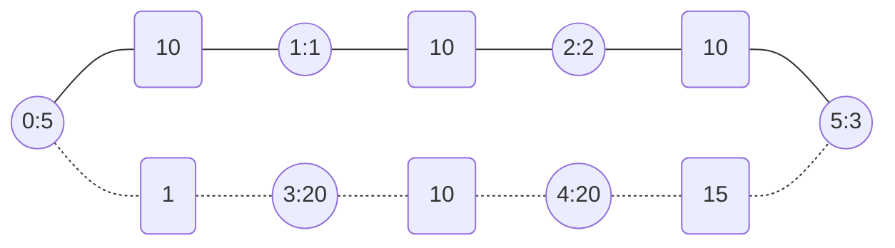

```text
Input: maxTime = 29, edges = [[0,1,10],[1,2,10],[2,5,10],[0,3,1],[3,4,10],[4,5,15]], passingFees = [5,1,2,20,20,3]
Output: 48
Explanation: The path to take is 0 -> 3 -> 4 -> 5, which takes 26 minutes and has $48 worth of passing fees.
You cannot take path 0 -> 1 -> 2 -> 5 since it would take too long.
```

```text
Example 3:
```

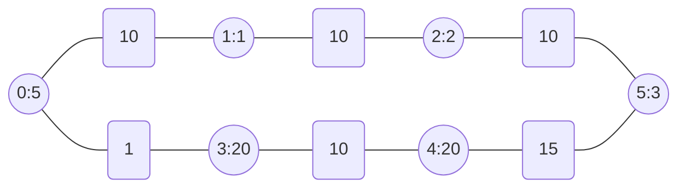

```text
Input: maxTime = 25, edges = [[0,1,10],[1,2,10],[2,5,10],[0,3,1],[3,4,10],[4,5,15]], passingFees = [5,1,2,20,20,3]
Output: -1
Explanation: There is no way to reach city 5 from city 0 within 25 minutes.
```

```text
Constraints:
1 <= maxTime <= 1000
n == passingFees.length
2 <= n <= 1000
n - 1 <= edges.length <= 1000
0 <= xi, yi <= n - 1
1 <= timei <= 1000
1 <= passingFees[j] <= 1000
The graph may contain multiple edges between two nodes.
The graph does not contain self loops.
```

</details>

<details><summary>C</summary>

```c
/* Constraints
 *  n == passingFees.length
 *  2 <= n <= 1000
 *  1 <= passingFees[j] <= 1000
 */
#define MAX_PASSINGFEES (1000 * 1000 + 1)
int minCost(int maxTime, int** edges, int edgesSize, int* edgesColSize, int* passingFees, int passingFeesSize) {
    int retVal = -1;

    int i, j;

    int fee[(maxTime + 1)][passingFeesSize];
    for (i = 0; i < (maxTime + 1); ++i) {
        for (j = 0; j < passingFeesSize; ++j) {
            fee[i][j] = MAX_PASSINGFEES;
        }
    }
    fee[0][0] = passingFees[0];

    int x, y, time;
    for (int i = 1; i <= maxTime; ++i) {
        for (j = 0; j < edgesSize; ++j) {
            x = edges[j][0];
            y = edges[j][1];
            time = edges[j][2];
            if (time <= i) {
                fee[i][x] = fmin(fee[i][x], fee[i - time][y] + passingFees[x]);
                fee[i][y] = fmin(fee[i][y], fee[i - time][x] + passingFees[y]);
            }
        }
    }

    int minFee = MAX_PASSINGFEES;
    for (i = 1; i <= maxTime; ++i) {
        minFee = fmin(minFee, fee[i][passingFeesSize - 1]);
    }

    if (minFee != MAX_PASSINGFEES) {
        retVal = minFee;
    }

    return retVal;
}
```

</details>

<details><summary>C++</summary>

```c++
class Solution {
   public:
/* Constraints
 *  n == passingFees.length
 *  2 <= n <= 1000
 *  1 <= passingFees[j] <= 1000
 */
#define MAX_PASSINGFEES (1000 * 1000 + 1)

    int minCost(int maxTime, vector<vector<int>>& edges, vector<int>& passingFees) {
        int retVal = -1;

        int n = passingFees.size();
        vector<vector<int>> fee(maxTime + 1, vector<int>(n, MAX_PASSINGFEES));
        fee[0][0] = passingFees[0];

        for (int i = 1; i <= maxTime; ++i) {
            for (auto& edge : edges) {
                int x = edge[0];
                int y = edge[1];
                int time = edge[2];
                if (time <= i) {
                    fee[i][x] = min(fee[i][x], fee[i - time][y] + passingFees[x]);
                    fee[i][y] = min(fee[i][y], fee[i - time][x] + passingFees[y]);
                }
            }
        }

        int minFee = MAX_PASSINGFEES;
        for (int i = 1; i <= maxTime; ++i) {
            minFee = min(minFee, fee[i][n - 1]);
        }

        if (minFee != MAX_PASSINGFEES) {
            retVal = minFee;
        }

        return retVal;
    }
};
```

</details>

## [1970. Last Day Where You Can Still Cross](https://leetcode.com/problems/last-day-where-you-can-still-cross/)  2123

- [Official](https://leetcode.com/problems/last-day-where-you-can-still-cross/editorial/)
- [Official](https://leetcode.cn/problems/last-day-where-you-can-still-cross/solutions/936684/ni-neng-chuan-guo-ju-zhen-de-zui-hou-yi-9j20y/)

<details><summary>Description</summary>

```text
There is a 1-based binary matrix where 0 represents land and 1 represents water.
You are given integers row and col representing the number of rows and columns in the matrix, respectively.

Initially on day 0, the entire matrix is land. However, each day a new cell becomes flooded with water.
You are given a 1-based 2D array cells, where cells[i] = [ri, ci] represents that on the ith day,
the cell on the rith row and cith column (1-based coordinates) will be covered with water (i.e., changed to 1).

You want to find the last day that it is possible to walk from the top to the bottom by only walking on land cells.
You can start from any cell in the top row and end at any cell in the bottom row.
You can only travel in the four cardinal directions (left, right, up, and down).

Return the last day where it is possible to walk from the top to the bottom by only walking on land cells.

Example 1:
Input: row = 2, col = 2, cells = [[1,1],[2,1],[1,2],[2,2]]
Output: 2
Explanation: The above image depicts how the matrix changes each day starting from day 0.
The last day where it is possible to cross from top to bottom is on day 2.

Example 2:
Input: row = 2, col = 2, cells = [[1,1],[1,2],[2,1],[2,2]]
Output: 1
Explanation: The above image depicts how the matrix changes each day starting from day 0.
The last day where it is possible to cross from top to bottom is on day 1.

Example 3:
Input: row = 3, col = 3, cells = [[1,2],[2,1],[3,3],[2,2],[1,1],[1,3],[2,3],[3,2],[3,1]]
Output: 3
Explanation: The above image depicts how the matrix changes each day starting from day 0.
The last day where it is possible to cross from top to bottom is on day 3.

Constraints:
2 <= row, col <= 2 * 10^4
4 <= row * col <= 2 * 10^4
cells.length == row * col
1 <= ri <= row
1 <= ci <= col
All the values of cells are unique.
```

<details><summary>Hint</summary>

```text
1. What graph algorithm allows us to find whether a path exists?
2. Can we use binary search to help us solve the problem?
```

</details>

</details>

<details><summary>C</summary>

```c
// https://leetcode.cn/problems/last-day-where-you-can-still-cross/solutions/1808976/by-ambition-20-4hxw/
typedef struct {
    int x;
    int y;
} Position;
bool bfs(int row, int col, int** pGraph, int startCol) {
    bool retVal = false;

    Position directions[4] = {{-1, 0}, {1, 0}, {0, -1}, {0, 1}};

    //
    Position startPosition = {1, startCol};

    int bfsHead = 0;
    int bfsTail = 0;
    int bfsQueueSize = row * col;
    Position* bfsQueue = (Position*)malloc(bfsQueueSize * sizeof(Position));
    if (bfsQueue == NULL) {
        perror("malloc");
        return retVal;
    }
    memset(bfsQueue, 0, (bfsQueueSize * sizeof(Position)));
    bfsQueue[bfsTail++] = startPosition;

    //
    Position currentPosition, nextPosition;
    int i, j;
    while (bfsHead < bfsTail) {
        bfsQueueSize = bfsTail - bfsHead;

        for (i = 0; i < bfsQueueSize; ++i) {
            currentPosition = bfsQueue[bfsHead++];

            for (j = 0; j < 4; ++j) {
                nextPosition.x = currentPosition.x + directions[j].x;
                nextPosition.y = currentPosition.y + directions[j].y;

                if ((nextPosition.x < 1) || (nextPosition.x > row)) {
                    continue;
                } else if ((nextPosition.y < 1) || (nextPosition.y > col)) {
                    continue;
                } else if (pGraph[nextPosition.x][nextPosition.y] == 1) {
                    continue;
                }

                if (nextPosition.x == row) {
                    retVal = true;
                    goto exitLabel;
                }
                pGraph[nextPosition.x][nextPosition.y] = 1;
                bfsQueue[bfsTail++] = nextPosition;
            }
        }
    }

exitLabel:
    free(bfsQueue);
    bfsQueue = NULL;

    return retVal;
}
int latestDayToCross(int row, int col, int** cells, int cellsSize, int* cellsColSize) {
    int retVal = 0;

    int i, j;

    //
    int graphSize = row + 1;
    int graphColSize = col + 1;
    int** pGraph = (int**)malloc(graphSize * sizeof(int*));
    if (pGraph == NULL) {
        perror("malloc");
        return retVal;
    }
    for (i = 0; i < graphSize; ++i) {
        pGraph[i] = (int*)malloc(graphColSize * sizeof(int));
        if (pGraph[i] == NULL) {
            perror("malloc");
            for (j = 0; j < i; ++j) {
                free(pGraph[j]);
                pGraph[j] = NULL;
            }
            free(pGraph);
            pGraph = NULL;
            return retVal;
        }
        memset(pGraph[i], 0, (graphColSize * sizeof(int)));
    }

    //
    bool flag;
    int middle;
    int left = 0;
    int right = row * col;
    while (left <= right) {
        middle = left + ((right - left) >> 1);

        flag = false;
        for (i = 0; i < row + 1; ++i) {
            memset(pGraph[i], 0, (graphColSize * sizeof(int)));
        }
        for (i = 0; i < middle; ++i) {
            pGraph[cells[i][0]][cells[i][1]] = 1;
        }
        for (j = 1; j < graphColSize; ++j) {
            if (pGraph[1][j] == 1) {
                continue;
            }
            pGraph[1][j] = 1;

            if (bfs(row, col, pGraph, j) == true) {
                flag = true;
                break;
            }
        }

        if (flag == false) {
            right = middle - 1;
        } else {
            left = middle + 1;
        }
    }
    retVal = right;

    //
    for (i = 0; i < graphSize; ++i) {
        free(pGraph[i]);
        pGraph[i] = NULL;
    }
    free(pGraph);
    pGraph = NULL;

    return retVal;
}
```

</details>

<details><summary>C++</summary>

```c++
class Solution {
   public:
    int latestDayToCross(int row, int col, vector<vector<int>>& cells) {
        int retVal = 0;

        int directions[4][2] = {{-1, 0}, {1, 0}, {0, -1}, {0, 1}};

        int left = 0;
        int right = row * col;
        while (left <= right) {
            int middle = (left + right) / 2;

            vector<vector<int>> grid(row, vector<int>(col, 1));
            for (int i = 0; i < middle; ++i) {
                grid[cells[i][0] - 1][cells[i][1] - 1] = 0;
            }

            queue<pair<int, int>> bfsQueue;
            for (int i = 0; i < col; ++i) {
                if (grid[0][i]) {
                    bfsQueue.emplace(0, i);
                    grid[0][i] = 0;
                }
            }

            bool found = false;
            while (bfsQueue.empty() == false) {
                auto [x, y] = bfsQueue.front();
                bfsQueue.pop();

                for (int i = 0; i < 4; ++i) {
                    int nextX = x + directions[i][0];
                    int nextY = y + directions[i][1];

                    if ((nextX < 0) || (nextX >= row)) {
                        continue;
                    } else if ((nextY < 0) || (nextY >= col)) {
                        continue;
                    } else if (grid[nextX][nextY] == 0) {
                        continue;
                    }

                    if (nextX == row - 1) {
                        found = true;
                        break;
                    }
                    bfsQueue.emplace(nextX, nextY);
                    grid[nextX][nextY] = 0;
                }
            }

            if (found == true) {
                retVal = middle;
                left = middle + 1;
            } else {
                right = middle - 1;
            }
        }

        return retVal;
    }
};
```

</details>

<details><summary>Python3</summary>

```python
class Solution:
    def latestDayToCross(self, row: int, col: int, cells: List[List[int]]) -> int:
        retVal = 0

        directions = [(-1, 0), (1, 0), (0, -1), (0, 1)]

        left = 0
        right = row * col
        while left <= right:
            middle = (left + right) // 2

            grid = [[1] * col for _ in range(row)]
            for x, y in cells[:middle]:
                grid[x - 1][y - 1] = 0

            bfsQueue = deque()
            for i in range(col):
                if grid[0][i]:
                    bfsQueue.append((0, i))
                    grid[0][i] = 0

            found = False
            while bfsQueue:
                x, y = bfsQueue.popleft()

                for diffX, diffY in directions:
                    nextX = x + diffX
                    nextY = y + diffY

                    if (nextX < 0) or (nextX >= row):
                        continue
                    elif (nextY < 0) or (nextY >= col):
                        continue
                    elif grid[nextX][nextY] == 0:
                        continue

                    if nextX == row - 1:
                        found = True
                        break
                    bfsQueue.append((nextX, nextY))
                    grid[nextX][nextY] = 0

            if found == True:
                retVal = middle
                left = middle + 1
            else:
                right = middle - 1

        return retVal
```

</details>

## [1971. Find if Path Exists in Graph](https://leetcode.com/problems/find-if-path-exists-in-graph/)

- [Official](https://leetcode.cn/problems/find-if-path-exists-in-graph/solutions/2024085/xun-zhao-tu-zhong-shi-fou-cun-zai-lu-jin-d0q0/)

<details><summary>Description</summary>

```text
There is a bi-directional graph with n vertices, where each vertex is labeled from 0 to n - 1 (inclusive).
The edges in the graph are represented as a 2D integer array edges,
where each edges[i] = [ui, vi] denotes a bi-directional edge between vertex ui and vertex vi.
Every vertex pair is connected by at most one edge, and no vertex has an edge to itself.

You want to determine if there is a valid path that exists from vertex source to vertex destination.

Given edges and the integers n, source, and destination,
return true if there is a valid path from source to destination, or false otherwise.

Example 1:
(0)---(1)
  \   /
   (2)
Input: n = 3, edges = [[0,1],[1,2],[2,0]], source = 0, destination = 2
Output: true
Explanation: There are two paths from vertex 0 to vertex 2:
- 0 → 1 → 2
- 0 → 2

Example 2:
  (1)   (3)
  /      | \
(0)      | (5)
  \      | /
  (2)   (4)
Input: n = 6, edges = [[0,1],[0,2],[3,5],[5,4],[4,3]], source = 0, destination = 5
Output: false
Explanation: There is no path from vertex 0 to vertex 5.

Constraints:
1 <= n <= 2 * 10^5
0 <= edges.length <= 2 * 10^5
edges[i].length == 2
0 <= ui, vi <= n - 1
ui != vi
0 <= source, destination <= n - 1
There are no duplicate edges.
There are no self edges.
```

</details>

<details><summary>C</summary>

```c
##ifndef UNION_FIND
#define UNION_FIND (1)

typedef struct {
    int *parent;
    int *rank;
} UnionFind;
UnionFind *creatUnionFind(int n) {
    UnionFind *obj = NULL;

    obj = (UnionFind *)malloc(sizeof(UnionFind));
    if (obj == NULL) {
        perror("malloc");
        return obj;
    }

    obj->parent = (int *)malloc(n * sizeof(int));
    if (obj->parent == NULL) {
        perror("malloc");
        free(obj);
        obj = NULL;
        return obj;
    }
    memset(obj->parent, 0, (n * sizeof(int)));

    obj->rank = (int *)malloc(sizeof(int) * n);
    if (obj->rank == NULL) {
        perror("malloc");
        free(obj->parent);
        obj->parent = NULL;
        free(obj);
        obj = NULL;
        return obj;
    }
    memset(obj->rank, 0, (n * sizeof(int)));

    for (int i = 0; i < n; i++) {
        obj->parent[i] = i;
    }

    return obj;
}
int findUnionFind(UnionFind *obj, int x) {
    if (obj->parent[x] != x) {
        obj->parent[x] = findUnionFind(obj, obj->parent[x]);
    }

    return obj->parent[x];
}
void unionUnionFind(UnionFind *obj, int x, int y) {
    int rootx = findUnionFind(obj, x);
    int rooty = findUnionFind(obj, y);

    if (rootx == rooty) {
        return;
    }

    if (obj->rank[rootx] > obj->rank[rooty]) {
        obj->parent[rooty] = rootx;
    } else if (obj->rank[rootx] < obj->rank[rooty]) {
        obj->parent[rootx] = rooty;
    } else {
        obj->parent[rooty] = rootx;
        obj->rank[rootx]++;
    }
}
bool connectUnionFind(UnionFind *obj, int x, int y) {
    bool retVal = (findUnionFind(obj, x) == findUnionFind(obj, y));

    return retVal;
}
void freeUnionFind(UnionFind *obj) {
    if (obj == NULL) {
        return;
    }

    free(obj->parent);
    obj->parent = NULL;
    free(obj->rank);
    obj->rank = NULL;

    free(obj);
    obj = NULL;
}
#endif
bool validPath(int n, int **edges, int edgesSize, int *edgesColSize, int source, int destination) {
    bool retVal = false;

    if (source == destination) {
        retVal = true;
        return retVal;
    }

    UnionFind *uf = creatUnionFind(n);
    if (uf == NULL) {
        return retVal;
    }

    int i;
    for (i = 0; i < edgesSize; ++i) {
        unionUnionFind(uf, edges[i][0], edges[i][1]);
    }
    retVal = connectUnionFind(uf, source, destination);

    freeUnionFind(uf);

    return retVal;
}
```

</details>

<details><summary>C++</summary>

```c++
class Solution {
   public:
    bool validPath(int n, vector<vector<int>>& edges, int source, int destination) {
        bool retVal = false;

        vector<vector<int>> adjacency(n);
        for (auto&& edge : edges) {
            int src = edge[0];
            int dst = edge[1];
            adjacency[src].emplace_back(dst);
            adjacency[dst].emplace_back(src);
        }

        queue<int> bfsQueue;
        bfsQueue.emplace(source);
        vector<bool> visited(n, false);
        visited[source] = true;
        while (bfsQueue.empty() == false) {
            int vertex = bfsQueue.front();
            bfsQueue.pop();
            if (vertex == destination) {
                break;
            }

            for (int next : adjacency[vertex]) {
                if (visited[next] == false) {
                    bfsQueue.emplace(next);
                    visited[next] = true;
                }
            }
        }
        retVal = visited[destination];

        return retVal;
    }
};
```

</details>

<details><summary>Python3</summary>

```python
class Solution:
    def validPath(self, n: int, edges: List[List[int]], source: int, destination: int) -> bool:
        retVal = False

        adjacency = [[] for _ in range(n)]
        for src, dst in edges:
            adjacency[src].append(dst)
            adjacency[dst].append(src)

        bfsQueue = deque()
        bfsQueue.append(source)
        visited = [False] * n
        visited[source] = True
        while bfsQueue:
            vertex = bfsQueue.popleft()
            if vertex == destination:
                break

            for next in adjacency[vertex]:
                if visited[next] == False:
                    bfsQueue.append(next)
                    visited[next] = True

        retVal = visited[destination]

        return retVal
```

</details>

## [1992. Find All Groups of Farmland](https://leetcode.com/problems/find-all-groups-of-farmland/)  1539

- [Official](https://leetcode.com/problems/find-all-groups-of-farmland/editorial/)

<details><summary>Description</summary>

```text
You are given a 0-indexed m x n binary matrix land
where a 0 represents a hectare of forested land and a 1 represents a hectare of farmland.

To keep the land organized, there are designated rectangular areas of hectares that consist entirely of farmland.
These rectangular areas are called groups. No two groups are adjacent,
meaning farmland in one group is not four-directionally adjacent to another farmland in a different group.

land can be represented by a coordinate system
where the top left corner of land is (0, 0) and the bottom right corner of land is (m-1, n-1).
Find the coordinates of the top left and bottom right corner of each group of farmland.
A group of farmland with a top left corner at (r1, c1) and a bottom right corner at (r2, c2)
is represented by the 4-length array [r1, c1, r2, c2].

Return a 2D array containing the 4-length arrays described above for each group of farmland in land.
If there are no groups of farmland, return an empty array. You may return the answer in any order.

Example 1:
Input: land = [[1,0,0],[0,1,1],[0,1,1]]
Output: [[0,0,0,0],[1,1,2,2]]
Explanation:
The first group has a top left corner at land[0][0] and a bottom right corner at land[0][0].
The second group has a top left corner at land[1][1] and a bottom right corner at land[2][2].

Example 2:
Input: land = [[1,1],[1,1]]
Output: [[0,0,1,1]]
Explanation:
The first group has a top left corner at land[0][0] and a bottom right corner at land[1][1].

Example 3:
Input: land = [[0]]
Output: []
Explanation:
There are no groups of farmland.

Constraints:
m == land.length
n == land[i].length
1 <= m, n <= 300
land consists of only 0's and 1's.
Groups of farmland are rectangular in shape.
```

<details><summary>Hint</summary>

```text
1. Since every group of farmland is rectangular,
   the top left corner of each group will have the smallest x-coordinate and y-coordinate of any farmland in the group.
2. Similarly, the bootm right corner of each group will have the largest x-coordinate and y-coordinate of any farmland
   in the group.
3. Use DFS to traverse through different groups of farmlands
   and keep track of the smallest and largest x-coordinate and y-coordinates you have seen in each group.
```

</details>

</details>

<details><summary>C</summary>

```c
/**
 * Return an array of arrays of size *returnSize.
 * The sizes of the arrays are returned as *returnColumnSizes array.
 * Note: Both returned array and *columnSizes array must be malloced, assume caller calls free().
 */
int** findFarmland(int** land, int landSize, int* landColSize, int* returnSize, int** returnColumnSizes) {
    int** pRetVal = NULL;

    (*returnSize) = 0;

    int mallocSize = landSize * landColSize[0];
    pRetVal = (int**)malloc(mallocSize * sizeof(int*));
    if (pRetVal == NULL) {
        perror("malloc");
        return pRetVal;
    }
    (*returnColumnSizes) = (int*)malloc(mallocSize * sizeof(int));
    if ((*returnColumnSizes) == NULL) {
        perror("malloc");
        goto exit1;
    }
    memset((*returnColumnSizes), 0, (landSize * sizeof(int)));

    int x, y;
    int row, col;
    for (row = 0; row < landSize; ++row) {
        for (col = 0; col < landColSize[row]; ++col) {
            if (land[row][col] == 0) {
                continue;
            }

            x = row;
            y = col;
            for (x = row; x < landSize; ++x) {
                if (land[x][col] == 0) {
                    break;
                }

                for (y = col; y < landColSize[row]; ++y) {
                    if (land[x][y] == 0) {
                        break;
                    }
                    land[x][y] = 0;
                }
            }

            (*returnColumnSizes)[(*returnSize)] = 4;
            pRetVal[(*returnSize)] = (int*)malloc((*returnColumnSizes)[(*returnSize)] * sizeof(int));
            if (pRetVal[(*returnSize)] == NULL) {
                perror("malloc");
                goto exit2;
            }
            pRetVal[(*returnSize)][0] = row;
            pRetVal[(*returnSize)][1] = col;
            pRetVal[(*returnSize)][2] = x - 1;
            pRetVal[(*returnSize)][3] = y - 1;
            (*returnSize) += 1;
        }
    }

    return pRetVal;

exit2:
    free((*returnColumnSizes));
    (*returnColumnSizes) = NULL;

    int i;
    for (i = 0; i < (*returnSize); ++i) {
        free(pRetVal[i]);
        pRetVal[i] = NULL;
    }

exit1:
    free(pRetVal);
    pRetVal = NULL;
    (*returnSize) = 0;

    return pRetVal;
}
```

</details>

<details><summary>C++</summary>

```c++
class Solution {
   public:
    vector<vector<int>> findFarmland(vector<vector<int>>& land) {
        vector<vector<int>> retVal;

        int landSize = land.size();
        int landColSize = land[0].size();
        for (int row = 0; row < landSize; ++row) {
            for (int col = 0; col < landColSize; ++col) {
                if (land[row][col] == 0) {
                    continue;
                }

                int x = row;
                int y = col;
                for (x = row; x < landSize; ++x) {
                    if (land[x][col] == 0) {
                        break;
                    }

                    for (y = col; y < landColSize; ++y) {
                        if (land[x][y] == 0) {
                            break;
                        }
                        land[x][y] = 0;
                    }
                }

                retVal.push_back({row, col, x - 1, y - 1});
            }
        }

        return retVal;
    }
};
```

</details>

<details><summary>Python3</summary>

```python
class Solution:
    def findFarmland(self, land: List[List[int]]) -> List[List[int]]:
        retVal = []

        landSize = len(land)
        landColSize = len(land[0])
        for row in range(landSize):
            for col in range(landColSize):
                if land[row][col] == 0:
                    continue

                x = row
                while x < landSize:
                    if land[x][col] == 0:
                        break
                    y = col
                    while y < landColSize:
                        if land[x][y] == 0:
                            break
                        land[x][y] = 0
                        y += 1
                    x += 1

                retVal.append([row, col, x-1, y-1])

        return retVal
```

</details>

## [2050. Parallel Courses III](https://leetcode.com/problems/parallel-courses-iii/)  2084

- [Official](https://leetcode.com/problems/parallel-courses-iii/editorial/)
- [Official](https://leetcode.cn/problems/parallel-courses-iii/solutions/2357818/bing-xing-ke-cheng-iii-by-leetcode-solut-aw43/)

<details><summary>Description</summary>

```text
You are given an integer n, which indicates that there are n courses labeled from 1 to n.
You are also given a 2D integer array relations where relations[j] = [prevCoursej,
nextCoursej] denotes that course prevCoursej has to be completed before course nextCoursej (prerequisite relationship).
Furthermore, you are given a 0-indexed integer array time
where time[i] denotes how many months it takes to complete the (i+1)th course.

You must find the minimum number of months needed to complete all the courses following these rules:
- You may start taking a course at any time if the prerequisites are met.
- Any number of courses can be taken at the same time.

Return the minimum number of months needed to complete all the courses.

Note: The test cases are generated such that it is possible to complete every course
(i.e., the graph is a directed acyclic graph).

Example 1:
Input: n = 3, relations = [[1,3],[2,3]], time = [3,2,5]
Output: 8
Explanation: The figure above represents the given graph and the time required to complete each course.
We start course 1 and course 2 simultaneously at month 0.
Course 1 takes 3 months and course 2 takes 2 months to complete respectively.
Thus, the earliest time we can start course 3 is at month 3, and the total time required is 3 + 5 = 8 months.

Example 2:
Input: n = 5, relations = [[1,5],[2,5],[3,5],[3,4],[4,5]], time = [1,2,3,4,5]
Output: 12
Explanation: The figure above represents the given graph and the time required to complete each course.
You can start courses 1, 2, and 3 at month 0.
You can complete them after 1, 2, and 3 months respectively.
Course 4 can be taken only after course 3 is completed, i.e., after 3 months. It is completed after 3 + 4 = 7 months.
Course 5 can be taken only after courses 1, 2, 3, and 4 have been completed, i.e., after max(1,2,3,7) = 7 months.
Thus, the minimum time needed to complete all the courses is 7 + 5 = 12 months.

Constraints:
1 <= n <= 5 * 10^4
0 <= relations.length <= min(n * (n - 1) / 2, 5 * 10^4)
relations[j].length == 2
1 <= prevCoursej, nextCoursej <= n
prevCoursej != nextCoursej
All the pairs [prevCoursej, nextCoursej] are unique.
time.length == n
1 <= time[i] <= 10^4
The given graph is a directed acyclic graph.
```

<details><summary>Hint</summary>

```text
1. What is the earliest time a course can be taken?
2. How would you solve the problem if all courses take equal time?
3. How would you generalize this approach?
```

</details>

</details>

<details><summary>C</summary>

```c
int minimumTime(int n, int** relations, int relationsSize, int* relationsColSize, int* time, int timeSize) {
    int retVal = 0;

    int i;

    //
    int count[n + 1];
    memset(count, 0, sizeof(count));
    for (i = 0; i < relationsSize; ++i) {
        count[relations[i][0]]++;
    }
    int graphMaxSize = 1;
    for (i = 0; i <= n; ++i) {
        graphMaxSize = fmax(graphMaxSize, count[i]);
    }

    int graph[n][graphMaxSize];
    memset(graph, -1, sizeof(graph));
    int graphColSize[n];
    memset(graphColSize, 0, sizeof(graphColSize));

    int indegree[n];
    memset(indegree, 0, sizeof(indegree));

    int x, y;
    for (i = 0; i < relationsSize; ++i) {
        x = relations[i][0] - 1;
        y = relations[i][1] - 1;
        graph[x][graphColSize[x]++] = y;
        indegree[y]++;
    }
#if (0)
    printf("indegree: ");
    for (i = 0; i < n; ++i) {
        printf("%d ", indegree[i]);
    }
    printf("\n");
    for (i = 0; i < n; ++i) {
        printf("graph[%d]: ", i);
        for (int j = 0; j < graphColSize[i]; ++j) {
            printf("%2d ", graph[i][j]);
        }
        printf(": %d\n", graphColSize[i]);
    }
#endif

    //
    int maxTime[n];
    memset(maxTime, 0, sizeof(maxTime));

#define MAX_QUEUE_SIZE ((n)*2)
    int topologicalSortQueueHead = 0;
    int topologicalSortQueueTail = 0;
    int topologicalSortQueue[MAX_QUEUE_SIZE];

    for (i = 0; i < n; i++) {
        if (indegree[i] == 0) {
            topologicalSortQueue[topologicalSortQueueTail++] = i;
            maxTime[i] = time[i];
        }
    }
#if (0)
    printf("maxTime: ");
    for (i = 0; i < n; ++i) {
        printf("%d ", maxTime[i]);
    }
    printf("\n");
    for (i = 0; i < (topologicalSortQueueTail - topologicalSortQueueHead); ++i) {
        printf("%d ", topologicalSortQueue[i]);
    }
    printf("\n");
#endif

    // Topological Sort Using Kahn's Algorithm
    int node, neighbor;
    while (topologicalSortQueueHead < topologicalSortQueueTail) {
        node = topologicalSortQueue[topologicalSortQueueHead++];

        for (i = 0; i < graphColSize[node]; ++i) {
            neighbor = graph[node][i];

            maxTime[neighbor] = fmax(maxTime[neighbor], maxTime[node] + time[neighbor]);
            indegree[neighbor]--;
            if (indegree[neighbor] == 0) {
                topologicalSortQueue[topologicalSortQueueTail++] = neighbor;
            }
        }
    }

    for (i = 0; i < n; i++) {
        retVal = fmax(retVal, maxTime[i]);
    }

    return retVal;
}
```

</details>

<details><summary>C++</summary>

```c++
class Solution {
   public:
    int minimumTime(int n, vector<vector<int>>& relations, vector<int>& time) {
        int retVal = 0;

        unordered_map<int, vector<int>> graph;
        vector<int> indegree(n, 0);
        for (vector<int>& edge : relations) {
            int x = edge[0] - 1;
            int y = edge[1] - 1;
            graph[x].push_back(y);
            indegree[y]++;
        }

        queue<int> topologicalSortQueue;
        vector<int> maxTime(n, 0);
        for (int node = 0; node < n; node++) {
            if (indegree[node] == 0) {
                topologicalSortQueue.push(node);
                maxTime[node] = time[node];
            }
        }

        // Topological Sort Using Kahn's Algorithm
        while (topologicalSortQueue.empty() == false) {
            int node = topologicalSortQueue.front();
            topologicalSortQueue.pop();
            for (int neighbor : graph[node]) {
                maxTime[neighbor] = max(maxTime[neighbor], maxTime[node] + time[neighbor]);
                indegree[neighbor]--;
                if (indegree[neighbor] == 0) {
                    topologicalSortQueue.push(neighbor);
                }
            }
        }

        for (int node = 0; node < n; node++) {
            retVal = max(retVal, maxTime[node]);
        }

        return retVal;
    }
};
```

</details>

<details><summary>Python3</summary>

```python
class Solution:
    def minimumTime(self, n: int, relations: List[List[int]], time: List[int]) -> int:
        retVal = 0

        graph = defaultdict(list)
        indegree = [0] * n
        for (x, y) in relations:
            graph[x - 1].append(y - 1)
            indegree[y - 1] += 1

        topologicalSortQueue = deque()
        max_time = [0] * n
        for node in range(n):
            if indegree[node] == 0:
                topologicalSortQueue.append(node)
                max_time[node] = time[node]

        # Topological Sort Using Kahn's Algorithm
        while topologicalSortQueue:
            node = topologicalSortQueue.popleft()
            for neighbor in graph[node]:
                max_time[neighbor] = max(max_time[neighbor], max_time[node] + time[neighbor])
                indegree[neighbor] -= 1
                if indegree[neighbor] == 0:
                    topologicalSortQueue.append(neighbor)

        retVal = max(max_time)

        return retVal
```

</details>

## [2092. Find All People With Secret](https://leetcode.com/problems/find-all-people-with-secret/)  2003

- [Official](https://leetcode.com/problems/find-all-people-with-secret/editorial/)
- [Official](https://leetcode.cn/problems/find-all-people-with-secret/solutions/1127118/zhao-chu-zhi-xiao-mi-mi-de-suo-you-zhuan-fzxf/)

<details><summary>Description</summary>

```text
You are given an integer n indicating there are n people numbered from 0 to n - 1.
You are also given a 0-indexed 2D integer array meetings
where meetings[i] = [xi, yi, timei] indicates that person xi and person yi have a meeting at timei.
A person may attend multiple meetings at the same time. Finally, you are given an integer firstPerson.

Person 0 has a secret and initially shares the secret with a person firstPerson at time 0.
This secret is then shared every time a meeting takes place with a person that has the secret.
More formally, for every meeting, if a person xi has the secret at timei,
then they will share the secret with person yi, and vice versa.

The secrets are shared instantaneously.
That is, a person may receive the secret and share it with people in other meetings within the same time frame.

Return a list of all the people that have the secret after all the meetings have taken place.
You may return the answer in any order.

Example 1:
Input: n = 6, meetings = [[1,2,5],[2,3,8],[1,5,10]], firstPerson = 1
Output: [0,1,2,3,5]
Explanation:
At time 0, person 0 shares the secret with person 1.
At time 5, person 1 shares the secret with person 2.
At time 8, person 2 shares the secret with person 3.
At time 10, person 1 shares the secret with person 5.​​​​
Thus, people 0, 1, 2, 3, and 5 know the secret after all the meetings.

Example 2:
Input: n = 4, meetings = [[3,1,3],[1,2,2],[0,3,3]], firstPerson = 3
Output: [0,1,3]
Explanation:
At time 0, person 0 shares the secret with person 3.
At time 2, neither person 1 nor person 2 know the secret.
At time 3, person 3 shares the secret with person 0 and person 1.
Thus, people 0, 1, and 3 know the secret after all the meetings.

Example 3:
Input: n = 5, meetings = [[3,4,2],[1,2,1],[2,3,1]], firstPerson = 1
Output: [0,1,2,3,4]
Explanation:
At time 0, person 0 shares the secret with person 1.
At time 1, person 1 shares the secret with person 2, and person 2 shares the secret with person 3.
Note that person 2 can share the secret at the same time as receiving it.
At time 2, person 3 shares the secret with person 4.
Thus, people 0, 1, 2, 3, and 4 know the secret after all the meetings.

Constraints:
2 <= n <= 10^5
1 <= meetings.length <= 10^5
meetings[i].length == 3
0 <= xi, yi <= n - 1
xi != yi
1 <= timei <= 10^5
1 <= firstPerson <= n - 1
```

<details><summary>Hint</summary>

```text
1. Could you model all the meetings happening at the same time as a graph?
2. What data structure can you use to efficiently share the secret?
3. You can use the union-find data structure to quickly determine who knows the secret and share the secret.
```

</details>

</details>

<details><summary>C</summary>

```c
int compareInteger(const void* n1, const void* n2) {
    // ascending order
    return (*(int*)n1 > *(int*)n2);
}
int compareIntArray(const void* a1, const void* a2) {
    const int* p1 = *(const int**)a1;
    const int* p2 = *(const int**)a2;

    // ascending order
    return (p1[2] > p2[2]);
}
void GetResult(int** meetings, int start, int num, int* returnValue, int* returnSize, int* flag) {
    int people;
    int i;
    int rule = 1;
    while (rule > 0) {
        rule = 0;
        for (i = 0; i < num; i++) {
            if (flag[meetings[i + start][0]] != flag[meetings[i + start][1]]) {
                people = flag[meetings[i + start][0]] ? meetings[i + start][1] : meetings[i + start][0];
                returnValue[(*returnSize)++] = people;
                flag[people] = 1;
                rule = 1;
            }
        }
    }
}
/**
 * Note: The returned array must be malloced, assume caller calls free().
 */
int* findAllPeople(int n, int** meetings, int meetingsSize, int* meetingsColSize, int firstPerson, int* returnSize) {
    int* pRetVal = NULL;

    (*returnSize) = 0;

    //
    pRetVal = (int*)malloc(n * sizeof(int));
    if (pRetVal == NULL) {
        perror("malloc");
        return pRetVal;
    }
    memset(pRetVal, 0, (n * sizeof(int)));
    pRetVal[0] = 0;
    pRetVal[1] = firstPerson;
    (*returnSize) = 2;

    //
    qsort(meetings, meetingsSize, sizeof(int*), compareIntArray);

    //
    int* flag = (int*)malloc(n * sizeof(int));
    if (pRetVal == NULL) {
        perror("malloc");
        (*returnSize) = 0;
        free(pRetVal);
        pRetVal = NULL;
        return pRetVal;
    }
    memset(flag, 0, (n * sizeof(int)));
    flag[0] = 1;
    flag[firstPerson] = 1;

    int people;
    int start = 0;
    int num = 0;
    int i;
    for (i = 0; i < meetingsSize; i++) {
        if ((i > 0) && (meetings[i][2] != meetings[i - 1][2])) {
            start = i;
            num = 1;
        } else {
            num++;
        }

        if (flag[meetings[i][0]] != flag[meetings[i][1]]) {
            people = flag[meetings[i][0]] ? meetings[i][1] : meetings[i][0];
            pRetVal[(*returnSize)] = people;
            (*returnSize)++;
            flag[people] = 1;
        }

        if (((i < (meetingsSize - 1)) && (meetings[i][2] != meetings[i + 1][2])) || (i == (meetingsSize - 1))) {
            GetResult(meetings, start, num, pRetVal, returnSize, flag);
        }
    }

    //
    free(flag);
    flag = NULL;

    //
    qsort(pRetVal, (*returnSize), sizeof(int), compareInteger);

    return pRetVal;
}
```

</details>

<details><summary>C++</summary>

```c++
class Solution {
   public:
    vector<int> findAllPeople(int n, vector<vector<int>>& meetings, int firstPerson) {
        vector<int> retVal;

        //
        unordered_map<int, vector<pair<int, int>>> graph;
        for (auto& meeting : meetings) {
            int x = meeting[0];
            int y = meeting[1];
            int t = meeting[2];
            graph[x].emplace_back(t, y);
            graph[y].emplace_back(t, x);
        }

        //
        int secretDefaultValue = std::numeric_limits<int>::max();
        vector<int> secret(n, secretDefaultValue);
        secret[0] = 0;
        secret[firstPerson] = 0;

        //
        queue<pair<int, int>> bfsQueue;
        bfsQueue.emplace(0, 0);
        bfsQueue.emplace(firstPerson, 0);
        while (bfsQueue.empty() == false) {
            auto [person, time] = bfsQueue.front();
            bfsQueue.pop();
            for (auto [t, nextPerson] : graph[person]) {
                if ((t >= time) && (secret[nextPerson] > t)) {
                    secret[nextPerson] = t;
                    bfsQueue.emplace(nextPerson, t);
                }
            }
        }

        //
        for (int i = 0; i < n; ++i) {
            if (secret[i] != secretDefaultValue) {
                retVal.push_back(i);
            }
        }

        return retVal;
    }
};
```

</details>

<details><summary>Python3</summary>

```python
class Solution:
    def findAllPeople(self, n: int, meetings: List[List[int]], firstPerson: int) -> List[int]:
        retVal = []

        #
        graph = defaultdict(list)
        for x, y, t in meetings:
            graph[x].append((t, y))
            graph[y].append((t, x))

        #
        secretDefaultValue = float('inf')
        secret = [secretDefaultValue] * n
        secret[0] = 0
        secret[firstPerson] = 0

        #
        bfsQueue = deque()
        bfsQueue.append((0, 0))
        bfsQueue.append((firstPerson, 0))
        while bfsQueue:
            person, time = bfsQueue.popleft()
            for t, nextPerson in graph[person]:
                if t >= time and secret[nextPerson] > t:
                    secret[nextPerson] = t
                    bfsQueue.append((nextPerson, t))

        #
        for i in range(n):
            if secret[i] != secretDefaultValue:
                retVal.append(i)

        return retVal
```

</details>

## [2101. Detonate the Maximum Bombs](https://leetcode.com/problems/detonate-the-maximum-bombs/)  1880

- [Official](https://leetcode.com/problems/detonate-the-maximum-bombs/editorial/)
- [Official](https://leetcode.cn/problems/detonate-the-maximum-bombs/solutions/1153683/yin-bao-zui-duo-de-zha-dan-by-leetcode-s-iccp/)

<details><summary>Description</summary>

```text
You are given a list of bombs. The range of a bomb is defined as the area where its effect can be felt.
This area is in the shape of a circle with the center as the location of the bomb.

The bombs are represented by a 0-indexed 2D integer array bombs where bombs[i] = [xi, yi, ri].
xi and yi denote the X-coordinate and Y-coordinate of the location of the ith bomb,
whereas ri denotes the radius of its range.

You may choose to detonate a single bomb. When a bomb is detonated, it will detonate all bombs that lie in its range.
These bombs will further detonate the bombs that lie in their ranges.

Given the list of bombs,
return the maximum number of bombs that can be detonated if you are allowed to detonate only one bomb.

Example 1:
Input: bombs = [[2,1,3],[6,1,4]]
Output: 2
Explanation:
The above figure shows the positions and ranges of the 2 bombs.
If we detonate the left bomb, the right bomb will not be affected.
But if we detonate the right bomb, both bombs will be detonated.
So the maximum bombs that can be detonated is max(1, 2) = 2.

Example 2:
Input: bombs = [[1,1,5],[10,10,5]]
Output: 1
Explanation:
Detonating either bomb will not detonate the other bomb, so the maximum number of bombs that can be detonated is 1.

Example 3:
Input: bombs = [[1,2,3],[2,3,1],[3,4,2],[4,5,3],[5,6,4]]
Output: 5
Explanation:
The best bomb to detonate is bomb 0 because:
- Bomb 0 detonates bombs 1 and 2. The red circle denotes the range of bomb 0.
- Bomb 2 detonates bomb 3. The blue circle denotes the range of bomb 2.
- Bomb 3 detonates bomb 4. The green circle denotes the range of bomb 3.
Thus all 5 bombs are detonated.

Constraints:
1 <= bombs.length <= 100
bombs[i].length == 3
1 <= xi, yi, ri <= 10^5
```

<details><summary>Hint</summary>

```text
1. How can we model the relationship between different bombs? Can "graphs" help us?
2. Bombs are nodes and are connected to other bombs in their range by directed edges.
3. If we know which bombs will be affected when any bomb is detonated,
   how can we find the total number of bombs that will be detonated if we start from a fixed bomb?
4. Run a Depth First Search (DFS) from every node, and all the nodes it reaches are the bombs that will be detonated.
```

</details>

</details>

<details><summary>C</summary>

```c
#define DFS (0)
#define BFS (1)
int bfs(int node, int** edges, int* edgesColSize, int bombsSize) {
    int retVal = 0;

    int visited[bombsSize];
    memset(visited, 0, sizeof(visited));
    visited[node] = 1;
    int bfsQueue[bombsSize * bombsSize];
    memset(bfsQueue, 0, sizeof(bfsQueue));
    int bfsQueueHead = 0;
    int bfsQueueTail = 0;
    bfsQueue[bfsQueueHead++] = node;
    ++retVal;

    int i;
    int current;
    while (bfsQueueHead > bfsQueueTail) {
        current = bfsQueue[bfsQueueTail];
        ++bfsQueueTail;
        for (i = 0; i < edgesColSize[current]; ++i) {
            if (visited[edges[current][i]] == 1) {
                continue;
            }
            visited[edges[current][i]] = 1;
            bfsQueue[bfsQueueHead++] = edges[current][i];
            ++retVal;
        }
    }

    return retVal;
}
int maximumDetonation(int** bombs, int bombsSize, int* bombsColSize) {
    int retVal = 0;

    int i, j;

    //
    int** edges = (int**)malloc(bombsSize * sizeof(int*));
    if (edges == NULL) {
        perror("malloc");
        return retVal;
    }
    for (i = 0; i < bombsSize; ++i) {
        edges[i] = (int*)malloc(bombsSize * sizeof(int));
        if (edges[i] == NULL) {
            perror("malloc");
            for (j = 0; j < i; ++j) {
                free(edges[j]);
                edges[j] = NULL;
            }
            free(edges);
            edges = NULL;
            return retVal;
        }
        memset(edges[i], 0, (bombsSize * sizeof(int)));
    }
    int edgesColSize[bombsSize];
    memset(edgesColSize, 0, sizeof(edgesColSize));
    for (i = 0; i < bombsSize; ++i) {
        for (j = 0; j < bombsSize; ++j) {
            if (i == j) {
                continue;
            }

            // 1 <= xi, yi, ri <= 10^5
            long long dx = bombs[i][0] - bombs[j][0];
            long long dy = bombs[i][1] - bombs[j][1];
            long long dr = (dx * dx) + (dy * dy);
            long long r = (long long)bombs[i][2] * (long long)bombs[i][2];
            if (r >= dr) {
                edges[i][edgesColSize[i]++] = j;
            }
        }
    }
#if 0  // graph print
    for (i = 0; i < bombsSize; ++i) {
        printf("%d: ", i);
        for (j = 0; j < bombsSize; ++j) {
            printf("%d ", edges[i][j]);
        }
        printf(" => %d\n", edgesColSize[i]);
    }
#endif

    //
    for (int i = 0; i < bombsSize; ++i) {
#if (DFS)
#elif (BFS)
        retVal = fmax(retVal, bfs(i, edges, edgesColSize, bombsSize));
#endif
    }

    //
    for (i = 0; i < bombsSize; ++i) {
        free(edges[i]);
        edges[i] = NULL;
    }
    free(edges);
    edges = NULL;

    return retVal;
}
```

</details>

<details><summary>C++</summary>

```c++
class Solution {
   public:
#define DFS (0)
#define BFS (1)
   public:
    Solution() {
#if (DFS)
        cout << "Depth-First Search\n\n";
#elif (BFS)
        cout << "Breadth-First Search\n\n";
#endif
    }
    int dfs(int node, unordered_map<int, int>& visited, unordered_map<int, vector<int>>& edges) {
        int retVal = 0;

        visited[node] = 1;
        for (auto neighbor : edges[node]) {
            if (visited[neighbor] == 1) {
                continue;
            }
            visited[neighbor] = 1;
            dfs(neighbor, visited, edges);
        }
        retVal = visited.size();

        return retVal;
    }
    int bfs(int node, unordered_map<int, vector<int>>& edges, int bombsSize) {
        int retVal = 0;

        vector<int> visited(bombsSize, 0);
        visited[node] = 1;
        queue<int> bfsQueue;
        bfsQueue.emplace(node);
        ++retVal;

        while (bfsQueue.empty() == false) {
            auto current = bfsQueue.front();
            bfsQueue.pop();
            for (auto neighbor : edges[current]) {
                if (visited[neighbor] == 1) {
                    continue;
                }
                visited[neighbor] = 1;
                bfsQueue.emplace(neighbor);
                ++retVal;
            }
        }

        return retVal;
    }
    int maximumDetonation(vector<vector<int>>& bombs) {
        int retVal = 0;

        int bombsSize = bombs.size();

        //
        unordered_map<int, vector<int>> edges;
        for (int i = 0; i < bombsSize; ++i) {
            for (int j = 0; j < bombsSize; ++j) {
                if (i == j) {
                    continue;
                }

                // 1 <= xi, yi, ri <= 10^5
                long long dx = bombs[i][0] - bombs[j][0];
                long long dy = bombs[i][1] - bombs[j][1];
                long long dr = (dx * dx) + (dy * dy);
                long long r = (long long)bombs[i][2] * (long long)bombs[i][2];
                if (r >= dr) {
                    edges[i].push_back(j);
                }
            }
        }

        //
        for (int i = 0; i < bombsSize; ++i) {
#if (DFS)
            unordered_map<int, int> visited;
            retVal = max(retVal, dfs(i, visited, edges));
#elif (BFS)
            retVal = max(retVal, bfs(i, edges, bombsSize));
#endif
        }

        return retVal;
    }
};
```

</details>

<details><summary>Python3</summary>

```python
class Solution:
    def __init__(self):
        self.method = 2

        if self.method == 1:
            print("Depth-First Search")
        elif self.method == 2:
            print("Breadth-First Search")
        print()

    def dfs(self, cur: int, visited: set[int], graph: defaultdict[List[int]]) -> int:
        retVal = 0

        visited.add(cur)
        for neighbor in graph[cur]:
            if neighbor in visited:
                continue
            self.dfs(neighbor, visited, graph)
        retVal = len(visited)

        return retVal

    def bfs(self, i: int, graph: defaultdict[List[int]]) -> int:
        retVal = 0

        bfsQueue = deque([i])
        visited = set([i])
        while bfsQueue:
            current = bfsQueue.popleft()
            for neighbor in graph[current]:
                if neighbor in visited:
                    continue
                visited.add(neighbor)
                bfsQueue.append(neighbor)
        retVal = len(visited)

        return retVal

    def maximumDetonation(self, bombs: List[List[int]]) -> int:
        retVal = 0

        bombsSize = len(bombs)

        #
        graph = defaultdict(list)
        for i in range(bombsSize):
            for j in range(bombsSize):
                if i == j:
                    continue

                xi, yi, ri = bombs[i]
                xj, yj, _ = bombs[j]
                if ri ** 2 >= (xi - xj) ** 2 + (yi - yj) ** 2:
                    graph[i].append(j)

        #
        for i in range(bombsSize):
            if self.method == 1:
                visited = set()
                retVal = max(retVal, self.dfs(i, visited, graph))
            elif self.method == 2:
                retVal = max(retVal, self.bfs(i, graph))

        return retVal
```

</details>

## [2246. Longest Path With Different Adjacent Characters](https://leetcode.com/problems/longest-path-with-different-adjacent-characters/)  2126

- [Official](https://leetcode.com/problems/longest-path-with-different-adjacent-characters/solutions/2889382/longest-path-with-different-adjacent-characters/)

<details><summary>Description</summary>

```text
You are given a tree (i.e. a connected, undirected graph that has no cycles)
rooted at node 0 consisting of n nodes numbered from 0 to n - 1.
The tree is represented by a 0-indexed array parent of size n, where parent[i] is the parent of node i.
Since node 0 is the root, parent[0] == -1.

You are also given a string s of length n, where s[i] is the character assigned to node i.

Return the length of the longest path in the tree
such that no pair of adjacent nodes on the path have the same character assigned to them.
```

```text
Example 1:
```

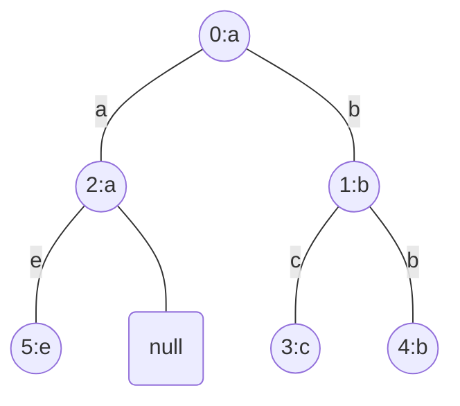

```text
Input: parent = [-1,0,0,1,1,2], s = "abacbe"
Output: 3
Explanation: The longest path where each two adjacent nodes have different characters in the tree is the path: 0 -> 1 -> 3.
The length of this path is 3, so 3 is returned.
It can be proven that there is no longer path that satisfies the conditions.
```

```text
Example 2:
```

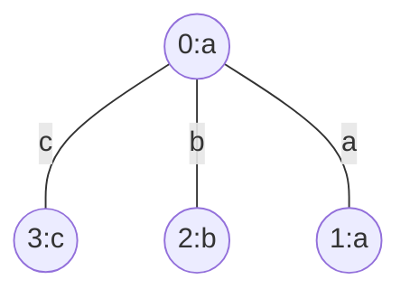

```text
Input: parent = [-1,0,0,0], s = "aabc"
Output: 3
Explanation: The longest path where each two adjacent nodes have different characters is the path: 2 -> 0 -> 3.
The length of this path is 3, so 3 is returned.
```

```text
Constraints:
n == parent.length == s.length
1 <= n <= 10^5
0 <= parent[i] <= n - 1 for all i >= 1
parent[0] == -1
parent represents a valid tree.
s consists of only lowercase English letters.
```

</details>

<details><summary>C</summary>

```c
int longestPath(int* parent, int parentSize, char * s){

}
```

</details>

<details><summary>C++</summary>

```c++
class Solution {
#define DEPTH_FIRST_SEARCH (1)
#define BREADTH_FIRST_SEARCH (1)

   public:
    int dfs(int currentNode, vector<vector<int>>& children, string& s, int& longestPath) {
        // Longest and second longest chains starting from currentNode (does not count the currentNode itself).
        int longestChain = 0;
        int secondLongestChain = 0;

        for (int child : children[currentNode]) {
            // Get the number of nodes in the longest path in the subtree of child, including the child.
            int longestChainStartingFromChild = dfs(child, children, s, longestPath);

            // We won't move to the child if it has the same character as the currentNode.
            if (s[currentNode] == s[child]) {
                continue;
            }

            // Modify the longestChain and secondLongestChain if longestChainStartingFromChild is bigger.
            if (longestChainStartingFromChild > longestChain) {
                secondLongestChain = longestChain;
                longestChain = longestChainStartingFromChild;
            } else if (longestChainStartingFromChild > secondLongestChain) {
                secondLongestChain = longestChainStartingFromChild;
            }
        }

        // Add "1" for the node itself.
        longestPath = max(longestPath, longestChain + secondLongestChain + 1);

        return longestChain + 1;
    }

    int longestPath(vector<int>& parent, string s) {
        int retVal;

#if (DEPTH_FIRST_SEARCH)
        cout << "DEPTH_FIRST_SEARCH\n";

        int n = parent.size();
        vector<vector<int>> children(n);
        // Start from node 1, since root node 0 does not have a parent.
        for (int i = 1; i < n; ++i) {
            children[parent[i]].push_back(i);
        }

        retVal = 1;
        dfs(0, children, s, retVal);
#elif (BREADTH_FIRST_SEARCH)
        cout << "BREADTH_FIRST_SEARCH\n";

        retVal = 1;

        int n = parent.size();
        vector<int> childrenCount(n);
        // Start from 1, since the root node does not have a parent.
        for (int node = 1; node < n; node++) {
            childrenCount[parent[node]]++;
        }

        vector<vector<int>> longestChains(n);
        queue<int> q;
        for (int node = 0; node < n; node++) {
            longestChains[node] = vector<int>(2);
            // Push all leaf nodes in the queue.
            if (childrenCount[node] == 0 && node != 0) {
                q.push(node);
                longestChains[node][0] = 1;
            }
        }

        while (!q.empty()) {
            int currentNode = q.front();
            q.pop();
            int par = parent[currentNode];

            // Get the number of nodes in the longest chain starting from the currentNode, including the currentNode.
            if (s[currentNode] != s[par]) {
                // Modify the longest chain and second longest chain if longestChainStartingFromCurrNode is bigger.
                int longestChainStartingFromCurrNode = longestChains[currentNode][0];
                if (longestChainStartingFromCurrNode > longestChains[par][0]) {
                    longestChains[par][1] = longestChains[par][0];
                    longestChains[par][0] = longestChainStartingFromCurrNode;
                } else if (longestChainStartingFromCurrNode > longestChains[par][1]) {
                    longestChains[par][1] = longestChainStartingFromCurrNode;
                }
            }

            retVal = max(retVal, longestChains[par][0] + longestChains[par][1] + 1);
            childrenCount[par]--;

            if (childrenCount[par] == 0 && par != 0) {
                longestChains[par][0]++;
                q.push(par);
            }
        }
#endif

        return retVal;
    }
};
```

</details>

## [2359. Find Closest Node to Given Two Nodes](https://leetcode.com/problems/find-closest-node-to-given-two-nodes/)  1714

- [Official](https://leetcode.com/problems/find-closest-node-to-given-two-nodes/solutions/2864716/find-closest-node-to-given-two-nodes/)

<details><summary>Description</summary>

```text
You are given a directed graph of n nodes numbered from 0 to n - 1, where each node has at most one outgoing edge.

The graph is represented with a given 0-indexed array edges of size n,
indicating that there is a directed edge from node i to node edges[i].
If there is no outgoing edge from i, then edges[i] == -1.

You are also given two integers node1 and node2.

Return the index of the node that can be reached from both node1 and node2,
such that the maximum between the distance from node1 to that node, and from node2 to that node is minimized.
If there are multiple answers, return the node with the smallest index, and if no possible answer exists, return -1.

Note that edges may contain cycles.

Example 1:
Input: edges = [2,2,3,-1], node1 = 0, node2 = 1
Output: 2
Explanation: The distance from node 0 to node 2 is 1, and the distance from node 1 to node 2 is 1.
The maximum of those two distances is 1.
It can be proven that we cannot get a node with a smaller maximum distance than 1, so we return node 2.

Example 2:
Input: edges = [1,2,-1], node1 = 0, node2 = 2
Output: 2
Explanation: The distance from node 0 to node 2 is 2, and the distance from node 2 to itself is 0.
The maximum of those two distances is 2.
It can be proven that we cannot get a node with a smaller maximum distance than 2, so we return node 2.

Constraints:
n == edges.length
2 <= n <= 10^5
-1 <= edges[i] < n
edges[i] != i
0 <= node1, node2 < n
```

</details>

<details><summary>C</summary>

```c
void dfs(int node, int* edges, int* dist, int* visit) {
    visit[node] = 1;

    int neighbor = edges[node];
    if ((neighbor != -1) && (visit[neighbor] == 0)) {
        dist[neighbor] = 1 + dist[node];
        dfs(neighbor, edges, dist, visit);
    }
}
int closestMeetingNode(int* edges, int edgesSize, int node1, int node2) {
    int retVal = -1;

    int i;

    int dist1[edgesSize];
    for (i = 0; i < edgesSize; ++i) {
        dist1[i] = INT_MAX;
    }
    dist1[node1] = 0;
    int visit1[edgesSize];
    memset(visit1, 0, sizeof(visit1));
    dfs(node1, edges, dist1, visit1);

    int dist2[edgesSize];
    for (i = 0; i < edgesSize; ++i) {
        dist2[i] = INT_MAX;
    }
    dist2[node2] = 0;
    int visit2[edgesSize];
    memset(visit2, 0, sizeof(visit1));
    dfs(node2, edges, dist2, visit2);

    int minDist = INT_MAX;
    for (i = 0; i < edgesSize; ++i) {
        if (minDist > fmax(dist1[i], dist2[i])) {
            retVal = i;
            minDist = fmax(dist1[i], dist2[i]);
        }
    }

    return retVal;
}
```

</details>

<details><summary>C++</summary>

```c++
class Solution {
   public:
    void dfs(int node, vector<int>& edges, vector<int>& dist, vector<bool>& visit) {
        visit[node] = true;

        int neighbor = edges[node];
        if ((neighbor != -1) && (!visit[neighbor])) {
            dist[neighbor] = 1 + dist[node];
            dfs(neighbor, edges, dist, visit);
        }
    }
    int closestMeetingNode(vector<int>& edges, int node1, int node2) {
        int retVal = -1;

        int n = edges.size();

        vector<int> dist1(n, numeric_limits<int>::max());
        dist1[node1] = 0;
        vector<bool> visit1(n);
        dfs(node1, edges, dist1, visit1);

        vector<int> dist2(n, numeric_limits<int>::max());
        dist2[node2] = 0;
        vector<bool> visit2(n);
        dfs(node2, edges, dist2, visit2);

        int minDist = numeric_limits<int>::max();
        for (int currNode = 0; currNode < n; ++currNode) {
            if (minDist > max(dist1[currNode], dist2[currNode])) {
                retVal = currNode;
                minDist = max(dist1[currNode], dist2[currNode]);
            }
        }

        return retVal;
    }
};
```

</details>

## [2360. Longest Cycle in a Graph](https://leetcode.com/problems/longest-cycle-in-a-graph/)  1897

<details><summary>Description</summary>

```text
You are given a directed graph of n nodes numbered from 0 to n - 1, where each node has at most one outgoing edge.

The graph is represented with a given 0-indexed array edges of size n,
indicating that there is a directed edge from node i to node edges[i].
If there is no outgoing edge from node i, then edges[i] == -1.

Return the length of the longest cycle in the graph. If no cycle exists, return -1.

A cycle is a path that starts and ends at the same node.

Example 1:
Input: edges = [3,3,4,2,3]
Output: 3
Explanation: The longest cycle in the graph is the cycle: 2 -> 4 -> 3 -> 2.
The length of this cycle is 3, so 3 is returned.

Example 2:
Input: edges = [2,-1,3,1]
Output: -1
Explanation: There are no cycles in this graph.

Constraints:
n == edges.length
2 <= n <= 10^5
-1 <= edges[i] < n
edges[i] != i
```

<details><summary>Hint</summary>

```text
1. How many cycles can each node at most be part of?
2. Each node can be part of at most one cycle.
   Start from each node and find the cycle that it is part of if there is any.
   Save the already visited nodes to not repeat visiting the same cycle multiple times.
```

</details>

</details>

<details><summary>C</summary>

```c
// https://leetcode.com/problems/longest-cycle-in-a-graph/solutions/2358092/simple-short-iterative-c-o-n/
int longestCycle(int* edges, int edgesSize) {
    int retVal = -1;

    int idx[edgesSize];
    memset(idx, 0, sizeof(idx));

    int k = 1;
    int curk;
    int i, j;
    for (i = 0; i < edgesSize; ++i) {
        j = i;
        curk = k;

        while ((j != -1) && (idx[j] == 0)) {
            idx[j] = k++;
            j = edges[j];
        }

        if ((j != -1) && (idx[j] >= curk)) {
            retVal = fmax(retVal, k - idx[j]);
        }
    }

    return retVal;
}
```

</details>

<details><summary>C++</summary>

```c++
class Solution {
// https://leetcode.com/problems/longest-cycle-in-a-graph/solutions/2357750/simple-dfs-traversal-easy-explanation-c/
#define DFS (1)
// https://leetcode.com/problems/longest-cycle-in-a-graph/solutions/2358092/simple-short-iterative-c-o-n/
#define TARJANS_ALGORITHM (1)

   public:
#if (DFS)
    int dfs(int node, vector<int>& edges, vector<bool>& visit, vector<int>& store) {
        int retVal = -1;

        if (node == -1) {
            return retVal;
        }

        int storeSize = store.size();

        if (visit[node] == true) {
            int count = -1;
            for (int i = 0; i < storeSize; ++i) {
                if (store[i] == node) {
                    count = i;
                    break;
                }
            }

            if (count == -1) {
                return retVal;
            }
            retVal = storeSize - count;

            return retVal;
        }

        visit[node] = true;
        store.push_back(node);
        retVal = dfs(edges[node], edges, visit, store);

        return retVal;
    }
#elif (TARJANS_ALGORITHM)
#endif

    int longestCycle(vector<int>& edges) {
        int retVal = -1;

        int edgesSize = edges.size();

#if (DFS)
        cout << "DFS\n";

        vector<bool> visit(edgesSize, 0);
        for (int i = 0; i < edgesSize; ++i) {
            if (visit[i] == true) {
                continue;
            }

            vector<int> store;
            retVal = max(retVal, dfs(i, edges, visit, store));
        }
#elif (TARJANS_ALGORITHM)
        cout << "TARJANS_ALGORITHM\n";

        vector<int> idx(edgesSize);
        int k = 1;
        for (int i = 0; i < edgesSize; ++i) {
            int j = i;
            int curk = k;
            while ((j != -1) && (idx[j] == 0)) {
                idx[j] = k++;
                j = edges[j];
            }

            if ((j != -1) && (idx[j] >= curk)) {
                retVal = max(retVal, k - idx[j]);
            }
        }
#endif

        return retVal;
    }
};
```

</details>

<details><summary>Python3</summary>

```python
class Solution:
    # // https://leetcode.com/problems/longest-cycle-in-a-graph/solutions/2358092/simple-short-iterative-c-o-n/
    def longestCycle(self, edges: List[int]) -> int:
        retVal = -1

        idx = [0 for i in range(len(edges))]
        k = 1
        for i in range(len(edges)):
            j = i
            curk = k

            while (j != -1) and (idx[j] == 0):
                idx[j] = k
                k += 1
                j = edges[j]

            if (j != -1) and (idx[j] >= curk):
                retVal = max(retVal, k-idx[j])

        return retVal
```

</details>

## [2477. Minimum Fuel Cost to Report to the Capital](https://leetcode.com/problems/minimum-fuel-cost-to-report-to-the-capital/)  2011

- [Official](https://leetcode.com/problems/minimum-fuel-cost-to-report-to-the-capital/solutions/3080167/minimum-fuel-cost-to-report-to-the-capital/)

<details><summary>Description</summary>

```text
There is a tree (i.e., a connected, undirected graph with no cycles) structure country network
consisting of n cities numbered from 0 to n - 1 and exactly n - 1 roads.
The capital city is city 0.
You are given a 2D integer array roads where roads[i] = [ai, bi]
denotes that there exists a bidirectional road connecting cities ai and bi.

There is a meeting for the representatives of each city. The meeting is in the capital city.

There is a car in each city. You are given an integer seats that indicates the number of seats in each car.

A representative can use the car in their city to travel or change the car and ride with another representative.
The cost of traveling between two cities is one liter of fuel.

Return the minimum number of liters of fuel to reach the capital city.
```

```text
Example 1:
```

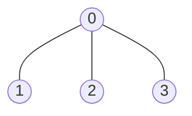

```text
Input: roads = [[0,1],[0,2],[0,3]], seats = 5
Output: 3
Explanation:
- Representative1 goes directly to the capital with 1 liter of fuel.
- Representative2 goes directly to the capital with 1 liter of fuel.
- Representative3 goes directly to the capital with 1 liter of fuel.
It costs 3 liters of fuel at minimum.
It can be proven that 3 is the minimum number of liters of fuel needed.
```

```text
Example 2:
```

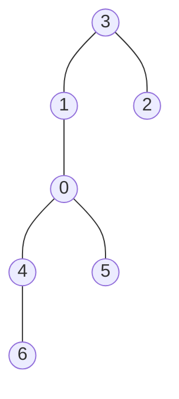

```text
Input: roads = [[3,1],[3,2],[1,0],[0,4],[0,5],[4,6]], seats = 2
Output: 7
Explanation:
- Representative2 goes directly to city 3 with 1 liter of fuel.
- Representative2 and representative3 go together to city 1 with 1 liter of fuel.
- Representative2 and representative3 go together to the capital with 1 liter of fuel.
- Representative1 goes directly to the capital with 1 liter of fuel.
- Representative5 goes directly to the capital with 1 liter of fuel.
- Representative6 goes directly to city 4 with 1 liter of fuel.
- Representative4 and representative6 go together to the capital with 1 liter of fuel.
It costs 7 liters of fuel at minimum.
It can be proven that 7 is the minimum number of liters of fuel needed.
```

```text
Example 3:
Input: roads = [], seats = 1
Output: 0
Explanation: No representatives need to travel to the capital city.
```

```text
Constraints:
1 <= n <= 10^5
roads.length == n - 1
roads[i].length == 2
0 <= ai, bi < n
ai != bi
roads represents a valid tree.
1 <= seats <= 10^5
```

<details><summary>Hint</summary>

```text
1. Can you record the size of each subtree?
2. If n people meet on the same node, what is the minimum number of cars needed?
```

</details>

</details>

<details><summary>C</summary>

```c
long long minimumFuelCost(int** roads, int roadsSize, int* roadsColSize, int seats) {
}
```

</details>

<details><summary>C++</summary>

```c++
class Solution {
   public:
    long long dfs(int node, int parent, vector<vector<int>>& adjacent, int seats, long long& fuel) {
        long long retVal = 1;

        for (int neighbor : adjacent[node]) {
            if (neighbor != parent) {
                retVal += dfs(neighbor, node, adjacent, seats, fuel);
            }
        }

        if (node != 0) {
            // Count the fuel it takes to move to the parent node. Root node does not have any parent so we ignore it.
            fuel += ceil((double)retVal / seats);
        }

        return retVal;
    }
    long long minimumFuelCost(vector<vector<int>>& roads, int seats) {
        long long retVal = 0;

        vector<vector<int>> adjacent(roads.size() + 1);
        for (auto& road : roads) {
            adjacent[road[0]].push_back(road[1]);
            adjacent[road[1]].push_back(road[0]);
        }
        dfs(0, -1, adjacent, seats, retVal);

        return retVal;
    }
};
```

</details>

## [2492. Minimum Score of a Path Between Two Cities](https://leetcode.com/problems/minimum-score-of-a-path-between-two-cities/)  1679

<details><summary>Description</summary>

```text
You are given a positive integer n representing n cities numbered from 1 to n.
You are also given a 2D array roads where roads[i] = [ai, bi, distancei] indicates
that there is a bidirectional road between cities ai and bi with a distance equal to distancei.
The cities graph is not necessarily connected.

The score of a path between two cities is defined as the minimum distance of a road in this path.

Return the minimum possible score of a path between cities 1 and n.

Note:
A path is a sequence of roads between two cities.
It is allowed for a path to contain the same road multiple times,
and you can visit cities 1 and n multiple times along the path.
The test cases are generated such that there is at least one path between 1 and n.

Example 1:
     +-(1)-+
    7|     |9
    (4)---(2)
        5  |6
          (3)
Input: n = 4, roads = [[1,2,9],[2,3,6],[2,4,5],[1,4,7]]
Output: 5
Explanation: The path from city 1 to 4 with the minimum score is: 1 -> 2 -> 4. The score of this path is min(9,5) = 5.
It can be shown that no other path has less score.

Example 2:
     +-(1)-+
    4|     |2
    (3)---(2)
    7|
    (4)
Input: n = 4, roads = [[1,2,2],[1,3,4],[3,4,7]]
Output: 2
Explanation: The path from city 1 to 4 with the minimum score is: 1 -> 2 -> 1 -> 3 -> 4.
The score of this path is min(2,2,4,7) = 2.

Constraints:
2 <= n <= 10^5
1 <= roads.length <= 10^5
roads[i].length == 3
1 <= ai, bi <= n
ai != bi
1 <= distancei <= 10^4
There are no repeated edges.
There is at least one path between 1 and n.
```

<details><summary>Hint</summary>

```text
1. Can you solve the problem if the whole graph is connected?
2. Notice that if the graph is connected, you can always use any edge of the graph in your path.
3. How to solve the general problem in a similar way? Remove all the nodes that are not connected to 1 and n,
   then apply the previous solution in the new graph.
```

</details>

</details>

<details><summary>C</summary>

```c
int minScore(int n, int** roads, int roadsSize, int* roadsColSize) {

}
```

</details>

<details><summary>C++</summary>

```c++
class Solution {
   public:
    int minScore(int n, vector<vector<int>>& roads) {
        int retVal = 0;

        int roadsSize = roads.size();

        //
        vector<pair<int, int>> adjacent[n + 1];
        for (int i = 0; i < roadsSize; ++i) {
            adjacent[roads[i][0]].push_back({roads[i][1], roads[i][2]});
            adjacent[roads[i][1]].push_back({roads[i][0], roads[i][2]});
        }

        // Breadth-First Search
        queue<int> bfsQueue;
        bfsQueue.push(1);

        vector<bool> visit(n + 1);
        visit[1] = true;

        retVal = numeric_limits<int>::max();
        while (bfsQueue.empty() == false) {
            int src = bfsQueue.front();
            bfsQueue.pop();

            for (auto& iterator : adjacent[src]) {
                int dest = iterator.first;
                if (visit[dest] == false) {
                    bfsQueue.push(dest);
                    visit[dest] = true;
                }

                int distance = iterator.second;
                retVal = (distance < retVal ? distance : retVal);
            }
        }

        return retVal;
    }
};
```

</details>

<details><summary>Python3</summary>

```python
import queue    # Submit need extra import

class Solution:
    def __init__(self):
        # queue
        self.method = 1
        # deque
        self.method = 2

    def minScore(self, n: int, roads: List[List[int]]) -> int:
        retVal = sys.maxsize

        #
        adjacent = defaultdict(dict)
        for src, dest, distance in roads:
            adjacent[src][dest] = distance
            adjacent[dest][src] = distance

        # Breadth-First Search
        visit = set()

        if self.method == 1:
            print("import queue")

            bfsQueue = queue.Queue()
            bfsQueue.put(1)

            while bfsQueue.empty() == False:
                src = bfsQueue.get()
                for dest, distance in adjacent[src].items():
                    if dest not in visit:
                        bfsQueue.put(dest)
                        visit.add(dest)
                    retVal = min(retVal, distance)

        elif self.method == 2:
            print("from collections import deque")

            bfsQueue = deque([1])

            while bfsQueue:
                src = bfsQueue.popleft()
                for dest, distance in adjacent[src].items():
                    if dest not in visit:
                        bfsQueue.append(dest)
                        visit.add(dest)
                    retVal = min(retVal, distance)

        return retVal
```

</details>

## [2642. Design Graph With Shortest Path Calculator](https://leetcode.com/problems/design-graph-with-shortest-path-calculator/description/)  1810

- [Official](https://leetcode.com/problems/design-graph-with-shortest-path-calculator/editorial/)

<details><summary>Description</summary>

```text
There is a directed weighted graph that consists of n nodes numbered from 0 to n - 1.
The edges of the graph are initially represented by the given array edges
where edges[i] = [fromi, toi, edgeCosti] meaning that there is an edge from fromi to toi with the cost edgeCosti.

Implement the Graph class:
- Graph(int n, int[][] edges)
    initializes the object with n nodes and the given edges.
- addEdge(int[] edge)
    adds an edge to the list of edges where edge = [from, to, edgeCost].
    It is guaranteed that there is no edge between the two nodes before adding this one.
- int shortestPath(int node1, int node2)
    returns the minimum cost of a path from node1 to node2.
    If no path exists, return -1. The cost of a path is the sum of the costs of the edges in the path.

Example 1:
Input
["Graph", "shortestPath", "shortestPath", "addEdge", "shortestPath"]
[[4, [[0, 2, 5], [0, 1, 2], [1, 2, 1], [3, 0, 3]]], [3, 2], [0, 3], [[1, 3, 4]], [0, 3]]
Output
[null, 6, -1, null, 6]
Explanation
Graph g = new Graph(4, [[0, 2, 5], [0, 1, 2], [1, 2, 1], [3, 0, 3]]);
g.shortestPath(3, 2);
// return 6.
   The shortest path from 3 to 2 in the first diagram above is 3 -> 0 -> 1 -> 2 with a total cost of 3 + 2 + 1 = 6.
g.shortestPath(0, 3);
// return -1. There is no path from 0 to 3.
g.addEdge([1, 3, 4]);
// We add an edge from node 1 to node 3, and we get the second diagram above.
g.shortestPath(0, 3);
// return 6. The shortest path from 0 to 3 now is 0 -> 1 -> 3 with a total cost of 2 + 4 = 6.

Constraints:
1 <= n <= 100
0 <= edges.length <= n * (n - 1)
edges[i].length == edge.length == 3
0 <= fromi, toi, from, to, node1, node2 <= n - 1
1 <= edgeCosti, edgeCost <= 10^6
There are no repeated edges and no self-loops in the graph at any point.
At most 100 calls will be made for addEdge.
At most 100 calls will be made for shortestPath.
```

<details><summary>Hint</summary>

```text
1. After adding each edge, update your graph with the new edge,
   and you can calculate the shortest path in your graph each time the shortestPath method is called.
2. Use dijkstra’s algorithm to calculate the shortest paths.
```

</details>

</details>

<details><summary>C</summary>

```c
typedef struct {
    int* vetr;
    int vetr_num;
    int** vetr_edge;
} Graph;
Graph* graphCreate(int n, int** edges, int edgesSize, int* edgesColSize) {
    Graph* obj = (Graph*)malloc(sizeof(Graph));

    int i;

    obj->vetr = (int*)calloc(n, sizeof(int));
    for (i = 0; i < n; i++) {
        obj->vetr[i] = i;
    }

    obj->vetr_num = n;

    obj->vetr_edge = (int**)calloc(n, sizeof(int*));
    for (i = 0; i < n; i++) {
        obj->vetr_edge[i] = (int*)calloc(n, sizeof(int));
    }
    for (i = 0; i < edgesSize; i++) {
        obj->vetr_edge[edges[i][0]][edges[i][1]] = edges[i][2];
    }

    return obj;
}
void graphAddEdge(Graph* obj, int* edge, int edgeSize) {
    //
    obj->vetr_edge[edge[0]][edge[1]] = edge[2];
}
int graphShortestPath(Graph* obj, int node1, int node2) {
    int retVal = 0;

    int* path = (int*)calloc(obj->vetr_num, sizeof(int));
    int i;
    for (i = 0; i < obj->vetr_num; i++) {
        path[i] = -1;
    }

    int judge[obj->vetr_num];
    memset(judge, 0, sizeof(judge));
    path[node1] = 0;

    int node;
    int min[2];
    while (1) {
        min[0] = -1;
        min[1] = -1;

        for (node = 0; node < obj->vetr_num; node++) {
            if (path[node] != -1 && judge[node] == 0) {
                if (min[0] == -1) {
                    min[0] = node;
                    min[1] = path[node];
                } else {
                    if (min[1] > path[node]) {
                        min[0] = node;
                        min[1] = path[node];
                    }
                }
            }
        }

        if (min[0] != -1) {
            judge[min[0]] = 1;
            for (i = 0; i < obj->vetr_num; i++) {
                if ((obj->vetr_edge[min[0]][i] != 0) && (judge[i] == 0)) {
                    if (path[i] == -1) {
                        path[i] = path[min[0]] + obj->vetr_edge[min[0]][i];
                    } else {
                        node = path[min[0]] + obj->vetr_edge[min[0]][i];
                        path[i] = ((path[i] > node) ? (node) : (path[i]));
                    }
                }
            }
        } else {
            break;
        }
    }

    retVal = path[node2];

    free(path);
    path = NULL;

    return retVal;
}
void graphFree(Graph* obj) {
    int i;
    for (i = 0; i < obj->vetr_num; i++) {
        free(obj->vetr_edge[i]);
        obj->vetr_edge[i] = NULL;
    }
    free(obj->vetr_edge);
    obj->vetr_edge = NULL;

    free(obj->vetr);
    obj->vetr = NULL;

    free(obj);
    obj = NULL;
}
/**
 * Your Graph struct will be instantiated and called as such:
 * Graph* obj = graphCreate(n, edges, edgesSize, edgesColSize);
 * graphAddEdge(obj, edge, edgeSize);
 * int param_2 = graphShortestPath(obj, node1, node2);
 * graphFree(obj);
 */
```

</details>

<details><summary>C++</summary>

```c++
class Graph {
   public:
    vector<vector<pair<int, int>>> adjList;
    Graph(int n, vector<vector<int>>& edges) {
        adjList.resize(n);
        for (auto& e : edges) {
            adjList[e[0]].push_back(make_pair(e[1], e[2]));
        }
    }
    void addEdge(vector<int> edge) {
        //
        adjList[edge[0]].push_back(make_pair(edge[1], edge[2]));
    }
    int shortestPath(int node1, int node2) {
        int retVal = -1;

        int n = adjList.size();
        vector<int> costForNode(n, numeric_limits<int>::max());
        costForNode[node1] = 0;

        priority_queue<vector<int>, vector<vector<int>>, greater<vector<int>>> pq;
        pq.push({0, node1});
        while (pq.empty() == false) {
            int currCost = pq.top()[0];
            int currNode = pq.top()[1];
            pq.pop();
            if (currCost > costForNode[currNode]) {
                continue;
            }

            if (currNode == node2) {
                retVal = currCost;
                break;
            }

            for (auto& neighbor : adjList[currNode]) {
                int neighborNode = neighbor.first;
                int cost = neighbor.second;
                int newCost = currCost + cost;
                if (newCost < costForNode[neighborNode]) {
                    costForNode[neighborNode] = newCost;
                    pq.push({newCost, neighborNode});
                }
            }
        }

        return retVal;
    }
};
/**
 * Your Graph object will be instantiated and called as such:
 * Graph* obj = new Graph(n, edges);
 * obj->addEdge(edge);
 * int param_2 = obj->shortestPath(node1,node2);
 */
```

</details>

<details><summary>Python3</summary>

```python
class Graph:
    def __init__(self, n: int, edges: List[List[int]]):
        self.adj_list = [[] for _ in range(n)]
        for from_node, to_node, cost in edges:
            self.adj_list[from_node].append((to_node, cost))

    def addEdge(self, edge: List[int]) -> None:
        from_node, to_node, cost = edge
        self.adj_list[from_node].append((to_node, cost))

    def shortestPath(self, node1: int, node2: int) -> int:
        retVal = -1

        n = len(self.adj_list)
        cost_for_node = [float('inf')] * (n)
        cost_for_node[node1] = 0

        pq = [(0, node1)]
        while pq:
            curr_cost, curr_node = heappop(pq)
            if curr_cost > cost_for_node[curr_node]:
                continue

            if curr_node == node2:
                retVal = curr_cost
                break

            for neighbor, cost in self.adj_list[curr_node]:
                new_cost = curr_cost + cost
                if new_cost < cost_for_node[neighbor]:
                    cost_for_node[neighbor] = new_cost
                    heappush(pq, (new_cost, neighbor))

        return retVal


# Your Graph object will be instantiated and called as such:
# obj = Graph(n, edges)
# obj.addEdge(edge)
# param_2 = obj.shortestPath(node1,node2)
```

</details>
