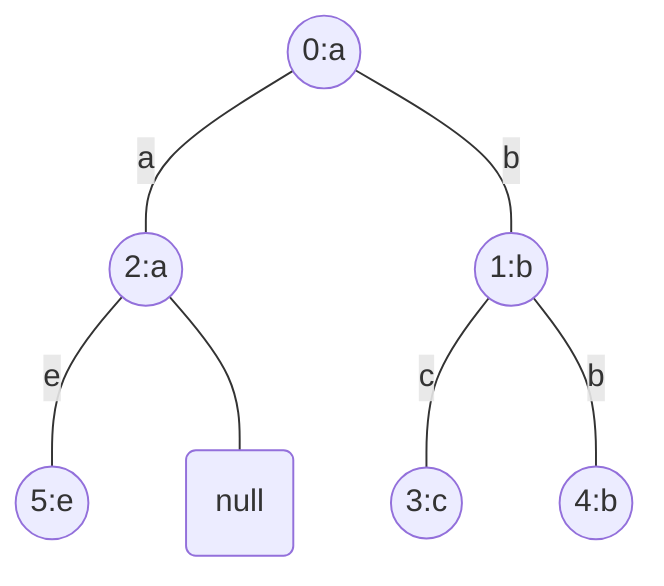
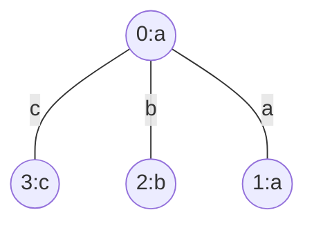
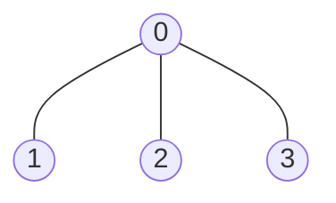
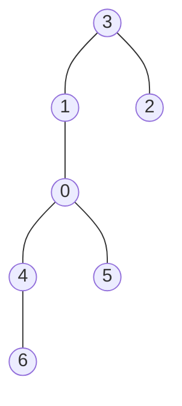

# [Graph](https://en.wikipedia.org/wiki/Graph_(discrete_mathematics))

- [Breadth-First Search](https://en.wikipedia.org/wiki/Breadth-first_search)
- [Depth-First Search](https://en.wikipedia.org/wiki/Depth-first_search)
- [Topological sorting](https://en.wikipedia.org/wiki/Topological_sorting)
- [Union Find](https://en.wikipedia.org/wiki/Disjoint-set_data_structure)

## [2050. Parallel Courses III](https://leetcode.com/problems/parallel-courses-iii/)  2084

- [Official](https://leetcode.com/problems/parallel-courses-iii/editorial/)
- [Official](https://leetcode.cn/problems/parallel-courses-iii/solutions/2357818/bing-xing-ke-cheng-iii-by-leetcode-solut-aw43/)

<details><summary>Description</summary>

```text
You are given an integer n, which indicates that there are n courses labeled from 1 to n.
You are also given a 2D integer array relations where relations[j] = [prevCoursej,
nextCoursej] denotes that course prevCoursej has to be completed before course nextCoursej (prerequisite relationship).
Furthermore, you are given a 0-indexed integer array time
where time[i] denotes how many months it takes to complete the (i+1)th course.

You must find the minimum number of months needed to complete all the courses following these rules:
- You may start taking a course at any time if the prerequisites are met.
- Any number of courses can be taken at the same time.

Return the minimum number of months needed to complete all the courses.

Note: The test cases are generated such that it is possible to complete every course
(i.e., the graph is a directed acyclic graph).

Example 1:
Input: n = 3, relations = [[1,3],[2,3]], time = [3,2,5]
Output: 8
Explanation: The figure above represents the given graph and the time required to complete each course.
We start course 1 and course 2 simultaneously at month 0.
Course 1 takes 3 months and course 2 takes 2 months to complete respectively.
Thus, the earliest time we can start course 3 is at month 3, and the total time required is 3 + 5 = 8 months.

Example 2:
Input: n = 5, relations = [[1,5],[2,5],[3,5],[3,4],[4,5]], time = [1,2,3,4,5]
Output: 12
Explanation: The figure above represents the given graph and the time required to complete each course.
You can start courses 1, 2, and 3 at month 0.
You can complete them after 1, 2, and 3 months respectively.
Course 4 can be taken only after course 3 is completed, i.e., after 3 months. It is completed after 3 + 4 = 7 months.
Course 5 can be taken only after courses 1, 2, 3, and 4 have been completed, i.e., after max(1,2,3,7) = 7 months.
Thus, the minimum time needed to complete all the courses is 7 + 5 = 12 months.

Constraints:
1 <= n <= 5 * 10^4
0 <= relations.length <= min(n * (n - 1) / 2, 5 * 10^4)
relations[j].length == 2
1 <= prevCoursej, nextCoursej <= n
prevCoursej != nextCoursej
All the pairs [prevCoursej, nextCoursej] are unique.
time.length == n
1 <= time[i] <= 10^4
The given graph is a directed acyclic graph.
```

<details><summary>Hint</summary>

```text
1. What is the earliest time a course can be taken?
2. How would you solve the problem if all courses take equal time?
3. How would you generalize this approach?
```

</details>

</details>

<details><summary>C</summary>

```c
int minimumTime(int n, int** relations, int relationsSize, int* relationsColSize, int* time, int timeSize) {
    int retVal = 0;

    int i;

    //
    int count[n + 1];
    memset(count, 0, sizeof(count));
    for (i = 0; i < relationsSize; ++i) {
        count[relations[i][0]]++;
    }
    int graphMaxSize = 1;
    for (i = 0; i <= n; ++i) {
        graphMaxSize = fmax(graphMaxSize, count[i]);
    }

    int graph[n][graphMaxSize];
    memset(graph, -1, sizeof(graph));
    int graphColSize[n];
    memset(graphColSize, 0, sizeof(graphColSize));

    int indegree[n];
    memset(indegree, 0, sizeof(indegree));

    int x, y;
    for (i = 0; i < relationsSize; ++i) {
        x = relations[i][0] - 1;
        y = relations[i][1] - 1;
        graph[x][graphColSize[x]++] = y;
        indegree[y]++;
    }
#if (0)
    printf("indegree: ");
    for (i = 0; i < n; ++i) {
        printf("%d ", indegree[i]);
    }
    printf("\n");
    for (i = 0; i < n; ++i) {
        printf("graph[%d]: ", i);
        for (int j = 0; j < graphColSize[i]; ++j) {
            printf("%2d ", graph[i][j]);
        }
        printf(": %d\n", graphColSize[i]);
    }
#endif

    //
    int maxTime[n];
    memset(maxTime, 0, sizeof(maxTime));

#define MAX_QUEUE_SIZE ((n)*2)
    int topologicalSortQueueHead = 0;
    int topologicalSortQueueTail = 0;
    int topologicalSortQueue[MAX_QUEUE_SIZE];

    for (i = 0; i < n; i++) {
        if (indegree[i] == 0) {
            topologicalSortQueue[topologicalSortQueueTail++] = i;
            maxTime[i] = time[i];
        }
    }
#if (0)
    printf("maxTime: ");
    for (i = 0; i < n; ++i) {
        printf("%d ", maxTime[i]);
    }
    printf("\n");
    for (i = 0; i < (topologicalSortQueueTail - topologicalSortQueueHead); ++i) {
        printf("%d ", topologicalSortQueue[i]);
    }
    printf("\n");
#endif

    // Topological Sort Using Kahn's Algorithm
    int node, neighbor;
    while (topologicalSortQueueHead < topologicalSortQueueTail) {
        node = topologicalSortQueue[topologicalSortQueueHead++];

        for (i = 0; i < graphColSize[node]; ++i) {
            neighbor = graph[node][i];

            maxTime[neighbor] = fmax(maxTime[neighbor], maxTime[node] + time[neighbor]);
            indegree[neighbor]--;
            if (indegree[neighbor] == 0) {
                topologicalSortQueue[topologicalSortQueueTail++] = neighbor;
            }
        }
    }

    for (i = 0; i < n; i++) {
        retVal = fmax(retVal, maxTime[i]);
    }

    return retVal;
}
```

</details>

<details><summary>C++</summary>

```c++
class Solution {
   public:
    int minimumTime(int n, vector<vector<int>>& relations, vector<int>& time) {
        int retVal = 0;

        unordered_map<int, vector<int>> graph;
        vector<int> indegree(n, 0);
        for (vector<int>& edge : relations) {
            int x = edge[0] - 1;
            int y = edge[1] - 1;
            graph[x].push_back(y);
            indegree[y]++;
        }

        queue<int> topologicalSortQueue;
        vector<int> maxTime(n, 0);
        for (int node = 0; node < n; node++) {
            if (indegree[node] == 0) {
                topologicalSortQueue.push(node);
                maxTime[node] = time[node];
            }
        }

        // Topological Sort Using Kahn's Algorithm
        while (topologicalSortQueue.empty() == false) {
            int node = topologicalSortQueue.front();
            topologicalSortQueue.pop();
            for (int neighbor : graph[node]) {
                maxTime[neighbor] = max(maxTime[neighbor], maxTime[node] + time[neighbor]);
                indegree[neighbor]--;
                if (indegree[neighbor] == 0) {
                    topologicalSortQueue.push(neighbor);
                }
            }
        }

        for (int node = 0; node < n; node++) {
            retVal = max(retVal, maxTime[node]);
        }

        return retVal;
    }
};
```

</details>

<details><summary>Python3</summary>

```python
class Solution:
    def minimumTime(self, n: int, relations: List[List[int]], time: List[int]) -> int:
        retVal = 0

        graph = defaultdict(list)
        indegree = [0] * n
        for (x, y) in relations:
            graph[x - 1].append(y - 1)
            indegree[y - 1] += 1

        topologicalSortQueue = deque()
        max_time = [0] * n
        for node in range(n):
            if indegree[node] == 0:
                topologicalSortQueue.append(node)
                max_time[node] = time[node]

        # Topological Sort Using Kahn's Algorithm
        while topologicalSortQueue:
            node = topologicalSortQueue.popleft()
            for neighbor in graph[node]:
                max_time[neighbor] = max(max_time[neighbor], max_time[node] + time[neighbor])
                indegree[neighbor] -= 1
                if indegree[neighbor] == 0:
                    topologicalSortQueue.append(neighbor)

        retVal = max(max_time)

        return retVal
```

</details>

## [2092. Find All People With Secret](https://leetcode.com/problems/find-all-people-with-secret/)  2003

- [Official](https://leetcode.com/problems/find-all-people-with-secret/editorial/)
- [Official](https://leetcode.cn/problems/find-all-people-with-secret/solutions/1127118/zhao-chu-zhi-xiao-mi-mi-de-suo-you-zhuan-fzxf/)

<details><summary>Description</summary>

```text
You are given an integer n indicating there are n people numbered from 0 to n - 1.
You are also given a 0-indexed 2D integer array meetings
where meetings[i] = [xi, yi, timei] indicates that person xi and person yi have a meeting at timei.
A person may attend multiple meetings at the same time. Finally, you are given an integer firstPerson.

Person 0 has a secret and initially shares the secret with a person firstPerson at time 0.
This secret is then shared every time a meeting takes place with a person that has the secret.
More formally, for every meeting, if a person xi has the secret at timei,
then they will share the secret with person yi, and vice versa.

The secrets are shared instantaneously.
That is, a person may receive the secret and share it with people in other meetings within the same time frame.

Return a list of all the people that have the secret after all the meetings have taken place.
You may return the answer in any order.

Example 1:
Input: n = 6, meetings = [[1,2,5],[2,3,8],[1,5,10]], firstPerson = 1
Output: [0,1,2,3,5]
Explanation:
At time 0, person 0 shares the secret with person 1.
At time 5, person 1 shares the secret with person 2.
At time 8, person 2 shares the secret with person 3.
At time 10, person 1 shares the secret with person 5.​​​​
Thus, people 0, 1, 2, 3, and 5 know the secret after all the meetings.

Example 2:
Input: n = 4, meetings = [[3,1,3],[1,2,2],[0,3,3]], firstPerson = 3
Output: [0,1,3]
Explanation:
At time 0, person 0 shares the secret with person 3.
At time 2, neither person 1 nor person 2 know the secret.
At time 3, person 3 shares the secret with person 0 and person 1.
Thus, people 0, 1, and 3 know the secret after all the meetings.

Example 3:
Input: n = 5, meetings = [[3,4,2],[1,2,1],[2,3,1]], firstPerson = 1
Output: [0,1,2,3,4]
Explanation:
At time 0, person 0 shares the secret with person 1.
At time 1, person 1 shares the secret with person 2, and person 2 shares the secret with person 3.
Note that person 2 can share the secret at the same time as receiving it.
At time 2, person 3 shares the secret with person 4.
Thus, people 0, 1, 2, 3, and 4 know the secret after all the meetings.

Constraints:
2 <= n <= 10^5
1 <= meetings.length <= 10^5
meetings[i].length == 3
0 <= xi, yi <= n - 1
xi != yi
1 <= timei <= 10^5
1 <= firstPerson <= n - 1
```

<details><summary>Hint</summary>

```text
1. Could you model all the meetings happening at the same time as a graph?
2. What data structure can you use to efficiently share the secret?
3. You can use the union-find data structure to quickly determine who knows the secret and share the secret.
```

</details>

</details>

<details><summary>C</summary>

```c
int compareInteger(const void* n1, const void* n2) {
    // ascending order
    return (*(int*)n1 > *(int*)n2);
}
int compareIntArray(const void* a1, const void* a2) {
    const int* p1 = *(const int**)a1;
    const int* p2 = *(const int**)a2;

    // ascending order
    return (p1[2] > p2[2]);
}
void GetResult(int** meetings, int start, int num, int* returnValue, int* returnSize, int* flag) {
    int people;
    int i;
    int rule = 1;
    while (rule > 0) {
        rule = 0;
        for (i = 0; i < num; i++) {
            if (flag[meetings[i + start][0]] != flag[meetings[i + start][1]]) {
                people = flag[meetings[i + start][0]] ? meetings[i + start][1] : meetings[i + start][0];
                returnValue[(*returnSize)++] = people;
                flag[people] = 1;
                rule = 1;
            }
        }
    }
}
/**
 * Note: The returned array must be malloced, assume caller calls free().
 */
int* findAllPeople(int n, int** meetings, int meetingsSize, int* meetingsColSize, int firstPerson, int* returnSize) {
    int* pRetVal = NULL;

    (*returnSize) = 0;

    //
    pRetVal = (int*)malloc(n * sizeof(int));
    if (pRetVal == NULL) {
        perror("malloc");
        return pRetVal;
    }
    memset(pRetVal, 0, (n * sizeof(int)));
    pRetVal[0] = 0;
    pRetVal[1] = firstPerson;
    (*returnSize) = 2;

    //
    qsort(meetings, meetingsSize, sizeof(int*), compareIntArray);

    //
    int* flag = (int*)malloc(n * sizeof(int));
    if (pRetVal == NULL) {
        perror("malloc");
        (*returnSize) = 0;
        free(pRetVal);
        pRetVal = NULL;
        return pRetVal;
    }
    memset(flag, 0, (n * sizeof(int)));
    flag[0] = 1;
    flag[firstPerson] = 1;

    int people;
    int start = 0;
    int num = 0;
    int i;
    for (i = 0; i < meetingsSize; i++) {
        if ((i > 0) && (meetings[i][2] != meetings[i - 1][2])) {
            start = i;
            num = 1;
        } else {
            num++;
        }

        if (flag[meetings[i][0]] != flag[meetings[i][1]]) {
            people = flag[meetings[i][0]] ? meetings[i][1] : meetings[i][0];
            pRetVal[(*returnSize)] = people;
            (*returnSize)++;
            flag[people] = 1;
        }

        if (((i < (meetingsSize - 1)) && (meetings[i][2] != meetings[i + 1][2])) || (i == (meetingsSize - 1))) {
            GetResult(meetings, start, num, pRetVal, returnSize, flag);
        }
    }

    //
    free(flag);
    flag = NULL;

    //
    qsort(pRetVal, (*returnSize), sizeof(int), compareInteger);

    return pRetVal;
}
```

</details>

<details><summary>C++</summary>

```c++
class Solution {
   public:
    vector<int> findAllPeople(int n, vector<vector<int>>& meetings, int firstPerson) {
        vector<int> retVal;

        //
        unordered_map<int, vector<pair<int, int>>> graph;
        for (auto& meeting : meetings) {
            int x = meeting[0];
            int y = meeting[1];
            int t = meeting[2];
            graph[x].emplace_back(t, y);
            graph[y].emplace_back(t, x);
        }

        //
        int secretDefaultValue = std::numeric_limits<int>::max();
        vector<int> secret(n, secretDefaultValue);
        secret[0] = 0;
        secret[firstPerson] = 0;

        //
        queue<pair<int, int>> bfsQueue;
        bfsQueue.emplace(0, 0);
        bfsQueue.emplace(firstPerson, 0);
        while (bfsQueue.empty() == false) {
            auto [person, time] = bfsQueue.front();
            bfsQueue.pop();
            for (auto [t, nextPerson] : graph[person]) {
                if ((t >= time) && (secret[nextPerson] > t)) {
                    secret[nextPerson] = t;
                    bfsQueue.emplace(nextPerson, t);
                }
            }
        }

        //
        for (int i = 0; i < n; ++i) {
            if (secret[i] != secretDefaultValue) {
                retVal.push_back(i);
            }
        }

        return retVal;
    }
};
```

</details>

<details><summary>Python3</summary>

```python
class Solution:
    def findAllPeople(self, n: int, meetings: List[List[int]], firstPerson: int) -> List[int]:
        retVal = []

        #
        graph = defaultdict(list)
        for x, y, t in meetings:
            graph[x].append((t, y))
            graph[y].append((t, x))

        #
        secretDefaultValue = float('inf')
        secret = [secretDefaultValue] * n
        secret[0] = 0
        secret[firstPerson] = 0

        #
        bfsQueue = deque()
        bfsQueue.append((0, 0))
        bfsQueue.append((firstPerson, 0))
        while bfsQueue:
            person, time = bfsQueue.popleft()
            for t, nextPerson in graph[person]:
                if t >= time and secret[nextPerson] > t:
                    secret[nextPerson] = t
                    bfsQueue.append((nextPerson, t))

        #
        for i in range(n):
            if secret[i] != secretDefaultValue:
                retVal.append(i)

        return retVal
```

</details>

## [2101. Detonate the Maximum Bombs](https://leetcode.com/problems/detonate-the-maximum-bombs/)  1880

- [Official](https://leetcode.com/problems/detonate-the-maximum-bombs/editorial/)
- [Official](https://leetcode.cn/problems/detonate-the-maximum-bombs/solutions/1153683/yin-bao-zui-duo-de-zha-dan-by-leetcode-s-iccp/)

<details><summary>Description</summary>

```text
You are given a list of bombs. The range of a bomb is defined as the area where its effect can be felt.
This area is in the shape of a circle with the center as the location of the bomb.

The bombs are represented by a 0-indexed 2D integer array bombs where bombs[i] = [xi, yi, ri].
xi and yi denote the X-coordinate and Y-coordinate of the location of the ith bomb,
whereas ri denotes the radius of its range.

You may choose to detonate a single bomb. When a bomb is detonated, it will detonate all bombs that lie in its range.
These bombs will further detonate the bombs that lie in their ranges.

Given the list of bombs,
return the maximum number of bombs that can be detonated if you are allowed to detonate only one bomb.

Example 1:
Input: bombs = [[2,1,3],[6,1,4]]
Output: 2
Explanation:
The above figure shows the positions and ranges of the 2 bombs.
If we detonate the left bomb, the right bomb will not be affected.
But if we detonate the right bomb, both bombs will be detonated.
So the maximum bombs that can be detonated is max(1, 2) = 2.

Example 2:
Input: bombs = [[1,1,5],[10,10,5]]
Output: 1
Explanation:
Detonating either bomb will not detonate the other bomb, so the maximum number of bombs that can be detonated is 1.

Example 3:
Input: bombs = [[1,2,3],[2,3,1],[3,4,2],[4,5,3],[5,6,4]]
Output: 5
Explanation:
The best bomb to detonate is bomb 0 because:
- Bomb 0 detonates bombs 1 and 2. The red circle denotes the range of bomb 0.
- Bomb 2 detonates bomb 3. The blue circle denotes the range of bomb 2.
- Bomb 3 detonates bomb 4. The green circle denotes the range of bomb 3.
Thus all 5 bombs are detonated.

Constraints:
1 <= bombs.length <= 100
bombs[i].length == 3
1 <= xi, yi, ri <= 10^5
```

<details><summary>Hint</summary>

```text
1. How can we model the relationship between different bombs? Can "graphs" help us?
2. Bombs are nodes and are connected to other bombs in their range by directed edges.
3. If we know which bombs will be affected when any bomb is detonated,
   how can we find the total number of bombs that will be detonated if we start from a fixed bomb?
4. Run a Depth First Search (DFS) from every node, and all the nodes it reaches are the bombs that will be detonated.
```

</details>

</details>

<details><summary>C</summary>

```c
#define DFS (0)
#define BFS (1)
int bfs(int node, int** edges, int* edgesColSize, int bombsSize) {
    int retVal = 0;

    int visited[bombsSize];
    memset(visited, 0, sizeof(visited));
    visited[node] = 1;
    int bfsQueue[bombsSize * bombsSize];
    memset(bfsQueue, 0, sizeof(bfsQueue));
    int bfsQueueHead = 0;
    int bfsQueueTail = 0;
    bfsQueue[bfsQueueHead++] = node;
    ++retVal;

    int i;
    int current;
    while (bfsQueueHead > bfsQueueTail) {
        current = bfsQueue[bfsQueueTail];
        ++bfsQueueTail;
        for (i = 0; i < edgesColSize[current]; ++i) {
            if (visited[edges[current][i]] == 1) {
                continue;
            }
            visited[edges[current][i]] = 1;
            bfsQueue[bfsQueueHead++] = edges[current][i];
            ++retVal;
        }
    }

    return retVal;
}
int maximumDetonation(int** bombs, int bombsSize, int* bombsColSize) {
    int retVal = 0;

    int i, j;

    //
    int** edges = (int**)malloc(bombsSize * sizeof(int*));
    if (edges == NULL) {
        perror("malloc");
        return retVal;
    }
    for (i = 0; i < bombsSize; ++i) {
        edges[i] = (int*)malloc(bombsSize * sizeof(int));
        if (edges[i] == NULL) {
            perror("malloc");
            for (j = 0; j < i; ++j) {
                free(edges[j]);
                edges[j] = NULL;
            }
            free(edges);
            edges = NULL;
            return retVal;
        }
        memset(edges[i], 0, (bombsSize * sizeof(int)));
    }
    int edgesColSize[bombsSize];
    memset(edgesColSize, 0, sizeof(edgesColSize));
    for (i = 0; i < bombsSize; ++i) {
        for (j = 0; j < bombsSize; ++j) {
            if (i == j) {
                continue;
            }

            // 1 <= xi, yi, ri <= 10^5
            long long dx = bombs[i][0] - bombs[j][0];
            long long dy = bombs[i][1] - bombs[j][1];
            long long dr = (dx * dx) + (dy * dy);
            long long r = (long long)bombs[i][2] * (long long)bombs[i][2];
            if (r >= dr) {
                edges[i][edgesColSize[i]++] = j;
            }
        }
    }
#if 0  // graph print
    for (i = 0; i < bombsSize; ++i) {
        printf("%d: ", i);
        for (j = 0; j < bombsSize; ++j) {
            printf("%d ", edges[i][j]);
        }
        printf(" => %d\n", edgesColSize[i]);
    }
#endif

    //
    for (int i = 0; i < bombsSize; ++i) {
#if (DFS)
#elif (BFS)
        retVal = fmax(retVal, bfs(i, edges, edgesColSize, bombsSize));
#endif
    }

    //
    for (i = 0; i < bombsSize; ++i) {
        free(edges[i]);
        edges[i] = NULL;
    }
    free(edges);
    edges = NULL;

    return retVal;
}
```

</details>

<details><summary>C++</summary>

```c++
class Solution {
   public:
#define DFS (0)
#define BFS (1)
   public:
    Solution() {
#if (DFS)
        cout << "Depth-First Search\n\n";
#elif (BFS)
        cout << "Breadth-First Search\n\n";
#endif
    }
    int dfs(int node, unordered_map<int, int>& visited, unordered_map<int, vector<int>>& edges) {
        int retVal = 0;

        visited[node] = 1;
        for (auto neighbor : edges[node]) {
            if (visited[neighbor] == 1) {
                continue;
            }
            visited[neighbor] = 1;
            dfs(neighbor, visited, edges);
        }
        retVal = visited.size();

        return retVal;
    }
    int bfs(int node, unordered_map<int, vector<int>>& edges, int bombsSize) {
        int retVal = 0;

        vector<int> visited(bombsSize, 0);
        visited[node] = 1;
        queue<int> bfsQueue;
        bfsQueue.emplace(node);
        ++retVal;

        while (bfsQueue.empty() == false) {
            auto current = bfsQueue.front();
            bfsQueue.pop();
            for (auto neighbor : edges[current]) {
                if (visited[neighbor] == 1) {
                    continue;
                }
                visited[neighbor] = 1;
                bfsQueue.emplace(neighbor);
                ++retVal;
            }
        }

        return retVal;
    }
    int maximumDetonation(vector<vector<int>>& bombs) {
        int retVal = 0;

        int bombsSize = bombs.size();

        //
        unordered_map<int, vector<int>> edges;
        for (int i = 0; i < bombsSize; ++i) {
            for (int j = 0; j < bombsSize; ++j) {
                if (i == j) {
                    continue;
                }

                // 1 <= xi, yi, ri <= 10^5
                long long dx = bombs[i][0] - bombs[j][0];
                long long dy = bombs[i][1] - bombs[j][1];
                long long dr = (dx * dx) + (dy * dy);
                long long r = (long long)bombs[i][2] * (long long)bombs[i][2];
                if (r >= dr) {
                    edges[i].push_back(j);
                }
            }
        }

        //
        for (int i = 0; i < bombsSize; ++i) {
#if (DFS)
            unordered_map<int, int> visited;
            retVal = max(retVal, dfs(i, visited, edges));
#elif (BFS)
            retVal = max(retVal, bfs(i, edges, bombsSize));
#endif
        }

        return retVal;
    }
};
```

</details>

<details><summary>Python3</summary>

```python
class Solution:
    def __init__(self):
        self.method = 2

        if self.method == 1:
            print("Depth-First Search")
        elif self.method == 2:
            print("Breadth-First Search")
        print()

    def dfs(self, cur: int, visited: set[int], graph: defaultdict[List[int]]) -> int:
        retVal = 0

        visited.add(cur)
        for neighbor in graph[cur]:
            if neighbor in visited:
                continue
            self.dfs(neighbor, visited, graph)
        retVal = len(visited)

        return retVal

    def bfs(self, i: int, graph: defaultdict[List[int]]) -> int:
        retVal = 0

        bfsQueue = deque([i])
        visited = set([i])
        while bfsQueue:
            current = bfsQueue.popleft()
            for neighbor in graph[current]:
                if neighbor in visited:
                    continue
                visited.add(neighbor)
                bfsQueue.append(neighbor)
        retVal = len(visited)

        return retVal

    def maximumDetonation(self, bombs: List[List[int]]) -> int:
        retVal = 0

        bombsSize = len(bombs)

        #
        graph = defaultdict(list)
        for i in range(bombsSize):
            for j in range(bombsSize):
                if i == j:
                    continue

                xi, yi, ri = bombs[i]
                xj, yj, _ = bombs[j]
                if ri ** 2 >= (xi - xj) ** 2 + (yi - yj) ** 2:
                    graph[i].append(j)

        #
        for i in range(bombsSize):
            if self.method == 1:
                visited = set()
                retVal = max(retVal, self.dfs(i, visited, graph))
            elif self.method == 2:
                retVal = max(retVal, self.bfs(i, graph))

        return retVal
```

</details>

## [2246. Longest Path With Different Adjacent Characters](https://leetcode.com/problems/longest-path-with-different-adjacent-characters/)  2126

- [Official](https://leetcode.com/problems/longest-path-with-different-adjacent-characters/solutions/2889382/longest-path-with-different-adjacent-characters/)

<details><summary>Description</summary>

```text
You are given a tree (i.e. a connected, undirected graph that has no cycles)
rooted at node 0 consisting of n nodes numbered from 0 to n - 1.
The tree is represented by a 0-indexed array parent of size n, where parent[i] is the parent of node i.
Since node 0 is the root, parent[0] == -1.

You are also given a string s of length n, where s[i] is the character assigned to node i.

Return the length of the longest path in the tree
such that no pair of adjacent nodes on the path have the same character assigned to them.
```

```text
Example 1:
```



```text
Input: parent = [-1,0,0,1,1,2], s = "abacbe"
Output: 3
Explanation: The longest path where each two adjacent nodes have different characters in the tree is the path: 0 -> 1 -> 3.
The length of this path is 3, so 3 is returned.
It can be proven that there is no longer path that satisfies the conditions.
```

```text
Example 2:
```



```text
Input: parent = [-1,0,0,0], s = "aabc"
Output: 3
Explanation: The longest path where each two adjacent nodes have different characters is the path: 2 -> 0 -> 3.
The length of this path is 3, so 3 is returned.
```

```text
Constraints:
n == parent.length == s.length
1 <= n <= 10^5
0 <= parent[i] <= n - 1 for all i >= 1
parent[0] == -1
parent represents a valid tree.
s consists of only lowercase English letters.
```

</details>

<details><summary>C</summary>

```c
int longestPath(int* parent, int parentSize, char * s){

}
```

</details>

<details><summary>C++</summary>

```c++
class Solution {
#define DEPTH_FIRST_SEARCH (1)
#define BREADTH_FIRST_SEARCH (1)

   public:
    int dfs(int currentNode, vector<vector<int>>& children, string& s, int& longestPath) {
        // Longest and second longest chains starting from currentNode (does not count the currentNode itself).
        int longestChain = 0;
        int secondLongestChain = 0;

        for (int child : children[currentNode]) {
            // Get the number of nodes in the longest path in the subtree of child, including the child.
            int longestChainStartingFromChild = dfs(child, children, s, longestPath);

            // We won't move to the child if it has the same character as the currentNode.
            if (s[currentNode] == s[child]) {
                continue;
            }

            // Modify the longestChain and secondLongestChain if longestChainStartingFromChild is bigger.
            if (longestChainStartingFromChild > longestChain) {
                secondLongestChain = longestChain;
                longestChain = longestChainStartingFromChild;
            } else if (longestChainStartingFromChild > secondLongestChain) {
                secondLongestChain = longestChainStartingFromChild;
            }
        }

        // Add "1" for the node itself.
        longestPath = max(longestPath, longestChain + secondLongestChain + 1);

        return longestChain + 1;
    }

    int longestPath(vector<int>& parent, string s) {
        int retVal;

#if (DEPTH_FIRST_SEARCH)
        cout << "DEPTH_FIRST_SEARCH\n";

        int n = parent.size();
        vector<vector<int>> children(n);
        // Start from node 1, since root node 0 does not have a parent.
        for (int i = 1; i < n; ++i) {
            children[parent[i]].push_back(i);
        }

        retVal = 1;
        dfs(0, children, s, retVal);
#elif (BREADTH_FIRST_SEARCH)
        cout << "BREADTH_FIRST_SEARCH\n";

        retVal = 1;

        int n = parent.size();
        vector<int> childrenCount(n);
        // Start from 1, since the root node does not have a parent.
        for (int node = 1; node < n; node++) {
            childrenCount[parent[node]]++;
        }

        vector<vector<int>> longestChains(n);
        queue<int> q;
        for (int node = 0; node < n; node++) {
            longestChains[node] = vector<int>(2);
            // Push all leaf nodes in the queue.
            if (childrenCount[node] == 0 && node != 0) {
                q.push(node);
                longestChains[node][0] = 1;
            }
        }

        while (!q.empty()) {
            int currentNode = q.front();
            q.pop();
            int par = parent[currentNode];

            // Get the number of nodes in the longest chain starting from the currentNode, including the currentNode.
            if (s[currentNode] != s[par]) {
                // Modify the longest chain and second longest chain if longestChainStartingFromCurrNode is bigger.
                int longestChainStartingFromCurrNode = longestChains[currentNode][0];
                if (longestChainStartingFromCurrNode > longestChains[par][0]) {
                    longestChains[par][1] = longestChains[par][0];
                    longestChains[par][0] = longestChainStartingFromCurrNode;
                } else if (longestChainStartingFromCurrNode > longestChains[par][1]) {
                    longestChains[par][1] = longestChainStartingFromCurrNode;
                }
            }

            retVal = max(retVal, longestChains[par][0] + longestChains[par][1] + 1);
            childrenCount[par]--;

            if (childrenCount[par] == 0 && par != 0) {
                longestChains[par][0]++;
                q.push(par);
            }
        }
#endif

        return retVal;
    }
};
```

</details>

## [2316. Count Unreachable Pairs of Nodes in an Undirected Graph](https://leetcode.com/problems/count-unreachable-pairs-of-nodes-in-an-undirected-graph/)  1604

<details><summary>Description</summary>

```text
You are given an integer n.
There is an undirected graph with n nodes, numbered from 0 to n - 1.
You are given a 2D integer array edges where edges[i] = [ai, bi] denotes
that there exists an undirected edge connecting nodes ai and bi.

Return the number of pairs of different nodes that are unreachable from each other.

Example 1:
Input: n = 3, edges = [[0,1],[0,2],[1,2]]
Output: 0
Explanation: There are no pairs of nodes that are unreachable from each other. Therefore, we return 0.

Example 2:
Input: n = 7, edges = [[0,2],[0,5],[2,4],[1,6],[5,4]]
Output: 14
Explanation: There are 14 pairs of nodes that are unreachable from each other:
[[0,1],[0,3],[0,6],[1,2],[1,3],[1,4],[1,5],[2,3],[2,6],[3,4],[3,5],[3,6],[4,6],[5,6]].
Therefore, we return 14.

Constraints:
1 <= n <= 10^5
0 <= edges.length <= 2 * 10^5
edges[i].length == 2
0 <= ai, bi < n
ai != bi
There are no repeated edges.
```

<details><summary>Hint</summary>

```text
1. Find the connected components of the graph.
   To find connected components, you can use Union Find (Disjoint Sets), BFS, or DFS.
2. For a node u, the number of nodes that are unreachable from u is the number of nodes
   that are not in the same connected component as u.
3. The number of unreachable nodes from node u will be the same for the number of nodes
   that are unreachable from node v if nodes u and v belong to the same connected component.
```

</details>

</details>

<details><summary>C</summary>

```c
#define UNION_FIND (1)
#if (UNION_FIND)
void swap(int* a, int* b) {
    int tmp = *a;
    *a = *b;
    *b = tmp;
}

struct DisjointSetUnion {
    int* parent;
    int* size;
    int n;
    int setCount;
};
int initDisjointSet(struct DisjointSetUnion* obj, int n) {
    obj->parent = (int*)malloc(n * sizeof(int));
    if (obj->parent == NULL) {
        perror("malloc");
        return EXIT_FAILURE;
    }
    obj->size = (int*)malloc(n * sizeof(int));
    if (obj->size == NULL) {
        perror("malloc");
        return EXIT_FAILURE;
    }
    obj->n = n;
    obj->setCount = n;

    int i;
    for (i = 0; i < n; ++i) {
        obj->parent[i] = i;
        obj->size[i] = 1;
    }

    return EXIT_SUCCESS;
}
void freeDisjointSet(struct DisjointSetUnion* obj) {
    if (obj->parent) {
        free(obj->parent);
        obj->parent = NULL;
    }

    if (obj->size) {
        free(obj->size);
        obj->size = NULL;
    }
}
int find(struct DisjointSetUnion* obj, int x) {
    int retVal = x;

    if (obj->parent[x] != x) {
        obj->parent[x] = find(obj, obj->parent[x]);
        retVal = obj->parent[x];
    }

    return retVal;
}
bool unionSet(struct DisjointSetUnion* obj, int x, int y) {
    int retVal = false;

    int fx = find(obj, x);
    int fy = find(obj, y);
    if (fx == fy) {
        return retVal;
    }

    if (obj->size[fx] < obj->size[fy]) {
        swap(&fx, &fy);
    }
    obj->size[fx] += obj->size[fy];
    obj->parent[fy] = fx;
    obj->setCount--;
    retVal = true;

    return retVal;
}
#endif
long long countPairs(int n, int** edges, int edgesSize, int* edgesColSize) {
    long long retVal = 0;

    struct DisjointSetUnion* pUnionFind = (struct DisjointSetUnion*)malloc(sizeof(struct DisjointSetUnion));
    if (pUnionFind == NULL) {
        perror("malloc");
        return retVal;
    }
    if (initDisjointSet(pUnionFind, n) == EXIT_FAILURE) {
        freeDisjointSet(pUnionFind);
        free(pUnionFind);
        pUnionFind = NULL;
        return retVal;
    }

    int i;
    for (i = 0; i < edgesSize; ++i) {
        unionSet(pUnionFind, edges[i][0], edges[i][1]);
    }
    for (i = 0; i < n; ++i) {
        if (pUnionFind->parent[i] == i) {
            retVal += (long long)pUnionFind->size[i] * (n - pUnionFind->size[i]);
        }
    }
    retVal /= 2;

    freeDisjointSet(pUnionFind);
    free(pUnionFind);
    pUnionFind = NULL;

    return retVal;
}
```

</details>

<details><summary>C++</summary>

```c++
class UnionFind {
   public:
    vector<int> parent;
    vector<int> size;
    int n;
    int setCount;
    UnionFind(int _n) : parent(vector<int>(_n)), size(vector<int>(_n, 1)), n(_n), setCount(_n) {
        //
        iota(parent.begin(), parent.end(), 0);
    }

    int findset(int x) {
        int retVal = x;

        if (parent[x] == x) {
            return retVal;
        }
        parent[x] = findset(parent[x]);
        retVal = parent[x];

        return retVal;
    }
    bool unite(int x, int y) {
        bool retVal = false;

        x = findset(x);
        y = findset(y);
        if (x == y) {
            return retVal;
        }

        if (size[x] < size[y]) {
            swap(x, y);
        }
        parent[y] = x;
        size[x] += size[y];
        --setCount;
        retVal = true;

        return retVal;
    }
    bool connected(int x, int y) {
        bool retVal = false;

        x = findset(x);
        y = findset(y);
        if (x == y) {
            retVal = true;
        }

        return retVal;
    }
};

class Solution {
   public:
    long long countPairs(int n, vector<vector<int>>& edges) {
        long long retVal = 0;

        UnionFind uf(n);
        for (auto& edge : edges) {
            uf.unite(edge[0], edge[1]);
        }

        for (int i = 0; i < n; i++) {
            if (uf.parent[i] == i) {
                retVal += (long long)uf.size[i] * (n - uf.size[i]);
            }
        }
        retVal /= 2;

        return retVal;
    }
};
```

</details>

<details><summary>Python3</summary>

```python
class UnionFind:
    def __init__(self, n: int):
        self.parent = list(range(n))
        self.size = [1] * n
        self.n = n
        self.setCount = n

    def findset(self, x: int) -> int:
        if self.parent[x] == x:
            return x
        self.parent[x] = self.findset(self.parent[x])
        return self.parent[x]

    def unite(self, x: int, y: int) -> bool:
        x, y = self.findset(x), self.findset(y)
        if x == y:
            return False
        if self.size[x] < self.size[y]:
            x, y = y, x
        self.parent[y] = x
        self.size[x] += self.size[y]
        self.setCount -= 1
        return True

    def connected(self, x: int, y: int) -> bool:
        x, y = self.findset(x), self.findset(y)
        return x == y


class Solution:
    def countPairs(self, n: int, edges: List[List[int]]) -> int:
        retVal = 0

        uf = UnionFind(n)
        for x, y in edges:
            uf.unite(x, y)

        for i in range(n):
            if uf.parent[i] == i:
                retVal += uf.size[i] * (n - uf.size[i])
        retVal = int(retVal / 2)

        return retVal
```

</details>

## [2359. Find Closest Node to Given Two Nodes](https://leetcode.com/problems/find-closest-node-to-given-two-nodes/)  1714

- [Official](https://leetcode.com/problems/find-closest-node-to-given-two-nodes/solutions/2864716/find-closest-node-to-given-two-nodes/)

<details><summary>Description</summary>

```text
You are given a directed graph of n nodes numbered from 0 to n - 1, where each node has at most one outgoing edge.

The graph is represented with a given 0-indexed array edges of size n,
indicating that there is a directed edge from node i to node edges[i].
If there is no outgoing edge from i, then edges[i] == -1.

You are also given two integers node1 and node2.

Return the index of the node that can be reached from both node1 and node2,
such that the maximum between the distance from node1 to that node, and from node2 to that node is minimized.
If there are multiple answers, return the node with the smallest index, and if no possible answer exists, return -1.

Note that edges may contain cycles.

Example 1:
Input: edges = [2,2,3,-1], node1 = 0, node2 = 1
Output: 2
Explanation: The distance from node 0 to node 2 is 1, and the distance from node 1 to node 2 is 1.
The maximum of those two distances is 1.
It can be proven that we cannot get a node with a smaller maximum distance than 1, so we return node 2.

Example 2:
Input: edges = [1,2,-1], node1 = 0, node2 = 2
Output: 2
Explanation: The distance from node 0 to node 2 is 2, and the distance from node 2 to itself is 0.
The maximum of those two distances is 2.
It can be proven that we cannot get a node with a smaller maximum distance than 2, so we return node 2.

Constraints:
n == edges.length
2 <= n <= 10^5
-1 <= edges[i] < n
edges[i] != i
0 <= node1, node2 < n
```

</details>

<details><summary>C</summary>

```c
void dfs(int node, int* edges, int* dist, int* visit) {
    visit[node] = 1;

    int neighbor = edges[node];
    if ((neighbor != -1) && (visit[neighbor] == 0)) {
        dist[neighbor] = 1 + dist[node];
        dfs(neighbor, edges, dist, visit);
    }
}
int closestMeetingNode(int* edges, int edgesSize, int node1, int node2) {
    int retVal = -1;

    int i;

    int dist1[edgesSize];
    for (i = 0; i < edgesSize; ++i) {
        dist1[i] = INT_MAX;
    }
    dist1[node1] = 0;
    int visit1[edgesSize];
    memset(visit1, 0, sizeof(visit1));
    dfs(node1, edges, dist1, visit1);

    int dist2[edgesSize];
    for (i = 0; i < edgesSize; ++i) {
        dist2[i] = INT_MAX;
    }
    dist2[node2] = 0;
    int visit2[edgesSize];
    memset(visit2, 0, sizeof(visit1));
    dfs(node2, edges, dist2, visit2);

    int minDist = INT_MAX;
    for (i = 0; i < edgesSize; ++i) {
        if (minDist > fmax(dist1[i], dist2[i])) {
            retVal = i;
            minDist = fmax(dist1[i], dist2[i]);
        }
    }

    return retVal;
}
```

</details>

<details><summary>C++</summary>

```c++
class Solution {
   public:
    void dfs(int node, vector<int>& edges, vector<int>& dist, vector<bool>& visit) {
        visit[node] = true;

        int neighbor = edges[node];
        if ((neighbor != -1) && (!visit[neighbor])) {
            dist[neighbor] = 1 + dist[node];
            dfs(neighbor, edges, dist, visit);
        }
    }
    int closestMeetingNode(vector<int>& edges, int node1, int node2) {
        int retVal = -1;

        int n = edges.size();

        vector<int> dist1(n, numeric_limits<int>::max());
        dist1[node1] = 0;
        vector<bool> visit1(n);
        dfs(node1, edges, dist1, visit1);

        vector<int> dist2(n, numeric_limits<int>::max());
        dist2[node2] = 0;
        vector<bool> visit2(n);
        dfs(node2, edges, dist2, visit2);

        int minDist = numeric_limits<int>::max();
        for (int currNode = 0; currNode < n; ++currNode) {
            if (minDist > max(dist1[currNode], dist2[currNode])) {
                retVal = currNode;
                minDist = max(dist1[currNode], dist2[currNode]);
            }
        }

        return retVal;
    }
};
```

</details>

## [2360. Longest Cycle in a Graph](https://leetcode.com/problems/longest-cycle-in-a-graph/)  1897

<details><summary>Description</summary>

```text
You are given a directed graph of n nodes numbered from 0 to n - 1, where each node has at most one outgoing edge.

The graph is represented with a given 0-indexed array edges of size n,
indicating that there is a directed edge from node i to node edges[i].
If there is no outgoing edge from node i, then edges[i] == -1.

Return the length of the longest cycle in the graph. If no cycle exists, return -1.

A cycle is a path that starts and ends at the same node.

Example 1:
Input: edges = [3,3,4,2,3]
Output: 3
Explanation: The longest cycle in the graph is the cycle: 2 -> 4 -> 3 -> 2.
The length of this cycle is 3, so 3 is returned.

Example 2:
Input: edges = [2,-1,3,1]
Output: -1
Explanation: There are no cycles in this graph.

Constraints:
n == edges.length
2 <= n <= 10^5
-1 <= edges[i] < n
edges[i] != i
```

<details><summary>Hint</summary>

```text
1. How many cycles can each node at most be part of?
2. Each node can be part of at most one cycle.
   Start from each node and find the cycle that it is part of if there is any.
   Save the already visited nodes to not repeat visiting the same cycle multiple times.
```

</details>

</details>

<details><summary>C</summary>

```c
// https://leetcode.com/problems/longest-cycle-in-a-graph/solutions/2358092/simple-short-iterative-c-o-n/
int longestCycle(int* edges, int edgesSize) {
    int retVal = -1;

    int idx[edgesSize];
    memset(idx, 0, sizeof(idx));

    int k = 1;
    int curk;
    int i, j;
    for (i = 0; i < edgesSize; ++i) {
        j = i;
        curk = k;

        while ((j != -1) && (idx[j] == 0)) {
            idx[j] = k++;
            j = edges[j];
        }

        if ((j != -1) && (idx[j] >= curk)) {
            retVal = fmax(retVal, k - idx[j]);
        }
    }

    return retVal;
}
```

</details>

<details><summary>C++</summary>

```c++
class Solution {
// https://leetcode.com/problems/longest-cycle-in-a-graph/solutions/2357750/simple-dfs-traversal-easy-explanation-c/
#define DFS (1)
// https://leetcode.com/problems/longest-cycle-in-a-graph/solutions/2358092/simple-short-iterative-c-o-n/
#define TARJANS_ALGORITHM (1)

   public:
#if (DFS)
    int dfs(int node, vector<int>& edges, vector<bool>& visit, vector<int>& store) {
        int retVal = -1;

        if (node == -1) {
            return retVal;
        }

        int storeSize = store.size();

        if (visit[node] == true) {
            int count = -1;
            for (int i = 0; i < storeSize; ++i) {
                if (store[i] == node) {
                    count = i;
                    break;
                }
            }

            if (count == -1) {
                return retVal;
            }
            retVal = storeSize - count;

            return retVal;
        }

        visit[node] = true;
        store.push_back(node);
        retVal = dfs(edges[node], edges, visit, store);

        return retVal;
    }
#elif (TARJANS_ALGORITHM)
#endif

    int longestCycle(vector<int>& edges) {
        int retVal = -1;

        int edgesSize = edges.size();

#if (DFS)
        cout << "DFS\n";

        vector<bool> visit(edgesSize, 0);
        for (int i = 0; i < edgesSize; ++i) {
            if (visit[i] == true) {
                continue;
            }

            vector<int> store;
            retVal = max(retVal, dfs(i, edges, visit, store));
        }
#elif (TARJANS_ALGORITHM)
        cout << "TARJANS_ALGORITHM\n";

        vector<int> idx(edgesSize);
        int k = 1;
        for (int i = 0; i < edgesSize; ++i) {
            int j = i;
            int curk = k;
            while ((j != -1) && (idx[j] == 0)) {
                idx[j] = k++;
                j = edges[j];
            }

            if ((j != -1) && (idx[j] >= curk)) {
                retVal = max(retVal, k - idx[j]);
            }
        }
#endif

        return retVal;
    }
};
```

</details>

<details><summary>Python3</summary>

```python
class Solution:
    # // https://leetcode.com/problems/longest-cycle-in-a-graph/solutions/2358092/simple-short-iterative-c-o-n/
    def longestCycle(self, edges: List[int]) -> int:
        retVal = -1

        idx = [0 for i in range(len(edges))]
        k = 1
        for i in range(len(edges)):
            j = i
            curk = k

            while (j != -1) and (idx[j] == 0):
                idx[j] = k
                k += 1
                j = edges[j]

            if (j != -1) and (idx[j] >= curk):
                retVal = max(retVal, k-idx[j])

        return retVal
```

</details>

## [2421. Number of Good Paths](https://leetcode.com/problems/number-of-good-paths/)  2444

- [Official](https://leetcode.com/problems/number-of-good-paths/solutions/2892908/number-of-good-paths/)

<details><summary>Description</summary>

```text
There is a tree (i.e. a connected, undirected graph with no cycles)
consisting of n nodes numbered from 0 to n - 1 and exactly n - 1 edges.

You are given a 0-indexed integer array vals of length n where vals[i] denotes the value of the ith node.
You are also given a 2D integer array edges where edges[i] = [ai, bi] denotes
that there exists an undirected edge connecting nodes ai and bi.

A good path is a simple path that satisfies the following conditions:
- The starting node and the ending node have the same value.
- All nodes between the starting node and the ending node have values less than or equal to the starting node
  (i.e. the starting node's value should be the maximum value along the path).

Return the number of distinct good paths.

Note that a path and its reverse are counted as the same path.
For example, 0 -> 1 is considered to be the same as 1 -> 0.
A single node is also considered as a valid path.
Example 1:
    (0:[1])
   /       \
(1:[3])   (2:[2])
         /       \
      (3:[1])   (4:[3])
Input: vals = [1,3,2,1,3], edges = [[0,1],[0,2],[2,3],[2,4]]
Output: 6
Explanation: There are 5 good paths consisting of a single node.
There is 1 additional good path: 1 -> 0 -> 2 -> 4.
(The reverse path 4 -> 2 -> 0 -> 1 is treated as the same as 1 -> 0 -> 2 -> 4.)
Note that 0 -> 2 -> 3 is not a good path because vals[2] > vals[0].

Example 2:
            (0:[1])
           /
        (1:[1])
       /
    (2:[2])
   /       \
(3:[2])   (4:[3])
Input: vals = [1,1,2,2,3], edges = [[0,1],[1,2],[2,3],[2,4]]
Output: 7
Explanation: There are 5 good paths consisting of a single node.
There are 2 additional good paths: 0 -> 1 and 2 -> 3.

Example 3:
(0:[1])
Input: vals = [1], edges = []
Output: 1
Explanation: The tree consists of only one node, so there is one good path.

Constraints:
n == vals.length
1 <= n <= 3 * 10^4
0 <= vals[i] <= 10^5
edges.length == n - 1
edges[i].length == 2
0 <= ai, bi < n
ai != bi
edges represents a valid tree.
```

</details>

<details><summary>C</summary>

```c
// https://leetcode.cn/problems/number-of-good-paths/solutions/1850357/by-priceless-brahmaguptatvb-ichm/
#define MAX_UNION_FIND (30010)
int find(int* root, int x) {
    if (root[x] != x) {
        root[x] = find(root, root[x]);
    }

    return root[x];
}
int compareInteger(const void* n1, const void* n2) {
    // ascending order
    return (*(int*)n1 > *(int*)n2);
}
int numberOfGoodPaths(int* vals, int n, int** edges, int edgesSize, int* edgesColSize) {
    int retVal = 0;

    int i, j;

    int sortedVals[MAX_UNION_FIND][2];
    for (i = 0; i < n; ++i) {
        sortedVals[i][0] = vals[i];
        sortedVals[i][1] = i;
    }
    qsort(sortedVals, n, sizeof(2 * sizeof(int)), compareInteger);

    int idx = 0;
    int e[2 * MAX_UNION_FIND];
    memset(e, 0, sizeof(e));
    int ne[2 * MAX_UNION_FIND];
    memset(ne, 0, sizeof(ne));
    int h[MAX_UNION_FIND];
    memset(h, -1, sizeof(h));
    for (i = 0; i < edgesSize; ++i) {
        e[idx] = edges[i][1];
        ne[idx] = h[edges[i][0]];
        h[edges[i][0]] = idx++;

        e[idx] = edges[i][0];
        ne[idx] = h[edges[i][1]];
        h[edges[i][1]] = idx++;
    }

    int root[MAX_UNION_FIND];
    int size[MAX_UNION_FIND];
    for (i = 0; i < n; i++) {
        root[i] = i;
        size[i] = 1;
    }

    int x;
    int y;
    for (retVal = n, i = 0; i < n; ++i) {
        x = find(root, sortedVals[i][1]);

        for (j = h[sortedVals[i][1]]; j != -1; j = ne[j]) {
            y = find(root, e[j]);
            if ((x != y) && (vals[y] <= sortedVals[i][0])) {
                if (vals[y] == sortedVals[i][0]) {
                    retVal += size[y] * size[x];
                    size[x] += size[y];
                }
                root[y] = x;
            }
        }
    }

    return retVal;
}
```

</details>

<details><summary>C++</summary>

```c++
// https://leetcode.com/problems/number-of-good-paths/solutions/3053175/leetcode-the-hard-way-explained-line-by-line/
class Solution {
   public:
    int find(vector<int>& root, int idx) {
        if (idx == root[idx]) {
            return idx;
        }
        root[idx] = find(root, root[idx]);

        return root[idx];
    }

    int numberOfGoodPaths(vector<int>& vals, vector<vector<int>>& edges) {
        int retVal = 0;

        int n = vals.size();

        vector<int> root(n);
        for (int i = 0; i < n; i++) {
            root[i] = i;
        }

        sort(edges.begin(), edges.end(), [&](const vector<int>& x, const vector<int>& y) {
            return max(vals[x[0]], vals[x[1]]) < max(vals[y[0]], vals[y[1]]);
        });

        vector<int> cnt(n, 1);
        for (auto e : edges) {
            int x = e[0];
            x = find(root, x);

            int y = e[1];
            y = find(root, y);

            if (vals[x] == vals[y]) {
                retVal += cnt[x] * cnt[y];
                root[x] = y;
                cnt[y] += cnt[x];
            } else if (vals[x] > vals[y]) {
                root[y] = x;
            } else {
                root[x] = y;
            }
        }
        retVal += n;

        return retVal;
    }
};
```

</details>

## [2477. Minimum Fuel Cost to Report to the Capital](https://leetcode.com/problems/minimum-fuel-cost-to-report-to-the-capital/)  2011

- [Official](https://leetcode.com/problems/minimum-fuel-cost-to-report-to-the-capital/solutions/3080167/minimum-fuel-cost-to-report-to-the-capital/)

<details><summary>Description</summary>

```text
There is a tree (i.e., a connected, undirected graph with no cycles) structure country network
consisting of n cities numbered from 0 to n - 1 and exactly n - 1 roads.
The capital city is city 0.
You are given a 2D integer array roads where roads[i] = [ai, bi]
denotes that there exists a bidirectional road connecting cities ai and bi.

There is a meeting for the representatives of each city. The meeting is in the capital city.

There is a car in each city. You are given an integer seats that indicates the number of seats in each car.

A representative can use the car in their city to travel or change the car and ride with another representative.
The cost of traveling between two cities is one liter of fuel.

Return the minimum number of liters of fuel to reach the capital city.
```

```text
Example 1:
```



```text
Input: roads = [[0,1],[0,2],[0,3]], seats = 5
Output: 3
Explanation:
- Representative1 goes directly to the capital with 1 liter of fuel.
- Representative2 goes directly to the capital with 1 liter of fuel.
- Representative3 goes directly to the capital with 1 liter of fuel.
It costs 3 liters of fuel at minimum.
It can be proven that 3 is the minimum number of liters of fuel needed.
```

```text
Example 2:
```



```text
Input: roads = [[3,1],[3,2],[1,0],[0,4],[0,5],[4,6]], seats = 2
Output: 7
Explanation:
- Representative2 goes directly to city 3 with 1 liter of fuel.
- Representative2 and representative3 go together to city 1 with 1 liter of fuel.
- Representative2 and representative3 go together to the capital with 1 liter of fuel.
- Representative1 goes directly to the capital with 1 liter of fuel.
- Representative5 goes directly to the capital with 1 liter of fuel.
- Representative6 goes directly to city 4 with 1 liter of fuel.
- Representative4 and representative6 go together to the capital with 1 liter of fuel.
It costs 7 liters of fuel at minimum.
It can be proven that 7 is the minimum number of liters of fuel needed.
```

```text
Example 3:
Input: roads = [], seats = 1
Output: 0
Explanation: No representatives need to travel to the capital city.
```

```text
Constraints:
1 <= n <= 10^5
roads.length == n - 1
roads[i].length == 2
0 <= ai, bi < n
ai != bi
roads represents a valid tree.
1 <= seats <= 10^5
```

<details><summary>Hint</summary>

```text
1. Can you record the size of each subtree?
2. If n people meet on the same node, what is the minimum number of cars needed?
```

</details>

</details>

<details><summary>C</summary>

```c
long long minimumFuelCost(int** roads, int roadsSize, int* roadsColSize, int seats) {
}
```

</details>

<details><summary>C++</summary>

```c++
class Solution {
   public:
    long long dfs(int node, int parent, vector<vector<int>>& adjacent, int seats, long long& fuel) {
        long long retVal = 1;

        for (int neighbor : adjacent[node]) {
            if (neighbor != parent) {
                retVal += dfs(neighbor, node, adjacent, seats, fuel);
            }
        }

        if (node != 0) {
            // Count the fuel it takes to move to the parent node. Root node does not have any parent so we ignore it.
            fuel += ceil((double)retVal / seats);
        }

        return retVal;
    }
    long long minimumFuelCost(vector<vector<int>>& roads, int seats) {
        long long retVal = 0;

        vector<vector<int>> adjacent(roads.size() + 1);
        for (auto& road : roads) {
            adjacent[road[0]].push_back(road[1]);
            adjacent[road[1]].push_back(road[0]);
        }
        dfs(0, -1, adjacent, seats, retVal);

        return retVal;
    }
};
```

</details>

## [2492. Minimum Score of a Path Between Two Cities](https://leetcode.com/problems/minimum-score-of-a-path-between-two-cities/)  1679

<details><summary>Description</summary>

```text
You are given a positive integer n representing n cities numbered from 1 to n.
You are also given a 2D array roads where roads[i] = [ai, bi, distancei] indicates
that there is a bidirectional road between cities ai and bi with a distance equal to distancei.
The cities graph is not necessarily connected.

The score of a path between two cities is defined as the minimum distance of a road in this path.

Return the minimum possible score of a path between cities 1 and n.

Note:
A path is a sequence of roads between two cities.
It is allowed for a path to contain the same road multiple times,
and you can visit cities 1 and n multiple times along the path.
The test cases are generated such that there is at least one path between 1 and n.

Example 1:
     +-(1)-+
    7|     |9
    (4)---(2)
        5  |6
          (3)
Input: n = 4, roads = [[1,2,9],[2,3,6],[2,4,5],[1,4,7]]
Output: 5
Explanation: The path from city 1 to 4 with the minimum score is: 1 -> 2 -> 4. The score of this path is min(9,5) = 5.
It can be shown that no other path has less score.

Example 2:
     +-(1)-+
    4|     |2
    (3)---(2)
    7|
    (4)
Input: n = 4, roads = [[1,2,2],[1,3,4],[3,4,7]]
Output: 2
Explanation: The path from city 1 to 4 with the minimum score is: 1 -> 2 -> 1 -> 3 -> 4.
The score of this path is min(2,2,4,7) = 2.

Constraints:
2 <= n <= 10^5
1 <= roads.length <= 10^5
roads[i].length == 3
1 <= ai, bi <= n
ai != bi
1 <= distancei <= 10^4
There are no repeated edges.
There is at least one path between 1 and n.
```

<details><summary>Hint</summary>

```text
1. Can you solve the problem if the whole graph is connected?
2. Notice that if the graph is connected, you can always use any edge of the graph in your path.
3. How to solve the general problem in a similar way? Remove all the nodes that are not connected to 1 and n,
   then apply the previous solution in the new graph.
```

</details>

</details>

<details><summary>C</summary>

```c
int minScore(int n, int** roads, int roadsSize, int* roadsColSize) {

}
```

</details>

<details><summary>C++</summary>

```c++
class Solution {
   public:
    int minScore(int n, vector<vector<int>>& roads) {
        int retVal = 0;

        int roadsSize = roads.size();

        //
        vector<pair<int, int>> adjacent[n + 1];
        for (int i = 0; i < roadsSize; ++i) {
            adjacent[roads[i][0]].push_back({roads[i][1], roads[i][2]});
            adjacent[roads[i][1]].push_back({roads[i][0], roads[i][2]});
        }

        // Breadth-First Search
        queue<int> bfsQueue;
        bfsQueue.push(1);

        vector<bool> visit(n + 1);
        visit[1] = true;

        retVal = numeric_limits<int>::max();
        while (bfsQueue.empty() == false) {
            int src = bfsQueue.front();
            bfsQueue.pop();

            for (auto& iterator : adjacent[src]) {
                int dest = iterator.first;
                if (visit[dest] == false) {
                    bfsQueue.push(dest);
                    visit[dest] = true;
                }

                int distance = iterator.second;
                retVal = (distance < retVal ? distance : retVal);
            }
        }

        return retVal;
    }
};
```

</details>

<details><summary>Python3</summary>

```python
import queue    # Submit need extra import

class Solution:
    def __init__(self):
        # queue
        self.method = 1
        # deque
        self.method = 2

    def minScore(self, n: int, roads: List[List[int]]) -> int:
        retVal = sys.maxsize

        #
        adjacent = defaultdict(dict)
        for src, dest, distance in roads:
            adjacent[src][dest] = distance
            adjacent[dest][src] = distance

        # Breadth-First Search
        visit = set()

        if self.method == 1:
            print("import queue")

            bfsQueue = queue.Queue()
            bfsQueue.put(1)

            while bfsQueue.empty() == False:
                src = bfsQueue.get()
                for dest, distance in adjacent[src].items():
                    if dest not in visit:
                        bfsQueue.put(dest)
                        visit.add(dest)
                    retVal = min(retVal, distance)

        elif self.method == 2:
            print("from collections import deque")

            bfsQueue = deque([1])

            while bfsQueue:
                src = bfsQueue.popleft()
                for dest, distance in adjacent[src].items():
                    if dest not in visit:
                        bfsQueue.append(dest)
                        visit.add(dest)
                    retVal = min(retVal, distance)

        return retVal
```

</details>

## [2642. Design Graph With Shortest Path Calculator](https://leetcode.com/problems/design-graph-with-shortest-path-calculator/description/)  1810

- [Official](https://leetcode.com/problems/design-graph-with-shortest-path-calculator/editorial/)

<details><summary>Description</summary>

```text
There is a directed weighted graph that consists of n nodes numbered from 0 to n - 1.
The edges of the graph are initially represented by the given array edges
where edges[i] = [fromi, toi, edgeCosti] meaning that there is an edge from fromi to toi with the cost edgeCosti.

Implement the Graph class:
- Graph(int n, int[][] edges)
    initializes the object with n nodes and the given edges.
- addEdge(int[] edge)
    adds an edge to the list of edges where edge = [from, to, edgeCost].
    It is guaranteed that there is no edge between the two nodes before adding this one.
- int shortestPath(int node1, int node2)
    returns the minimum cost of a path from node1 to node2.
    If no path exists, return -1. The cost of a path is the sum of the costs of the edges in the path.

Example 1:
Input
["Graph", "shortestPath", "shortestPath", "addEdge", "shortestPath"]
[[4, [[0, 2, 5], [0, 1, 2], [1, 2, 1], [3, 0, 3]]], [3, 2], [0, 3], [[1, 3, 4]], [0, 3]]
Output
[null, 6, -1, null, 6]
Explanation
Graph g = new Graph(4, [[0, 2, 5], [0, 1, 2], [1, 2, 1], [3, 0, 3]]);
g.shortestPath(3, 2);
// return 6.
   The shortest path from 3 to 2 in the first diagram above is 3 -> 0 -> 1 -> 2 with a total cost of 3 + 2 + 1 = 6.
g.shortestPath(0, 3);
// return -1. There is no path from 0 to 3.
g.addEdge([1, 3, 4]);
// We add an edge from node 1 to node 3, and we get the second diagram above.
g.shortestPath(0, 3);
// return 6. The shortest path from 0 to 3 now is 0 -> 1 -> 3 with a total cost of 2 + 4 = 6.

Constraints:
1 <= n <= 100
0 <= edges.length <= n * (n - 1)
edges[i].length == edge.length == 3
0 <= fromi, toi, from, to, node1, node2 <= n - 1
1 <= edgeCosti, edgeCost <= 10^6
There are no repeated edges and no self-loops in the graph at any point.
At most 100 calls will be made for addEdge.
At most 100 calls will be made for shortestPath.
```

<details><summary>Hint</summary>

```text
1. After adding each edge, update your graph with the new edge,
   and you can calculate the shortest path in your graph each time the shortestPath method is called.
2. Use dijkstra’s algorithm to calculate the shortest paths.
```

</details>

</details>

<details><summary>C</summary>

```c
typedef struct {
    int* vetr;
    int vetr_num;
    int** vetr_edge;
} Graph;
Graph* graphCreate(int n, int** edges, int edgesSize, int* edgesColSize) {
    Graph* obj = (Graph*)malloc(sizeof(Graph));

    int i;

    obj->vetr = (int*)calloc(n, sizeof(int));
    for (i = 0; i < n; i++) {
        obj->vetr[i] = i;
    }

    obj->vetr_num = n;

    obj->vetr_edge = (int**)calloc(n, sizeof(int*));
    for (i = 0; i < n; i++) {
        obj->vetr_edge[i] = (int*)calloc(n, sizeof(int));
    }
    for (i = 0; i < edgesSize; i++) {
        obj->vetr_edge[edges[i][0]][edges[i][1]] = edges[i][2];
    }

    return obj;
}
void graphAddEdge(Graph* obj, int* edge, int edgeSize) {
    //
    obj->vetr_edge[edge[0]][edge[1]] = edge[2];
}
int graphShortestPath(Graph* obj, int node1, int node2) {
    int retVal = 0;

    int* path = (int*)calloc(obj->vetr_num, sizeof(int));
    int i;
    for (i = 0; i < obj->vetr_num; i++) {
        path[i] = -1;
    }

    int judge[obj->vetr_num];
    memset(judge, 0, sizeof(judge));
    path[node1] = 0;

    int node;
    int min[2];
    while (1) {
        min[0] = -1;
        min[1] = -1;

        for (node = 0; node < obj->vetr_num; node++) {
            if (path[node] != -1 && judge[node] == 0) {
                if (min[0] == -1) {
                    min[0] = node;
                    min[1] = path[node];
                } else {
                    if (min[1] > path[node]) {
                        min[0] = node;
                        min[1] = path[node];
                    }
                }
            }
        }

        if (min[0] != -1) {
            judge[min[0]] = 1;
            for (i = 0; i < obj->vetr_num; i++) {
                if ((obj->vetr_edge[min[0]][i] != 0) && (judge[i] == 0)) {
                    if (path[i] == -1) {
                        path[i] = path[min[0]] + obj->vetr_edge[min[0]][i];
                    } else {
                        node = path[min[0]] + obj->vetr_edge[min[0]][i];
                        path[i] = ((path[i] > node) ? (node) : (path[i]));
                    }
                }
            }
        } else {
            break;
        }
    }

    retVal = path[node2];

    free(path);
    path = NULL;

    return retVal;
}
void graphFree(Graph* obj) {
    int i;
    for (i = 0; i < obj->vetr_num; i++) {
        free(obj->vetr_edge[i]);
        obj->vetr_edge[i] = NULL;
    }
    free(obj->vetr_edge);
    obj->vetr_edge = NULL;

    free(obj->vetr);
    obj->vetr = NULL;

    free(obj);
    obj = NULL;
}
/**
 * Your Graph struct will be instantiated and called as such:
 * Graph* obj = graphCreate(n, edges, edgesSize, edgesColSize);
 * graphAddEdge(obj, edge, edgeSize);
 * int param_2 = graphShortestPath(obj, node1, node2);
 * graphFree(obj);
 */
```

</details>

<details><summary>C++</summary>

```c++
class Graph {
   public:
    vector<vector<pair<int, int>>> adjList;
    Graph(int n, vector<vector<int>>& edges) {
        adjList.resize(n);
        for (auto& e : edges) {
            adjList[e[0]].push_back(make_pair(e[1], e[2]));
        }
    }
    void addEdge(vector<int> edge) {
        //
        adjList[edge[0]].push_back(make_pair(edge[1], edge[2]));
    }
    int shortestPath(int node1, int node2) {
        int retVal = -1;

        int n = adjList.size();
        vector<int> costForNode(n, numeric_limits<int>::max());
        costForNode[node1] = 0;

        priority_queue<vector<int>, vector<vector<int>>, greater<vector<int>>> pq;
        pq.push({0, node1});
        while (pq.empty() == false) {
            int currCost = pq.top()[0];
            int currNode = pq.top()[1];
            pq.pop();
            if (currCost > costForNode[currNode]) {
                continue;
            }

            if (currNode == node2) {
                retVal = currCost;
                break;
            }

            for (auto& neighbor : adjList[currNode]) {
                int neighborNode = neighbor.first;
                int cost = neighbor.second;
                int newCost = currCost + cost;
                if (newCost < costForNode[neighborNode]) {
                    costForNode[neighborNode] = newCost;
                    pq.push({newCost, neighborNode});
                }
            }
        }

        return retVal;
    }
};
/**
 * Your Graph object will be instantiated and called as such:
 * Graph* obj = new Graph(n, edges);
 * obj->addEdge(edge);
 * int param_2 = obj->shortestPath(node1,node2);
 */
```

</details>

<details><summary>Python3</summary>

```python
class Graph:
    def __init__(self, n: int, edges: List[List[int]]):
        self.adj_list = [[] for _ in range(n)]
        for from_node, to_node, cost in edges:
            self.adj_list[from_node].append((to_node, cost))

    def addEdge(self, edge: List[int]) -> None:
        from_node, to_node, cost = edge
        self.adj_list[from_node].append((to_node, cost))

    def shortestPath(self, node1: int, node2: int) -> int:
        retVal = -1

        n = len(self.adj_list)
        cost_for_node = [float('inf')] * (n)
        cost_for_node[node1] = 0

        pq = [(0, node1)]
        while pq:
            curr_cost, curr_node = heappop(pq)
            if curr_cost > cost_for_node[curr_node]:
                continue

            if curr_node == node2:
                retVal = curr_cost
                break

            for neighbor, cost in self.adj_list[curr_node]:
                new_cost = curr_cost + cost
                if new_cost < cost_for_node[neighbor]:
                    cost_for_node[neighbor] = new_cost
                    heappush(pq, (new_cost, neighbor))

        return retVal


# Your Graph object will be instantiated and called as such:
# obj = Graph(n, edges)
# obj.addEdge(edge)
# param_2 = obj.shortestPath(node1,node2)
```

</details>

## [2709. Greatest Common Divisor Traversal](https://leetcode.com/problems/greatest-common-divisor-traversal/)  2171

<details><summary>Description</summary>

```text
You are given a 0-indexed integer array nums, and you are allowed to traverse between its indices.
You can traverse between index i and index j, i != j,
if and only if gcd(nums[i], nums[j]) > 1, where gcd is the greatest common divisor.

Your task is to determine if for every pair of indices i and j in nums, where i < j,
there exists a sequence of traversals that can take us from i to j.

Return true if it is possible to traverse between all such pairs of indices, or false otherwise.

Example 1:
Input: nums = [2,3,6]
Output: true
Explanation: In this example, there are 3 possible pairs of indices: (0, 1), (0, 2), and (1, 2).
To go from index 0 to index 1, we can use the sequence of traversals 0 -> 2 -> 1,
where we move from index 0 to index 2 because gcd(nums[0], nums[2]) = gcd(2, 6) = 2 > 1,
and then move from index 2 to index 1 because gcd(nums[2], nums[1]) = gcd(6, 3) = 3 > 1.
To go from index 0 to index 2, we can just go directly because gcd(nums[0], nums[2]) = gcd(2, 6) = 2 > 1.
Likewise, to go from index 1 to index 2, we can just go directly because gcd(nums[1], nums[2]) = gcd(3, 6) = 3 > 1.

Example 2:
Input: nums = [3,9,5]
Output: false
Explanation: No sequence of traversals can take us from index 0 to index 2 in this example. So, we return false.

Example 3:
Input: nums = [4,3,12,8]
Output: true
Explanation:
There are 6 possible pairs of indices to traverse between: (0, 1), (0, 2), (0, 3), (1, 2), (1, 3), and (2, 3).
A valid sequence of traversals exists for each pair, so we return true.

Constraints:
1 <= nums.length <= 10^5
1 <= nums[i] <= 10^5
```

<details><summary>Hint</summary>

```text
1. Create a (prime) factor-numbers list for all the indices.
2. Add an edge between the neighbors of the (prime) factor-numbers list. The order of the numbers doesn’t matter.
   We only need edges between 2 neighbors instead of edges for all pairs.
3. The problem is now similar to checking if all the numbers (nodes of the graph) are in the same connected component.
4. Any algorithm (i.e., BFS, DFS, or Union-Find Set) should work to find or check connected components
```

</details>

</details>

<details><summary>C</summary>

```c
// https://leetcode.cn/problems/greatest-common-divisor-traversal/
void swap(int* a, int* b) {
    int tmp = *a;
    *a = *b;
    *b = tmp;
}
struct DisjointSetUnion {
    int* f;
    int* size;
    int n;
    int setCount;
};
int initDSU(struct DisjointSetUnion* obj, int n) {
    obj->f = (int*)malloc(n * sizeof(int));
    if (obj->f == NULL) {
        perror("malloc");
        return EXIT_FAILURE;
    }
    memset(obj->f, 0, (n * sizeof(int)));

    obj->size = (int*)malloc(n * sizeof(int));
    if (obj->size == NULL) {
        perror("malloc");
        free(obj->f);
        obj->f = NULL;
        return EXIT_FAILURE;
    }
    memset(obj->size, 0, (n * sizeof(int)));

    int i;
    for (i = 0; i < n; i++) {
        obj->f[i] = i;
        obj->size[i] = 1;
    }
    obj->n = n;
    obj->setCount = n;

    return EXIT_SUCCESS;
}
int find(struct DisjointSetUnion* obj, int x) {
    int retVal = x;

    if (obj->f[x] != x) {
        obj->f[x] = find(obj, obj->f[x]);
        retVal = obj->f[x];
    }

    return retVal;
}
bool unionSet(struct DisjointSetUnion* obj, int x, int y) {
    bool retVal = false;

    int fx = find(obj, x);
    int fy = find(obj, y);
    if (fx == fy) {
        return retVal;
    }

    if (obj->size[fx] < obj->size[fy]) {
        swap(&fx, &fy);
    }
    obj->size[fx] += obj->size[fy];
    obj->f[fy] = fx;
    obj->setCount--;
    retVal = true;

    return retVal;
}
bool canTraverseAllPairs(int* nums, int numsSize) {
    bool retVal = true;

    if (numsSize == 1) {
        return retVal;
    }

    struct DisjointSetUnion* ufa = (struct DisjointSetUnion*)malloc(sizeof(struct DisjointSetUnion));
    if (ufa == NULL) {
        perror("malloc");
        return retVal;
    }
    if (initDSU(ufa, numsSize) == EXIT_FAILURE) {
        perror("malloc");
        free(ufa);
        ufa = NULL;
        return retVal;
    }

    int i;

    int maxVal = 0;
    for (i = 0; i < numsSize; i++) {
        maxVal = fmax(maxVal, nums[i]);
    }

    int occured[maxVal + 1];
    memset(occured, -1, sizeof(occured));
    for (i = 0; i < numsSize; i++) {
        if (occured[nums[i]] == -1) {
            occured[nums[i]] = i;
        } else if (nums[i] == 1) {
            retVal = false;
            goto exit;
        } else {
            ufa->setCount--;
        }
    }

    int j;
    int subGcd;
    for (i = 2; i <= maxVal; i++) {
        subGcd = -1;
        for (j = i; j <= maxVal; j += i) {
            if (occured[j] != -1) {
                if (subGcd == -1) {
                    subGcd = occured[j];
                } else {
                    unionSet(ufa, subGcd, occured[j]);
                    subGcd = occured[j];
                }
            }
        }
    }

    if (ufa->setCount != 1) {
        retVal = false;
    }

exit:
    free(ufa->f);
    ufa->f = NULL;
    free(ufa->size);
    ufa->size = NULL;
    free(ufa);
    ufa = NULL;

    return retVal;
}
```

</details>

<details><summary>C++</summary>

```c++
class Solution {
    // https://leetcode.com/problems/greatest-common-divisor-traversal/solutions/4778264/mastering-javascript-python-python3-and-c-achieved-100-00-efficiency/
   private:
    int findSetLeader(vector<int>& disjointSet, int x) {
        int retVal = x;

        if (disjointSet[x] == x) {
            return retVal;
        }
        disjointSet[x] = findSetLeader(disjointSet, disjointSet[x]);
        retVal = disjointSet[x];

        return retVal;
    }
    void unionSets(vector<int>& disjointSet, vector<int>& setSize, int x, int y) {
        int xLeader = findSetLeader(disjointSet, x);
        int yLeader = findSetLeader(disjointSet, y);
        if (xLeader == yLeader) {
            return;
        }

        if (setSize[xLeader] < setSize[yLeader]) {
            disjointSet[xLeader] = yLeader;
            setSize[yLeader] += setSize[xLeader];
        } else {
            disjointSet[yLeader] = xLeader;
            setSize[xLeader] += setSize[yLeader];
        }
    }

   public:
    bool canTraverseAllPairs(vector<int>& nums) {
        bool retVal = true;

        int numsSize = nums.size();
        if (numsSize == 1) {
            return retVal;
        }

        vector<int> disjointSet(numsSize);
        vector<int> setSize(numsSize, 1);
        unordered_map<int, int> factorFirstOccurrence;
        for (int i = 0; i < numsSize; ++i) {
            disjointSet[i] = i;

            int num = nums[i];
            int divisor = 2;
            while (divisor * divisor <= num) {
                if (num % divisor == 0) {
                    if (factorFirstOccurrence.find(divisor) != factorFirstOccurrence.end()) {
                        unionSets(disjointSet, setSize, i, factorFirstOccurrence[divisor]);
                    } else {
                        factorFirstOccurrence[divisor] = i;
                    }

                    while (num % divisor == 0) {
                        num /= divisor;
                    }
                }
                divisor++;
            }

            if (num > 1) {
                if (factorFirstOccurrence.find(num) != factorFirstOccurrence.end()) {
                    unionSets(disjointSet, setSize, i, factorFirstOccurrence[num]);
                } else {
                    factorFirstOccurrence[num] = i;
                }
            }
        }
        retVal = setSize[findSetLeader(disjointSet, 0)] == numsSize;

        return retVal;
    }
};
```

</details>

<details><summary>Python3</summary>

```python
class Solution:
    # https://leetcode.com/problems/greatest-common-divisor-traversal/solutions/4778264/mastering-javascript-python-python3-and-c-achieved-100-00-efficiency/
    def __init__(self) -> None:
        self.disjoint_set = []
        self.set_size = []
        self.factor_first_occurrence = {}

    def find_set_leader(self, x) -> int:
        retVal = x

        if self.disjoint_set[x] == x:
            return retVal

        self.disjoint_set[x] = self.find_set_leader(self.disjoint_set[x])
        retVal = self.disjoint_set[x]

        return retVal

    def union_sets(self, x, y) -> None:
        x_leader = self.find_set_leader(x)
        y_leader = self.find_set_leader(y)
        if x_leader == y_leader:
            return

        if self.set_size[x_leader] < self.set_size[y_leader]:
            self.disjoint_set[x_leader] = y_leader
            self.set_size[y_leader] += self.set_size[x_leader]
        else:
            self.disjoint_set[y_leader] = x_leader
            self.set_size[x_leader] += self.set_size[y_leader]

    def canTraverseAllPairs(self, nums: List[int]) -> bool:
        retVal = True

        numsSize = len(nums)
        if numsSize == 1:
            return retVal

        self.disjoint_set = [i for i in range(numsSize)]
        self.set_size = [1] * numsSize
        self.factor_first_occurrence = {}

        for i, num in enumerate(nums):
            divisor = 2
            while divisor * divisor <= num:
                if num % divisor == 0:
                    if divisor in self.factor_first_occurrence:
                        self.union_sets(i, self.factor_first_occurrence[divisor])
                    else:
                        self.factor_first_occurrence[divisor] = i

                    while num % divisor == 0:
                        num //= divisor

                divisor += 1

            if num > 1:
                if num in self.factor_first_occurrence:
                    self.union_sets(i, self.factor_first_occurrence[num])
                else:
                    self.factor_first_occurrence[num] = i

        retVal = self.set_size[self.find_set_leader(0)] == numsSize

        return retVal
```

</details>
