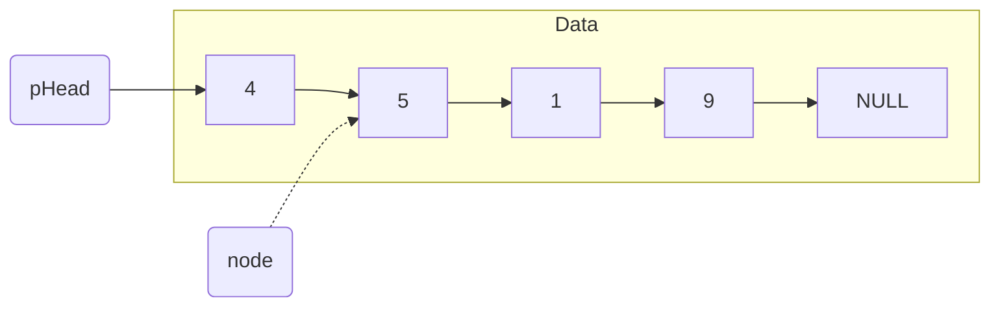
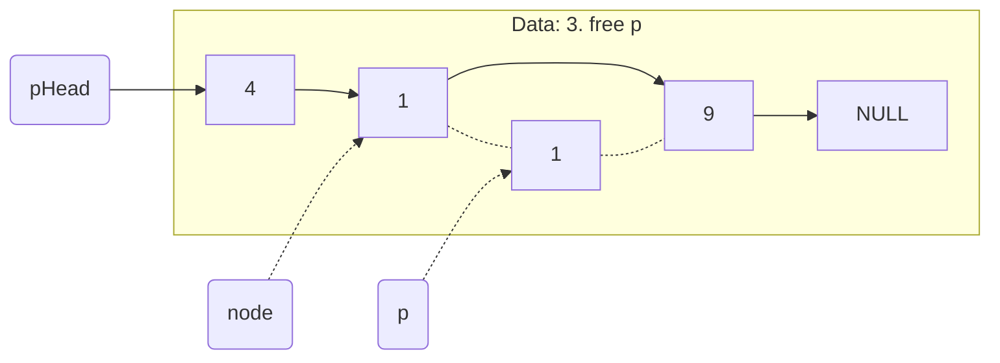
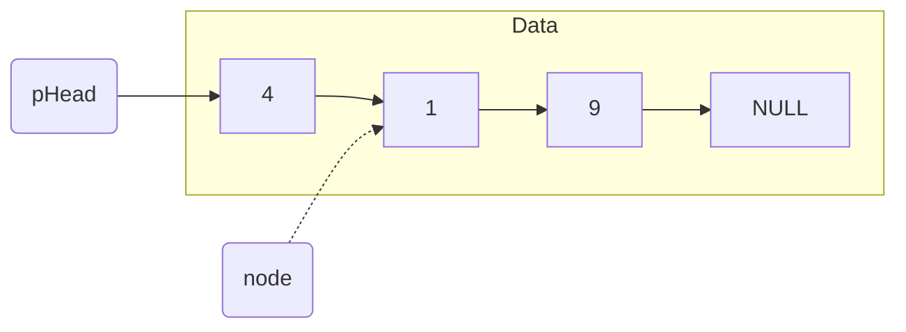

# [Linked List](https://en.wikipedia.org/wiki/Linked_list)

## [2. Add Two Numbers](https://leetcode.com/problems/add-two-numbers/)

- [Official](https://leetcode.com/problems/add-two-numbers/solutions/127833/add-two-numbers/)
- [Official](https://leetcode.cn/problems/add-two-numbers/solutions/435246/liang-shu-xiang-jia-by-leetcode-solution/)

<details><summary>Description</summary>

```text
You are given two non-empty linked lists representing two non-negative integers.
The digits are stored in reverse order, and each of their nodes contains a single digit.
Add the two numbers and return the sum as a linked list.

You may assume the two numbers do not contain any leading zero, except the number 0 itself.

Example 1:
Input: l1 = [2,4,3], l2 = [5,6,4]
Output: [7,0,8]
Explanation: 342 + 465 = 807.

Example 2:
Input: l1 = [0], l2 = [0]
Output: [0]

Example 3:
Input: l1 = [9,9,9,9,9,9,9], l2 = [9,9,9,9]
Output: [8,9,9,9,0,0,0,1]

Constraints:
The number of nodes in each linked list is in the range [1, 100].
0 <= Node.val <= 9
It is guaranteed that the list represents a number that does not have leading zeros.
```

</details>

<details><summary>C</summary>

```c
/**
 * Definition for singly-linked list.
 * struct ListNode {
 *     int val;
 *     struct ListNode *next;
 * };
 */
struct ListNode* addTwoNumbers(struct ListNode* l1, struct ListNode* l2) {
    struct ListNode* pRetVal = NULL;

    pRetVal = (struct ListNode*)malloc(sizeof(struct ListNode));
    if (pRetVal == NULL) {
        perror("malloc");
        return pRetVal;
    }
    pRetVal->val = 0;
    pRetVal->next = NULL;

    struct ListNode* pCurrent = pRetVal;
    int sum;
    int carry = 0;
    while ((l1 != NULL) || (l2 != NULL)) {
        sum = 0;

        if (l1 != NULL) {
            sum += l1->val;
            l1 = l1->next;
        }

        if (l2 != NULL) {
            sum += l2->val;
            l2 = l2->next;
        }

        sum += carry;
        carry = 0;
        if (sum >= 10) {
            sum %= 10;
            carry = 1;
        }

        pCurrent->next = (struct ListNode*)malloc(sizeof(struct ListNode));
        if (pCurrent->next == NULL) {
            perror("malloc");
            return pRetVal;
        }
        pCurrent->next->val = sum;
        pCurrent->next->next = NULL;
        pCurrent = pCurrent->next;
    }

    if (carry == 1) {
        pCurrent->next = (struct ListNode*)malloc(sizeof(struct ListNode));
        if (pCurrent->next == NULL) {
            perror("malloc");
            return pRetVal;
        }
        pCurrent->next->val = carry;
        pCurrent->next->next = NULL;
    }

    pCurrent = pRetVal;
    pRetVal = pRetVal->next;
    free(pCurrent);

    return pRetVal;
}
```

</details>

<details><summary>C++</summary>

```c++
/**
 * Definition for singly-linked list.
 * struct ListNode {
 *     int val;
 *     ListNode *next;
 *     ListNode() : val(0), next(nullptr) {}
 *     ListNode(int x) : val(x), next(nullptr) {}
 *     ListNode(int x, ListNode *next) : val(x), next(next) {}
 * };
 */
class Solution {
   public:
    ListNode* addTwoNumbers(ListNode* l1, ListNode* l2) {
        ListNode* pRetVal = nullptr;

        pRetVal = new ListNode(0);

        ListNode* pCurrent = pRetVal;
        int carry = 0;
        while ((l1 != nullptr) || (l2 != nullptr)) {
            int sum = 0;

            if (l1 != nullptr) {
                sum += l1->val;
                l1 = l1->next;
            }

            if (l2 != nullptr) {
                sum += l2->val;
                l2 = l2->next;
            }

            sum += carry;
            carry = 0;
            if (sum >= 10) {
                sum %= 10;
                carry = 1;
            }

            pCurrent->next = new ListNode(sum);
            pCurrent = pCurrent->next;
        }
        if (carry == 1) {
            pCurrent->next = new ListNode(carry);
            pCurrent = pCurrent->next;
        }

        pCurrent = pRetVal;
        pRetVal = pRetVal->next;
        delete pCurrent;

        return pRetVal;
    }
};
```

</details>

<details><summary>Python3</summary>

```python
# Definition for singly-linked list.
# class ListNode:
#     def __init__(self, val=0, next=None):
#         self.val = val
#         self.next = next
class Solution:
    def addTwoNumbers(self, l1: Optional[ListNode], l2: Optional[ListNode]) -> Optional[ListNode]:
        retVal = ListNode(0)

        node = retVal
        carry = 0
        while ((l1 != None) or (l2 != None)):
            sum = 0

            if l1 != None:
                sum += l1.val
                l1 = l1.next

            if l2 != None:
                sum += l2.val
                l2 = l2.next

            sum += carry
            carry = 0
            if sum >= 10:
                sum = sum % 10
                carry = 1

            node.next = ListNode(sum)
            node = node.next

        if carry == 1:
            node.next = ListNode(carry)
            node = node.next
            carry = 0

        retVal = retVal.next

        return retVal
```

</details>

## [19. Remove Nth Node From End of List](https://leetcode.com/problems/remove-nth-node-from-end-of-list/)

- [Official](https://leetcode.cn/problems/remove-nth-node-from-end-of-list/solutions/450350/shan-chu-lian-biao-de-dao-shu-di-nge-jie-dian-b-61/)

<details><summary>Description</summary>

```text
Given the head of a linked list, remove the nth node from the end of the list and return its head.

Example 1:
Input: head = [1,2,3,4,5], n = 2
Output: [1,2,3,5]

Example 2:
Input: head = [1], n = 1
Output: []

Example 3:
Input: head = [1,2], n = 1
Output: [1]

Constraints:
The number of nodes in the list is sz.
1 <= sz <= 30
0 <= Node.val <= 100
1 <= n <= sz

Follow up: Could you do this in one pass?
```

<details><summary>Hint</summary>

```text
1. Maintain two pointers and update one with a delay of n steps.
```

</details>

</details>

<details><summary>C</summary>

```c
/**
 * Definition for singly-linked list.
 * struct ListNode {
 *     int val;
 *     struct ListNode *next;
 * };
 */
struct ListNode* removeNthFromEnd(struct ListNode* head, int n) {
    struct ListNode* pRetVal = head;

    struct ListNode* pRemove = head;
    struct ListNode* pCurrent = head;
    for (int i = 0; i < n; ++i) {
        if (pCurrent == NULL) {
            break;
        }
        pCurrent = pCurrent->next;
    }
    if (pCurrent == NULL) {
        pRetVal = pRemove->next;
        free(pRemove);
        pRemove = NULL;
        return pRetVal;
    }

    while (pCurrent->next != NULL) {
        pRemove = pRemove->next;
        pCurrent = pCurrent->next;
    }
    pCurrent = pRemove;
    pRemove = pRemove->next;
    pCurrent->next = pRemove->next;
    free(pRemove);
    pRemove = NULL;

    return pRetVal;
}
```

</details>

<details><summary>C++</summary>

```c++
/**
 * Definition for singly-linked list.
 * struct ListNode {
 *     int val;
 *     ListNode *next;
 *     ListNode() : val(0), next(nullptr) {}
 *     ListNode(int x) : val(x), next(nullptr) {}
 *     ListNode(int x, ListNode *next) : val(x), next(next) {}
 * };
 */
class Solution {
   public:
    ListNode* removeNthFromEnd(ListNode* head, int n) {
        ListNode* pRetVal = head;

        ListNode* pRemove = head;
        ListNode* pCurrent = head;
        for (int i = 0; i < n; ++i) {
            if (pCurrent == nullptr) {
                break;
            }
            pCurrent = pCurrent->next;
        }
        if (pCurrent == nullptr) {
            pRetVal = pRemove->next;
            delete pRemove;
            pRemove = nullptr;
            return pRetVal;
        }

        while (pCurrent->next != nullptr) {
            pRemove = pRemove->next;
            pCurrent = pCurrent->next;
        }
        pCurrent = pRemove;
        pRemove = pRemove->next;
        pCurrent->next = pRemove->next;
        delete pRemove;
        pRemove = nullptr;

        return pRetVal;
    }
};
```

</details>

<details><summary>Python3</summary>

```python
# Definition for singly-linked list.
# class ListNode:
#     def __init__(self, val=0, next=None):
#         self.val = val
#         self.next = next
class Solution:
    def removeNthFromEnd(self, head: Optional[ListNode], n: int) -> Optional[ListNode]:
        retVal = head

        pRemove = head
        pCurrent = head
        for i in range(n):
            if pCurrent == None:
                break
            pCurrent = pCurrent.next
        if pCurrent == None:
            retVal = pRemove.next
            return retVal

        while pCurrent.next != None:
            pRemove = pRemove.next
            pCurrent = pCurrent.next
        pCurrent = pRemove
        pRemove = pRemove.next
        pCurrent.next = pRemove.next

        return retVal
```

</details>

## [21. Merge Two Sorted Lists](https://leetcode.com/problems/merge-two-sorted-lists/)

- [Official](https://leetcode.cn/problems/merge-two-sorted-lists/solutions/226408/he-bing-liang-ge-you-xu-lian-biao-by-leetcode-solu/)

<details><summary>Description</summary>

```text
You are given the heads of two sorted linked lists list1 and list2.
Merge the two lists in a one sorted list. The list should be made by splicing together the nodes of the first two lists.
Return the head of the merged linked list.

Example 1:
Input: list1 = [1,2,4], list2 = [1,3,4]
Output: [1,1,2,3,4,4]

Example 2:
Input: list1 = [], list2 = []
Output: []

Example 3:
Input: list1 = [], list2 = [0]
Output: [0]

Constraints:
The number of nodes in both lists is in the range [0, 50].
-100 <= Node.val <= 100
Both list1 and list2 are sorted in non-decreasing order.
```

</details>

<details><summary>C</summary>

```c
/**
 * Definition for singly-linked list.
 * struct ListNode {
 *     int val;
 *     struct ListNode *next;
 * };
 */
struct ListNode *mergeTwoLists(struct ListNode *list1, struct ListNode *list2) {
    struct ListNode *pRetVal = NULL;

    struct ListNode *p1 = list1;
    struct ListNode *p2 = list2;
    struct ListNode *pNew = NULL;
    struct ListNode *pCurrent = NULL;
    while ((p1 != NULL) || (p2 != NULL)) {
        pNew = (struct ListNode *)malloc(sizeof(struct ListNode));
        if (pNew == NULL) {
            perror("malloc");
            return NULL;
        }

        if (p1 == NULL) {
            pNew->val = p2->val;
            p2 = p2->next;
        } else if (p2 == NULL) {
            pNew->val = p1->val;
            p1 = p1->next;
        } else {
            if (p1->val <= p2->val) {
                pNew->val = p1->val;
                p1 = p1->next;
            } else {
                pNew->val = p2->val;
                p2 = p2->next;
            }
        }

        if (pRetVal == NULL) {
            pRetVal = pNew;
            pRetVal->next = NULL;
            pCurrent = pRetVal;
        } else {
            pCurrent->next = pNew;
            pCurrent = pNew;
            pCurrent->next = NULL;
        }

        pNew = NULL;
    }

    return pRetVal;
}
```

</details>

<details><summary>C++</summary>

```c++
/**
 * Definition for singly-linked list.
 * struct ListNode {
 *     int val;
 *     ListNode *next;
 *     ListNode() : val(0), next(nullptr) {}
 *     ListNode(int x) : val(x), next(nullptr) {}
 *     ListNode(int x, ListNode *next) : val(x), next(next) {}
 * };
 */
class Solution {
   public:
    ListNode* mergeTwoLists(ListNode* list1, ListNode* list2) {
        ListNode* pRetVal = nullptr;
        pRetVal = new ListNode();

        ListNode* pCurrent = pRetVal;
        ListNode* pNew = nullptr;
        ListNode* pNext1 = list1;
        ListNode* pNext2 = list2;
        while ((pNext1 != nullptr) && (pNext2 != nullptr)) {
            if (pNext1->val < pNext2->val) {
                pNew = new ListNode(pNext1->val);
                pNext1 = pNext1->next;
            } else {
                pNew = new ListNode(pNext2->val);
                pNext2 = pNext2->next;
            }
            pCurrent->next = pNew;
            pCurrent = pCurrent->next;
        }
        while (pNext1 != nullptr) {
            pNew = new ListNode(pNext1->val);
            pNext1 = pNext1->next;
            pCurrent->next = pNew;
            pCurrent = pCurrent->next;
        }
        while (pNext2 != nullptr) {
            pNew = new ListNode(pNext2->val);
            pNext2 = pNext2->next;
            pCurrent->next = pNew;
            pCurrent = pCurrent->next;
        }

        pCurrent = pRetVal;
        pRetVal = pRetVal->next;
        delete pCurrent;

        return pRetVal;
    }
};
```

</details>

<details><summary>Python3</summary>

```python
# Definition for singly-linked list.
# class ListNode:
#     def __init__(self, val=0, next=None):
#         self.val = val
#         self.next = next
class Solution:
    def mergeTwoLists(self, list1: Optional[ListNode], list2: Optional[ListNode]) -> Optional[ListNode]:
        retVal = ListNode(0)

        node = retVal
        while ((list1 != None) or (list2 != None)):
            if list1 == None:
                node.next = ListNode(list2.val)
                list2 = list2.next
            elif list2 == None:
                node.next = ListNode(list1.val)
                list1 = list1.next
            elif list1.val <= list2.val:
                node.next = ListNode(list1.val)
                list1 = list1.next
            elif list1.val > list2.val:
                node.next = ListNode(list2.val)
                list2 = list2.next
            node = node.next

        retVal = retVal.next

        return retVal
```

</details>

## [23. Merge k Sorted Lists](https://leetcode.com/problems/merge-k-sorted-lists/)

- [Official](https://leetcode.cn/problems/merge-k-sorted-lists/solutions/219756/he-bing-kge-pai-xu-lian-biao-by-leetcode-solutio-2/)

<details><summary>Description</summary>

```text
You are given an array of k linked-lists lists, each linked-list is sorted in ascending order.

Merge all the linked-lists into one sorted linked-list and return it.

Example 1:
Input: lists = [[1,4,5],[1,3,4],[2,6]]
Output: [1,1,2,3,4,4,5,6]
Explanation: The linked-lists are:
[
  1->4->5,
  1->3->4,
  2->6
]
merging them into one sorted list:
1->1->2->3->4->4->5->6

Example 2:
Input: lists = []
Output: []

Example 3:
Input: lists = [[]]
Output: []

Constraints:
k == lists.length
0 <= k <= 10^4
0 <= lists[i].length <= 500
-10^4 <= lists[i][j] <= 10^4
lists[i] is sorted in ascending order.
The sum of lists[i].length will not exceed 10^4.
```

</details>

<details><summary>C</summary>

```c
int mergeTwoList(struct ListNode* pList, struct ListNode* qList) {
    struct ListNode* pRetVal = NULL;
    struct ListNode* p = pList;
    struct ListNode* q = qList;

    int idx = 0;
    bool flag = false;
    struct ListNode* pHead = (struct ListNode*)malloc(sizeof(struct ListNode));
    if (pHead == NULL) {
        perror("malloc");
        return idx;
    }
    pHead->val = 0;
    pHead->next = NULL;
    pRetVal = pHead;

    while ((p != NULL) || (q != NULL)) {
        if (p == NULL) {
            if (flag == false) {
                idx = 1;
                flag = true;
            }
            pHead->next = q;
            q = q->next;
            pHead = pHead->next;
        } else if (q == NULL) {
            if (flag == false) {
                idx = 0;
                flag = true;
            }
            pHead->next = p;
            p = p->next;
            pHead = pHead->next;
        } else if (p->val <= q->val) {
            if (flag == false) {
                idx = 0;
                flag = true;
            }
            pHead->next = p;
            p = p->next;
            pHead = pHead->next;
        } else if (p->val > q->val) {
            if (flag == false) {
                idx = 1;
                flag = true;
            }
            pHead->next = q;
            q = q->next;
            pHead = pHead->next;
        }
    }
    pHead = pRetVal;
    pRetVal = pHead->next;
    pHead->next = NULL;
    free(pHead);
    pHead = NULL;

    return idx;
}
/**
 * Definition for singly-linked list.
 * struct ListNode {
 *     int val;
 *     struct ListNode *next;
 * };
 */
struct ListNode* mergeKLists(struct ListNode** lists, int listsSize) {
    struct ListNode* pRetVal = NULL;

    if (listsSize == 0) {
        return pRetVal;
    }

    int ret = 0;
    struct ListNode* p = NULL;
    struct ListNode* q = NULL;
    int i;
    while (listsSize > 1) {
        for (i = 0; i < listsSize; i += 2) {
            p = lists[i];
            if (i + 1 >= listsSize) {
                lists[i / 2] = lists[i];
                break;
            }
            q = lists[i + 1];

            ret = mergeTwoList(p, q);
            lists[i / 2] = lists[i + ret];
        }
        listsSize = (listsSize % 2 == 1) ? (listsSize / 2 + 1) : listsSize / 2;
    }
    pRetVal = lists[0];

    return pRetVal;
}
```

</details>

<details><summary>C++</summary>

```c++
/**
 * Definition for singly-linked list.
 * struct ListNode {
 *     int val;
 *     ListNode *next;
 *     ListNode() : val(0), next(nullptr) {}
 *     ListNode(int x) : val(x), next(nullptr) {}
 *     ListNode(int x, ListNode *next) : val(x), next(next) {}
 * };
 */
class Solution {
   public:
    ListNode* mergeTwoLists(ListNode* list1, ListNode* list2) {
        ListNode* pRetVal = nullptr;

        if (list2 == nullptr) {
            pRetVal = list1;
            return pRetVal;
        }
        ListNode* pHead = new ListNode();
        pRetVal = pHead;

        ListNode* p1 = list1;
        ListNode* p2 = list2;
        while ((p1 != nullptr) && (p2 != nullptr)) {
            if (p1->val <= p2->val) {
                pRetVal->next = p1;
                p1 = p1->next;
            } else {
                pRetVal->next = p2;
                p2 = p2->next;
            }
            pRetVal = pRetVal->next;
        }
        pRetVal->next = (p1 != nullptr) ? p1 : p2;

        pRetVal = pHead->next;
        delete pHead;

        return pRetVal;
    }
    ListNode* mergeKLists(vector<ListNode*>& lists) {
        ListNode* pRetVal = nullptr;

        int listsSize = lists.size();
        if (listsSize == 0) {
            return pRetVal;
        }

        int interval = 1;
        while (interval < listsSize) {
            for (int i = 0; i < listsSize; i += (interval * 2)) {
                if (i + interval < listsSize) {
                    lists[i] = mergeTwoLists(lists[i], lists[i + interval]);
                }
            }
            interval *= 2;
        }
        pRetVal = lists[0];

        return pRetVal;
    }
};
```

</details>

<details><summary>Python3</summary>

```python
# Definition for singly-linked list.
# class ListNode:
#     def __init__(self, val=0, next=None):
#         self.val = val
#         self.next = next
class Solution:
    def mergeKLists(self, lists: List[Optional[ListNode]]) -> Optional[ListNode]:
        retVal = ListNode(0)

        nums = []
        heapify(nums)
        for l in lists:
            while l is not None:
                heappush(nums, l.val)
                l = l.next

        node = retVal
        while len(nums) > 0:
            node.next = ListNode(nums[0])
            node = node.next
            heappop(nums)

        retVal = retVal.next

        return retVal
```

</details>

## [24. Swap Nodes in Pairs](https://leetcode.com/problems/swap-nodes-in-pairs/)

- [Official](https://leetcode.cn/problems/swap-nodes-in-pairs/solutions/444474/liang-liang-jiao-huan-lian-biao-zhong-de-jie-di-91/)

<details><summary>Description</summary>

```text
Given a linked list, swap every two adjacent nodes and return its head.
You must solve the problem without modifying the values in the list's nodes (i.e., only nodes themselves may be changed.)

Example 1:
Input: head = [1,2,3,4]
Output: [2,1,4,3]

Example 2:
Input: head = []
Output: []

Example 3:
Input: head = [1]
Output: [1]

Constraints:
The number of nodes in the list is in the range [0, 100].
0 <= Node.val <= 100
```

</details>

<details><summary>C</summary>

```c
/**
 * Definition for singly-linked list.
 * struct ListNode {
 *     int val;
 *     struct ListNode *next;
 * };
 */
struct ListNode* swapPairs(struct ListNode* head) {
    struct ListNode* pRetVal = head;

    if ((pRetVal == NULL) || (pRetVal->next == NULL)) {
        return pRetVal;
    }

    pRetVal = head->next;
    struct ListNode* p1 = head;
    struct ListNode* p2 = head->next;
    struct ListNode* pPrevious = NULL;
    while (p2 != NULL) {
        if (pPrevious != NULL) {
            pPrevious->next = p2;
        }
        p1->next = p2->next;
        p2->next = p1;

        pPrevious = p1;
        p1 = p1->next;
        if (p1 == NULL) {
            break;
        }
        p2 = p1->next;
    }

    return pRetVal;
}
```

</details>

<details><summary>C++</summary>

```c++
/**
 * Definition for singly-linked list.
 * struct ListNode {
 *     int val;
 *     ListNode *next;
 *     ListNode() : val(0), next(nullptr) {}
 *     ListNode(int x) : val(x), next(nullptr) {}
 *     ListNode(int x, ListNode *next) : val(x), next(next) {}
 * };
 */
class Solution {
   public:
    ListNode *swapPairs(ListNode *head) {
        ListNode *pRetVal = head;

        if ((pRetVal == NULL) || (pRetVal->next == NULL)) {
            return pRetVal;
        }

        pRetVal = head->next;
        ListNode *p1 = head;
        ListNode *p2 = head->next;
        ListNode *pPrevious = NULL;
        while (p2 != NULL) {
            if (pPrevious != NULL) {
                pPrevious->next = p2;
            }
            p1->next = p2->next;
            p2->next = p1;

            pPrevious = p1;
            p1 = p1->next;
            if (p1 == NULL) {
                break;
            }
            p2 = p1->next;
        }

        return pRetVal;
    }
};
```

</details>

<details><summary>Python3</summary>

```python
# Definition for singly-linked list.
# class ListNode:
#     def __init__(self, val=0, next=None):
#         self.val = val
#         self.next = next
class Solution:
    def swapPairs(self, head: Optional[ListNode]) -> Optional[ListNode]:
        retVal = head

        if retVal == None or retVal.next == None:
            return retVal

        retVal = head.next
        p1 = head
        p2 = head.next
        pPrevious = None
        while p2 != None:
            if pPrevious != None:
                pPrevious.next = p2
            p1.next = p2.next
            p2.next = p1

            pPrevious = p1
            p1 = p1.next
            if p1 == None:
                break

            p2 = p1.next

        return retVal
```

</details>

## [61. Rotate List](https://leetcode.com/problems/rotate-list/)

- [Official](https://leetcode.cn/problems/rotate-list/solutions/681812/xuan-zhuan-lian-biao-by-leetcode-solutio-woq1/)

<details><summary>Description</summary>

```text
Given the head of a linked list, rotate the list to the right by k places.

Example 1:
            (1)->(2)->(3)->(4)->(5)
rotate 1    (5)->(1)->(2)->(3)->(4)
rotate 2    (4)->(5)->(1)->(2)->(3)
Input: head = [1,2,3,4,5], k = 2
Output: [4,5,1,2,3]

Example 2:
            (0)->(1)->(2)
rotate 1    (2)->(0)->(1)
rotate 2    (1)->(2)->(0)
rotate 3    (0)->(1)->(2)
rotate 4    (2)->(0)->(1)
Input: head = [0,1,2], k = 4
Output: [2,0,1]

Constraints:
The number of nodes in the list is in the range [0, 500].
-100 <= Node.val <= 100
0 <= k <= 2 * 10^9
```

</details>

<details><summary>C</summary>

```c
/**
 * Definition for singly-linked list.
 * struct ListNode {
 *     int val;
 *     struct ListNode *next;
 * };
 */
struct ListNode* rotateRight(struct ListNode* head, int k) {
    struct ListNode* pRetVal = head;

    if ((pRetVal == NULL) || (pRetVal->next == NULL)) {
        return pRetVal;
    }

    struct ListNode* pCurrent = head;
    int headSize = 0;
    while (pCurrent->next != NULL) {
        ++headSize;
        pCurrent = pCurrent->next;
    }
    k = headSize - (k % (headSize + 1));

    pCurrent->next = head;
    while (k--) {
        head = head->next;
    }
    pCurrent = head;
    head = head->next;
    pCurrent->next = NULL;
    pRetVal = head;

    return pRetVal;
}
```

</details>

<details><summary>C++</summary>

```c++
/**
 * Definition for singly-linked list.
 * struct ListNode {
 *     int val;
 *     ListNode *next;
 *     ListNode() : val(0), next(nullptr) {}
 *     ListNode(int x) : val(x), next(nullptr) {}
 *     ListNode(int x, ListNode *next) : val(x), next(next) {}
 * };
 */
class Solution {
   public:
    ListNode* rotateRight(ListNode* head, int k) {
        ListNode* pRetVal = head;

        if ((pRetVal == nullptr) || (pRetVal->next == nullptr)) {
            return pRetVal;
        }

        ListNode* pCurrent = head;
        int headSize = 0;
        while (pCurrent->next != nullptr) {
            ++headSize;
            pCurrent = pCurrent->next;
        }
        k = headSize - (k % (headSize + 1));

        pCurrent->next = head;
        while (k--) {
            head = head->next;
        }
        pCurrent = head;
        head = head->next;
        pCurrent->next = nullptr;
        pRetVal = head;

        return pRetVal;
    }
};
```

</details>

<details><summary>Python3</summary>

```python
# Definition for singly-linked list.
# class ListNode:
#     def __init__(self, val=0, next=None):
#         self.val = val
#         self.next = next
class Solution:
    def rotateRight(self, head: Optional[ListNode], k: int) -> Optional[ListNode]:
        retVal = head

        if (retVal is None) or (retVal.next is None):
            return retVal

        pCurrent = head
        headSize = 0
        while pCurrent.next != None:
            headSize += 1
            pCurrent = pCurrent.next
        k = headSize - (k % (headSize + 1))

        pCurrent.next = head
        while (k > 0):
            head = head.next
            k -= 1
        pCurrent = head
        head = head.next
        pCurrent.next = None
        retVal = head

        return retVal
```

</details>

## [82. Remove Duplicates from Sorted List II](https://leetcode.com/problems/remove-duplicates-from-sorted-list-ii/)

- [Official](https://leetcode.cn/problems/remove-duplicates-from-sorted-list-ii/solutions/678122/shan-chu-pai-xu-lian-biao-zhong-de-zhong-oayn/)

<details><summary>Description</summary>

```text
Given the head of a sorted linked list, delete all nodes that have duplicate numbers,
leaving only distinct numbers from the original list.
Return the linked list sorted as well.

Example 1:
(1)->(2)->(3)->(3)->(4)->(4)->(5) => (1)->(2)->(5)
Input: head = [1,2,3,3,4,4,5]
Output: [1,2,5]

Example 2:
(1)->(1)->(1)->(2)->(3) => (2)->(3)
Input: head = [1,1,1,2,3]
Output: [2,3]

Constraints:
The number of nodes in the list is in the range [0, 300].
-100 <= Node.val <= 100
The list is guaranteed to be sorted in ascending order.
```

</details>

<details><summary>C</summary>

```c
/**
 * Definition for singly-linked list.
 * struct ListNode {
 *     int val;
 *     struct ListNode *next;
 * };
 */
struct ListNode* deleteDuplicates(struct ListNode* head) {
    struct ListNode* pRetVal = NULL;

    pRetVal = (struct ListNode*)malloc(sizeof(struct ListNode));
    if (pRetVal == NULL) {
        perror("malloc");
        pRetVal = head;
        return pRetVal;
    }
    pRetVal->next = head;

    bool duplicate;
    int duplicateVal;
    struct ListNode* pFree = NULL;
    struct ListNode* pPrevious = pRetVal;
    struct ListNode* pCurrent = head;
    while (pCurrent != NULL) {
        duplicate = false;
        if ((pCurrent != NULL) && (pCurrent->next != NULL)) {
            if (pCurrent->next->val == pCurrent->val) {
                duplicate = true;
            }
        }

        if (duplicate == true) {
            duplicateVal = pCurrent->val;
            while ((pCurrent != NULL) && (pCurrent->val == duplicateVal)) {
                pFree = pCurrent;
                pCurrent = pCurrent->next;
                free(pFree);
                pFree = NULL;
            }
            pPrevious->next = pCurrent;
        } else {
            pPrevious = pCurrent;
            if (pCurrent != NULL) {
                pCurrent = pCurrent->next;
            }
        }
    }
    pFree = pRetVal;
    pRetVal = pRetVal->next;
    free(pFree);
    pFree = NULL;

    return pRetVal;
}
```

</details>

<details><summary>C++</summary>

```c++
/**
 * Definition for singly-linked list.
 * struct ListNode {
 *     int val;
 *     ListNode *next;
 *     ListNode() : val(0), next(nullptr) {}
 *     ListNode(int x) : val(x), next(nullptr) {}
 *     ListNode(int x, ListNode *next) : val(x), next(next) {}
 * };
 */
class Solution {
   public:
    ListNode* deleteDuplicates(ListNode* head) {
        ListNode* pRetVal = nullptr;

        pRetVal = new ListNode(0);
        if (pRetVal == nullptr) {
            perror("malloc");
            pRetVal = head;
            return pRetVal;
        }
        pRetVal->next = head;

        ListNode* pPrevious = pRetVal;
        ListNode* pCurrent = head;
        while (pCurrent != nullptr) {
            bool duplicate = false;
            if ((pCurrent != nullptr) && (pCurrent->next != nullptr)) {
                if (pCurrent->next->val == pCurrent->val) {
                    duplicate = true;
                }
            }

            if (duplicate == true) {
                int duplicateVal = pCurrent->val;
                while ((pCurrent != nullptr) && (pCurrent->val == duplicateVal)) {
                    ListNode* pDelete = pCurrent;
                    pCurrent = pCurrent->next;
                    delete pDelete;
                }
                pPrevious->next = pCurrent;
            } else {
                pPrevious = pCurrent;
                if (pCurrent != nullptr) {
                    pCurrent = pCurrent->next;
                }
            }
        }
        ListNode* pDelete = pRetVal;
        pRetVal = pRetVal->next;
        delete pDelete;

        return pRetVal;
    }
};
```

</details>

<details><summary>Python3</summary>

```python
# Definition for singly-linked list.
# class ListNode:
#     def __init__(self, val=0, next=None):
#         self.val = val
#         self.next = next
class Solution:
    def deleteDuplicates(self, head: Optional[ListNode]) -> Optional[ListNode]:
        retVal = head

        if head is None:
            return retVal

        retVal = ListNode(0, head)

        current = retVal
        while current.next and current.next.next:
            if current.next.val == current.next.next.val:
                duplicateVal = current.next.val
                while current.next and current.next.val == duplicateVal:
                    current.next = current.next.next
            else:
                current = current.next

        retVal = retVal.next

        return retVal
```

</details>

## [83. Remove Duplicates from Sorted List](https://leetcode.com/problems/remove-duplicates-from-sorted-list/)

- [Official](https://leetcode.cn/problems/remove-duplicates-from-sorted-list/solutions/680357/shan-chu-pai-xu-lian-biao-zhong-de-zhong-49v5/)

<details><summary>Description</summary>

```text
Given the head of a sorted linked list, delete all duplicates such that each element appears only once.
Return the linked list sorted as well.

Example 1:
Input: head = [1,1,2]
Output: [1,2]

Example 2:
Input: head = [1,1,2,3,3]
Output: [1,2,3]

Constraints:
The number of nodes in the list is in the range [0, 300].
-100 <= Node.val <= 100
The list is guaranteed to be sorted in ascending order.
```

</details>

<details><summary>C</summary>

```c
/**
 * Definition for singly-linked list.
 * struct ListNode {
 *     int val;
 *     struct ListNode *next;
 * };
 */
struct ListNode* deleteDuplicates(struct ListNode* head) {
    struct ListNode* pRetVal = head;

    if ((head == NULL) || (head->next == NULL)) {
        return pRetVal;
    }

    struct ListNode* pCurrent = head->next;
    struct ListNode* pPrevious = head;
    while (pCurrent != NULL) {
        if (pCurrent->val == pPrevious->val) {
            pPrevious->next = pCurrent->next;
            free(pCurrent);
            pCurrent = pPrevious->next;
        } else {
            pPrevious = pCurrent;
            pCurrent = pCurrent->next;
        }
    }

    return pRetVal;
}
```

</details>

<details><summary>C++</summary>

```c++
/**
 * Definition for singly-linked list.
 * struct ListNode {
 *     int val;
 *     ListNode *next;
 *     ListNode() : val(0), next(nullptr) {}
 *     ListNode(int x) : val(x), next(nullptr) {}
 *     ListNode(int x, ListNode *next) : val(x), next(next) {}
 * };
 */
class Solution {
   public:
    ListNode* deleteDuplicates(ListNode* head) {
        ListNode* pRetVal = head;

        if ((head == nullptr) || (head->next == nullptr)) {
            return pRetVal;
        }

        ListNode* pCurrent = head->next;
        ListNode* pPrevious = head;
        while (pCurrent != nullptr) {
            if (pCurrent->val == pPrevious->val) {
                pPrevious->next = pCurrent->next;
                delete pCurrent;
                pCurrent = pPrevious->next;
            } else {
                pPrevious = pCurrent;
                pCurrent = pCurrent->next;
            }
        }

        return pRetVal;
    }
};
```

</details>

<details><summary>Python3</summary>

```python
# Definition for singly-linked list.
# class ListNode:
#     def __init__(self, val=0, next=None):
#         self.val = val
#         self.next = next
class Solution:
    def deleteDuplicates(self, head: Optional[ListNode]) -> Optional[ListNode]:
        retVal = head

        if (head is None) or (head.next is None):
            return retVal

        pCurrent = head.next
        pPrevious = head
        while pCurrent is not None:
            if pCurrent.val == pPrevious.val:
                pPrevious.next = pCurrent.next
                pCurrent = pPrevious.next
            else:
                pPrevious = pCurrent
                pCurrent = pCurrent.next

        return retVal
```

</details>

## [86. Partition List](https://leetcode.com/problems/partition-list/)

- [Official](https://leetcode.cn/problems/partition-list/solutions/543768/fen-ge-lian-biao-by-leetcode-solution-7ade/)

<details><summary>Description</summary>

```text
Given the head of a linked list and a value x,
partition it such that all nodes less than x come before nodes greater than or equal to x.

You should preserve the original relative order of the nodes in each of the two partitions.

Example 1:
Input: head = [1,4,3,2,5,2], x = 3
Output: [1,2,2,4,3,5]

Example 2:
Input: head = [2,1], x = 2
Output: [1,2]

Constraints:
The number of nodes in the list is in the range [0, 200].
-100 <= Node.val <= 100
-200 <= x <= 200
```

</details>

<details><summary>C</summary>

```c
/**
 * Definition for singly-linked list.
 * struct ListNode {
 *     int val;
 *     struct ListNode *next;
 * };
 */
struct ListNode* partition(struct ListNode* head, int x) {
    struct ListNode* pRetVal = head;

    if (head == NULL) {
        return pRetVal;
    }

    struct ListNode* pLessHead = (struct ListNode*)malloc(sizeof(struct ListNode));
    if (pLessHead == NULL) {
        perror("malloc");
        return pRetVal;
    }
    pLessHead->next = NULL;
    struct ListNode* pLess = pLessHead;
    struct ListNode* pGreatHead = (struct ListNode*)malloc(sizeof(struct ListNode));
    if (pGreatHead == NULL) {
        perror("malloc");
        return pRetVal;
    }
    pGreatHead->next = NULL;
    struct ListNode* pGreat = pGreatHead;

    while (pRetVal != NULL) {
        if (pRetVal->val < x) {
            pLess->next = pRetVal;
            pLess = pLess->next;
        } else {
            pGreat->next = pRetVal;
            pGreat = pGreat->next;
        }
        pRetVal = pRetVal->next;
    }
    pLess->next = pGreatHead->next;
    pGreat->next = NULL;
    pRetVal = pLessHead->next;

    free(pLessHead);
    free(pGreatHead);

    return pRetVal;
}
```

</details>

<details><summary>C++</summary>

```c++
/**
 * Definition for singly-linked list.
 * struct ListNode {
 *     int val;
 *     ListNode *next;
 *     ListNode() : val(0), next(nullptr) {}
 *     ListNode(int x) : val(x), next(nullptr) {}
 *     ListNode(int x, ListNode *next) : val(x), next(next) {}
 * };
 */
class Solution {
   public:
    ListNode* partition(ListNode* head, int x) {
        ListNode* pRetVal = head;

        if (head == nullptr) {
            return pRetVal;
        }

        ListNode* pLessHead = new ListNode();
        ListNode* pLess = pLessHead;
        ListNode* pGreatHead = new ListNode();
        ListNode* pGreat = pGreatHead;
        while (pRetVal != nullptr) {
            if (pRetVal->val < x) {
                pLess->next = pRetVal;
                pLess = pLess->next;
            } else {
                pGreat->next = pRetVal;
                pGreat = pGreat->next;
            }
            pRetVal = pRetVal->next;
        }
        pLess->next = pGreatHead->next;
        pGreat->next = nullptr;
        pRetVal = pLessHead->next;

        delete pLessHead;
        delete pGreatHead;

        return pRetVal;
    }
};
```

</details>

<details><summary>Python3</summary>

```python
# Definition for singly-linked list.
# class ListNode:
#     def __init__(self, val=0, next=None):
#         self.val = val
#         self.next = next
class Solution:
    def partition(self, head: Optional[ListNode], x: int) -> Optional[ListNode]:
        retVal = head

        if head == None:
            return retVal

        pLessHead = ListNode()
        pLess = pLessHead
        pGreatHead = ListNode()
        pGreat = pGreatHead
        while retVal != None:
            if retVal.val < x:
                pLess.next = retVal
                pLess = pLess.next
            else:
                pGreat.next = retVal
                pGreat = pGreat.next
            retVal = retVal.next
        pLess.next = pGreatHead.next
        pGreat.next = None
        retVal = pLessHead.next

        return retVal
```

</details>

## [92. Reverse Linked List II](https://leetcode.com/problems/reverse-linked-list-ii/)

- [Official](https://leetcode.com/problems/reverse-linked-list-ii/editorial/)
- [Official](https://leetcode.cn/problems/reverse-linked-list-ii/solutions/634701/fan-zhuan-lian-biao-ii-by-leetcode-solut-teyq/)

<details><summary>Description</summary>

```text
Given the head of a singly linked list and two integers left and right where left <= right,
reverse the nodes of the list from position left to position right, and return the reversed list.

Example 1:
Input: head = [1,2,3,4,5], left = 2, right = 4
Output: [1,4,3,2,5]

Example 2:
Input: head = [5], left = 1, right = 1
Output: [5]

Constraints:
The number of nodes in the list is n.
1 <= n <= 500
-500 <= Node.val <= 500
1 <= left <= right <= n

Follow up: Could you do it in one pass?
```

</details>

<details><summary>C</summary>

```c
/**
 * Definition for singly-linked list.
 * struct ListNode {
 *     int val;
 *     struct ListNode *next;
 * };
 */
struct ListNode* reverseBetween(struct ListNode* head, int left, int right) {
    struct ListNode* pRetVal = head;

    struct ListNode* pTmp = (struct ListNode*)malloc(sizeof(struct ListNode));
    if (pTmp == NULL) {
        perror("malloc");
        return pRetVal;
    }
    pTmp->val = -1;
    pTmp->next = head;

    int i;

    struct ListNode* pPrevious = pTmp;
    for (i = 0; i < left - 1; ++i) {
        pPrevious = pPrevious->next;
    }

    struct ListNode* pCurrent = pPrevious->next;

    struct ListNode* pNext;
    for (i = left; i < right; ++i) {
        pNext = pCurrent->next;
        pCurrent->next = pNext->next;
        pNext->next = pPrevious->next;
        pPrevious->next = pNext;
    }

    pRetVal = pTmp->next;
    free(pTmp);
    pTmp = NULL;

    return pRetVal;
}
```

</details>

<details><summary>C++</summary>

```c++
/**
 * Definition for singly-linked list.
 * struct ListNode {
 *     int val;
 *     ListNode *next;
 *     ListNode() : val(0), next(nullptr) {}
 *     ListNode(int x) : val(x), next(nullptr) {}
 *     ListNode(int x, ListNode *next) : val(x), next(next) {}
 * };
 */
class Solution {
   public:
    ListNode* reverseBetween(ListNode* head, int left, int right) {
        ListNode* pRetVal = head;

        ListNode* pTmp = new ListNode(-1);
        pTmp->next = head;

        ListNode* pPrevious = pTmp;
        for (int i = 0; i < left - 1; ++i) {
            pPrevious = pPrevious->next;
        }

        ListNode* pCurrent = pPrevious->next;

        ListNode* pNext;
        for (int i = left; i < right; ++i) {
            pNext = pCurrent->next;
            pCurrent->next = pNext->next;
            pNext->next = pPrevious->next;
            pPrevious->next = pNext;
        }

        pRetVal = pTmp->next;
        delete pTmp;

        return pRetVal;
    }
};
```

</details>

<details><summary>Python3</summary>

```python
# Definition for singly-linked list.
# class ListNode:
#     def __init__(self, val=0, next=None):
#         self.val = val
#         self.next = next
class Solution:
    def reverseBetween(self, head: Optional[ListNode], left: int, right: int) -> Optional[ListNode]:
        retVal = head

        pTmp = ListNode(-1)
        pTmp.next = head

        pPrevious = pTmp
        for _ in range(left-1):
            pPrevious = pPrevious.next

        pCurrent = pPrevious.next

        for _ in range(right - left):
            pNext = pCurrent.next
            pCurrent.next = pNext.next
            pNext.next = pPrevious.next
            pPrevious.next = pNext

        retVal = pTmp.next

        return retVal
```

</details>

## [138. Copy List with Random Pointer](https://leetcode.com/problems/copy-list-with-random-pointer)

- [Official](https://leetcode.cn/problems/copy-list-with-random-pointer/solutions/889166/fu-zhi-dai-sui-ji-zhi-zhen-de-lian-biao-rblsf/)

<details><summary>Description</summary>

```text
A linked list of length n is given such that each node contains an additional random pointer,
which could point to any node in the list, or null.

Construct a deep copy of the list. The deep copy should consist of exactly n brand new nodes,
where each new node has its value set to the value of its corresponding original node.
Both the next and random pointer of the new nodes should point to new nodes in the copied list
such that the pointers in the original list and copied list represent the same list state.
None of the pointers in the new list should point to nodes in the original list.

For example, if there are two nodes X and Y in the original list, where X.random --> Y,
then for the corresponding two nodes x and y in the copied list, x.random --> y.

Return the head of the copied linked list.

The linked list is represented in the input/output as a list of n nodes.
Each node is represented as a pair of [val, random_index] where:

val: an integer representing Node.val
random_index: the index of the node (range from 0 to n-1) that the random pointer points to,
or null if it does not point to any node.
Your code will only be given the head of the original linked list.

Example 1:
+-----------------------------------------------------------------------------------------------------------+
|  +---------------+  +----------------+  +----------------+  +----------------+  +---------------+         |
|  | 7 | v | next --->| 13 | v | next --->| 11 | v | next --->| 10 | v | next --->| 1 | v | next ---> NULL  |
|  +-----|---------+  +------|---------+  +------|---------+  +------|---------+  +-----|---------+    ^    |
|    ^   |                   |               ^   |                   |              ^   |              |    |
|    |   +-------------------|---------------|---|-------------------|--------------|---|--------------+    |
|    +-----------------------+               |   +-------------------|--------------+   |                   |
|    |                                       +-----------------------+                  |                   |
|    +----------------------------------------------------------------------------------+                   |
+-----------------------------------------------------------------------------------------------------------+
Input: head = [[7,null],[13,0],[11,4],[10,2],[1,0]]
Output: [[7,null],[13,0],[11,4],[10,2],[1,0]]

Example 2:
Input: head = [[1,1],[2,1]]
Output: [[1,1],[2,1]]

Example 3:
Input: head = [[3,null],[3,0],[3,null]]
Output: [[3,null],[3,0],[3,null]]

Constraints:
0 <= n <= 1000
-10^4 <= Node.val <= 10^4
Node.random is null or is pointing to some node in the linked list.
```

<details><summary>Hint</summary>

```text
1. Just iterate the linked list and create copies of the nodes on the go.
   Since a node can be referenced from multiple nodes due to the random pointers,
   ensure you are not making multiple copies of the same node.
2. You may want to use extra space to keep old_node ---> new_node mapping
   to prevent creating multiple copies of the same node.
3. We can avoid using extra space for old_node ---> new_node mapping by tweaking the original linked list.
   Simply interweave the nodes of the old and copied list.
   For example: Old List: A --> B --> C --> D InterWeaved List: A --> A' --> B --> B' --> C --> C' --> D --> D'
4. The interweaving is done using next pointers and
   we can make use of interweaved structure to get the correct reference nodes for random pointers.
```

</details>

</details>

<details><summary>C</summary>

```c
/**
 * Definition for a Node.
 * struct Node {
 *     int val;
 *     struct Node *next;
 *     struct Node *random;
 * };
 */
struct Node* copyRandomList(struct Node* head) {
    struct Node* pRetVal = NULL;

    if (head == NULL) {
        return pRetVal;
    }

    /* Input: head = [[7,null],[13,0],[11,4],[10,2],[1,0]]
     *  head
     *  +---------------+  +----------------+  +----------------+  +----------------+  +---------------+
     *  | 7 | v | next --->| 13 | v | next --->| 11 | v | next --->| 10 | v | next --->| 1 | v | next ---> NULL
     *  +-----|---------+  +------|---------+  +------|---------+  +------|---------+  +-----|---------+    ^
     *    ^   |                   |               ^   |                   |              ^   |              |
     *    |   +-------------------|---------------|---|-------------------|--------------|---|--------------+
     *    +-----------------------+               |   +-------------------|--------------+   |
     *    |                                       +-----------------------+                  |
     *    +----------------------------------------------------------------------------------+
     */
    struct Node* pCurrent = NULL;
    struct Node* pNew = NULL;

    /* create new Node that new->val = ori->val and new->next = ori->next, ori->next = new.
     *
     *           +----------------+  +----------------+  +----------------+  +----------------+  +---------------+
     *           | 7 |   | next   |  | 13 |   | next  |  | 11 |   | next  |  | 10 |   | next  |  | 1 |   | next --> NULL
     *           +-^---------|----+  +-^----------|---+  +-^----------|---+  +-^----------|---+  +-^-------------+
     *             |         |         |         |         |         |         |         |         |
     *  +----------|----+  +-v---------|----+  +-v---------|----+  +-v---------|----+  +-v---------|---+
     *  | 7 | v | next  |  | 13 | v | next  |  | 11 | v | next  |  | 10 | v | next  |  | 1 | v | next  |   NULL
     *  +-----|---------+  +------|---------+  +------|---------+  +------|---------+  +-----|---------+    ^
     *    ^   |                   |               ^   |                   |              ^   |              |
     *    |   +-------------------|---------------|---|-------------------|--------------|---|--------------+
     *    +-----------------------+               |   +-------------------|--------------+   |
     *    |                                       +-----------------------+                  |
     *    +----------------------------------------------------------------------------------+
     */
    for (pCurrent = head; pCurrent != NULL; pCurrent = pCurrent->next->next) {
        pNew = (struct Node*)malloc(sizeof(struct Node));
        if (pNew == NULL) {
            perror("malloc");
            return pRetVal;
        }
        pNew->val = pCurrent->val;
        pNew->next = pCurrent->next;
        pCurrent->next = pNew;
    }

    /* link new->random = ori->random->next
     *
     *             +-----------------------------------------------------------------------------------+
     *             |                                       +------------------------+                  |
     *             +------------------------+              |    +-------------------|--------------+   |
     *             |   +--------------------|--------------|----|-------------------|--------------|---|-------------+
     *           +-v---|----------+  +------|---------+  +-v----|---------+  +------|---------+  +-v---|---------+   v
     *  copyNew  | 7 | ^ | next   |  | 13 | ^ | next  |  | 11 | ^ | next  |  | 10 | ^ | next  |  | 1 | ^ | next --> NULL
     *           +-^---------|----+  +-^----------|---+  +-^----------|---+  +-^----------|---+  +-^-------------+
     *  head       |         |         |         |         |         |         |         |         |
     *  +----------|----+  +-v---------|----+  +-v---------|----+  +-v---------|----+  +-v---------|---+
     *  | 7 | v | next  |  | 13 | v | next  |  | 11 | v | next  |  | 10 | v | next  |  | 1 | v | next  |   NULL
     *  +-----|---------+  +------|---------+  +------|---------+  +------|---------+  +-----|---------+    ^
     *    ^   |                   |               ^   |                   |              ^   |              |
     *    |   +-------------------|---------------|---|-------------------|--------------|---|--------------+
     *    +-----------------------+               |   +-------------------|--------------+   |
     *    |                                       +-----------------------+                  |
     *    +----------------------------------------------------------------------------------+
     */
    for (pCurrent = head; pCurrent != NULL; pCurrent = pCurrent->next->next) {
        pNew = pCurrent->next;
        pNew->random = ((pCurrent->random != NULL) ? (pCurrent->random->next) : (NULL));
    }

    /* recovery new->next and ori->next
     *
     *             +----------------------------------------------------------------------------------+
     *             |                                      +------------------------+                  |
     *             +-----------------------+              |    +-------------------|--------------+   |
     *             |   +-------------------|--------------|----|-------------------|--------------|---|-------------+
     *           +-v---|----------+ +------|---------+  +-v----|---------+  +------|---------+  +-v---|---------+   v
     *  copyNew  | 7 | ^ | next --->| 13 | ^ | next --->| 11 | ^ | next --->| 10 | ^ | next --->| 1 | ^ | next --> NULL
     *           +----------------+ +----------------+  +----------------+  +----------------+  +---------------+
     *  head
     *  +---------------+  +----------------+  +----------------+  +----------------+  +---------------+
     *  | 7 | v | next --->| 13 | v | next --->| 11 | v | next --->| 10 | v | next --->| 1 | v | next --->NULL
     *  +-----|---------+  +------|---------+  +------|---------+  +------|---------+  +-----|---------+    ^
     *    ^   |                   |               ^   |                   |              ^   |              |
     *    |   +-------------------|---------------|---|-------------------|--------------|---|--------------+
     *    +-----------------------+               |   +-------------------|--------------+   |
     *    |                                       +-----------------------+                  |
     *    +----------------------------------------------------------------------------------+
     */
    pRetVal = head->next;
    for (pCurrent = head; pCurrent != NULL; pCurrent = pCurrent->next) {
        pNew = pCurrent->next;
        pCurrent->next = pCurrent->next->next;
        pNew->next = ((pNew->next != NULL) ? (pNew->next->next) : (NULL));
    }

    return pRetVal;
}
```

</details>

<details><summary>C++</summary>

```c++
/*
// Definition for a Node.
class Node {
public:
    int val;
    Node* next;
    Node* random;

    Node(int _val) {
        val = _val;
        next = NULL;
        random = NULL;
    }
};
*/
class Solution {
   public:
    Node *copyRandomList(Node *head) {
        Node *pRetVal = nullptr;

        return pRetVal;
    }
};
```

</details>

<details><summary>Python3</summary>

```python
"""
# Definition for a Node.
class Node:
    def __init__(self, x: int, next: 'Node' = None, random: 'Node' = None):
        self.val = int(x)
        self.next = next
        self.random = random
"""


class Solution:
    def copyRandomList(self, head: 'Optional[Node]') -> 'Optional[Node]':
        retVal = None

        return retVal
```

</details>

## [141. Linked List Cycle](https://leetcode.com/problems/linked-list-cycle/)

- [Official](https://leetcode.cn/problems/linked-list-cycle/solutions/440042/huan-xing-lian-biao-by-leetcode-solution/)

<details><summary>Description</summary>

```text
Given head, the head of a linked list, determine if the linked list has a cycle in it.

There is a cycle in a linked list if there is some node in the list
that can be reached again by continuously following the next pointer.
Internally, pos is used to denote the index of the node that tail's next pointer is connected to.
Note that pos is not passed as a parameter.

Return true if there is a cycle in the linked list. Otherwise, return false.

Example 1:
Input: head = [3,2,0,-4], pos = 1
Output: true
Explanation: There is a cycle in the linked list, where the tail connects to the 1st node (0-indexed).

Example 2:
Input: head = [1,2], pos = 0
Output: true
Explanation: There is a cycle in the linked list, where the tail connects to the 0th node.

Example 3:
Input: head = [1], pos = -1
Output: false
Explanation: There is no cycle in the linked list.

Constraints:
The number of the nodes in the list is in the range [0, 10^4].
-10^5 <= Node.val <= 10^5
pos is -1 or a valid index in the linked-list.

Follow up: Can you solve it using O(1) (i.e. constant) memory?
```

</details>

<details><summary>C</summary>

```c
/**
 * Definition for singly-linked list.
 * struct ListNode {
 *     int val;
 *     struct ListNode *next;
 * };
 */
bool hasCycle(struct ListNode* head) {
    bool retVal = false;

    if ((head == NULL) || (head->next == NULL)) {
        return retVal;
    }

    struct ListNode* pOne = head;
    struct ListNode* pTwo = head->next;
    while (pOne != pTwo) {
        if ((pTwo == NULL) || (pTwo->next == NULL)) {
            return retVal;
        }
        pOne = pOne->next;
        pTwo = pTwo->next->next;
    }
    retVal = true;

    return retVal;
}
```

</details>

<details><summary>C++</summary>

```c++
/**
 * Definition for singly-linked list.
 * struct ListNode {
 *     int val;
 *     ListNode *next;
 *     ListNode(int x) : val(x), next(NULL) {}
 * };
 */
class Solution {
   public:
    bool hasCycle(ListNode* head) {
        bool retVal = false;

        if ((head == nullptr) || (head->next == nullptr)) {
            return retVal;
        }

        ListNode* pOne = head;
        ListNode* pTwo = head->next;
        while (pOne != pTwo) {
            if ((pTwo == nullptr) || (pTwo->next == nullptr)) {
                return retVal;
            }
            pOne = pOne->next;
            pTwo = pTwo->next->next;
        }
        retVal = true;

        return retVal;
    }
};
```

</details>

<details><summary>Python3</summary>

```python
# Definition for singly-linked list.
# class ListNode:
#     def __init__(self, x):
#         self.val = x
#         self.next = None

class Solution:
    def hasCycle(self, head: Optional[ListNode]) -> bool:
        retVal = False

        if (head == None) or (head.next == None):
            return retVal

        pOne = head
        pTwo = head.next
        while pOne != pTwo:
            if (pTwo == None) or (pTwo.next == None):
                return retVal
            pOne = pOne.next
            pTwo = pTwo.next.next
        retVal = True

        return retVal
```

</details>

## [142. Linked List Cycle II](https://leetcode.com/problems/linked-list-cycle-ii/)

- [Official](https://leetcode.cn/problems/linked-list-cycle-ii/solutions/441131/huan-xing-lian-biao-ii-by-leetcode-solution/)

<details><summary>Description</summary>

```text
Given the head of a linked list, return the node where the cycle begins. If there is no cycle, return null.

There is a cycle in a linked list if there is some node in the list
that can be reached again by continuously following the next pointer.
Internally, pos is used to denote the index of the node that tail's next pointer is connected to (0-indexed).
It is -1 if there is no cycle. Note that pos is not passed as a parameter.

Do not modify the linked list.

Example 1:
Input: head = [3,2,0,-4], pos = 1
Output: tail connects to node index 1
Explanation: There is a cycle in the linked list, where tail connects to the second node.

Example 2:
Input: head = [1,2], pos = 0
Output: tail connects to node index 0
Explanation: There is a cycle in the linked list, where tail connects to the first node.

Example 3:
Input: head = [1], pos = -1
Output: no cycle
Explanation: There is no cycle in the linked list.

Constraints:
The number of the nodes in the list is in the range [0, 10^4].
-10^5 <= Node.val <= 10^5
pos is -1 or a valid index in the linked-list.

Follow up: Can you solve it using O(1) (i.e. constant) memory?
```

</details>

<details><summary>C</summary>

```c
/**
 * Definition for singly-linked list.
 * struct ListNode {
 *     int val;
 *     struct ListNode *next;
 * };
 */
struct ListNode* detectCycle(struct ListNode* head) {
    struct ListNode* pRetVal = NULL;

    if (head == NULL) {
        return pRetVal;
    }

    struct ListNode* pOne = head;
    struct ListNode* pTwo = head;
    while ((pOne->next != NULL) && (pTwo->next != NULL) && (pTwo->next->next != NULL)) {
        pOne = pOne->next;
        pTwo = pTwo->next->next;
        if (pOne == pTwo) {
            pRetVal = head;
            break;
        }
    }
    if (pRetVal != head) {
        return pRetVal;
    }

    while (pRetVal != pOne) {
        pRetVal = pRetVal->next;
        pOne = pOne->next;
    }

    return pRetVal;
}
```

</details>

<details><summary>C++</summary>

```c++
/**
 * Definition for singly-linked list.
 * struct ListNode {
 *     int val;
 *     ListNode *next;
 *     ListNode(int x) : val(x), next(NULL) {}
 * };
 */
class Solution {
   public:
    ListNode *detectCycle(ListNode *head) {
        ListNode *pRetVal = nullptr;

        if (head == nullptr) {
            return pRetVal;
        }

        ListNode *pOne = head;
        ListNode *pTwo = head;
        while ((pOne->next != nullptr) && (pTwo->next != nullptr) && (pTwo->next->next != nullptr)) {
            pOne = pOne->next;
            pTwo = pTwo->next->next;
            if (pOne == pTwo) {
                pRetVal = head;
                break;
            }
        }
        if (pRetVal != head) {
            return pRetVal;
        }

        while (pRetVal != pOne) {
            pRetVal = pRetVal->next;
            pOne = pOne->next;
        }

        return pRetVal;
    }
};
```

</details>

<details><summary>Python3</summary>

```python
# Definition for singly-linked list.
# class ListNode:
#     def __init__(self, x):
#         self.val = x
#         self.next = None

class Solution:
    def detectCycle(self, head: Optional[ListNode]) -> Optional[ListNode]:
        retVal = None

        if (head == None):
            return retVal

        pOne = head
        pTwo = head
        while ((pOne.next != None) and (pTwo.next != None) and (pTwo.next.next != None)):
            pOne = pOne.next
            pTwo = pTwo.next.next
            if pOne == pTwo:
                retVal = head
                break
        if retVal != head:
            return retVal

        while retVal != pOne:
            retVal = retVal.next
            pOne = pOne.next

        return retVal
```

</details>

## [143. Reorder List](https://leetcode.com/problems/reorder-list/)

- [Official](https://leetcode.cn/problems/reorder-list/solutions/452867/zhong-pai-lian-biao-by-leetcode-solution/)

<details><summary>Description</summary>

```text
You are given the head of a singly linked-list. The list can be represented as:
L0 → L1 → … → Ln - 1 → Ln

Reorder the list to be on the following form:
L0 → Ln → L1 → Ln - 1 → L2 → Ln - 2 → …

You may not modify the values in the list's nodes. Only nodes themselves may be changed.

Example 1:
Input: head = [1,2,3,4]
Output: [1,4,2,3]

Example 2:
Input: head = [1,2,3,4,5]
Output: [1,5,2,4,3]

Constraints:
The number of nodes in the list is in the range [1, 5 * 10^4].
1 <= Node.val <= 1000
```

</details>

<details><summary>C</summary>

```c
/**
 * Definition for singly-linked list.
 * struct ListNode {
 *     int val;
 *     struct ListNode *next;
 * };
 */
void reorderList(struct ListNode* head) {
    if (head == NULL) {
        return;
    }

    // The number of nodes in the list is in the range [1, 5 * 10^4].
#define MAX_NODEADDRESS (int)((5) * (1e4))
    struct ListNode* nodeAddress[MAX_NODEADDRESS];

    int nodeCount = 0;
    struct ListNode* pNext = head;
    while (pNext != NULL) {
        nodeAddress[nodeCount++] = pNext;
        pNext = pNext->next;
    }

    int left = 0;
    int right = nodeCount - 1;
    while (left < right) {
        nodeAddress[left]->next = nodeAddress[right];
        ++left;
        if (left == right) {
            break;
        }
        nodeAddress[right]->next = nodeAddress[left];
        --right;
    }
    nodeAddress[left]->next = NULL;
}
```

</details>

<details><summary>C++</summary>

```c++
/**
 * Definition for singly-linked list.
 * struct ListNode {
 *     int val;
 *     ListNode *next;
 *     ListNode() : val(0), next(nullptr) {}
 *     ListNode(int x) : val(x), next(nullptr) {}
 *     ListNode(int x, ListNode *next) : val(x), next(next) {}
 * };
 */
class Solution {
   public:
    void reorderList(ListNode *head) {
        if (head == NULL) {
            return;
        }

        vector<ListNode *> address;
        ListNode *pNext = head;
        while (pNext != NULL) {
            address.emplace_back(pNext);
            pNext = pNext->next;
        }

        int left = 0;
        int right = address.size() - 1;
        while (left < right) {
            address[left]->next = address[right];
            ++left;
            if (left == right) {
                break;
            }

            address[right]->next = address[left];
            --right;
        }
        address[left]->next = NULL;
    }
};
```

</details>

<details><summary>Python3</summary>

```python
# Definition for singly-linked list.
# class ListNode:
#     def __init__(self, val=0, next=None):
#         self.val = val
#         self.next = next
class Solution:
    def reorderList(self, head: Optional[ListNode]) -> None:
        """
        Do not return anything, modify head in-place instead.
        """
        if head == None:
            return

        address = []
        pNext = head
        while pNext != None:
            address.append(pNext)
            pNext = pNext.next

        left = 0
        right = len(address) - 1
        while left < right:
            address[left].next = address[right]
            left += 1
            if left == right:
                break
            address[right].next = address[left]
            right -= 1
        address[left].next = None
```

</details>

## [148. Sort List](https://leetcode.com/problems/sort-list/)

- [Official](https://leetcode.com/problems/sort-list/solutions/840381/sort-list/)
- [Official](https://leetcode.cn/problems/sort-list/solutions/492301/pai-xu-lian-biao-by-leetcode-solution/)

<details><summary>Description</summary>

```text
Given the head of a linked list, return the list after sorting it in ascending order.

Example 1:
Input: head = [4,2,1,3]
Output: [1,2,3,4]

Example 2:
Input: head = [-1,5,3,4,0]
Output: [-1,0,3,4,5]

Example 3:
Input: head = []
Output: []

Constraints:
The number of nodes in the list is in the range [0, 5 * 10^4].
-10^5 <= Node.val <= 10^5
```

</details>

<details><summary>C</summary>

```c
#define QUICK_SORT (1)
#define ADD (1)  // Time Limit Exceeded
#if (QUICK_SORT)
int cmp_LinkedNode(const void* a, const void* b) {
    const struct ListNode* const* aa = a;
    const struct ListNode* const* bb = b;
    return ((*aa)->val > (*bb)->val) - ((*aa)->val < (*bb)->val);
}
#elif (ADD)
struct ListNode* addValueToMiddle(struct ListNode* pHead, int value) {
    struct ListNode* pNew = (struct ListNode*)malloc(sizeof(struct ListNode));
    if (pNew == NULL) {
        perror("malloc");
        return pNew;
    }
    pNew->val = value;
    pNew->next = NULL;

    if (pHead == NULL) {
        pHead = pNew;
        return pHead;
    }

    struct ListNode* pPrevious = NULL;
    struct ListNode* pCurrent = pHead;
    while (pCurrent != NULL) {
        // from small to large
        if (pCurrent->val > value) {
            break;
        }
        pPrevious = pCurrent;
        pCurrent = pCurrent->next;
    }
    if (pPrevious == NULL) {
        pNew->next = pHead;
        pHead = pNew;
        return pHead;
    }
    pNew->next = pPrevious->next;
    pPrevious->next = pNew;

    return pHead;
}
#endif
/**
 * Definition for singly-linked list.
 * struct ListNode {
 *     int val;
 *     struct ListNode *next;
 * };
 */
struct ListNode* sortList(struct ListNode* head) {
    struct ListNode* pRetVal = NULL;

#if (QUICK_SORT)
    printf("QUICK_SORT\n");

    if ((head == NULL) || (head->next == NULL)) {
        return head;
    }

    int size_of_list = 0;
    struct ListNode* p;
    for (p = head; p != NULL; p = p->next) {
        ++size_of_list;
    }

    struct ListNode* arr[size_of_list + 1];
    struct ListNode** arrp = arr;
    for (p = head; p != NULL; p = p->next) {
        *arrp++ = p;
    }
    *arrp = NULL;
    qsort(arr, size_of_list, sizeof(*arr), cmp_LinkedNode);

    int i;
    for (i = 0; i < size_of_list; ++i) {
        arr[i]->next = arr[i + 1];
    }
    head = arr[0];
    pRetVal = arr[0];
#elif (ADD)
    printf("ADD\n");

    struct ListNode* pCurrent = head;
    while (pCurrent != NULL) {
        pRetVal = addValueToMiddle(pRetVal, pCurrent->val);
        pCurrent = pCurrent->next;
    }
#endif

    return pRetVal;
}
```

</details>

<details><summary>C++</summary>

```c++
/**
 * Definition for singly-linked list.
 * struct ListNode {
 *     int val;
 *     ListNode *next;
 *     ListNode() : val(0), next(nullptr) {}
 *     ListNode(int x) : val(x), next(nullptr) {}
 *     ListNode(int x, ListNode *next) : val(x), next(next) {}
 * };
 */
class Solution {
   public:
    ListNode *sortList(ListNode *head) {
        struct ListNode *pRetVal = head;

        if (head == NULL) {
            return pRetVal;
        }

        vector<ListNode *> address;
        while (pRetVal != NULL) {
            address.emplace_back(pRetVal);
            pRetVal = pRetVal->next;
        }
        sort(address.begin(), address.end(), [](auto n1, auto n2) { return (n1->val < n2->val); });

        int len = address.size();
        for (int i = 1; i < len; ++i) {
            address[i - 1]->next = address[i];
        }
        address[len - 1]->next = NULL;
        pRetVal = address[0];

        return pRetVal;
    }
};
```

</details>

## [160. Intersection of Two Linked Lists](https://leetcode.com/problems/intersection-of-two-linked-lists/)

<details><summary>Description</summary>

```text
Given the heads of two singly linked-lists headA and headB, return the node at which the two lists intersect.
If the two linked lists have no intersection at all, return null.

For example, the following two linked lists begin to intersect at node c1:
 A: (a1) -> (a2) -> (a3) -+
                          +--> (c1) -> (c2) -> (c3)
 B: (b1) -> (b2) -> (b3) -+

The test cases are generated such that there are no cycles anywhere in the entire linked structure.
Note that the linked lists must retain their original structure after the function returns.

Custom Judge:
The inputs to the judge are given as follows (your program is not given these inputs):
- intersectVal - The value of the node where the intersection occurs. This is 0 if there is no intersected node.
- listA - The first linked list.
- listB - The second linked list.
- skipA - The number of nodes to skip ahead in listA (starting from the head) to get to the intersected node.
- skipB - The number of nodes to skip ahead in listB (starting from the head) to get to the intersected node.

The judge will then create the linked structure based on these inputs
and pass the two heads, headA and headB to your program.
If you correctly return the intersected node, then your solution will be accepted.

Example 1:
        A: (4) -> (1) -+
                       +--> (8) -> (4) -> (5)
 B: (5) -> (6) -> (1) -+
Input: intersectVal = 8, listA = [4,1,8,4,5], listB = [5,6,1,8,4,5], skipA = 2, skipB = 3
Output: Intersected at '8'
Explanation: The intersected node's value is 8 (note that this must not be 0 if the two lists intersect).
From the head of A, it reads as [4,1,8,4,5]. From the head of B, it reads as [5,6,1,8,4,5].
There are 2 nodes before the intersected node in A; There are 3 nodes before the intersected node in B.
- Note that the intersected node's value is not 1
because the nodes with value 1 in A and B (2nd node in A and 3rd node in B) are different node references.
In other words, they point to two different locations in memory,
while the nodes with value 8 in A and B (3rd node in A and 4th node in B) point to the same location in memory.

Example 2:
 A: (1) -> (9) -> (1) -+
                       +--> (2) -> (4)
               B: (3) -+
Input: intersectVal = 2, listA = [1,9,1,2,4], listB = [3,2,4], skipA = 3, skipB = 1
Output: Intersected at '2'
Explanation: The intersected node's value is 2 (note that this must not be 0 if the two lists intersect).
From the head of A, it reads as [1,9,1,2,4]. From the head of B, it reads as [3,2,4].
There are 3 nodes before the intersected node in A; There are 1 node before the intersected node in B.

Example 3:
 A: (2) -> (6) -> (4)

 B: (1) -> (5)
Input: intersectVal = 0, listA = [2,6,4], listB = [1,5], skipA = 3, skipB = 2
Output: No intersection
Explanation: From the head of A, it reads as [2,6,4]. From the head of B, it reads as [1,5].
Since the two lists do not intersect, intersectVal must be 0, while skipA and skipB can be arbitrary values.
Explanation: The two lists do not intersect, so return null.

Constraints:
The number of nodes of listA is in the m.
The number of nodes of listB is in the n.
1 <= m, n <= 3 * 10^4
1 <= Node.val <= 10^5
0 <= skipA < m
0 <= skipB < n
intersectVal is 0 if listA and listB do not intersect.
intersectVal == listA[skipA] == listB[skipB] if listA and listB intersect.

Follow up: Could you write a solution that runs in O(m + n) time and use only O(1) memory?
```

</details>

<details><summary>C</summary>

```c
/**
 * Definition for singly-linked list.
 * struct ListNode {
 *     int val;
 *     struct ListNode *next;
 * };
 */
struct ListNode *getIntersectionNode(struct ListNode *headA, struct ListNode *headB) {
    struct ListNode* pRetVal = NULL;

    int lenA = 0;
    struct ListNode* pCurrentA = headA;
    while (pCurrentA->next != NULL)
    {
        lenA++;
        pCurrentA = pCurrentA->next;
    }

    int lenB = 0;
    struct ListNode* pCurrentB = headB;
    while (pCurrentB->next != NULL)
    {
        lenB++;
        pCurrentB = pCurrentB->next;
    }

    if (pCurrentA != pCurrentB)
    {
        return pRetVal;
    }

    int diff = (lenA>lenB)?lenA-lenB:lenB-lenA;

    pRetVal = (lenA>lenB)?headA:headB;
    int i;
    for (i=0; i<diff; ++i)
    {
        pRetVal = pRetVal->next;
    }

    pCurrentA = (lenA>lenB)?pRetVal:headA;
    pCurrentB = (lenA>lenB)?headB:pRetVal;
    while (pRetVal != NULL)
    {
        if (pCurrentA == pCurrentB)
        {
            return pRetVal;
        }
        pRetVal = pRetVal->next;
        pCurrentA = pCurrentA->next;
        pCurrentB = pCurrentB->next;
    }

    return pRetVal;
}
```

</details>

## [203. Remove Linked List Elements](https://leetcode.com/problems/remove-linked-list-elements/)

- [Official](https://leetcode.cn/problems/remove-linked-list-elements/solutions/813358/yi-chu-lian-biao-yuan-su-by-leetcode-sol-654m/)

<details><summary>Description</summary>

```text
Given the head of a linked list and an integer val,
remove all the nodes of the linked list that has Node.val == val, and return the new head.

Example 1:
Input: head = [1,2,6,3,4,5,6], val = 6
Output: [1,2,3,4,5]

Example 2:
Input: head = [], val = 1
Output: []

Example 3:
Input: head = [7,7,7,7], val = 7
Output: []

Constraints:
The number of nodes in the list is in the range [0, 10^4].
1 <= Node.val <= 50
0 <= val <= 50
```

</details>

<details><summary>C</summary>

```c
/**
 * Definition for singly-linked list.
 * struct ListNode {
 *     int val;
 *     struct ListNode *next;
 * };
 */
struct ListNode* removeElements(struct ListNode* head, int val) {
    struct ListNode* pRetVal = head;

    if (pRetVal == NULL) {
        return pRetVal;
    }

    struct ListNode* pPrevious = NULL;
    struct ListNode* pFree = head;
    while (pFree != NULL) {
        if (pFree->val != val) {
            pPrevious = pFree;
            pFree = pFree->next;
            continue;
        }

        if (pPrevious != NULL) {
            pPrevious->next = pFree->next;
            free(pFree);
            pFree = pPrevious->next;
        } else {
            pRetVal = pRetVal->next;
            free(pFree);
            pFree = pRetVal;
        }
    }

    return pRetVal;
}
```

</details>

<details><summary>C++</summary>

```c++
/**
 * Definition for singly-linked list.
 * struct ListNode {
 *     int val;
 *     ListNode *next;
 *     ListNode() : val(0), next(nullptr) {}
 *     ListNode(int x) : val(x), next(nullptr) {}
 *     ListNode(int x, ListNode *next) : val(x), next(next) {}
 * };
 */
class Solution {
   public:
    ListNode* removeElements(ListNode* head, int val) {
        ListNode* pRetVal = head;

        if (pRetVal == nullptr) {
            return pRetVal;
        }

        ListNode* pPrevious = nullptr;
        ListNode* pFree = head;
        while (pFree != nullptr) {
            if (pFree->val != val) {
                pPrevious = pFree;
                pFree = pFree->next;
                continue;
            }

            if (pPrevious != nullptr) {
                pPrevious->next = pFree->next;
                delete pFree;
                pFree = pPrevious->next;
            } else {
                pRetVal = pRetVal->next;
                delete pFree;
                pFree = pRetVal;
            }
        }

        return pRetVal;
    }
};
```

</details>

<details><summary>Python3</summary>

```python
# Definition for singly-linked list.
# class ListNode:
#     def __init__(self, val=0, next=None):
#         self.val = val
#         self.next = next
class Solution:
    def removeElements(self, head: Optional[ListNode], val: int) -> Optional[ListNode]:
        retVal = ListNode(0)

        retVal.next = head

        if head == None:
            retVal = retVal.next
            return retVal

        pPrevious = retVal
        pFree = head
        while pFree != None:
            if pFree.val != val:
                pPrevious = pFree
                pFree = pFree.next
                continue

            pPrevious.next = pFree.next
            pFree.next = None
            pFree = pPrevious.next

        retVal = retVal.next

        return retVal
```

</details>

## [206. Reverse Linked List](https://leetcode.com/problems/reverse-linked-list/?envType=study-plan&id=data-structure-i)

- [Official](https://leetcode.cn/problems/reverse-linked-list/solutions/551596/fan-zhuan-lian-biao-by-leetcode-solution-d1k2/)

<details><summary>Description</summary>

```text
Given the head of a singly linked list, reverse the list, and return the reversed list.

Example 1:
Input: head = [1,2,3,4,5]
Output: [5,4,3,2,1]

Example 2:
Input: head = [1,2]
Output: [2,1]

Example 3:
Input: head = []
Output: []

Constraints:
The number of nodes in the list is the range [0, 5000].
-5000 <= Node.val <= 5000

Follow up: A linked list can be reversed either iteratively or recursively. Could you implement both?
```

</details>

<details><summary>C</summary>

```c
/**
 * Definition for singly-linked list.
 * struct ListNode {
 *     int val;
 *     struct ListNode *next;
 * };
 */
struct ListNode* reverseList(struct ListNode* head) {
    struct ListNode* pRetVal = head;

    if (pRetVal == NULL) {
        return pRetVal;
    }

    struct ListNode* pPrevious = NULL;
    struct ListNode* pNext = pRetVal->next;
    while (pNext != NULL) {
        pPrevious = pRetVal;
        pRetVal = pNext;
        pNext = pNext->next;
        pRetVal->next = pPrevious;
    }
    head->next = NULL;

    return pRetVal;
}
```

</details>

<details><summary>C++</summary>

```c++
/**
 * Definition for singly-linked list.
 * struct ListNode {
 *     int val;
 *     ListNode *next;
 *     ListNode() : val(0), next(nullptr) {}
 *     ListNode(int x) : val(x), next(nullptr) {}
 *     ListNode(int x, ListNode *next) : val(x), next(next) {}
 * };
 */
class Solution {
   public:
    ListNode *reverseList(ListNode *head) {
        ListNode *pRetVal = head;

        if (pRetVal == nullptr) {
            return pRetVal;
        }

        ListNode *pPrevious = nullptr;
        ListNode *pNext = pRetVal->next;
        while (pNext != nullptr) {
            pPrevious = pRetVal;
            pRetVal = pNext;
            pNext = pNext->next;
            pRetVal->next = pPrevious;
        }
        head->next = nullptr;

        return pRetVal;
    }
};
```

</details>

<details><summary>Python3</summary>

```python
# Definition for singly-linked list.
# class ListNode:
#     def __init__(self, val=0, next=None):
#         self.val = val
#         self.next = next
class Solution:
    def reverseList(self, head: Optional[ListNode]) -> Optional[ListNode]:
        pRetVal = head

        if pRetVal is None:
            return pRetVal

        pPrevious = None
        pNext = pRetVal.next
        while pNext != None:
            pPrevious = pRetVal
            pRetVal = pNext
            pNext = pNext.next
            pRetVal.next = pPrevious
        head.next = None

        return pRetVal
```

</details>

## [234. Palindrome Linked List](https://leetcode.com/problems/palindrome-linked-list/)

- [Official](https://leetcode.cn/problems/palindrome-linked-list/solutions/457059/hui-wen-lian-biao-by-leetcode-solution/)

<details><summary>Description</summary>

```text
Given the head of a singly linked list, return true if it is a palindrome or false otherwise.

Example 1:
Input: head = [1,2,2,1]
Output: true

Example 2:
Input: head = [1,2]
Output: false

Constraints:
The number of nodes in the list is in the range [1, 10^5].
0 <= Node.val <= 9

Follow up: Could you do it in O(n) time and O(1) space?
```

</details>

<details><summary>C</summary>

```c
/**
 * Definition for singly-linked list.
 * struct ListNode {
 *     int val;
 *     struct ListNode *next;
 * };
 */
bool isPalindrome(struct ListNode* head) {
    bool retVal = true;

    //
    struct ListNode* pCurrent = head;
    if ((pCurrent == NULL) || (pCurrent->next == NULL)) {
        return retVal;
    }

    // stack push
    struct ListNode* pStackTop = NULL;
    struct ListNode* pNew = NULL;
    while (pCurrent != NULL) {
        pNew = (struct ListNode*)malloc(sizeof(struct ListNode));
        if (pNew == NULL) {
            perror("malloc");
            goto exit;
        }
        pNew->val = pCurrent->val;
        pNew->next = pStackTop;
        pStackTop = pNew;

        pCurrent = pCurrent->next;
    }

    // stack pop
    pCurrent = head;
    int popValue;
    struct ListNode* pFree = NULL;
    while (pCurrent != NULL) {
        pFree = pStackTop;
        popValue = pFree->val;
        pStackTop = pStackTop->next;
        free(pFree);
        pFree = NULL;
        if (pCurrent->val != popValue) {
            retVal = false;
            break;
        }
        pCurrent = pCurrent->next;
    }

    // free
exit:
    while (pStackTop != NULL) {
        pFree = pStackTop;
        pStackTop = pStackTop->next;
        free(pFree);
        pFree = NULL;
    }
    pStackTop = NULL;

    return retVal;
}
```

</details>

<details><summary>C++</summary>

```c++
/**
 * Definition for singly-linked list.
 * struct ListNode {
 *     int val;
 *     ListNode *next;
 *     ListNode() : val(0), next(nullptr) {}
 *     ListNode(int x) : val(x), next(nullptr) {}
 *     ListNode(int x, ListNode *next) : val(x), next(next) {}
 * };
 */
class Solution {
   public:
    bool isPalindrome(ListNode *head) {
        bool retVal = false;

        vector<int> value;
        ListNode *pCurrent = head;
        while (pCurrent != nullptr) {
            value.emplace_back(pCurrent->val);
            pCurrent = pCurrent->next;
        }

        int left = 0;
        int right = value.size() - 1;
        while (left <= right) {
            if (value[left++] != value[right--]) {
                return retVal;
            }
        }
        retVal = true;

        return retVal;
    }
};
```

</details>

<details><summary>Python3</summary>

```python
# Definition for singly-linked list.
# class ListNode:
#     def __init__(self, val=0, next=None):
#         self.val = val
#         self.next = next
class Solution:
    def isPalindrome(self, head: Optional[ListNode]) -> bool:
        retVal = False

        value = []
        pCurrent = head
        while pCurrent != None:
            value.append(pCurrent.val)
            pCurrent = pCurrent.next

        left = 0
        right = len(value) - 1
        while left <= right:
            if value[left] != value[right]:
                return retVal
            left += 1
            right -= 1
        retVal = True

        return retVal
```

</details>

## [237. Delete Node in a Linked List](https://leetcode.com/problems/delete-node-in-a-linked-list/)

<details><summary>Description</summary>

```text
Write a function to delete a node in a singly-linked list.
You will not be given access to the head of the list, instead you will be given access to the node to be deleted directly.

It is guaranteed that the node to be deleted is not a tail node in the list.

Example 1:
Input: head = [4,5,1,9], node = 5
Output: [4,1,9]
Explanation: You are given the second node with value 5, the linked list should become 4 -> 1 -> 9 after calling your function.

Example 2:
Input: head = [4,5,1,9], node = 1
Output: [4,5,9]
Explanation: You are given the third node with value 1, the linked list should become 4 -> 5 -> 9 after calling your function.

Constraints:
The number of the nodes in the given list is in the range [2, 1000].
-1000 <= Node.val <= 1000
The value of each node in the list is unique.
The node to be deleted is in the list and is not a tail node
```

</details>

<details><summary>C</summary>

```c
/**
 * Definition for singly-linked list.
 * struct ListNode {
 *     int val;
 *     struct ListNode *next;
 * };
 */
void deleteNode(struct ListNode* node) {
    if ((node == NULL) || (node->next == NULL)) {
        return;
    }

    struct ListNode* p = node->next;
    *node = *node->next;
    free(p);
}
```

</details>

<details><summary>Mermaid</summary>



```mermaid
flowchart LR
    subgraph Data: 1. struct ListNode* p = node->next
        V1[4] --> V2[5] --> V3[1] --> V4[9] --> NULL[NULL]
    end
    pHead(pHead) --> V1[4]
    node(node) -.-> V2[5]
    p(p) -.-> V3[1]
```

```mermaid
flowchart LR
    subgraph Data: 2. *node = *node->next
        V1[4] --> V2[1] --> V3[1] --> V4[9] --> NULL[NULL]
        V2[1] --> V4[9]
        V2[1] -.- V21{{5}}
    end
    pHead(pHead) --> V1[4]
    node(node) -.-> V2[1]
    p(p) -.-> V3[1]
```





</details>

## [328. Odd Even Linked List](https://leetcode.com/problems/odd-even-linked-list/)

- [Official](https://leetcode.cn/problems/odd-even-linked-list/solutions/482737/qi-ou-lian-biao-by-leetcode-solution/)

<details><summary>Description</summary>

```text
Given the head of a singly linked list,
group all the nodes with odd indices together followed by the nodes with even indices, and return the reordered list.

The first node is considered odd, and the second node is even, and so on.

Note that the relative order inside both the even and odd groups should remain as it was in the input.

You must solve the problem in O(1) extra space complexity and O(n) time complexity.

Example 1:
Input: head = [1,2,3,4,5]
Output: [1,3,5,2,4]

Example 2:
Input: head = [2,1,3,5,6,4,7]
Output: [2,3,6,7,1,5,4]

Constraints:
The number of nodes in the linked list is in the range [0, 10^4].
-10^6 <= Node.val <= 10^6
```

</details>

<details><summary>C</summary>

```c
/**
 * Definition for singly-linked list.
 * struct ListNode {
 *     int val;
 *     struct ListNode *next;
 * };
 */
struct ListNode* oddEvenList(struct ListNode* head) {
    struct ListNode* pRetVal = head;

    if (head == NULL) {
        return pRetVal;
    }

    struct ListNode* pOdd = pRetVal;
    struct ListNode* pEven = pRetVal->next;
    struct ListNode* pEvenHead = pRetVal->next;
    while ((pEven != NULL) && (pEven->next != NULL)) {
        pOdd->next = pOdd->next->next;
        pEven->next = pEven->next->next;
        pOdd = pOdd->next;
        pEven = pEven->next;
    }
    pOdd->next = pEvenHead;

    return pRetVal;
}
```

</details>

<details><summary>C++</summary>

```c++
/**
 * Definition for singly-linked list.
 * struct ListNode {
 *     int val;
 *     ListNode *next;
 *     ListNode() : val(0), next(nullptr) {}
 *     ListNode(int x) : val(x), next(nullptr) {}
 *     ListNode(int x, ListNode *next) : val(x), next(next) {}
 * };
 */
class Solution {
   public:
    ListNode *oddEvenList(ListNode *head) {
        ListNode *pRetVal = head;

        if (head == nullptr) {
            return pRetVal;
        }

        ListNode *pOdd = pRetVal;
        ListNode *pEven = pRetVal->next;
        ListNode *pEvenHead = pRetVal->next;
        while ((pEven != NULL) && (pEven->next != NULL)) {
            pOdd->next = pOdd->next->next;
            pEven->next = pEven->next->next;
            pOdd = pOdd->next;
            pEven = pEven->next;
        }
        pOdd->next = pEvenHead;

        return pRetVal;
    }
};
```

</details>

<details><summary>Python3</summary>

```python
# Definition for singly-linked list.
# class ListNode:
#     def __init__(self, val=0, next=None):
#         self.val = val
#         self.next = next
class Solution:
    def oddEvenList(self, head: Optional[ListNode]) -> Optional[ListNode]:
        retVal = head

        if head == None:
            return retVal

        pOdd = retVal
        pEven = retVal.next
        pEvenHead = retVal.next
        while ((pEven != None) and (pEven.next != None)):
            pOdd.next = pOdd.next.next
            pEven.next = pEven.next.next
            pOdd = pOdd.next
            pEven = pEven.next
        pOdd.next = pEvenHead

        return retVal
```

</details>

## [382. Linked List Random Node](https://leetcode.com/problems/linked-list-random-node/)

- [Official](https://leetcode.cn/problems/linked-list-random-node/solutions/1210211/lian-biao-sui-ji-jie-dian-by-leetcode-so-x6it/)

<details><summary>Description</summary>

```text
Given a singly linked list, return a random node's value from the linked list.
Each node must have the same probability of being chosen.

Implement the Solution class:
- Solution(ListNode head)
  Initializes the object with the head of the singly-linked list head.
- int getRandom()
  Chooses a node randomly from the list and returns its value.
  All the nodes of the list should be equally likely to be chosen.

Example 1:
Input
["Solution", "getRandom", "getRandom", "getRandom", "getRandom", "getRandom"]
[[[1, 2, 3]], [], [], [], [], []]
Output
[null, 1, 3, 2, 2, 3]
Explanation
Solution solution = new Solution([1, 2, 3]);
solution.getRandom(); // return 1
solution.getRandom(); // return 3
solution.getRandom(); // return 2
solution.getRandom(); // return 2
solution.getRandom(); // return 3
// getRandom() should return either 1, 2, or 3 randomly. Each element should have equal probability of returning.

Constraints:
The number of nodes in the linked list will be in the range [1, 10^4].
-10^4 <= Node.val <= 10^4
At most 10^4 calls will be made to getRandom.

Follow up:
What if the linked list is extremely large and its length is unknown to you?
Could you solve this efficiently without using extra space?
```

</details>

<details><summary>C</summary>

```c
/**
 * Definition for singly-linked list.
 * struct ListNode {
 *     int val;
 *     struct ListNode *next;
 * };
 */
typedef struct {
    int* arr;
    int length;
} Solution;
Solution* solutionCreate(struct ListNode* head) {
    Solution* pRetVal = NULL;

    pRetVal = (Solution*)malloc(sizeof(Solution));
    if (pRetVal == NULL) {
        perror("malloc");
        return pRetVal;
    }
    pRetVal->length = 0;

    struct ListNode* pNext = head;
    while (pNext != NULL) {
        pNext = pNext->next;
        pRetVal->length++;
    }

    pRetVal->arr = (int*)malloc(pRetVal->length * sizeof(int));
    if (pRetVal->arr == NULL) {
        perror("malloc");
        return pRetVal;
    }

    pNext = head;
    int i;
    for (i = 0; i < pRetVal->length; ++i) {
        pRetVal->arr[i] = pNext->val;
        pNext = pNext->next;
    }

    return pRetVal;
}
int solutionGetRandom(Solution* obj) {
    int retVal = obj->arr[rand() % obj->length];

    return retVal;
}
void solutionFree(Solution* obj) {
    free(obj->arr);
    obj->arr = NULL;
    free(obj);
    obj = NULL;
}
/**
 * Your Solution struct will be instantiated and called as such:
 * Solution* obj = solutionCreate(head);
 * int param_1 = solutionGetRandom(obj);
 * solutionFree(obj);
 */
```

</details>

<details><summary>C++</summary>

```c++
/**
 * Definition for singly-linked list.
 * struct ListNode {
 *     int val;
 *     ListNode *next;
 *     ListNode() : val(0), next(nullptr) {}
 *     ListNode(int x) : val(x), next(nullptr) {}
 *     ListNode(int x, ListNode *next) : val(x), next(next) {}
 * };
 */
class Solution {
   public:
    vector<int> nums;
    Solution(ListNode *head) {
        ListNode *pNext = head;
        while (pNext != nullptr) {
            nums.emplace_back(pNext->val);
            pNext = pNext->next;
        }
    }
    int getRandom() {
        int retVal = nums[rand() % nums.size()];

        return retVal;
    }
};
/**
 * Your Solution object will be instantiated and called as such:
 * Solution* obj = new Solution(head);
 * int param_1 = obj->getRandom();
 */
```

</details>

## [445. Add Two Numbers II](https://leetcode.com/problems/add-two-numbers-ii/)

- [Official](https://leetcode.com/problems/add-two-numbers-ii/editorial/)
- [Official](https://leetcode.cn/problems/add-two-numbers-ii/solutions/200585/liang-shu-xiang-jia-ii-by-leetcode-solution/)

<details><summary>Description</summary>

```text
You are given two non-empty linked lists representing two non-negative integers.
The most significant digit comes first and each of their nodes contains a single digit.
Add the two numbers and return the sum as a linked list.

You may assume the two numbers do not contain any leading zero, except the number 0 itself.

Example 1:
Input: l1 = [7,2,4,3], l2 = [5,6,4]
Output: [7,8,0,7]

Example 2:
Input: l1 = [2,4,3], l2 = [5,6,4]
Output: [8,0,7]

Example 3:
Input: l1 = [0], l2 = [0]
Output: [0]

Constraints:
The number of nodes in each linked list is in the range [1, 100].
0 <= Node.val <= 9
It is guaranteed that the list represents a number that does not have leading zeros.
```

</details>

<details><summary>C</summary>

```c
/**
 * Definition for singly-linked list.
 * struct ListNode {
 *     int val;
 *     struct ListNode *next;
 * };
 */
struct ListNode* addTwoNumbers(struct ListNode* l1, struct ListNode* l2) {
    struct ListNode* pRetVal = NULL;

    // The number of nodes in each linked list is in the range[1, 100].
#define MAX_NODES (100)

    //
    int Stack1[MAX_NODES];
    memset(Stack1, 0, sizeof(Stack1));
    int idx1 = 0;
    pRetVal = l1;
    while (pRetVal != NULL) {
        Stack1[idx1++] = pRetVal->val;
        pRetVal = pRetVal->next;
    }

    int Stack2[MAX_NODES];
    memset(Stack2, 0, sizeof(Stack2));
    int idx2 = 0;
    pRetVal = l2;
    while (pRetVal != NULL) {
        Stack2[idx2++] = pRetVal->val;
        pRetVal = pRetVal->next;
    }

    //
    struct ListNode* pNew = NULL;
    int sum;
    int carry = 0;

    while ((idx1 > 0) && (idx2 > 0)) {
        sum = Stack1[--idx1] + Stack2[--idx2] + carry;

        pNew = (struct ListNode*)malloc(sizeof(struct ListNode));
        if (pNew == NULL) {
            return pRetVal;
        }
        pNew->val = sum % 10;
        pNew->next = pRetVal;
        carry = sum / 10;
        pRetVal = pNew;
    }

    while (idx1 > 0) {
        sum = Stack1[--idx1] + carry;

        pNew = (struct ListNode*)malloc(sizeof(struct ListNode));
        if (pNew == NULL) {
            return pRetVal;
        }
        pNew->val = sum % 10;
        pNew->next = pRetVal;
        carry = sum / 10;
        pRetVal = pNew;
    }

    while (idx2 > 0) {
        sum = Stack2[--idx2] + carry;

        pNew = (struct ListNode*)malloc(sizeof(struct ListNode));
        if (pNew == NULL) {
            return pRetVal;
        }
        pNew->val = sum % 10;
        pNew->next = pRetVal;
        carry = sum / 10;
        pRetVal = pNew;
    }

    if (carry == 1) {
        pNew = (struct ListNode*)malloc(sizeof(struct ListNode));
        if (pNew == NULL) {
            return pRetVal;
        }
        pNew->val = carry;
        pNew->next = pRetVal;
        pRetVal = pNew;
    }

    return pRetVal;
}
```

</details>

<details><summary>C++</summary>

```c++
/**
 * Definition for singly-linked list.
 * struct ListNode {
 *     int val;
 *     ListNode *next;
 *     ListNode() : val(0), next(nullptr) {}
 *     ListNode(int x) : val(x), next(nullptr) {}
 *     ListNode(int x, ListNode *next) : val(x), next(next) {}
 * };
 */
class Solution {
   public:
    ListNode* addTwoNumbers(ListNode* l1, ListNode* l2) {
        ListNode* pRetVal = nullptr;

        pRetVal = l1;
        vector<int> list1;
        while (pRetVal != nullptr) {
            list1.emplace_back(pRetVal->val);
            pRetVal = pRetVal->next;
        }

        pRetVal = l2;
        vector<int> list2;
        while (pRetVal != nullptr) {
            list2.emplace_back(pRetVal->val);
            pRetVal = pRetVal->next;
        }

        pRetVal = new ListNode();
        int carry = 0;
        while ((list1.empty() == false) || (list2.empty() == false)) {
            int sum = carry;
            if (list1.empty() == false) {
                sum += list1.back();
                list1.pop_back();
            }
            if (list2.empty() == false) {
                sum += list2.back();
                list2.pop_back();
            }
            pRetVal->val = sum % 10;

            carry = sum / 10;
            ListNode* pNode = new ListNode(carry);
            pNode->next = pRetVal;
            pRetVal = pNode;
        }

        if (carry == 0) {
            ListNode* pFree = pRetVal;
            pRetVal = pRetVal->next;
            delete pFree;
        }

        return pRetVal;
    }
};
```

</details>

<details><summary>Python3</summary>

```python
# Definition for singly-linked list.
# class ListNode:
#     def __init__(self, val=0, next=None):
#         self.val = val
#         self.next = next
class Solution:
    def addTwoNumbers(self, l1: Optional[ListNode], l2: Optional[ListNode]) -> Optional[ListNode]:
        retVal = ListNode()

        list1 = []
        while l1 != None:
            list1.append(l1.val)
            l1 = l1.next

        list2 = []
        while l2 != None:
            list2.append(l2.val)
            l2 = l2.next

        carry = 0
        while list1 or list2:
            sum = carry
            if list1:
                sum += list1.pop()
            if list2:
                sum += list2.pop()
            retVal.val = sum % 10

            carry = sum // 10
            node = ListNode(carry)
            node.next = retVal
            retVal = node

        if carry == 0:
            retVal = retVal.next

        return retVal
```

</details>

## [707. Design Linked List](https://leetcode.com/problems/design-linked-list/)

<details><summary>Description</summary>

```text
Design your implementation of the linked list. You can choose to use a singly or doubly linked list.
A node in a singly linked list should have two attributes: val and next.
val is the value of the current node, and next is a pointer/reference to the next node.
If you want to use the doubly linked list,
you will need one more attribute prev to indicate the previous node in the linked list.
Assume all nodes in the linked list are 0-indexed.

Implement the MyLinkedList class:
- MyLinkedList()
    Initializes the MyLinkedList object.
- int get(int index)
    Get the value of the indexth node in the linked list. If the index is invalid, return -1.
- void addAtHead(int val)
    Add a node of value val before the first element of the linked list.
    After the insertion, the new node will be the first node of the linked list.
- void addAtTail(int val)
    Append a node of value val as the last element of the linked list.
- void addAtIndex(int index, int val)
    Add a node of value val before the indexth node in the linked list.
    If index equals the length of the linked list, the node will be appended to the end of the linked list.
    If index is greater than the length, the node will not be inserted.
- void deleteAtIndex(int index)
    Delete the indexth node in the linked list, if the index is valid.

Example 1:
Input
["MyLinkedList", "addAtHead", "addAtTail", "addAtIndex", "get", "deleteAtIndex", "get"]
[[], [1], [3], [1, 2], [1], [1], [1]]
Output
[null, null, null, null, 2, null, 3]
Explanation
MyLinkedList myLinkedList = new MyLinkedList();
myLinkedList.addAtHead(1);
myLinkedList.addAtTail(3);
myLinkedList.addAtIndex(1, 2);    // linked list becomes 1->2->3
myLinkedList.get(1);              // return 2
myLinkedList.deleteAtIndex(1);    // now the linked list is 1->3
myLinkedList.get(1);              // return 3

Constraints:
0 <= index, val <= 1000
Please do not use the built-in LinkedList library.
At most 2000 calls will be made to get, addAtHead, addAtTail, addAtIndex and deleteAtIndex.
```

</details>

<details><summary>C</summary>

```c
typedef struct MyLinkedList {
    int val;
    struct MyLinkedList* next;
} MyLinkedList;

MyLinkedList* myLinkedListCreate() {
    MyLinkedList* pNew = (MyLinkedList*)malloc(sizeof(MyLinkedList));
    if (pNew == NULL)
    {
        perror("malloc");
        return pNew;
    }
    pNew->val = 0;
    pNew->next = NULL;

    return pNew;
}

int myLinkedListGet(MyLinkedList* obj, int index) {
    int retVal = -1;

    if (index < 0)
    {
        return retVal;
    }
    else if ((obj->next == NULL) && (index > 0))
    {
        return retVal;
    }

    MyLinkedList* pCurrent = obj->next;
    while (pCurrent != NULL)
    {
        if (index == 0)
        {
            break;
        }
        --index;
        pCurrent = pCurrent->next;
    }
    if ((pCurrent == NULL) && (index >= 0))
    {
        return retVal;
    }
    retVal = pCurrent->val;

    return retVal;
}

void myLinkedListAddAtHead(MyLinkedList* obj, int val) {
    MyLinkedList* pNew = NULL;
    pNew = (MyLinkedList*)malloc(sizeof(MyLinkedList));
    if (pNew == NULL)
    {
        perror("malloc");
        return;
    }
    pNew->val = val;
    pNew->next = NULL;

    pNew->next = obj->next;
    obj->next = pNew;
}

void myLinkedListAddAtTail(MyLinkedList* obj, int val) {
    MyLinkedList* pNew = NULL;
    pNew = (MyLinkedList*)malloc(sizeof(MyLinkedList));
    if (pNew == NULL)
    {
        perror("malloc");
        return;
    }
    pNew->val = val;
    pNew->next = NULL;

    if (obj->next == NULL)
    {
        pNew->next = obj->next;
        obj->next = pNew;
        return;
    }
    MyLinkedList* pCurrent = obj;
    while (pCurrent->next != NULL)
    {
        pCurrent = pCurrent->next;
    }
    pCurrent->next = pNew;
}

void myLinkedListAddAtIndex(MyLinkedList* obj, int index, int val) {
    if (index < 0)
    {
        return;
    }
    else if ((obj->next == NULL) && (index > 0))
    {
        return;
    }

    MyLinkedList* pPrevious = NULL;
    MyLinkedList* pCurrent = obj->next;
    while (pCurrent != NULL)
    {
        if (index == 0)
        {
            break;
        }
        --index;
        pPrevious = pCurrent;
        pCurrent = pCurrent->next;
    }
    if (index > 0)
    {
        return;
    }

    MyLinkedList* pNew = NULL;
    pNew = (MyLinkedList*)malloc(sizeof(MyLinkedList));
    if (pNew == NULL)
    {
        perror("malloc");
        return;
    }
    pNew->val = val;
    pNew->next = NULL;

    if (pPrevious == NULL)
    {
        pNew->next = obj->next;
        obj->next = pNew;
        return;
    }
    pPrevious->next = pNew;
    pNew->next = pCurrent;
}

void myLinkedListDeleteAtIndex(struct MyLinkedList* obj, int index) {
    if (index < 0)
    {
        return;
    }
    else if ((obj->next == NULL) && (index > 0))
    {
        return;
    }

    MyLinkedList* pPrevious = NULL;
    MyLinkedList* pFree = obj->next;
    while (pFree != NULL)
    {
        if (index == 0)
        {
            break;
        }
        --index;
        pPrevious = pFree;
        pFree = pFree->next;
    }
    if ((pFree == NULL) && (index >= 0))
    {
        return;
    }

    if (pPrevious == NULL)
    {
        obj->next = pFree->next;
    }
    else
    {
        pPrevious->next = pFree->next;
    }
    free(pFree);
    pFree = NULL;
}

void myLinkedListFree(MyLinkedList* obj) {
    MyLinkedList* pFree = NULL;
    MyLinkedList* pCurrent = obj;
    while (pCurrent != NULL)
    {
        pFree = pCurrent;
        pCurrent = pCurrent->next;
        free(pFree);
        pFree = NULL;
    }
}

void myLinkedListPrint(MyLinkedList* obj) {
    MyLinkedList* pCurrent = obj;
    while (pCurrent != NULL)
    {
        printf("%d -> ", pCurrent->val);
        pCurrent = pCurrent->next;
    }
    printf("NULL\n");
}

/**
 * Your MyLinkedList struct will be instantiated and called as such:
 * MyLinkedList* obj = myLinkedListCreate();
 * int param_1 = myLinkedListGet(obj, index);

 * myLinkedListAddAtHead(obj, val);

 * myLinkedListAddAtTail(obj, val);

 * myLinkedListAddAtIndex(obj, index, val);

 * myLinkedListDeleteAtIndex(obj, index);

 * myLinkedListFree(obj);
*/
```

</details>

## [725. Split Linked List in Parts](https://leetcode.com/problems/split-linked-list-in-parts/)

- [Official](https://leetcode.com/problems/split-linked-list-in-parts/editorial/)
- [Official](https://leetcode.cn/problems/split-linked-list-in-parts/solutions/1010003/fen-ge-lian-biao-by-leetcode-solution-wevt/)

<details><summary>Description</summary>

```text
Given the head of a singly linked list and an integer k, split the linked list into k consecutive linked list parts.

The length of each part should be as equal as possible: no two parts should have a size differing by more than one.
This may lead to some parts being null.

The parts should be in the order of occurrence in the input list,
and parts occurring earlier should always have a size greater than or equal to parts occurring later.

Return an array of the k parts.

Example 1:
Input: head = [1,2,3], k = 5
Output: [[1],[2],[3],[],[]]
Explanation:
The first element output[0] has output[0].val = 1, output[0].next = null.
The last element output[4] is null, but its string representation as a ListNode is [].

Example 2:
Input: head = [1,2,3,4,5,6,7,8,9,10], k = 3
Output: [[1,2,3,4],[5,6,7],[8,9,10]]
Explanation:
The input has been split into consecutive parts with size difference at most 1,
and earlier parts are a larger size than the later parts.

Constraints:
The number of nodes in the list is in the range [0, 1000].
0 <= Node.val <= 1000
1 <= k <= 50
```

<details><summary>Hint</summary>

```text
1. If there are N nodes in the list, and k parts,
   then every part has N/k elements, except the first N%k parts have an extra one.
```

</details>

</details>

<details><summary>C</summary>

```c
/**
 * Definition for singly-linked list.
 * struct ListNode {
 *     int val;
 *     struct ListNode *next;
 * };
 */
/**
 * Note: The returned array must be malloced, assume caller calls free().
 */
struct ListNode** splitListToParts(struct ListNode* head, int k, int* returnSize) {
    struct ListNode** pRetVal = NULL;

    (*returnSize) = 0;

    int nodeCount = 0;
    struct ListNode* pCurrent = head;
    while (pCurrent != NULL) {
        ++nodeCount;
        pCurrent = pCurrent->next;
    }
    int quotient = nodeCount / k;
    int remainder = nodeCount % k;

    pRetVal = (struct ListNode**)malloc(k * sizeof(struct ListNode*));
    if (pRetVal == NULL) {
        perror("malloc");
        return pRetVal;
    }

    pCurrent = head;
    struct ListNode* pNext;
    int partsCount;
    int i, j;
    for (i = 0; i < k; ++i) {
        if (pCurrent == NULL) {
            pRetVal[i] = NULL;
            continue;
        }

        pRetVal[i] = pCurrent;
        partsCount = quotient + ((remainder > i) ? (1) : (0));
        for (j = 0; j < partsCount - 1; ++j) {
            if (pCurrent != NULL) {
                pCurrent = pCurrent->next;
            }
        }
        pNext = pCurrent->next;
        pCurrent->next = NULL;
        pCurrent = pNext;
    }
    (*returnSize) = k;

    return pRetVal;
}
```

</details>

<details><summary>C++</summary>

```c++
/**
 * Definition for singly-linked list.
 * struct ListNode {
 *     int val;
 *     ListNode *next;
 *     ListNode() : val(0), next(nullptr) {}
 *     ListNode(int x) : val(x), next(nullptr) {}
 *     ListNode(int x, ListNode *next) : val(x), next(next) {}
 * };
 */
class Solution {
   public:
    vector<ListNode*> splitListToParts(ListNode* head, int k) {
        vector<ListNode*> retVal(k, nullptr);

        int nodeCount = 0;
        ListNode* pCurrent = head;
        while (pCurrent != nullptr) {
            ++nodeCount;
            pCurrent = pCurrent->next;
        }
        int quotient = nodeCount / k;
        int remainder = nodeCount % k;

        pCurrent = head;
        for (int i = 0; i < k; ++i) {
            if (pCurrent == nullptr) {
                break;
            }

            retVal[i] = pCurrent;
            int partsCount = quotient + ((remainder > i) ? (1) : (0));
            for (int j = 0; j < partsCount - 1; ++j) {
                if (pCurrent != nullptr) {
                    pCurrent = pCurrent->next;
                }
            }
            ListNode* pNext = pCurrent->next;
            pCurrent->next = nullptr;
            pCurrent = pNext;
        }

        return retVal;
    }
};
```

</details>

<details><summary>Python3</summary>

```python
# Definition for singly-linked list.
# class ListNode:
#     def __init__(self, val=0, next=None):
#         self.val = val
#         self.next = next
class Solution:
    def splitListToParts(self, head: Optional[ListNode], k: int) -> List[Optional[ListNode]]:
        retVal = [None] * k

        nodeCount = 0
        pCurrent = head
        while pCurrent != None:
            nodeCount += 1
            pCurrent = pCurrent.next
        quotient = nodeCount // k
        remainder = nodeCount % k

        pCurrent = head
        for i in range(k):
            if pCurrent == None:
                break

            retVal[i] = pCurrent
            partsCount = quotient + (1 if remainder > i else 0)
            for _ in range(partsCount-1):
                if pCurrent != None:
                    pCurrent = pCurrent.next
            pNext = pCurrent.next
            pCurrent.next = None
            pCurrent = pNext

        return retVal
```

</details>

## [876. Middle of the Linked List](https://leetcode.com/problems/middle-of-the-linked-list/)  1231

- [Official](https://leetcode.com/problems/middle-of-the-linked-list/editorial/)
- [Official](https://leetcode.cn/problems/middle-of-the-linked-list/solutions/164351/lian-biao-de-zhong-jian-jie-dian-by-leetcode-solut/)

<details><summary>Description</summary>

```text
Given the head of a singly linked list, return the middle node of the linked list.

If there are two middle nodes, return the second middle node.

Example 1:
Input: head = [1,2,3,4,5]
Output: [3,4,5]
Explanation: The middle node of the list is node 3.

Example 2:
Input: head = [1,2,3,4,5,6]
Output: [4,5,6]
Explanation: Since the list has two middle nodes with values 3 and 4, we return the second one.

Constraints:
The number of nodes in the list is in the range [1, 100].
1 <= Node.val <= 100
```

</details>

<details><summary>C</summary>

```c
/**
 * Definition for singly-linked list.
 * struct ListNode {
 *     int val;
 *     struct ListNode *next;
 * };
 */
struct ListNode* middleNode(struct ListNode* head) {
    struct ListNode* pRetVal = head;

    if ((head == NULL) || (head->next == NULL)) {
        return pRetVal;
    }

    struct ListNode* pOne = head;
    struct ListNode* pTwo = head;
    while ((pTwo != NULL) && (pTwo->next != NULL)) {
        pOne = pOne->next;
        pTwo = pTwo->next;
        if (pTwo != NULL) {
            pTwo = pTwo->next;
        }
    }
    pRetVal = pOne;

    return pRetVal;
}
```

</details>

<details><summary>C++</summary>

```c++
/**
 * Definition for singly-linked list.
 * struct ListNode {
 *     int val;
 *     ListNode *next;
 *     ListNode() : val(0), next(nullptr) {}
 *     ListNode(int x) : val(x), next(nullptr) {}
 *     ListNode(int x, ListNode *next) : val(x), next(next) {}
 * };
 */
class Solution {
   public:
    ListNode *middleNode(ListNode *head) {
        ListNode *pRetVal = head;

        if ((head == nullptr) || (head->next == nullptr)) {
            return pRetVal;
        }

        ListNode *pOne = head;
        ListNode *pTwo = head;
        while ((pTwo != nullptr) && (pTwo->next != nullptr)) {
            pOne = pOne->next;
            pTwo = pTwo->next;
            if (pTwo != nullptr) {
                pTwo = pTwo->next;
            }
        }
        pRetVal = pOne;

        return pRetVal;
    }
};
```

</details>

<details><summary>Python3</summary>

```python
# Definition for singly-linked list.
# class ListNode:
#     def __init__(self, val=0, next=None):
#         self.val = val
#         self.next = next
class Solution:
    def middleNode(self, head: Optional[ListNode]) -> Optional[ListNode]:
        pRetVal = head

        if head == None or head.next == None:
            return pRetVal

        pOne = head
        pTwo = head
        while pTwo != None and pTwo.next != None:
            pOne = pOne.next
            pTwo = pTwo.next
            if pTwo != None:
                pTwo = pTwo.next
        pRetVal = pOne

        return pRetVal
```

</details>

## [1171. Remove Zero Sum Consecutive Nodes from Linked List](https://leetcode.com/problems/remove-zero-sum-consecutive-nodes-from-linked-list/)  1782

- [Official](https://leetcode.com/problems/remove-zero-sum-consecutive-nodes-from-linked-list/editorial/)
- [Official](https://leetcode.cn/problems/remove-zero-sum-consecutive-nodes-from-linked-list/solutions/2297308/cong-lian-biao-zhong-shan-qu-zong-he-zhi-h18o/)

<details><summary>Description</summary>

```text
Given the head of a linked list,
we repeatedly delete consecutive sequences of nodes that sum to 0 until there are no such sequences.

After doing so, return the head of the final linked list.  You may return any such answer.

(Note that in the examples below, all sequences are serializations of ListNode objects.)

Example 1:
Input: head = [1,2,-3,3,1]
Output: [3,1]
Note: The answer [1,2,1] would also be accepted.

Example 2:
Input: head = [1,2,3,-3,4]
Output: [1,2,4]

Example 3:
Input: head = [1,2,3,-3,-2]
Output: [1]

Constraints:
The given linked list will contain between 1 and 1000 nodes.
Each node in the linked list has -1000 <= node.val <= 1000.
```

<details><summary>Hint</summary>

```text
1. Convert the linked list into an array.
2. While you can find a non-empty subarray with sum = 0, erase it.
3. Convert the array into a linked list.
```

</details>

</details>

<details><summary>C</summary>

```c
struct hashTable {
    int key;
    struct ListNode *val;
    UT_hash_handle hh;
};
struct hashTable *hashFindItem(struct hashTable **obj, int key) {
    struct hashTable *pRetVal = NULL;

    HASH_FIND_INT(*obj, &key, pRetVal);

    return pRetVal;
}
bool hashAddItem(struct hashTable **obj, int key, struct ListNode *val) {
    bool retVal = false;

    if (hashFindItem(obj, key)) {
        return retVal;
    }

    struct hashTable *pEntry = (struct hashTable *)malloc(sizeof(struct hashTable));
    if (pEntry == NULL) {
        perror("malloc");
        return retVal;
    }
    pEntry->key = key;
    pEntry->val = val;
    HASH_ADD_INT(*obj, key, pEntry);
    retVal = true;

    return retVal;
}
void hashSetItem(struct hashTable **obj, int key, struct ListNode *val) {
    struct hashTable *pEntry = hashFindItem(obj, key);
    if (pEntry == NULL) {
        hashAddItem(obj, key, val);
    } else {
        pEntry->val = val;
    }
}
struct ListNode *hashGetItem(struct hashTable **obj, int key) {
    struct ListNode *pRetVal = NULL;

    struct hashTable *pEntry = hashFindItem(obj, key);
    if (pEntry != NULL) {
        pRetVal = pEntry->val;
    }

    return pRetVal;
}
void hashFree(struct hashTable **pFree) {
    struct hashTable *current;
    struct hashTable *tmp;
    HASH_ITER(hh, *pFree, current, tmp) {
        HASH_DEL(*pFree, current);
        free(current);
    }
}
struct ListNode *createNode(int val) {
    struct ListNode *pRetVal = NULL;

    pRetVal = (struct ListNode *)malloc(sizeof(struct ListNode));
    if (pRetVal == NULL) {
        perror("malloc");
        return pRetVal;
    }
    pRetVal->val = val;
    pRetVal->next = NULL;

    return pRetVal;
}
/**
 * Definition for singly-linked list.
 * struct ListNode {
 *     int val;
 *     struct ListNode *next;
 * };
 */
struct ListNode *removeZeroSumSublists(struct ListNode *head) {
    struct ListNode *pRetVal = NULL;

    pRetVal = createNode(0);
    if (pRetVal == NULL) {
        return pRetVal;
    }
    pRetVal->next = head;

    struct ListNode *pCurrent = NULL;
    struct hashTable *pHashTable = NULL;
    int prefixSum = 0;
    for (pCurrent = pRetVal; pCurrent; pCurrent = pCurrent->next) {
        prefixSum += pCurrent->val;
        hashSetItem(&pHashTable, prefixSum, pCurrent);
    }

    struct ListNode *pGet;
    prefixSum = 0;
    for (pCurrent = pRetVal; pCurrent; pCurrent = pCurrent->next) {
        prefixSum += pCurrent->val;
        pGet = hashGetItem(&pHashTable, prefixSum);
        /* valgrind -s --tool=memcheck --leak-check=full --max-stackframe=5000000 1171.c
            ==27242== HEAP SUMMARY:
            ==27242==     in use at exit: 96 bytes in 6 blocks
            ==27242==   total heap usage: 38 allocs, 32 frees, 3,976 bytes allocated
            ==27242==
            ==27242== 96 (32 direct, 64 indirect) bytes in 2 blocks are definitely lost in loss record 2 of 2
            ==27242==    at 0x4848899: malloc (in /usr/libexec/valgrind/vgpreload_memcheck-amd64-linux.so)
            ==27242==    by 0x1092AC: main (in /root/WorkingSpace/1171-c)
            ==27242==
            ==27242== LEAK SUMMARY:
            ==27242==    definitely lost: 32 bytes in 2 blocks
            ==27242==    indirectly lost: 64 bytes in 4 blocks
            ==27242==      possibly lost: 0 bytes in 0 blocks
            ==27242==    still reachable: 0 bytes in 0 blocks
            ==27242==         suppressed: 0 bytes in 0 blocks
            ==27242==
            ==27242== ERROR SUMMARY: 1 errors from 1 contexts (suppressed: 0 from 0)
         */
        if (pGet != NULL) {
            pCurrent->next = pGet->next;
        }
    }

    hashFree(&pHashTable);
    pCurrent = pRetVal;
    pRetVal = pRetVal->next;
    free(pCurrent);
    pCurrent = NULL;

    return pRetVal;
}
```

</details>

<details><summary>C++</summary>

```c++
/**
 * Definition for singly-linked list.
 * struct ListNode {
 *     int val;
 *     ListNode *next;
 *     ListNode() : val(0), next(nullptr) {}
 *     ListNode(int x) : val(x), next(nullptr) {}
 *     ListNode(int x, ListNode *next) : val(x), next(next) {}
 * };
 */
class Solution {
   public:
    ListNode* removeZeroSumSublists(ListNode* head) {
        ListNode* pRetVal = nullptr;

        pRetVal = new ListNode(0);
        pRetVal->next = head;

        unordered_map<int, ListNode*> hashTable;
        hashTable[0] = pRetVal;

        ListNode* pCurrent = nullptr;
        int prefixSum = 0;
        for (pCurrent = pRetVal; pCurrent; pCurrent = pCurrent->next) {
            prefixSum += pCurrent->val;
            hashTable[prefixSum] = pCurrent;
        }

        prefixSum = 0;
        for (pCurrent = pRetVal; pCurrent; pCurrent = pCurrent->next) {
            prefixSum += pCurrent->val;
            /* valgrind -s --tool=memcheck --leak-check=full --max-stackframe=5000000 1171.cpp
                ==19012== HEAP SUMMARY:
                ==19012==     in use at exit: 96 bytes in 6 blocks
                ==19012==   total heap usage: 43 allocs, 37 frees, 74,832 bytes allocated
                ==19012==
                ==19012== 96 (32 direct, 64 indirect) bytes in 2 blocks are definitely lost in loss record 2 of 2
                ==19012==    at 0x4849013: operator new(unsigned long) (in
               /usr/libexec/valgrind/vgpreload_memcheck-amd64-linux.so)
                ==19012==    by 0x109630: main (in /root/WorkingSpace/1171-cpp)
                ==19012==
                ==19012== LEAK SUMMARY:
                ==19012==    definitely lost: 32 bytes in 2 blocks
                ==19012==    indirectly lost: 64 bytes in 4 blocks
                ==19012==      possibly lost: 0 bytes in 0 blocks
                ==19012==    still reachable: 0 bytes in 0 blocks
                ==19012==         suppressed: 0 bytes in 0 blocks
                ==19012==
                ==19012== ERROR SUMMARY: 1 errors from 1 contexts (suppressed: 0 from 0)
            */
            pCurrent->next = hashTable[prefixSum]->next;
        }

        pCurrent = pRetVal;
        pRetVal = pRetVal->next;
        delete pCurrent;

        return pRetVal;
    }
};
```

</details>

<details><summary>Python3</summary>

```python
# Definition for singly-linked list.
# class ListNode:
#     def __init__(self, val=0, next=None):
#         self.val = val
#         self.next = next
class Solution:
    def removeZeroSumSublists(self, head: Optional[ListNode]) -> Optional[ListNode]:
        retVal = ListNode(0)

        retVal.next = head

        hashTable = defaultdict(Optional[ListNode])
        hashTable[0] = retVal

        prefixSum = 0
        current = head
        while current:
            prefixSum += current.val
            hashTable[prefixSum] = current
            current = current.next

        current = retVal
        prefixSum = 0
        while current:
            prefixSum += current.val
            current.next = hashTable[prefixSum].next
            current = current.next
        retVal = retVal.next

        return retVal
```

</details>

## [1290. Convert Binary Number in a Linked List to Integer](https://leetcode.com/problems/convert-binary-number-in-a-linked-list-to-integer/)  1151

- [Official](https://leetcode.com/problems/convert-binary-number-in-a-linked-list-to-integer/solutions/851040/convert-binary-number-in-a-linked-list-to-integer/)
- [Official](https://leetcode.cn/problems/convert-binary-number-in-a-linked-list-to-integer/solutions/101732/er-jin-zhi-lian-biao-zhuan-zheng-shu-by-leetcode-s/)

<details><summary>Description</summary>

```text
Given head which is a reference node to a singly-linked list.
The value of each node in the linked list is either 0 or 1.
The linked list holds the binary representation of a number.

Return the decimal value of the number in the linked list.

The most significant bit is at the head of the linked list.

Example 1:
Input: head = [1,0,1]
Output: 5
Explanation: (101) in base 2 = (5) in base 10

Example 2:
Input: head = [0]
Output: 0

Constraints:
The Linked List is not empty.
Number of nodes will not exceed 30.
Each node's value is either 0 or 1.
```

</details>

<details><summary>C</summary>

```c
/**
 * Definition for singly-linked list.
 * struct ListNode {
 *     int val;
 *     struct ListNode *next;
 * };
 */
int getDecimalValue(struct ListNode* head) {
    int retVal = head->val;

    struct ListNode* pCurrent = head->next;
    while (pCurrent != NULL) {
        retVal = (retVal << 1) | pCurrent->val;
        pCurrent = pCurrent->next;
    }

    return retVal;
}
```

</details>

## [1669. Merge In Between Linked Lists](https://leetcode.com/problems/merge-in-between-linked-lists/)  1428

- [Official](https://leetcode.com/problems/merge-in-between-linked-lists/editorial/)
- [Official](https://leetcode.cn/problems/merge-in-between-linked-lists/solutions/2079499/he-bing-liang-ge-lian-biao-by-leetcode-s-alt8/)

<details><summary>Description</summary>

```text
You are given two linked lists: list1 and list2 of sizes n and m respectively.

Remove list1's nodes from the ath node to the bth node, and put list2 in their place.

The blue edges and nodes in the following figure indicate the result:
+------------------------------------------------------------------------------+
|                               +---------------------+                        |
| list1 -> (0) -> ... -> (a-1) -|> (a) -> ... -> (b) -|> (b+1) -> ... -> (n-1) |
|                          |    |        Remove       |    ^                   |
|                          v    +---------------------+    |                   |
|                list2 -> (0) -> .................... -> (m-1)                 |
+------------------------------------------------------------------------------+
Build the result list and return its head.

Example 1:
+---------------------------------------------------------+
|                              +---------------+          |
| list1 -> (0) -> (1) -> (2) --|-> (3) -> (4) -|-> (5)    |
|                         |    |     Remove    |    ^     |
|                         v    +---------------+    |     |
|            list2 -> (1000000) -> (1000001) -> (1000002) |
+---------------------------------------------------------+
Input: list1 = [0,1,2,3,4,5], a = 3, b = 4, list2 = [1000000,1000001,1000002]
Output: [0,1,2,1000000,1000001,1000002,5]
Explanation: We remove the nodes 3 and 4 and put the entire list2 in their place.
The blue edges and nodes in the above figure indicate the result.

Example 2:
+----------------------------------------------------------------------------+
|                        +--------------------------------------+            |
| list1 -> (0) -> (1) ---|--> (2) ---> (3) ---> (4) ---> (5) ---|--> (6)     |
|                  |     |                Remove                |     ^      |
|                  v     +--------------------------------------+     |      |
|     list2 -> (1000000) -> (1000001) -> (1000002) -> (1000003) -> (1000004) |
+----------------------------------------------------------------------------+
Input: list1 = [0,1,2,3,4,5,6], a = 2, b = 5, list2 = [1000000,1000001,1000002,1000003,1000004]
Output: [0,1,1000000,1000001,1000002,1000003,1000004,6]
Explanation: The blue edges and nodes in the above figure indicate the result.

Constraints:
3 <= list1.length <= 10^4
1 <= a <= b < list1.length - 1
1 <= list2.length <= 10^4
```

<details><summary>Hint</summary>

```text
1. Check which edges need to be changed.
2. Let the next node of the (a-1)th node of list1 be the 0-th node in list 2.
3. Let the next node of the last node of list2 be the (b+1)-th node in list 1.
```

</details>

</details>

<details><summary>C</summary>

```c
/**
 * Definition for singly-linked list.
 * struct ListNode {
 *     int val;
 *     struct ListNode *next;
 * };
 */
struct ListNode* mergeInBetween(struct ListNode* list1, int a, int b, struct ListNode* list2) {
    struct ListNode* pRetVal = list1;

    int i;
    struct ListNode* pPrevious = NULL;
    struct ListNode* pNext1 = list1;
    struct ListNode* pNext2 = NULL;

    for (i = 0; i < a; ++i) {
        pPrevious = pNext1;
        pNext1 = pNext1->next;
    }
    pNext2 = pPrevious;

    for (i = a; i <= b; ++i) {
        pPrevious->next = pNext1->next;
        free(pNext1);
        pNext1 = pPrevious->next;
    }

    pNext2->next = list2;
    while (pNext2 != NULL) {
        pPrevious = pNext2;
        pNext2 = pNext2->next;
    }
    pPrevious->next = pNext1;

    return pRetVal;
}
```

</details>

<details><summary>C++</summary>

```c++
/**
 * Definition for singly-linked list.
 * struct ListNode {
 *     int val;
 *     ListNode *next;
 *     ListNode() : val(0), next(nullptr) {}
 *     ListNode(int x) : val(x), next(nullptr) {}
 *     ListNode(int x, ListNode *next) : val(x), next(next) {}
 * };
 */
class Solution {
   public:
    ListNode* mergeInBetween(ListNode* list1, int a, int b, ListNode* list2) {
        ListNode* pRetVal = list1;

        struct ListNode* pPrevious = nullptr;
        struct ListNode* pNext1 = list1;
        for (int i = 0; i < a; ++i) {
            pPrevious = pNext1;
            pNext1 = pNext1->next;
        }
        struct ListNode* pNext2 = pPrevious;

        for (int i = a; i <= b; ++i) {
            pPrevious->next = pNext1->next;
            delete pNext1;
            pNext1 = pPrevious->next;
        }

        pNext2->next = list2;
        while (pNext2 != nullptr) {
            pPrevious = pNext2;
            pNext2 = pNext2->next;
        }
        pPrevious->next = pNext1;

        return pRetVal;
    }
};
```

</details>

<details><summary>Python3</summary>

```python
# Definition for singly-linked list.
# class ListNode:
#     def __init__(self, val=0, next=None):
#         self.val = val
#         self.next = next
class Solution:
    def mergeInBetween(self, list1: ListNode, a: int, b: int, list2: ListNode) -> ListNode:
        retVal = list1

        pPrevious = None
        pNext1 = list1
        for _ in range(a):
            pPrevious = pNext1
            pNext1 = pNext1.next
        pNext2 = pPrevious

        for _ in range(a, b+1):
            pPrevious.next = pNext1.next
            pNext1 = pPrevious.next

        pNext2.next = list2
        while pNext2 != None:
            pPrevious = pNext2
            pNext2 = pNext2.next
        pPrevious.next = pNext1

        return retVal
```

</details>

## [1721. Swapping Nodes in a Linked List](https://leetcode.com/problems/swapping-nodes-in-a-linked-list/)  1386

<details><summary>Description</summary>

```text
You are given the head of a linked list, and an integer k.

Return the head of the linked list
after swapping the values of the kth node from the beginning and the kth node from the end (the list is 1-indexed).

Example 1:
Input: head = [1,2,3,4,5], k = 2
Output: [1,4,3,2,5]

Example 2:
Input: head = [7,9,6,6,7,8,3,0,9,5], k = 5
Output: [7,9,6,6,8,7,3,0,9,5]

Constraints:
The number of nodes in the list is n.
1 <= k <= n <= 10^5
0 <= Node.val <= 100
```

<details><summary>Hint</summary>

```text
1. We can transform the linked list to an array this should ease things up
2. After transforming the linked list to an array
   it becomes as easy as swapping two integers in an array then rebuilding the linked list
```

</details>

</details>

<details><summary>C</summary>

```c
/**
 * Definition for singly-linked list.
 * struct ListNode {
 *     int val;
 *     struct ListNode *next;
 * };
 */
struct ListNode* swapNodes(struct ListNode* head, int k) {
    struct ListNode* pRetVal = head;

    struct ListNode* pCurrent = head;
    struct ListNode* pSwapHead = NULL;
    struct ListNode* pSwapTail = NULL;

    int idx = 0;
    while (pCurrent != NULL) {
        ++idx;
        if (idx >= k) {
            break;
        }

        pCurrent = pCurrent->next;
    }
    pSwapHead = pCurrent;

    pCurrent = pCurrent->next;
    pSwapTail = head;
    while (pCurrent != NULL) {
        pCurrent = pCurrent->next;
        pSwapTail = pSwapTail->next;
    }

    int tmp = pSwapHead->val;
    pSwapHead->val = pSwapTail->val;
    pSwapTail->val = tmp;

    return pRetVal;
}
```

</details>

<details><summary>C++</summary>

```c++
/**
 * Definition for singly-linked list.
 * struct ListNode {
 *     int val;
 *     ListNode *next;
 *     ListNode() : val(0), next(nullptr) {}
 *     ListNode(int x) : val(x), next(nullptr) {}
 *     ListNode(int x, ListNode *next) : val(x), next(next) {}
 * };
 */
class Solution {
   public:
    ListNode* swapNodes(ListNode* head, int k) {
        ListNode* pRetVal = head;

        ListNode* pCurrent = head;
        ListNode* pSwapHead = NULL;
        ListNode* pSwapTail = NULL;

        int idx = 0;
        while (pCurrent != NULL) {
            ++idx;
            if (idx >= k) {
                break;
            }

            pCurrent = pCurrent->next;
        }
        pSwapHead = pCurrent;

        pCurrent = pCurrent->next;
        pSwapTail = head;
        while (pCurrent != NULL) {
            pCurrent = pCurrent->next;
            pSwapTail = pSwapTail->next;
        }

        int tmp = pSwapHead->val;
        pSwapHead->val = pSwapTail->val;
        pSwapTail->val = tmp;

        return pRetVal;
    }
};
```

</details>

<details><summary>Python3</summary>

```python
# Definition for singly-linked list.
# class ListNode:
#     def __init__(self, val=0, next=None):
#         self.val = val
#         self.next = next
class Solution:
    def swapNodes(self, head: Optional[ListNode], k: int) -> Optional[ListNode]:
        retVal = head

        pCurrent = head
        idx = 0
        while pCurrent != None:
            idx += 1
            if idx >= k:
                break
            pCurrent = pCurrent.next
        pSwapHead = pCurrent

        pCurrent = pCurrent.next
        pSwapTail = head
        while pCurrent != None:
            pCurrent = pCurrent.next
            pSwapTail = pSwapTail.next

        tmp = pSwapHead.val
        pSwapHead.val = pSwapTail.val
        pSwapTail.val = tmp

        return retVal
```

</details>

## [1836. Remove Duplicates From an Unsorted Linked List](https://leetcode.com/problems/remove-duplicates-from-an-unsorted-linked-list/)  unlock

- Subscribe to unlock
  - Goldman Sachs
  - Microsoft
  - VMware
- [1836. Remove Duplicates From an Unsorted Linked List](https://leetcode.ca/2021-06-27-1836-Remove-Duplicates-From-an-Unsorted-Linked-List/)

<details><summary>Description</summary>

```text
Given the head of a linked list,
find all the values that appear more than once in the list and delete the nodes that have any of those values.

Return the linked list after the deletions.

Example 1:
Input: head = [1,2,3,2]
Output: [1,3]
Explanation: 2 appears twice in the linked list, so all 2's should be deleted. After deleting all 2's, we are left with [1,3].

Example 2:
Input: head = [2,1,1,2]
Output: []
Explanation: 2 and 1 both appear twice. All the elements should be deleted.

Example 3:
Input: head = [3,2,2,1,3,2,4]
Output: [1,4]
Explanation: 3 appears twice and 2 appears three times. After deleting all 3's and 2's, we are left with [1,4].

Constraints:
The number of nodes in the list is in the range [1, 10^5]
1 <= Node.val <= 10^5
```

</details>

<details><summary>C</summary>

```c
/**
 * Definition for singly-linked list.
 * struct ListNode {
 *     int val;
 *     struct ListNode *next;
 * };
 */
struct ListNode* deleteDuplicatesUnsorted(struct ListNode* head) {
    struct ListNode* pRetVal = head;

    if ((head == NULL) || (head->next == NULL)) {
        return pRetVal;
    }

#define MAX_HASH_SIZE (int)(1e5 + 1)
    int HashTable[MAX_HASH_SIZE];
    memset(HashTable, 0, sizeof(HashTable));
    while (pRetVal != NULL) {
        ++HashTable[pRetVal->val];
        pRetVal = pRetVal->next;
    }
    pRetVal = head;

    struct ListNode* pPrevious = head;
    while (pRetVal != NULL) {
        if (pRetVal == head) {
            if (HashTable[pRetVal->val] != 1) {
                head = head->next;
                pPrevious = head;
                free(pRetVal);
                pRetVal = head;
            } else {
                pRetVal = pRetVal->next;
            }
        } else {
            if (HashTable[pRetVal->val] != 1) {
                pPrevious->next = pRetVal->next;
                free(pRetVal);
                pRetVal = pPrevious->next;
            } else {
                pPrevious = pPrevious->next;
                pRetVal = pRetVal->next;
            }
        }
    }
    pRetVal = head;

    return pRetVal;
}
```

</details>

## [2074. Reverse Nodes in Even Length Groups](https://leetcode.com/problems/reverse-nodes-in-even-length-groups/)  1685

- [Official](https://leetcode.cn/problems/reverse-nodes-in-even-length-groups/solutions/1101822/fan-zhuan-ou-shu-chang-du-zu-de-jie-dian-owra/)

<details><summary>Description</summary>

```text
You are given the head of a linked list.

The nodes in the linked list are sequentially assigned to non-empty groups
whose lengths form the sequence of the natural numbers (1, 2, 3, 4, ...).
The length of a group is the number of nodes assigned to it. In other words,
- The 1st node is assigned to the first group.
- The 2nd and the 3rd nodes are assigned to the second group.
- The 4th, 5th, and 6th nodes are assigned to the third group, and so on.

Note that the length of the last group may be less than or equal to 1 + the length of the second to last group.

Reverse the nodes in each group with an even length, and return the head of the modified linked list.

Example 1:
Input: head = [5,2,6,3,9,1,7,3,8,4]
Output: [5,6,2,3,9,1,4,8,3,7]
Explanation:
- The length of the first group is 1, which is odd, hence no reversal occurs.
- The length of the second group is 2, which is even, hence the nodes are reversed.
- The length of the third group is 3, which is odd, hence no reversal occurs.
- The length of the last group is 4, which is even, hence the nodes are reversed.

Example 2:
Input: head = [1,1,0,6]
Output: [1,0,1,6]
Explanation:
- The length of the first group is 1. No reversal occurs.
- The length of the second group is 2. The nodes are reversed.
- The length of the last group is 1. No reversal occurs.

Example 3:
Input: head = [1,1,0,6,5]
Output: [1,0,1,5,6]
Explanation:
- The length of the first group is 1. No reversal occurs.
- The length of the second group is 2. The nodes are reversed.
- The length of the last group is 2. The nodes are reversed.

Constraints:
The number of nodes in the list is in the range [1, 10^5].
0 <= Node.val <= 10^5
```

<details><summary>Hint</summary>

```text
1. Consider the list structure ...A → (B → ... → C) → D..., where the nodes between B and C (inclusive) form a group,
   A is the last node of the previous group, and D is the first node of the next group.
   How can you utilize this structure?
2. Suppose you have B → ... → C reversed (because it was of even length) so that it is now C → ... → B.
   What references do you need to fix so that the transitions between the previous, current, and next groups are correct?
3. A.next should be set to C, and B.next should be set to D.
4. Once the current group is finished being modified, you need to find the new A, B, C, and D nodes for the next group.
   How can you use the old A, B, C, and D nodes to find the new ones?
5. The new A is either the old B or old C depending on if the group was of even or odd length.
   The new B is always the old D. The new C and D can be found based on the new B and the next group's length.
6. You can set the initial values of A, B, C, and D to A = null, B = head, C = head, D = head.next.
   Repeat the steps from the previous hints until D is null.
```

</details>

</details>

<details><summary>C</summary>

```c
/**
 * Definition for singly-linked list.
 * struct ListNode {
 *     int val;
 *     struct ListNode *next;
 * };
 */
struct ListNode* reverseEvenLengthGroups(struct ListNode* head) {
    struct ListNode* pRetVal = head;

    int i;
    int count = 0;
    int length = 0;
    struct ListNode* pTmp = NULL;
    struct ListNode* pNext = NULL;
    struct ListNode* pPrevious = NULL;
    struct ListNode* pCurrent = head;
    while (pCurrent != NULL) {
        ++count;
        length = 0;
        pNext = pCurrent;
        while ((length < count) && (pNext != NULL)) {
            ++length;
            pNext = pNext->next;
        }

        if (length % 2 == 0) {
            for (i = 0; i < (length - 1); ++i) {
                pTmp = pCurrent->next;
                pCurrent->next = pCurrent->next->next;
                pTmp->next = pPrevious->next;
                pPrevious->next = pTmp;
            }
        } else {
            for (i = 0; i < (length - 1); ++i) {
                pPrevious = pCurrent;
                pCurrent = pCurrent->next;
            }
        }

        pPrevious = pCurrent;
        pCurrent = pCurrent->next;
    }

    return pRetVal;
}
```

</details>

<details><summary>C++</summary>

```c++
/**
 * Definition for singly-linked list.
 * struct ListNode {
 *     int val;
 *     ListNode *next;
 *     ListNode() : val(0), next(nullptr) {}
 *     ListNode(int x) : val(x), next(nullptr) {}
 *     ListNode(int x, ListNode *next) : val(x), next(next) {}
 * };
 */
class Solution {
   public:
    ListNode* reverseEvenLengthGroups(ListNode* head) {
        ListNode* pRetVal = head;

        int i;
        int count = 0;
        int length = 0;
        ListNode* pTmp = nullptr;
        ListNode* pNext = nullptr;
        ListNode* pPrevious = nullptr;
        ListNode* pCurrent = head;
        while (pCurrent != nullptr) {
            ++count;
            length = 0;
            pNext = pCurrent;
            while ((length < count) && (pNext != nullptr)) {
                ++length;
                pNext = pNext->next;
            }

            if (length % 2 == 0) {
                for (i = 0; i < (length - 1); ++i) {
                    pTmp = pCurrent->next;
                    pCurrent->next = pCurrent->next->next;
                    pTmp->next = pPrevious->next;
                    pPrevious->next = pTmp;
                }
            } else {
                for (i = 0; i < (length - 1); ++i) {
                    pPrevious = pCurrent;
                    pCurrent = pCurrent->next;
                }
            }

            pPrevious = pCurrent;
            pCurrent = pCurrent->next;
        }

        return pRetVal;
    }
};
```

</details>

<details><summary>Python3</summary>

```python
# Definition for singly-linked list.
# class ListNode:
#     def __init__(self, val=0, next=None):
#         self.val = val
#         self.next = next
class Solution:
    def reverseEvenLengthGroups(self, head: Optional[ListNode]) -> Optional[ListNode]:
        retVal = head

        count = 0
        pPrevious = None
        pCurrent = head
        while pCurrent != None:
            count += 1
            length = 0
            pNext = pCurrent
            while (length < count) and (pNext != None):
                length += 1
                pNext = pNext.next

            if length % 2 == 0:
                for _ in range(length-1):
                    pTmp = pCurrent.next
                    pCurrent.next = pCurrent.next.next
                    pTmp.next = pPrevious.next
                    pPrevious.next = pTmp
            else:
                for _ in range(length-1):
                    pPrevious = pCurrent
                    pCurrent = pCurrent.next

            pPrevious = pCurrent
            pCurrent = pCurrent.next

        return retVal
```

</details>

## [2095. Delete the Middle Node of a Linked List](https://leetcode.com/problems/delete-the-middle-node-of-a-linked-list/)  1324

- [Official](https://leetcode.cn/problems/delete-the-middle-node-of-a-linked-list/solutions/1140770/shan-chu-lian-biao-de-zhong-jian-jie-dia-yvv7/)

<details><summary>Description</summary>

```text
You are given the head of a linked list. Delete the middle node, and return the head of the modified linked list.

The middle node of a linked list of size n is the ⌊n / 2⌋th node from the start using 0-based indexing,
where ⌊x⌋ denotes the largest integer less than or equal to x.
- For n = 1, 2, 3, 4, and 5, the middle nodes are 0, 1, 1, 2, and 2, respectively.

Example 1:
Input: head = [1,3,4,7,1,2,6]
Output: [1,3,4,1,2,6]
Explanation:
The above figure represents the given linked list. The indices of the nodes are written below.
Since n = 7, node 3 with value 7 is the middle node, which is marked in red.
We return the new list after removing this node.

Example 2:
Input: head = [1,2,3,4]
Output: [1,2,4]
Explanation:
The above figure represents the given linked list.
For n = 4, node 2 with value 3 is the middle node, which is marked in red.

Example 3:
Input: head = [2,1]
Output: [2]
Explanation:
The above figure represents the given linked list.
For n = 2, node 1 with value 1 is the middle node, which is marked in red.
Node 0 with value 2 is the only node remaining after removing node 1.

Constraints:
The number of nodes in the list is in the range [1, 10^5].
1 <= Node.val <= 10^5
```

<details><summary>Hint</summary>

```text
1. If a point with a speed s moves n units in a given time,
   a point with speed 2 * s will move 2 * n units at the same time.
   Can you use this to find the middle node of a linked list?
2. If you are given the middle node, the node before it, and the node after it, how can you modify the linked list?
```

</details>

</details>

<details><summary>C</summary>

```c
/**
 * Definition for singly-linked list.
 * struct ListNode {
 *     int val;
 *     struct ListNode *next;
 * };
 */
struct ListNode* deleteMiddle(struct ListNode* head) {
    struct ListNode* pRetVal = head;

    // The number of nodes is 1
    if (pRetVal->next == NULL) {
        free(pRetVal);
        pRetVal = NULL;
        return pRetVal;
    }

    // Middle of the Linked List: https://leetcode.com/problems/middle-of-the-linked-list/
    struct ListNode* pOne = pRetVal;
    struct ListNode* pTwo = pRetVal;
    while ((pTwo != NULL) && (pTwo->next != NULL)) {
        pOne = pOne->next;
        pTwo = pTwo->next;
        if (pTwo != NULL) {
            pTwo = pTwo->next;
        }
    }

    // The number of nodes is 2
    if (pOne->next == NULL) {
        pRetVal->next = NULL;
        free(pOne);
        pOne = NULL;
        return pRetVal;
    }

    // Delete Node in a Linked List: https://leetcode.com/problems/delete-node-in-a-linked-list/
    struct ListNode* pFree = pOne->next;
    *pOne = *pOne->next;
    free(pFree);

    return pRetVal;
}
```

</details>

<details><summary>C++</summary>

```c++
/**
 * Definition for singly-linked list.
 * struct ListNode {
 *     int val;
 *     ListNode *next;
 *     ListNode() : val(0), next(nullptr) {}
 *     ListNode(int x) : val(x), next(nullptr) {}
 *     ListNode(int x, ListNode *next) : val(x), next(next) {}
 * };
 */
class Solution {
   public:
    ListNode* deleteMiddle(ListNode* head) {
        ListNode* pRetVal = head;

        // The number of nodes is 1
        if (pRetVal->next == nullptr) {
            delete pRetVal;
            pRetVal = nullptr;
            return pRetVal;
        }

        // Middle of the Linked List: https://leetcode.com/problems/middle-of-the-linked-list/
        ListNode* pOne = pRetVal;
        ListNode* pTwo = pRetVal;
        while ((pTwo != nullptr) && (pTwo->next != nullptr)) {
            pOne = pOne->next;
            pTwo = pTwo->next;
            if (pTwo != nullptr) {
                pTwo = pTwo->next;
            }
        }

        // The number of nodes is 2
        if (pOne->next == nullptr) {
            pRetVal->next = nullptr;
            delete pOne;
            pOne = nullptr;
            return pRetVal;
        }

        // Delete Node in a Linked List: https://leetcode.com/problems/delete-node-in-a-linked-list/
        ListNode* pFree = pOne->next;
        *pOne = *pOne->next;
        delete pFree;
        pFree = nullptr;

        return pRetVal;
    }
};
```

</details>

<details><summary>Python3</summary>

```python
# Definition for singly-linked list.
# class ListNode:
#     def __init__(self, val=0, next=None):
#         self.val = val
#         self.next = next
class Solution:
    def deleteMiddle(self, head: Optional[ListNode]) -> Optional[ListNode]:
        pRetVal = head

        # // The number of nodes is 1
        if head.next == None:
            pRetVal = None
            return pRetVal

        # // Middle of the Linked List: https://leetcode.com/problems/middle-of-the-linked-list/
        pOne = head
        pTwo = head
        while (pTwo != None) and (pTwo.next != None):
            pPrevious = pOne
            pOne = pOne.next
            pTwo = pTwo.next
            if pTwo != None:
                pTwo = pTwo.next

        # // The number of nodes is 2
        if pOne.next == None:
            pRetVal.next = None
            return pRetVal

        # // Delete Node in a Linked List: https://leetcode.com/problems/delete-node-in-a-linked-list/
        pPrevious.next = pOne.next
        pOne = None

        return pRetVal
```

</details>

## [2130. Maximum Twin Sum of a Linked List](https://leetcode.com/problems/maximum-twin-sum-of-a-linked-list/)  1317

- [Official](https://leetcode.cn/problems/maximum-twin-sum-of-a-linked-list/solutions/1202031/lian-biao-zui-da-luan-sheng-he-by-leetco-uoc7/)

<details><summary>Description</summary>

```text
In a linked list of size n, where n is even,
the ith node (0-indexed) of the linked list is known as the twin of the (n-1-i)th node, if 0 <= i <= (n / 2) - 1.

For example, if n = 4, then node 0 is the twin of node 3, and node 1 is the twin of node 2.
These are the only nodes with twins for n = 4.
The twin sum is defined as the sum of a node and its twin.

Given the head of a linked list with even length, return the maximum twin sum of the linked list.

Example 1:
Input: head = [5,4,2,1]
Output: 6
Explanation:
Nodes 0 and 1 are the twins of nodes 3 and 2, respectively. All have twin sum = 6.
There are no other nodes with twins in the linked list.
Thus, the maximum twin sum of the linked list is 6.

Example 2:
Input: head = [4,2,2,3]
Output: 7
Explanation:
The nodes with twins present in this linked list are:
- Node 0 is the twin of node 3 having a twin sum of 4 + 3 = 7.
- Node 1 is the twin of node 2 having a twin sum of 2 + 2 = 4.
Thus, the maximum twin sum of the linked list is max(7, 4) = 7.

Example 3:
Input: head = [1,100000]
Output: 100001
Explanation:
There is only one node with a twin in the linked list having twin sum of 1 + 100000 = 100001.

Constraints:
The number of nodes in the list is an even integer in the range [2, 10^5].
1 <= Node.val <= 10^5
```

<details><summary>Hint</summary>

```text
1. How can "reversing" a part of the linked list help find the answer?
2. We know that the nodes of the first half are twins of nodes in the second half,
   so try dividing the linked list in half and reverse the second half.
3. How can two pointers be used to find every twin sum optimally?
4. Use two different pointers pointing to the first nodes of the two halves of the linked list.
   The second pointer will point to the first node of the reversed half,
   which is the (n-1-i)th node in the original linked list.
   By moving both pointers forward at the same time, we find all twin sums.
```

</details>

</details>

<details><summary>C</summary>

```c
/**
 * Definition for singly-linked list.
 * struct ListNode {
 *     int val;
 *     struct ListNode *next;
 * };
 */
int pairSum(struct ListNode* head) {
    int retVal = 0;

    struct ListNode* pReverse = NULL;
    int pReverseCount = 0;
    struct ListNode* pNew = NULL;
    struct ListNode* pFree = NULL;

    struct ListNode* pCurrent = head;
    while (pCurrent != NULL) {
        pNew = (struct ListNode*)malloc(sizeof(struct ListNode));
        if (pNew == NULL) {
            perror("malloc");
            pCurrent = pReverse;
            while (pCurrent != NULL) {
                pFree = pCurrent;
                pCurrent = pCurrent->next;
                free(pFree);
            }
            return retVal;
        }
        pNew->val = pCurrent->val;
        pNew->next = pReverse;
        pReverse = pNew;
        ++pReverseCount;

        pCurrent = pCurrent->next;
    }

    struct ListNode* p1 = head;
    struct ListNode* p2 = pReverse;
    int i;
    for (i = 0; i < pReverseCount / 2; ++i) {
        retVal = fmax(retVal, p1->val + p2->val);

        p1 = p1->next;
        p2 = p2->next;
    }

    pCurrent = pReverse;
    while (pCurrent != NULL) {
        pFree = pCurrent;
        pCurrent = pCurrent->next;
        free(pFree);
    }

    return retVal;
}
```

</details>

<details><summary>C++</summary>

```c++
/**
 * Definition for singly-linked list.
 * struct ListNode {
 *     int val;
 *     ListNode *next;
 *     ListNode() : val(0), next(nullptr) {}
 *     ListNode(int x) : val(x), next(nullptr) {}
 *     ListNode(int x, ListNode *next) : val(x), next(next) {}
 * };
 */
class Solution {
   public:
    int pairSum(ListNode* head) {
        int retVal = 0;

        vector<int> value;
        ListNode* pCurrent = head;
        while (pCurrent != nullptr) {
            value.emplace_back(pCurrent->val);
            pCurrent = pCurrent->next;
        }

        int i = 0;
        int j = value.size() - 1;
        while (i < j) {
            retVal = max(retVal, value[i++] + value[j--]);
        }

        return retVal;
    }
};
```

</details>

<details><summary>Python3</summary>

```python
# Definition for singly-linked list.
# class ListNode:
#     def __init__(self, val=0, next=None):
#         self.val = val
#         self.next = next
class Solution:
    def pairSum(self, head: Optional[ListNode]) -> int:
        retVal = 0

        value = []
        pCurrent = head
        while pCurrent != None:
            value.append(pCurrent.val)
            pCurrent = pCurrent.next

        i = 0
        j = len(value) - 1
        while i < j:
            retVal = max(retVal, value[i] + value[j])
            i += 1
            j -= 1

        return retVal
```

</details>
