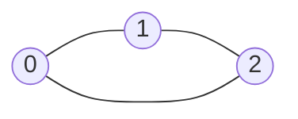
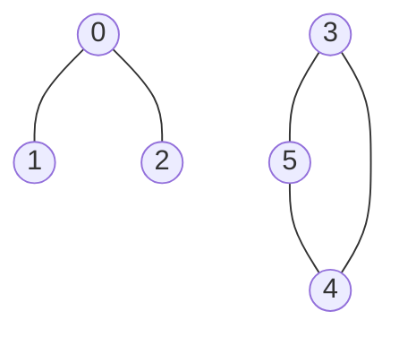
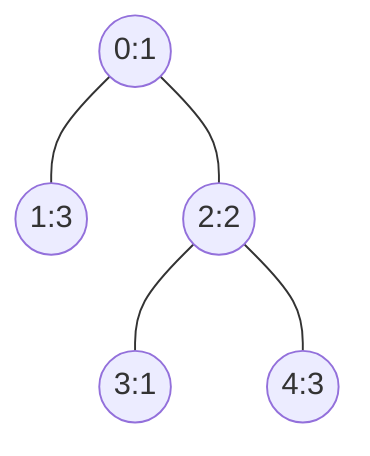
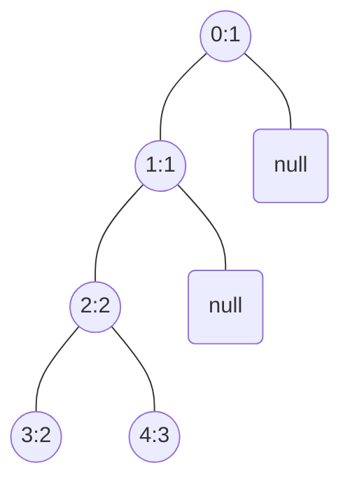

# [Union Find](https://en.wikipedia.org/wiki/Disjoint-set_data_structure)

## [839. Similar String Groups](https://leetcode.com/problems/similar-string-groups/)  2053

- [Official](https://leetcode.com/problems/similar-string-groups/editorial/)
- [Official](https://leetcode.cn/problems/similar-string-groups/solutions/583944/xiang-si-zi-fu-chuan-zu-by-leetcode-solu-8jt9/)

<details><summary>Description</summary>

```text
Two strings X and Y are similar if we can swap two letters (in different positions) of X, so that it equals Y.
Also two strings X and Y are similar if they are equal.

For example, "tars" and "rats" are similar (swapping at positions 0 and 2),
and "rats" and "arts" are similar, but "star" is not similar to "tars", "rats", or "arts".

Together, these form two connected groups by similarity: {"tars", "rats", "arts"} and {"star"}.
Notice that "tars" and "arts" are in the same group even though they are not similar.
Formally, each group is such that a word is in the group
if and only if it is similar to at least one other word in the group.

We are given a list strs of strings where every string in strs is an anagram of every other string in strs.
How many groups are there?

Example 1:
Input: strs = ["tars","rats","arts","star"]
Output: 2

Example 2:
Input: strs = ["omv","ovm"]
Output: 1

Constraints:
1 <= strs.length <= 300
1 <= strs[i].length <= 300
strs[i] consists of lowercase letters only.
All words in strs have the same length and are anagrams of each other.
```

</details>

<details><summary>C</summary>

```c
int find(int* f, int x) {
    int retVal = x;

    if (f[x] == x) {
        return retVal;
    }
    f[x] = find(f, f[x]);
    retVal = f[x];

    return retVal;
}
bool check(char* a, char* b, int len) {
    bool retVal = false;

    int num = 0;
    int i;
    for (i = 0; i < len; ++i) {
        if (a[i] == b[i]) {
            continue;
        }
        num++;
        if (num > 2) {
            return retVal;
        }
    }
    retVal = true;

    return retVal;
}
int numSimilarGroups(char** strs, int strsSize) {
    int retVal = 0;

    int i, j;

    int f[strsSize];
    for (int i = 0; i < strsSize; ++i) {
        f[i] = i;
    }

    int fi, fj, len;
    for (i = 0; i < strsSize; ++i) {
        for (j = i + 1; j < strsSize; ++j) {
            fi = find(f, i);
            fj = find(f, j);
            if (fi == fj) {
                continue;
            }

            len = strlen(strs[i]);
            if (check(strs[i], strs[j], len)) {
                f[fi] = fj;
            }
        }
    }

    for (i = 0; i < strsSize; ++i) {
        if (f[i] == i) {
            ++retVal;
        }
    }

    return retVal;
}
```

</details>

<details><summary>C++</summary>

```c++
class Solution {
   public:
    int find(vector<int>& f, int x) {
        int retVal = x;

        if (f[x] == x) {
            return retVal;
        }
        f[x] = find(f, f[x]);
        retVal = f[x];

        return retVal;
    }
    bool check(const string& a, const string& b, int len) {
        bool retVal = false;

        int num = 0;
        for (int i = 0; i < len; ++i) {
            if (a[i] == b[i]) {
                continue;
            }
            num++;
            if (num > 2) {
                return retVal;
            }
        }
        retVal = true;

        return retVal;
    }
    int numSimilarGroups(vector<string>& strs) {
        int retVal = 0;

        int strsSize = strs.size();
        vector<int> f(strsSize);
        for (int i = 0; i < strsSize; ++i) {
            f[i] = i;
        }

        for (int i = 0; i < strsSize; ++i) {
            for (int j = i + 1; j < strsSize; ++j) {
                int fi = find(f, i);
                int fj = find(f, j);
                if (fi == fj) {
                    continue;
                }

                int len = strs[i].length();
                if (check(strs[i], strs[j], len)) {
                    f[fi] = fj;
                }
            }
        }

        for (int i = 0; i < strsSize; ++i) {
            if (f[i] == i) {
                ++retVal;
            }
        }

        return retVal;
    }
};
```

</details>

<details><summary>Python3</summary>

```python
class Solution:
    def find(self, f: List[int], x: int) -> int:
        retVal = x

        if f[x] == x:
            return retVal

        f[x] = self.find(f, f[x])
        retVal = f[x]

        return retVal

    def check(self, a: str, b: str) -> bool:
        retVal = False

        num = 0
        for ac, bc in zip(a, b):
            if ac == bc:
                continue

            num += 1
            if num > 2:
                return retVal

        retVal = True

        return retVal

    def numSimilarGroups(self, strs: List[str]) -> int:
        retVal = 0

        strsSize = len(strs)
        f = list(range(strsSize))

        for i in range(strsSize):
            for j in range(i + 1, strsSize):
                fi = self.find(f, i)
                fj = self.find(f, j)
                if fi == fj:
                    continue

                if self.check(strs[i], strs[j]):
                    f[fi] = fj

        retVal = sum(1 for i in range(strsSize) if f[i] == i)

        return retVal
```

</details>

## [886. Possible Bipartition](https://leetcode.com/problems/possible-bipartition/)  1794

- [Official](https://leetcode.com/problems/possible-bipartition/solutions/2834180/possible-bipartition/)
- [Official](https://leetcode.cn/problems/possible-bipartition/solutions/1893341/ke-neng-de-er-fen-fa-by-leetcode-solutio-guo7/)

<details><summary>Description</summary>

```text
We want to split a group of n people (labeled from 1 to n) into two groups of any size.
Each person may dislike some other people, and they should not go into the same group.

Given the integer n and the array dislikes where dislikes[i] = [ai, bi] indicates
that the person labeled ai does not like the person labeled bi,
return true if it is possible to split everyone into two groups in this way.

Example 1:
Input: n = 4, dislikes = [[1,2],[1,3],[2,4]]
Output: true
Explanation: group1 [1,4] and group2 [2,3].

Example 2:
Input: n = 3, dislikes = [[1,2],[1,3],[2,3]]
Output: false

Example 3:
Input: n = 5, dislikes = [[1,2],[2,3],[3,4],[4,5],[1,5]]
Output: false

Constraints:
1 <= n <= 2000
0 <= dislikes.length <= 10^4
dislikes[i].length == 2
1 <= dislikes[i][j] <= n
ai < bi
All the pairs of dislikes are unique.
```

</details>

<details><summary>C</summary>

```c
#ifndef UNION_FIND
#define UNION_FIND (1)

int findFa(int x, int *fa) {
    if (fa[x] < 0) {
        return x;
    }

    return (fa[x] = findFa(fa[x], fa));
}
void swap(int *a, int *b) {
    int tmp = *a;
    *a = *b;
    *b = tmp;
}
void unit(int x, int y, int *fa) {
    x = findFa(x, fa);
    y = findFa(y, fa);
    if (x == y) {
        return;
    }

    if (fa[x] < fa[y]) {
        swap(&x, &y);
    }
    fa[x] += fa[y];
    fa[y] = x;
}
bool isconnect(int x, int y, int *fa) {
    x = findFa(x, fa);
    y = findFa(y, fa);

    return (x == y);
}
#endif
bool possibleBipartition(int n, int **dislikes, int dislikesSize, int *dislikesColSize) {
    bool retVal = false;

    int i, j;
    struct ListNode *pNode;

    int color[n + 1];
    memset(color, 0, sizeof(color));
    int fa[n + 1];
    memset(fa, -1, sizeof(fa));
    struct ListNode *g[n + 1];
    for (i = 0; i <= n; ++i) {
        g[i] = NULL;
    }

    int a, b;
    for (i = 0; i < dislikesSize; ++i) {
        a = dislikes[i][0];
        b = dislikes[i][1];

        pNode = (struct ListNode *)malloc(sizeof(struct ListNode));
        if (pNode == NULL) {
            perror("malloc");
            for (i = 0; i <= n; ++i) {
                if (g[i]) {
                    free(g[i]);
                    g[i] = NULL;
                }
            }
            return retVal;
        }
        pNode->val = a;
        pNode->next = g[b];
        g[b] = pNode;

        pNode = (struct ListNode *)malloc(sizeof(struct ListNode));
        if (pNode == NULL) {
            perror("malloc");
            for (i = 0; i <= n; ++i) {
                if (g[i]) {
                    free(g[i]);
                    g[i] = NULL;
                }
            }
            return retVal;
        }
        pNode->val = b;
        pNode->next = g[a];
        g[a] = pNode;
    }

    struct ListNode *curr;
    struct ListNode *prev;
    for (i = 1; i <= n; ++i) {
        for (pNode = g[i]; pNode; pNode = pNode->next) {
            unit(g[i]->val, pNode->val, fa);

            if (isconnect(i, pNode->val, fa) == false) {
                continue;
            }

            for (j = 0; j <= n; ++j) {
                curr = g[j];
                while (curr) {
                    prev = curr;
                    curr = curr->next;
                    free(prev);
                }
            }

            return retVal;
        }
    }
    for (j = 0; j <= n; j++) {
        curr = g[j];
        while (curr) {
            prev = curr;
            curr = curr->next;
            free(prev);
        }
    }
    retVal = true;

    return retVal;
}
```

</details>

## [947. Most Stones Removed with Same Row or Column](https://leetcode.com/problems/most-stones-removed-with-same-row-or-column/)  2034

<details><summary>Description</summary>

```text
On a 2D plane, we place n stones at some integer coordinate points. Each coordinate point may have at most one stone.

A stone can be removed if it shares either the same row or the same column as another stone that has not been removed.

Given an array stones of length n where stones[i] = [xi, yi] represents the location of the ith stone,
return the largest possible number of stones that can be removed.

Example 1:
Input: stones = [[0,0],[0,1],[1,0],[1,2],[2,1],[2,2]]
Output: 5
Explanation: One way to remove 5 stones is as follows:
1. Remove stone [2,2] because it shares the same row as [2,1].
2. Remove stone [2,1] because it shares the same column as [0,1].
3. Remove stone [1,2] because it shares the same row as [1,0].
4. Remove stone [1,0] because it shares the same column as [0,0].
5. Remove stone [0,1] because it shares the same row as [0,0].
Stone [0,0] cannot be removed since it does not share a row/column with another stone still on the plane.

Example 2:
Input: stones = [[0,0],[0,2],[1,1],[2,0],[2,2]]
Output: 3
Explanation: One way to make 3 moves is as follows:
1. Remove stone [2,2] because it shares the same row as [2,0].
2. Remove stone [2,0] because it shares the same column as [0,0].
3. Remove stone [0,2] because it shares the same row as [0,0].
Stones [0,0] and [1,1] cannot be removed since they do not share a row/column with another stone still on the plane.

Example 3:
Input: stones = [[0,0]]
Output: 0
Explanation: [0,0] is the only stone on the plane, so you cannot remove it.

Constraints:
1 <= stones.length <= 1000
0 <= xi, yi <= 10^4
No two stones are at the same coordinate point.
```

</details>

<details><summary>C</summary>

```c
struct hashStruct {
    int index;
    int value;
    UT_hash_handle hh;
};
void freeAll(struct hashStruct* pFree) {
    struct hashStruct* current;
    struct hashStruct* tmp;
    HASH_ITER(hh, pFree, current, tmp) {
        HASH_DEL(pFree, current);
        free(current);
    }
}
int getUnionFind(int* pUnionFind, int idx) {
    if (pUnionFind[idx] != idx) {
        pUnionFind[idx] = getUnionFind(pUnionFind, pUnionFind[idx]);
    }

    return pUnionFind[idx];
}
int merge(int* pUnionFind, int exist, int new) {
    int existValue = getUnionFind(pUnionFind, exist);
    int newValue = getUnionFind(pUnionFind, new);
    if (existValue == newValue) {
        return 0;
    }
    pUnionFind[newValue] = existValue;

    return 1;
}

int removeStones(int** stones, int stonesSize, int* stonesColSize) {
    int retVal = stonesSize;

    int i;

    int UnionFind[stonesSize];
    for (i=0; i<stonesSize; ++i) {
        UnionFind[i] = i;
    }

    struct hashStruct* hashRow = NULL;
    struct hashStruct* tmpRow;
    struct hashStruct* hashCol = NULL;
    struct hashStruct* tmpCol;
    int count = stonesSize;
    for (i=0; i<stonesSize; ++i) {
        tmpRow = NULL;
        HASH_FIND_INT(hashRow, stones[i], tmpRow);
        if (tmpRow) {
            count -= merge(UnionFind, tmpRow->index, i);
        }
        else {
            tmpRow = malloc(sizeof(struct hashStruct));
            if (tmpRow == NULL) {
                perror("malloc");
                freeAll(hashRow);
                freeAll(hashCol);
                return retVal;
            }
            tmpRow->value = stones[i][0];
            tmpRow->index = i;
            HASH_ADD_INT(hashRow, value, tmpRow);
        }

        tmpCol = NULL;
        HASH_FIND_INT(hashCol, stones[i]+1, tmpCol);
        if (tmpCol) {
            count -= merge(UnionFind, tmpCol->index, i);
        }
        else {
            tmpCol = malloc(sizeof(struct hashStruct));
            if (tmpCol == NULL) {
                perror("malloc");
                freeAll(hashRow);
                freeAll(hashCol);
                return retVal;
            }
            tmpCol->value = stones[i][1];
            tmpCol->index = i;
            HASH_ADD_INT(hashCol, value, tmpCol);
        }
    }
    retVal -= count;
    freeAll(hashRow);
    freeAll(hashCol);

    return retVal;
}
```

</details>

## [990. Satisfiability of Equality Equations](https://leetcode.com/problems/satisfiability-of-equality-equations/)  1638

<details><summary>Description</summary>

```text
You are given an array of strings equations that represent relationships between variables
where each string equations[i] is of length 4 and takes one of two different forms:
"xi==yi" or "xi!=yi".Here, xi and yi are lowercase letters (not necessarily different)
that represent one-letter variable names.

Return true if it is possible to assign integers to variable names so as to satisfy all the given equations,
or false otherwise.

Example 1:
Input: equations = ["a==b","b!=a"]
Output: false
Explanation: If we assign say, a = 1 and b = 1, then the first equation is satisfied, but not the second.
There is no way to assign the variables to satisfy both equations.

Example 2:
Input: equations = ["b==a","a==b"]
Output: true
Explanation: We could assign a = 1 and b = 1 to satisfy both equations.

Constraints:
- 1 <= equations.length <= 500
- equations[i].length == 4
- equations[i][0] is a lowercase letter.
- equations[i][1] is either '=' or '!'.
- equations[i][2] is '='.
- equations[i][3] is a lowercase letter.
```

</details>

<details><summary>C</summary>

```c
#define MAX_SIZE    26

int find(int* pRecord, int x)
{
    if (x != pRecord[x]) {
        pRecord[x] = find(pRecord, pRecord[x]);
    }

    return pRecord[x];
}

bool equationsPossible(char ** equations, int equationsSize)
{
    bool retVal = false;

    int RECORD[MAX_SIZE];
    int i;
    for (i=0; i<MAX_SIZE; ++i) {
        RECORD[i] = i;
    }

    for (i=0; i<equationsSize; ++i) {
        if (equations[i][1] == '=') {
            RECORD[find(RECORD, equations[i][0] - 'a')] = find(RECORD, equations[i][3] - 'a');
        }
    }

    for (i=0; i<equationsSize; ++i) {
        if (equations[i][1] == '!') {
            if (find(RECORD, equations[i][0] - 'a') == find(RECORD, equations[i][3] - 'a')) {
                return retVal;
            }
        }
    }
    retVal = true;

    return retVal;
}
```

</details>

## [1061. Lexicographically Smallest Equivalent String](https://leetcode.com/problems/lexicographically-smallest-equivalent-string/)

- [Official](https://leetcode.com/problems/lexicographically-smallest-equivalent-string/solutions/2867563/lexicographically-smallest-equivalent-string/)

<details><summary>Description</summary>

```text
You are given two strings of the same length s1 and s2 and a string baseStr.

We say s1[i] and s2[i] are equivalent characters.

For example, if s1 = "abc" and s2 = "cde", then we have 'a' == 'c', 'b' == 'd', and 'c' == 'e'.
Equivalent characters follow the usual rules of any equivalence relation:

Reflexivity: 'a' == 'a'.
Symmetry: 'a' == 'b' implies 'b' == 'a'.
Transitivity: 'a' == 'b' and 'b' == 'c' implies 'a' == 'c'.
For example, given the equivalency information from s1 = "abc" and s2 = "cde", "acd" and "aab"
are equivalent strings of baseStr = "eed", and "aab" is the lexicographically smallest equivalent string of baseStr.

Return the lexicographically smallest equivalent string of baseStr by using the equivalency information from s1 and s2.

Example 1:
Input: s1 = "parker", s2 = "morris", baseStr = "parser"
Output: "makkek"
Explanation: Based on the equivalency information in s1 and s2, we can group their characters as [m,p], [a,o], [k,r,s], [e,i].
The characters in each group are equivalent and sorted in lexicographical order.
So the answer is "makkek".

Example 2:
Input: s1 = "hello", s2 = "world", baseStr = "hold"
Output: "hdld"
Explanation: Based on the equivalency information in s1 and s2, we can group their characters as [h,w], [d,e,o], [l,r].
So only the second letter 'o' in baseStr is changed to 'd', the answer is "hdld".

Example 3:
Input: s1 = "leetcode", s2 = "programs", baseStr = "sourcecode"
Output: "aauaaaaada"
Explanation: We group the equivalent characters in s1 and s2 as [a,o,e,r,s,c], [l,p], [g,t] and [d,m],
thus all letters in baseStr except 'u' and 'd' are transformed to 'a', the answer is "aauaaaaada".

Constraints:
1 <= s1.length, s2.length, baseStr <= 1000
s1.length == s2.length
s1, s2, and baseStr consist of lowercase English letters.
```

</details>

<details><summary>C</summary>

```c
int find(int* pUnionFind, int idx) {
    while (pUnionFind[idx] != idx) {
        idx = pUnionFind[idx];
    }

    return idx;
}
void join(int* pUnionFind, int idx1, int idx2) {
    int root1 = find(pUnionFind, idx1);
    int root2 = find(pUnionFind, idx2);
    if (root1 == root2) {
        return;
    }

    if (root1 <= root2) {
        pUnionFind[root2] = root1;
    } else {
        pUnionFind[root1] = root2;
    }
}
char* smallestEquivalentString(char* s1, char* s2, char* baseStr) {
    char* pRetVal = NULL;

    int i;

// s1, s2, and baseStr consist of lowercase English letters.
#define MAX_UNION_FIND (26)
    int UnionFind[MAX_UNION_FIND];
    for (i = 0; i < MAX_UNION_FIND; ++i) {
        UnionFind[i] = i;
    }

    int len = strlen(s1);
    for (i = 0; i < len; ++i) {
        join(UnionFind, s1[i] - 'a', s2[i] - 'a');
    }

    len = strlen(baseStr);
    int returnSize = len + 1;
    pRetVal = (char*)malloc(returnSize * sizeof(char));
    if (pRetVal == NULL) {
        perror("malloc");
        return pRetVal;
    }
    memset(pRetVal, 0, returnSize * sizeof(char));
    for (i = 0; i < len; ++i) {
        pRetVal[i] = (char)(find(UnionFind, baseStr[i] - 'a') + 'a');
    }

    return pRetVal;
}
```

</details>

<details><summary>C++</summary>

```c++
class Solution {
   public:
// s1, s2, and baseStr consist of lowercase English letters.
#define MAX_UNION_FIND (26)
    array<int, MAX_UNION_FIND> UnionFind;

    int find(int idx) {
        while (UnionFind[idx] != idx) {
            idx = UnionFind[idx];
        }

        return idx;
    }
    void join(int idx1, int idx2) {
        int root1 = find(idx1);
        int root2 = find(idx2);
        if (root1 == root2) {
            return;
        }

        if (root1 <= root2) {
            UnionFind[root2] = root1;
        } else {
            UnionFind[root1] = root2;
        }
    }

    string smallestEquivalentString(string s1, string s2, string baseStr) {
        string retVal;

        for (long unsigned int i = 0; i < MAX_UNION_FIND; ++i) {
            UnionFind[i] = i;
        }

        for (long unsigned int i = 0; i < s1.length(); ++i) {
            join(s1[i] - 'a', s2[i] - 'a');
        }

        for (char c : baseStr) {
            retVal += (char)(find((c - 'a')) + 'a');
        }

        return retVal;
    }
};
```

</details>

## [1319. Number of Operations to Make Network Connected](https://leetcode.com/problems/number-of-operations-to-make-network-connected/)  1633

- [Official](https://leetcode.cn/problems/number-of-operations-to-make-network-connected/solutions/101780/lian-tong-wang-luo-de-cao-zuo-ci-shu-by-leetcode-s/)

<details><summary>Description</summary>

```text
There are n computers numbered from 0 to n - 1 connected by ethernet cables connections forming a network
where connections[i] = [ai, bi] represents a connection between computers ai and bi.
Any computer can reach any other computer directly or indirectly through the network.

You are given an initial computer network connections.
You can extract certain cables between two directly connected computers,
and place them between any pair of disconnected computers to make them directly connected.

Return the minimum number of times you need to do this in order to make all the computers connected.
If it is not possible, return -1.

Example 1:
    [0]-[1]    [0]-[1]
     | /    =>  |   |
    [2] (3)    [2] [3]
Input: n = 4, connections = [[0,1],[0,2],[1,2]]
Output: 1
Explanation: Remove cable between computer 1 and 2 and place between computers 1 and 3.

Example 2:
    [0]-[1] (4)    [0]-[1]-[4]
     | X |      =>  |   |   |
    [2] [3] (5)    [2] [3] [5]
Input: n = 6, connections = [[0,1],[0,2],[0,3],[1,2],[1,3]]
Output: 2

Example 3:
    [0]-[1] (4)    [0]-[1]-[4]
     | X        =>  | \
    [2] [3] (5)    [2] [3] (5)
Input: n = 6, connections = [[0,1],[0,2],[0,3],[1,2]]
Output: -1
Explanation: There are not enough cables.

Constraints:
1 <= n <= 10^5
1 <= connections.length <= min(n * (n - 1) / 2, 10^5)
connections[i].length == 2
0 <= ai, bi < n
ai != bi
There are no repeated connections.
No two computers are connected by more than one cable.
```

<details><summary>Hint</summary>

```text
1. As long as there are at least (n - 1) connections, there is definitely a way to connect all computers.
2. Use DFS to determine the number of isolated computer clusters.
```

</details>

</details>

<details><summary>C</summary>

```c
#define UNION_FIND (1)
#if (UNION_FIND)
void swap(int* a, int* b) {
    int tmp = *a;
    *a = *b;
    *b = tmp;
}

struct DisjointSetUnion {
    int* f;
    int* size;
    int n;
    int setCount;
};
int initDisjointSet(struct DisjointSetUnion* obj, int n) {
    obj->f = (int*)malloc(n * sizeof(int));
    if (obj->f == NULL) {
        perror("malloc");
        return EXIT_FAILURE;
    }
    obj->size = (int*)malloc(n * sizeof(int));
    if (obj->size == NULL) {
        perror("malloc");
        return EXIT_FAILURE;
    }
    obj->n = n;
    obj->setCount = n;

    int i;
    for (i = 0; i < n; ++i) {
        obj->f[i] = i;
        obj->size[i] = 1;
    }

    return EXIT_SUCCESS;
}
void freeDisjointSet(struct DisjointSetUnion* obj) {
    if (obj->f) {
        free(obj->f);
        obj->f = NULL;
    }

    if (obj->size) {
        free(obj->size);
        obj->size = NULL;
    }
}
int find(struct DisjointSetUnion* obj, int x) {
    int retVal = x;

    if (obj->f[x] != x) {
        obj->f[x] = find(obj, obj->f[x]);
        retVal = obj->f[x];
    }

    return retVal;
}
bool unionSet(struct DisjointSetUnion* obj, int x, int y) {
    int retVal = false;

    int fx = find(obj, x);
    int fy = find(obj, y);
    if (fx == fy) {
        return retVal;
    }

    if (obj->size[fx] < obj->size[fy]) {
        swap(&fx, &fy);
    }
    obj->size[fx] += obj->size[fy];
    obj->f[fy] = fx;
    obj->setCount--;
    retVal = true;

    return retVal;
}
#endif
int makeConnected(int n, int** connections, int connectionsSize, int* connectionsColSize) {
    int retVal = -1;

    if (connectionsSize < n - 1) {
        return retVal;
    }

    struct DisjointSetUnion* pUnionFind = (struct DisjointSetUnion*)malloc(sizeof(struct DisjointSetUnion));
    if (pUnionFind == NULL) {
        perror("malloc");
        return retVal;
    }
    if (initDisjointSet(pUnionFind, n) == EXIT_FAILURE) {
        freeDisjointSet(pUnionFind);
        free(pUnionFind);
        pUnionFind = NULL;
        return retVal;
    }

    int i;
    for (i = 0; i < connectionsSize; ++i) {
        unionSet(pUnionFind, connections[i][0], connections[i][1]);
    }
    retVal = pUnionFind->setCount - 1;

    freeDisjointSet(pUnionFind);
    free(pUnionFind);
    pUnionFind = NULL;

    return retVal;
}
```

</details>

<details><summary>C++</summary>

```c++
// https://leetcode.cn/problems/number-of-operations-to-make-network-connected/solutions/572152/wang-luo-lian-jie-bing-cha-ji-by-yexiso-1nd4/
class DisjointSet {
   private:
    vector<int> parent;
    vector<int> rank;
    int count;
    int rest;

   public:
    DisjointSet(int n) : parent(vector<int>(n)), rank(vector<int>(n)), count(n), rest(0) {
        for (int i = 0; i < n; i++) {
            parent[i] = i;
        }
    }

    int find(int x) {
        if (x != parent[x]) {
            parent[x] = find(parent[x]);
        }

        return parent[x];
    }
    void merge(int x, int y) {
        int rootx = find(x);
        int rooty = find(y);

        if (rootx != rooty) {
            if (rank[rootx] < rank[rooty]) {
                swap(rootx, rooty);
            }
            parent[rooty] = rootx;
            if (rank[rootx] == rank[rooty]) {
                rank[rootx] += 1;
            }
            count--;
        } else {
            rest++;
        }
    }
    int getCount() {
        //
        return count;
    }
    int getRest() {
        //
        return rest;
    }
};

class Solution {
   public:
    int makeConnected(int n, vector<vector<int>>& connections) {
        int retVal = -1;

        int connectionsSize = connections.size();
        if (connectionsSize < n - 1) {
            return retVal;
        }

        DisjointSet ds(n);
        for (auto& connection : connections) {
            ds.merge(connection[0], connection[1]);
        }
        retVal = ds.getCount() - 1;

        return retVal;
    }
};
```

</details>

<details><summary>Python3</summary>

```python
class UnionFind:
    def __init__(self, n: int):
        self.parent = list(range(n))
        self.size = [1] * n
        self.n = n
        self.setCount = n

    def findset(self, x: int) -> int:
        if self.parent[x] == x:
            return x
        self.parent[x] = self.findset(self.parent[x])
        return self.parent[x]

    def unite(self, x: int, y: int) -> bool:
        x, y = self.findset(x), self.findset(y)
        if x == y:
            return False
        if self.size[x] < self.size[y]:
            x, y = y, x
        self.parent[y] = x
        self.size[x] += self.size[y]
        self.setCount -= 1
        return True

    def connected(self, x: int, y: int) -> bool:
        x, y = self.findset(x), self.findset(y)
        return x == y


class Solution:
    def makeConnected(self, n: int, connections: List[List[int]]) -> int:
        retVal = -1

        if len(connections) < n - 1:
            return retVal

        uf = UnionFind(n)
        for x, y in connections:
            uf.unite(x, y)
        retVal = uf.setCount - 1

        return retVal
```

</details>

## [1579. Remove Max Number of Edges to Keep Graph Fully Traversable](https://leetcode.com/problems/remove-max-number-of-edges-to-keep-graph-fully-traversable/)  2131

- [Official](https://leetcode.com/problems/remove-max-number-of-edges-to-keep-graph-fully-traversable/editorial/)
- [Official](https://leetcode.cn/problems/remove-max-number-of-edges-to-keep-graph-fully-traversable/solutions/577816/bao-zheng-tu-ke-wan-quan-bian-li-by-leet-mtrw/)

<details><summary>Description</summary>

```text
Alice and Bob have an undirected graph of n nodes and three types of edges:
- Type 1: Can be traversed by Alice only.
- Type 2: Can be traversed by Bob only.
- Type 3: Can be traversed by both Alice and Bob.

Given an array edges
where edges[i] = [typei, ui, vi] represents a bidirectional edge of type typei between nodes ui and vi,
find the maximum number of edges you can remove so that after removing the edges,
the graph can still be fully traversed by both Alice and Bob.
The graph is fully traversed by Alice and Bob if starting from any node, they can reach all other nodes.

Return the maximum number of edges you can remove, or return -1 if Alice and Bob cannot fully traverse the graph.

Example 1:
Input: n = 4, edges = [[3,1,2],[3,2,3],[1,1,3],[1,2,4],[1,1,2],[2,3,4]]
Output: 2
Explanation: If we remove the 2 edges [1,1,2] and [1,1,3].
The graph will still be fully traversable by Alice and Bob.
Removing any additional edge will not make it so. So the maximum number of edges we can remove is 2.

Example 2:
Input: n = 4, edges = [[3,1,2],[3,2,3],[1,1,4],[2,1,4]]
Output: 0
Explanation: Notice that removing any edge will not make the graph fully traversable by Alice and Bob.

Example 3:
Input: n = 4, edges = [[3,2,3],[1,1,2],[2,3,4]]
Output: -1
Explanation: In the current graph, Alice cannot reach node 4 from the other nodes.
Likewise, Bob cannot reach 1. Therefore it's impossible to make the graph fully traversable.

Constraints:
1 <= n <= 10^5
1 <= edges.length <= min(105, 3 * n * (n - 1) / 2)
edges[i].length == 3
1 <= typei <= 3
1 <= ui < vi <= n
All tuples (typei, ui, vi) are distinct.
```

<details><summary>Hint</summary>

```text
1. Build the network instead of removing extra edges.
2. Suppose you have the final graph (after removing extra edges).
   Consider the subgraph with only the edges that Alice can traverse.
   What structure does this subgraph have? How many edges are there?
3. Use disjoint set union data structure for both Alice and Bob.
4. Always use Type 3 edges first, and connect the still isolated ones using other edges.
```

</details>

</details>

<details><summary>C</summary>

```c
void swap(int *a, int *b) {
    int tmp;

    tmp = *a;
    *a = *b;
    *b = tmp;
}
struct DisjointSetUnion {
    int *f;
    int *size;
    int n;
    int setCount;
};
void initDSU(struct DisjointSetUnion *obj, int n) {
    obj->f = (int *)malloc(n * sizeof(int));
    if (obj->f == NULL) {
        perror("malloc");
        return;
    }
    obj->size = (int *)malloc(n * sizeof(int));
    if (obj->size == NULL) {
        perror("malloc");
        free(obj->f);
        obj->f = NULL;
        return;
    }
    obj->n = n;
    obj->setCount = n;

    int i;
    for (i = 0; i < n; i++) {
        obj->f[i] = i;
        obj->size[i] = 1;
    }
}
void freeDSU(struct DisjointSetUnion *obj) {
    free(obj->f);
    obj->f = NULL;
    free(obj->size);
    obj->size = NULL;
    free(obj);
    obj = NULL;
}
int find(struct DisjointSetUnion *obj, int x) {
    int retVal = 0;

    if (obj->f[x] != x) {
        obj->f[x] = find(obj, obj->f[x]);
    }
    retVal = obj->f[x];

    return retVal;
}
int unionSet(struct DisjointSetUnion *obj, int x, int y) {
    int retVal = false;

    int fx = find(obj, x);
    int fy = find(obj, y);
    if (fx == fy) {
        return retVal;
    }

    if (obj->size[fx] < obj->size[fy]) {
        swap(&fx, &fy);
    }
    obj->size[fx] += obj->size[fy];
    obj->f[fy] = fx;
    obj->setCount--;
    retVal = true;

    return retVal;
}
int maxNumEdgesToRemove(int n, int **edges, int edgesSize, int *edgesColSize) {
    int retVal = 0;

    struct DisjointSetUnion *ufa = (struct DisjointSetUnion *)malloc(sizeof(struct DisjointSetUnion));
    if (ufa == NULL) {
        perror("malloc");
        return retVal;
    }
    initDSU(ufa, n);

    struct DisjointSetUnion *ufb = (struct DisjointSetUnion *)malloc(sizeof(struct DisjointSetUnion));
    if (ufb == NULL) {
        perror("malloc");
        freeDSU(ufa);
        return retVal;
    }
    initDSU(ufb, n);

    int i;

    for (i = 0; i < edgesSize; i++) {
        edges[i][1]--;
        edges[i][2]--;
    }

    for (i = 0; i < edgesSize; i++) {
        if (edges[i][0] == 3) {
            if (unionSet(ufa, edges[i][1], edges[i][2]) == false) {
                ++retVal;
            } else {
                unionSet(ufb, edges[i][1], edges[i][2]);
            }
        }
    }

    for (i = 0; i < edgesSize; i++) {
        if (edges[i][0] == 1) {
            if (unionSet(ufa, edges[i][1], edges[i][2]) == false) {
                ++retVal;
            }
        } else if (edges[i][0] == 2) {
            if (unionSet(ufb, edges[i][1], edges[i][2]) == false) {
                ++retVal;
            }
        }
    }

    if ((ufa->setCount != 1) || (ufb->setCount != 1)) {
        retVal = -1;
    }

    freeDSU(ufa);
    freeDSU(ufb);

    return retVal;
}
```

</details>

<details><summary>C++</summary>

```c++
class UnionFind {
   public:
    int n;
    int setCount;
    vector<int> parent;
    vector<int> size;

    UnionFind(int _n) : n(_n), setCount(_n), parent(_n), size(_n, 1) {
        //
        iota(parent.begin(), parent.end(), 0);
    }
    int findset(int x) {
        int retVal = 0;

        if (parent[x] != x) {
            parent[x] = findset(parent[x]);
        }
        retVal = parent[x];

        return retVal;
    }
    bool unite(int x, int y) {
        bool retVal = false;

        x = findset(x);
        y = findset(y);
        if (x == y) {
            return retVal;
        }

        if (size[x] < size[y]) {
            swap(x, y);
        }
        parent[y] = x;
        size[x] += size[y];
        --setCount;
        retVal = true;

        return retVal;
    }
    bool connected(int x, int y) {
        bool retVal = false;

        x = findset(x);
        y = findset(y);
        if (x == y) {
            retVal = true;
        }

        return retVal;
    }
};

class Solution {
   public:
    int maxNumEdgesToRemove(int n, vector<vector<int>>& edges) {
        int retVal = 0;

        UnionFind ufa(n);
        UnionFind ufb(n);

        for (auto& edge : edges) {
            --edge[1];
            --edge[2];
        }

        for (const auto& edge : edges) {
            if (edge[0] == 3) {
                if (!ufa.unite(edge[1], edge[2])) {
                    ++retVal;
                } else {
                    ufb.unite(edge[1], edge[2]);
                }
            }
        }

        for (const auto& edge : edges) {
            if (edge[0] == 1) {
                if (!ufa.unite(edge[1], edge[2])) {
                    ++retVal;
                }
            } else if (edge[0] == 2) {
                if (!ufb.unite(edge[1], edge[2])) {
                    ++retVal;
                }
            }
        }

        if (ufa.setCount != 1 || ufb.setCount != 1) {
            retVal = -1;
        }

        return retVal;
    }
};
```

</details>

<details><summary>Python3</summary>

```python
class UnionFind:
    def __init__(self, n: int):
        self.parent = list(range(n))
        self.size = [1] * n
        self.n = n
        self.setCount = n

    def findset(self, x: int) -> int:
        retVal = 0

        if self.parent[x] != x:
            self.parent[x] = self.findset(self.parent[x])
        retVal = self.parent[x]

        return retVal

    def unite(self, x: int, y: int) -> bool:
        retVal = False

        x = self.findset(x)
        y = self.findset(y)
        if x == y:
            return retVal

        if self.size[x] < self.size[y]:
            x, y = y, x
        self.parent[y] = x
        self.size[x] += self.size[y]
        self.setCount -= 1
        retVal = True

        return retVal

    def connected(self, x: int, y: int) -> bool:
        retVal = False

        x = self.findset(x)
        y = self.findset(y)
        if x == y:
            retVal = True

        return retVal


class Solution:
    def maxNumEdgesToRemove(self, n: int, edges: List[List[int]]) -> int:
        retVal = 0

        ufa = UnionFind(n)
        ufb = UnionFind(n)

        for edge in edges:
            edge[1] -= 1
            edge[2] -= 1

        for t, u, v in edges:
            if t == 3:
                if not ufa.unite(u, v):
                    retVal += 1
                else:
                    ufb.unite(u, v)

        for t, u, v in edges:
            if t == 1:
                if not ufa.unite(u, v):
                    retVal += 1
            elif t == 2:
                if not ufb.unite(u, v):
                    retVal += 1

        if ufa.setCount != 1 or ufb.setCount != 1:
            retVal = -1

        return retVal
```

</details>

## [1584. Min Cost to Connect All Points](https://leetcode.com/problems/min-cost-to-connect-all-points/)  1857

- [Official](https://leetcode.cn/problems/min-cost-to-connect-all-points/solutions/565801/lian-jie-suo-you-dian-de-zui-xiao-fei-yo-kcx7/)

<details><summary>Description</summary>

```text
You are given an array points representing integer coordinates of some points on a 2D-plane, where points[i] = [xi, yi].

The cost of connecting two points [xi, yi] and [xj, yj] is the manhattan distance between them:
|xi - xj| + |yi - yj|, where |val| denotes the absolute value of val.

Return the minimum cost to make all points connected.
All points are connected if there is exactly one simple path between any two points.

Example 1:
Input: points = [[0,0],[2,2],[3,10],[5,2],[7,0]]
Output: 20
Explanation:
We can connect the points as shown above to get the minimum cost of 20.
Notice that there is a unique path between every pair of points.

Example 2:
Input: points = [[3,12],[-2,5],[-4,1]]
Output: 18

Constraints:
1 <= points.length <= 1000
-10^6 <= xi, yi <= 10^6
All pairs (xi, yi) are distinct.
```

<details><summary>Hint</summary>

```text
1. Connect each pair of points with a weighted edge, the weight being the manhattan distance between those points.
2. The problem is now the cost of minimum spanning tree in graph with above edges.
```

</details>

</details>

<details><summary>C</summary>

```c
#ifndef UNIONFIND_H
#define UNIONFIND_H
void swap(int* a, int* b) {
    int tmp = *a;
    *a = *b;
    *b = tmp;
}
int find(int* f, int x) {
    //
    return f[x] == x ? x : (f[x] = find(f, f[x]));
}
int unionSet(int* f, int* rank, int x, int y) {
    int fx = find(f, x), fy = find(f, y);
    if (fx == fy) {
        return false;
    }

    if (rank[fx] < rank[fy]) {
        swap(&fx, &fy);
    }
    rank[fx] += rank[fy];
    f[fy] = fx;
    return true;
}
#endif  // UNIONFIND_H
struct Edge {
    int len;
    int x;
    int y;
};
int compareStruct(const void* a1, const void* a2) {
    struct Edge* p1 = (struct Edge*)a1;
    struct Edge* p2 = (struct Edge*)a2;

    // ascending order
    return (p1->len > p2->len);
}
int minCostConnectPoints(int** points, int pointsSize, int* pointsColSize) {
    int retVal = 0;

    int i, j;

    // Kruskal's algorithm: https://en.wikipedia.org/wiki/Kruskal%27s_algorithm
    struct Edge edges[(pointsSize + 1) * pointsSize / 2];
    int edgesSize = 0;
    for (i = 0; i < pointsSize; i++) {
        for (j = i + 1; j < pointsSize; j++) {
            edges[edgesSize].x = i;
            edges[edgesSize].y = j;
            edges[edgesSize++].len = fabs(points[i][0] - points[j][0]) + fabs(points[i][1] - points[j][1]);
        }
    }
    qsort(edges, edgesSize, sizeof(struct Edge), compareStruct);

    int f[pointsSize];
    int rank[pointsSize];
    for (i = 0; i < pointsSize; i++) {
        f[i] = i;
        rank[i] = 1;
    }

    int num = 1;
    for (i = 0; i < edgesSize; i++) {
        if (unionSet(f, rank, edges[i].x, edges[i].y)) {
            retVal += edges[i].len;
            num++;
            if (num == pointsSize) {
                break;
            }
        }
    }

    return retVal;
}
```

</details>

<details><summary>C++</summary>

```c++
class DisjointSetUnion {
   private:
    vector<int> f;
    vector<int> rank;
    int n;

   public:
    DisjointSetUnion(int _n) {
        n = _n;
        rank.resize(n, 1);
        f.resize(n);
        for (int i = 0; i < n; i++) {
            f[i] = i;
        }
    }
    int find(int x) {
        //
        return f[x] == x ? x : f[x] = find(f[x]);
    }
    int unionSet(int x, int y) {
        int fx = find(x), fy = find(y);
        if (fx == fy) {
            return false;
        }

        if (rank[fx] < rank[fy]) {
            swap(fx, fy);
        }
        rank[fx] += rank[fy];
        f[fy] = fx;
        return true;
    }
};

class Solution {
   private:
    struct Edge {
        int len;
        int x;
        int y;
        Edge(int len, int x, int y) : len(len), x(x), y(y) {}
    };

   public:
    int distance(vector<vector<int>>& points, int x, int y) {
        int retVal = 0;

        retVal = abs(points[x][0] - points[y][0]) + abs(points[x][1] - points[y][1]);

        return retVal;
    }
    int minCostConnectPoints(vector<vector<int>>& points) {
        int retVal = 0;

        int pointsSize = points.size();

        // Kruskal's algorithm: https://en.wikipedia.org/wiki/Kruskal%27s_algorithm
        DisjointSetUnion dsu(pointsSize);
        vector<Edge> edges;
        for (int i = 0; i < pointsSize; i++) {
            for (int j = i + 1; j < pointsSize; j++) {
                edges.emplace_back(distance(points, i, j), i, j);
            }
        }
        sort(edges.begin(), edges.end(), [](Edge a, Edge b) -> int { return a.len < b.len; });

        int num = 1;
        for (auto& [len, x, y] : edges) {
            if (dsu.unionSet(x, y)) {
                retVal += len;
                num++;
                if (num == pointsSize) {
                    break;
                }
            }
        }

        return retVal;
    }
};
```

</details>

<details><summary>Python3</summary>

```python
class DisjointSetUnion:
    def __init__(self, n):
        self.n = n
        self.rank = [1] * n
        self.f = list(range(n))

    def find(self, x: int) -> int:
        if self.f[x] == x:
            return x
        self.f[x] = self.find(self.f[x])
        return self.f[x]

    def unionSet(self, x: int, y: int) -> bool:
        fx, fy = self.find(x), self.find(y)
        if fx == fy:
            return False

        if self.rank[fx] < self.rank[fy]:
            fx, fy = fy, fx

        self.rank[fx] += self.rank[fy]
        self.f[fy] = fx
        return True


class Solution:
    def distance(self, points: List[List[int]], x: int, y: int) -> int:
        retVal = 0

        diff_0 = abs(points[x][0] - points[y][0])
        diff_1 = abs(points[x][1] - points[y][1])
        retVal = diff_0 + diff_1

        return retVal

    def minCostConnectPoints(self, points: List[List[int]]) -> int:
        retVal = 0

        pointsSize = len(points)

        # Kruskal's algorithm: https://en.wikipedia.org/wiki/Kruskal%27s_algorithm
        dsu = DisjointSetUnion(pointsSize)
        edges = list()
        for i in range(pointsSize):
            for j in range(i + 1, pointsSize):
                edges.append((self.distance(points, i, j), i, j))
        edges.sort()

        num = 1
        for length, x, y in edges:
            if dsu.unionSet(x, y):
                retVal += length
                num += 1
                if num == pointsSize:
                    break

        return retVal
```

</details>

## [1631. Path With Minimum Effort](https://leetcode.com/problems/path-with-minimum-effort/)  1947

- [Official](https://leetcode.cn/problems/path-with-minimum-effort/solutions/581109/zui-xiao-ti-li-xiao-hao-lu-jing-by-leetc-3q2j/)

<details><summary>Description</summary>

```text
You are a hiker preparing for an upcoming hike.
You are given heights,
a 2D array of size rows x columns, where heights[row][col] represents the height of cell (row, col).
You are situated in the top-left cell, (0, 0),
and you hope to travel to the bottom-right cell, (rows-1, columns-1) (i.e., 0-indexed).
You can move up, down, left, or right, and you wish to find a route that requires the minimum effort.

A route's effort is the maximum absolute difference in heights between two consecutive cells of the route.

Return the minimum effort required to travel from the top-left cell to the bottom-right cell.

Example 1:
Input: heights = [[1,2,2],[3,8,2],[5,3,5]]
Output: 2
Explanation: The route of [1,3,5,3,5] has a maximum absolute difference of 2 in consecutive cells.
This is better than the route of [1,2,2,2,5], where the maximum absolute difference is 3.

Example 2:
Input: heights = [[1,2,3],[3,8,4],[5,3,5]]
Output: 1
Explanation: The route of [1,2,3,4,5] has a maximum absolute difference of 1 in consecutive cells,
which is better than route [1,3,5,3,5].

Example 3:
Input: heights = [[1,2,1,1,1],[1,2,1,2,1],[1,2,1,2,1],[1,2,1,2,1],[1,1,1,2,1]]
Output: 0
Explanation: This route does not require any effort.

Constraints:
rows == heights.length
columns == heights[i].length
1 <= rows, columns <= 100
1 <= heights[i][j] <= 10^6
```

<details><summary>Hint</summary>

```text
1. Consider the grid as a graph, where adjacent cells have an edge with cost of the difference between the cells.
2. If you are given threshold k, check if it is possible to go from (0, 0) to (n-1, m-1) using only edges of ≤ k cost.
3. Binary search the k value.
```

</details>

</details>

<details><summary>C</summary>

```c
#ifndef UNIONFIND_H
#define UNIONFIND_H
void swap(int* a, int* b) {
    int tmp = *a;
    *a = *b;
    *b = tmp;
}
struct DisjointSetUnion {
    int* f;
    int* size;
    int n;
    int setCount;
};
void initDSU(struct DisjointSetUnion* obj, int n) {
    obj->f = malloc(sizeof(int) * n);
    obj->size = malloc(sizeof(int) * n);
    obj->n = n;
    obj->setCount = n;

    int i;
    for (i = 0; i < n; i++) {
        obj->f[i] = i;
        obj->size[i] = 1;
    }
}
void freeDSU(struct DisjointSetUnion* obj) {
    free(obj->f);
    obj->f = NULL;
    free(obj->size);
    obj->size = NULL;
    free(obj);
    obj = NULL;
}
int find(struct DisjointSetUnion* obj, int x) {
    //
    return obj->f[x] == x ? x : (obj->f[x] = find(obj, obj->f[x]));
}
int unionSet(struct DisjointSetUnion* obj, int x, int y) {
    int fx = find(obj, x), fy = find(obj, y);
    if (fx == fy) {
        return false;
    }

    if (obj->size[fx] < obj->size[fy]) {
        swap(&fx, &fy);
    }
    obj->size[fx] += obj->size[fy];
    obj->f[fy] = fx;
    obj->setCount--;
    return true;
}
int connected(struct DisjointSetUnion* obj, int x, int y) {
    //
    return find(obj, x) == find(obj, y);
}
#endif  // UNIONFIND_H
struct Tuple {
    int x;
    int y;
    int z;
};
int compareStruct(const void* a1, const void* a2) {
    struct Tuple* p1 = (struct Tuple*)a1;
    struct Tuple* p2 = (struct Tuple*)a2;

    // ascending order
    return (p1->z > p2->z);
}
int minimumEffortPath(int** heights, int heightsSize, int* heightsColSize) {
    int retVal = 0;

    int rows = heightsSize;
    int columns = heightsColSize[0];  // 1 <= rows, columns <= 100
    int i, j;

    struct Tuple edges[columns * rows * 2];
    int id;
    int edgesSize = 0;
    for (i = 0; i < rows; ++i) {
        for (j = 0; j < columns; ++j) {
            id = i * columns + j;
            if (i > 0) {
                edges[edgesSize].x = id - columns;
                edges[edgesSize].y = id;
                edges[edgesSize++].z = fabs(heights[i][j] - heights[i - 1][j]);
            }
            if (j > 0) {
                edges[edgesSize].x = id - 1;
                edges[edgesSize].y = id;
                edges[edgesSize++].z = fabs(heights[i][j] - heights[i][j - 1]);
            }
        }
    }
    qsort(edges, edgesSize, sizeof(struct Tuple), compareStruct);

    struct DisjointSetUnion* uf = malloc(sizeof(struct DisjointSetUnion));
    initDSU(uf, rows * columns);
    for (i = 0; i < edgesSize; i++) {
        unionSet(uf, edges[i].x, edges[i].y);
        if (connected(uf, 0, rows * columns - 1)) {
            retVal = edges[i].z;
            break;
        }
    }
    freeDSU(uf);

    return retVal;
}
```

</details>

<details><summary>C++</summary>

```c++
class UnionFind {
   public:
    int n;
    int setCount;
    vector<int> parent;
    vector<int> size;

    UnionFind(int _n) : n(_n), setCount(_n), parent(_n), size(_n, 1) {
        //
        iota(parent.begin(), parent.end(), 0);
    }
    int findset(int x) {
        //
        return parent[x] == x ? x : parent[x] = findset(parent[x]);
    }
    bool unite(int x, int y) {
        x = findset(x);
        y = findset(y);
        if (x == y) {
            return false;
        }

        if (size[x] < size[y]) {
            swap(x, y);
        }
        parent[y] = x;
        size[x] += size[y];
        --setCount;

        return true;
    }
    bool connected(int x, int y) {
        x = findset(x);
        y = findset(y);

        return x == y;
    }
};

class Solution {
   public:
    int minimumEffortPath(vector<vector<int>>& heights) {
        int retVal = 0;

        int rows = heights.size();
        int columns = heights[0].size();  // 1 <= rows, columns <= 100

        vector<tuple<int, int, int>> edges;
        for (int i = 0; i < rows; ++i) {
            for (int j = 0; j < columns; ++j) {
                int id = i * columns + j;
                if (i > 0) {
                    edges.emplace_back(id - columns, id, abs(heights[i][j] - heights[i - 1][j]));
                }
                if (j > 0) {
                    edges.emplace_back(id - 1, id, abs(heights[i][j] - heights[i][j - 1]));
                }
            }
        }
        sort(edges.begin(), edges.end(), [](const auto& e1, const auto& e2) {
            auto&& [x1, y1, v1] = e1;
            auto&& [x2, y2, v2] = e2;
            return v1 < v2;
        });

        UnionFind uf(rows * columns);
        for (auto& [x, y, v] : edges) {
            uf.unite(x, y);
            if (uf.connected(0, rows * columns - 1)) {
                retVal = v;
                break;
            }
        }

        return retVal;
    }
};
```

</details>

<details><summary>Python3</summary>

```python
class UnionFind:
    def __init__(self, n: int):
        self.parent = list(range(n))
        self.size = [1] * n
        self.n = n
        self.setCount = n

    def findset(self, x: int) -> int:
        if self.parent[x] == x:
            return x
        self.parent[x] = self.findset(self.parent[x])

        return self.parent[x]

    def unite(self, x: int, y: int) -> bool:
        x, y = self.findset(x), self.findset(y)
        if x == y:
            return False

        if self.size[x] < self.size[y]:
            x, y = y, x
        self.parent[y] = x
        self.size[x] += self.size[y]
        self.setCount -= 1

        return True

    def connected(self, x: int, y: int) -> bool:
        x, y = self.findset(x), self.findset(y)

        return x == y


class Solution:
    def minimumEffortPath(self, heights: List[List[int]]) -> int:
        retVal = 0

        rows = len(heights)
        columns = len(heights[0])  # 1 <= rows, columns <= 100

        edges = list()
        for x in range(rows):
            for y in range(columns):
                idx = x * columns + y
                if x > 0:
                    edges.append((idx-columns, idx, abs(heights[x][y]-heights[x-1][y])))
                if y > 0:
                    edges.append((idx-1, idx, abs(heights[x][y]-heights[x][y-1])))
        edges.sort(key=lambda e: e[2])

        uf = UnionFind(rows * columns)
        for x, y, v in edges:
            uf.unite(x, y)
            if uf.connected(0, rows * columns - 1):
                retVal = v
                break

        return retVal
```

</details>

## [1697. Checking Existence of Edge Length Limited Paths](https://leetcode.com/problems/checking-existence-of-edge-length-limited-paths/)  2300

- [Official](https://leetcode.com/problems/checking-existence-of-edge-length-limited-paths/editorial/)
- [Official](https://leetcode.cn/problems/checking-existence-of-edge-length-limited-paths/solutions/2018397/jian-cha-bian-chang-du-xian-zhi-de-lu-ji-cdr5/)

<details><summary>Description</summary>

```text
An undirected graph of n nodes is defined by edgeList,
where edgeList[i] = [ui, vi, disi] denotes an edge between nodes ui and vi with distance disi.
Note that there may be multiple edges between two nodes.

Given an array queries, where queries[j] = [pj, qj, limitj], your task is to determine for each queries[j]
whether there is a path between pj and qj such that each edge on the path has a distance strictly less than limitj .

Return a boolean array answer, where answer.length == queries.length
and the jth value of answer is true if there is a path for queries[j] is true, and false otherwise.

Example 1:
Input: n = 3, edgeList = [[0,1,2],[1,2,4],[2,0,8],[1,0,16]], queries = [[0,1,2],[0,2,5]]
Output: [false,true]
Explanation: The above figure shows the given graph.
Note that there are two overlapping edges between 0 and 1 with distances 2 and 16.
For the first query, between 0 and 1 there is no path where each distance is less than 2,
thus we return false for this query.
For the second query, there is a path (0 -> 1 -> 2) of two edges with distances less than 5,
thus we return true for this query.

Example 2:
Input: n = 5, edgeList = [[0,1,10],[1,2,5],[2,3,9],[3,4,13]], queries = [[0,4,14],[1,4,13]]
Output: [true,false]
Exaplanation: The above figure shows the given graph.

Constraints:
2 <= n <= 10^5
1 <= edgeList.length, queries.length <= 10^5
edgeList[i].length == 3
queries[j].length == 3
0 <= ui, vi, pj, qj <= n - 1
ui != vi
pj != qj
1 <= disi, limitj <= 10^9
There may be multiple edges between two nodes.
```

<details><summary>Hint</summary>

```text
1. All the queries are given in advance. Is there a way you can reorder the queries to avoid repeated computations?
```

</details>

</details>

<details><summary>C</summary>

```c
int compareIntArray1D(const void *a1, const void *a2) {
    int *p1 = (int *)a1;
    int *p2 = (int *)a2;

    // ascending order
    return (p1[1] > p2[1]);
}
int compareIntArray2D(const void *a1, const void *a2) {
    int *p1 = *(int **)a1;
    int *p2 = *(int **)a2;

    return (p1[2] > p2[2]);
}
int find(int *uf, int x) {
    int retVal = 0;

    if (uf[x] != x) {
        uf[x] = find(uf, uf[x]);
    }
    retVal = uf[x];

    return retVal;
}
void merge(int *uf, int x, int y) {
    x = find(uf, x);
    y = find(uf, y);
    uf[y] = x;
}
/**
 * Note: The returned array must be malloced, assume caller calls free().
 */
bool *distanceLimitedPathsExist(int n, int **edgeList, int edgeListSize, int *edgeListColSize, int **queries,
                                int queriesSize, int *queriesColSize, int *returnSize) {
    bool *pRetVal = NULL;

    (*returnSize) = queriesSize;
    pRetVal = (bool *)malloc((*returnSize) * sizeof(bool));
    if (pRetVal == NULL) {
        perror("malloc");
        (*returnSize) = 0;
        return pRetVal;
    }
    memset(pRetVal, false, (*returnSize) * sizeof(bool));

    int i, j, k;

    qsort(edgeList, edgeListSize, sizeof(edgeList[0]), compareIntArray2D);

    int index[(*returnSize)][2];
    for (i = 0; i < (*returnSize); ++i) {
        index[i][0] = i;
        index[i][1] = queries[i][2];
    }
    qsort(index, (*returnSize), sizeof(index[0]), compareIntArray1D);

    int uf[n];
    for (i = 0; i < n; ++i) {
        uf[i] = i;
    }

    k = 0;
    for (j = 0; j < (*returnSize); ++j) {
        i = index[j][0];
        while ((k < edgeListSize) && (edgeList[k][2] < queries[i][2])) {
            merge(uf, edgeList[k][0], edgeList[k][1]);
            k++;
        }

        if (find(uf, queries[i][0]) == find(uf, queries[i][1])) {
            pRetVal[i] = true;
        }
    }

    return pRetVal;
}
```

</details>

<details><summary>C++</summary>

```c++
class Solution {
   public:
    int find(vector<int>& uf, int x) {
        int retVal = 0;

        if (uf[x] != x) {
            uf[x] = find(uf, uf[x]);
        }
        retVal = uf[x];

        return retVal;
    }
    void merge(vector<int>& uf, int x, int y) {
        x = find(uf, x);
        y = find(uf, y);
        uf[y] = x;
    }
    vector<bool> distanceLimitedPathsExist(int n, vector<vector<int>>& edgeList, vector<vector<int>>& queries) {
        vector<bool> retVal(queries.size(), false);

        sort(edgeList.begin(), edgeList.end(), [](vector<int>& e1, vector<int>& e2) {
            // ascending order
            return e1[2] < e2[2];
        });

        vector<int> index(queries.size());
        iota(index.begin(), index.end(), 0);
        sort(index.begin(), index.end(), [&](int i1, int i2) {
            // ascending order
            return queries[i1][2] < queries[i2][2];
        });

        vector<int> uf(n);
        iota(uf.begin(), uf.end(), 0);
        int k = 0;
        for (auto i : index) {
            while ((k < (int)edgeList.size()) && (edgeList[k][2] < queries[i][2])) {
                merge(uf, edgeList[k][0], edgeList[k][1]);
                k++;
            }

            if (find(uf, queries[i][0]) == find(uf, queries[i][1])) {
                retVal[i] = true;
            }
        }

        return retVal;
    }
};
```

</details>

<details><summary>Python3</summary>

```python
class Solution:
    def find(self, f: List[int], x: int) -> int:
        retVal = 0

        if f[x] != x:
            f[x] = self.find(f, f[x])
        retVal = f[x]

        return retVal

    def merge(self, f: List[int], src: int, dst: int) -> None:
        f[self.find(f, src)] = self.find(f, dst)

    def distanceLimitedPathsExist(self, n: int, edgeList: List[List[int]], queries: List[List[int]]) -> List[bool]:
        retVal = []

        retVal = [False] * len(queries)
        k = 0
        edgeList.sort(key=lambda e: e[2])
        f = list(range(n))
        for i, (p, q, limit) in sorted(enumerate(queries), key=lambda p: p[1][2]):
            while k < len(edgeList) and edgeList[k][2] < limit:
                self.merge(f, edgeList[k][0], edgeList[k][1])
                k += 1

            if self.find(f, p) == self.find(f, q):
                retVal[i] = True

        return retVal
```

</details>

## [1971. Find if Path Exists in Graph](https://leetcode.com/problems/find-if-path-exists-in-graph/)

- [Official](https://leetcode.com/problems/find-if-path-exists-in-graph/solutions/2715942/find-if-path-exists-in-graph/)
- [Official](https://leetcode.cn/problems/find-if-path-exists-in-graph/solutions/2024085/xun-zhao-tu-zhong-shi-fou-cun-zai-lu-jin-d0q0/)

<details><summary>Description</summary>

```text
There is a bi-directional graph with n vertices, where each vertex is labeled from 0 to n - 1 (inclusive).
The edges in the graph are represented as a 2D integer array edges,
where each edges[i] = [ui, vi] denotes a bi-directional edge between vertex ui and vertex vi.
Every vertex pair is connected by at most one edge, and no vertex has an edge to itself.

You want to determine if there is a valid path that exists from vertex source to vertex destination.

Given edges and the integers n, source, and destination,
return true if there is a valid path from source to destination, or false otherwise.
```

```text
Example 1:
```



```text
Input: n = 3, edges = [[0,1],[1,2],[2,0]], source = 0, destination = 2
Output: true
Explanation: There are two paths from vertex 0 to vertex 2:
- 0 → 1 → 2
- 0 → 2
```

```text
Example 2:
```



```text
Input: n = 6, edges = [[0,1],[0,2],[3,5],[5,4],[4,3]], source = 0, destination = 5
Output: false
Explanation: There is no path from vertex 0 to vertex 5.
```

```text
Constraints:
1 <= n <= 2 * 10^5
0 <= edges.length <= 2 * 10^5
edges[i].length == 2
0 <= ui, vi <= n - 1
ui != vi
0 <= source, destination <= n - 1
There are no duplicate edges.
There are no self edges.
```

</details>

<details><summary>C</summary>

```c
##ifndef UNION_FIND
#define UNION_FIND (1)

typedef struct {
    int *parent;
    int *rank;
} UnionFind;
UnionFind *creatUnionFind(int n) {
    UnionFind *obj = NULL;

    obj = (UnionFind *)malloc(sizeof(UnionFind));
    if (obj == NULL) {
        perror("malloc");
        return obj;
    }

    obj->parent = (int *)malloc(n * sizeof(int));
    if (obj->parent == NULL) {
        perror("malloc");
        free(obj);
        obj = NULL;
        return obj;
    }
    memset(obj->parent, 0, (n * sizeof(int)));

    obj->rank = (int *)malloc(sizeof(int) * n);
    if (obj->rank == NULL) {
        perror("malloc");
        free(obj->parent);
        obj->parent = NULL;
        free(obj);
        obj = NULL;
        return obj;
    }
    memset(obj->rank, 0, (n * sizeof(int)));

    for (int i = 0; i < n; i++) {
        obj->parent[i] = i;
    }

    return obj;
}
int findUnionFind(UnionFind *obj, int x) {
    if (obj->parent[x] != x) {
        obj->parent[x] = findUnionFind(obj, obj->parent[x]);
    }

    return obj->parent[x];
}
void unionUnionFind(UnionFind *obj, int x, int y) {
    int rootx = findUnionFind(obj, x);
    int rooty = findUnionFind(obj, y);

    if (rootx == rooty) {
        return;
    }

    if (obj->rank[rootx] > obj->rank[rooty]) {
        obj->parent[rooty] = rootx;
    } else if (obj->rank[rootx] < obj->rank[rooty]) {
        obj->parent[rootx] = rooty;
    } else {
        obj->parent[rooty] = rootx;
        obj->rank[rootx]++;
    }
}
bool connectUnionFind(UnionFind *obj, int x, int y) {
    bool retVal = (findUnionFind(obj, x) == findUnionFind(obj, y));

    return retVal;
}
void freeUnionFind(UnionFind *obj) {
    if (obj == NULL) {
        return;
    }

    free(obj->parent);
    obj->parent = NULL;
    free(obj->rank);
    obj->rank = NULL;

    free(obj);
    obj = NULL;
}
#endif
bool validPath(int n, int **edges, int edgesSize, int *edgesColSize, int source, int destination) {
    bool retVal = false;

    if (source == destination) {
        retVal = true;
        return retVal;
    }

    UnionFind *uf = creatUnionFind(n);
    if (uf == NULL) {
        return retVal;
    }

    int i;
    for (i = 0; i < edgesSize; ++i) {
        unionUnionFind(uf, edges[i][0], edges[i][1]);
    }
    retVal = connectUnionFind(uf, source, destination);

    freeUnionFind(uf);

    return retVal;
}
```

</details>

## [2316. Count Unreachable Pairs of Nodes in an Undirected Graph](https://leetcode.com/problems/count-unreachable-pairs-of-nodes-in-an-undirected-graph/)  1604

<details><summary>Description</summary>

```text
You are given an integer n.
There is an undirected graph with n nodes, numbered from 0 to n - 1.
You are given a 2D integer array edges where edges[i] = [ai, bi] denotes
that there exists an undirected edge connecting nodes ai and bi.

Return the number of pairs of different nodes that are unreachable from each other.

Example 1:
Input: n = 3, edges = [[0,1],[0,2],[1,2]]
Output: 0
Explanation: There are no pairs of nodes that are unreachable from each other. Therefore, we return 0.

Example 2:
Input: n = 7, edges = [[0,2],[0,5],[2,4],[1,6],[5,4]]
Output: 14
Explanation: There are 14 pairs of nodes that are unreachable from each other:
[[0,1],[0,3],[0,6],[1,2],[1,3],[1,4],[1,5],[2,3],[2,6],[3,4],[3,5],[3,6],[4,6],[5,6]].
Therefore, we return 14.

Constraints:
1 <= n <= 10^5
0 <= edges.length <= 2 * 10^5
edges[i].length == 2
0 <= ai, bi < n
ai != bi
There are no repeated edges.
```

<details><summary>Hint</summary>

```text
1. Find the connected components of the graph.
   To find connected components, you can use Union Find (Disjoint Sets), BFS, or DFS.
2. For a node u, the number of nodes that are unreachable from u is the number of nodes
   that are not in the same connected component as u.
3. The number of unreachable nodes from node u will be the same for the number of nodes
   that are unreachable from node v if nodes u and v belong to the same connected component.
```

</details>

</details>

<details><summary>C</summary>

```c
#define UNION_FIND (1)
#if (UNION_FIND)
void swap(int* a, int* b) {
    int tmp = *a;
    *a = *b;
    *b = tmp;
}

struct DisjointSetUnion {
    int* parent;
    int* size;
    int n;
    int setCount;
};
int initDisjointSet(struct DisjointSetUnion* obj, int n) {
    obj->parent = (int*)malloc(n * sizeof(int));
    if (obj->parent == NULL) {
        perror("malloc");
        return EXIT_FAILURE;
    }
    obj->size = (int*)malloc(n * sizeof(int));
    if (obj->size == NULL) {
        perror("malloc");
        return EXIT_FAILURE;
    }
    obj->n = n;
    obj->setCount = n;

    int i;
    for (i = 0; i < n; ++i) {
        obj->parent[i] = i;
        obj->size[i] = 1;
    }

    return EXIT_SUCCESS;
}
void freeDisjointSet(struct DisjointSetUnion* obj) {
    if (obj->parent) {
        free(obj->parent);
        obj->parent = NULL;
    }

    if (obj->size) {
        free(obj->size);
        obj->size = NULL;
    }
}
int find(struct DisjointSetUnion* obj, int x) {
    int retVal = x;

    if (obj->parent[x] != x) {
        obj->parent[x] = find(obj, obj->parent[x]);
        retVal = obj->parent[x];
    }

    return retVal;
}
bool unionSet(struct DisjointSetUnion* obj, int x, int y) {
    int retVal = false;

    int fx = find(obj, x);
    int fy = find(obj, y);
    if (fx == fy) {
        return retVal;
    }

    if (obj->size[fx] < obj->size[fy]) {
        swap(&fx, &fy);
    }
    obj->size[fx] += obj->size[fy];
    obj->parent[fy] = fx;
    obj->setCount--;
    retVal = true;

    return retVal;
}
#endif
long long countPairs(int n, int** edges, int edgesSize, int* edgesColSize) {
    long long retVal = 0;

    struct DisjointSetUnion* pUnionFind = (struct DisjointSetUnion*)malloc(sizeof(struct DisjointSetUnion));
    if (pUnionFind == NULL) {
        perror("malloc");
        return retVal;
    }
    if (initDisjointSet(pUnionFind, n) == EXIT_FAILURE) {
        freeDisjointSet(pUnionFind);
        free(pUnionFind);
        pUnionFind = NULL;
        return retVal;
    }

    int i;
    for (i = 0; i < edgesSize; ++i) {
        unionSet(pUnionFind, edges[i][0], edges[i][1]);
    }
    for (i = 0; i < n; ++i) {
        if (pUnionFind->parent[i] == i) {
            retVal += (long long)pUnionFind->size[i] * (n - pUnionFind->size[i]);
        }
    }
    retVal /= 2;

    freeDisjointSet(pUnionFind);
    free(pUnionFind);
    pUnionFind = NULL;

    return retVal;
}
```

</details>

<details><summary>C++</summary>

```c++
class UnionFind {
   public:
    vector<int> parent;
    vector<int> size;
    int n;
    int setCount;
    UnionFind(int _n) : parent(vector<int>(_n)), size(vector<int>(_n, 1)), n(_n), setCount(_n) {
        //
        iota(parent.begin(), parent.end(), 0);
    }

    int findset(int x) {
        int retVal = x;

        if (parent[x] == x) {
            return retVal;
        }
        parent[x] = findset(parent[x]);
        retVal = parent[x];

        return retVal;
    }
    bool unite(int x, int y) {
        bool retVal = false;

        x = findset(x);
        y = findset(y);
        if (x == y) {
            return retVal;
        }

        if (size[x] < size[y]) {
            swap(x, y);
        }
        parent[y] = x;
        size[x] += size[y];
        --setCount;
        retVal = true;

        return retVal;
    }
    bool connected(int x, int y) {
        bool retVal = false;

        x = findset(x);
        y = findset(y);
        if (x == y) {
            retVal = true;
        }

        return retVal;
    }
};

class Solution {
   public:
    long long countPairs(int n, vector<vector<int>>& edges) {
        long long retVal = 0;

        UnionFind uf(n);
        for (auto& edge : edges) {
            uf.unite(edge[0], edge[1]);
        }

        for (int i = 0; i < n; i++) {
            if (uf.parent[i] == i) {
                retVal += (long long)uf.size[i] * (n - uf.size[i]);
            }
        }
        retVal /= 2;

        return retVal;
    }
};
```

</details>

<details><summary>Python3</summary>

```python
class UnionFind:
    def __init__(self, n: int):
        self.parent = list(range(n))
        self.size = [1] * n
        self.n = n
        self.setCount = n

    def findset(self, x: int) -> int:
        if self.parent[x] == x:
            return x
        self.parent[x] = self.findset(self.parent[x])
        return self.parent[x]

    def unite(self, x: int, y: int) -> bool:
        x, y = self.findset(x), self.findset(y)
        if x == y:
            return False
        if self.size[x] < self.size[y]:
            x, y = y, x
        self.parent[y] = x
        self.size[x] += self.size[y]
        self.setCount -= 1
        return True

    def connected(self, x: int, y: int) -> bool:
        x, y = self.findset(x), self.findset(y)
        return x == y


class Solution:
    def countPairs(self, n: int, edges: List[List[int]]) -> int:
        retVal = 0

        uf = UnionFind(n)
        for x, y in edges:
            uf.unite(x, y)

        for i in range(n):
            if uf.parent[i] == i:
                retVal += uf.size[i] * (n - uf.size[i])
        retVal = int(retVal / 2)

        return retVal
```

</details>

## [2421. Number of Good Paths](https://leetcode.com/problems/number-of-good-paths/)  2444

- [Official](https://leetcode.com/problems/number-of-good-paths/solutions/2892908/number-of-good-paths/)

<details><summary>Description</summary>

```text
There is a tree (i.e. a connected, undirected graph with no cycles)
consisting of n nodes numbered from 0 to n - 1 and exactly n - 1 edges.

You are given a 0-indexed integer array vals of length n where vals[i] denotes the value of the ith node.
You are also given a 2D integer array edges where edges[i] = [ai, bi] denotes
that there exists an undirected edge connecting nodes ai and bi.

A good path is a simple path that satisfies the following conditions:
- The starting node and the ending node have the same value.
- All nodes between the starting node and the ending node have values less than or equal to the starting node
  (i.e. the starting node's value should be the maximum value along the path).

Return the number of distinct good paths.

Note that a path and its reverse are counted as the same path.
For example, 0 -> 1 is considered to be the same as 1 -> 0.
A single node is also considered as a valid path.
```

```text
Example 1:
```



```text
Input: vals = [1,3,2,1,3], edges = [[0,1],[0,2],[2,3],[2,4]]
Output: 6
Explanation: There are 5 good paths consisting of a single node.
There is 1 additional good path: 1 -> 0 -> 2 -> 4.
(The reverse path 4 -> 2 -> 0 -> 1 is treated as the same as 1 -> 0 -> 2 -> 4.)
Note that 0 -> 2 -> 3 is not a good path because vals[2] > vals[0].
```

```text
Example 2:
```



```text
Input: vals = [1,1,2,2,3], edges = [[0,1],[1,2],[2,3],[2,4]]
Output: 7
Explanation: There are 5 good paths consisting of a single node.
There are 2 additional good paths: 0 -> 1 and 2 -> 3.
```

```text
Example 3:
```


```text
Input: vals = [1], edges = []
Output: 1
Explanation: The tree consists of only one node, so there is one good path.

```

```text
Constraints:
n == vals.length
1 <= n <= 3 * 10^4
0 <= vals[i] <= 10^5
edges.length == n - 1
edges[i].length == 2
0 <= ai, bi < n
ai != bi
edges represents a valid tree.
```

</details>

<details><summary>C</summary>

```c
// https://leetcode.cn/problems/number-of-good-paths/solutions/1850357/by-priceless-brahmaguptatvb-ichm/
#define MAX_UNION_FIND (30010)
int find(int* root, int x) {
    if (root[x] != x) {
        root[x] = find(root, root[x]);
    }

    return root[x];
}
int compareInteger(const void* n1, const void* n2) {
    // ascending order
    return (*(int*)n1 > *(int*)n2);
}
int numberOfGoodPaths(int* vals, int n, int** edges, int edgesSize, int* edgesColSize) {
    int retVal = 0;

    int i, j;

    int sortedVals[MAX_UNION_FIND][2];
    for (i = 0; i < n; ++i) {
        sortedVals[i][0] = vals[i];
        sortedVals[i][1] = i;
    }
    qsort(sortedVals, n, sizeof(2 * sizeof(int)), compareInteger);

    int idx = 0;
    int e[2 * MAX_UNION_FIND];
    memset(e, 0, sizeof(e));
    int ne[2 * MAX_UNION_FIND];
    memset(ne, 0, sizeof(ne));
    int h[MAX_UNION_FIND];
    memset(h, -1, sizeof(h));
    for (i = 0; i < edgesSize; ++i) {
        e[idx] = edges[i][1];
        ne[idx] = h[edges[i][0]];
        h[edges[i][0]] = idx++;

        e[idx] = edges[i][0];
        ne[idx] = h[edges[i][1]];
        h[edges[i][1]] = idx++;
    }

    int root[MAX_UNION_FIND];
    int size[MAX_UNION_FIND];
    for (i = 0; i < n; i++) {
        root[i] = i;
        size[i] = 1;
    }

    int x;
    int y;
    for (retVal = n, i = 0; i < n; ++i) {
        x = find(root, sortedVals[i][1]);

        for (j = h[sortedVals[i][1]]; j != -1; j = ne[j]) {
            y = find(root, e[j]);
            if ((x != y) && (vals[y] <= sortedVals[i][0])) {
                if (vals[y] == sortedVals[i][0]) {
                    retVal += size[y] * size[x];
                    size[x] += size[y];
                }
                root[y] = x;
            }
        }
    }

    return retVal;
}
```

</details>

<details><summary>C++</summary>

```c++
// https://leetcode.com/problems/number-of-good-paths/solutions/3053175/leetcode-the-hard-way-explained-line-by-line/
class Solution {
   public:
    int find(vector<int>& root, int idx) {
        if (idx == root[idx]) {
            return idx;
        }
        root[idx] = find(root, root[idx]);

        return root[idx];
    }

    int numberOfGoodPaths(vector<int>& vals, vector<vector<int>>& edges) {
        int retVal = 0;

        int n = vals.size();

        vector<int> root(n);
        for (int i = 0; i < n; i++) {
            root[i] = i;
        }

        sort(edges.begin(), edges.end(), [&](const vector<int>& x, const vector<int>& y) {
            return max(vals[x[0]], vals[x[1]]) < max(vals[y[0]], vals[y[1]]);
        });

        vector<int> cnt(n, 1);
        for (auto e : edges) {
            int x = e[0];
            x = find(root, x);

            int y = e[1];
            y = find(root, y);

            if (vals[x] == vals[y]) {
                retVal += cnt[x] * cnt[y];
                root[x] = y;
                cnt[y] += cnt[x];
            } else if (vals[x] > vals[y]) {
                root[y] = x;
            } else {
                root[x] = y;
            }
        }
        retVal += n;

        return retVal;
    }
};
```

</details>

## [2709. Greatest Common Divisor Traversal](https://leetcode.com/problems/greatest-common-divisor-traversal/)  2171

<details><summary>Description</summary>

```text
You are given a 0-indexed integer array nums, and you are allowed to traverse between its indices.
You can traverse between index i and index j, i != j,
if and only if gcd(nums[i], nums[j]) > 1, where gcd is the greatest common divisor.

Your task is to determine if for every pair of indices i and j in nums, where i < j,
there exists a sequence of traversals that can take us from i to j.

Return true if it is possible to traverse between all such pairs of indices, or false otherwise.

Example 1:
Input: nums = [2,3,6]
Output: true
Explanation: In this example, there are 3 possible pairs of indices: (0, 1), (0, 2), and (1, 2).
To go from index 0 to index 1, we can use the sequence of traversals 0 -> 2 -> 1,
where we move from index 0 to index 2 because gcd(nums[0], nums[2]) = gcd(2, 6) = 2 > 1,
and then move from index 2 to index 1 because gcd(nums[2], nums[1]) = gcd(6, 3) = 3 > 1.
To go from index 0 to index 2, we can just go directly because gcd(nums[0], nums[2]) = gcd(2, 6) = 2 > 1.
Likewise, to go from index 1 to index 2, we can just go directly because gcd(nums[1], nums[2]) = gcd(3, 6) = 3 > 1.

Example 2:
Input: nums = [3,9,5]
Output: false
Explanation: No sequence of traversals can take us from index 0 to index 2 in this example. So, we return false.

Example 3:
Input: nums = [4,3,12,8]
Output: true
Explanation:
There are 6 possible pairs of indices to traverse between: (0, 1), (0, 2), (0, 3), (1, 2), (1, 3), and (2, 3).
A valid sequence of traversals exists for each pair, so we return true.

Constraints:
1 <= nums.length <= 10^5
1 <= nums[i] <= 10^5
```

<details><summary>Hint</summary>

```text
1. Create a (prime) factor-numbers list for all the indices.
2. Add an edge between the neighbors of the (prime) factor-numbers list. The order of the numbers doesn’t matter.
   We only need edges between 2 neighbors instead of edges for all pairs.
3. The problem is now similar to checking if all the numbers (nodes of the graph) are in the same connected component.
4. Any algorithm (i.e., BFS, DFS, or Union-Find Set) should work to find or check connected components
```

</details>

</details>

<details><summary>C</summary>

```c
// https://leetcode.cn/problems/greatest-common-divisor-traversal/
void swap(int* a, int* b) {
    int tmp = *a;
    *a = *b;
    *b = tmp;
}
struct DisjointSetUnion {
    int* f;
    int* size;
    int n;
    int setCount;
};
int initDSU(struct DisjointSetUnion* obj, int n) {
    obj->f = (int*)malloc(n * sizeof(int));
    if (obj->f == NULL) {
        perror("malloc");
        return EXIT_FAILURE;
    }
    memset(obj->f, 0, (n * sizeof(int)));

    obj->size = (int*)malloc(n * sizeof(int));
    if (obj->size == NULL) {
        perror("malloc");
        free(obj->f);
        obj->f = NULL;
        return EXIT_FAILURE;
    }
    memset(obj->size, 0, (n * sizeof(int)));

    int i;
    for (i = 0; i < n; i++) {
        obj->f[i] = i;
        obj->size[i] = 1;
    }
    obj->n = n;
    obj->setCount = n;

    return EXIT_SUCCESS;
}
int find(struct DisjointSetUnion* obj, int x) {
    int retVal = x;

    if (obj->f[x] != x) {
        obj->f[x] = find(obj, obj->f[x]);
        retVal = obj->f[x];
    }

    return retVal;
}
bool unionSet(struct DisjointSetUnion* obj, int x, int y) {
    bool retVal = false;

    int fx = find(obj, x);
    int fy = find(obj, y);
    if (fx == fy) {
        return retVal;
    }

    if (obj->size[fx] < obj->size[fy]) {
        swap(&fx, &fy);
    }
    obj->size[fx] += obj->size[fy];
    obj->f[fy] = fx;
    obj->setCount--;
    retVal = true;

    return retVal;
}
bool canTraverseAllPairs(int* nums, int numsSize) {
    bool retVal = true;

    if (numsSize == 1) {
        return retVal;
    }

    struct DisjointSetUnion* ufa = (struct DisjointSetUnion*)malloc(sizeof(struct DisjointSetUnion));
    if (ufa == NULL) {
        perror("malloc");
        return retVal;
    }
    if (initDSU(ufa, numsSize) == EXIT_FAILURE) {
        perror("malloc");
        free(ufa);
        ufa = NULL;
        return retVal;
    }

    int i;

    int maxVal = 0;
    for (i = 0; i < numsSize; i++) {
        maxVal = fmax(maxVal, nums[i]);
    }

    int occured[maxVal + 1];
    memset(occured, -1, sizeof(occured));
    for (i = 0; i < numsSize; i++) {
        if (occured[nums[i]] == -1) {
            occured[nums[i]] = i;
        } else if (nums[i] == 1) {
            retVal = false;
            goto exit;
        } else {
            ufa->setCount--;
        }
    }

    int j;
    int subGcd;
    for (i = 2; i <= maxVal; i++) {
        subGcd = -1;
        for (j = i; j <= maxVal; j += i) {
            if (occured[j] != -1) {
                if (subGcd == -1) {
                    subGcd = occured[j];
                } else {
                    unionSet(ufa, subGcd, occured[j]);
                    subGcd = occured[j];
                }
            }
        }
    }

    if (ufa->setCount != 1) {
        retVal = false;
    }

exit:
    free(ufa->f);
    ufa->f = NULL;
    free(ufa->size);
    ufa->size = NULL;
    free(ufa);
    ufa = NULL;

    return retVal;
}
```

</details>

<details><summary>C++</summary>

```c++
class Solution {
    // https://leetcode.com/problems/greatest-common-divisor-traversal/solutions/4778264/mastering-javascript-python-python3-and-c-achieved-100-00-efficiency/
   private:
    int findSetLeader(vector<int>& disjointSet, int x) {
        int retVal = x;

        if (disjointSet[x] == x) {
            return retVal;
        }
        disjointSet[x] = findSetLeader(disjointSet, disjointSet[x]);
        retVal = disjointSet[x];

        return retVal;
    }
    void unionSets(vector<int>& disjointSet, vector<int>& setSize, int x, int y) {
        int xLeader = findSetLeader(disjointSet, x);
        int yLeader = findSetLeader(disjointSet, y);
        if (xLeader == yLeader) {
            return;
        }

        if (setSize[xLeader] < setSize[yLeader]) {
            disjointSet[xLeader] = yLeader;
            setSize[yLeader] += setSize[xLeader];
        } else {
            disjointSet[yLeader] = xLeader;
            setSize[xLeader] += setSize[yLeader];
        }
    }

   public:
    bool canTraverseAllPairs(vector<int>& nums) {
        bool retVal = true;

        int numsSize = nums.size();
        if (numsSize == 1) {
            return retVal;
        }

        vector<int> disjointSet(numsSize);
        vector<int> setSize(numsSize, 1);
        unordered_map<int, int> factorFirstOccurrence;
        for (int i = 0; i < numsSize; ++i) {
            disjointSet[i] = i;

            int num = nums[i];
            int divisor = 2;
            while (divisor * divisor <= num) {
                if (num % divisor == 0) {
                    if (factorFirstOccurrence.find(divisor) != factorFirstOccurrence.end()) {
                        unionSets(disjointSet, setSize, i, factorFirstOccurrence[divisor]);
                    } else {
                        factorFirstOccurrence[divisor] = i;
                    }

                    while (num % divisor == 0) {
                        num /= divisor;
                    }
                }
                divisor++;
            }

            if (num > 1) {
                if (factorFirstOccurrence.find(num) != factorFirstOccurrence.end()) {
                    unionSets(disjointSet, setSize, i, factorFirstOccurrence[num]);
                } else {
                    factorFirstOccurrence[num] = i;
                }
            }
        }
        retVal = setSize[findSetLeader(disjointSet, 0)] == numsSize;

        return retVal;
    }
};
```

</details>

<details><summary>Python3</summary>

```python
class Solution:
    # https://leetcode.com/problems/greatest-common-divisor-traversal/solutions/4778264/mastering-javascript-python-python3-and-c-achieved-100-00-efficiency/
    def __init__(self) -> None:
        self.disjoint_set = []
        self.set_size = []
        self.factor_first_occurrence = {}

    def find_set_leader(self, x) -> int:
        retVal = x

        if self.disjoint_set[x] == x:
            return retVal

        self.disjoint_set[x] = self.find_set_leader(self.disjoint_set[x])
        retVal = self.disjoint_set[x]

        return retVal

    def union_sets(self, x, y) -> None:
        x_leader = self.find_set_leader(x)
        y_leader = self.find_set_leader(y)
        if x_leader == y_leader:
            return

        if self.set_size[x_leader] < self.set_size[y_leader]:
            self.disjoint_set[x_leader] = y_leader
            self.set_size[y_leader] += self.set_size[x_leader]
        else:
            self.disjoint_set[y_leader] = x_leader
            self.set_size[x_leader] += self.set_size[y_leader]

    def canTraverseAllPairs(self, nums: List[int]) -> bool:
        retVal = True

        numsSize = len(nums)
        if numsSize == 1:
            return retVal

        self.disjoint_set = [i for i in range(numsSize)]
        self.set_size = [1] * numsSize
        self.factor_first_occurrence = {}

        for i, num in enumerate(nums):
            divisor = 2
            while divisor * divisor <= num:
                if num % divisor == 0:
                    if divisor in self.factor_first_occurrence:
                        self.union_sets(i, self.factor_first_occurrence[divisor])
                    else:
                        self.factor_first_occurrence[divisor] = i

                    while num % divisor == 0:
                        num //= divisor

                divisor += 1

            if num > 1:
                if num in self.factor_first_occurrence:
                    self.union_sets(i, self.factor_first_occurrence[num])
                else:
                    self.factor_first_occurrence[num] = i

        retVal = self.set_size[self.find_set_leader(0)] == numsSize

        return retVal
```

</details>
